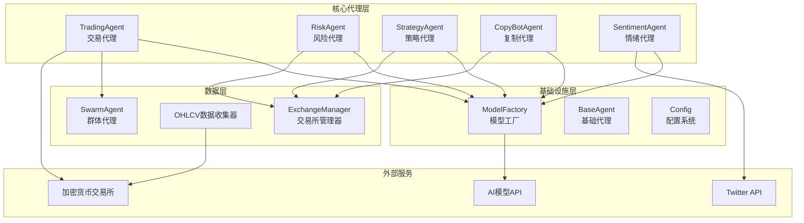
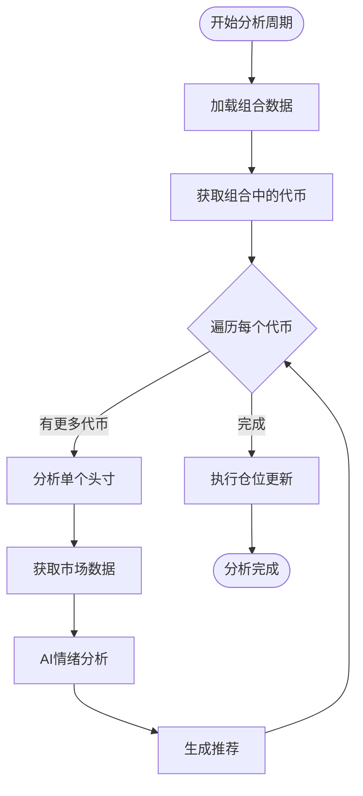

# API参考

<cite>
**本文档中引用的文件**
- [trading_agent.py](file://src/agents/trading_agent.py)
- [risk_agent.py](file://src/agents/risk_agent.py)
- [strategy_agent.py](file://src/agents/strategy_agent.py)
- [copybot_agent.py](file://src/agents/copybot_agent.py)
- [sentiment_agent.py](file://src/agents/sentiment_agent.py)
- [model_factory.py](file://src/models/model_factory.py)
- [base_agent.py](file://src/agents/base_agent.py)
- [swarm_agent.py](file://src/agents/swarm_agent.py)
- [config.py](file://src/config.py)
- [example_hybrid_agent.py](file://src/scripts/example_hybrid_agent.py)
- [example_strategy.py](file://src/strategies/custom/example_strategy.py)
</cite>

## 目录
1. [简介](#简介)
2. [项目架构概览](#项目架构概览)
3. [核心代理API](#核心代理api)
4. [模型工厂API](#模型工厂api)
5. [配置系统](#配置系统)
6. [使用示例](#使用示例)
7. [最佳实践](#最佳实践)
8. [故障排除](#故障排除)

## 简介

Moon Dev AI Agents是一个功能强大的AI驱动交易系统，提供了多个专门的代理来处理不同的交易任务。该系统采用模块化设计，支持多种AI模型，并提供了统一的接口来管理复杂的交易决策过程。

### 主要特性

- **多代理架构**：专门的代理处理不同类型的交易任务
- **多模型支持**：支持Claude、OpenAI、Grok、DeepSeek等多种AI模型
- **智能决策**：基于技术分析和策略信号的AI驱动决策
- **风险控制**：内置的风险管理和止损机制
- **实时监控**：持续监控市场情绪和交易状态

## 项目架构概览



**图表来源**
- [trading_agent.py](file://src/agents/trading_agent.py#L1-L50)
- [risk_agent.py](file://src/agents/risk_agent.py#L1-L50)
- [model_factory.py](file://src/models/model_factory.py#L1-L50)

## 核心代理API

### TradingAgent - 交易代理

TradingAgent是系统的核心组件，负责执行主要的交易决策和风险管理。

#### 公共接口

```python
class TradingAgent:
    def __init__(self):
        """初始化交易代理"""
        
    def analyze_market_data(self, token, market_data):
        """分析市场数据并生成交易建议
        
        Args:
            token: 要分析的代币地址或符号
            market_data: 包含OHLCV数据的DataFrame或字典
            
        Returns:
            dict: 包含交易建议的结果
        """
        
    def execute_trades(self, recommendations):
        """执行基于AI建议的交易
        
        Args:
            recommendations: 包含交易建议的DataFrame
        """
        
    def monitor_position_pnl(self, token, check_interval=PNL_CHECK_INTERVAL):
        """监控持仓盈亏
        
        Args:
            token: 要监控的代币
            check_interval: 检查间隔时间（秒）
            
        Returns:
            bool: 位置是否已关闭
        """
```

#### 关键方法详解

**analyze_market_data() 方法签名**
- **参数**：
  - `token`: str - 代币地址或交易对符号
  - `market_data`: pd.DataFrame 或 dict - 市场数据
- **返回值**：dict - 包含交易建议的字典
- **可能抛出的异常**：Exception - 当AI模型不可用时

**monitor_position_pnl() 方法签名**
- **参数**：
  - `token`: str - 要监控的代币
  - `check_interval`: int - 检查间隔（默认5秒）
- **返回值**：bool - 位置是否已关闭
- **用途**：自动监控持仓盈亏，触发止损和止盈

#### 使用场景

1. **高频交易决策**：使用单模型模式进行快速交易
2. **共识交易**：使用群体模式获得多个AI模型的共识
3. **风险管理**：监控持仓盈亏，自动执行止损/止盈

**章节来源**
- [trading_agent.py](file://src/agents/trading_agent.py#L600-L800)

### RiskAgent - 风险代理

RiskAgent负责监控和管理交易风险，确保交易符合预设的风险限制。

#### 公共接口

```python
class RiskAgent(BaseAgent):
    def __init__(self):
        """初始化风险代理"""
        
    def check_pnl_limits(self):
        """检查盈亏限制
        
        Returns:
            bool: 是否达到限制
        """
        
    def should_override_limit(self, limit_type):
        """判断是否应该突破限制
        
        Args:
            limit_type: 限制类型（最大损失/最大收益）
            
        Returns:
            bool: 是否应该突破限制
        """
        
    def close_all_positions(self):
        """关闭所有受监控的位置"""
        
    def handle_limit_breach(self, breach_type, current_value):
        """处理风险限制突破
        
        Args:
            breach_type: 突破类型
            current_value: 当前值
        """
```

#### 配置参数

| 参数 | 类型 | 默认值 | 描述 |
|------|------|--------|------|
| MAX_LOSS_USD | float | 25 | 最大损失限制（美元） |
| MAX_GAIN_USD | float | 25 | 最大收益限制（美元） |
| MINIMUM_BALANCE_USD | float | 50 | 最小余额限制 |
| USE_AI_CONFIRMATION | bool | True | 是否使用AI确认 |
| MAX_LOSS_PERCENT | float | 5 | 最大损失百分比 |
| MAX_GAIN_PERCENT | float | 5 | 最大收益百分比 |

#### 使用场景

1. **自动止损**：当达到预设的亏损限制时自动平仓
2. **收益保护**：锁定利润避免回吐
3. **AI辅助决策**：使用AI分析市场状况决定是否突破限制

**章节来源**
- [risk_agent.py](file://src/agents/risk_agent.py#L100-L300)

### StrategyAgent - 策略代理

StrategyAgent整合多个技术分析策略，通过AI评估策略信号的有效性。

#### 公共接口

```python
class StrategyAgent:
    def __init__(self):
        """初始化策略代理"""
        
    def get_signals(self, token):
        """获取并评估策略信号
        
        Args:
            token: 要分析的代币
            
        Returns:
            list: 审核后的策略信号列表
        """
        
    def evaluate_signals(self, signals, market_data):
        """评估策略信号的有效性
        
        Args:
            signals: 原始信号列表
            market_data: 市场数据
            
        Returns:
            dict: 包含评估结果的字典
        """
        
    def execute_strategy_signals(self, approved_signals):
        """执行批准的策略信号
        
        Args:
            approved_signals: 批准的信号列表
        """
```

#### 策略信号格式

```python
signal_format = {
    'token': '代币地址',
    'strategy_name': '策略名称',
    'signal': 0.85,        # 信号强度（0-1）
    'direction': 'BUY',     # 买入/卖出/持有
    'metadata': {
        'reason': '信号理由',
        'indicators': {
            'rsi': 28,
            'trend': 'bullish'
        }
    }
}
```

#### 使用场景

1. **多策略验证**：结合多个技术指标的信号
2. **信号过滤**：使用AI过滤低质量信号
3. **组合交易**：基于多个策略的综合建议

**章节来源**
- [strategy_agent.py](file://src/agents/strategy_agent.py#L50-L150)

### CopyBotAgent - 复制代理

CopyBotAgent分析现有的复制交易组合，识别增加仓位的机会。

#### 公共接口

```python
class CopyBotAgent:
    def __init__(self):
        """初始化复制代理"""
        
    def load_portfolio_data(self):
        """加载当前复制交易组合数据
        
        Returns:
            bool: 数据加载是否成功
        """
        
    def analyze_position(self, token):
        """分析单个组合头寸
        
        Args:
            token: 要分析的代币地址
            
        Returns:
            dict: 分析结果
        """
        
    def execute_position_updates(self):
        """执行仓位更新"""
        
    def run_analysis_cycle(self):
        """运行完整的组合分析周期"""
```

#### 分析流程



**图表来源**
- [copybot_agent.py](file://src/agents/copybot_agent.py#L250-L320)

#### 使用场景

1. **组合优化**：识别表现优异的头寸
2. **仓位调整**：根据分析结果调整仓位大小
3. **趋势跟踪**：监控热门代币的表现

**章节来源**
- [copybot_agent.py](file://src/agents/copybot_agent.py#L50-L150)

### SentimentAgent - 情绪代理

SentimentAgent监控Twitter上的市场情绪，使用自然语言处理分析代币相关讨论。

#### 公共接口

```python
class SentimentAgent:
    def __init__(self):
        """初始化情绪代理"""
        
    def analyze_sentiment(self, texts):
        """分析文本的情绪得分
        
        Args:
            texts: 要分析的文本列表
            
        Returns:
            float: 情绪得分（-1到1之间）
        """
        
    def analyze_and_announce_sentiment(self, tweets):
        """分析推文并宣布结果
        
        Args:
            tweets: 推文列表
        """
        
    def get_sentiment_change(self):
        """计算情绪变化
        
        Returns:
            tuple: (变化百分比, 时间差)
        """
        
    def run(self):
        """运行情绪分析主循环"""
```

#### 情绪分析参数

| 参数 | 类型 | 默认值 | 描述 |
|------|------|--------|------|
| SENTIMENT_ANNOUNCE_THRESHOLD | float | 0.4 | 重要情绪变化阈值 |
| TWEETS_PER_RUN | int | 30 | 每次运行收集的推文数 |
| CHECK_INTERVAL_MINUTES | int | 15 | 检查间隔（分钟） |
| VOICE_MODEL | str | "tts-1" | 语音合成模型 |
| VOICE_NAME | str | "nova" | 语音名称 |

#### 使用场景

1. **实时情绪监控**：持续监控市场情绪变化
2. **交易信号**：基于情绪变化生成交易信号
3. **风险预警**：检测负面情绪积累

**章节来源**
- [sentiment_agent.py](file://src/agents/sentiment_agent.py#L100-L200)

## 模型工厂API

ModelFactory是系统的核心组件，负责管理所有可用的AI模型并提供统一的接口。

### 公共接口

```python
class ModelFactory:
    def __init__(self):
        """初始化模型工厂"""
        
    def get_model(self, model_type: str, model_name: Optional[str] = None):
        """获取特定的模型实例
        
        Args:
            model_type: 模型类型（'claude', 'openai', 'groq'等）
            model_name: 可选的模型名称
            
        Returns:
            BaseModel: 模型实例或None
        """
        
    def available_models(self) -> Dict[str, list]:
        """获取所有可用模型的配置
        
        Returns:
            dict: 模型类型到可用模型列表的映射
        """
        
    def is_model_available(self, model_type: str) -> bool:
        """检查特定模型类型是否可用
        
        Args:
            model_type: 模型类型
            
        Returns:
            bool: 模型是否可用
        """
```

### 支持的模型类型

| 模型类型 | 提供商 | 默认模型 | 特点 |
|----------|--------|----------|------|
| claude | Anthropic | claude-3-5-haiku-latest | 快速推理，平衡性能 |
| openai | OpenAI | gpt-4o | 最新GPT-4优化版 |
| groq | Groq | mixtral-8x7b-32768 | 极快推理速度 |
| gemini | Google | gemini-2.5-flash | 新一代闪存模型 |
| deepseek | DeepSeek | deepseek-reasoner | 增强推理能力 |
| xai | xAI | grok-4-fast-reasoning | 高性价比选择 |
| ollama | 本地 | llama3.2 | 本地部署选项 |

### 使用示例

```python
# 获取模型工厂实例
from src.models.model_factory import model_factory

# 获取Claude模型
claude_model = model_factory.get_model('claude', 'claude-3-5-sonnet-latest')

# 获取OpenAI模型
openai_model = model_factory.get_model('openai', 'gpt-4o')

# 检查模型可用性
if model_factory.is_model_available('groq'):
    groq_model = model_factory.get_model('groq')

# 获取所有可用模型
available = model_factory.available_models
```

### 模型配置

```python
# 模型工厂配置示例
MODEL_IMPLEMENTATIONS = {
    "claude": ClaudeModel,
    "groq": GroqModel,
    "openai": OpenAIModel,
    "gemini": GeminiModel,
    "deepseek": DeepSeekModel,
    "ollama": OllamaModel,
    "xai": XAIModel,
    "openrouter": OpenRouterModel
}

DEFAULT_MODELS = {
    "claude": "claude-3-5-haiku-latest",
    "groq": "mixtral-8x7b-32768",
    "openai": "gpt-4o",
    "gemini": "gemini-2.5-flash",
    "deepseek": "deepseek-reasoner",
    "ollama": "llama3.2",
    "xai": "grok-4-fast-reasoning",
    "openrouter": "google/gemini-2.5-flash"
}
```

**章节来源**
- [model_factory.py](file://src/models/model_factory.py#L100-L200)

## 配置系统

系统使用集中式配置管理，所有设置都存储在config.py文件中。

### 核心配置参数

#### 交易配置

| 参数 | 类型 | 默认值 | 描述 |
|------|------|--------|------|
| EXCHANGE | str | 'solana' | 交易所选择（solana, hyperliquid） |
| usd_size | float | 25 | 单个头寸的目标金额 |
| MAX_POSITION_PERCENTAGE | float | 30 | 最大头寸百分比（0-100） |
| CASH_PERCENTAGE | float | 20 | 最小现金缓冲百分比 |
| SLIPPAGE | int | 199 | 滑点容忍度（199=2%） |

#### 风险管理配置

| 参数 | 类型 | 默认值 | 描述 |
|------|------|--------|------|
| MAX_LOSS_USD | float | 25 | 最大损失限制（美元） |
| MAX_GAIN_USD | float | 25 | 最大收益限制（美元） |
| MINIMUM_BALANCE_USD | float | 50 | 最小余额限制 |
| STOP_LOSS_PERCENTAGE | float | 5.0 | 止损百分比 |
| TAKE_PROFIT_PERCENTAGE | float | 5.0 | 止盈百分比 |

#### AI模型配置

| 参数 | 类型 | 默认值 | 描述 |
|------|------|--------|------|
| AI_MODEL | str | 'claude-3-haiku-20240307' | 默认AI模型 |
| AI_TEMPERATURE | float | 0.7 | 创意vs精确度（0-1） |
| AI_MAX_TOKENS | int | 1024 | AI响应的最大令牌数 |

### 环境变量配置

系统使用.env文件存储API密钥：

```
ANTHROPIC_KEY=your_claude_api_key
OPENAI_KEY=your_openai_api_key
GROQ_API_KEY=your_groq_api_key
GEMINI_KEY=your_gemini_api_key
DEEPSEEK_KEY=your_deepseek_api_key
GROK_API_KEY=your_xai_api_key
OPENROUTER_API_KEY=your_openrouter_api_key
```

**章节来源**
- [config.py](file://src/config.py#L1-L135)

## 使用示例

### 基础交易代理使用

```python
from src.agents.trading_agent import TradingAgent
from src.models.model_factory import model_factory

# 初始化交易代理
trading_agent = TradingAgent()

# 分析市场数据
market_data = get_market_data('9BB6NFEcjBCtnNLFko2FqVQBq8HHM13kCyYcdQbgpump')
result = trading_agent.analyze_market_data('9BB6NFEcjBCtnNLFko2FqVQBq8HHM13kCyYcdQbgpump', market_data)

# 执行交易
if result and result['action'] == 'BUY':
    trading_agent.execute_trades(result)
```

### 风险代理使用

```python
from src.agents.risk_agent import RiskAgent

# 初始化风险代理
risk_agent = RiskAgent()

# 检查风险限制
if risk_agent.check_pnl_limits():
    risk_agent.handle_limit_breach("PNL_USD", current_pnl)
```

### 策略代理使用

```python
from src.agents.strategy_agent import StrategyAgent

# 初始化策略代理
strategy_agent = StrategyAgent()

# 获取策略信号
signals = strategy_agent.get_signals('9BB6NFEcjBCtnNLFko2FqVQBq8HHM13kCyYcdQbgpump')

# 执行策略信号
strategy_agent.execute_strategy_signals(signals)
```

### 情绪代理使用

```python
from src.agents.sentiment_agent import SentimentAgent

# 初始化情绪代理
sentiment_agent = SentimentAgent()

# 运行情绪分析
sentiment_agent.run()
```

### 群体代理使用

```python
from src.agents.swarm_agent import SwarmAgent

# 初始化群体代理
swarm = SwarmAgent()

# 查询群体意见
result = swarm.query("Should I buy Bitcoin now?", 
                    system_prompt="You are a cryptocurrency trading advisor.")

# 获取共识总结
consensus = result["consensus_summary"]
individual_responses = result["responses"]
```

**章节来源**
- [example_hybrid_agent.py](file://src/scripts/example_hybrid_agent.py#L50-L150)

## 最佳实践

### 1. 模型选择指南

- **快速交易**：使用Groq或Ollama模型
- **高精度决策**：使用Claude或GPT-4模型  
- **成本敏感**：使用DeepSeek或Ollama模型
- **复杂分析**：使用群体模式（Swarm）

### 2. 风险管理原则

- **分散投资**：不要将所有资金投入单一资产
- **止损设置**：始终设置合理的止损水平
- **定期监控**：持续监控账户状态和市场条件
- **AI辅助**：利用AI进行风险评估和决策

### 3. 性能优化

- **缓存策略**：合理使用数据缓存减少API调用
- **批量操作**：合并相似的交易请求
- **异步处理**：使用异步模式提高效率
- **资源管理**：监控内存和CPU使用情况

### 4. 错误处理

```python
def safe_execute(agent_method, *args, **kwargs):
    """安全执行代理方法"""
    try:
        return agent_method(*args, **kwargs)
    except Exception as e:
        logger.error(f"Agent execution failed: {e}")
        # 实现重试逻辑或降级方案
        return None
```

## 故障排除

### 常见问题及解决方案

#### 1. API密钥错误

**症状**：模型初始化失败
**解决方案**：
- 检查.env文件中的API密钥
- 确认密钥有效且未过期
- 验证网络连接

#### 2. 模型不可用

**症状**：get_model返回None
**解决方案**：
- 检查模型类型拼写
- 验证API密钥权限
- 查看模型工厂日志

#### 3. 交易执行失败

**症状**：交易无法执行
**解决方案**：
- 检查账户余额
- 验证交易所连接
- 确认滑点设置合理

#### 4. 内存不足

**症状**：程序崩溃或缓慢
**解决方案**：
- 减少并发请求数量
- 清理临时数据
- 优化数据结构

### 调试技巧

1. **启用详细日志**：设置DEBUG级别日志
2. **分步测试**：单独测试每个组件
3. **监控资源**：使用系统监控工具
4. **单元测试**：编写测试用例验证功能

### 性能监控

```python
import time
import psutil

def monitor_performance():
    """监控系统性能"""
    cpu_percent = psutil.cpu_percent()
    memory_percent = psutil.virtual_memory().percent
    disk_usage = psutil.disk_usage('/').percent
    
    print(f"CPU: {cpu_percent}%, Memory: {memory_percent}%, Disk: {disk_usage}%")
```

## 结论

Moon Dev AI Agents提供了一个强大而灵活的框架，用于构建智能交易系统。通过模块化的代理设计、统一的模型管理以及丰富的配置选项，开发者可以轻松地创建和部署复杂的交易策略。

### 关键优势

- **模块化设计**：每个代理专注于特定功能
- **多模型支持**：灵活选择最适合的AI模型
- **风险控制**：内置全面的风险管理机制
- **易于扩展**：清晰的接口便于添加新功能

### 发展方向

- **更多交易所支持**：扩展到其他加密货币交易所
- **高级策略**：集成更复杂的技术分析策略
- **实时数据**：支持实时市场数据流
- **机器学习**：集成强化学习算法优化策略

通过遵循本文档的指导和最佳实践，开发者可以充分利用这个系统的强大功能，构建出高效、可靠的AI交易解决方案。