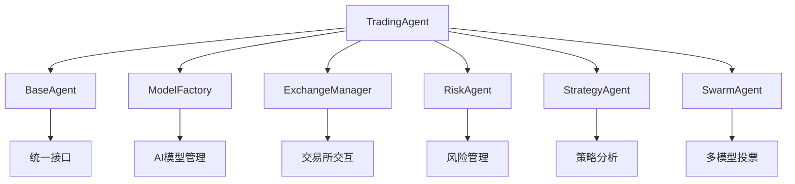
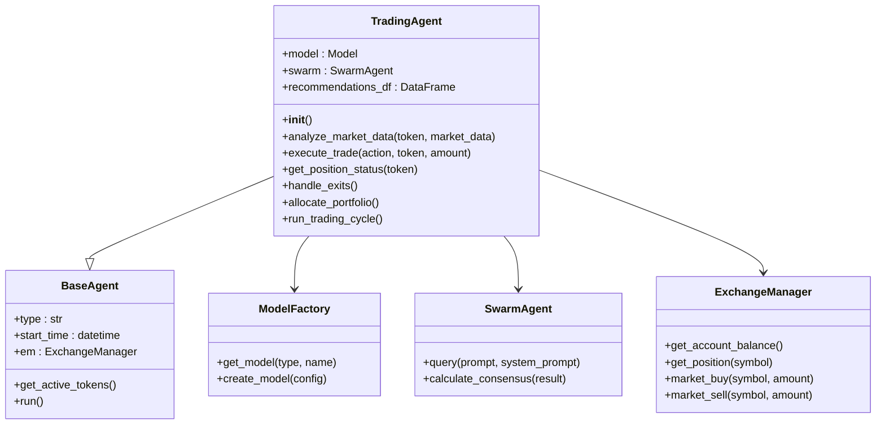
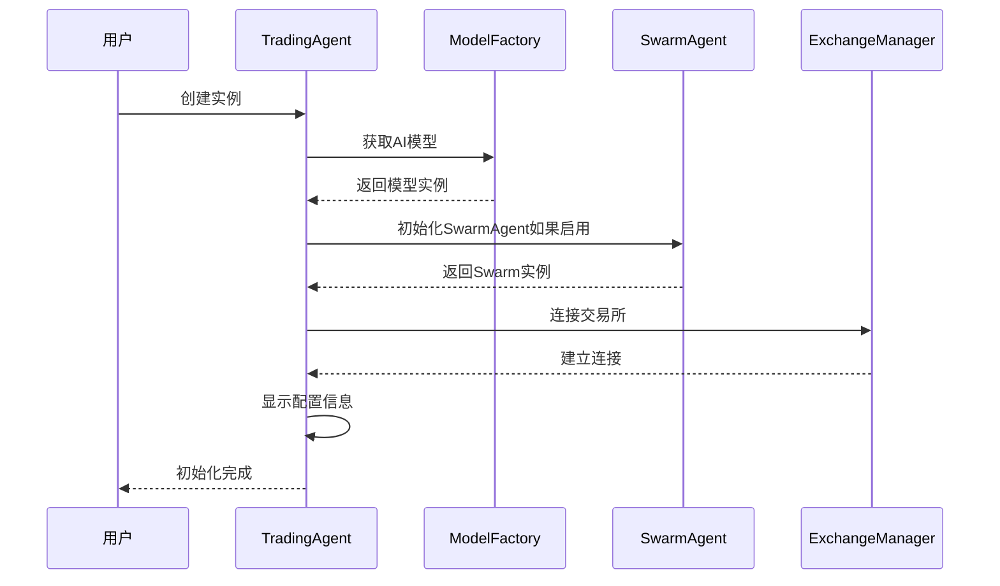
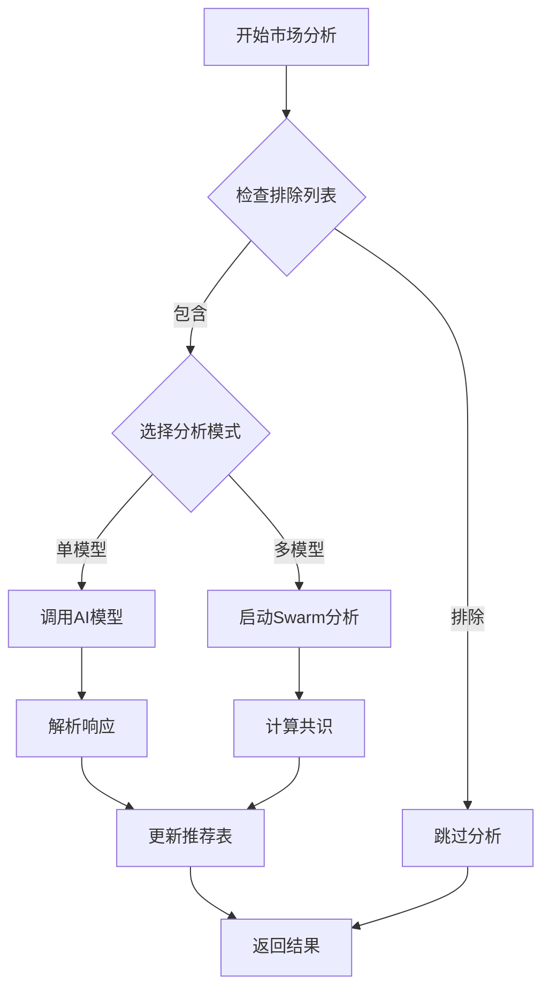
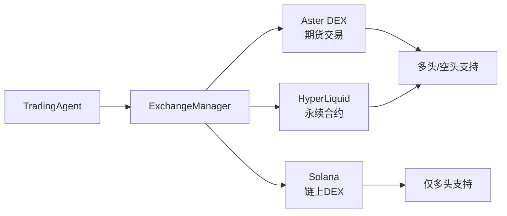
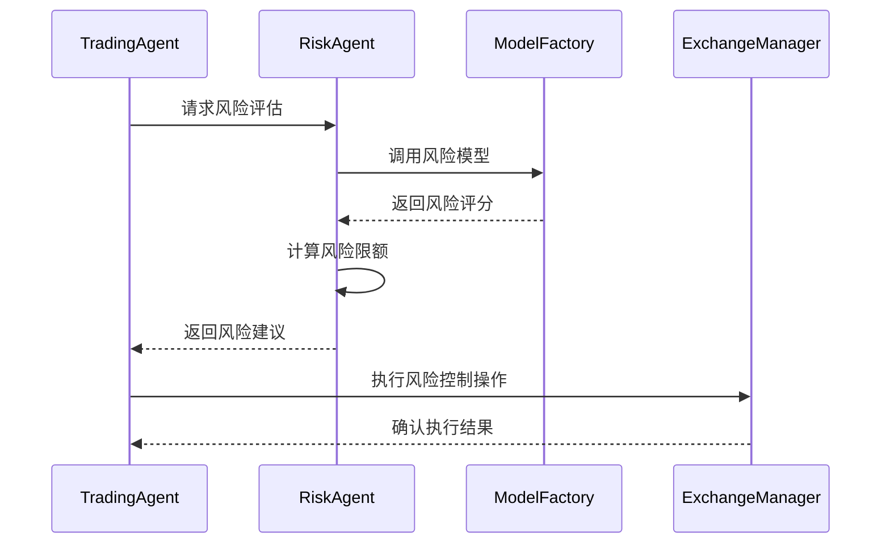
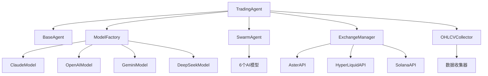

# 交易代理API

<cite>
**本文档中引用的文件**
- [trading_agent.py](file://src/agents/trading_agent.py)
- [base_agent.py](file://src/agents/base_agent.py)
- [risk_agent.py](file://src/agents/risk_agent.py)
- [strategy_agent.py](file://src/agents/strategy_agent.py)
- [model_factory.py](file://src/models/model_factory.py)
- [config.py](file://src/config.py)
- [nice_funcs_extended.py](file://src/nice_funcs_extended.py)
</cite>

## 目录
1. [简介](#简介)
2. [项目结构](#项目结构)
3. [核心组件](#核心组件)
4. [架构概览](#架构概览)
5. [详细组件分析](#详细组件分析)
6. [依赖关系分析](#依赖关系分析)
7. [性能考虑](#性能考虑)
8. [故障排除指南](#故障排除指南)
9. [结论](#结论)

## 简介

TradingAgent是Moon Dev AI交易系统的核心组件，基于大语言模型（LLM）的智能交易代理。该代理支持双重模式操作：单模型快速执行模式和多模型共识投票模式，能够与多个加密货币交易所（Aster、HyperLiquid、Solana）进行交互，执行复杂的交易决策。

该代理的主要特点包括：
- **双模式架构**：支持单模型快速决策和6模型共识投票
- **多交易所支持**：兼容Aster DEX、HyperLiquid和Solana
- **智能风险管理**：内置止损、止盈和仓位管理机制
- **AI驱动决策**：利用先进的AI模型进行市场分析和交易信号生成
- **策略集成**：可与多种交易策略协同工作

## 项目结构

TradingAgent位于`src/agents/`目录下，与其他AI代理共同构成了Moon Dev的完整交易生态系统。



**图表来源**
- [trading_agent.py](file://src/agents/trading_agent.py#L1-L50)
- [base_agent.py](file://src/agents/base_agent.py#L1-L30)

**章节来源**
- [trading_agent.py](file://src/agents/trading_agent.py#L1-L100)
- [base_agent.py](file://src/agents/base_agent.py#L1-L58)

## 核心组件

### TradingAgent类

TradingAgent是整个交易系统的核心控制器，继承自BaseAgent并实现了完整的交易生命周期管理。

#### 主要特性
- **智能决策引擎**：支持单模型和多模型决策模式
- **动态配置系统**：运行时可切换不同交易模式
- **实时监控**：持续跟踪持仓表现和市场条件
- **风险控制**：内置止损、止盈和仓位限制机制

#### 配置参数

| 参数名称 | 类型 | 默认值 | 描述 |
|---------|------|--------|------|
| EXCHANGE | str | "ASTER" | 目标交易所：ASTER、HYPERLIQUID、SOLANA |
| USE_SWARM_MODE | bool | True | 是否启用6模型共识模式 |
| LONG_ONLY | bool | True | 是否仅支持多头交易 |
| MAX_POSITION_PERCENTAGE | float | 90 | 单笔交易最大仓位百分比 |
| LEVERAGE | int | 9 | 杠杆倍数（1-125x） |
| STOP_LOSS_PERCENTAGE | float | 5.0 | 止损百分比 |
| TAKE_PROFIT_PERCENTAGE | float | 5.0 | 止盈百分比 |

**章节来源**
- [trading_agent.py](file://src/agents/trading_agent.py#L66-L120)

## 架构概览

TradingAgent采用模块化架构设计，各组件职责明确，通过清晰的接口进行通信。



**图表来源**
- [trading_agent.py](file://src/agents/trading_agent.py#L400-L500)
- [base_agent.py](file://src/agents/base_agent.py#L10-L40)

## 详细组件分析

### 初始化过程

TradingAgent的初始化过程包含多个关键步骤，确保系统在启动时具备完整的功能。



**图表来源**
- [trading_agent.py](file://src/agents/trading_agent.py#L400-L480)

#### 核心方法详解

##### execute_trade 方法

执行具体的交易操作，支持买入、卖出和持有三种动作。

**方法签名**：
```python
def execute_trade(self, action: str, token: str, amount: float, leverage: int = None)
```

**参数说明**：
- `action`: 交易动作，可选值："BUY"、"SELL"、"NOTHING"
- `token`: 交易标的物标识符
- `amount`: 交易金额（美元）
- `leverage`: 杠杆倍数（仅在支持杠杆的交易所使用）

**返回值**：
- `bool`: 操作是否成功执行

**异常处理**：
- 交易失败时自动记录错误日志
- 支持重试机制防止临时性网络问题
- 提供详细的错误信息用于调试

##### analyze_market 方法

分析市场数据并生成交易建议，支持单模型和多模型两种分析模式。

**方法签名**：
```python
def analyze_market_data(self, token: str, market_data: dict) -> dict
```

**输入参数**：
- `token`: 分析的目标代币
- `market_data`: 包含OHLCV数据和策略信号的字典

**输出格式**：
```python
{
    'token': str,
    'action': str,      # BUY/SELL/NOTHING
    'confidence': int,  # 置信度百分比
    'reasoning': str    # 详细分析理由
}
```

**算法流程**：


**图表来源**
- [trading_agent.py](file://src/agents/trading_agent.py#L600-L750)

##### get_position_status 方法

获取指定代币的当前持仓状态，包括持仓数量、盈亏情况和风险指标。

**方法签名**：
```python
def get_position_status(self, token: str) -> dict
```

**返回格式**：
```python
{
    'position_amount': float,      # 持仓数量（正为多头，负为空头）
    'entry_price': float,          # 开仓价格
    'mark_price': float,           # 标记价格
    'pnl': float,                  # 盈亏金额
    'pnl_percentage': float,       # 盈亏百分比
    'is_long': bool,               # 是否为多头持仓
    'leverage': int,               # 使用的杠杆倍数
    'margin_used': float,          # 已用保证金
    'margin_available': float      # 可用保证金
}
```

**章节来源**
- [trading_agent.py](file://src/agents/trading_agent.py#L400-L800)

### 与ExchangeManager的交互

TradingAgent通过ExchangeManager与不同的加密货币交易所进行交互，支持多种交易模式和资产类型。

#### 交易所适配层



**图表来源**
- [trading_agent.py](file://src/agents/trading_agent.py#L200-L250)

#### 仓位管理机制

TradingAgent实现了智能的仓位管理系统，根据账户余额和风险偏好动态调整每笔交易的规模。

**仓位计算公式**：
- **Aster/HyperLiquid**：`notional_position = margin × leverage`
- **Solana**：`position_size = balance × position_percentage`

**章节来源**
- [trading_agent.py](file://src/agents/trading_agent.py#L350-L400)

### AI决策支持系统

#### ModelFactory集成

TradingAgent通过ModelFactory获取AI模型支持，支持多种主流AI提供商。

**支持的模型类型**：
- **Anthropic Claude**: claude-3-5-haiku-latest（默认）
- **OpenAI**: gpt-4o（最新优化版）
- **Google Gemini**: gemini-2.5-flash（快速闪回）
- **DeepSeek**: deepseek-reasoner（推理增强）
- **Groq**: mixtral-8x7b-32768（快速混合专家）
- **xAI**: grok-4-fast-reasoning（快速推理）
- **Ollama**: llama3.2（本地推理）

**章节来源**
- [model_factory.py](file://src/models/model_factory.py#L23-L53)

#### Swarm模式分析

当启用Swarm模式时，TradingAgent会同时查询6个不同的AI模型，通过投票机制得出最终决策。

**投票机制**：
1. 每个模型独立分析市场数据
2. 投票结果统计：BUY、SELL、DO NOTHING
3. 多数决定原则确定最终行动
4. 计算共识置信度百分比

**章节来源**
- [trading_agent.py](file://src/agents/trading_agent.py#L650-L720)

### 风险代理集成

TradingAgent与RiskAgent紧密协作，实现全面的风险管理体系。



**图表来源**
- [risk_agent.py](file://src/agents/risk_agent.py#L100-L200)

### 策略代理协同

TradingAgent可以与StrategyAgent配合，利用多种技术分析策略生成更精确的交易信号。

**策略集成流程**：
1. StrategyAgent收集多个技术指标信号
2. TradingAgent整合策略信号与市场数据
3. 统一分析框架生成最终决策
4. 实现策略间的相互验证和过滤

**章节来源**
- [strategy_agent.py](file://src/agents/strategy_agent.py#L100-L200)

## 依赖关系分析

TradingAgent的依赖关系复杂但结构清晰，主要依赖关系如下：



**图表来源**
- [trading_agent.py](file://src/agents/trading_agent.py#L1-L100)
- [base_agent.py](file://src/agents/base_agent.py#L1-L30)

**章节来源**
- [trading_agent.py](file://src/agents/trading_agent.py#L1-L150)

## 性能考虑

### 内存管理

TradingAgent实现了高效的内存管理策略，特别是在处理大量市场数据时。

**优化措施**：
- 数据帧及时清理，避免内存泄漏
- 暂时数据文件自动删除机制
- 大数据集分批处理

### 并发处理

在Swarm模式下，TradingAgent支持并发AI请求，显著提升分析效率。

**并发策略**：
- 6个AI模型同时查询
- 异步响应处理
- 超时控制和错误恢复

### 网络优化

- 连接池复用减少握手开销
- 智能重试机制避免临时网络故障
- 缓存机制减少重复请求

## 故障排除指南

### 常见问题及解决方案

#### AI模型连接失败

**症状**：无法初始化AI模型或收到连接超时错误

**解决方案**：
1. 检查API密钥配置
2. 验证网络连接状态
3. 确认模型可用性
4. 查看错误日志获取详细信息

#### 交易所连接问题

**症状**：无法获取账户信息或执行交易

**解决方案**：
1. 验证交易所配置参数
2. 检查钱包地址和权限
3. 确认网络节点可用性
4. 查看交易所特定的错误码

#### 仓位管理错误

**症状**：仓位大小超出限制或计算错误

**解决方案**：
1. 检查账户余额和保证金要求
2. 验证杠杆设置合理性
3. 确认风险参数配置正确
4. 查看仓位历史记录

**章节来源**
- [trading_agent.py](file://src/agents/trading_agent.py#L1100-L1196)

## 结论

TradingAgent作为Moon Dev AI交易系统的核心组件，展现了现代AI驱动交易系统的先进设计理念。其模块化架构、智能决策机制和全面的风险管理体系，为量化交易提供了强大而可靠的基础设施。

### 主要优势

1. **灵活性**：支持多种交易模式和配置选项
2. **可靠性**：完善的错误处理和恢复机制
3. **扩展性**：模块化设计便于功能扩展
4. **安全性**：多层次风险控制保障资金安全

### 应用场景

- **高频交易**：单模型模式适合快速决策
- **稳健交易**：Swarm模式提供更高置信度
- **多资产组合**：支持复杂的资产配置策略
- **风险管理**：内置全面的风险控制机制

TradingAgent不仅是一个交易工具，更是AI与金融工程结合的典范，为未来的智能交易系统发展奠定了坚实基础。