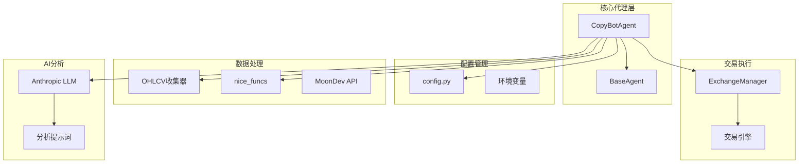
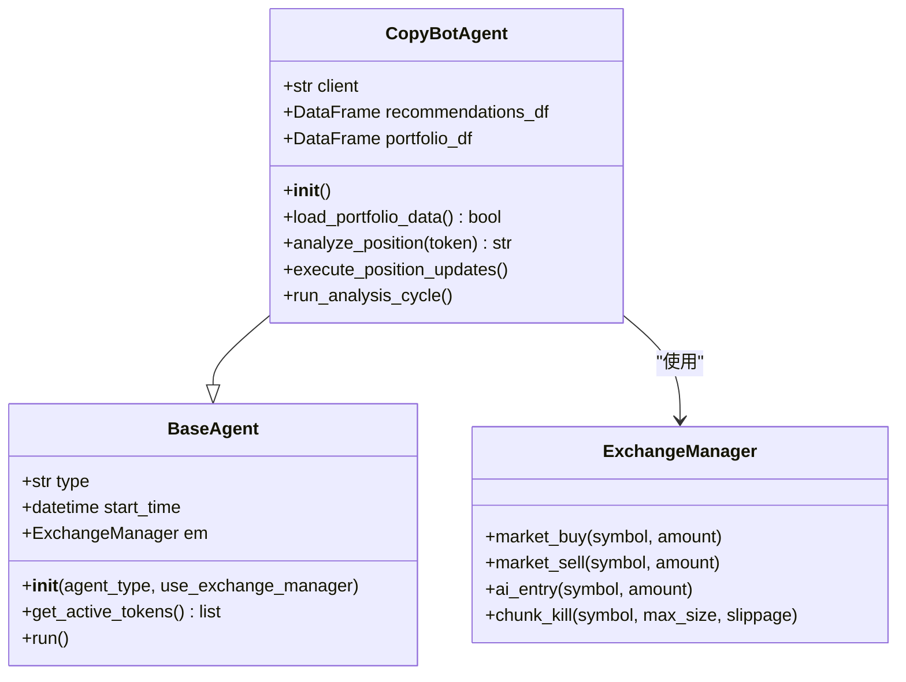
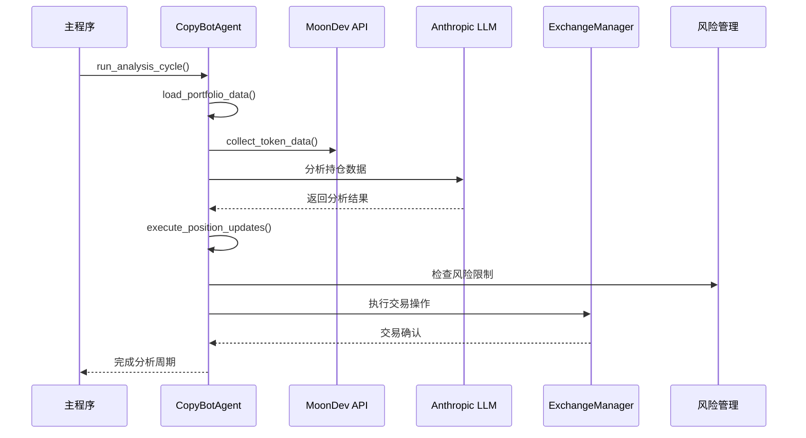
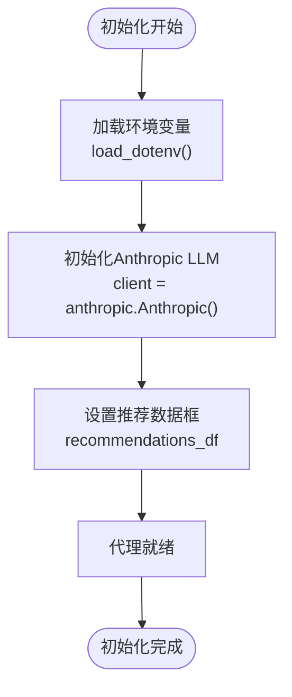
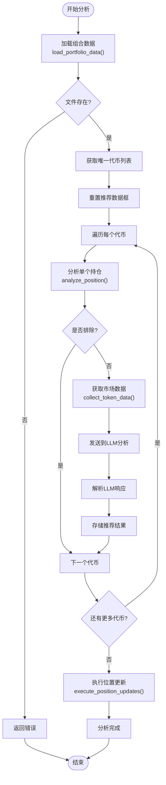
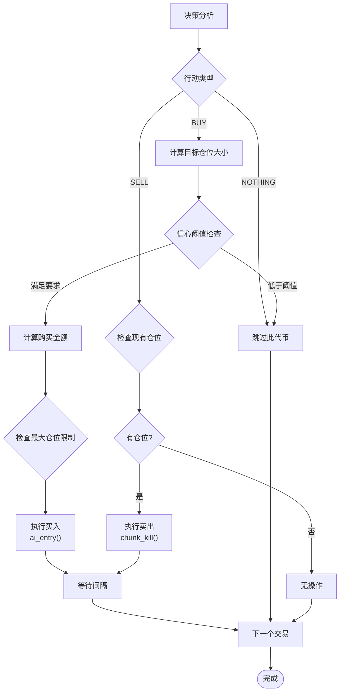
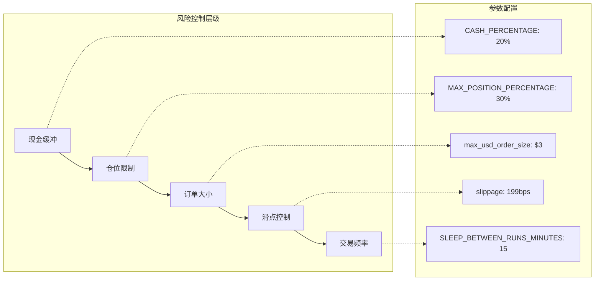
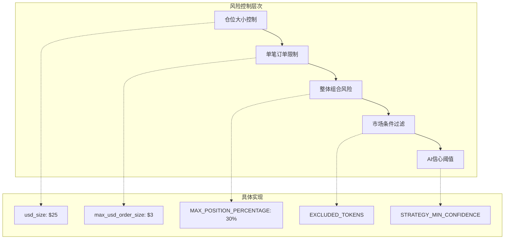
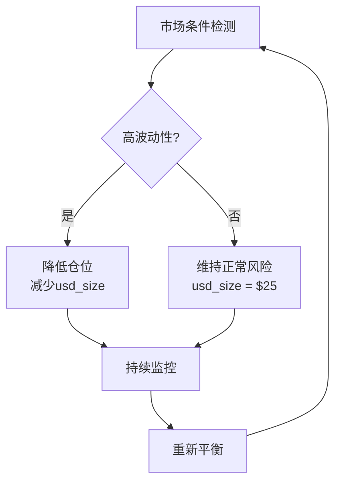

# 复制代理API

<cite>
**本文档中引用的文件**
- [copybot_agent.py](file://src/agents/copybot_agent.py)
- [base_agent.py](file://src/agents/base_agent.py)
- [config.py](file://src/config.py)
- [nice_funcs.py](file://src/nice_funcs.py)
- [ohlcv_collector.py](file://src/data/ohlcv_collector.py)
- [main.py](file://src/main.py)
- [api.py](file://src/agents/api.py)
</cite>

## 目录
1. [简介](#简介)
2. [项目结构](#项目结构)
3. [核心组件](#核心组件)
4. [架构概览](#架构概览)
5. [详细组件分析](#详细组件分析)
6. [配置选项](#配置选项)
7. [使用示例](#使用示例)
8. [风险管理集成](#风险管理集成)
9. [故障排除指南](#故障排除指南)
10. [结论](#结论)

## 简介

CopybotAgent是Moon Dev开发的智能复制交易代理，专门用于分析当前复制交易组合并识别增加头寸规模的机会。该代理通过人工智能分析市场数据和技术指标，为每个持仓提供买入、卖出或持有建议，并自动执行相应的交易操作。

### 主要功能特性

- **智能持仓分析**：基于AI的持仓表现评估
- **实时市场监控**：持续监控目标交易员的活动
- **自动化交易执行**：根据分析结果自动执行买卖操作
- **风险管理集成**：内置风险控制机制
- **多交易所支持**：支持Solana和HyperLiquid交易所

## 项目结构

CopybotAgent在Moon Dev AI交易系统中的组织结构如下：



**图表来源**
- [copybot_agent.py](file://src/agents/copybot_agent.py#L64-L97)
- [base_agent.py](file://src/agents/base_agent.py#L10-L30)
- [config.py](file://src/config.py#L1-L50)

**章节来源**
- [copybot_agent.py](file://src/agents/copybot_agent.py#L1-L30)
- [main.py](file://src/main.py#L1-L30)

## 核心组件

### CopyBotAgent类

CopyBotAgent是系统的核心类，负责整个复制交易流程的管理：



**图表来源**
- [copybot_agent.py](file://src/agents/copybot_agent.py#L64-L97)
- [base_agent.py](file://src/agents/base_agent.py#L10-L30)

**章节来源**
- [copybot_agent.py](file://src/agents/copybot_agent.py#L64-L97)
- [base_agent.py](file://src/agents/base_agent.py#L10-L30)

## 架构概览

CopybotAgent采用模块化架构设计，各组件职责明确：



**图表来源**
- [copybot_agent.py](file://src/agents/copybot_agent.py#L280-L321)
- [main.py](file://src/main.py#L69-L103)

## 详细组件分析

### 初始化和配置

CopyBotAgent的初始化过程包括加载环境变量、建立LLM连接和准备数据结构：



**图表来源**
- [copybot_agent.py](file://src/agents/copybot_agent.py#L69-L75)

### 组合数据分析流程

CopyBotAgent的核心功能是分析投资组合持仓并提供交易建议：



**图表来源**
- [copybot_agent.py](file://src/agents/copybot_agent.py#L280-L321)

### LLM分析提示词系统

CopyBotAgent使用精心设计的提示词来指导AI分析：

| 分析要素 | 描述 | 输入格式 |
|---------|------|----------|
| 组合数据 | 当前持仓和性能指标 | 位置数据表格 |
| 市场数据 | OHLCV技术指标 | 时间序列数据 |
| 技术指标 | 移动平均线状态 | MA20, MA40, 上穿/下穿 |
| 风险评估 | 最大回撤和波动性 | 统计指标 |
| 市场条件 | 整体市场趋势 | 环境信息 |

**章节来源**
- [copybot_agent.py](file://src/agents/copybot_agent.py#L25-L60)

### 交易执行机制

CopyBotAgent支持多种交易执行模式：



**图表来源**
- [copybot_agent.py](file://src/agents/copybot_agent.py#L150-L220)

**章节来源**
- [copybot_agent.py](file://src/agents/copybot_agent.py#L150-L220)

## 配置选项

### 基础配置参数

CopybotAgent的配置通过`config.py`文件管理：

| 参数名称 | 类型 | 默认值 | 描述 |
|---------|------|--------|------|
| `usd_size` | float | 25 | 单个头寸的目标美元金额 |
| `max_usd_order_size` | float | 3 | 最大单笔订单金额 |
| `tx_sleep` | int | 30 | 交易间休眠时间（秒） |
| `slippage` | int | 199 | 滑点容忍度（基点） |
| `CASH_PERCENTAGE` | int | 20 | 保持在USDC中的最小百分比 |
| `MAX_POSITION_PERCENTAGE` | int | 30 | 单个头寸的最大分配百分比 |

### 风险管理配置



**图表来源**
- [config.py](file://src/config.py#L50-L80)

### AI模型配置

CopybotAgent使用Anthropic的Claude模型进行智能分析：

| 设置项 | 值 | 用途 |
|-------|-----|------|
| `AI_MODEL` | "claude-3-haiku-20240307" | 快速高效的分析模型 |
| `AI_MAX_TOKENS` | 1024 | 最大响应令牌数 |
| `AI_TEMPERATURE` | 0.7 | 创意与精确度平衡 |

**章节来源**
- [config.py](file://src/config.py#L50-L135)
- [copybot_agent.py](file://src/agents/copybot_agent.py#L69-L75)

## 使用示例

### 基本使用流程

以下是使用CopybotAgent的基本步骤：

```python
# 1. 导入代理
from src.agents.copybot_agent import CopyBotAgent

# 2. 创建实例
analyzer = CopyBotAgent()

# 3. 运行完整分析周期
analyzer.run_analysis_cycle()
```

### 配置复制关系

```python
# 在config.py中配置复制参数
# 复制比例设置
REPLICATION_RATIO = 1.0  # 1:1复制比例

# 资金分配策略
FUNDING_ALLOCATION = {
    'high_confidence': 0.4,  # 高信心交易占总资金的40%
    'medium_confidence': 0.3,  # 中等信心占30%
    'low_confidence': 0.2,  # 低信心占20%
    'conservative': 0.1  # 保守策略占10%
}

# 延迟设置
TRADE_DELAY = {
    'immediate': 0,  # 立即执行
    'short_delay': 5,  # 5分钟延迟
    'long_delay': 15  # 15分钟延迟
}
```

### 启动复制会话

```python
# 在主程序中启用CopybotAgent
from src.main import ACTIVE_AGENTS

# 启用CopybotAgent
ACTIVE_AGENTS['copybot'] = True

# 运行系统
from src.main import run_agents
run_agents()
```

**章节来源**
- [main.py](file://src/main.py#L25-L45)
- [copybot_agent.py](file://src/agents/copybot_agent.py#L315-L321)

## 风险管理集成

### 内置风险控制机制

CopybotAgent集成了多层次的风险管理：



**图表来源**
- [config.py](file://src/config.py#L50-L80)
- [copybot_agent.py](file://src/agents/copybot_agent.py#L170-L190)

### 复制操作风险限制

| 风险维度 | 控制措施 | 实现方式 |
|---------|---------|----------|
| 仓位集中度 | 最大仓位百分比 | `MAX_POSITION_PERCENTAGE` |
| 单笔交易风险 | 订单大小限制 | `max_usd_order_size` |
| 总体资金安全 | 现金缓冲 | `CASH_PERCENTAGE` |
| AI决策质量 | 信心阈值 | `STRATEGY_MIN_CONFIDENCE` |
| 市场流动性 | 排除列表 | `EXCLUDED_TOKENS` |

### 动态风险调整

CopybotAgent能够根据市场条件动态调整风险参数：



**章节来源**
- [config.py](file://src/config.py#L50-L80)
- [copybot_agent.py](file://src/agents/copybot_agent.py#L170-L190)

## 故障排除指南

### 常见问题及解决方案

#### 1. API密钥配置问题

**问题症状**：
```
❌ Error loading portfolio data: anthropic.AnthropicKeyError
```

**解决方案**：
- 确保`.env`文件包含有效的Anthropic API密钥
- 检查环境变量是否正确加载
- 验证API配额是否充足

#### 2. 组合文件路径错误

**问题症状**：
```
❌ Portfolio file not found: /path/to/portfolio.csv
```

**解决方案**：
- 检查`COPYBOT_PORTFOLIO_PATH`配置
- 确认CSV文件格式正确
- 验证文件权限设置

#### 3. 市场数据获取失败

**问题症状**：
```
❌ Error collecting OHLCV data: Network timeout
```

**解决方案**：
- 检查网络连接
- 验证Birdeye API密钥
- 尝试增加请求超时时间

#### 4. 交易执行失败

**问题症状**：
```
❌ Trade execution failed for token
```

**解决方案**：
- 检查账户余额和授权
- 验证滑点设置是否合理
- 确认交易所连接状态

### 调试和监控

CopybotAgent提供了详细的日志输出用于调试：

```python
# 启用详细日志
import logging
logging.basicConfig(level=logging.DEBUG)

# 关键监控点
DEBUG_POINTS = [
    'Portfolio data loaded',
    'Market data collected',
    'LLM analysis complete',
    'Trade executed',
    'Risk check passed'
]
```

**章节来源**
- [copybot_agent.py](file://src/agents/copybot_agent.py#L80-L120)
- [config.py](file://src/config.py#L1-L50)

## 结论

CopybotAgent是一个功能完善的智能复制交易系统，具有以下优势：

### 核心优势

1. **智能化分析**：基于先进的AI模型进行持仓分析
2. **自动化执行**：完全自动化的交易执行流程
3. **风险控制**：多层次的风险管理机制
4. **灵活配置**：丰富的配置选项适应不同需求
5. **多交易所支持**：支持Solana和HyperLiquid

### 应用场景

- **量化交易**：为专业交易者提供自动化复制服务
- **机构投资**：帮助机构投资者分散风险
- **个人理财**：为个人投资者提供智能投顾服务
- **研究分析**：作为交易策略研究和验证平台

### 发展方向

CopybotAgent将继续发展，计划添加的功能包括：
- 更多AI模型支持
- 实时交易信号推送
- 组合优化算法
- 更精细的风险控制

通过本文档的详细介绍，用户可以全面了解CopybotAgent的功能特性和使用方法，为实际应用提供指导。