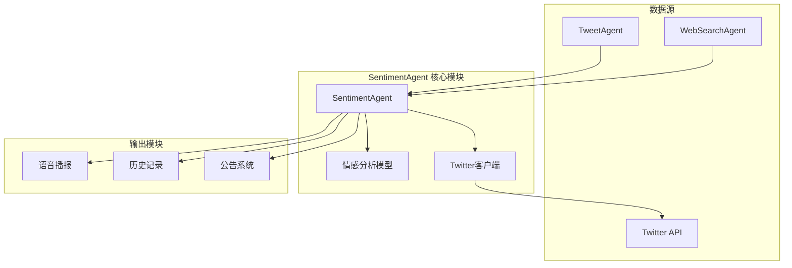
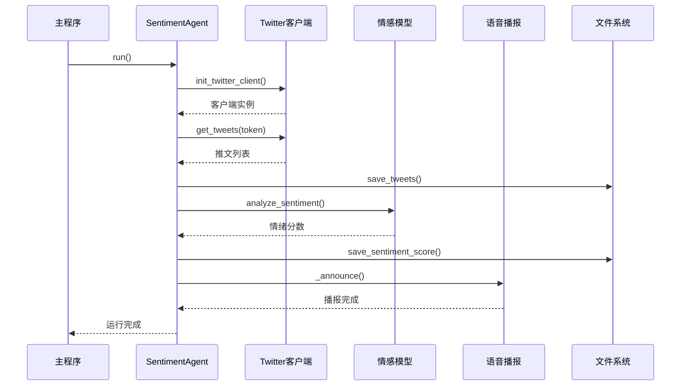
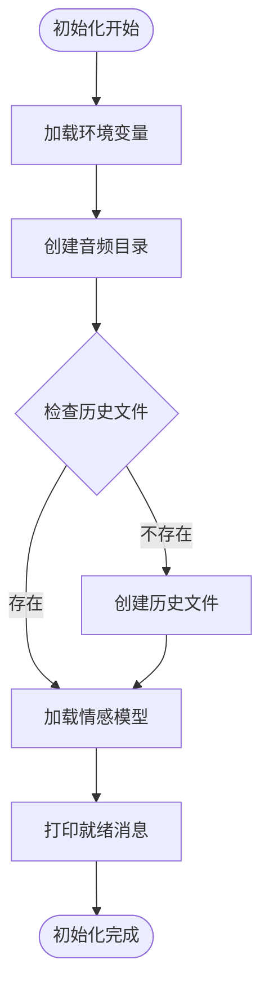
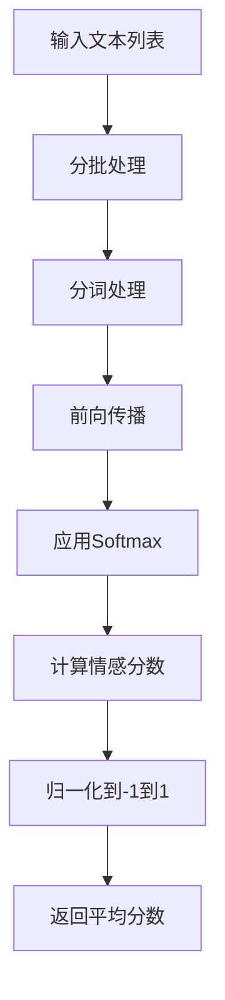
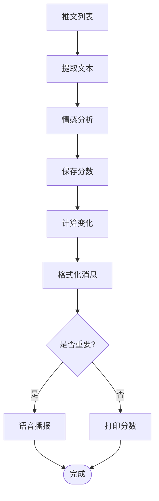
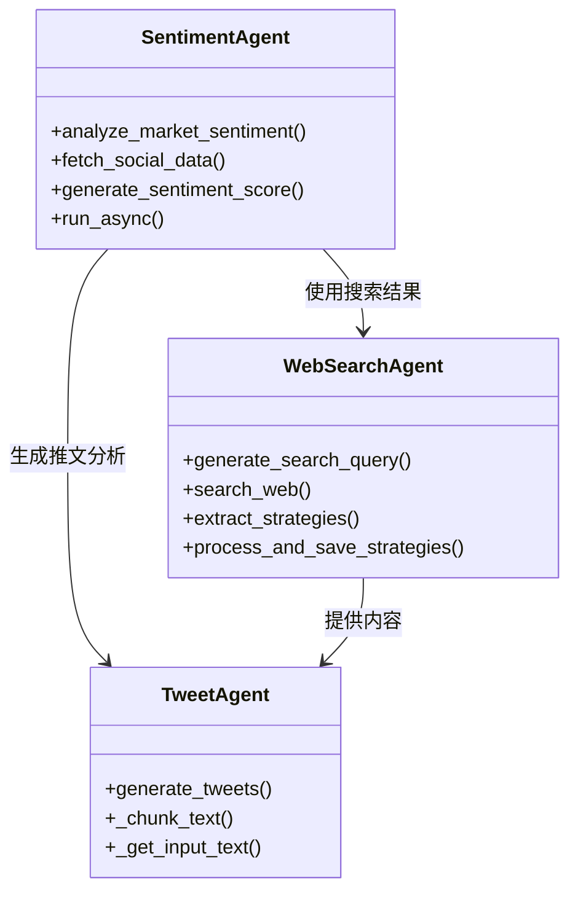
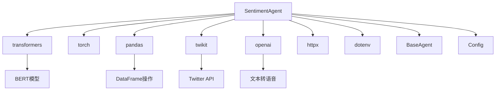

# 情绪代理API

<cite>
**本文档中引用的文件**
- [sentiment_agent.py](file://src/agents/sentiment_agent.py)
- [websearch_agent.py](file://src/agents/websearch_agent.py)
- [tweet_agent.py](file://src/agents/tweet_agent.py)
- [base_agent.py](file://src/agents/base_agent.py)
- [config.py](file://src/config.py)
- [main.py](file://src/main.py)
- [README.md](file://README.md)
</cite>

## 目录
1. [简介](#简介)
2. [项目结构](#项目结构)
3. [核心组件](#核心组件)
4. [架构概览](#架构概览)
5. [详细组件分析](#详细组件分析)
6. [依赖关系分析](#依赖关系分析)
7. [性能考虑](#性能考虑)
8. [故障排除指南](#故障排除指南)
9. [结论](#结论)

## 简介

SentimentAgent是Moon Dev AI交易系统中的核心情绪分析代理，专门负责监控和分析加密货币市场的社交媒体情绪。该代理通过整合Twitter、新闻网站、论坛等多种数据源，使用先进的自然语言处理技术对市场情绪进行量化分析，并为交易决策提供重要参考。

SentimentAgent的主要功能包括：
- 实时Twitter情绪监控和分析
- 多源社交媒体数据收集
- 基于BERT模型的情绪量化评分
- 情绪变化趋势跟踪
- 语音播报重要情绪指标
- 与其他交易代理的协同工作

## 项目结构

SentimentAgent位于Moon Dev AI交易系统的agents模块中，采用模块化设计，便于集成和扩展。

**图表来源**
- [sentiment_agent.py](file://src/agents/sentiment_agent.py#L94-L120)
- [websearch_agent.py](file://src/agents/websearch_agent.py#L1-L50)
- [tweet_agent.py](file://src/agents/tweet_agent.py#L1-L50)

**章节来源**
- [sentiment_agent.py](file://src/agents/sentiment_agent.py#L1-L100)
- [config.py](file://src/config.py#L1-L50)

## 核心组件

SentimentAgent的核心组件包括以下几个关键部分：

### 初始化组件
- **模型初始化器**：加载预训练的BERTweet情感分析模型
- **Twitter客户端**：管理Twitter API连接和认证
- **音频目录**：存储语音播报文件
- **历史记录文件**：持久化情绪数据

### 数据收集组件
- **Twitter爬虫**：搜索指定关键词的推文
- **内容过滤器**：移除无关或垃圾内容
- **数据存储器**：保存原始推文数据

### 分析组件
- **情感分析器**：计算文本的情感得分
- **趋势检测器**：识别情绪变化趋势
- **评分转换器**：将原始分数转换为可读格式

**章节来源**
- [sentiment_agent.py](file://src/agents/sentiment_agent.py#L94-L150)

## 架构概览

SentimentAgent采用异步架构设计，支持持续运行和定期更新。

**图表来源**
- [sentiment_agent.py](file://src/agents/sentiment_agent.py#L460-L492)
- [sentiment_agent.py](file://src/agents/sentiment_agent.py#L311-L330)

## 详细组件分析

### SentimentAgent类

SentimentAgent是整个系统的核心类，继承自BaseAgent，提供了完整的情绪分析功能。

#### 初始化方法

**图表来源**
- [sentiment_agent.py](file://src/agents/sentiment_agent.py#L103-L120)

#### 关键方法分析

##### analyze_sentiment方法

该方法是情感分析的核心，使用BERT模型对文本进行情感分类。

**图表来源**
- [sentiment_agent.py](file://src/agents/sentiment_agent.py#L122-L150)

##### analyze_and_announce_sentiment方法

该方法整合了分析和通知功能，提供完整的情绪报告。

**图表来源**
- [sentiment_agent.py](file://src/agents/sentiment_agent.py#L252-L309)

**章节来源**
- [sentiment_agent.py](file://src/agents/sentiment_agent.py#L122-L309)

### 与WebSearchAgent的协作

SentimentAgent可以与WebSearchAgent协同工作，从网络搜索结果中提取相关信息。

**图表来源**
- [sentiment_agent.py](file://src/agents/sentiment_agent.py#L460-L492)
- [websearch_agent.py](file://src/agents/websearch_agent.py#L1-L100)
- [tweet_agent.py](file://src/agents/tweet_agent.py#L1-L100)

### Twitter数据收集机制

SentimentAgent通过twikit库与Twitter API交互，实现高效的数据收集。

#### 关键特性
- **智能轮询**：避免API限制，合理控制请求频率
- **错误处理**：优雅处理速率限制和网络错误
- **内容过滤**：自动移除垃圾内容和无关链接
- **批量处理**：支持大量数据的高效处理

**章节来源**
- [sentiment_agent.py](file://src/agents/sentiment_agent.py#L332-L459)

### 情绪评分系统

SentimentAgent实现了多层次的情绪评分系统，提供精确的情绪量化指标。

#### 评分算法
- **基础评分**：基于BERT模型的原始情感分数（-1到1）
- **百分比转换**：将分数映射到0到100的直观范围
- **趋势分析**：计算时间序列中的情绪变化
- **阈值判断**：根据预设阈值确定情绪强度

#### 情绪分类
- **非常积极** (> 0.3)
- **略微积极** (> 0)
- **略微消极** (> -0.3)
- **非常消极** (≤ -0.3)

**章节来源**
- [sentiment_agent.py](file://src/agents/sentiment_agent.py#L252-L309)

## 依赖关系分析

SentimentAgent依赖多个外部库和内部模块，形成了复杂的依赖网络。

**图表来源**
- [sentiment_agent.py](file://src/agents/sentiment_agent.py#L1-L90)
- [base_agent.py](file://src/agents/base_agent.py#L1-L58)

### 外部依赖

| 依赖库 | 版本要求 | 用途 |
|--------|----------|------|
| transformers | 最新 | BERT模型推理 |
| torch | 最新 | 深度学习框架 |
| pandas | 最新 | 数据处理和存储 |
| twikit | 最新 | Twitter API客户端 |
| openai | 最新 | 文本转语音服务 |
| httpx | 最新 | HTTP请求库 |

### 内部依赖

| 模块 | 功能 | 依赖关系 |
|------|------|----------|
| BaseAgent | 基础代理功能 | 提供统一接口 |
| Config | 配置管理 | 环境变量和设置 |
| ExchangeManager | 交易所管理 | 可选的交易功能 |

**章节来源**
- [sentiment_agent.py](file://src/agents/sentiment_agent.py#L1-L90)
- [base_agent.py](file://src/agents/base_agent.py#L1-L58)

## 性能考虑

### 内存优化
- **批次处理**：使用小批次处理避免内存溢出
- **模型缓存**：只在需要时加载模型
- **数据清理**：定期清理过期的历史数据

### 网络优化
- **请求节流**：合理控制API请求频率
- **重试机制**：智能处理网络错误
- **连接复用**：保持HTTP连接以提高效率

### 计算优化
- **GPU加速**：支持CUDA加速推理
- **异步处理**：并发执行多个任务
- **结果缓存**：避免重复计算

## 故障排除指南

### 常见问题及解决方案

#### 1. Twitter认证失败
**症状**：出现"cookies.json not found"错误
**解决方案**：
- 运行`twitter_login.py`脚本
- 确保cookies.json文件正确生成
- 检查.env文件中的Twitter凭据

#### 2. 模型加载失败
**症状**：出现"Failed to load sentiment model"错误
**解决方案**：
- 检查网络连接
- 确保有足够的磁盘空间
- 尝试重新启动代理

#### 3. API限制问题
**症状**：频繁出现"Rate limit hit"错误
**解决方案**：
- 增加请求间隔时间
- 使用更高级别的API配额
- 实现指数退避策略

#### 4. 数据保存失败
**症状**：历史数据无法保存
**解决方案**：
- 检查数据目录权限
- 确保磁盘空间充足
- 验证CSV文件格式

**章节来源**
- [sentiment_agent.py](file://src/agents/sentiment_agent.py#L311-L330)
- [sentiment_agent.py](file://src/agents/sentiment_agent.py#L122-L150)

## 结论

SentimentAgent是Moon Dev AI交易系统中的重要组成部分，通过整合多种数据源和先进的自然语言处理技术，为交易决策提供了有价值的情绪指标。其模块化设计、异步架构和完善的错误处理机制确保了系统的稳定性和可靠性。

### 主要优势
- **多源数据整合**：结合Twitter、新闻和论坛数据
- **实时分析能力**：支持持续监控和即时反馈
- **量化指标**：提供精确的情绪评分和趋势分析
- **语音播报**：重要的情绪变化会自动通知
- **易于集成**：良好的API设计便于与其他代理协作

### 应用场景
- **交易信号生成**：作为交易决策的重要参考指标
- **风险管理**：监控市场情绪变化以调整仓位
- **策略优化**：验证和改进交易策略
- **市场研究**：深入理解市场参与者的情绪

SentimentAgent为AI驱动的量化交易提供了强大的情绪分析能力，是构建完整交易生态系统的关键组件。