# 策略代理API

<cite>
**本文档中引用的文件**
- [strategy_agent.py](file://src/agents/strategy_agent.py)
- [base_strategy.py](file://src/strategies/base_strategy.py)
- [example_strategy.py](file://src/strategies/example_strategy.py)
- [example_strategy.py](file://src/strategies/custom/example_strategy.py)
- [backtest_runner.py](file://src/agents/backtest_runner.py)
- [model_factory.py](file://src/models/model_factory.py)
- [config.py](file://src/config.py)
- [__init__.py](file://src/strategies/__init__.py)
- [__init__.py](file://src/strategies/custom/__init__.py)
</cite>

## 目录
1. [简介](#简介)
2. [项目结构](#项目结构)
3. [核心组件](#核心组件)
4. [架构概览](#架构概览)
5. [详细组件分析](#详细组件分析)
6. [策略管理方法](#策略管理方法)
7. [与Backtesting框架集成](#与backtesting框架集成)
8. [AI模型协作](#ai模型协作)
9. [开发新策略](#开发新策略)
10. [性能考虑](#性能考虑)
11. [故障排除指南](#故障排除指南)
12. [结论](#结论)

## 简介

StrategyAgent是Moon Dev AI交易系统的核心组件，负责管理、执行和优化各种交易策略。它提供了完整的策略生命周期管理，包括策略加载、信号生成、LLM评估、回测执行和参数优化。该代理集成了先进的AI模型（通过ModelFactory）来增强策略决策，并与Backtesting框架深度集成以提供全面的策略验证能力。

## 项目结构

StrategyAgent的项目结构围绕策略管理和交易执行组织：

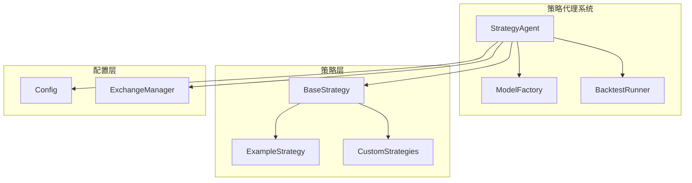

**图表来源**
- [strategy_agent.py](file://src/agents/strategy_agent.py#L1-L50)
- [model_factory.py](file://src/models/model_factory.py#L1-L30)
- [base_strategy.py](file://src/strategies/base_strategy.py#L1-L21)

**章节来源**
- [strategy_agent.py](file://src/agents/strategy_agent.py#L1-L306)
- [config.py](file://src/config.py#L1-L136)

## 核心组件

StrategyAgent包含以下核心组件：

### 主要类和接口

1. **StrategyAgent**: 主要策略管理器
2. **BaseStrategy**: 所有自定义策略的基础类
3. **ModelFactory**: AI模型工厂和管理器
4. **BacktestRunner**: 回测执行和结果处理

### 关键配置参数

| 配置项 | 类型 | 默认值 | 描述 |
|--------|------|--------|------|
| ENABLE_STRATEGIES | bool | True | 启用策略功能 |
| STRATEGY_MIN_CONFIDENCE | float | 0.7 | 策略信号最小置信度 |
| AI_MODEL | str | "claude-3-haiku-20240307" | AI模型名称 |
| AI_MAX_TOKENS | int | 1024 | 最大令牌数 |
| AI_TEMPERATURE | float | 0.7 | 创造性vs精确度 |

**章节来源**
- [strategy_agent.py](file://src/agents/strategy_agent.py#L25-L45)
- [config.py](file://src/config.py#L100-L110)

## 架构概览

StrategyAgent采用模块化架构，支持动态策略加载和LLM增强决策：

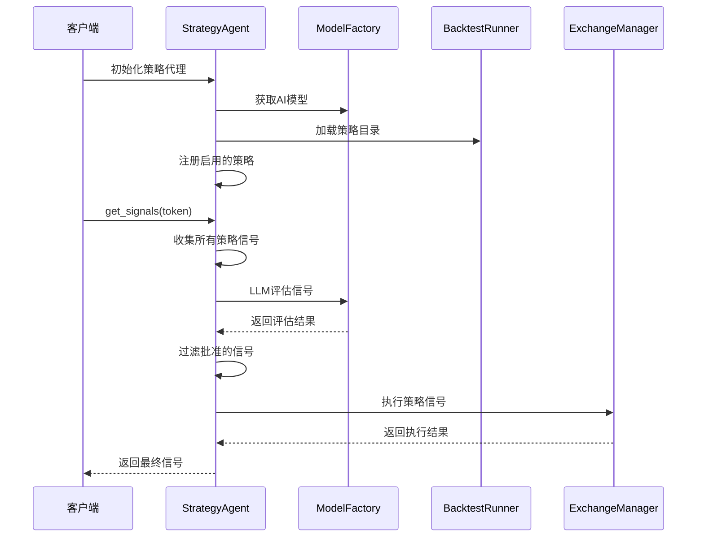

**图表来源**
- [strategy_agent.py](file://src/agents/strategy_agent.py#L120-L180)
- [model_factory.py](file://src/models/model_factory.py#L200-L250)

## 详细组件分析

### StrategyAgent类分析

StrategyAgent是策略管理系统的核心，负责协调所有策略相关操作：

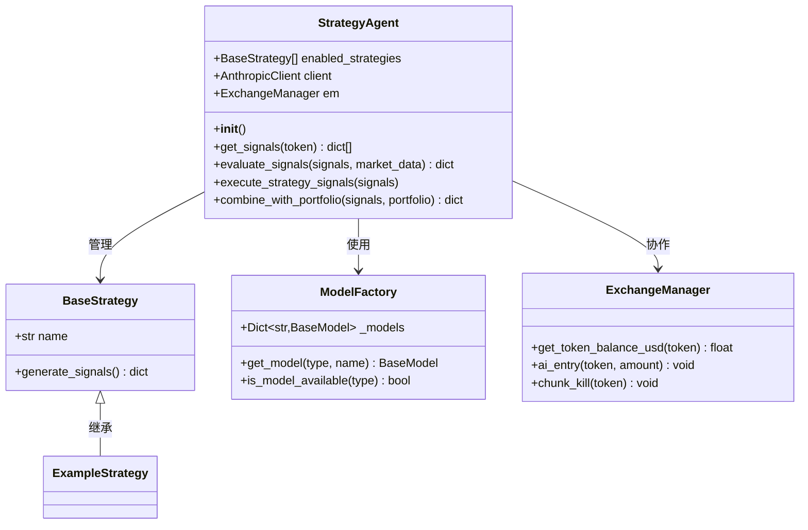

**图表来源**
- [strategy_agent.py](file://src/agents/strategy_agent.py#L35-L80)
- [base_strategy.py](file://src/strategies/base_strategy.py#L5-L21)
- [model_factory.py](file://src/models/model_factory.py#L23-L50)

**章节来源**
- [strategy_agent.py](file://src/agents/strategy_agent.py#L35-L306)

### BaseStrategy基类分析

BaseStrategy为所有自定义策略提供统一接口：

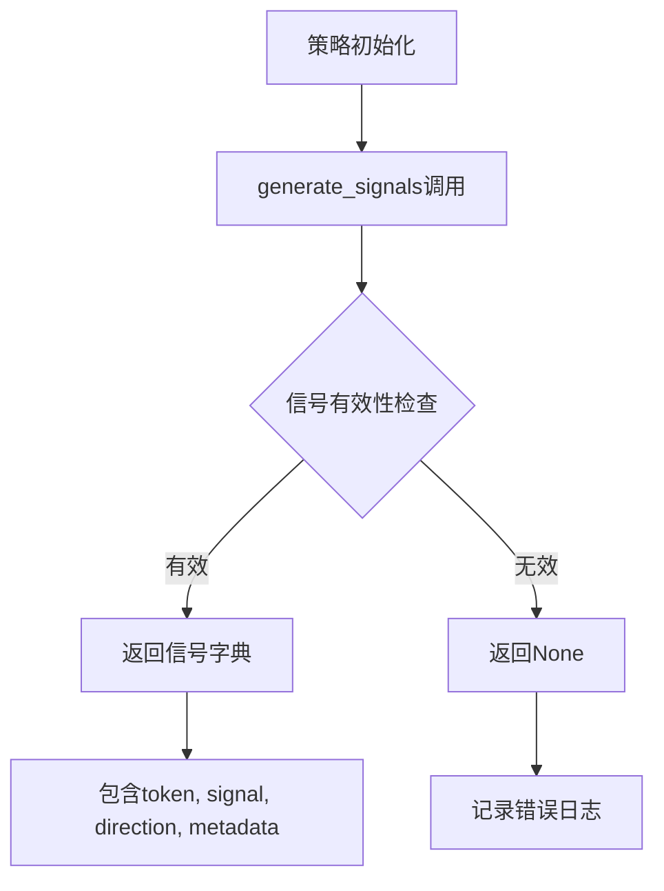

**图表来源**
- [base_strategy.py](file://src/strategies/base_strategy.py#L10-L21)

**章节来源**
- [base_strategy.py](file://src/strategies/base_strategy.py#L1-L21)

## 策略管理方法

### load_strategy方法

StrategyAgent自动从`strategies/custom`目录加载策略：

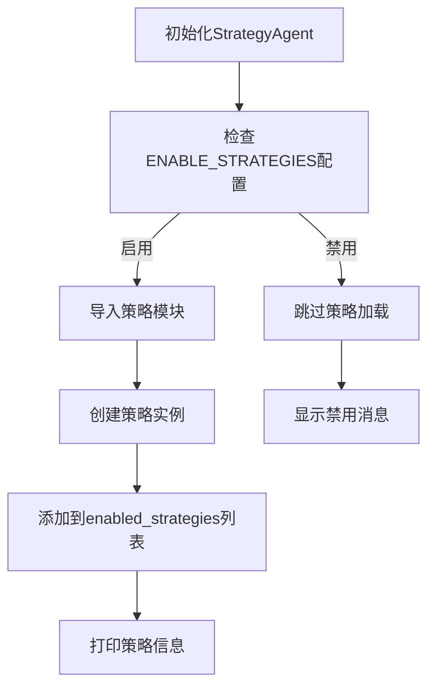

**图表来源**
- [strategy_agent.py](file://src/agents/strategy_agent.py#L65-L85)

### backtest_strategy方法

策略回测通过动态加载和执行策略文件实现：

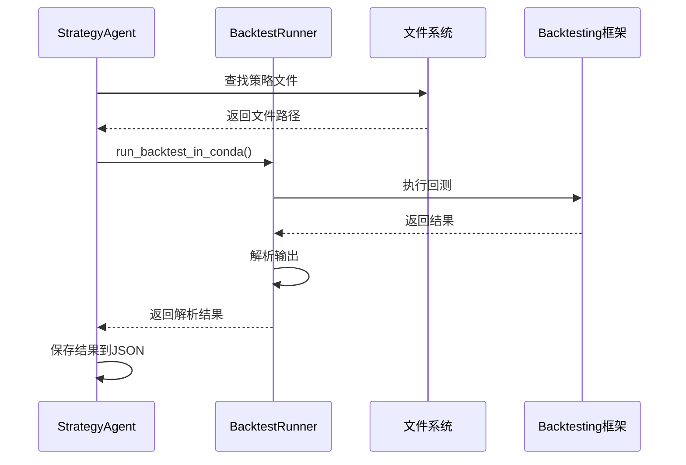

**图表来源**
- [backtest_runner.py](file://src/agents/backtest_runner.py#L20-L80)

### optimize_parameters方法

参数优化通过迭代改进策略逻辑实现：

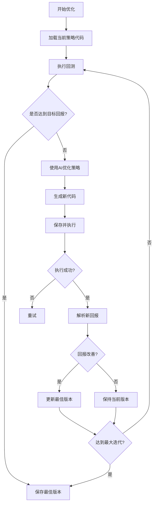

**图表来源**
- [rbi_agent_v3.py](file://src/agents/rbi_agent_v3.py#L959-L1016)

**章节来源**
- [strategy_agent.py](file://src/agents/strategy_agent.py#L65-L90)
- [backtest_runner.py](file://src/agents/backtest_runner.py#L20-L120)

## 与Backtesting框架集成

StrategyAgent与Backtesting框架的集成体现在多个层面：

### 回测执行流程

1. **策略加载**: 动态导入策略类
2. **数据准备**: 获取历史市场数据
3. **回测运行**: 执行策略回测
4. **结果分析**: 解析和评估回测结果
5. **优化迭代**: 基于结果改进策略

### 回测结果格式

回测结果包含以下关键指标：

| 指标 | 描述 | 计算方式 |
|------|------|----------|
| 总交易数 | 策略执行的总交易次数 | # Trades |
| 总回报率 | 策略的总收益率 | Return [%] |
| 夏普比率 | 风险调整后的收益 | Sharpe Ratio |
| 最大回撤 | 最大资金回撤幅度 | Max. Drawdown [%] |
| 胜率 | 盈利交易的比例 | Win Rate [%] |

**章节来源**
- [backtest_runner.py](file://src/agents/backtest_runner.py#L120-L180)

## AI模型协作

### ModelFactory集成

StrategyAgent通过ModelFactory访问多种AI模型：

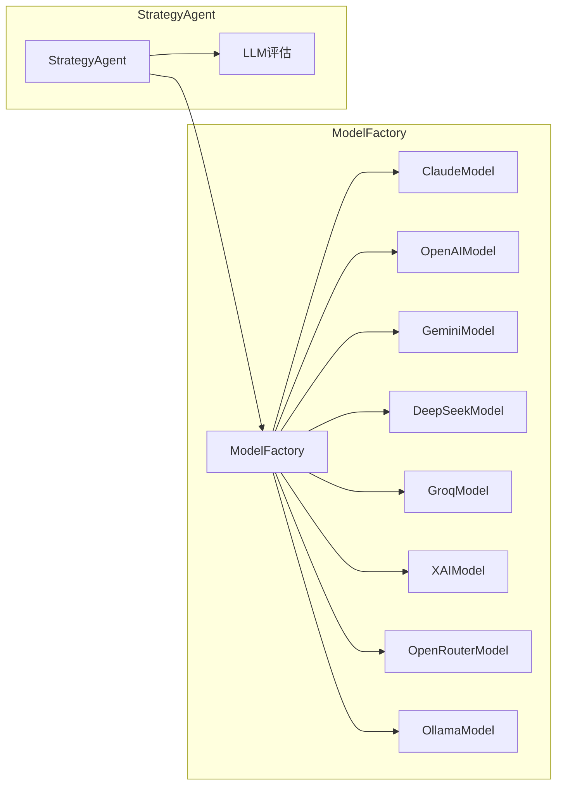

**图表来源**
- [model_factory.py](file://src/models/model_factory.py#L25-L45)

### LLM评估机制

StrategyAgent使用专门的提示模板对策略信号进行评估：

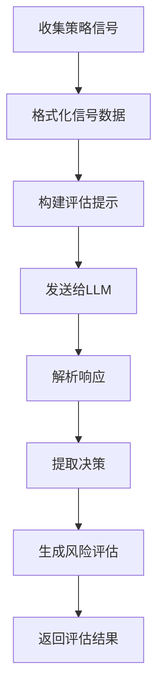

**图表来源**
- [strategy_agent.py](file://src/agents/strategy_agent.py#L95-L140)

**章节来源**
- [model_factory.py](file://src/models/model_factory.py#L23-L261)
- [strategy_agent.py](file://src/agents/strategy_agent.py#L95-L140)

## 开发新策略

### 创建自定义策略

开发新策略需要继承BaseStrategy并实现generate_signals方法：

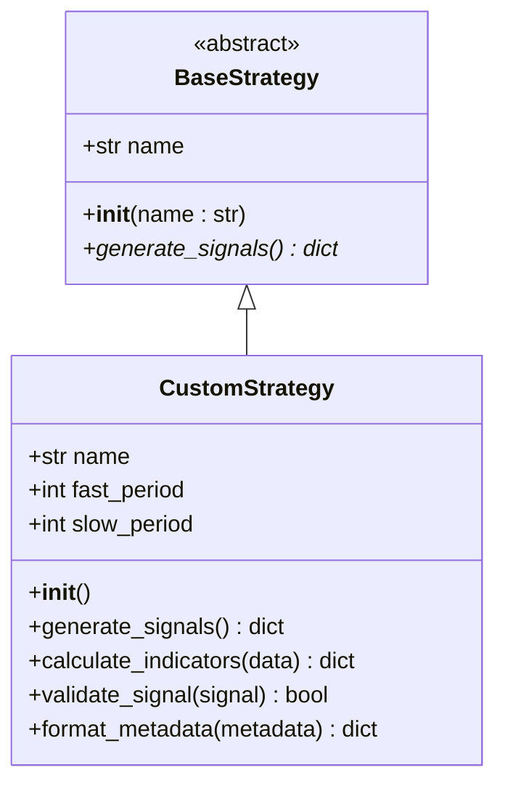

**图表来源**
- [base_strategy.py](file://src/strategies/base_strategy.py#L5-L21)
- [example_strategy.py](file://src/strategies/example_strategy.py#L10-L30)

### 策略开发步骤

1. **继承BaseStrategy**: 创建新的策略类
2. **实现generate_signals**: 生成交易信号
3. **添加到策略目录**: 将策略文件放入strategies/custom
4. **测试和验证**: 使用回测框架验证策略
5. **参数优化**: 优化策略参数

### 示例策略结构

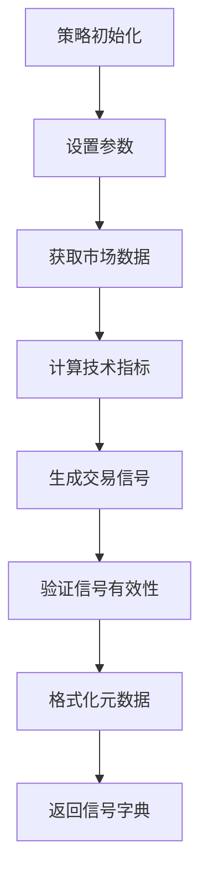

**图表来源**
- [example_strategy.py](file://src/strategies/example_strategy.py#L15-L70)

**章节来源**
- [base_strategy.py](file://src/strategies/base_strategy.py#L1-L21)
- [example_strategy.py](file://src/strategies/example_strategy.py#L1-L74)
- [example_strategy.py](file://src/strategies/custom/example_strategy.py#L1-L19)

## 性能考虑

### 策略执行优化

1. **并发处理**: 支持多线程策略执行
2. **缓存机制**: 缓存市场数据和计算结果
3. **资源管理**: 限制同时执行的策略数量
4. **错误恢复**: 实现健壮的错误处理机制

### 内存管理

- 及时释放不再需要的数据
- 使用生成器处理大量数据
- 实现内存使用监控

### 网络优化

- 批量请求市场数据
- 实现请求重试机制
- 使用连接池管理API调用

## 故障排除指南

### 常见问题及解决方案

| 问题 | 可能原因 | 解决方案 |
|------|----------|----------|
| 策略加载失败 | 导入错误或依赖缺失 | 检查策略文件语法和依赖 |
| 回测超时 | 数据量过大或算法复杂 | 优化策略逻辑或减少数据范围 |
| LLM评估失败 | API密钥配置错误 | 验证环境变量设置 |
| 信号执行失败 | 交易所连接问题 | 检查网络连接和API凭证 |

### 调试技巧

1. **启用详细日志**: 设置适当的日志级别
2. **分步测试**: 逐个测试策略组件
3. **单元测试**: 为策略编写单元测试
4. **可视化分析**: 使用图表分析策略行为

**章节来源**
- [strategy_agent.py](file://src/agents/strategy_agent.py#L280-L306)

## 结论

StrategyAgent提供了一个强大而灵活的策略管理平台，集成了AI增强决策、自动化回测和参数优化功能。通过模块化设计和清晰的接口，它支持快速开发和部署新的交易策略，同时确保了系统的可扩展性和稳定性。

该系统的主要优势包括：
- **统一的策略接口**: 通过BaseStrategy提供一致的开发体验
- **AI增强决策**: 利用先进的语言模型提高策略质量
- **自动化工作流**: 从策略开发到部署的完整自动化
- **强大的集成能力**: 与多种AI模型和回测框架无缝集成

未来的发展方向包括：
- 更多AI模型的支持
- 更智能的参数优化算法
- 实时策略监控和调整
- 更丰富的策略类型和指标