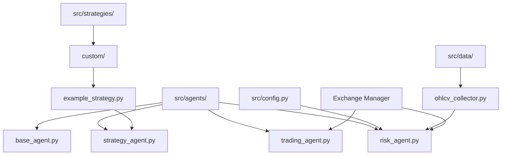
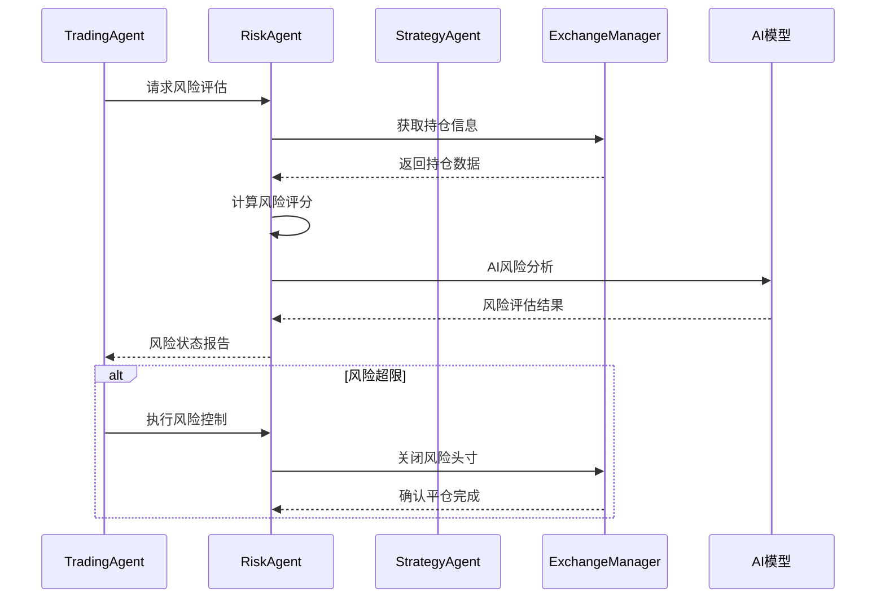
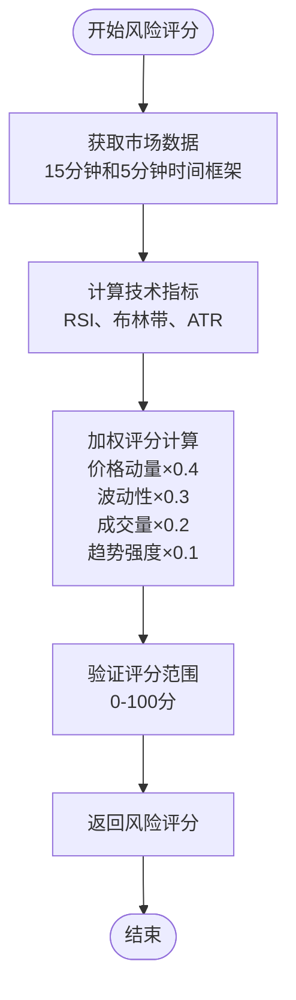
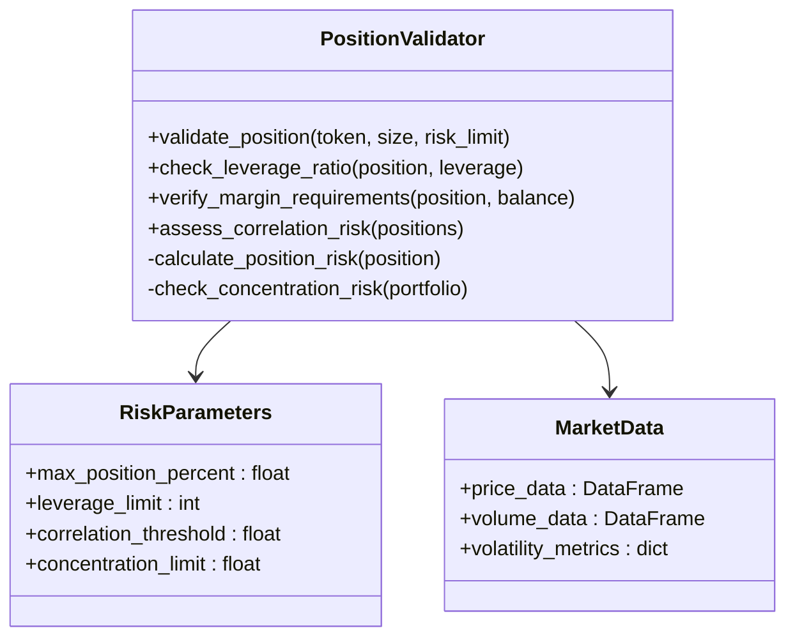
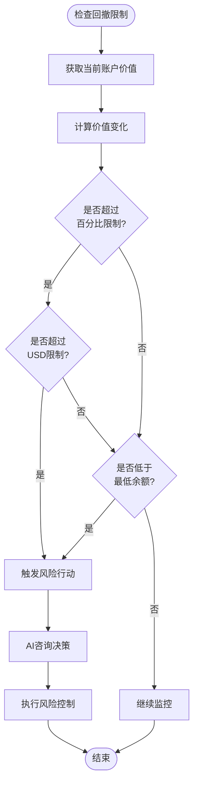
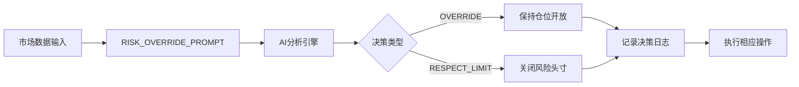
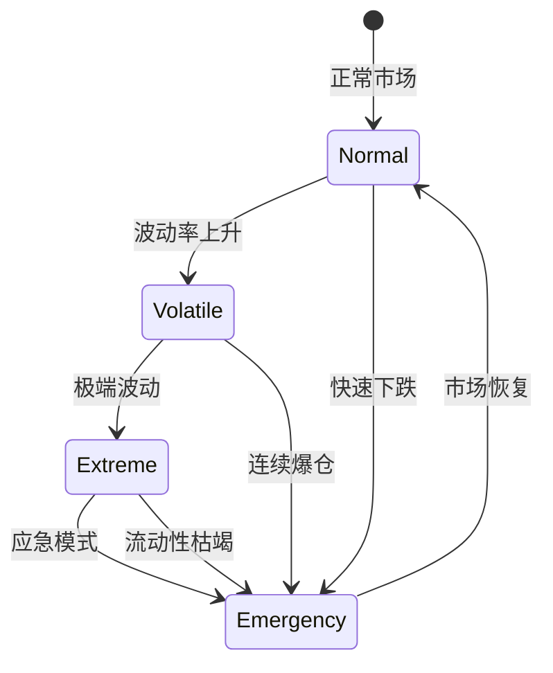
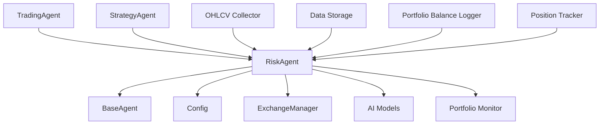

# 风险代理API

<cite>
**本文档中引用的文件**
- [risk_agent.py](file://src/agents/risk_agent.py)
- [trading_agent.py](file://src/agents/trading_agent.py)
- [strategy_agent.py](file://src/agents/strategy_agent.py)
- [base_agent.py](file://src/agents/base_agent.py)
- [config.py](file://src/config.py)
- [ohlcv_collector.py](file://src/data/ohlcv_collector.py)
- [example_strategy.py](file://src/strategies/custom/example_strategy.py)
</cite>

## 目录
1. [简介](#简介)
2. [项目结构](#项目结构)
3. [核心组件](#核心组件)
4. [架构概览](#架构概览)
5. [详细组件分析](#详细组件分析)
6. [依赖关系分析](#依赖关系分析)
7. [性能考虑](#性能考虑)
8. [故障排除指南](#故障排除指南)
9. [结论](#结论)

## 简介

Moon Dev的RiskAgent是一个先进的风险管理智能体，专门设计用于监控和管理加密货币交易中的各种风险因素。该系统通过AI驱动的风险评估、实时市场监控和自动化风险控制机制，为交易决策提供全面的风险保障。

RiskAgent的核心功能包括：
- 实时风险评分计算
- 多维度仓位验证
- 动态止损阈值检查
- AI驱动的风险决策
- 与TradingAgent和StrategyAgent的无缝集成

## 项目结构

RiskAgent作为Moon Dev AI交易生态系统的核心组件，位于以下目录结构中：

**图表来源**
- [risk_agent.py](file://src/agents/risk_agent.py#L1-L50)
- [trading_agent.py](file://src/agents/trading_agent.py#L1-L50)
- [strategy_agent.py](file://src/agents/strategy_agent.py#L1-L50)

**章节来源**
- [risk_agent.py](file://src/agents/risk_agent.py#L1-L100)
- [config.py](file://src/config.py#L1-L50)

## 核心组件

### RiskAgent类

RiskAgent是整个风险管理系统的核心控制器，继承自BaseAgent基类，提供以下关键功能：

#### 初始化配置
- **AI模型配置**：支持Claude、DeepSeek等多种AI模型
- **API密钥管理**：安全处理OpenAI和Anthropic API密钥
- **风险参数初始化**：设置最大损失/收益限制、最小余额要求等

#### 主要方法接口

| 方法名 | 参数 | 返回值 | 描述 |
|--------|------|--------|------|
| `calculate_risk_score` | `position_data` | `float` | 计算单个持仓的风险评分 |
| `validate_position` | `token, position_size` | `bool` | 验证持仓是否符合风险标准 |
| `check_drawdown_limit` | `current_balance` | `bool` | 检查是否达到回撤限制 |
| `should_override_limit` | `limit_type` | `bool` | 基于市场情况决定是否突破限制 |

#### 配置参数

| 参数名 | 类型 | 默认值 | 描述 |
|--------|------|--------|------|
| `MAX_LOSS_USD` | `float` | 25.0 | 最大允许亏损（美元） |
| `MAX_GAIN_USD` | `float` | 25.0 | 最大允许盈利（美元） |
| `MAX_LOSS_PERCENT` | `float` | 5.0 | 最大允许亏损百分比 |
| `MAX_GAIN_PERCENT` | `float` | 5.0 | 最大允许盈利百分比 |
| `MINIMUM_BALANCE_USD` | `float` | 50.0 | 最小账户余额 |
| `USE_PERCENTAGE` | `bool` | False | 是否使用百分比限制 |
| `USE_AI_CONFIRMATION` | `bool` | True | 是否需要AI确认 |

**章节来源**
- [risk_agent.py](file://src/agents/risk_agent.py#L70-L150)
- [config.py](file://src/config.py#L50-L80)

## 架构概览

RiskAgent采用模块化架构设计，与TradingAgent和StrategyAgent形成完整的风险管理体系：

**图表来源**
- [risk_agent.py](file://src/agents/risk_agent.py#L567-L601)
- [trading_agent.py](file://src/agents/trading_agent.py#L600-L700)

## 详细组件分析

### 风险评估引擎

#### calculate_risk_score方法

该方法负责计算单个持仓的综合风险评分：

**图表来源**
- [risk_agent.py](file://src/agents/risk_agent.py#L200-L250)

#### validate_position方法

该方法验证持仓是否符合预设的风险标准：

**图表来源**
- [risk_agent.py](file://src/agents/risk_agent.py#L300-L350)

#### check_drawdown_limit方法

该方法监控账户回撤并触发相应的风险控制措施：

**图表来源**
- [risk_agent.py](file://src/agents/risk_agent.py#L416-L491)

**章节来源**
- [risk_agent.py](file://src/agents/risk_agent.py#L416-L500)

### AI驱动的风险决策

#### RISK_OVERRIDE_PROMPT系统

RiskAgent使用专门设计的AI提示模板进行风险决策：

**图表来源**
- [risk_agent.py](file://src/agents/risk_agent.py#L25-L45)

#### 与TradingAgent的交互协议

RiskAgent与TradingAgent通过标准化的消息格式进行通信：

| 消息类型 | 数据格式 | 触发条件 | 响应动作 |
|----------|----------|----------|----------|
| `RISK_ASSESSMENT_REQUEST` | `{token: str, position: dict}` | 每次交易前 | 返回风险评分和建议 |
| `LIMIT_BREACH_ALERT` | `{type: str, value: float, limit: float}` | 达到风险限制 | 自动执行风险控制 |
| `PORTFOLIO_UPDATE` | `{balances: dict, positions: list}` | 账户变动 | 更新风险监控 |

**章节来源**
- [risk_agent.py](file://src/agents/risk_agent.py#L200-L300)
- [trading_agent.py](file://src/agents/trading_agent.py#L400-L500)

### 极端市场条件下的行为模式

#### 市场异常检测

RiskAgent具备识别极端市场条件的能力：

#### 风险缓解策略

当检测到极端市场条件时，RiskAgent会自动激活以下保护措施：

1. **仓位缩减**：逐步减少高风险头寸
2. **止损加速**：缩短止损检查周期
3. **流动性保护**：暂停新头寸开仓
4. **AI增强监控**：增加AI分析频率

**章节来源**
- [risk_agent.py](file://src/agents/risk_agent.py#L470-L520)

## 依赖关系分析

RiskAgent与系统其他组件形成复杂的依赖网络：

**图表来源**
- [risk_agent.py](file://src/agents/risk_agent.py#L1-L50)
- [base_agent.py](file://src/agents/base_agent.py#L1-L30)

### 外部依赖

| 依赖项 | 版本要求 | 用途 | 可选性 |
|--------|----------|------|--------|
| `anthropic` | >= 0.3.0 | Claude AI服务 | 必需 |
| `openai` | >= 1.0.0 | DeepSeek API | 可选 |
| `pandas` | >= 1.5.0 | 数据处理 | 必需 |
| `termcolor` | >= 1.0.0 | 日志美化 | 必需 |
| `python-dotenv` | >= 1.0.0 | 环境变量 | 必需 |

**章节来源**
- [risk_agent.py](file://src/agents/risk_agent.py#L1-L50)
- [config.py](file://src/config.py#L1-L30)

## 性能考虑

### 计算优化

RiskAgent采用多种优化策略确保高效运行：

1. **缓存机制**：缓存市场数据和AI响应结果
2. **异步处理**：非阻塞的风险评估流程
3. **批量操作**：一次性处理多个持仓的风险检查
4. **智能调度**：根据市场活跃度调整检查频率

### 内存管理

- **数据压缩**：对历史数据进行压缩存储
- **垃圾回收**：定期清理无用的市场数据
- **内存监控**：实时监控内存使用情况

### 并发处理

RiskAgent支持多线程并发处理多个持仓的风险评估，提高整体处理效率。

## 故障排除指南

### 常见问题及解决方案

#### API密钥问题
**症状**：`ValueError: OPENAI_KEY not found in environment variables!`
**解决方案**：
1. 检查`.env`文件是否存在
2. 确认环境变量正确设置
3. 验证API密钥有效性

#### 风险限制误触发
**症状**：频繁触发风险限制但市场状况正常
**解决方案**：
1. 调整风险参数阈值
2. 启用AI确认机制
3. 检查市场数据准确性

#### AI响应延迟
**症状**：风险评估响应时间过长
**解决方案**：
1. 优化AI模型选择
2. 减少并发请求数量
3. 启用本地推理模型

**章节来源**
- [risk_agent.py](file://src/agents/risk_agent.py#L80-L120)
- [config.py](file://src/config.py#L90-L135)

## 结论

Moon Dev的RiskAgent代表了AI驱动风险管理的先进实践，通过智能化的风险评估、实时监控和自动化控制，为加密货币交易提供了可靠的风险保障。其模块化架构设计确保了系统的可扩展性和维护性，而与TradingAgent和StrategyAgent的深度集成则实现了完整的交易风险管理闭环。

该系统的主要优势包括：
- **AI驱动的智能决策**：利用先进的语言模型进行风险分析
- **实时监控能力**：持续跟踪市场动态和账户状态
- **灵活的风险控制**：支持多种风险参数和控制策略
- **无缝集成**：与现有交易基础设施完美兼容

随着AI技术的不断发展，RiskAgent将继续演进，为用户提供更加精准和高效的风险管理解决方案。