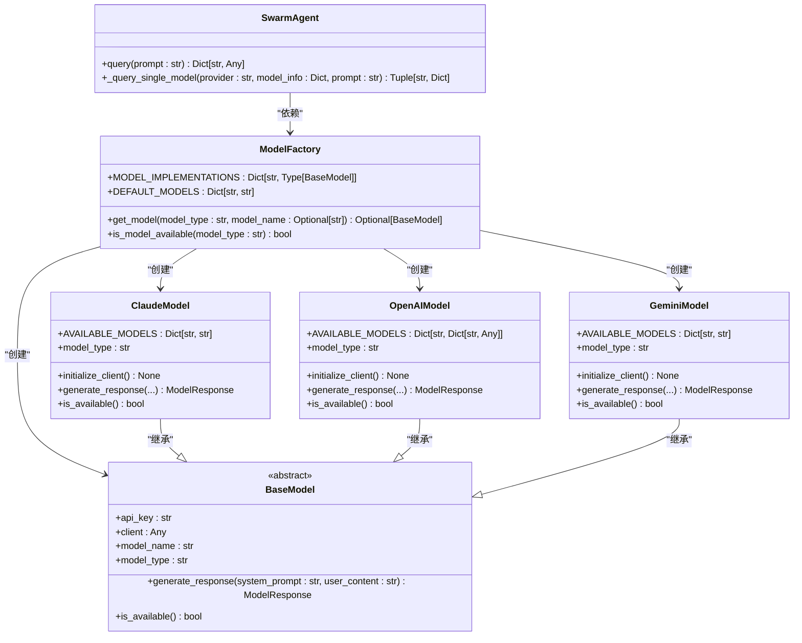

# 技术栈与依赖

<cite>
**本文档引用的文件**
- [requirements.txt](file://requirements.txt)
- [README.md](file://README.md)
- [config.py](file://src/config.py)
- [model_factory.py](file://src/models/model_factory.py)
- [base_model.py](file://src/models/base_model.py)
- [claude_model.py](file://src/models/claude_model.py)
- [openai_model.py](file://src/models/openai_model.py)
- [gemini_model.py](file://src/models/gemini_model.py)
- [swarm_agent.py](file://src/agents/swarm_agent.py)
- [rbi_agent_pp_multi.py](file://src/agents/rbi_agent_pp_multi.py)
- [base_strategy.py](file://src/strategies/base_strategy.py)
</cite>

## 目录
1. [项目概述](#项目概述)
2. [核心技术栈](#核心技术栈)
3. [主要依赖项](#主要依赖项)
4. [AI模型客户端](#ai模型客户端)
5. [内部组件依赖关系](#内部组件依赖关系)
6. [环境设置与依赖管理](#环境设置与依赖管理)

## 项目概述

该项目是一个AI驱动的交易系统，利用多种AI模型和机器学习技术来自动化交易策略的生成、回测和执行。系统通过集成多个AI提供商，实现多模型共识决策，并支持对加密货币市场的实时分析和交易。

**Section sources**
- [README.md](file://README.md#L0-L337)
- [requirements.txt](file://requirements.txt#L0-L639)

## 核心技术栈

项目主要基于Python构建，利用了多种数据科学和机器学习库来支持AI驱动的交易功能。系统架构采用模块化设计，包含代理系统、模型工厂、策略引擎等多个核心组件。

Python作为主要编程语言，提供了丰富的科学计算和机器学习生态系统，使得项目能够轻松集成各种AI模型和数据分析工具。项目利用了异步编程、并行处理等现代Python特性来提高性能和响应速度。

**Section sources**
- [requirements.txt](file://requirements.txt#L0-L639)
- [README.md](file://README.md#L0-L337)

## 主要依赖项

项目依赖多个关键框架和库来实现其功能。以下是主要依赖项的详细信息：

| 依赖项 | 版本 | 用途 | 官方文档链接 |
|--------|------|------|------------|
| Backtesting | 0.3.3 | 用于回测交易策略的Python库 | [Backtesting.py](https://kernc.github.io/backtesting.py/) |
| TA-Lib | 0.4.32 | 技术分析库，提供多种技术指标计算功能 | [TA-Lib](https://ta-lib.org/) |
| pandas | 2.1.4 | 数据分析和操作库，用于处理市场数据 | [pandas](https://pandas.pydata.org/) |
| numpy | 1.26.2 | 数值计算基础库，支持高效的数组操作 | [NumPy](https://numpy.org/) |
| scikit-learn | 1.3.2 | 机器学习库，提供各种算法和工具 | [scikit-learn](https://scikit-learn.org/) |
| tensorflow | 2.16.1 | 机器学习框架，用于构建和训练神经网络 | [TensorFlow](https://www.tensorflow.org/) |
| torch | 2.4.1 | PyTorch深度学习框架 | [PyTorch](https://pytorch.org/) |
| transformers | 4.47.1 | Hugging Face的transformers库，用于自然语言处理 | [Transformers](https://huggingface.co/docs/transformers/) |

这些技术协同工作，支持AI驱动的交易功能。Backtesting库用于验证交易策略的历史表现，TA-Lib提供技术分析指标，pandas和numpy处理和分析市场数据，而机器学习框架则用于构建和训练预测模型。

**Section sources**
- [requirements.txt](file://requirements.txt#L0-L639)
- [src/data/rbi/AI_GENERATED_STRATEGIES/requirements.txt](file://src/data/rbi/AI_GENERATED_STRATEGIES/requirements.txt#L0-L4)

## AI模型客户端

项目集成了多个AI模型客户端，以利用不同提供商的AI能力：

- **anthropic**: 集成Anthropic的Claude模型，用于高级推理和内容生成
- **openai**: 集成OpenAI的GPT系列模型，包括GPT-5和o3系列
- **google-generativeai**: 集成Google的Gemini模型，提供快速响应能力
- **groq**: 集成Groq的快速推理模型，如Mixtral
- **deepseek**: 集成DeepSeek的推理模型，提供成本效益高的AI服务
- **ollama**: 支持本地运行的Ollama模型，如Llama3.2
- **xai**: 集成xAI的Grok模型，提供200万上下文窗口
- **openrouter**: 通过OpenRouter访问200多个AI模型

这些AI模型客户端通过统一的接口进行管理，使得系统可以灵活地在不同模型之间切换或同时使用多个模型进行共识决策。

**Section sources**
- [requirements.txt](file://requirements.txt#L0-L639)
- [src/models/model_factory.py](file://src/models/model_factory.py#L0-L260)

## 内部组件依赖关系

项目采用工厂模式来管理AI模型的创建和使用。核心依赖关系如下：



**Diagram sources**
- [src/models/model_factory.py](file://src/models/model_factory.py#L0-L260)
- [src/models/base_model.py](file://src/models/base_model.py#L0-L72)
- [src/models/claude_model.py](file://src/models/claude_model.py#L0-L75)
- [src/models/openai_model.py](file://src/models/openai_model.py#L0-L440)
- [src/models/gemini_model.py](file://src/models/gemini_model.py#L0-L116)
- [src/agents/swarm_agent.py](file://src/agents/swarm_agent.py#L0-L199)

代理系统依赖于模型工厂来获取AI模型实例，而模型工厂又依赖于具体的AI模型实现。这种分层架构使得系统具有良好的可扩展性和灵活性，可以轻松添加新的AI模型支持。

**Section sources**
- [src/models/model_factory.py](file://src/models/model_factory.py#L0-L260)
- [src/models/base_model.py](file://src/models/base_model.py#L0-L72)

## 环境设置与依赖管理

为开发者提供以下环境设置和依赖管理的最佳实践建议：

1. **环境变量配置**：创建`.env`文件并配置必要的API密钥，包括ANTHROPIC_KEY、OPENAI_KEY、DEEPSEEK_KEY等。

2. **依赖安装**：使用conda创建独立的Python环境，然后安装项目依赖：
```bash
conda create -n tflow python=3.10.9
conda activate tflow
pip install -r requirements.txt
```

3. **模型选择**：通过`config.py`文件中的`AI_MODEL`变量配置默认使用的AI模型。

4. **并行处理**：利用`rbi_agent_pp_multi.py`中的并行处理功能，可以同时运行多个回测任务，提高效率。

5. **错误处理**：系统内置了自动调试功能，当回测代码出现错误时，会自动调用AI进行修复。

6. **结果管理**：所有回测结果都会保存到`src/data/rbi_pp_multi`目录下的相应文件夹中，便于后续分析。

这些最佳实践有助于确保开发环境的稳定性和可重复性，同时最大化利用项目的AI能力。

**Section sources**
- [requirements.txt](file://requirements.txt#L0-L639)
- [config.py](file://src/config.py#L0-L135)
- [rbi_agent_pp_multi.py](file://src/agents/rbi_agent_pp_multi.py#L0-L199)