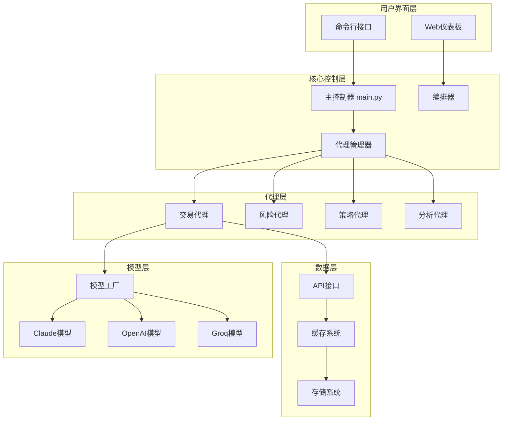
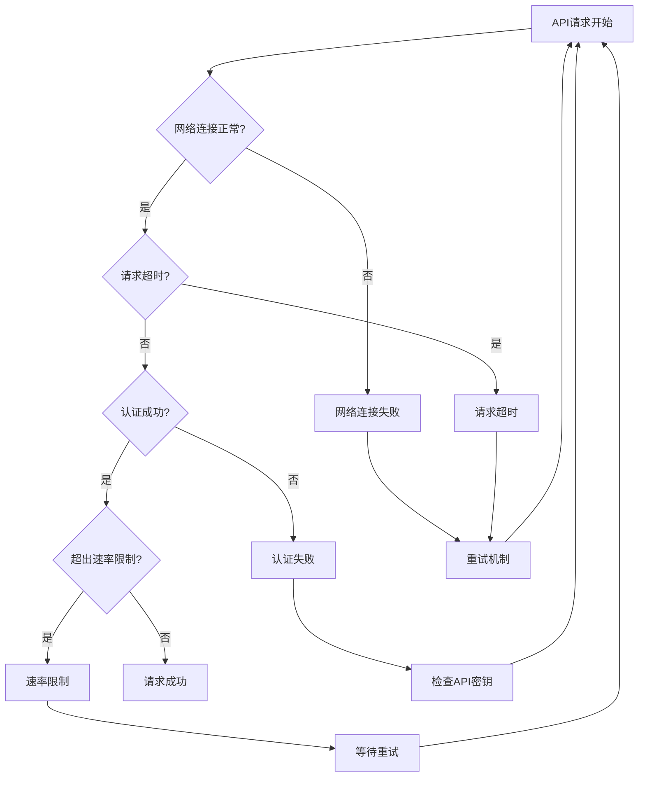
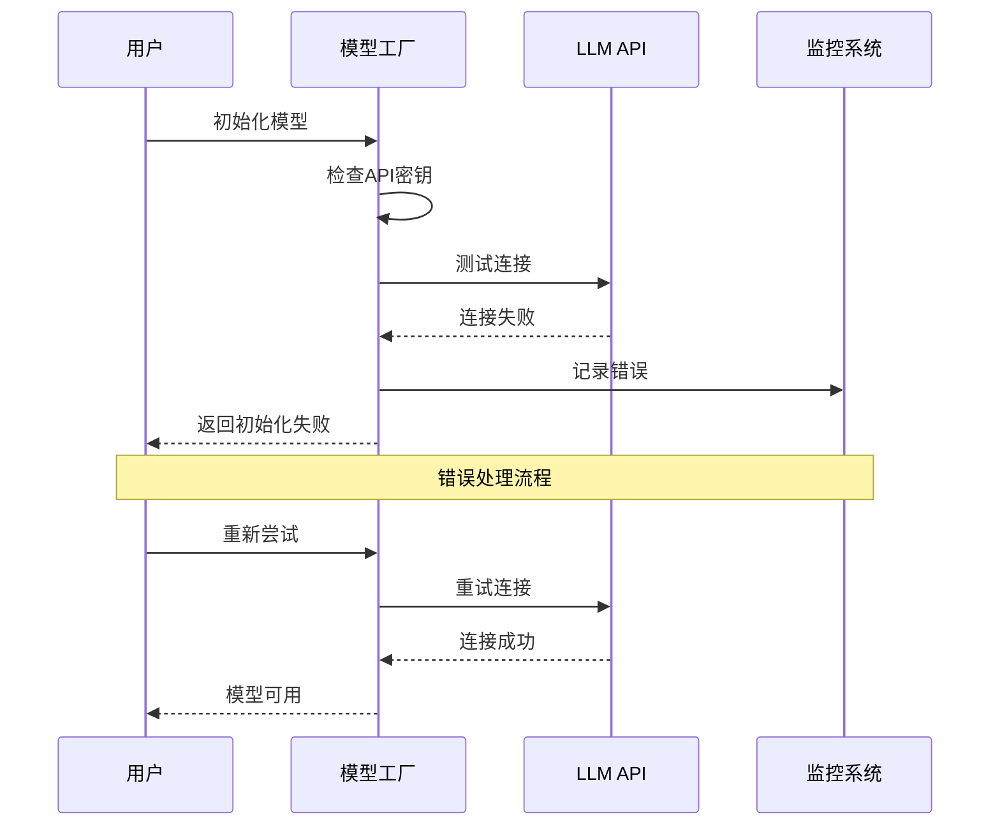
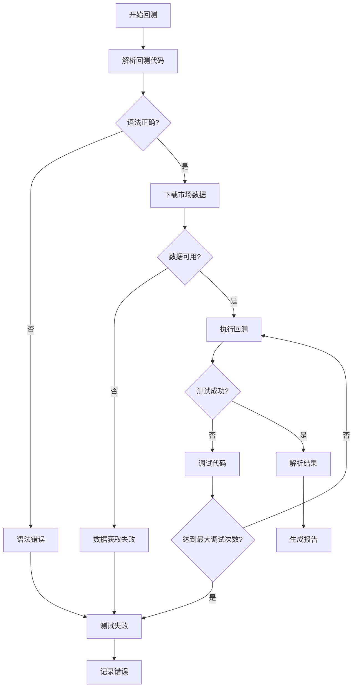
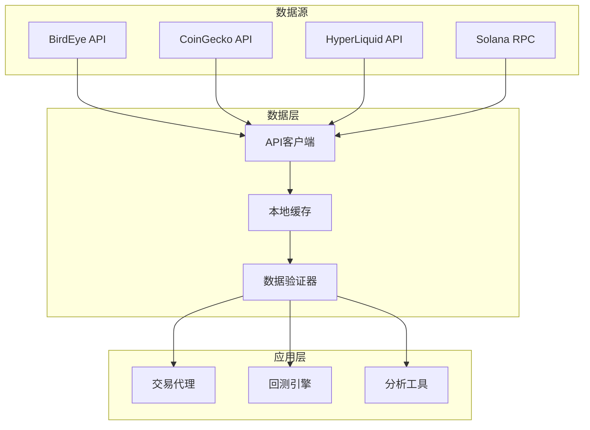
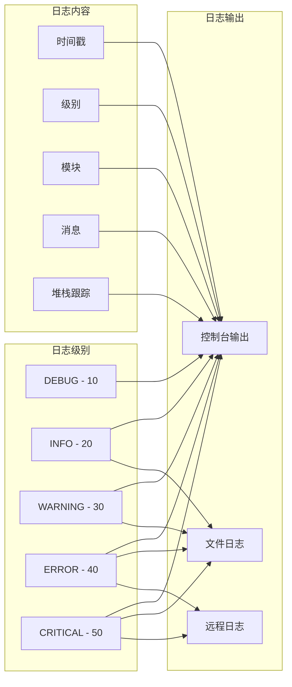
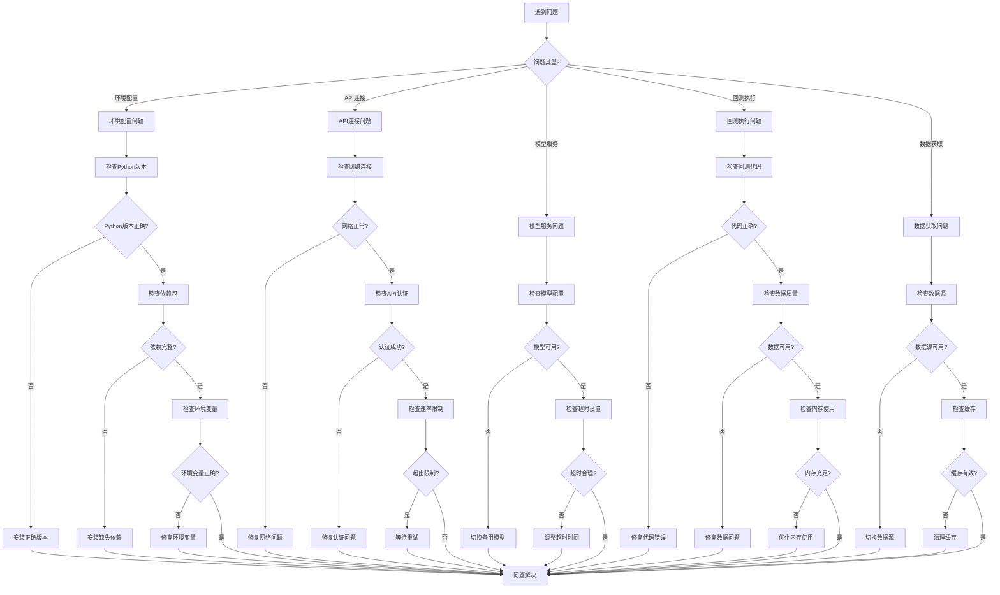

# 故障排除

<cite>
**本文档中引用的文件**
- [CLAUDE.md](file://CLAUDE.md)
- [README.md](file://README.md)
- [src/config.py](file://src/config.py)
- [src/models/model_factory.py](file://src/models/model_factory.py)
- [src/agents/api.py](file://src/agents/api.py)
- [src/agents/base_agent.py](file://src/agents/base_agent.py)
- [src/agents/backtest_runner.py](file://src/agents/backtest_runner.py)
- [src/agents/rbi_agent_v2.py](file://src/agents/rbi_agent_v2.py)
- [src/agents/rbi_agent_pp_multi.py](file://src/agents/rbi_agent_pp_multi.py)
- [src/agents/swarm_agent.py](file://src/agents/swarm_agent.py)
- [src/data/rbi/.claude/agents/sparc/refinement.md](file://src/data/rbi/.claude/agents/sparc/refinement.md)
- [requirements.txt](file://requirements.txt)
</cite>

## 目录
1. [简介](#简介)
2. [常见问题分类](#常见问题分类)
3. [环境配置问题](#环境配置问题)
4. [API连接问题](#api连接问题)
5. [模型服务问题](#模型服务问题)
6. [回测执行问题](#回测执行问题)
7. [数据获取问题](#数据获取问题)
8. [性能优化问题](#性能优化问题)
9. [日志分析与诊断](#日志分析与诊断)
10. [故障排除流程图](#故障排除流程图)
11. [贡献指南](#贡献指南)

## 简介

本故障排除指南旨在帮助用户诊断和解决在使用AI交易代理系统过程中可能遇到的各种问题。该系统包含48个以上的专门AI代理，支持多种LLM提供商，并涉及复杂的多层架构。

### 系统架构概览



**图表来源**
- [src/main.py](file://src/main.py#L1-L50)
- [src/agents/base_agent.py](file://src/agents/base_agent.py#L1-L58)
- [src/models/model_factory.py](file://src/models/model_factory.py#L1-L100)

## 常见问题分类

### 按严重程度分类

| 严重程度 | 问题类型 | 影响范围 | 解决优先级 |
|---------|---------|---------|-----------|
| 关键 | 系统无法启动 | 全局 | 最高 |
| 高 | API连接失败 | 多个代理 | 高 |
| 中 | 模型调用超时 | 特定功能 | 中 |
| 低 | 性能缓慢 | 用户体验 | 低 |

### 按功能模块分类

| 模块 | 常见问题 | 可能原因 | 解决方案复杂度 |
|-----|---------|---------|---------------|
| 环境配置 | Python版本不兼容 | 环境变量缺失 | 低 |
| API集成 | 数据源连接失败 | 网络限制 | 中 |
| 模型服务 | LLM调用超时 | API配额限制 | 中 |
| 回测引擎 | 代码执行失败 | 语法错误 | 高 |
| 数据处理 | 内存不足 | 数据量过大 | 高 |

## 环境配置问题

### Python环境问题

**问题症状：**
- `ModuleNotFoundError: No module named 'xxx'`
- `ImportError: cannot import name 'xxx'`
- `Python version mismatch` 错误

**诊断步骤：**
1. 检查Python版本：`python --version`
2. 验证虚拟环境激活状态
3. 检查依赖包安装情况

**解决方案：**

```bash
# 1. 创建并激活正确的Python环境
conda create -n tflow python=3.10.9
conda activate tflow

# 2. 安装依赖包
pip install -r requirements.txt

# 3. 验证安装
pip list | grep -E "(pandas|numpy|requests|termcolor)"
```

**常见错误及解决：**

| 错误信息 | 原因 | 解决方法 |
|---------|------|---------|
| `ERROR: Could not find a version that satisfies the requirement` | 包版本冲突 | 更新pip：`pip install --upgrade pip` |
| `Permission denied` | 权限问题 | 使用`--user`参数或修复权限 |
| `Failed building wheel` | 编译工具缺失 | 安装build-essential（Linux）或Xcode命令行工具（Mac） |

**节来源**
- [requirements.txt](file://requirements.txt#L1-L50)
- [CLAUDE.md](file://CLAUDE.md#L15-L30)

### 环境变量配置

**必需的环境变量：**

```bash
# AI模型API密钥
ANTHROPIC_KEY=your_anthropic_api_key_here
OPENAI_KEY=your_openai_api_key_here
DEEPSEEK_KEY=your_deepseek_api_key_here
GROQ_API_KEY=your_groq_api_key_here
GEMINI_KEY=your_gemini_api_key_here
XAI_API_KEY=your_xai_api_key_here
OPENROUTER_API_KEY=your_openrouter_api_key_here

# 市场数据API
BIRDEYE_API_KEY=your_birdeye_api_key_here
COINGECKO_API_KEY=your_coingecko_api_key_here

# 区块链API
SOLANA_PRIVATE_KEY=your_private_key_here
HYPER_LIQUID_ETH_PRIVATE_KEY=your_hl_private_key_here
RPC_ENDPOINT=https://api.mainnet-beta.solana.com
```

**验证环境变量：**

```python
import os
from dotenv import load_dotenv

# 加载环境变量
load_dotenv()

# 检查关键变量
required_vars = [
    'ANTHROPIC_KEY', 'OPENAI_KEY', 'BIRDEYE_API_KEY',
    'COINGECKO_API_KEY', 'SOLANA_PRIVATE_KEY'
]

for var in required_vars:
    value = os.getenv(var)
    if value and len(value.strip()) > 0:
        print(f"✅ {var}: 已配置 ({len(value)} 字符)")
    else:
        print(f"❌ {var}: 未配置或为空")
```

**节来源**
- [src/models/model_factory.py](file://src/models/model_factory.py#L51-L81)
- [CLAUDE.md](file://CLAUDE.md#L100-L130)

## API连接问题

### 网络连接问题

**常见网络错误：**



**图表来源**
- [src/agents/api.py](file://src/agents/api.py#L100-L150)
- [src/models/model_factory.py](file://src/models/model_factory.py#L120-L180)

**诊断工具：**

```python
import requests
import time

def test_api_connection(url, headers=None, timeout=30):
    """测试API连接"""
    try:
        start_time = time.time()
        response = requests.get(url, headers=headers, timeout=timeout)
        elapsed = time.time() - start_time
        
        print(f"✅ 连接成功: {response.status_code}")
        print(f"⏱️ 响应时间: {elapsed:.2f}秒")
        
        if response.status_code == 200:
            return True
        else:
            print(f"⚠️ 状态码: {response.status_code}")
            return False
            
    except requests.exceptions.ConnectTimeout:
        print("❌ 连接超时")
        return False
    except requests.exceptions.ConnectionError:
        print("❌ 连接被拒绝")
        return False
    except requests.exceptions.RequestException as e:
        print(f"❌ 请求错误: {e}")
        return False

# 测试示例
test_api_connection("https://api.moondev.com:8000/health")
```

**常见API错误及解决方案：**

| 错误代码 | 错误信息 | 原因 | 解决方案 |
|---------|---------|------|---------|
| 401 | Unauthorized | API密钥无效 | 检查.env文件中的API密钥 |
| 403 | Forbidden | 权限不足 | 联系管理员或检查API密钥权限 |
| 429 | Too Many Requests | 速率限制 | 实现指数退避重试 |
| 500 | Internal Server Error | 服务器内部错误 | 等待后重试 |
| 503 | Service Unavailable | 服务不可用 | 检查服务状态页面 |

**节来源**
- [src/agents/api.py](file://src/agents/api.py#L150-L200)

### 代理和防火墙问题

**检测代理设置：**

```python
import os

def detect_proxy_settings():
    """检测系统代理设置"""
    proxy_vars = ['HTTP_PROXY', 'HTTPS_PROXY', 'http_proxy', 'https_proxy']
    detected_proxies = {}
    
    for var in proxy_vars:
        value = os.getenv(var)
        if value:
            detected_proxies[var] = value
    
    return detected_proxies

# 测试代理设置
proxies = detect_proxy_settings()
if proxies:
    print("检测到代理设置:")
    for var, value in proxies.items():
        print(f"  {var}: {value}")
else:
    print("未检测到代理设置")
```

**配置代理绕过：**

```python
import requests

# 绕过代理直接连接
proxies = {
    'http': None,
    'https': None
}

response = requests.get('https://api.moondev.com:8000/health', proxies=proxies)
```

## 模型服务问题

### LLM调用问题

**模型初始化失败：**



**图表来源**
- [src/models/model_factory.py](file://src/models/model_factory.py#L80-L150)

**诊断脚本：**

```python
from src.models.model_factory import ModelFactory

def diagnose_model_services():
    """诊断所有模型服务"""
    factory = ModelFactory()
    
    print("🔍 正在诊断模型服务...")
    print("=" * 50)
    
    # 检查可用模型
    available_models = factory.available_models
    print(f"可用模型: {list(available_models.keys())}")
    
    # 测试每个模型
    for model_type in available_models:
        print(f"\n📝 测试 {model_type} 模型...")
        
        try:
            model = factory.get_model(model_type)
            if model and model.is_available():
                print(f"✅ {model_type}: 可用")
                print(f"   模型名称: {model.model_name}")
                print(f"   默认温度: {model.temperature}")
                print(f"   最大令牌数: {model.max_tokens}")
            else:
                print(f"❌ {model_type}: 不可用")
        except Exception as e:
            print(f"❌ {model_type}: 错误 - {e}")
    
    print("\n📊 诊断完成")

diagnose_model_services()
```

**常见模型问题：**

| 问题类型 | 症状 | 可能原因 | 解决方案 |
|---------|------|---------|---------|
| 认证失败 | `401 Unauthorized` | API密钥错误或过期 | 检查.env文件中的密钥 |
| 配额超限 | `429 Rate Limit Exceeded` | 请求频率过高 | 实现重试机制 |
| 超时错误 | `TimeoutError` | 网络延迟或服务器繁忙 | 增加超时时间 |
| 模型不可用 | `Model not found` | 模型名称错误 | 检查模型列表 |

**节来源**
- [src/models/model_factory.py](file://src/models/model_factory.py#L150-L200)

### 模型切换和故障转移

**自动故障转移实现：**

```python
class ModelFailoverManager:
    """模型故障转移管理器"""
    
    def __init__(self, primary_model, backup_models):
        self.primary_model = primary_model
        self.backup_models = backup_models
        self.current_model = primary_model
    
    def get_available_model(self):
        """获取可用模型"""
        # 尝试主模型
        if self.current_model.is_available():
            return self.current_model
        
        # 切换到备用模型
        for backup in self.backup_models:
            if backup.is_available():
                print(f"🔄 切换到备用模型: {backup.model_name}")
                self.current_model = backup
                return backup
        
        return None
    
    def generate_with_failover(self, system_prompt, user_content, **kwargs):
        """带故障转移的生成"""
        model = self.get_available_model()
        if not model:
            raise Exception("没有可用的模型")
        
        try:
            return model.generate_response(system_prompt, user_content, **kwargs)
        except Exception as e:
            print(f"❌ 模型调用失败: {e}")
            # 尝试下一个模型
            return self.generate_with_failover(system_prompt, user_content, **kwargs)
```

## 回测执行问题

### 回测代码执行失败

**回测执行流程：**



**图表来源**
- [src/agents/rbi_agent_pp_multi.py](file://src/agents/rbi_agent_pp_multi.py#L1200-L1300)
- [src/agents/backtest_runner.py](file://src/agents/backtest_runner.py#L16-L63)

**调试回测代码：**

```python
def debug_backtest_issue(backtest_code, error_message, strategy_name="Unknown"):
    """调试回测代码问题"""
    print(f"🔧 开始调试回测代码: {strategy_name}")
    print(f"🐛 错误信息: {error_message}")
    
    # 提取错误行号
    error_lines = error_message.split('\n')
    for line in error_lines:
        if 'File' in line and '.py' in line:
            parts = line.split(',')
            if 'line' in parts[0]:
                line_num = parts[0].split('line ')[1]
                print(f"📄 错误位置: 第 {line_num} 行")
                break
    
    # 分析错误类型
    if 'SyntaxError' in error_message:
        print("🔍 语法错误: 检查括号、引号、缩进")
    elif 'NameError' in error_message:
        print("🔍 名称错误: 检查变量定义")
    elif 'AttributeError' in error_message:
        print("🔍 属性错误: 检查对象方法")
    elif 'ImportError' in error_message:
        print("🔍 导入错误: 检查依赖包")
    
    # 提供修复建议
    suggestions = [
        "1. 检查所有导入语句是否正确",
        "2. 验证函数调用的参数数量和类型",
        "3. 确保所有变量都已正确定义",
        "4. 检查backtesting.py库的版本兼容性"
    ]
    
    print("\n💡 修复建议:")
    for suggestion in suggestions:
        print(f"   {suggestion}")
    
    return True
```

**常见回测错误：**

| 错误类型 | 示例 | 原因 | 解决方法 |
|---------|------|------|---------|
| 语法错误 | `SyntaxError: invalid syntax` | 括号不匹配、缺少冒号 | 检查代码格式 |
| 导入错误 | `ImportError: No module named 'backtesting'` | 缺少依赖包 | 安装缺失的包 |
| 数据错误 | `KeyError: 'close'` | 数据字段不存在 | 检查数据列名 |
| 函数错误 | `TypeError: unsupported operand type(s)` | 类型不匹配 | 检查数据类型 |
| 内存错误 | `MemoryError` | 数据量过大 | 减少数据范围 |

**节来源**
- [src/agents/rbi_agent_v2.py](file://src/agents/rbi_agent_v2.py#L648-L672)
- [src/agents/backtest_runner.py](file://src/agents/backtest_runner.py#L106-L144)

### 回测性能优化

**内存使用监控：**

```python
import psutil
import gc

def monitor_memory_usage(operation_name):
    """监控内存使用情况"""
    process = psutil.Process()
    memory_before = process.memory_info().rss / 1024 / 1024  # MB
    
    print(f"📊 {operation_name} 开始前内存使用: {memory_before:.2f} MB")
    
    # 执行操作
    yield
    
    # 强制垃圾回收
    gc.collect()
    
    memory_after = process.memory_info().rss / 1024 / 1024
    memory_diff = memory_after - memory_before
    
    print(f"📊 {operation_name} 结束后内存使用: {memory_after:.2f} MB")
    print(f"📊 内存变化: {memory_diff:+.2f} MB")
    
    if memory_diff > 100:  # 超过100MB
        print("⚠️ 内存使用较高，考虑优化")
    elif memory_diff > 1000:  # 超过1GB
        print("❌ 内存使用过多，需要紧急优化")
```

## 数据获取问题

### 市场数据获取失败

**数据获取架构：**



**图表来源**
- [src/agents/api.py](file://src/agents/api.py#L1-L100)

**数据获取诊断：**

```python
import pandas as pd
import time
from datetime import datetime

def diagnose_data_sources():
    """诊断数据源可用性"""
    print("🔍 正在诊断数据源...")
    print("=" * 50)
    
    # 测试BirdEye API
    print("🐦 BirdEye API:")
    try:
        # 获取少量数据测试
        df = pd.read_csv('https://api.birdeye.so/token/overview?address=SOL')
        print(f"✅ 连接成功: {len(df)} 条记录")
    except Exception as e:
        print(f"❌ 连接失败: {e}")
    
    # 测试CoinGecko API
    print("\n🦎 CoinGecko API:")
    try:
        response = requests.get('https://pro-api.coingecko.com/api/v3/coins/markets?vs_currency=usd&ids=solana')
        if response.status_code == 200:
            data = response.json()
            print(f"✅ 连接成功: {len(data)} 个代币")
        else:
            print(f"❌ 状态码: {response.status_code}")
    except Exception as e:
        print(f"❌ 连接失败: {e}")
    
    # 检查本地数据文件
    print("\n📁 本地数据检查:")
    data_files = ['ohlcv_data.csv', 'liquidation_data.csv', 'funding_data.csv']
    for file in data_files:
        if os.path.exists(file):
            size = os.path.getsize(file)
            print(f"✅ {file}: {size / 1024 / 1024:.2f} MB")
        else:
            print(f"❌ {file}: 文件不存在")

diagnose_data_sources()
```

**数据完整性检查：**

```python
def validate_market_data(data, required_columns=None):
    """验证市场数据完整性"""
    if data is None or data.empty:
        print("❌ 数据为空")
        return False
    
    # 检查基本列
    basic_columns = ['timestamp', 'open', 'high', 'low', 'close', 'volume']
    if required_columns:
        basic_columns.extend(required_columns)
    
    missing_cols = [col for col in basic_columns if col not in data.columns]
    if missing_cols:
        print(f"❌ 缺失必要列: {missing_cols}")
        return False
    
    # 检查数据质量
    if data['close'].isnull().sum() > 0:
        print("⚠️ 存在缺失的收盘价")
    
    # 检查时间序列连续性
    if 'timestamp' in data.columns:
        data['timestamp'] = pd.to_datetime(data['timestamp'])
        data = data.sort_values('timestamp')
        
        time_diff = data['timestamp'].diff().mean()
        expected_interval = pd.Timedelta(minutes=15)  # 15分钟间隔
        if abs(time_diff - expected_interval) > pd.Timedelta(minutes=1):
            print(f"⚠️ 时间间隔异常: 平均 {time_diff}")
    
    print("✅ 数据完整性检查通过")
    return True
```

**节来源**
- [src/agents/api.py](file://src/agents/api.py#L200-L300)

## 性能优化问题

### 系统性能监控

**性能指标监控：**

```python
import psutil
import time
from collections import deque

class PerformanceMonitor:
    """系统性能监控器"""
    
    def __init__(self, monitoring_interval=5):
        self.monitoring_interval = monitoring_interval
        self.cpu_history = deque(maxlen=60)  # 5分钟历史
        self.memory_history = deque(maxlen=60)
        self.start_time = time.time()
    
    def get_system_metrics(self):
        """获取系统指标"""
        cpu_percent = psutil.cpu_percent(interval=None)
        memory = psutil.virtual_memory()
        disk = psutil.disk_usage('/')
        
        metrics = {
            'cpu_percent': cpu_percent,
            'memory_percent': memory.percent,
            'memory_used_gb': memory.used / 1024**3,
            'memory_total_gb': memory.total / 1024**3,
            'disk_percent': disk.percent,
            'uptime_minutes': (time.time() - self.start_time) / 60
        }
        
        # 更新历史记录
        self.cpu_history.append(cpu_percent)
        self.memory_history.append(memory.percent)
        
        return metrics
    
    def check_performance_issues(self):
        """检查性能问题"""
        metrics = self.get_system_metrics()
        issues = []
        
        if metrics['cpu_percent'] > 80:
            issues.append(f"CPU使用率过高: {metrics['cpu_percent']:.1f}%")
        
        if metrics['memory_percent'] > 85:
            issues.append(f"内存使用率过高: {metrics['memory_percent']:.1f}%")
        
        if metrics['disk_percent'] > 90:
            issues.append(f"磁盘空间不足: {metrics['disk_percent']:.1f}%")
        
        # 检查性能趋势
        if len(self.cpu_history) > 10:
            recent_cpu = list(self.cpu_history)[-10:]
            if max(recent_cpu) - min(recent_cpu) > 50:
                issues.append("CPU使用率波动较大")
        
        return issues
    
    def display_status(self):
        """显示系统状态"""
        metrics = self.get_system_metrics()
        issues = self.check_performance_issues()
        
        print(f"📊 系统状态:")
        print(f"   CPU: {metrics['cpu_percent']:.1f}%")
        print(f"   内存: {metrics['memory_percent']:.1f}% ({metrics['memory_used_gb']:.1f}GB/{metrics['memory_total_gb']:.1f}GB)")
        print(f"   磁盘: {metrics['disk_percent']:.1f}%")
        print(f"   运行时间: {metrics['uptime_minutes']:.1f}分钟")
        
        if issues:
            print("\n⚠️ 性能问题:")
            for issue in issues:
                print(f"   - {issue}")
        else:
            print("\n✅ 系统运行正常")
```

**并发处理优化：**

```python
from concurrent.futures import ThreadPoolExecutor, as_completed
import asyncio

class ConcurrentProcessor:
    """并发处理优化器"""
    
    def __init__(self, max_workers=4):
        self.max_workers = max_workers
        self.executor = ThreadPoolExecutor(max_workers=max_workers)
    
    async def process_concurrently(self, tasks):
        """异步并发处理"""
        loop = asyncio.get_event_loop()
        
        futures = [
            loop.run_in_executor(self.executor, task_func)
            for task_func in tasks
        ]
        
        results = []
        for future in as_completed(futures):
            try:
                result = await future
                results.append(result)
            except Exception as e:
                print(f"任务执行失败: {e}")
        
        return results
    
    def optimize_backtests(self, backtest_files):
        """优化回测执行"""
        optimized_tasks = []
        
        for file in backtest_files:
            # 根据文件大小和复杂度排序
            file_size = os.path.getsize(file)
            complexity = self.estimate_complexity(file)
            
            optimized_tasks.append((complexity, file_size, file))
        
        # 按优先级排序
        optimized_tasks.sort(reverse=True)
        
        return [task[2] for task in optimized_tasks]
    
    def estimate_complexity(self, file_path):
        """估算文件复杂度"""
        with open(file_path, 'r') as f:
            content = f.read()
        
        # 基于行数、函数数量等估算复杂度
        lines = content.count('\n')
        functions = content.count('def ')
        
        return lines * functions
```

## 日志分析与诊断

### 日志系统架构

**日志级别和格式：**



**日志配置：**

```python
import logging
import os
from datetime import datetime

class LogConfigurator:
    """日志配置器"""
    
    def __init__(self, log_dir='logs'):
        self.log_dir = log_dir
        self.setup_logging()
    
    def setup_logging(self):
        """设置日志系统"""
        # 创建日志目录
        os.makedirs(self.log_dir, exist_ok=True)
        
        # 设置根日志记录器
        logging.basicConfig(
            level=logging.INFO,
            format='%(asctime)s - %(name)s - %(levelname)s - %(message)s',
            datefmt='%Y-%m-%d %H:%M:%S'
        )
        
        # 添加文件处理器
        self.add_file_handler()
        
        # 添加颜色输出
        self.add_color_formatter()
    
    def add_file_handler(self):
        """添加文件处理器"""
        log_filename = f"log_{datetime.now().strftime('%Y%m%d_%H%M%S')}.log"
        file_handler = logging.FileHandler(os.path.join(self.log_dir, log_filename))
        file_handler.setLevel(logging.DEBUG)
        
        formatter = logging.Formatter(
            '%(asctime)s - %(name)s - %(levelname)s - %(filename)s:%(lineno)d - %(message)s'
        )
        file_handler.setFormatter(formatter)
        
        logging.getLogger().addHandler(file_handler)
    
    def add_color_formatter(self):
        """添加颜色格式化器"""
        from termcolor import colored
        
        class ColorFormatter(logging.Formatter):
            def format(self, record):
                log_msg = super().format(record)
                
                if record.levelno == logging.DEBUG:
                    return colored(log_msg, 'white')
                elif record.levelno == logging.INFO:
                    return colored(log_msg, 'green')
                elif record.levelno == logging.WARNING:
                    return colored(log_msg, 'yellow')
                elif record.levelno == logging.ERROR:
                    return colored(log_msg, 'red')
                elif record.levelno == logging.CRITICAL:
                    return colored(log_msg, 'red', attrs=['bold'])
                return log_msg
        
        # 替换默认格式化器
        for handler in logging.getLogger().handlers:
            handler.setFormatter(ColorFormatter())
    
    def get_logger(self, name):
        """获取命名记录器"""
        return logging.getLogger(name)

# 使用示例
logger = LogConfigurator().get_logger('trading_agent')
logger.info("系统启动")
logger.warning("内存使用率较高")
logger.error("API连接失败")
```

**日志分析工具：**

```python
import re
from collections import Counter

class LogAnalyzer:
    """日志分析器"""
    
    def __init__(self, log_file):
        self.log_file = log_file
        self.patterns = {
            'error': r'ERROR|CRITICAL',
            'warning': r'WARNING',
            'exception': r'Traceback|Exception',
            'api_call': r'GET|POST|PUT|DELETE',
            'model_call': r'model.*call|generate_response'
        }
    
    def analyze_log_file(self):
        """分析日志文件"""
        with open(self.log_file, 'r') as f:
            lines = f.readlines()
        
        analysis = {
            'total_lines': len(lines),
            'error_count': 0,
            'warning_count': 0,
            'exception_count': 0,
            'api_calls': [],
            'model_calls': [],
            'timestamps': []
        }
        
        for line in lines:
            timestamp = self.extract_timestamp(line)
            if timestamp:
                analysis['timestamps'].append(timestamp)
            
            if re.search(self.patterns['error'], line, re.IGNORECASE):
                analysis['error_count'] += 1
            if re.search(self.patterns['warning'], line, re.IGNORECASE):
                analysis['warning_count'] += 1
            if re.search(self.patterns['exception'], line, re.IGNORECASE):
                analysis['exception_count'] += 1
            
            api_match = re.search(r'(GET|POST|PUT|DELETE).*\.(com|org|net)', line)
            if api_match:
                analysis['api_calls'].append(api_match.group(0))
            
            model_match = re.search(r'(model.*call|generate_response)', line, re.IGNORECASE)
            if model_match:
                analysis['model_calls'].append(model_match.group(0))
        
        return self.format_analysis(analysis)
    
    def extract_timestamp(self, line):
        """提取时间戳"""
        match = re.search(r'\d{4}-\d{2}-\d{2} \d{2}:\d{2}:\d{2}', line)
        return match.group(0) if match else None
    
    def format_analysis(self, analysis):
        """格式化分析结果"""
        formatted = {
            'summary': {
                '总行数': analysis['total_lines'],
                '错误数': analysis['error_count'],
                '警告数': analysis['warning_count'],
                '异常数': analysis['exception_count']
            },
            'patterns': {
                'API调用统计': Counter(analysis['api_calls']),
                '模型调用统计': Counter(analysis['model_calls'])
            }
        }
        
        if analysis['timestamps']:
            formatted['summary']['最早时间'] = min(analysis['timestamps'])
            formatted['summary']['最晚时间'] = max(analysis['timestamps'])
        
        return formatted
    
    def generate_diagnostic_report(self, analysis):
        """生成诊断报告"""
        report = ["📊 日志诊断报告"]
        report.append("=" * 50)
        
        # 总体摘要
        report.append("\n📈 总体摘要:")
        for key, value in analysis['summary'].items():
            report.append(f"   {key}: {value}")
        
        # 问题识别
        report.append("\n⚠️ 问题识别:")
        if analysis['error_count'] > 0:
            report.append(f"   - 发现 {analysis['error_count']} 个错误")
        if analysis['exception_count'] > 0:
            report.append(f"   - 发现 {analysis['exception_count']} 个异常")
        if analysis['warning_count'] > 0:
            report.append(f"   - 发现 {analysis['warning_count']} 个警告")
        
        # 模式分析
        report.append("\n🔍 模式分析:")
        for pattern_name, counts in analysis['patterns'].items():
            if counts:
                report.append(f"   - {pattern_name}:")
                for item, count in counts.most_common(5):
                    report.append(f"     {item}: {count}次")
        
        return "\n".join(report)
```

**节来源**
- [src/models/model_factory.py](file://src/models/model_factory.py#L200-L260)

## 故障排除流程图

### 问题诊断决策树



### 快速诊断检查清单

**基础检查：**
- [ ] Python版本：3.10.9
- [ ] 虚拟环境：已激活
- [ ] 依赖包：完整安装
- [ ] 环境变量：正确配置

**网络连接：**
- [ ] 网络连接：正常
- [ ] 防火墙设置：允许出站连接
- [ ] DNS解析：正常工作

**API服务：**
- [ ] 主要API：可访问
- [ ] 备用API：可访问
- [ ] 速率限制：未超限
- [ ] 认证：有效

**模型服务：**
- [ ] 至少一个模型可用
- [ ] API密钥：有效
- [ ] 配额：充足
- [ ] 超时：合理

**数据系统：**
- [ ] 数据源：可用
- [ ] 缓存：有效
- [ ] 存储：充足
- [ ] 权限：正确

## 贡献指南

### 报告新问题

当您遇到未记录的问题时，请按照以下步骤贡献新的故障排除条目：

**1. 收集诊断信息**

```python
def collect_system_info():
    """收集系统诊断信息"""
    import platform
    import sys
    import psutil
    
    info = {
        'system': platform.system(),
        'release': platform.release(),
        'python_version': sys.version,
        'memory_total_gb': psutil.virtual_memory().total / 1024**3,
        'disk_free_gb': psutil.disk_usage('/').free / 1024**3,
        'current_time': datetime.now().isoformat()
    }
    
    return info

# 使用示例
system_info = collect_system_info()
print("系统信息:")
for key, value in system_info.items():
    print(f"  {key}: {value}")
```

**2. 编写问题描述模板**

```markdown
## 新问题报告

### 环境信息
- 操作系统：[Windows/Linux/macOS]
- Python版本：[3.10.9]
- 系统内存：[总内存GB]
- 系统磁盘：[剩余空间GB]

### 问题描述
[详细描述遇到的问题]

### 重现步骤
1. [第一步]
2. [第二步]
3. [第三步]

### 错误信息
```
[粘贴完整的错误信息和堆栈跟踪]
```

### 期望行为
[描述期望的正确行为]

### 实际行为
[描述实际发生的情况]

### 已尝试的解决方案
[列出已经尝试过的解决方法]

### 相关日志
```
[粘贴相关的日志片段]
```

### 附加信息
[任何其他相关信息]
```

**3. 提交问题**

- 在GitHub Issues中创建新问题
- 使用清晰的标题描述问题
- 填写完整的诊断信息
- 提供最小可重现示例
- 标记适当的标签（bug、enhancement等）

**4. 贡献解决方案**

如果您找到了问题的解决方案，请：

1. 在问题讨论中分享您的发现
2. 提供详细的解决步骤
3. 包含相关的代码更改（如果适用）
4. 更新相关文档

**节来源**
- [CLAUDE.md](file://CLAUDE.md#L200-L232)

### 文档改进

**贡献文档改进的方法：**

1. **错误消息映射**：添加新的错误消息及其解决方案
2. **最佳实践**：分享有效的使用模式和配置
3. **性能优化**：提供性能调优建议
4. **故障排除案例**：记录真实的问题解决案例

**文档结构建议：**

```markdown
## 故障排除 - [特定问题]

### 问题描述
[简要描述问题]

### 症状
- [症状1]
- [症状2]

### 可能原因
1. [原因1]
2. [原因2]

### 解决步骤
1. [步骤1]
2. [步骤2]

### 验证方法
[如何确认问题已解决]

### 相关链接
- [相关文档]
- [社区讨论]

### 注意事项
[需要特别注意的事项]
```

通过遵循这些指南，您可以帮助维护和改进这个全面的故障排除文档，使整个社区受益。

**节来源**
- [CLAUDE.md](file://CLAUDE.md#L220-L232)