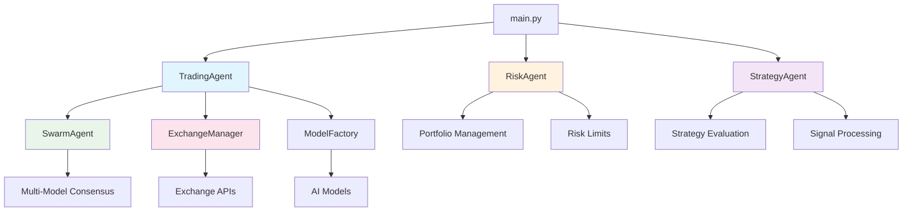
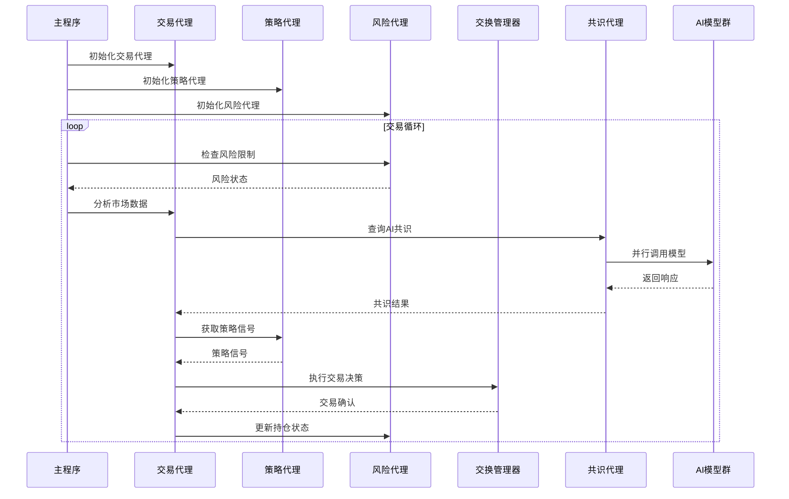
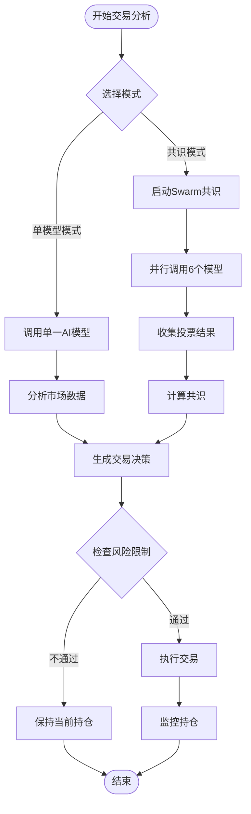
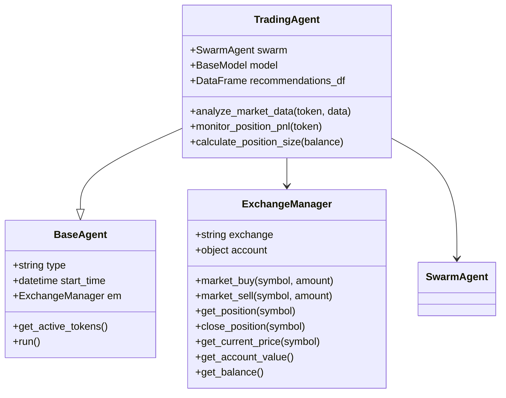
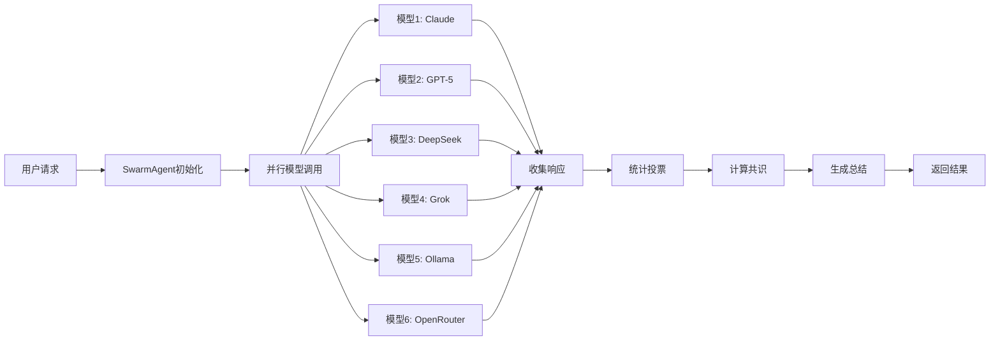
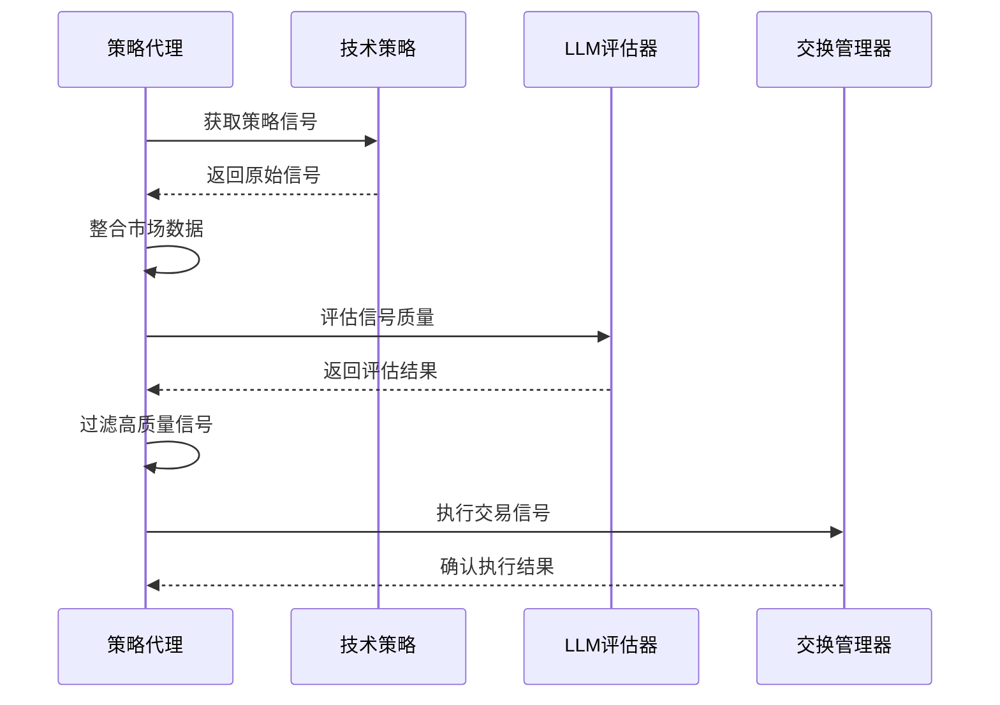
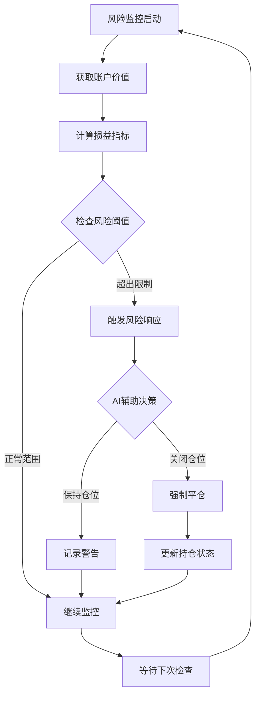
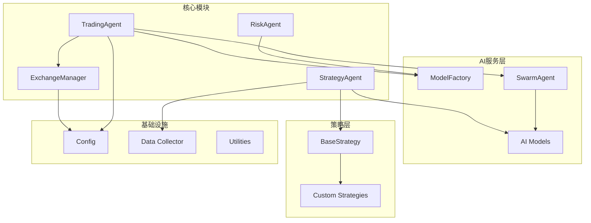

# 交易代理

<cite>
**本文档中引用的文件**
- [trading_agent.py](file://src/agents/trading_agent.py)
- [base_agent.py](file://src/agents/base_agent.py)
- [exchange_manager.py](file://src/exchange_manager.py)
- [risk_agent.py](file://src/agents/risk_agent.py)
- [strategy_agent.py](file://src/agents/strategy_agent.py)
- [swarm_agent.py](file://src/agents/swarm_agent.py)
- [model_factory.py](file://src/models/model_factory.py)
- [base_strategy.py](file://src/strategies/base_strategy.py)
- [main.py](file://src/main.py)
</cite>

## 目录
1. [简介](#简介)
2. [项目结构](#项目结构)
3. [核心组件](#核心组件)
4. [架构概览](#架构概览)
5. [详细组件分析](#详细组件分析)
6. [依赖关系分析](#依赖关系分析)
7. [性能考虑](#性能考虑)
8. [故障排除指南](#故障排除指南)
9. [结论](#结论)

## 简介

Moon Dev的AI交易代理是一个基于大型语言模型的智能交易系统，采用双重模式设计：单模型快速执行模式和多模型共识投票模式。该系统能够自动分析市场数据、生成交易信号、执行交易决策，并通过严格的风险管理确保资金安全。

### 主要特性

- **双模式交易系统**：支持单模型快速决策和多模型共识投票
- **多交易所支持**：兼容Aster DEX、HyperLiquid和Solana
- **智能风险管理**：内置止损、止盈和仓位控制机制
- **策略集成**：支持多种技术分析策略的组合使用
- **实时监控**：持续跟踪持仓表现和市场条件

## 项目结构

**图表来源**
- [main.py](file://src/main.py#L1-L104)
- [trading_agent.py](file://src/agents/trading_agent.py#L1-L1196)
- [exchange_manager.py](file://src/exchange_manager.py#L1-L382)

**章节来源**
- [main.py](file://src/main.py#L1-L104)
- [trading_agent.py](file://src/agents/trading_agent.py#L1-L1196)

## 核心组件

### 交易代理核心类

交易代理是整个系统的核心控制器，负责协调所有交易活动。它继承自基础代理类，提供统一的接口和配置管理。

### 风险代理

负责监控和管理交易风险，包括：
- 账户余额监控
- 损益限制检查
- 强制平仓机制
- AI辅助风险决策

### 策略代理

处理基于技术分析的交易策略：
- 多策略信号评估
- LLM辅助信号验证
- 仓位分配优化
- 执行策略信号

### 交换管理器

提供统一的交易所接口：
- 支持多个加密货币交易所
- 统一的订单管理和查询接口
- 仓位监控和风险控制
- 市场数据获取

**章节来源**
- [trading_agent.py](file://src/agents/trading_agent.py#L442-L459)
- [risk_agent.py](file://src/agents/risk_agent.py#L1-L632)
- [strategy_agent.py](file://src/agents/strategy_agent.py#L1-L306)
- [exchange_manager.py](file://src/exchange_manager.py#L1-L382)

## 架构概览

**图表来源**
- [main.py](file://src/main.py#L30-L60)
- [trading_agent.py](file://src/agents/trading_agent.py#L574-L600)
- [swarm_agent.py](file://src/agents/swarm_agent.py#L200-L300)

## 详细组件分析

### 交易代理核心功能

#### 双模式交易决策系统

交易代理支持两种不同的决策模式：

**单模型模式**（快速执行）
- 使用单一AI模型进行快速决策
- 响应时间约10秒/次
- 适合高频交易策略
- 配置灵活，支持多种AI提供商

**共识模式**（高精度决策）
- 同时调用6个不同AI模型
- 基于多数投票原则做出决策
- 响应时间约45-60秒/次
- 提供更高的决策质量

**图表来源**
- [trading_agent.py](file://src/agents/trading_agent.py#L600-L700)
- [swarm_agent.py](file://src/agents/swarm_agent.py#L250-L350)

#### 仓位管理和风险控制

系统实现了多层次的风险管理机制：

| 风险控制层级 | 控制参数 | 默认值 | 说明 |
|-------------|----------|--------|------|
| 仓位规模控制 | MAX_POSITION_PERCENTAGE | 90% | 单笔交易最大占账户比例 |
| 杠杆控制 | LEVERAGE | 9x | Aster/HyperLiquid杠杆倍数 |
| 止损设置 | STOP_LOSS_PERCENTAGE | 5.0% | 单笔交易最大亏损百分比 |
| 止盈设置 | TAKE_PROFIT_PERCENTAGE | 5.0% | 单笔交易最大盈利百分比 |
| 现金缓冲 | CASH_PERCENTAGE | 20% | 最低现金储备比例 |

#### 与交易所的交互机制

**图表来源**
- [exchange_manager.py](file://src/exchange_manager.py#L20-L100)
- [trading_agent.py](file://src/agents/trading_agent.py#L442-L459)
- [base_agent.py](file://src/agents/base_agent.py#L10-L30)

**章节来源**
- [trading_agent.py](file://src/agents/trading_agent.py#L442-L459)
- [exchange_manager.py](file://src/exchange_manager.py#L100-L200)

### 共识代理系统

#### 多模型投票机制

SwarmAgent实现了先进的多模型共识系统：

**模型配置**
- 支持最多6个不同AI提供商
- 包括Claude、GPT-5、DeepSeek等顶级模型
- 支持本地推理模型（Ollama）
- 可配置的超时和重试机制

**投票算法**
1. 并行调用所有配置的模型
2. 统计每个模型的投票结果
3. 计算多数投票和置信度
4. 生成最终共识决策

**图表来源**
- [swarm_agent.py](file://src/agents/swarm_agent.py#L200-L300)

#### 错误处理和重试机制

系统实现了完善的错误处理策略：

- **超时保护**：每个模型查询设置90秒超时
- **失败重试**：自动重试失败的模型调用
- **降级处理**：部分模型失败时仍能返回有效结果
- **异常隔离**：单个模型错误不影响整体系统

**章节来源**
- [swarm_agent.py](file://src/agents/swarm_agent.py#L150-L250)

### 策略代理系统

#### 多策略信号评估

策略代理负责整合和评估各种技术分析策略：

**策略评估流程**
1. 收集所有启用策略的信号
2. 整合市场上下文数据
3. 使用LLM评估信号一致性
4. 过滤和批准高质量信号
5. 执行批准的交易信号

**图表来源**
- [strategy_agent.py](file://src/agents/strategy_agent.py#L100-L200)

#### 信号验证和过滤

系统使用LLM对策略信号进行深度验证：

**验证标准**
- 市场条件匹配度
- 策略间一致性
- 风险收益比评估
- 置信度评分

**章节来源**
- [strategy_agent.py](file://src/agents/strategy_agent.py#L50-L150)

### 风险管理系统

#### 动态风险监控

风险代理实现了全面的风险监控体系：

**监控指标**
- 账户总价值变化
- 单笔交易损益
- 整体投资组合表现
- 最大回撤追踪

**风险控制措施**
- 自动止损触发
- 强制平仓机制
- 仓位规模限制
- 现金流动性管理

**图表来源**
- [risk_agent.py](file://src/agents/risk_agent.py#L400-L500)

**章节来源**
- [risk_agent.py](file://src/agents/risk_agent.py#L300-L400)

## 依赖关系分析

### 系统依赖图

**图表来源**
- [trading_agent.py](file://src/agents/trading_agent.py#L1-L50)
- [exchange_manager.py](file://src/exchange_manager.py#L1-L50)
- [model_factory.py](file://src/models/model_factory.py#L1-L50)

### 模块间通信

系统采用事件驱动和轮询相结合的方式进行模块间通信：

**通信模式**
- **主动轮询**：主程序定期调用各代理
- **被动通知**：风险代理主动触发交易调整
- **事件驱动**：策略代理响应市场变化

**数据流**
- 市场数据 → 交易代理 → 决策生成
- 交易信号 → 策略代理 → 信号验证
- 风险指标 → 风险代理 → 风险控制

**章节来源**
- [main.py](file://src/main.py#L30-L60)
- [trading_agent.py](file://src/agents/trading_agent.py#L1-L100)

## 性能考虑

### 并发处理优化

系统采用多种并发优化策略：

**并行模型调用**
- 使用ThreadPoolExecutor实现并行模型查询
- 支持动态线程池大小调整
- 实现超时和资源限制

**批量数据处理**
- 批量获取市场数据
- 批量执行交易操作
- 批量更新持仓状态

### 缓存和状态管理

**缓存策略**
- 市场数据缓存（15分钟）
- 仓位信息缓存（5秒）
- AI响应缓存（1小时）

**内存优化**
- 及时释放不需要的数据
- 使用生成器处理大数据集
- 实现弱引用避免内存泄漏

### 网络优化

**连接池管理**
- 复用HTTP连接
- 实现连接健康检查
- 支持自动重连机制

**请求优化**
- 压缩传输数据
- 实现请求去重
- 支持断点续传

## 故障排除指南

### 常见问题和解决方案

#### AI模型连接问题

**问题症状**
- 模型初始化失败
- 请求超时错误
- API配额耗尽

**解决步骤**
1. 检查环境变量配置
2. 验证API密钥有效性
3. 查看模型可用性状态
4. 实施重试机制

#### 交易所连接问题

**问题症状**
- 订单提交失败
- 仓位查询超时
- 价格数据缺失

**解决步骤**
1. 检查网络连接状态
2. 验证交易所API凭证
3. 确认交易所服务状态
4. 实施备用交易所切换

#### 风险控制触发

**问题症状**
- 自动平仓频繁发生
- 仓位规模受限
- 资金流动性不足

**解决步骤**
1. 调整风险参数设置
2. 优化仓位分配策略
3. 增加资金流动性
4. 监控市场波动性

**章节来源**
- [swarm_agent.py](file://src/agents/swarm_agent.py#L100-L150)
- [exchange_manager.py](file://src/exchange_manager.py#L300-L382)

## 结论

Moon Dev的AI交易代理系统代表了现代量化交易的发展方向，通过人工智能、分布式共识和严格风险管理的有机结合，为用户提供了一个既智能又安全的交易解决方案。

### 系统优势

1. **智能决策**：利用先进AI模型提供高质量交易决策
2. **风险可控**：多层次风险管理体系确保资金安全
3. **灵活扩展**：模块化设计支持策略和模型的灵活添加
4. **高效执行**：并行处理和优化算法提升系统性能

### 发展方向

- **策略优化**：持续改进和添加新的技术分析策略
- **模型增强**：集成更多AI模型和推理能力
- **用户体验**：提供更直观的监控和管理界面
- **合规性**：加强系统合规性和审计功能

该系统为加密货币交易提供了一个强大而可靠的自动化解决方案，通过技术创新推动了交易智能化的发展进程。