# 代理系统

<cite>
**本文档引用的文件**
- [base_agent.py](file://src/agents/base_agent.py)
- [trading_agent.py](file://src/agents/trading_agent.py)
- [risk_agent.py](file://src/agents/risk_agent.py)
- [strategy_agent.py](file://src/agents/strategy_agent.py)
- [copybot_agent.py](file://src/agents/copybot_agent.py)
- [sentiment_agent.py](file://src/agents/sentiment_agent.py)
- [swarm_agent.py](file://src/agents/swarm_agent.py)
- [config.py](file://src/config.py)
</cite>

## 目录
1. [简介](#简介)
2. [系统架构概览](#系统架构概览)
3. [BaseAgent基类设计](#baseagent基类设计)
4. [具体代理类型详解](#具体代理类型详解)
5. [代理间通信机制](#代理间通信机制)
6. [生命周期管理](#生命周期管理)
7. [错误处理与恢复策略](#错误处理与恢复策略)
8. [性能优化技巧](#性能优化技巧)
9. [自定义代理开发指南](#自定义代理开发指南)
10. [最佳实践与故障排除](#最佳实践与故障排除)

## 简介

Moon Dev的代理系统是一个高度模块化和可扩展的AI驱动交易生态系统。该系统采用面向对象的设计模式，通过统一的BaseAgent基类为所有具体代理提供标准化接口和基础设施支持。系统包含多种专门化的代理，每个代理都承担特定的交易职责，从基础的市场分析到复杂的策略执行。

## 系统架构概览

代理系统采用分层架构设计，确保了良好的可维护性和扩展性：

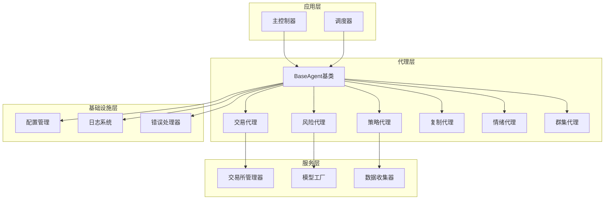

**图表来源**
- [base_agent.py](file://src/agents/base_agent.py#L1-L58)
- [trading_agent.py](file://src/agents/trading_agent.py#L1-L100)
- [risk_agent.py](file://src/agents/risk_agent.py#L1-L100)

## BaseAgent基类设计

BaseAgent是整个代理系统的核心基类，为所有具体代理提供了统一的接口和基础功能。

### 核心架构设计

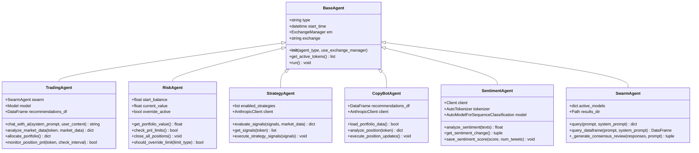

**图表来源**
- [base_agent.py](file://src/agents/base_agent.py#L15-L58)
- [trading_agent.py](file://src/agents/trading_agent.py#L400-L500)
- [risk_agent.py](file://src/agents/risk_agent.py#L62-L150)

### 核心方法实现

#### 初始化方法 (`__init__`)
BaseAgent的初始化过程包含了智能的依赖注入和错误处理机制：

- **代理类型识别**：通过`agent_type`参数标识代理的具体用途
- **交换器管理**：可选的ExchangeManager集成，提供统一的交易接口
- **环境变量加载**：自动加载必要的API密钥和配置参数
- **回退机制**：当ExchangeManager不可用时，自动切换到直接函数调用

#### 运行方法 (`run`)
所有派生代理必须实现此方法，但BaseAgent提供了默认的未实现异常提示，确保强制子类实现：

```python
def run(self):
    """默认运行方法 - 应该被子类重写"""
    raise NotImplementedError("每个代理必须实现自己的运行方法")
```

#### 获取活跃代币 (`get_active_tokens`)
提供统一的代币列表访问接口，根据当前激活的交易所动态返回适当的代币列表。

**章节来源**
- [base_agent.py](file://src/agents/base_agent.py#L15-L58)

## 具体代理类型详解

### TradingAgent - 交易代理

TradingAgent是系统中最核心的代理，负责执行实际的交易决策和执行。

#### 主要功能特性

- **双模式交易**：支持单模型快速模式和群集共识模式
- **多交易所支持**：兼容Solana、HyperLiquid和Aster交易所
- **智能仓位管理**：基于AI的仓位大小计算和风险管理
- **实时监控**：持续监控持仓盈亏和自动止盈止损

#### 交易流程架构

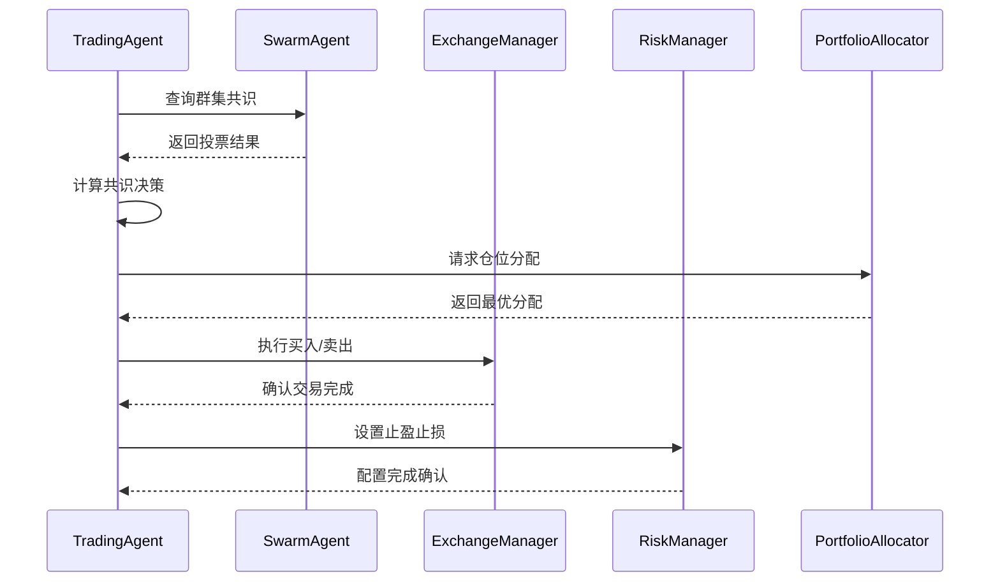

**图表来源**
- [trading_agent.py](file://src/agents/trading_agent.py#L600-L700)
- [swarm_agent.py](file://src/agents/swarm_agent.py#L200-L300)

#### 配置参数详解

| 参数名称 | 类型 | 默认值 | 描述 |
|---------|------|--------|------|
| EXCHANGE | string | "ASTER" | 目标交易所：ASTER、HYPERLIQUID或SOLANA |
| USE_SWARM_MODE | boolean | True | 是否启用群集模式 |
| LONG_ONLY | boolean | True | 是否只进行多头交易 |
| MAX_POSITION_PERCENTAGE | float | 90 | 单笔交易最大仓位百分比 |
| LEVERAGE | integer | 9 | 杠杆倍数（1-125x） |
| STOP_LOSS_PERCENTAGE | float | 5.0 | 止损百分比 |
| TAKE_PROFIT_PERCENTAGE | float | 5.0 | 止盈百分比 |

**章节来源**
- [trading_agent.py](file://src/agents/trading_agent.py#L66-L150)

### RiskAgent - 风险代理

RiskAgent专注于风险管理，确保交易活动在安全的范围内进行。

#### 风险管理层次结构

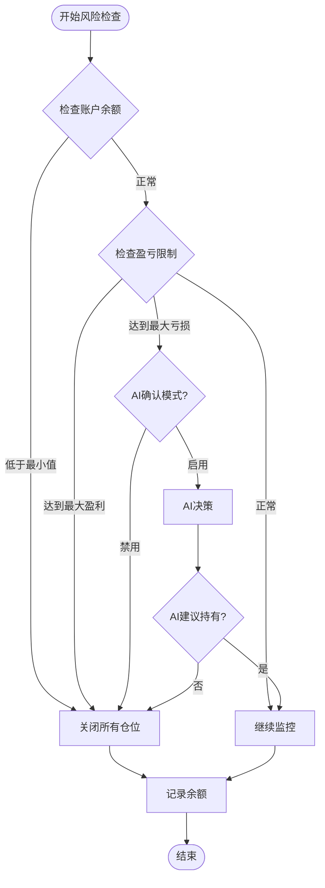

**图表来源**
- [risk_agent.py](file://src/agents/risk_agent.py#L500-L600)

#### 风险控制机制

- **账户余额监控**：实时跟踪账户价值，防止资金不足
- **盈亏百分比限制**：基于初始余额的百分比限制
- **AI辅助决策**：在触及极限时咨询AI进行智能决策
- **仓位平仓保护**：自动平仓以防止进一步损失

**章节来源**
- [risk_agent.py](file://src/agents/risk_agent.py#L62-L200)

### StrategyAgent - 策略代理

StrategyAgent负责管理和执行各种技术分析策略，提供多维度的交易信号。

#### 策略执行流水线

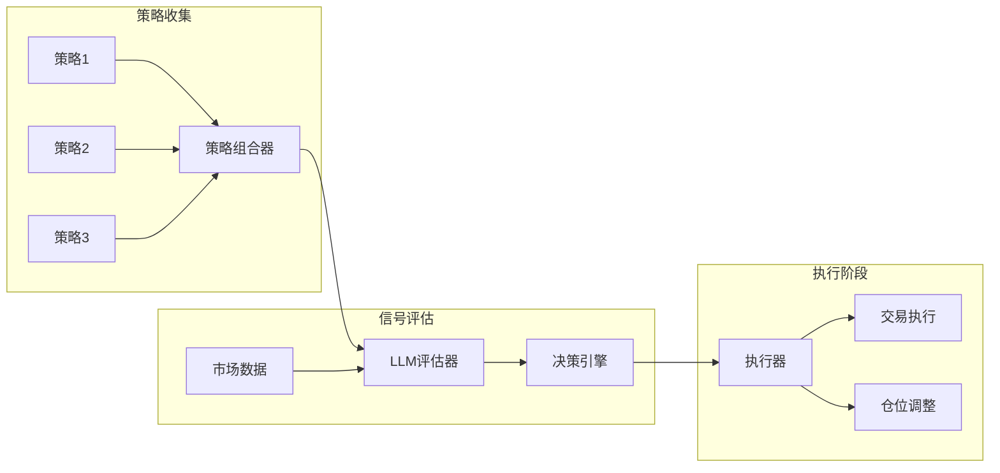

**图表来源**
- [strategy_agent.py](file://src/agents/strategy_agent.py#L100-L200)

#### 策略信号处理

- **多策略融合**：整合多个独立策略的信号
- **LLM验证**：使用大型语言模型验证信号质量
- **风险过滤**：基于置信度阈值过滤信号
- **仓位优化**：结合当前仓位状态优化新仓位

**章节来源**
- [strategy_agent.py](file://src/agents/strategy_agent.py#L150-L250)

### CopyBotAgent - 复制代理

CopyBotAgent分析现有的复制交易组合，识别优化机会并执行仓位调整。

#### 复制交易分析框架

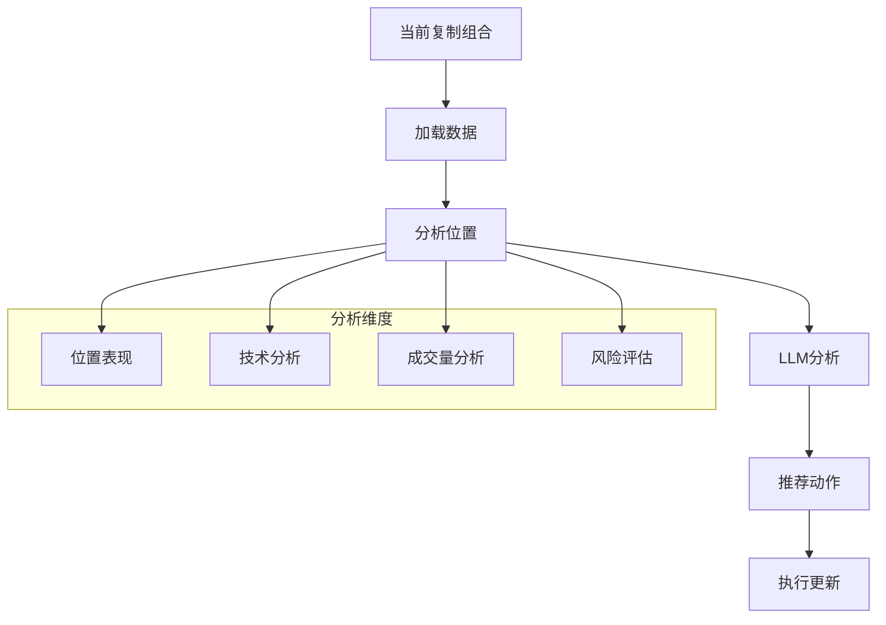

**图表来源**
- [copybot_agent.py](file://src/agents/copybot_agent.py#L100-L200)

**章节来源**
- [copybot_agent.py](file://src/agents/copybot_agent.py#L50-L150)

### SentimentAgent - 情绪代理

SentimentAgent监控Twitter等社交媒体平台，分析市场情绪并对重要变化进行语音播报。

#### 情绪分析工作流

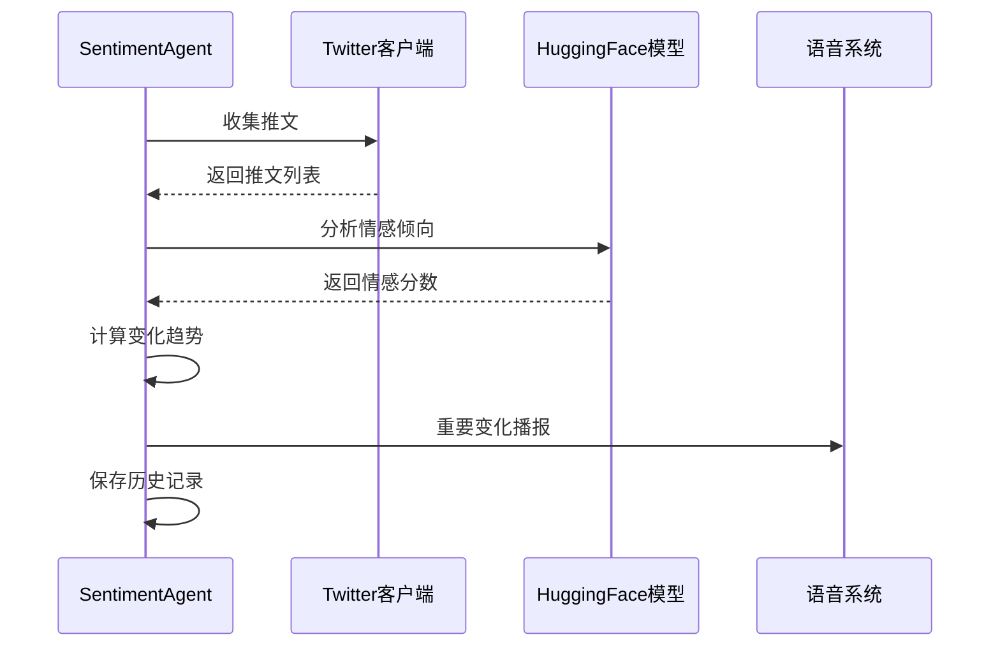

**图表来源**
- [sentiment_agent.py](file://src/agents/sentiment_agent.py#L400-L500)

#### 情绪指标计算

- **BERTweet模型**：使用预训练的情感分析模型
- **时间序列分析**：跟踪情感变化趋势
- **阈值触发**：基于情感强度和变化率的播报触发
- **语音通知**：重要的市场情绪变化实时播报

**章节来源**
- [sentiment_agent.py](file://src/agents/sentiment_agent.py#L100-L200)

### SwarmAgent - 群集代理

SwarmAgent提供多模型协作能力，通过并行查询多个AI模型获得更全面的决策支持。

#### 群集协作架构

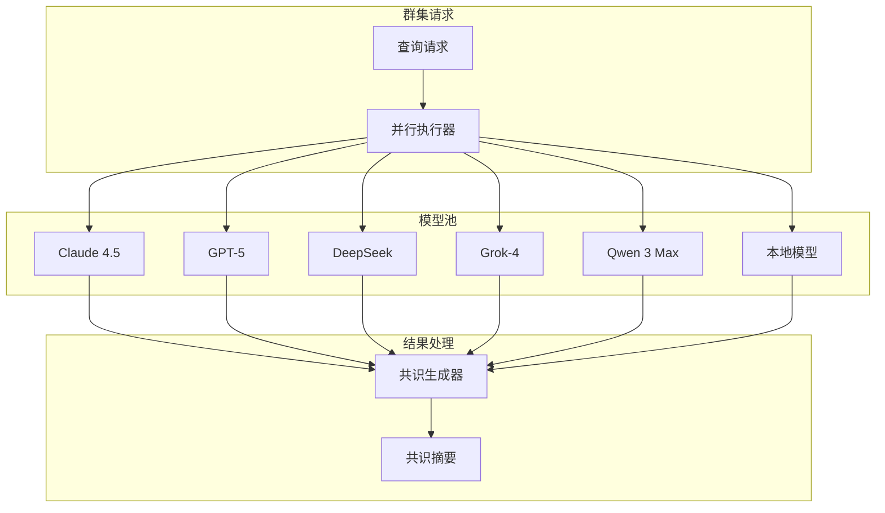

**图表来源**
- [swarm_agent.py](file://src/agents/swarm_agent.py#L300-L400)

#### 并行处理机制

- **线程池执行**：使用ThreadPoolExecutor实现并行查询
- **超时管理**：为每个模型设置合理的超时时间
- **错误恢复**：单个模型失败不影响整体流程
- **共识合成**：使用专门的AI模型生成最终共识

**章节来源**
- [swarm_agent.py](file://src/agents/swarm_agent.py#L200-L350)

## 代理间通信机制

代理系统采用事件驱动和消息传递的通信模式，确保各代理之间的协调工作。

### 观察者模式实现

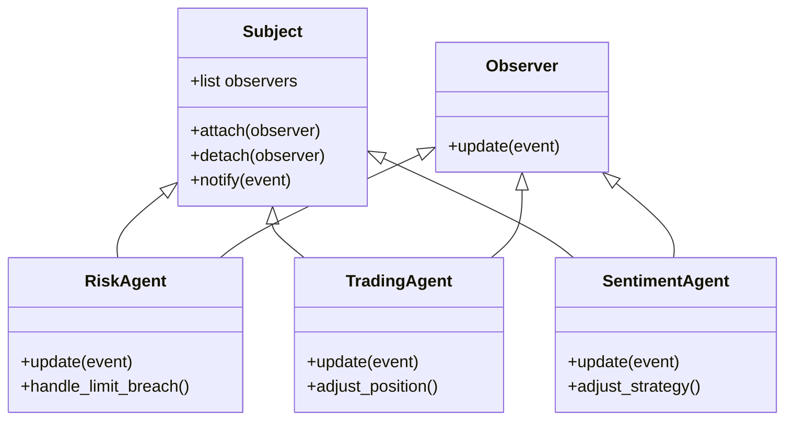

### 事件类型定义

| 事件类型 | 触发条件 | 处理方式 |
|---------|----------|----------|
| POSITION_UPDATE | 仓位发生变化 | RiskAgent检查风险限制 |
| MARKET_DATA | 新的市场数据到达 | TradingAgent重新分析 |
| SENTIMENT_CHANGE | 市场情绪显著变化 | StrategyAgent调整策略 |
| RISK_LIMIT_HIT | 风险限制被触及 | 所有相关代理响应 |
| PORTFOLIO_CHANGED | 投资组合变更 | CopyBotAgent更新分析 |

### 消息队列机制

系统使用异步消息队列确保代理间的可靠通信：

- **生产者-消费者模式**：代理发布事件，其他代理订阅处理
- **优先级队列**：关键事件具有更高处理优先级
- **持久化存储**：重要事件在内存中持久化以防丢失
- **重试机制**：失败的消息自动重试直到成功

## 生命周期管理

代理系统实现了完整的生命周期管理，涵盖初始化、运行、监控和清理各个阶段。

### 初始化阶段

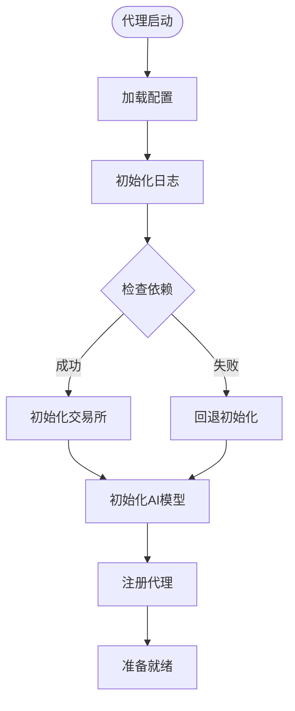

**图表来源**
- [base_agent.py](file://src/agents/base_agent.py#L15-L40)

### 运行阶段监控

每个代理都有内置的健康监控机制：

- **心跳检测**：定期检查代理运行状态
- **资源监控**：跟踪内存和CPU使用情况
- **错误计数**：记录连续失败次数
- **性能指标**：收集关键性能指标

### 清理阶段


**章节来源**
- [base_agent.py](file://src/agents/base_agent.py#L40-L58)

## 错误处理与恢复策略

代理系统实现了多层次的错误处理和恢复机制，确保系统的稳定性和可靠性。

### 错误分类体系

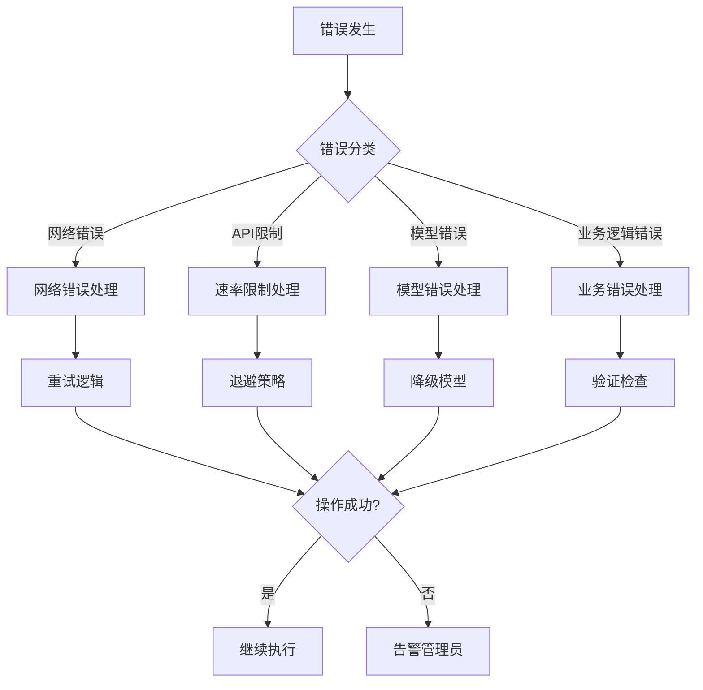

### 重试机制

系统实现了指数退避的重试策略：

- **基础延迟**：初始重试延迟1秒
- **指数增长**：每次重试延迟翻倍
- **最大重试**：最多重试5次
- **随机抖动**：避免重试风暴

### 故障隔离

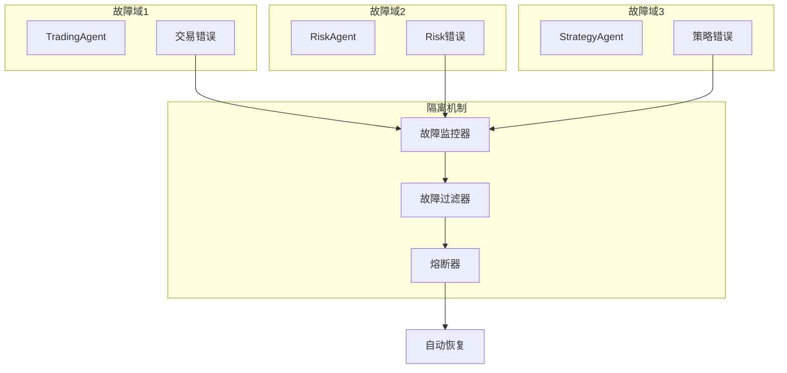

### 自动恢复策略

- **熔断器模式**：连续失败超过阈值时暂停服务
- **降级服务**：关键功能降级为基本功能
- **快速失败**：立即失败而非长时间等待
- **优雅降级**：保持部分功能可用性

**章节来源**
- [risk_agent.py](file://src/agents/risk_agent.py#L400-L500)
- [swarm_agent.py](file://src/agents/swarm_agent.py#L400-L500)

## 性能优化技巧

代理系统采用了多种性能优化技术，确保在高负载下仍能保持高效运行。

### 异步执行优化

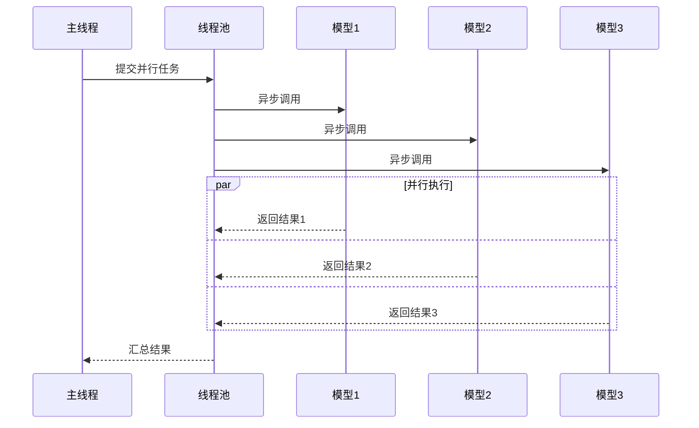

**图表来源**
- [swarm_agent.py](file://src/agents/swarm_agent.py#L350-L450)

### 资源管理策略

#### 内存优化

- **对象池**：重用频繁创建的对象
- **弱引用**：避免循环引用导致的内存泄漏
- **垃圾回收**：主动触发垃圾回收清理无用对象
- **缓存策略**：智能缓存常用数据减少重复计算

#### 并发控制

- **信号量**：限制同时运行的任务数量
- **互斥锁**：保护共享资源的并发访问
- **读写锁**：优化读多写少场景的性能
- **生产者-消费者**：平衡生产速度和消费速度

### 缓存机制

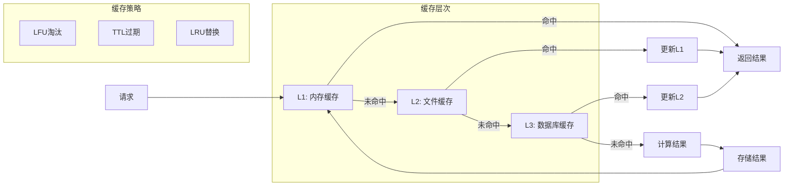

### 性能监控指标

| 指标类别 | 关键指标 | 目标值 | 监控方式 |
|---------|----------|--------|----------|
| 响应时间 | 平均响应时间 | < 2秒 | 实时监控 |
| 吞吐量 | 每分钟请求数 | > 100 req/min | 定期统计 |
| 错误率 | 失败请求比例 | < 1% | 错误追踪 |
| 资源利用率 | CPU使用率 | < 80% | 系统监控 |
| 内存使用 | 峰值内存占用 | < 2GB | 内存分析 |

**章节来源**
- [swarm_agent.py](file://src/agents/swarm_agent.py#L500-L568)

## 自定义代理开发指南

开发自定义代理需要遵循系统的架构规范和最佳实践。

### 开发步骤

#### 1. 继承BaseAgent基类

```python
from src.agents.base_agent import BaseAgent

class CustomAgent(BaseAgent):
    def __init__(self):
        super().__init__('custom', use_exchange_manager=True)
        # 自定义初始化代码
```

#### 2. 实现核心方法

```python
def run(self):
    """主要执行逻辑"""
    try:
        # 1. 获取必要数据
        data = self.get_required_data()
        
        # 2. 执行分析
        analysis = self.perform_analysis(data)
        
        # 3. 生成决策
        decision = self.make_decision(analysis)
        
        # 4. 执行操作
        self.execute_decision(decision)
        
        return True
        
    except Exception as e:
        self.logger.error(f"CustomAgent运行失败: {e}")
        return False
```

#### 3. 集成到系统

```python
# 在主程序中注册
from src.agents.custom_agent import CustomAgent

def main():
    agent = CustomAgent()
    
    while True:
        try:
            agent.run()
            time.sleep(SLEEP_BETWEEN_RUNS_MINUTES * 60)
        except KeyboardInterrupt:
            break
        except Exception as e:
            logger.error(f"代理运行异常: {e}")
            time.sleep(60)  # 等待后重试
```

### 最佳实践

#### 代码组织

- **单一职责**：每个代理只负责一个特定功能
- **依赖注入**：通过构造函数注入依赖项
- **配置分离**：将配置参数与业务逻辑分离
- **日志记录**：添加详细的日志记录便于调试

#### 错误处理

- **异常捕获**：包装所有外部调用的异常
- **优雅降级**：在失败时提供备选方案
- **状态恢复**：确保系统状态的一致性
- **用户反馈**：向用户提供清晰的错误信息

#### 测试策略

- **单元测试**：测试每个方法的独立功能
- **集成测试**：测试与其他组件的交互
- **性能测试**：验证在高负载下的表现
- **压力测试**：测试系统的极限处理能力

**章节来源**
- [base_agent.py](file://src/agents/base_agent.py#L15-L58)

## 最佳实践与故障排除

### 部署最佳实践

#### 环境配置

- **Python版本**：推荐使用Python 3.9+
- **依赖管理**：使用requirements.txt管理依赖
- **虚拟环境**：为每个部署创建独立的虚拟环境
- **日志轮转**：配置日志文件轮转防止磁盘满

#### 监控配置

```python
# 健康检查端点
@app.route('/health')
def health_check():
    return {
        'status': 'healthy',
        'timestamp': datetime.now().isoformat(),
        'agents': {
            'trading': trading_agent.is_healthy(),
            'risk': risk_agent.is_healthy(),
            'strategy': strategy_agent.is_healthy()
        }
    }
```

### 常见问题排除

#### 代理启动失败

**症状**：代理无法正常启动
**可能原因**：
- 配置文件缺失或格式错误
- 必要的API密钥未设置
- 依赖包安装不完整

**解决方案**：
1. 检查配置文件语法
2. 验证环境变量设置
3. 重新安装依赖包

#### 性能问题

**症状**：代理响应缓慢或内存占用过高
**诊断步骤**：
1. 使用性能分析工具定位瓶颈
2. 检查是否有内存泄漏
3. 优化算法复杂度

#### 交易执行失败

**症状**：交易订单无法提交或取消
**排查流程**：
1. 检查交易所连接状态
2. 验证账户权限设置
3. 确认网络连接稳定性

### 调试技巧

#### 日志分析

```python
# 启用详细日志
import logging
logging.basicConfig(level=logging.DEBUG)

# 添加自定义日志
logger = logging.getLogger(__name__)
logger.debug(f"代理状态: {agent.status}")
logger.info(f"执行决策: {decision}")
logger.warning(f"异常情况: {error}")
```

#### 性能分析

```python
import cProfile
import pstats

def profile_agent():
    profiler = cProfile.Profile()
    profiler.enable()
    
    # 执行代理逻辑
    agent.run()
    
    profiler.disable()
    stats = pstats.Stats(profiler)
    stats.sort_stats('cumulative')
    stats.print_stats(10)  # 显示前10个最耗时的函数
```

### 安全考虑

#### API密钥管理

- **环境变量**：不要将密钥硬编码在代码中
- **加密存储**：对敏感信息进行加密存储
- **访问控制**：限制密钥的访问权限
- **定期轮换**：定期更换API密钥

#### 输入验证

```python
def validate_input(data):
    """验证输入数据的有效性"""
    if not isinstance(data, dict):
        raise ValueError("输入必须是字典类型")
    
    required_fields = ['token', 'amount', 'price']
    for field in required_fields:
        if field not in data:
            raise ValueError(f"缺少必需字段: {field}")
    
    if data['amount'] <= 0:
        raise ValueError("金额必须大于零")
    
    return True
```

通过遵循这些最佳实践和排除指南，可以确保代理系统的稳定运行和高效性能。系统的设计充分考虑了可扩展性和可维护性，为未来的功能扩展提供了坚实的基础。