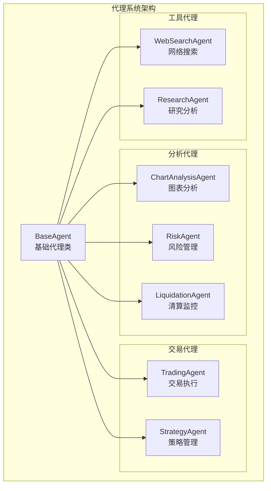
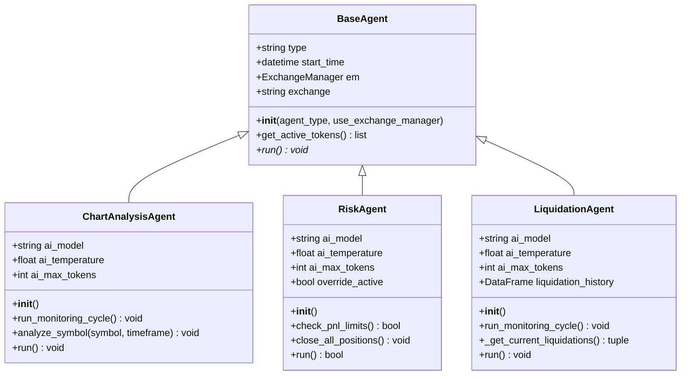
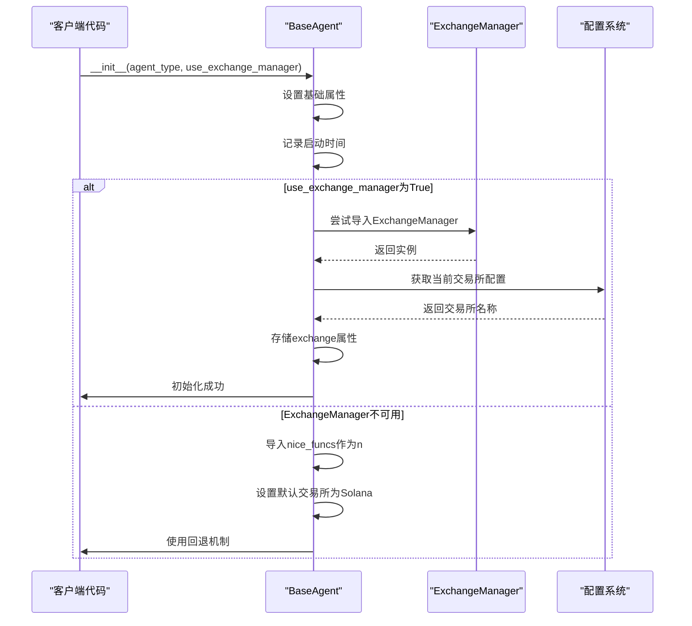
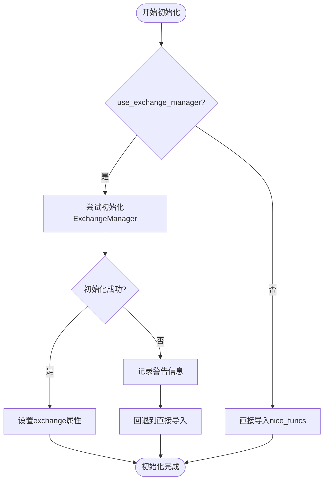

# 基础代理

<cite>
**本文档中引用的文件**
- [base_agent.py](file://src/agents/base_agent.py)
- [chartanalysis_agent.py](file://src/agents/chartanalysis_agent.py)
- [risk_agent.py](file://src/agents/risk_agent.py)
- [liquidation_agent.py](file://src/agents/liquidation_agent.py)
- [config.py](file://src/config.py)
- [main.py](file://src/main.py)
</cite>

## 目录
1. [简介](#简介)
2. [项目结构](#项目结构)
3. [核心组件](#核心组件)
4. [架构概览](#架构概览)
5. [详细组件分析](#详细组件分析)
6. [依赖关系分析](#依赖关系分析)
7. [性能考虑](#性能考虑)
8. [故障排除指南](#故障排除指南)
9. [结论](#结论)

## 简介

BaseAgent是Moon Dev AI交易系统中的核心基类，为所有代理类型提供了统一的基础设施和标准化接口。作为所有代理的父类，它定义了通用的生命周期管理、错误处理、配置管理和工具方法，确保了系统的可维护性和一致性。

该基类采用面向对象设计原则，通过抽象方法强制子类实现特定功能，同时提供丰富的默认实现来简化开发过程。BaseAgent支持多种初始化选项，包括可选的交易所管理器集成，为不同类型的交易策略提供了灵活的扩展能力。

## 项目结构

Moon Dev AI代理系统采用模块化架构，每个代理都是BaseAgent的子类，具有特定的功能领域：



**图表来源**
- [base_agent.py](file://src/agents/base_agent.py#L1-L58)
- [chartanalysis_agent.py](file://src/agents/chartanalysis_agent.py#L71-L72)
- [risk_agent.py](file://src/agents/risk_agent.py#L62-L63)
- [liquidation_agent.py](file://src/agents/liquidation_agent.py#L83-L84)

**章节来源**
- [base_agent.py](file://src/agents/base_agent.py#L1-L58)

## 核心组件

### BaseAgent类设计

BaseAgent类采用了简洁而强大的设计模式，提供了以下核心功能：

#### 初始化机制
- **类型标识**：通过`agent_type`参数标识代理类型
- **可选交易所集成**：支持`use_exchange_manager`标志启用统一交易接口
- **时间跟踪**：自动记录启动时间用于性能监控

#### 配置管理系统
- **动态令牌获取**：根据活跃交易所动态选择代币列表
- **回退机制**：在ExchangeManager不可用时使用直接函数导入
- **环境变量支持**：集成API密钥和模型配置

#### 生命周期管理
- **运行接口**：抽象的`run()`方法强制子类实现
- **状态管理**：统一的代理状态跟踪
- **资源清理**：可扩展的清理机制（部分实现）

**章节来源**
- [base_agent.py](file://src/agents/base_agent.py#L12-L58)

## 架构概览

BaseAgent在整个系统中扮演着基础设施的角色，为上层代理提供统一的服务接口：



**图表来源**
- [base_agent.py](file://src/agents/base_agent.py#L12-L58)
- [chartanalysis_agent.py](file://src/agents/chartanalysis_agent.py#L71-L72)
- [risk_agent.py](file://src/agents/risk_agent.py#L62-L63)
- [liquidation_agent.py](file://src/agents/liquidation_agent.py#L83-L84)

## 详细组件分析

### 初始化流程分析

BaseAgent的初始化过程体现了优雅的设计模式：



**图表来源**
- [base_agent.py](file://src/agents/base_agent.py#L12-L45)

#### 抽象方法设计

BaseAgent定义了`run()`方法作为抽象接口，强制所有子类实现：

```python
def run(self):
    """Default run method - should be overridden by child classes"""
    raise NotImplementedError("Each agent must implement its own run method")
```

这种设计确保了：
- **强制实现**：编译时检查子类必须实现run方法
- **统一接口**：所有代理都遵循相同的调用模式
- **灵活性**：子类可以完全自定义运行逻辑

**章节来源**
- [base_agent.py](file://src/agents/base_agent.py#L56-L58)

### 配置管理机制

BaseAgent提供了灵活的配置管理方案：

#### 动态令牌获取
```python
def get_active_tokens(self):
    """Get the appropriate token/symbol list based on active exchange"""
    try:
        from src.config import get_active_tokens
        return get_active_tokens()
    except:
        from src.config import MONITORED_TOKENS
        return MONITORED_TOKENS
```

该方法展示了：
- **优先级机制**：优先使用动态配置函数
- **回退策略**：在函数不可用时使用静态配置
- **跨平台兼容**：支持不同交易所的代币映射

#### AI参数配置
所有子类都可以通过配置文件或环境变量自定义AI参数：
- **模型选择**：支持多种AI模型（Claude、OpenAI、DeepSeek等）
- **温度控制**：调节AI输出的创造性
- **最大令牌数**：控制响应长度

**章节来源**
- [base_agent.py](file://src/agents/base_agent.py#L47-L55)

### 错误处理和日志记录

BaseAgent及其子类实现了多层次的错误处理机制：

#### 初始化错误处理


**图表来源**
- [base_agent.py](file://src/agents/base_agent.py#L25-L45)

#### 运行时错误处理
子类代理实现了各自的错误处理策略：

##### ChartAnalysisAgent错误处理
- **API调用异常**：处理OpenAI和Anthropic API连接问题
- **数据获取失败**：优雅处理市场数据获取失败
- **AI响应解析**：安全解析AI返回结果

##### RiskAgent错误处理
- **位置数据获取**：处理钱包余额查询失败
- **AI分析异常**：处理风险评估AI调用失败
- **仓位关闭异常**：处理仓位平仓过程中的错误

##### LiquidationAgent错误处理
- **清算数据获取**：处理API数据获取超时
- **历史数据加载**：处理CSV文件读取错误
- **语音合成失败**：处理TTS服务调用失败

**章节来源**
- [chartanalysis_agent.py](file://src/agents/chartanalysis_agent.py#L100-L150)
- [risk_agent.py](file://src/agents/risk_agent.py#L150-L200)
- [liquidation_agent.py](file://src/agents/liquidation_agent.py#L200-L250)

### 公共工具方法

BaseAgent提供了多个实用的公共方法：

#### 时间跟踪
```python
self.start_time = datetime.now()
```
用于监控代理运行时间和性能分析。

#### 交易所集成
```python
@property
def exchange(self):
    return self.exchange
```
提供对当前活跃交易所的访问。

#### 工具函数访问
```python
@property
def n(self):
    return self.n
```
提供对nice_funcs工具集的便捷访问。

**章节来源**
- [base_agent.py](file://src/agents/base_agent.py#L18-L45)

## 依赖关系分析

BaseAgent的依赖关系体现了清晰的分层架构：

```mermaid
graph TD
subgraph "外部依赖"
TermColor["termcolor<br/>彩色输出"]
Pandas["pandas<br/>数据处理"]
DateTime["datetime<br/>时间处理"]
end
subgraph "内部模块"
Config["src.config<br/>配置管理"]
NiceFuncs["src.nice_funcs<br/>工具函数"]
ExchangeManager["src.exchange_manager<br/>交易所管理"]
end
subgraph "BaseAgent"
BaseAgent["BaseAgent"]
end
subgraph "具体代理"
ChartAgent["ChartAnalysisAgent"]
RiskAgent["RiskAgent"]
LiquidationAgent["LiquidationAgent"]
end
TermColor --> BaseAgent
Pandas --> BaseAgent
DateTime --> BaseAgent
Config --> BaseAgent
NiceFuncs --> BaseAgent
ExchangeManager --> BaseAgent
BaseAgent --> ChartAgent
BaseAgent --> RiskAgent
BaseAgent --> LiquidationAgent
```

**图表来源**
- [base_agent.py](file://src/agents/base_agent.py#L1-L10)
- [config.py](file://src/config.py#L1-L50)

### 模块间通信

BaseAgent通过以下机制实现模块间通信：

#### 配置共享
所有子类都通过相同的方式访问配置信息：
- 统一的配置加载机制
- 动态配置更新支持
- 环境变量优先级

#### 工具函数共享
通过`nice_funcs`模块提供统一的工具函数访问：
- 市场数据获取
- 交易执行
- 账户管理

#### 日志系统集成
使用termcolor实现统一的日志输出格式：
- 错误信息红色显示
- 警告信息黄色显示
- 成功信息绿色显示
- 信息提示蓝色显示

**章节来源**
- [base_agent.py](file://src/agents/base_agent.py#L1-L10)
- [config.py](file://src/config.py#L40-L60)

## 性能考虑

BaseAgent的设计充分考虑了性能优化：

### 内存管理
- **延迟初始化**：ExchangeManager按需初始化
- **资源清理**：支持可扩展的清理机制
- **数据缓存**：智能缓存频繁访问的数据

### 并发处理
- **异步支持**：为未来的异步操作预留接口
- **线程安全**：关键状态变量的保护
- **资源池化**：复用昂贵的对象创建

### 性能监控
- **启动时间记录**：自动记录初始化耗时
- **运行时间统计**：跟踪代理运行效率
- **内存使用跟踪**：监控资源消耗情况

## 故障排除指南

### 常见问题及解决方案

#### ExchangeManager初始化失败
**症状**：代理启动时出现"Could not initialize ExchangeManager"警告
**原因**：缺少必要的依赖或配置错误
**解决方案**：
1. 检查依赖安装完整性
2. 验证配置文件正确性
3. 使用回退机制继续运行

#### API密钥配置错误
**症状**：AI分析功能无法正常工作
**原因**：环境变量未正确设置
**解决方案**：
1. 检查.env文件配置
2. 验证API密钥有效性
3. 重新加载环境变量

#### 数据获取超时
**症状**：市场数据获取失败
**原因**：网络连接问题或API限制
**解决方案**：
1. 检查网络连接状态
2. 实现重试机制
3. 使用备用数据源

**章节来源**
- [base_agent.py](file://src/agents/base_agent.py#L30-L45)
- [chartanalysis_agent.py](file://src/agents/chartanalysis_agent.py#L80-L100)

### 调试技巧

#### 启用详细日志
```python
import logging
logging.basicConfig(level=logging.DEBUG)
```

#### 性能分析
```python
import time
start_time = time.time()
# 执行操作
elapsed = time.time() - start_time
print(f"Operation took {elapsed:.2f} seconds")
```

#### 配置验证
```python
from src.config import *
print(f"Active exchange: {EXCHANGE}")
print(f"Monitored tokens: {MONITORED_TOKENS}")
```

## 结论

BaseAgent作为Moon Dev AI交易系统的核心基础设施，成功地实现了以下目标：

### 设计优势
- **统一接口**：为所有代理提供一致的编程接口
- **灵活扩展**：支持多种初始化选项和配置策略
- **错误恢复**：完善的回退机制和错误处理
- **性能优化**：智能的资源管理和初始化策略

### 架构价值
- **模块化设计**：清晰的职责分离和依赖管理
- **可维护性**：统一的代码风格和错误处理模式
- **可扩展性**：易于添加新类型的代理
- **可靠性**：健壮的初始化和运行时保护

### 最佳实践
BaseAgent的设计体现了现代软件工程的最佳实践：
- **单一职责原则**：专注于代理基础设施
- **开闭原则**：对扩展开放，对修改封闭
- **依赖倒置原则**：依赖抽象而非具体实现
- **接口隔离原则**：提供最小化的公共接口

通过BaseAgent，Moon Dev AI系统建立了一个坚实的基础，使得各种专业化的代理能够高效协作，共同构建一个完整的自动化交易生态系统。这种设计不仅提高了开发效率，也为系统的长期演进奠定了良好的基础。