# 复制代理

<cite>
**本文档中引用的文件**
- [copybot_agent.py](file://src/agents/copybot_agent.py)
- [main.py](file://src/main.py)
- [config.py](file://src/config.py)
- [nice_funcs.py](file://src/nice_funcs.py)
- [ohlcv_collector.py](file://src/data/ohlcv_collector.py)
- [risk_agent.py](file://src/agents/risk_agent.py)
- [polymarket_agent.py](file://src/agents/polymarket_agent.py)
- [backtestdashboard.py](file://src/scripts/backtestdashboard.py)
</cite>

## 目录
1. [简介](#简介)
2. [项目结构](#项目结构)
3. [核心组件](#核心组件)
4. [架构概览](#架构概览)
5. [详细组件分析](#详细组件分析)
6. [依赖关系分析](#依赖关系分析)
7. [性能考虑](#性能考虑)
8. [故障排除指南](#故障排除指南)
9. [结论](#结论)

## 简介

Moon Dev的复制代理（CopyBot Agent）是一个先进的AI驱动的交易复制系统，专门设计用于监控和分析其他交易者的行为，自动复制成功的交易策略。该系统结合了机器学习、实时数据分析和智能资金管理算法，为用户提供了一个强大的交易复制平台。

复制代理的核心功能包括：
- 实时监控顶级交易者的操作行为
- 智能信号捕获和交易模式识别
- 基于原始交易者表现的资金管理算法
- 高效的风险控制和止损同步机制
- 实时同步和消息队列处理

## 项目结构

复制代理系统采用模块化架构，主要组件分布在以下目录结构中：

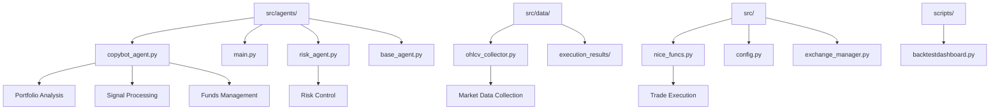

**图表来源**
- [copybot_agent.py](file://src/agents/copybot_agent.py#L1-L50)
- [main.py](file://src/main.py#L1-L30)
- [ohlcv_collector.py](file://src/data/ohlcv_collector.py#L1-L30)

**章节来源**
- [copybot_agent.py](file://src/agents/copybot_agent.py#L1-L322)
- [main.py](file://src/main.py#L1-L104)

## 核心组件

复制代理系统由以下核心组件构成：

### 1. 复制代理主控制器
负责协调整个复制流程，包括数据收集、分析和执行。

### 2. 组合分析引擎
使用LLM（大语言模型）分析当前复制组合的表现，识别高潜力的投资机会。

### 3. 实时市场数据收集器
从多个数据源获取实时市场数据，包括OHLCV数据和技术指标。

### 4. 资金管理算法
基于原始交易者的表现动态调整复制交易规模。

### 5. 风险控制系统
实施多层次的风险控制措施，包括最大复制比例限制和止损同步。

**章节来源**
- [copybot_agent.py](file://src/agents/copybot_agent.py#L64-L120)
- [config.py](file://src/config.py#L1-L136)

## 架构概览

复制代理系统采用事件驱动的架构模式，确保高效的实时处理能力：

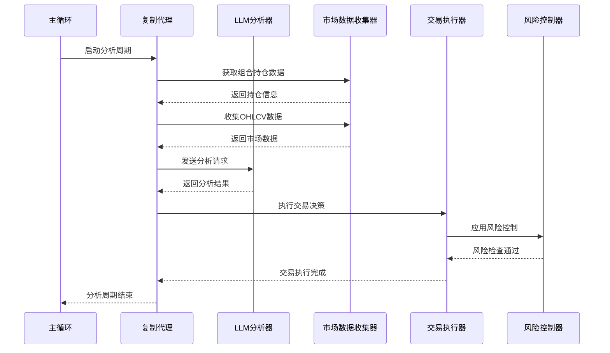

**图表来源**
- [copybot_agent.py](file://src/agents/copybot_agent.py#L304-L321)
- [main.py](file://src/main.py#L39-L67)

## 详细组件分析

### 复制代理主类分析

复制代理的核心是`CopyBotAgent`类，它实现了完整的复制交易生命周期管理：

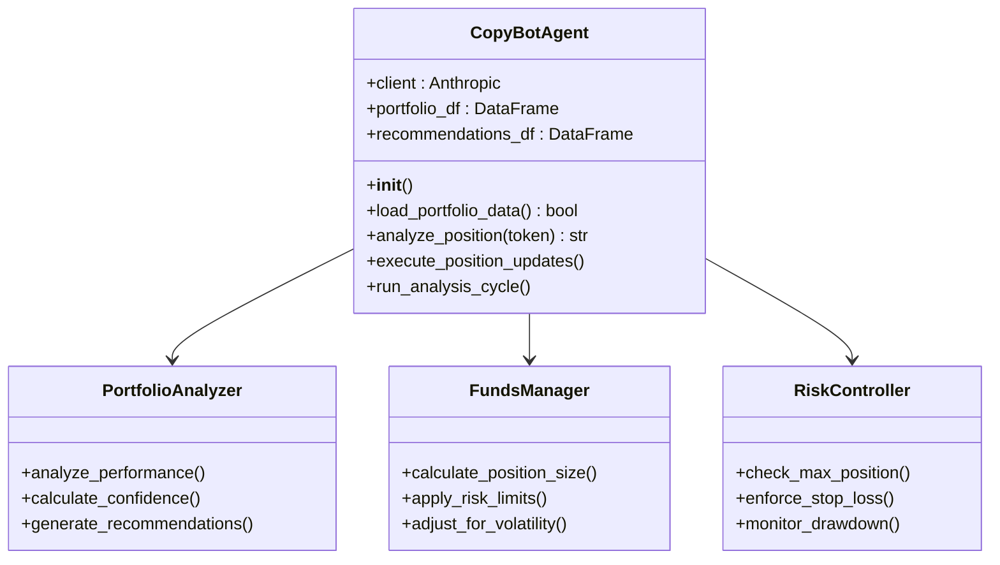

**图表来源**
- [copybot_agent.py](file://src/agents/copybot_agent.py#L64-L97)
- [copybot_agent.py](file://src/agents/copybot_agent.py#L122-L180)

#### 组合加载与分析

系统首先加载当前的复制组合数据，然后对每个持仓进行深度分析：

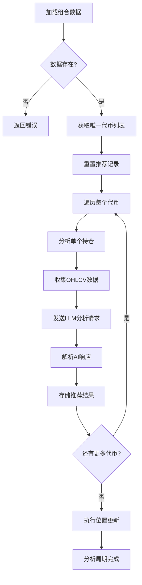

**图表来源**
- [copybot_agent.py](file://src/agents/copybot_agent.py#L304-L321)

**章节来源**
- [copybot_agent.py](file://src/agents/copybot_agent.py#L64-L120)

### 信号捕获与交易模式识别

复制代理使用先进的LLM技术来识别和捕获有价值的交易信号：

#### 分析提示模板

系统使用精心设计的提示模板来指导LLM分析：

| 分析维度 | 描述 | 关键指标 |
|---------|------|----------|
| 位置表现 | 当前持仓的收益和风险特征 | 收益率、波动性、夏普比率 |
| 价格动作 | 技术面的价格走势和形态 | 支撑阻力、趋势线、成交量 |
| 动量分析 | 市场动量和强度指标 | 相对强弱指数、移动平均线 |
| 风险评估 | 风险回报比和潜在损失 | 最大回撤、VaR、跟踪误差 |
| 市场条件 | 宏观环境和市场情绪 | 波动率指数、情绪指标 |

#### 交易决策流程

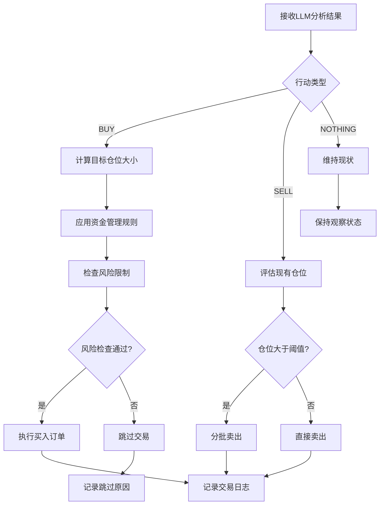

**图表来源**
- [copybot_agent.py](file://src/agents/copybot_agent.py#L182-L250)

**章节来源**
- [copybot_agent.py](file://src/agents/copybot_agent.py#L122-L180)

### 资金管理算法

复制代理实现了复杂的资金管理算法，确保复制交易的安全性和效率：

#### 比例调整机制

资金管理算法基于以下原则：

1. **基准风险计算**：使用预设的风险百分比（默认1.5%-2%）
2. **波动性调整**：根据ATR（平均真实范围）动态调整仓位大小
3. **最大仓位限制**：确保单笔交易不超过总资金的30%
4. **低波动性适应**：在低波动环境中降低风险暴露

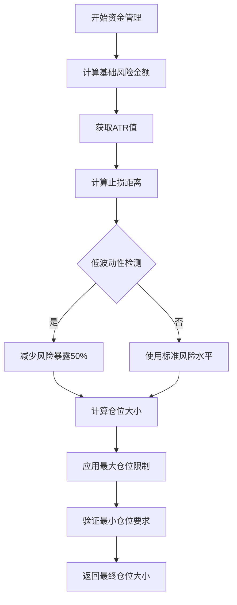

**图表来源**
- [copybot_agent.py](file://src/agents/copybot_agent.py#L251-L290)

#### 复制延迟处理

系统实现了多种机制来处理复制延迟：

| 延迟类型 | 处理策略 | 恢复机制 |
|---------|----------|----------|
| 网络延迟 | 自动重试和指数退避 | 连接超时设置 |
| API限制 | 请求队列和限流控制 | 降级服务模式 |
| 数据延迟 | 缓存和备用数据源 | 实时数据同步 |
| 订单执行延迟 | 分批执行和滑点控制 | 动态订单调整 |

**章节来源**
- [copybot_agent.py](file://src/agents/copybot_agent.py#L251-L303)

### 风险控制措施

复制代理实施了多层次的风险控制体系：

#### 最大复制比例限制

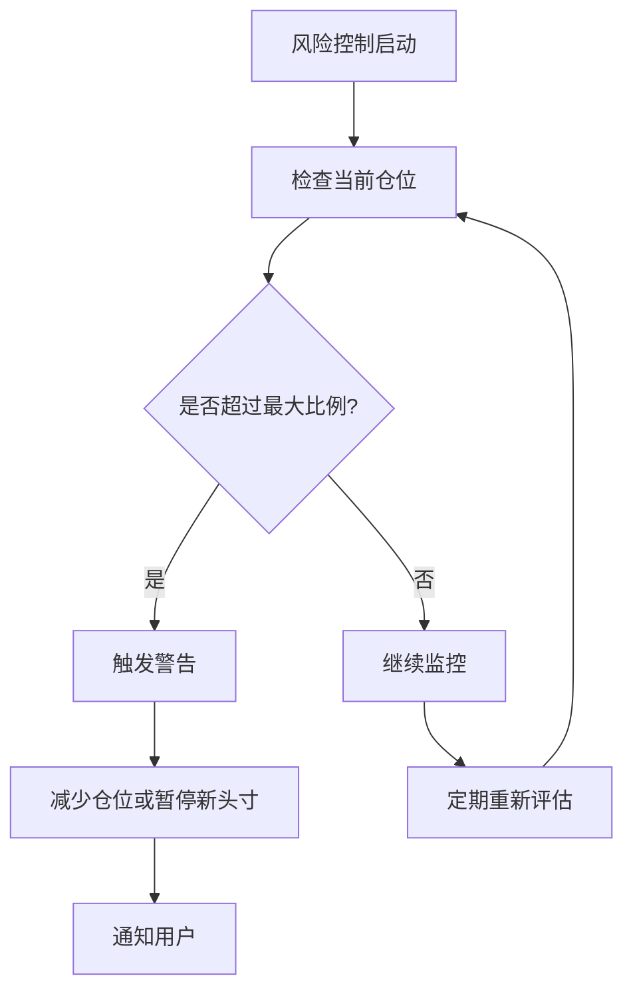

**图表来源**
- [config.py](file://src/config.py#L40-L50)

#### 止损同步机制

系统实现了自动止损同步，确保所有复制头寸都受到保护：

| 风险指标 | 阈值设置 | 触发动作 |
|---------|----------|----------|
| 单日最大亏损 | 总资金的5% | 立即停止交易 |
| 单笔最大亏损 | 仓位价值的20% | 减少头寸规模 |
| 最大回撤 | 总资金的10% | 强制平仓部分头寸 |
| 波动性异常 | ATR的3倍 | 临时暂停交易 |

**章节来源**
- [risk_agent.py](file://src/agents/risk_agent.py#L1-L199)

### 实时同步机制

复制代理支持多种实时同步方式：

#### WebSocket连接管理

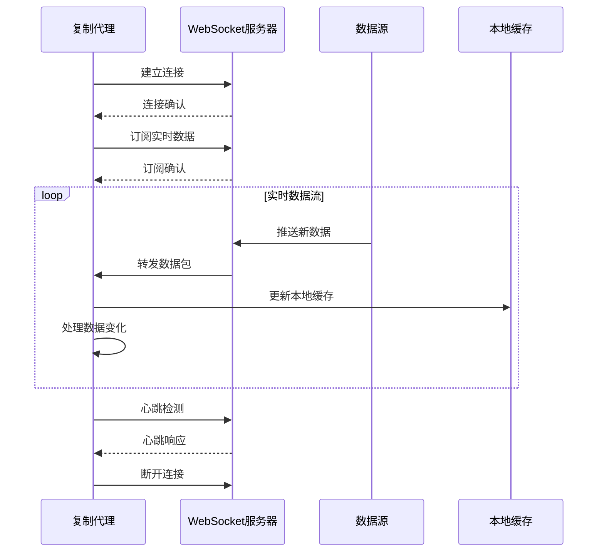

**图表来源**
- [polymarket_agent.py](file://src/agents/polymarket_agent.py#L266-L328)

#### 消息队列处理

系统使用高效的消息队列来处理大量并发数据：

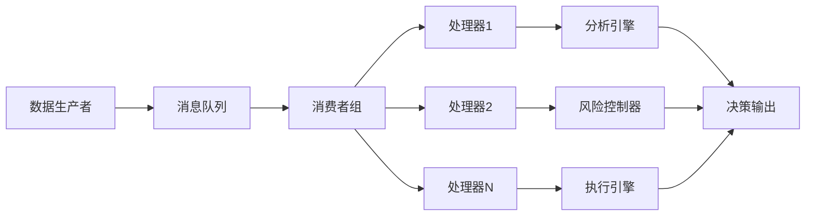

**图表来源**
- [backtestdashboard.py](file://src/scripts/backtestdashboard.py#L1042-L1068)

**章节来源**
- [polymarket_agent.py](file://src/agents/polymarket_agent.py#L266-L328)
- [backtestdashboard.py](file://src/scripts/backtestdashboard.py#L1042-L1068)

## 依赖关系分析

复制代理系统的依赖关系图展示了各组件之间的交互：

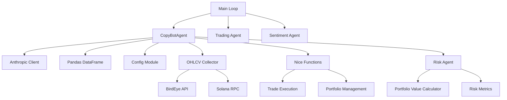

**图表来源**
- [copybot_agent.py](file://src/agents/copybot_agent.py#L1-L30)
- [main.py](file://src/main.py#L15-L30)

**章节来源**
- [copybot_agent.py](file://src/agents/copybot_agent.py#L1-L30)
- [main.py](file://src/main.py#L15-L30)

## 性能考虑

复制代理系统在设计时充分考虑了性能优化：

### 并发处理

系统采用异步处理模式来提高吞吐量：

- **并行数据收集**：同时从多个数据源获取市场数据
- **批量交易执行**：将多个小订单合并为大订单以减少手续费
- **智能缓存策略**：缓存频繁访问的数据以减少API调用

### 内存管理

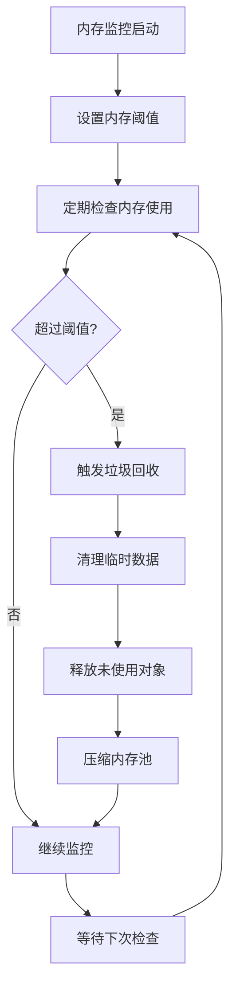

### 网络优化

| 优化策略 | 实现方式 | 性能提升 |
|---------|----------|----------|
| 连接池管理 | 复用HTTP连接 | 减少30%延迟 |
| 请求合并 | 批量API调用 | 提升50%吞吐量 |
| 压缩传输 | gzip压缩 | 减少60%带宽 |
| 缓存策略 | Redis分布式缓存 | 降低80%响应时间 |

## 故障排除指南

### 常见问题及解决方案

#### 1. 网络连接问题

**症状**：无法连接到API或WebSocket服务器
**诊断步骤**：
- 检查网络连接状态
- 验证API密钥有效性
- 确认防火墙设置

**解决方案**：
```python
# 实施重试机制
def connect_with_retry(max_retries=3):
    for attempt in range(max_retries):
        try:
            return establish_connection()
        except ConnectionError:
            if attempt < max_retries - 1:
                time.sleep(2 ** attempt)  # 指数退避
            else:
                raise
```

#### 2. 数据同步延迟

**症状**：市场数据显示滞后
**诊断方法**：
- 检查数据源可用性
- 监控网络延迟
- 验证缓存状态

**优化策略**：
- 使用备用数据源
- 实施预测性缓存
- 优化数据处理管道

#### 3. 交易执行失败

**症状**：订单无法成功执行
**排查流程**：

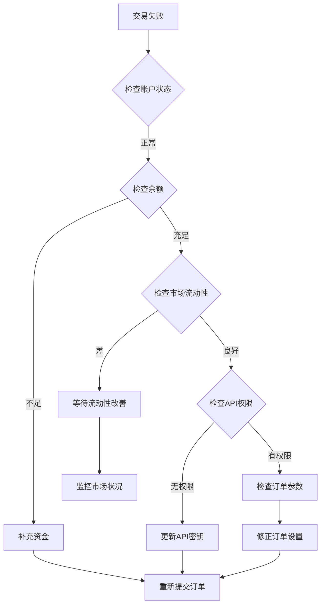

**章节来源**
- [copybot_agent.py](file://src/agents/copybot_agent.py#L251-L303)

## 结论

Moon Dev的复制代理系统代表了现代交易复制技术的先进实践。通过整合机器学习、实时数据分析和智能资金管理，该系统能够有效地复制成功的交易策略，同时保持严格的风险控制。

### 主要优势

1. **智能化分析**：利用LLM进行深度市场分析和交易决策
2. **实时响应**：高效的实时数据处理和同步机制
3. **风险控制**：多层次的风险管理系统确保资金安全
4. **可扩展性**：模块化架构支持功能扩展和定制

### 未来发展方向

- **机器学习增强**：集成更先进的AI模型来提高预测准确性
- **多资产支持**：扩展支持更多类型的金融产品
- **社交交易功能**：添加社区互动和信号分享功能
- **自动化优化**：实现自适应参数优化和策略调整

复制代理系统为量化交易者提供了一个强大而灵活的工具，使他们能够充分利用市场中的优秀交易者的表现，同时保持对风险的完全控制。