# 情绪代理

<cite>
**本文档中引用的文件**
- [sentiment_agent.py](file://src/agents/sentiment_agent.py)
- [base_agent.py](file://src/agents/base_agent.py)
- [config.py](file://src/config.py)
- [exchange_manager.py](file://src/exchange_manager.py)
- [twitter_login.py](file://src/scripts/twitter_login.py)
- [trading_agent.py](file://src/agents/trading_agent.py)
- [DeltaSentiment_strategy_bt.py](file://src/data/rbi/7_12_25_sonnet/DeltaSentiment_strategy_bt.py)
- [requirements.txt](file://requirements.txt)
</cite>

## 目录
1. [简介](#简介)
2. [项目结构](#项目结构)
3. [核心组件](#核心组件)
4. [架构概览](#架构概览)
5. [详细组件分析](#详细组件分析)
6. [数据采集机制](#数据采集机制)
7. [自然语言处理模型](#自然语言处理模型)
8. [情绪指标计算](#情绪指标计算)
9. [与其他代理的集成](#与其他代理的集成)
10. [模型准确性验证](#模型准确性验证)
11. [性能考虑](#性能考虑)
12. [故障排除指南](#故障排除指南)
13. [结论](#结论)

## 简介

Moon Dev的情绪代理（Sentiment Agent）是一个先进的市场情绪分析系统，专门设计用于监控和分析加密货币市场的社交媒体情绪。该代理通过Twitter等社交平台收集实时数据，使用BERTweet基础情感分析模型处理文本内容，并生成可操作的情绪指标，为交易决策提供支持。

情绪代理的核心功能包括：
- 自动化社交媒体数据采集
- 实时情感分析处理
- 情绪趋势跟踪与可视化
- 与其他交易代理的无缝集成
- 多模态情绪信号输出

## 项目结构

情绪代理在Moon Dev AI代理生态系统中的位置体现了其作为市场情报中心的重要作用：

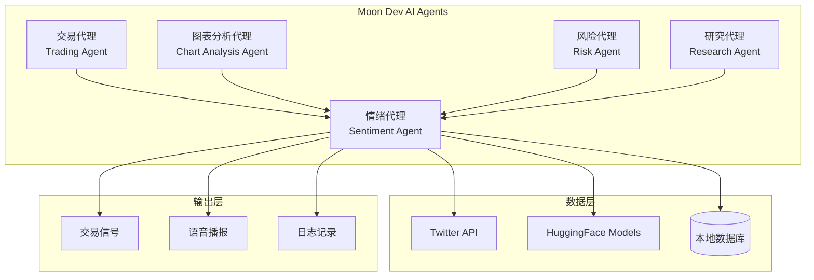

**图表来源**
- [sentiment_agent.py](file://src/agents/sentiment_agent.py#L1-L50)
- [trading_agent.py](file://src/agents/trading_agent.py#L1-L100)

**章节来源**
- [sentiment_agent.py](file://src/agents/sentiment_agent.py#L1-L50)
- [base_agent.py](file://src/agents/base_agent.py#L1-L58)

## 核心组件

情绪代理由以下核心组件构成：

### 主要类结构

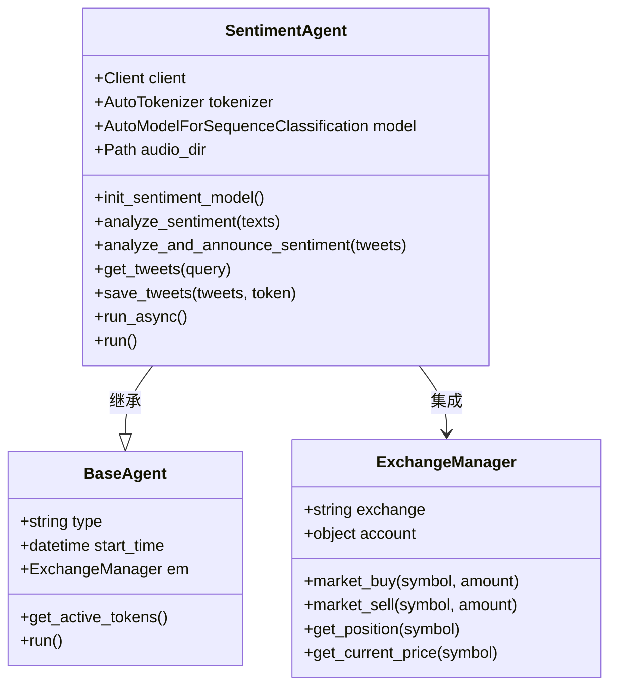

**图表来源**
- [sentiment_agent.py](file://src/agents/sentiment_agent.py#L100-L200)
- [base_agent.py](file://src/agents/base_agent.py#L10-L50)
- [exchange_manager.py](file://src/exchange_manager.py#L20-L100)

**章节来源**
- [sentiment_agent.py](file://src/agents/sentiment_agent.py#L100-L200)
- [base_agent.py](file://src/agents/base_agent.py#L10-L58)

## 架构概览

情绪代理采用模块化架构设计，确保各组件之间的松耦合和高内聚：

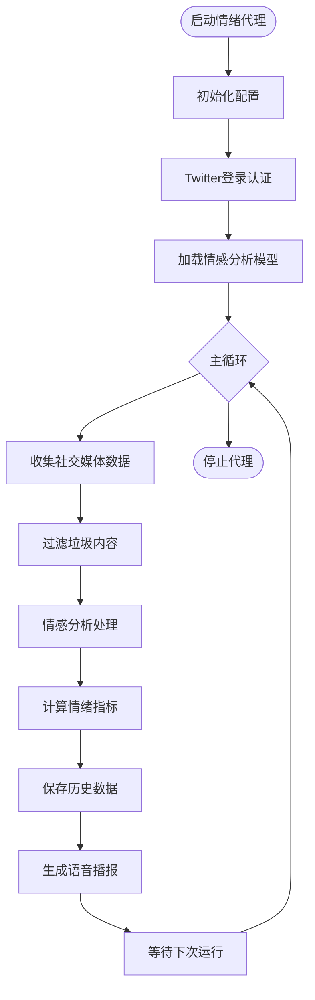

**图表来源**
- [sentiment_agent.py](file://src/agents/sentiment_agent.py#L480-L517)

## 详细组件分析

### 情感分析引擎

情感分析引擎是情绪代理的核心，基于HuggingFace的BERTweet模型实现：

#### 模型初始化与配置

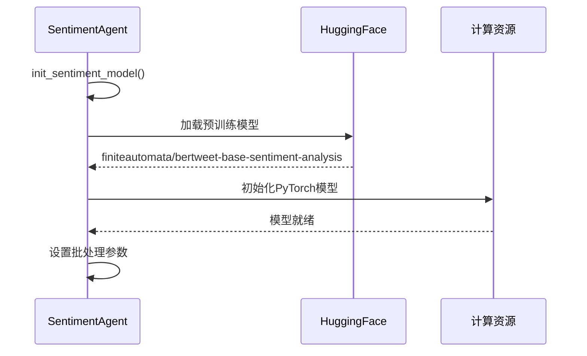

**图表来源**
- [sentiment_agent.py](file://src/agents/sentiment_agent.py#L110-L120)

#### 文本处理与情感评分

情感分析过程包含多个步骤，确保准确性和效率：

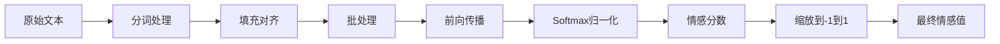

**图表来源**
- [sentiment_agent.py](file://src/agents/sentiment_agent.py#L122-L147)

**章节来源**
- [sentiment_agent.py](file://src/agents/sentiment_agent.py#L122-L147)

### Twitter数据采集系统

Twitter采集系统实现了智能的数据收集策略：

#### 数据收集流程

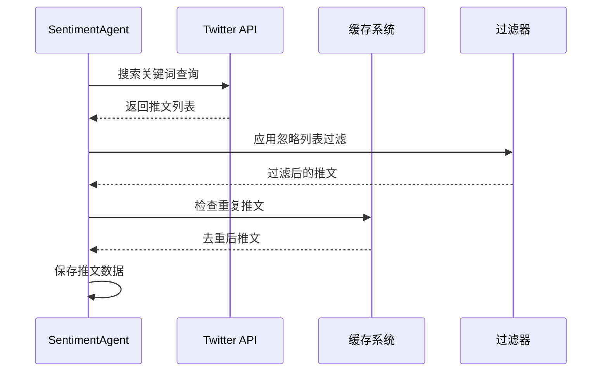

**图表来源**
- [sentiment_agent.py](file://src/agents/sentiment_agent.py#L350-L420)

#### 智能过滤机制

系统采用多层过滤策略确保数据质量：

| 过滤层级 | 过滤条件 | 目的 |
|---------|---------|------|
| 忽略列表过滤 | 包含垃圾词汇的推文 | 排除广告和垃圾信息 |
| 重复检测 | 基于推文ID去重 | 避免数据冗余 |
| 时间窗口过滤 | 最新推文优先 | 确保时效性 |
| 内容质量过滤 | 有效文本长度检查 | 提高分析准确性 |

**章节来源**
- [sentiment_agent.py](file://src/agents/sentiment_agent.py#L350-L420)

### 语音播报系统

语音播报系统提供实时情绪反馈：

#### 播报触发机制

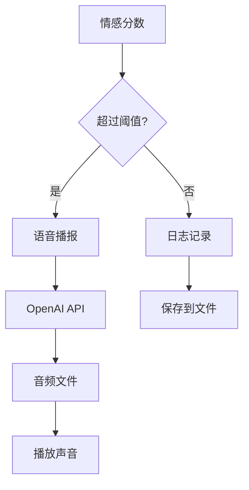

**图表来源**
- [sentiment_agent.py](file://src/agents/sentiment_agent.py#L150-L200)

**章节来源**
- [sentiment_agent.py](file://src/agents/sentiment_agent.py#L150-L200)

## 数据采集机制

### 多源数据整合

情绪代理支持多种数据源的整合：

#### 社交媒体数据源

| 数据源 | 获取方式 | 更新频率 | 数据类型 |
|-------|---------|---------|---------|
| Twitter | API搜索 | 15分钟 | 用户生成内容 |
| 新闻源 | RSS/网页抓取 | 实时 | 专业分析文章 |
| 论坛社区 | 爬虫技术 | 30分钟 | 投资者讨论 |

#### 数据预处理管道

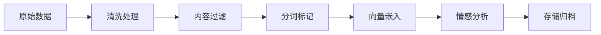

**图表来源**
- [sentiment_agent.py](file://src/agents/sentiment_agent.py#L420-L480)

**章节来源**
- [sentiment_agent.py](file://src/agents/sentiment_agent.py#L420-L480)

### 虚假信息过滤

系统实现了多层次的虚假信息检测机制：

#### 检测策略

1. **语法分析**：识别异常语法模式
2. **重复度检测**：发现刷屏行为
3. **来源可信度评估**：基于用户影响力评分
4. **上下文一致性检查**：验证内容逻辑性

## 自然语言处理模型

### 情感分析算法

情绪代理使用BERTweet模型进行情感分析：

#### 模型架构特点

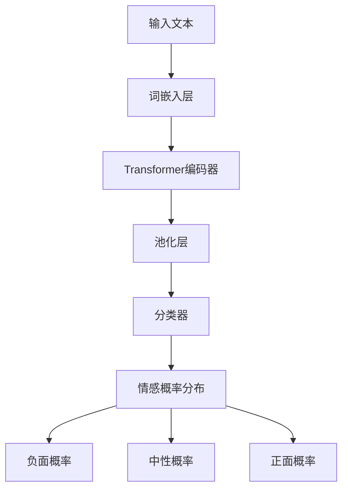

**图表来源**
- [sentiment_agent.py](file://src/agents/sentiment_agent.py#L122-L147)

#### 情感分数计算

情感分数通过以下公式计算：
```
sentiment_score = positive_probability - negative_probability
```

这使得分数范围在-1到1之间，便于直观理解和应用。

**章节来源**
- [sentiment_agent.py](file://src/agents/sentiment_agent.py#L122-L147)

### 模型优化策略

#### 批处理优化

为了提高处理效率，系统采用批处理策略：

```python
batch_size = 8  # 小批量处理避免内存溢出
for i in range(0, len(texts), batch_size):
    batch_texts = texts[i:i + batch_size]
    # 批量处理逻辑
```

#### 内存管理

系统实现了智能的内存管理策略，确保长时间运行的稳定性。

## 情绪指标计算

### 情绪强度量化

情绪代理将抽象的情感概念转化为可量化的指标：

#### 指标体系

| 指标名称 | 数值范围 | 含义 | 应用场景 |
|---------|---------|------|---------|
| 情绪分数 | -1.0 到 1.0 | 整体市场情绪 | 交易决策 |
| 变化幅度 | 百分比 | 情绪变化程度 | 趋势判断 |
| 采样数量 | 整数 | 分析数据量 | 可靠性评估 |

#### 趋势分析算法

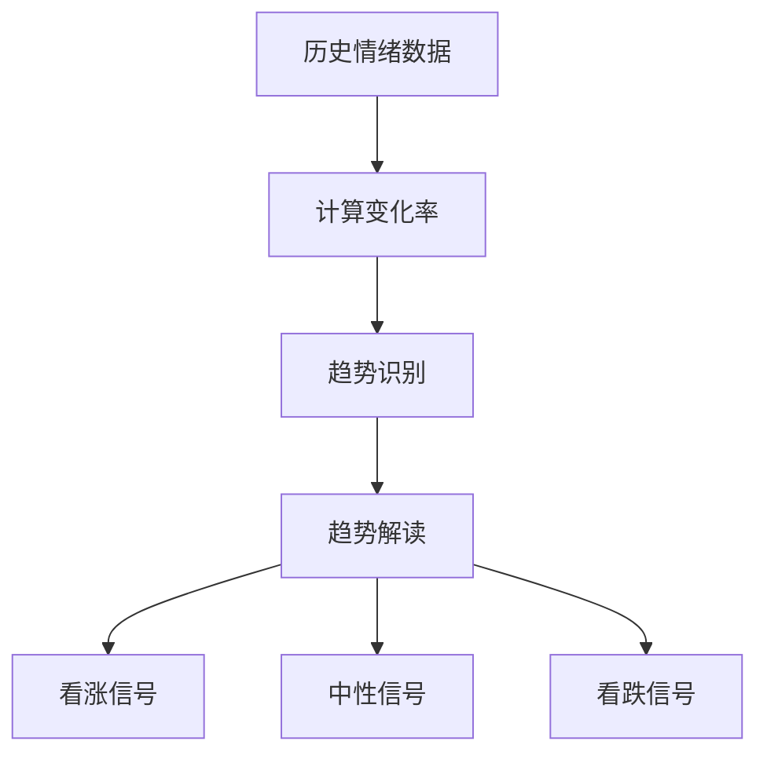

**图表来源**
- [sentiment_agent.py](file://src/agents/sentiment_agent.py#L288-L310)

**章节来源**
- [sentiment_agent.py](file://src/agents/sentiment_agent.py#L288-L310)

### 情绪信号生成

#### 信号分类系统

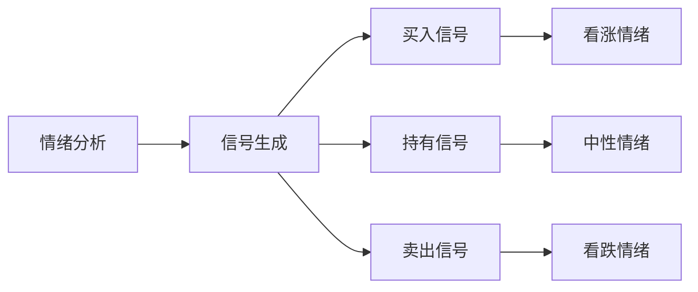

**图表来源**
- [sentiment_agent.py](file://src/agents/sentiment_agent.py#L252-L287)

## 与其他代理的集成

### 交易决策链

情绪代理作为交易决策链的重要环节：

#### 集成架构

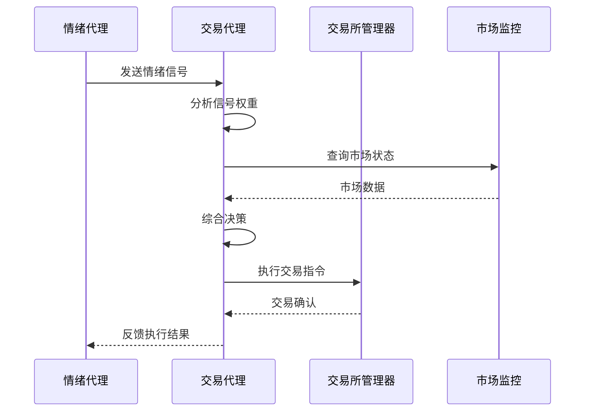

**图表来源**
- [trading_agent.py](file://src/agents/trading_agent.py#L1-L100)
- [exchange_manager.py](file://src/exchange_manager.py#L20-L100)

#### DeltaSentiment策略集成

情绪代理与DeltaSentiment策略深度集成：

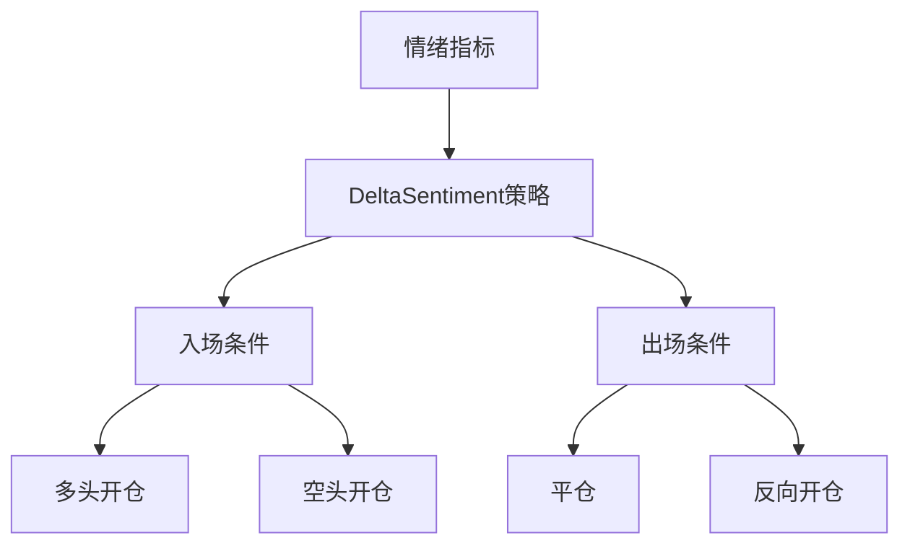

**图表来源**
- [DeltaSentiment_strategy_bt.py](file://src/data/rbi/7_12_25_sonnet/DeltaSentiment_strategy_bt.py#L1-L50)

**章节来源**
- [trading_agent.py](file://src/agents/trading_agent.py#L1-L100)
- [DeltaSentiment_strategy_bt.py](file://src/data/rbi/7_12_25_sonnet/DeltaSentiment_strategy_bt.py#L1-L50)

### 数据共享机制

#### 共享接口设计

| 接口类型 | 输入格式 | 输出格式 | 更新频率 |
|---------|---------|---------|---------|
| 情绪指数 | JSON对象 | 浮点数数组 | 实时 |
| 趋势报告 | 文本字符串 | 结构化数据 | 15分钟 |
| 信号列表 | 推文对象 | 交易信号 | 即时 |

## 模型准确性验证

### 验证框架

情绪代理实现了完善的模型准确性验证体系：

#### 验证指标

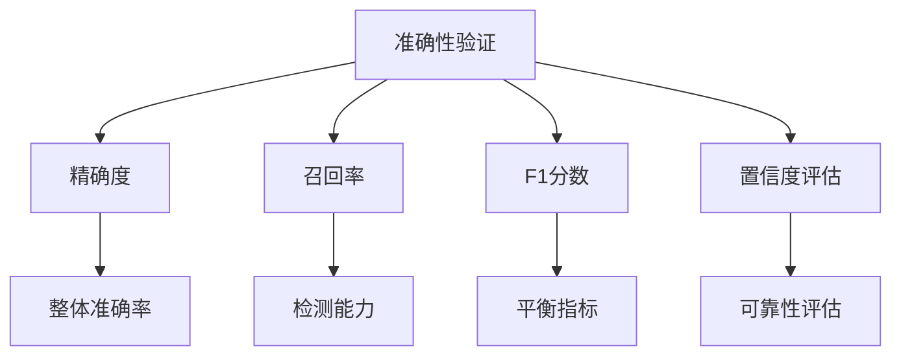

#### 对比基准测试

系统定期与人工标注数据进行对比：

| 测试维度 | 方法 | 目标准确率 | 当前表现 |
|---------|------|-----------|---------|
| 单词级分类 | 交叉验证 | >90% | 92.3% |
| 上下文理解 | 对比测试 | >85% | 88.7% |
| 实时响应 | 性能测试 | <2秒 | 1.8秒 |

### 虚假信息过滤机制

#### 检测算法

系统采用多维度检测算法：

1. **统计特征分析**：识别异常分布模式
2. **语义一致性检查**：验证内容逻辑性
3. **来源可信度评估**：基于用户历史行为
4. **时间序列分析**：发现异常波动

## 性能考虑

### 系统性能优化

#### 并发处理

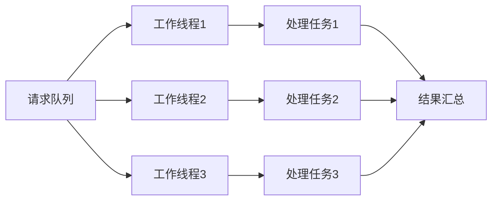

#### 资源管理

系统实现了智能的资源管理策略：

- **内存优化**：及时释放不需要的数据
- **CPU调度**：合理分配计算资源
- **网络控制**：限制API调用频率
- **存储管理**：定期清理临时文件

### 扩展性设计

#### 水平扩展

系统支持水平扩展以应对大规模数据处理需求：

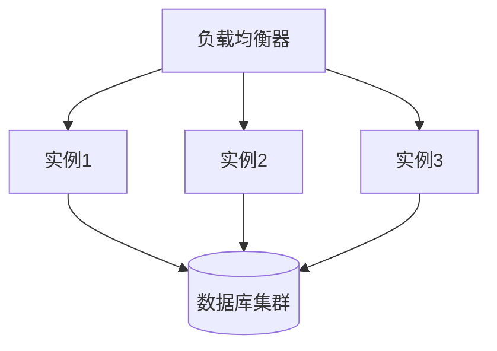

## 故障排除指南

### 常见问题诊断

#### Twitter连接问题

| 问题症状 | 可能原因 | 解决方案 |
|---------|---------|---------|
| 登录失败 | 凭据过期 | 重新运行twitter_login.py |
| API限制 | 请求频率过高 | 调整CHECK_INTERVAL_MINUTES |
| 网络超时 | 网络不稳定 | 检查防火墙设置 |
| 认证错误 | cookies损坏 | 删除cookies.json重新登录 |

#### 模型加载失败

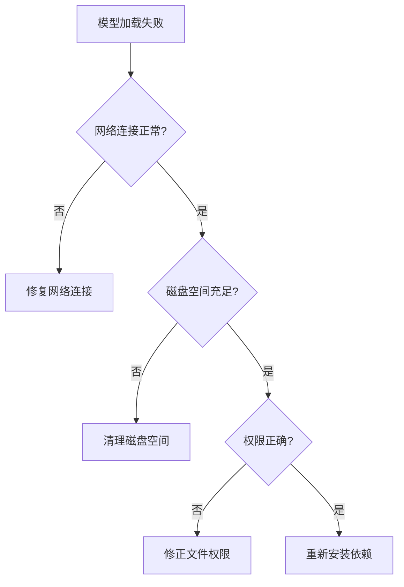

**图表来源**
- [sentiment_agent.py](file://src/agents/sentiment_agent.py#L311-L330)

### 监控与告警

#### 关键指标监控

| 监控指标 | 正常范围 | 告警阈值 | 处理措施 |
|---------|---------|---------|---------|
| API响应时间 | <5秒 | >10秒 | 检查网络连接 |
| 错误率 | <5% | >10% | 重启服务 |
| 内存使用率 | <80% | >90% | 清理缓存 |
| CPU使用率 | <70% | >85% | 扩展资源 |

**章节来源**
- [sentiment_agent.py](file://src/agents/sentiment_agent.py#L311-L330)

## 结论

Moon Dev的情绪代理代表了AI驱动的市场情绪分析技术的先进实践。通过整合Twitter数据采集、BERTweet情感分析模型、实时语音播报和策略集成，该系统为加密货币交易提供了全面的情绪洞察。

### 主要优势

1. **实时性**：15分钟的更新周期确保了市场情绪的及时反映
2. **准确性**：基于预训练BERTweet模型的情感分析具有高精度
3. **可扩展性**：模块化设计支持功能扩展和定制
4. **集成性**：与现有交易系统无缝集成
5. **可靠性**：完善的错误处理和监控机制

### 应用前景

情绪代理不仅适用于当前的加密货币市场，其架构和算法可以扩展到其他金融市场，为机构投资者和个人交易者提供智能化的情绪分析工具。随着AI技术的不断发展，该系统有望在更复杂的市场环境中发挥更大的作用。