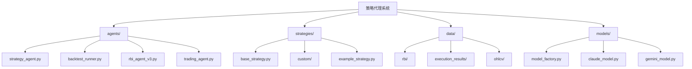
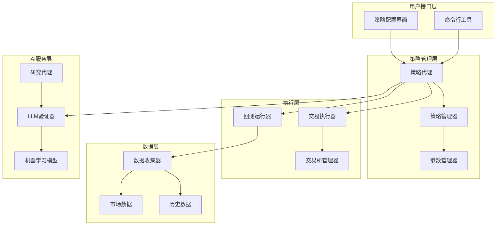
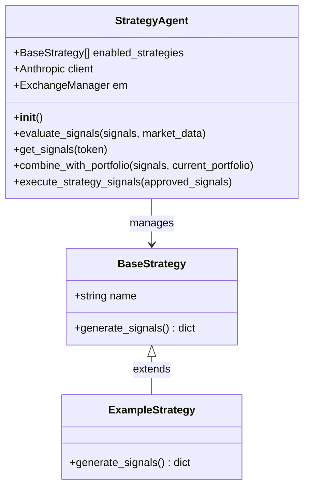
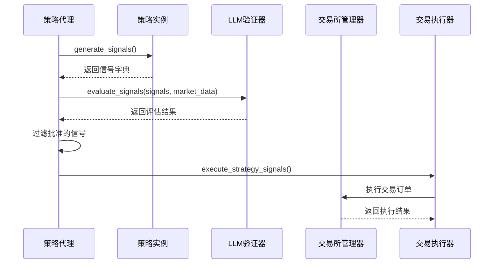
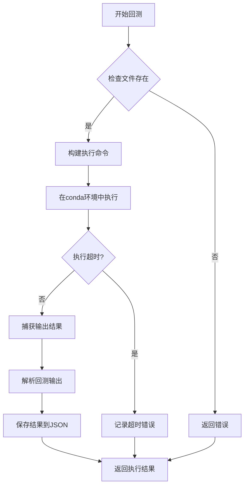
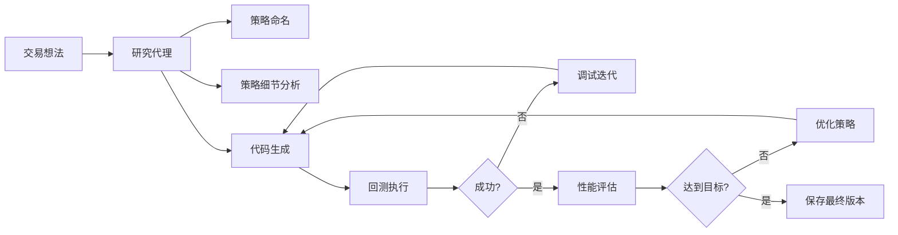
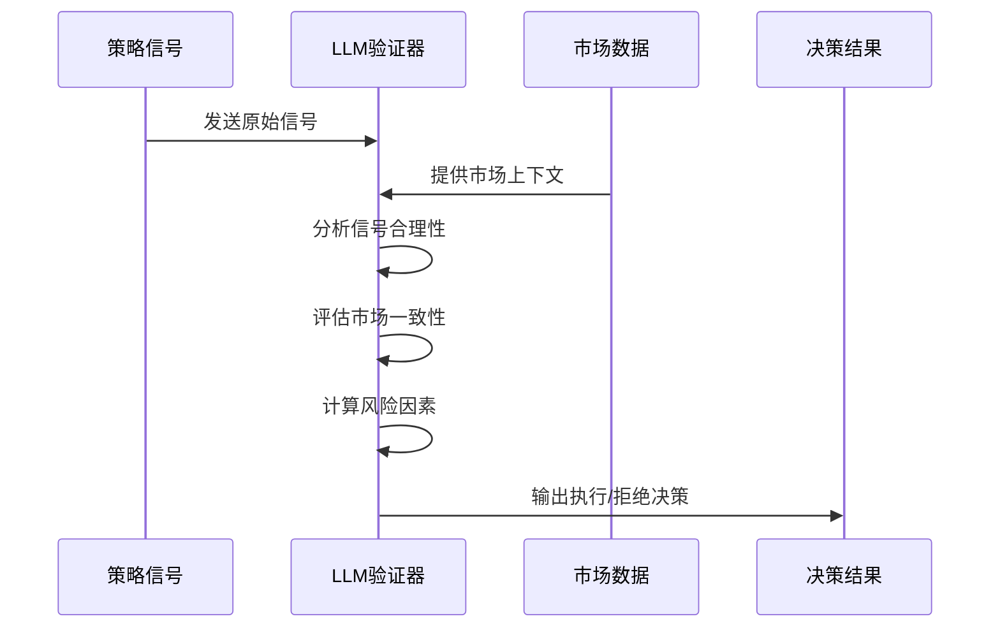
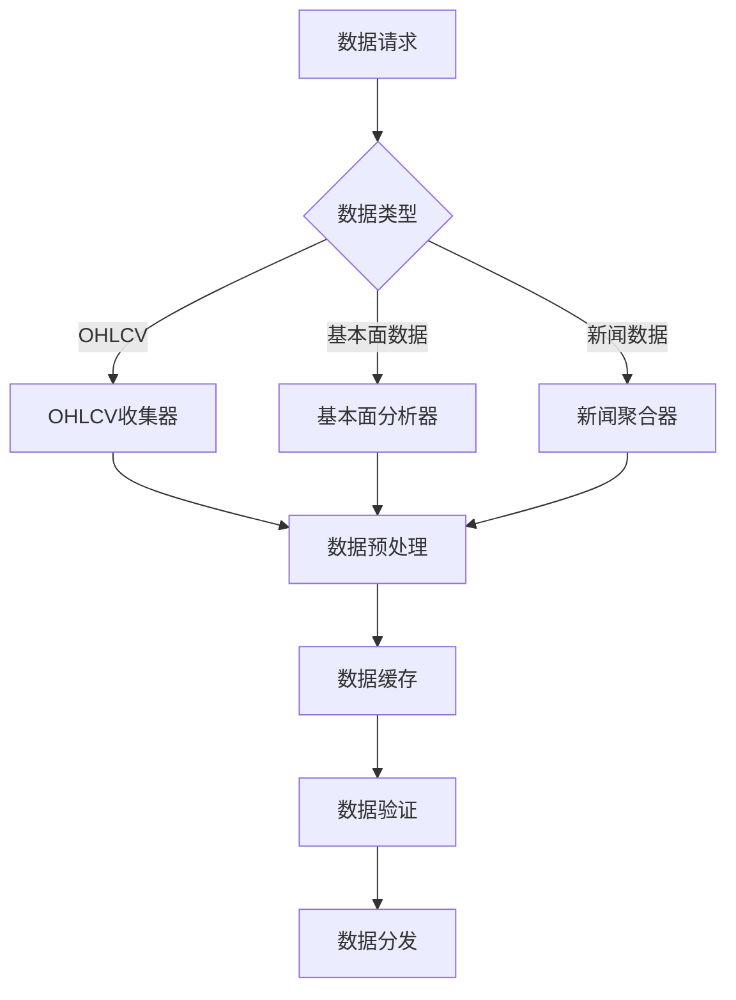
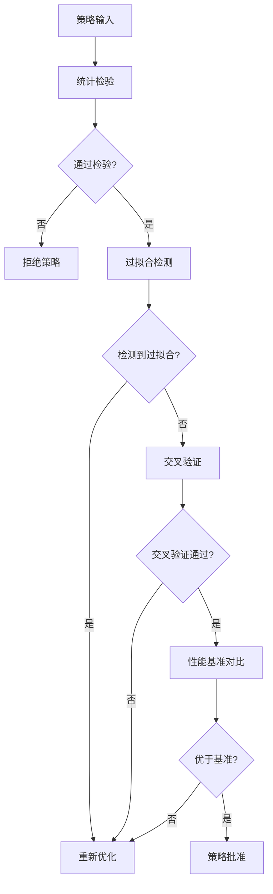
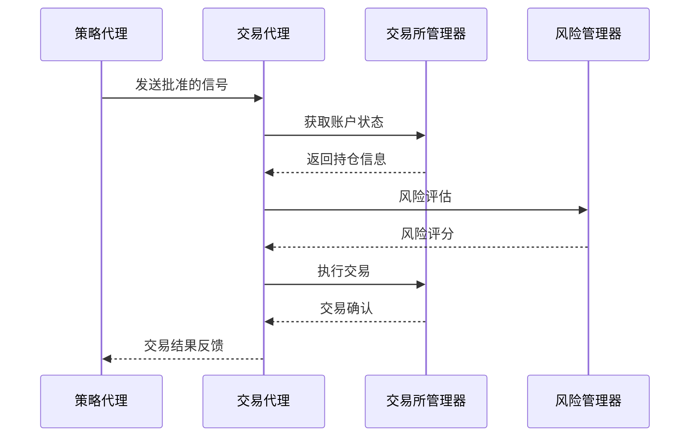

# 策略代理

<cite>
**本文档中引用的文件**
- [strategy_agent.py](file://src/agents/strategy_agent.py)
- [backtest_runner.py](file://src/agents/backtest_runner.py)
- [base_strategy.py](file://src/strategies/base_strategy.py)
- [config.py](file://src/config.py)
- [rbi_agent_v3.py](file://src/agents/rbi_agent_v3.py)
- [exchange_manager.py](file://src/exchange_manager.py)
- [trading_agent.py](file://src/agents/trading_agent.py)
- [example_strategy.py](file://src/strategies/custom/example_strategy.py)
</cite>

## 目录
1. [简介](#简介)
2. [项目结构](#项目结构)
3. [核心组件](#核心组件)
4. [架构概览](#架构概览)
5. [详细组件分析](#详细组件分析)
6. [策略发现与回测](#策略发现与回测)
7. [机器学习模型应用](#机器学习模型应用)
8. [数据系统集成](#数据系统集成)
9. [策略有效性验证](#策略有效性验证)
10. [与其他代理协作](#与其他代理协作)
11. [性能考虑](#性能考虑)
12. [故障排除指南](#故障排除指南)
13. [结论](#结论)

## 简介

Moon Dev的策略代理是一个高度智能化的交易策略管理系统，负责生成、优化和执行基于AI驱动的交易策略。该系统采用多层次架构，集成了机器学习模型、回测引擎和实时交易执行功能，为用户提供完整的策略生命周期管理解决方案。

策略代理的核心功能包括：
- 自动化策略发现和生成
- 智能回测和性能评估
- 基于LLM的策略验证
- 多策略组合管理
- 实时交易执行
- 过拟合预防和验证机制

## 项目结构

策略代理系统采用模块化设计，主要包含以下核心目录结构：

**图表来源**
- [strategy_agent.py](file://src/agents/strategy_agent.py#L1-L306)
- [base_strategy.py](file://src/strategies/base_strategy.py#L1-L21)
- [backtest_runner.py](file://src/agents/backtest_runner.py#L1-L214)

**章节来源**
- [strategy_agent.py](file://src/agents/strategy_agent.py#L1-L50)
- [base_strategy.py](file://src/strategies/base_strategy.py#L1-L21)

## 核心组件

策略代理系统由以下核心组件构成：

### 1. 策略生成器 (Strategy Generator)
负责创建和管理各种交易策略实例，支持自定义策略开发。

### 2. 回测运行器 (Backtest Runner)
提供策略回测执行环境，支持多种时间框架和市场条件测试。

### 3. LLM验证器 (LLM Validator)
使用大型语言模型对策略信号进行智能评估和决策。

### 4. 交易执行器 (Trading Executor)
负责将策略信号转换为实际的交易订单。

### 5. 数据收集器 (Data Collector)
从多个数据源获取市场数据，支持实时和历史数据分析。

**章节来源**
- [strategy_agent.py](file://src/agents/strategy_agent.py#L40-L80)
- [backtest_runner.py](file://src/agents/backtest_runner.py#L15-L50)

## 架构概览

策略代理系统采用分层架构设计，确保各组件之间的松耦合和高内聚：

**图表来源**
- [strategy_agent.py](file://src/agents/strategy_agent.py#L40-L100)
- [backtest_runner.py](file://src/agents/backtest_runner.py#L20-L80)
- [exchange_manager.py](file://src/exchange_manager.py#L20-L60)

## 详细组件分析

### 策略代理核心类

策略代理的核心是`StrategyAgent`类，它实现了完整的策略生命周期管理：

**图表来源**
- [strategy_agent.py](file://src/agents/strategy_agent.py#L40-L306)
- [base_strategy.py](file://src/strategies/base_strategy.py#L5-L21)
- [example_strategy.py](file://src/strategies/custom/example_strategy.py#L1-L19)

#### 策略信号生成流程

策略代理通过以下流程生成和处理交易信号：

**图表来源**
- [strategy_agent.py](file://src/agents/strategy_agent.py#L120-L200)
- [strategy_agent.py](file://src/agents/strategy_agent.py#L250-L306)

**章节来源**
- [strategy_agent.py](file://src/agents/strategy_agent.py#L40-L150)
- [base_strategy.py](file://src/strategies/base_strategy.py#L5-L21)

### 回测运行器

回测运行器提供了强大的策略测试能力，支持多种执行环境：

**图表来源**
- [backtest_runner.py](file://src/agents/backtest_runner.py#L20-L120)

**章节来源**
- [backtest_runner.py](file://src/agents/backtest_runner.py#L15-L100)

## 策略发现与回测

### 自动化策略发现

策略代理支持自动化策略发现和生成，通过研究代理(RBI Agent)实现：

**图表来源**
- [rbi_agent_v3.py](file://src/agents/rbi_agent_v3.py#L100-L200)

### 回测性能指标

系统使用多种关键指标来评估策略性能：

| 指标名称 | 描述 | 阈值要求 |
|---------|------|----------|
| 总交易数 | 策略执行的总交易次数 | > 100次 |
| 总回报率 | 策略的累计收益率 | > 目标收益率 |
| 夏普比率 | 风险调整后的收益指标 | > 2.0 |
| 最大回撤 | 最大资金回撤幅度 | < 限制值 |
| 胜率 | 盈利交易的比例 | > 目标值 |

**章节来源**
- [rbi_agent_v3.py](file://src/agents/rbi_agent_v3.py#L1-L100)

## 机器学习模型应用

### LLM验证机制

策略代理集成了先进的LLM验证机制，用于智能评估策略信号：

**图表来源**
- [strategy_agent.py](file://src/agents/strategy_agent.py#L30-L60)

### 机器学习优化

系统使用机器学习模型进行策略优化，包括：

1. **参数优化**: 自动调整策略参数以最大化收益
2. **特征选择**: 识别最重要的技术指标
3. **模型融合**: 结合多个模型的预测结果
4. **强化学习**: 基于历史表现的持续学习

**章节来源**
- [strategy_agent.py](file://src/agents/strategy_agent.py#L60-L120)

## 数据系统集成

### 市场数据获取

策略代理通过统一的数据接口获取市场数据：

**图表来源**
- [exchange_manager.py](file://src/exchange_manager.py#L80-L150)

### 历史回测数据处理

系统支持多种历史数据格式和处理方式：

| 数据类型 | 格式 | 时间范围 | 更新频率 |
|---------|------|----------|----------|
| OHLCV数据 | CSV/JSON | 1个月-1年 | 1分钟-1天 |
| 交易日志 | JSON | 全历史 | 实时 |
| 市场快照 | Parquet | 无限 | 持续 |
| 技术指标 | NumPy数组 | 可配置 | 按需计算 |

**章节来源**
- [exchange_manager.py](file://src/exchange_manager.py#L1-L100)

## 策略有效性验证

### 多重验证机制

策略代理实施严格的验证流程以确保策略的有效性：

### 过拟合预防措施

系统采用多种方法防止过拟合：

1. **时间分割验证**: 将数据分为训练集和测试集
2. **滚动窗口验证**: 使用移动窗口进行多次验证
3. **随机性注入**: 在回测中引入随机因素
4. **复杂度控制**: 限制策略参数数量和复杂度

**章节来源**
- [rbi_agent_v3.py](file://src/agents/rbi_agent_v3.py#L800-L900)

## 与其他代理协作

### 交易代理协作模式

策略代理与交易代理通过标准化接口进行协作：

**图表来源**
- [strategy_agent.py](file://src/agents/strategy_agent.py#L250-L306)
- [trading_agent.py](file://src/agents/trading_agent.py#L100-L200)

### 协作配置

| 组件 | 接口类型 | 通信协议 | 同步级别 |
|------|----------|----------|----------|
| 策略代理 | REST API | HTTP/HTTPS | 异步 |
| 交易代理 | WebSocket | JSON-RPC | 实时 |
| 风控代理 | gRPC | Protocol Buffers | 同步 |
| 数据代理 | MQTT | JSON消息 | 实时 |

**章节来源**
- [strategy_agent.py](file://src/agents/strategy_agent.py#L40-L80)
- [trading_agent.py](file://src/agents/trading_agent.py#L1-L100)

## 性能考虑

### 并发处理

策略代理支持多种并发处理模式：

1. **单线程模式**: 适用于简单策略和低频交易
2. **多线程模式**: 支持并行策略执行
3. **异步模式**: 基于事件驱动的高性能处理
4. **分布式模式**: 跨多个节点的策略执行

### 资源优化

系统采用多种优化策略：

- **内存管理**: 智能缓存和垃圾回收
- **CPU优化**: 算法优化和并行计算
- **网络优化**: 连接池和请求合并
- **存储优化**: 数据压缩和索引优化

## 故障排除指南

### 常见问题及解决方案

| 问题类型 | 症状 | 可能原因 | 解决方案 |
|---------|------|----------|----------|
| 策略加载失败 | 策略未找到错误 | 文件路径错误 | 检查策略文件位置 |
| 回测超时 | 执行时间过长 | 数据量过大 | 减少回测时间范围 |
| LLM验证失败 | 信号被拒绝 | 上下文不足 | 提供更多市场数据 |
| 交易执行错误 | 订单无法提交 | 账户余额不足 | 检查资金状况 |

### 调试工具

策略代理提供丰富的调试功能：

- **详细日志记录**: 记录所有操作步骤
- **性能监控**: 实时监控系统性能
- **错误追踪**: 自动捕获和报告错误
- **可视化仪表板**: 监控策略表现

**章节来源**
- [backtest_runner.py](file://src/agents/backtest_runner.py#L100-L150)
- [strategy_agent.py](file://src/agents/strategy_agent.py#L200-L250)

## 结论

Moon Dev的策略代理系统代表了AI驱动交易策略管理的先进水平。通过集成机器学习、自动化回测和智能验证机制，该系统能够高效地发现、优化和执行高质量的交易策略。

系统的主要优势包括：

1. **智能化程度高**: 利用LLM进行策略验证和优化
2. **自动化程度强**: 从策略发现到执行的全流程自动化
3. **可扩展性强**: 支持多种策略类型和交易平台
4. **验证严格**: 多重验证机制确保策略质量
5. **协作完善**: 与其他代理无缝集成

未来发展方向包括：
- 更先进的机器学习算法集成
- 更广泛的市场覆盖
- 更精细的风险控制机制
- 更智能的策略自适应能力

策略代理系统为量化交易者提供了一个强大而灵活的平台，使他们能够充分发挥AI技术在交易策略开发中的潜力。