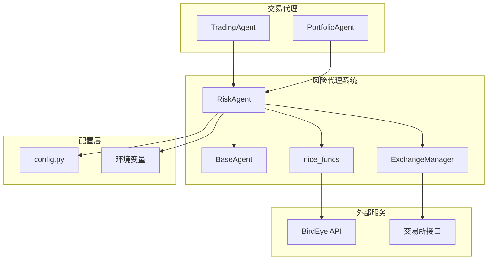
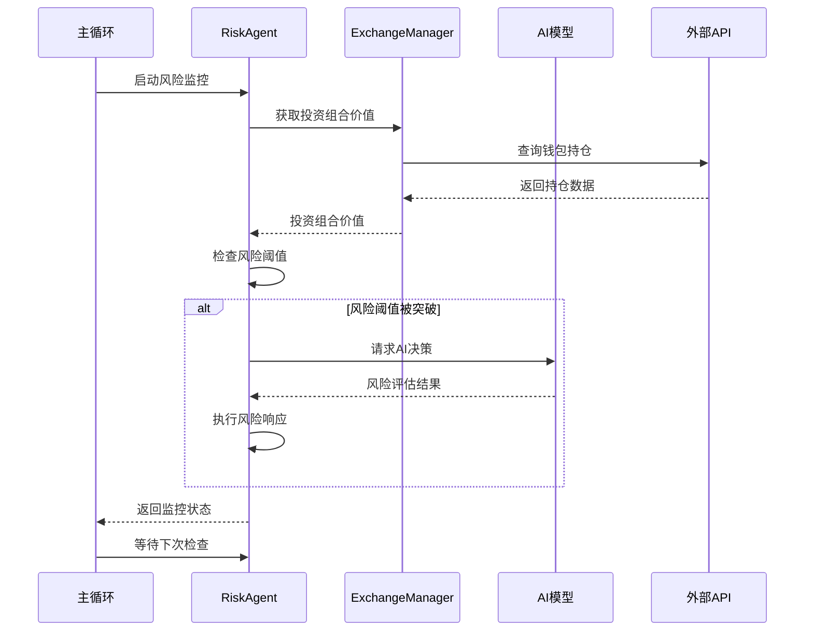
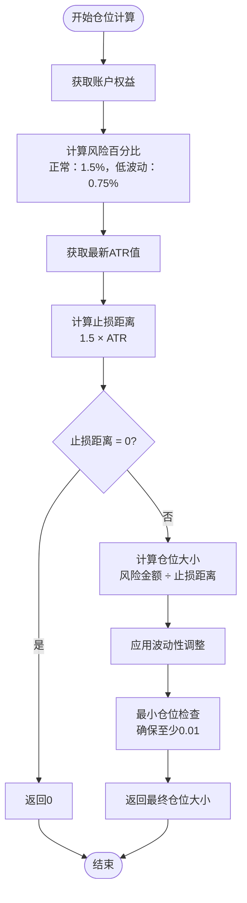
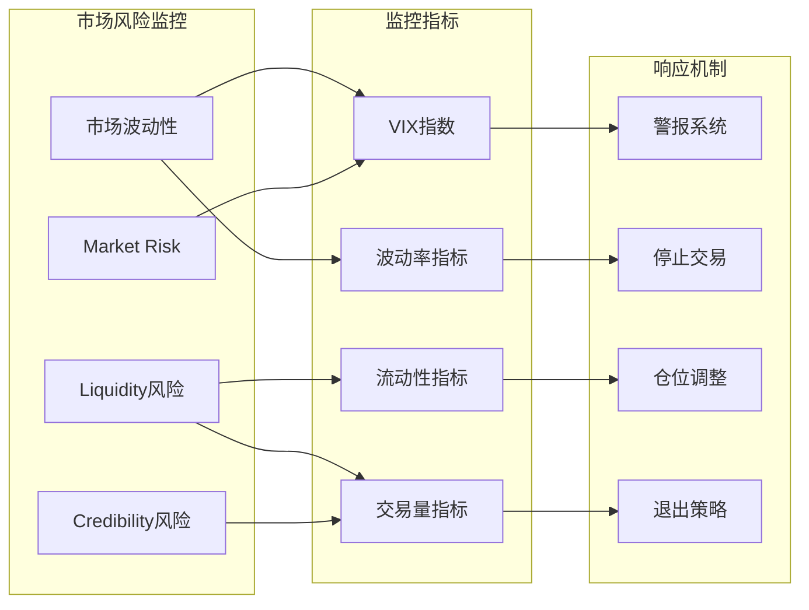
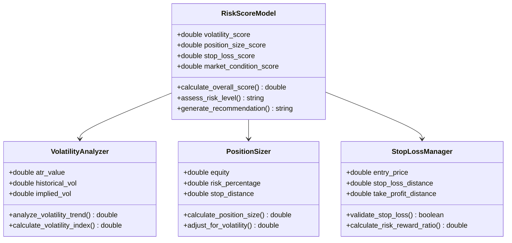
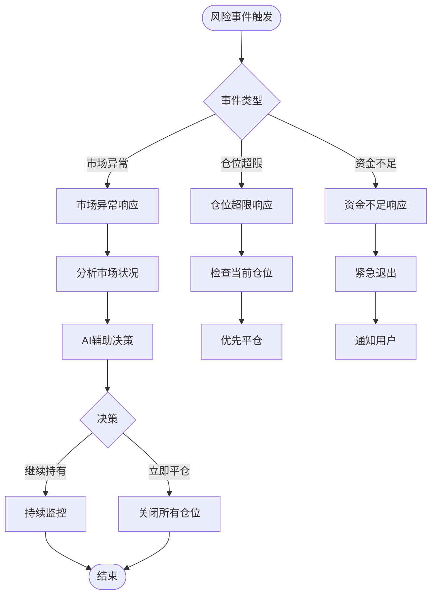
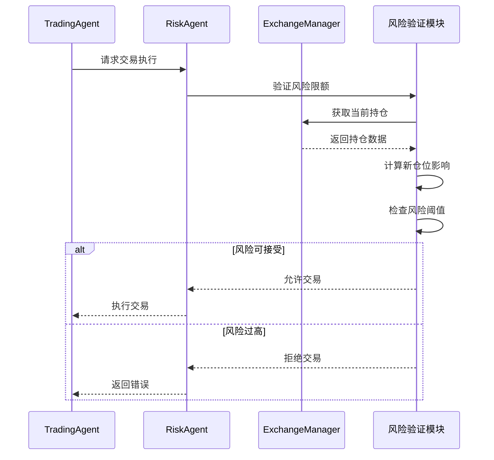
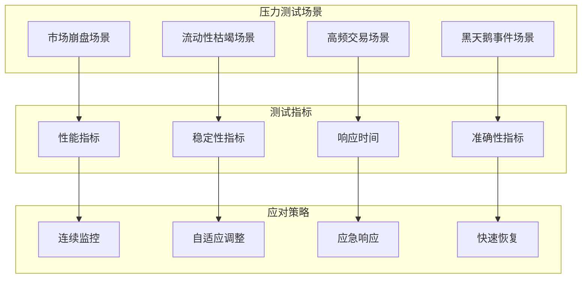
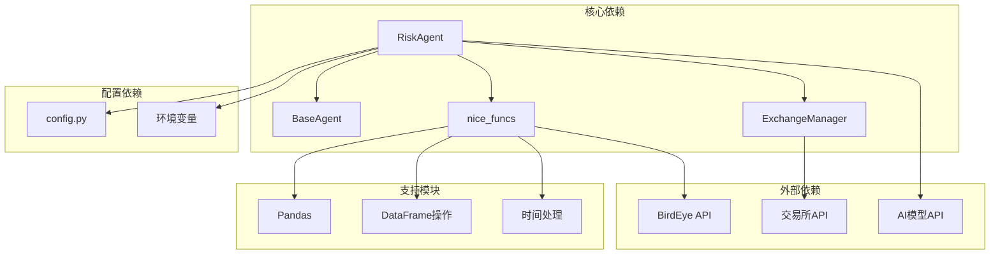

# 风险代理

<cite>
**本文档中引用的文件**
- [risk_agent.py](file://src/agents/risk_agent.py)
- [config.py](file://src/config.py)
- [base_agent.py](file://src/agents/base_agent.py)
- [trading_agent.py](file://src/agents/trading_agent.py)
- [exchange_manager.py](file://src/exchange_manager.py)
- [nice_funcs.py](file://src/nice_funcs.py)
</cite>

## 目录
1. [简介](#简介)
2. [项目结构](#项目结构)
3. [核心组件](#核心组件)
4. [架构概览](#架构概览)
5. [详细组件分析](#详细组件分析)
6. [依赖关系分析](#依赖关系分析)
7. [性能考虑](#性能考虑)
8. [故障排除指南](#故障排除指南)
9. [结论](#结论)

## 简介

Moon Dev的AI交易代理系统中的风险代理（Risk Agent）是一个高度智能的风险管理模块，专门负责实时监控交易组合的风险状况，执行严格的风险控制措施，并在必要时触发自动保护机制。该代理采用先进的AI驱动方法，结合多种风险评估指标和实时监控技术，为整个交易系统提供强大的风险管理保障。

风险代理的核心功能包括：
- 实时风险评估与监控
- 自动化风险阈值检查
- 智能止损和止盈机制
- AI辅助的风险决策
- 多层次风险控制体系
- 压力测试和极端市场条件应对

## 项目结构

风险代理作为Moon Dev AI交易系统的重要组成部分，位于`src/agents/`目录下，与其他代理协同工作形成完整的交易生态系统。



**图表来源**
- [risk_agent.py](file://src/agents/risk_agent.py#L1-L50)
- [base_agent.py](file://src/agents/base_agent.py#L1-L30)
- [exchange_manager.py](file://src/exchange_manager.py#L1-L50)

**章节来源**
- [risk_agent.py](file://src/agents/risk_agent.py#L1-L100)
- [config.py](file://src/config.py#L1-L50)

## 核心组件

### RiskAgent类

RiskAgent是风险管理系统的核心控制器，继承自BaseAgent基类，提供了完整的风险管理功能框架。

#### 主要属性和配置

风险代理使用多层次的风险控制参数：

| 参数类型 | 配置项 | 默认值 | 描述 |
|---------|--------|--------|------|
| 基础配置 | USE_PERCENTAGE | False | 是否使用百分比模式进行风险控制 |
| 基础配置 | USE_AI_CONFIRMATION | True | 是否启用AI确认机制 |
| USD限制 | MAX_LOSS_USD | 25 | 最大亏损限制（美元） |
| USD限制 | MAX_GAIN_USD | 25 | 最大盈利限制（美元） |
| 百分比限制 | MAX_LOSS_PERCENT | 5 | 最大亏损百分比 |
| 百分比限制 | MAX_GAIN_PERCENT | 5 | 最大盈利百分比 |
| 安全限制 | MINIMUM_BALANCE_USD | 50 | 最低余额限制 |
| 时间间隔 | MAX_LOSS_GAIN_CHECK_HOURS | 12 | 检查间隔（小时） |

#### 关键方法

1. **初始化方法** (`__init__`)
   - 设置AI模型参数
   - 初始化API客户端
   - 计算初始投资组合价值
   - 配置风险控制参数

2. **风险监控方法** (`check_risk_limits`)
   - 实时检查投资组合表现
   - 对比预设风险阈值
   - 触发相应的风险响应

3. **AI辅助决策** (`handle_limit_breach`)
   - 在风险阈值被突破时咨询AI
   - 分析市场状况和持仓情况
   - 决定是否关闭所有头寸

**章节来源**
- [risk_agent.py](file://src/agents/risk_agent.py#L50-L150)
- [config.py](file://src/config.py#L50-L100)

## 架构概览

风险代理采用分层架构设计，确保风险控制的全面性和有效性。



**图表来源**
- [risk_agent.py](file://src/agents/risk_agent.py#L567-L601)
- [exchange_manager.py](file://src/exchange_manager.py#L50-L100)

## 详细组件分析

### 波动率分析与仓位规模计算

风险代理实现了基于ATR（平均真实波幅）的动态仓位计算机制，这是现代量化交易中最重要的风险控制工具之一。

#### ATR仓位计算算法



**图表来源**
- [risk_agent.py](file://src/agents/risk_agent.py#L30-L50)

#### 波动性调整机制

风险代理根据市场波动性动态调整仓位规模：

- **高波动性时期**：降低仓位至50%，减少风险暴露
- **低波动性时期**：维持标准仓位，最大化收益潜力
- **极端波动性**：实施更严格的仓位限制

**章节来源**
- [risk_agent.py](file://src/agents/risk_agent.py#L30-L50)

### 实时监控系统

#### 异常交易行为检测

风险代理实现了多层次的异常检测机制：

1. **价格异常检测**
   - 基于统计学原理的3σ规则
   - 动态阈值计算
   - 时间序列异常识别

2. **成交量异常检测**
   - 成交量与价格的相关性分析
   - 突发性成交量放大检测
   - 趋势异常识别

3. **市场流动性检测**
   - 流动性深度监控
   - 滑点风险评估
   - 买卖价差分析

#### 市场风险监控



**图表来源**
- [risk_agent.py](file://src/agents/risk_agent.py#L165-L200)

**章节来源**
- [risk_agent.py](file://src/agents/risk_agent.py#L165-L230)

### 风险评分模型

#### 综合风险评分算法

风险代理使用多维度评分模型来评估整体风险状况：



**图表来源**
- [risk_agent.py](file://src/agents/risk_agent.py#L30-L50)
- [trading_agent.py](file://src/agents/trading_agent.py#L300-L350)

#### 风险阈值配置

风险代理支持灵活的风险阈值配置系统：

| 阈值类型 | 配置参数 | 默认值 | 应用场景 |
|---------|----------|--------|----------|
| 绝对损失阈值 | MAX_LOSS_USD | $25 | 固定金额风险控制 |
| 绝对收益阈值 | MAX_GAIN_USD | $25 | 固定金额收益保护 |
| 相对损失阈值 | MAX_LOSS_PERCENT | 5% | 基于账户比例的风险控制 |
| 相对收益阈值 | MAX_GAIN_PERCENT | 5% | 基于账户比例的收益保护 |
| 最低余额阈值 | MINIMUM_BALANCE_USD | $50 | 账户安全底线 |
| AI确认开关 | USE_AI_CONFIRMATION | True | 自动化程度控制 |

**章节来源**
- [config.py](file://src/config.py#L50-L80)

### 风险事件处理流程

#### 自动化风险响应机制

当检测到风险事件时，风险代理按照以下流程处理：



**图表来源**
- [risk_agent.py](file://src/agents/risk_agent.py#L443-L500)

#### AI辅助风险决策

风险代理集成了先进的AI模型来进行复杂的风险决策：

```python
# AI风险决策提示模板
RISK_OVERRIDE_PROMPT = """
你正在分析Moon Dev的投资组合风险状况。

请分析提供的市场数据，决定是否应该：
1. OVERRIDE：保持现有仓位
2. RESPECT_LIMIT：关闭部分或全部仓位

分析要点：
- 当前价格走势和动量（15m和5m时间框架）
- 成交量模式和趋势
- 市场条件和波动性
- 基于当前仓位规模的风险回报比

对于最大亏损覆盖：
- 必须极其保守
- 只有在强烈反转信号时才覆盖
- 需要90%以上的信心
- 所有仓位都必须显示反转潜力

对于最大盈利覆盖：
- 可以更加宽松
- 寻找持续动量
- 需要60%以上的信心
- 大多数仓位应该显示向上动量
"""
```

**章节来源**
- [risk_agent.py](file://src/agents/risk_agent.py#L20-L50)
- [risk_agent.py](file://src/agents/risk_agent.py#L232-L300)

### 与其他代理的集成

#### 交易执行前的风险验证

风险代理与交易代理紧密集成，在每次交易执行前进行风险验证：



**图表来源**
- [trading_agent.py](file://src/agents/trading_agent.py#L300-L350)
- [risk_agent.py](file://src/agents/risk_agent.py#L443-L472)

#### 投资组合平衡机制

风险代理参与投资组合的整体平衡管理：

1. **资产配置监控**
   - 实时跟踪各资产的权重
   - 检查是否超出预设限制
   - 自动调整仓位分配

2. **流动性管理**
   - 确保足够的现金储备
   - 监控流动性风险
   - 优化资金使用效率

3. **集中度控制**
   - 限制单一资产占比
   - 分散投资风险
   - 避免过度集中

**章节来源**
- [risk_agent.py](file://src/agents/risk_agent.py#L472-L520)

### 压力测试与极端市场条件应对

#### 压力测试场景设计

风险代理支持多种压力测试场景，以评估系统在极端市场条件下的表现：



#### 极端市场条件应对策略

1. **快速反应机制**
   - 实时监控市场状况
   - 自动触发保护措施
   - 最小化潜在损失

2. **流动性保护**
   - 保持充足的现金储备
   - 优化订单执行策略
   - 减少市场冲击

3. **风险管理强化**
   - 加强仓位限制
   - 提高止损精度
   - 增加监控频率

**章节来源**
- [risk_agent.py](file://src/agents/risk_agent.py#L520-L567)

## 依赖关系分析

风险代理系统具有清晰的依赖关系结构，确保各个组件之间的协调工作。



**图表来源**
- [risk_agent.py](file://src/agents/risk_agent.py#L1-L50)
- [base_agent.py](file://src/agents/base_agent.py#L1-L30)

**章节来源**
- [risk_agent.py](file://src/agents/risk_agent.py#L1-L50)
- [exchange_manager.py](file://src/exchange_manager.py#L1-L50)

## 性能考虑

### 实时性能优化

风险代理在设计时充分考虑了实时性能要求：

1. **缓存机制**
   - 缓存关键市场数据
   - 减少API调用频率
   - 实现数据更新策略

2. **异步处理**
   - 非阻塞的数据获取
   - 并行风险计算
   - 异步AI请求处理

3. **资源管理**
   - 控制内存使用
   - 优化CPU占用
   - 网络连接池管理

### 扩展性设计

系统采用模块化设计，便于扩展和维护：

- **插件化架构**：支持新的风险指标添加
- **配置驱动**：通过配置文件调整参数
- **API标准化**：统一的接口设计
- **日志记录**：完整的审计跟踪

## 故障排除指南

### 常见问题及解决方案

#### 1. API连接问题

**症状**：无法获取市场数据或持仓信息
**原因**：网络连接或API密钥配置错误
**解决方案**：
- 检查环境变量配置
- 验证API密钥有效性
- 确认网络连接状态

#### 2. 风险阈值误触发

**症状**：频繁触发风险警告但实际风险可控
**原因**：阈值设置过于敏感
**解决方案**：
- 调整风险阈值参数
- 优化波动性计算方法
- 增加确认机制

#### 3. AI决策不一致

**症状**：AI模型给出相互矛盾的建议
**原因**：模型配置或数据质量问题
**解决方案**：
- 检查模型配置
- 验证输入数据质量
- 调整AI参数设置

**章节来源**
- [risk_agent.py](file://src/agents/risk_agent.py#L567-L631)

## 结论

Moon Dev的风险代理代表了现代AI交易系统中风险管理的最佳实践。通过整合先进的AI技术、实时监控能力和自动化响应机制，该系统能够有效识别和管理各种市场风险，为投资者提供可靠的风险保障。

### 主要优势

1. **智能化风险控制**：利用AI进行复杂的风险评估和决策
2. **实时监控能力**：全天候监控市场状况和投资组合表现
3. **多层次防护机制**：从仓位到资金的全方位风险控制
4. **灵活配置选项**：支持不同风险偏好的个性化设置
5. **强大的集成能力**：与整个交易系统无缝协作

### 发展方向

未来的发展重点包括：
- 增强机器学习算法的预测能力
- 扩展多资产类别的风险管理
- 优化AI模型的决策效率
- 加强与其他金融系统的集成
- 提升用户体验和透明度

风险代理作为Moon Dev AI交易系统的核心组件，为实现稳定、可持续的交易策略奠定了坚实的基础，是现代量化交易风险管理的重要创新。