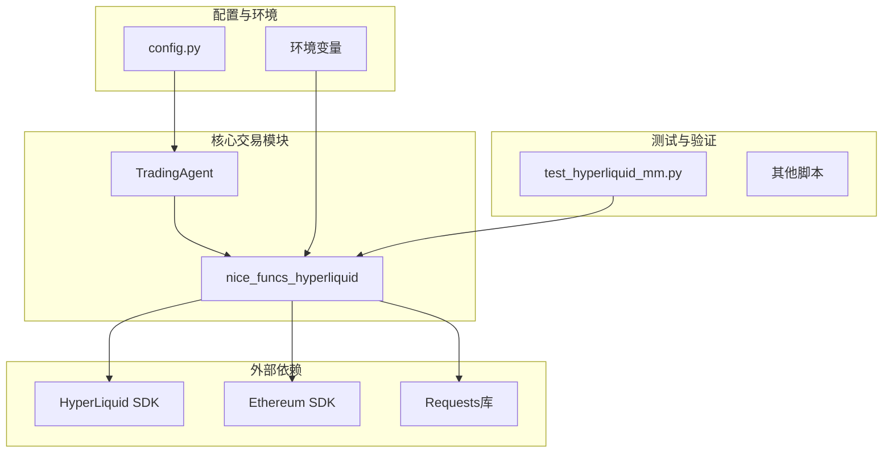
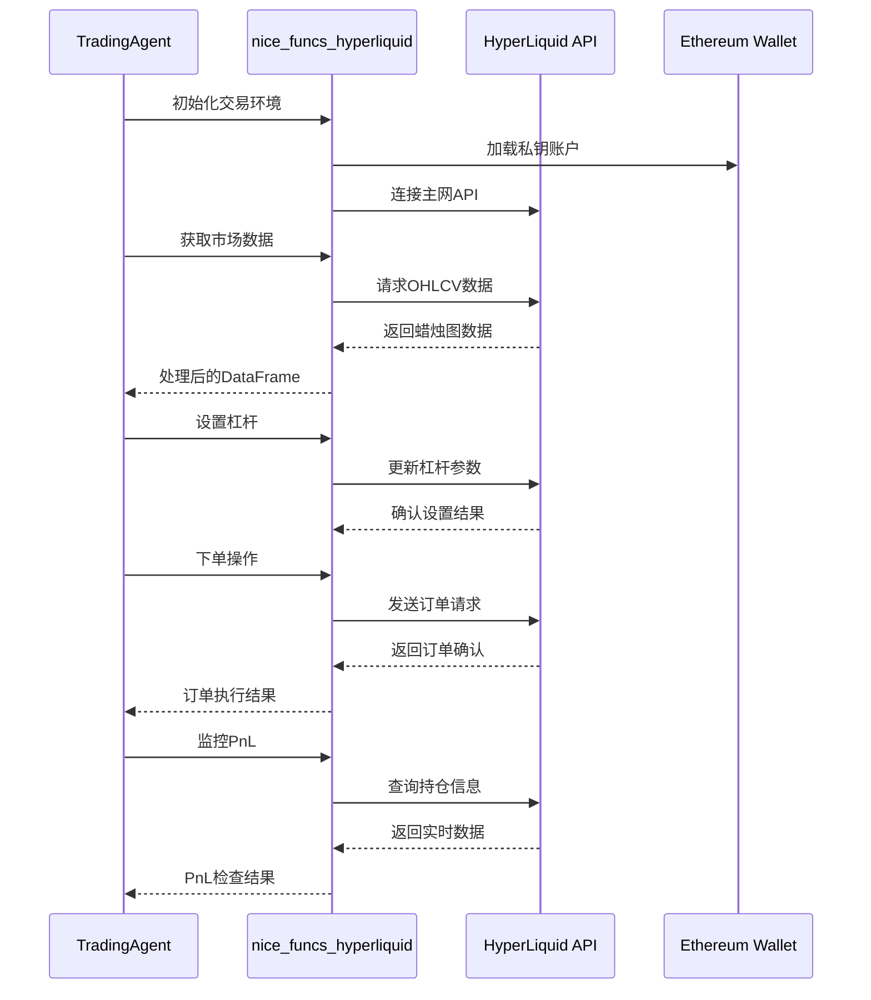
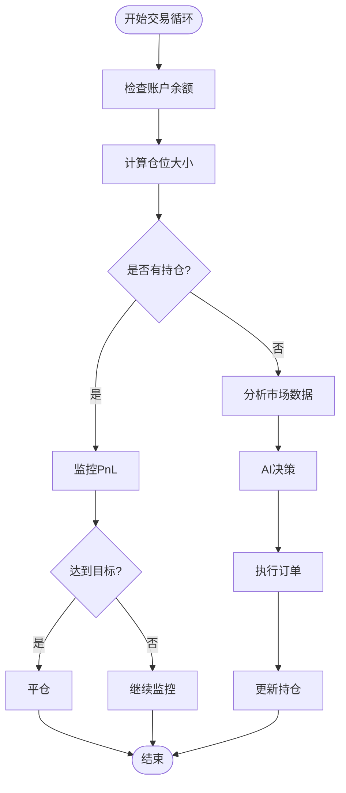
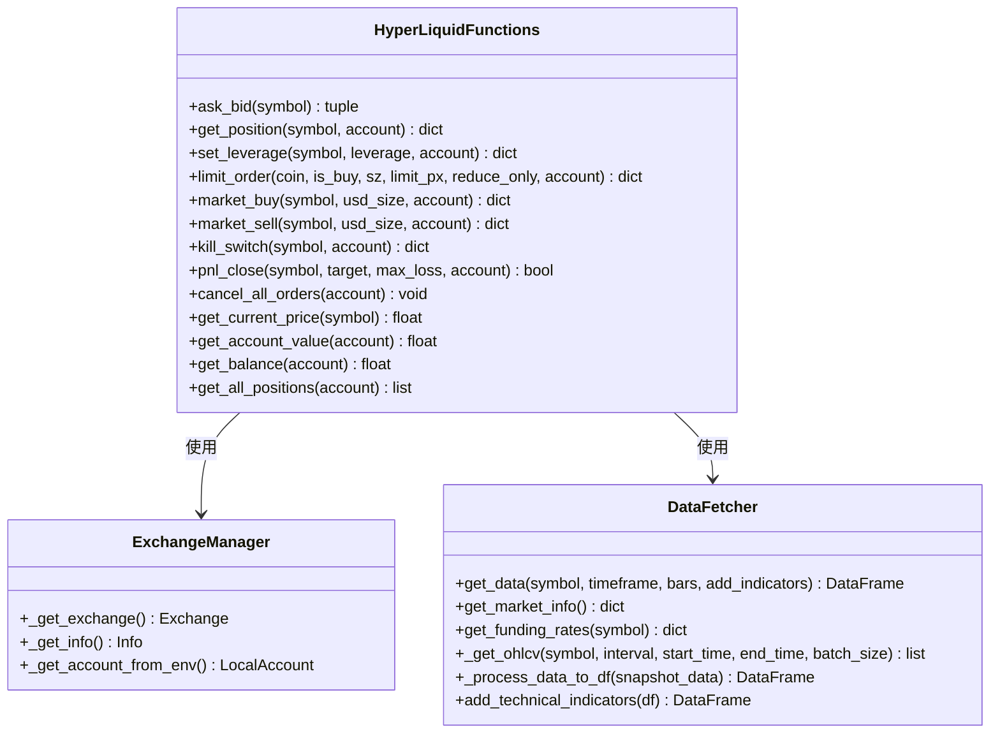
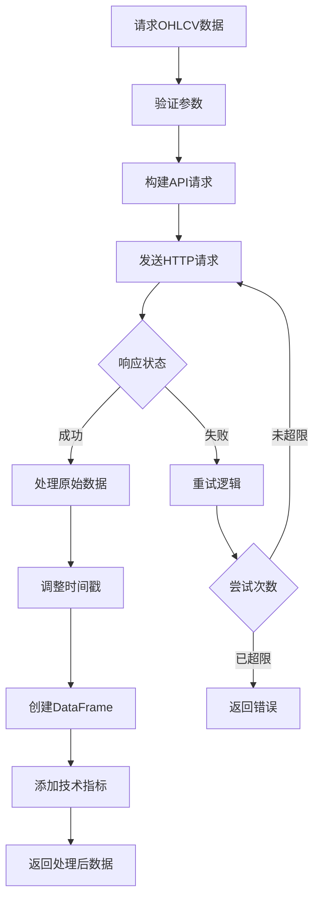
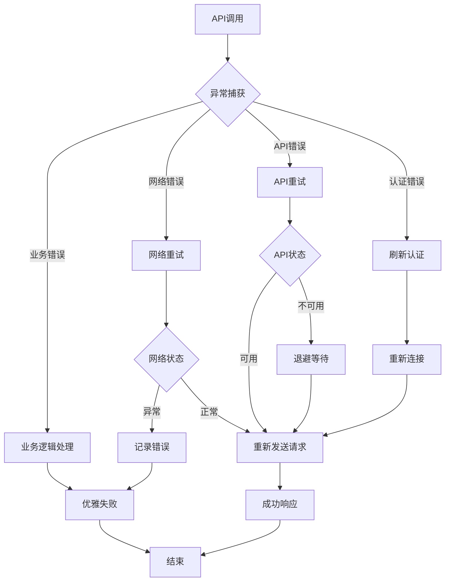
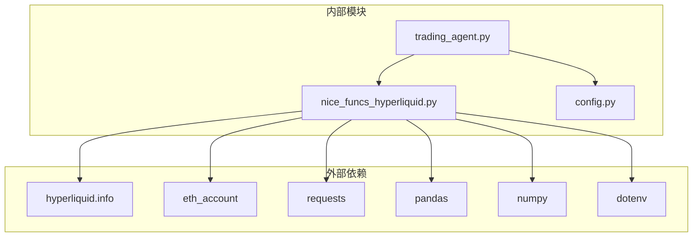

# HyperLiquid集成详细文档

<cite>
**本文档引用的文件**
- [nice_funcs_hyperliquid.py](file://src/nice_funcs_hyperliquid.py)
- [trading_agent.py](file://src/agents/trading_agent.py)
- [config.py](file://src/config.py)
- [test_hyperliquid_mm.py](file://src/scripts/test_hyperliquid_mm.py)
</cite>

## 目录
1. [简介](#简介)
2. [项目结构概览](#项目结构概览)
3. [核心组件分析](#核心组件分析)
4. [架构概览](#架构概览)
5. [详细组件分析](#详细组件分析)
6. [依赖关系分析](#依赖关系分析)
7. [性能考虑](#性能考虑)
8. [故障排除指南](#故障排除指南)
9. [结论](#结论)

## 简介

Moon Dev的HyperLiquid集成是一个专为HyperLiquid永续合约交易平台设计的高级交易系统。该系统提供了完整的API封装、订单管理、实时数据订阅和智能交易决策功能。通过深度集成HyperLiquid的原生SDK和自定义优化函数，该系统能够执行复杂的交易策略，支持多种订单类型，并具备强大的风险管理能力。

## 项目结构概览

**图表来源**
- [trading_agent.py](file://src/agents/trading_agent.py#L1-L50)
- [nice_funcs_hyperliquid.py](file://src/nice_funcs_hyperliquid.py#L1-L50)

**章节来源**
- [trading_agent.py](file://src/agents/trading_agent.py#L1-L100)
- [nice_funcs_hyperliquid.py](file://src/nice_funcs_hyperliquid.py#L1-L100)

## 核心组件分析

### API封装层

HyperLiquid集成的核心是`nice_funcs_hyperliquid.py`模块，它提供了对HyperLiquid交易所的完整API封装。该模块包含以下关键功能：

#### 订单类型支持
- **限价单（Limit Order）**: 支持GTC（Good Till Cancelled）和IOC（Immediate or Cancel）两种时间在市（TIF）类型
- **市价单（Market Order）**: 提供立即执行的市场订单功能
- **止损单（Stop Loss）**: 基于PnL百分比的目标止盈和止损功能
- **平仓单（Kill Switch）**: 快速平仓功能，确保风险控制

#### 杠杆与保证金管理
- **全局杠杆设置**: 默认5倍杠杆，可配置范围1-50倍
- **保证金计算**: 自动计算所需保证金和头寸规模
- **交叉保证金**: 支持交叉保证金模式以提高资金效率

#### 实时数据获取
- **市场深度**: 获取买卖盘口数据
- **价格精度**: 自动获取价格和数量的小数位数
- **资金费率**: 获取当前资金费率和标记价格

**章节来源**
- [nice_funcs_hyperliquid.py](file://src/nice_funcs_hyperliquid.py#L31-L120)
- [nice_funcs_hyperliquid.py](file://src/nice_funcs_hyperliquid.py#L151-L200)

## 架构概览

**图表来源**
- [trading_agent.py](file://src/agents/trading_agent.py#L200-L300)
- [nice_funcs_hyperliquid.py](file://src/nice_funcs_hyperliquid.py#L151-L250)

## 详细组件分析

### TradingAgent交易代理

TradingAgent是整个交易系统的核心控制器，负责协调各个组件的工作。

#### 配置管理
系统支持多种交易模式：
- **单模型模式**: 使用单一AI模型进行快速决策（约10秒/次）
- **群组模式**: 同时查询6个AI模型进行共识投票（约45-60秒/次）

#### 仓位管理

**图表来源**
- [trading_agent.py](file://src/agents/trading_agent.py#L400-L500)

#### 风险管理
- **最大仓位限制**: 单笔交易不超过账户余额的30%
- **止损止盈**: 支持基于百分比的风险控制
- **仓位轮换**: 防止过度交易的睡眠机制

**章节来源**
- [trading_agent.py](file://src/agents/trading_agent.py#L60-L120)
- [trading_agent.py](file://src/agents/trading_agent.py#L400-L600)

### nice_funcs_hyperliquid核心函数库

#### API封装与签名机制

**图表来源**
- [nice_funcs_hyperliquid.py](file://src/nice_funcs_hyperliquid.py#L100-L200)
- [nice_funcs_hyperliquid.py](file://src/nice_funcs_hyperliquid.py#L800-L925)

#### 订单执行流程

系统支持多种订单类型的精确执行：

1. **限价单执行**:
   - 自动价格精度处理
   - TIF类型灵活配置
   - 减仓模式支持

2. **市价单执行**:
   - 溢价/折价策略确保成交
   - 最小订单价值检查
   - 批量请求优化

3. **止损止盈机制**:
   - 基于PnL百分比的自动平仓
   - 实时监控和触发
   - 快速IOC订单执行

**章节来源**
- [nice_funcs_hyperliquid.py](file://src/nice_funcs_hyperliquid.py#L200-L400)
- [nice_funcs_hyperliquid.py](file://src/nice_funcs_hyperliquid.py#L400-L600)

### 数据获取与处理

#### OHLCV数据获取

**图表来源**
- [nice_funcs_hyperliquid.py](file://src/nice_funcs_hyperliquid.py#L600-L700)

#### 技术指标集成
系统内置多种技术指标：
- **移动平均线**: SMA 20/50周期
- **相对强弱指数**: RSI 14周期
- **MACD指标**: 标准MACD计算
- **布林带**: 标准布林带通道

**章节来源**
- [nice_funcs_hyperliquid.py](file://src/nice_funcs_hyperliquid.py#L700-L800)

### 错误处理与性能优化

#### 错误处理机制

**图表来源**
- [nice_funcs_hyperliquid.py](file://src/nice_funcs_hyperliquid.py#L500-L600)

#### 性能优化措施

1. **批量请求优化**:
   - 最大批次大小：5000根K线
   - 并发请求控制
   - 连接池复用

2. **缓存机制**:
   - 市场信息缓存
   - 价格精度缓存
   - 资产信息缓存

3. **网络优化**:
   - 超时控制：10秒
   - 重试机制：最多3次
   - 退避算法：指数退避

**章节来源**
- [nice_funcs_hyperliquid.py](file://src/nice_funcs_hyperliquid.py#L500-L600)

## 依赖关系分析

**图表来源**
- [nice_funcs_hyperliquid.py](file://src/nice_funcs_hyperliquid.py#L1-L30)
- [trading_agent.py](file://src/agents/trading_agent.py#L1-L50)

**章节来源**
- [nice_funcs_hyperliquid.py](file://src/nice_funcs_hyperliquid.py#L1-L30)
- [trading_agent.py](file://src/agents/trading_agent.py#L1-L50)

## 性能考虑

### 网络延迟优化
- **连接复用**: 使用requests.Session保持连接
- **超时控制**: 10秒超时防止长时间等待
- **并发控制**: 限制同时请求数量避免API限流

### 内存使用优化
- **数据分批处理**: 最大5000条记录的批次处理
- **及时释放**: 处理完成后立即清理临时数据
- **内存监控**: 定期检查内存使用情况

### API限流应对
- **指数退避**: 失败时采用指数退避策略
- **重试限制**: 最多3次重试机会
- **熔断机制**: 连续失败时暂停请求

## 故障排除指南

### 常见问题及解决方案

#### 1. 认证失败
**症状**: 私钥加载失败或签名错误
**解决方案**: 
- 检查`.env`文件中的`HYPER_LIQUID_ETH_PRIVATE_KEY`
- 验证私钥格式正确性
- 确认网络连接正常

#### 2. 订单执行失败
**症状**: 订单无法提交或部分成交
**解决方案**:
- 检查最小订单价值（$10）
- 验证价格精度设置
- 确认账户余额充足

#### 3. 数据获取超时
**症状**: OHLCV数据请求超时
**解决方案**:
- 检查网络连接
- 减少请求的数据量
- 增加超时时间

#### 4. 杠杆设置失败
**症状**: 杠杆无法设置或设置无效
**解决方案**:
- 确认符号名称正确
- 检查杠杆倍数范围（1-50）
- 验证账户权限

**章节来源**
- [nice_funcs_hyperliquid.py](file://src/nice_funcs_hyperliquid.py#L500-L600)
- [test_hyperliquid_mm.py](file://src/scripts/test_hyperliquid_mm.py#L100-L200)

## 结论

Moon Dev的HyperLiquid集成为高频交易和自动化交易提供了完整的解决方案。通过精心设计的API封装、智能的风险管理和强大的错误处理机制，该系统能够在高频率、低延迟的交易环境中稳定运行。

### 主要优势
1. **完整的API覆盖**: 包含所有必要的交易功能
2. **智能风险管理**: 多层次的风险控制机制
3. **高性能优化**: 针对高频交易的优化设计
4. **健壮的错误处理**: 全面的异常处理和恢复机制

### 应用场景
- **高频交易策略**: 支持复杂的量化交易策略
- **套利交易**: 利用不同市场的价格差异
- **趋势跟踪**: 基于技术指标的趋势交易
- **波动率交易**: 基于波动率的交易策略

该系统为开发者提供了一个可靠、高效的HyperLiquid交易平台集成方案，适用于各种交易场景和策略需求。