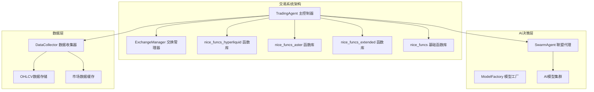
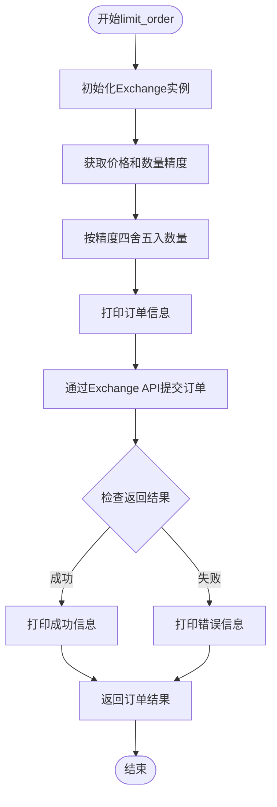
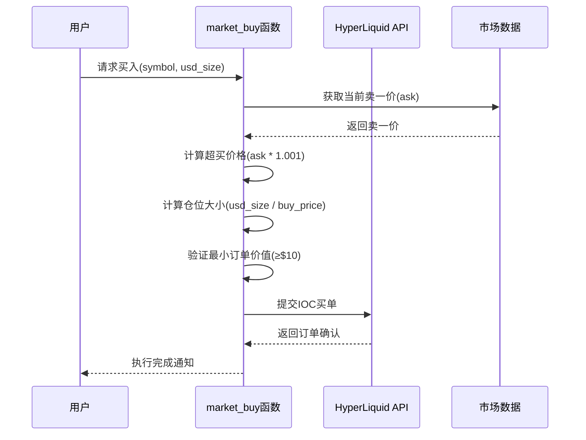
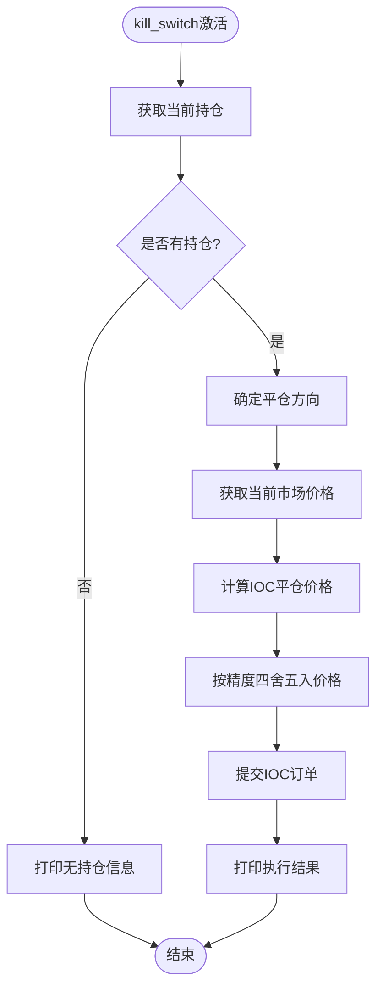
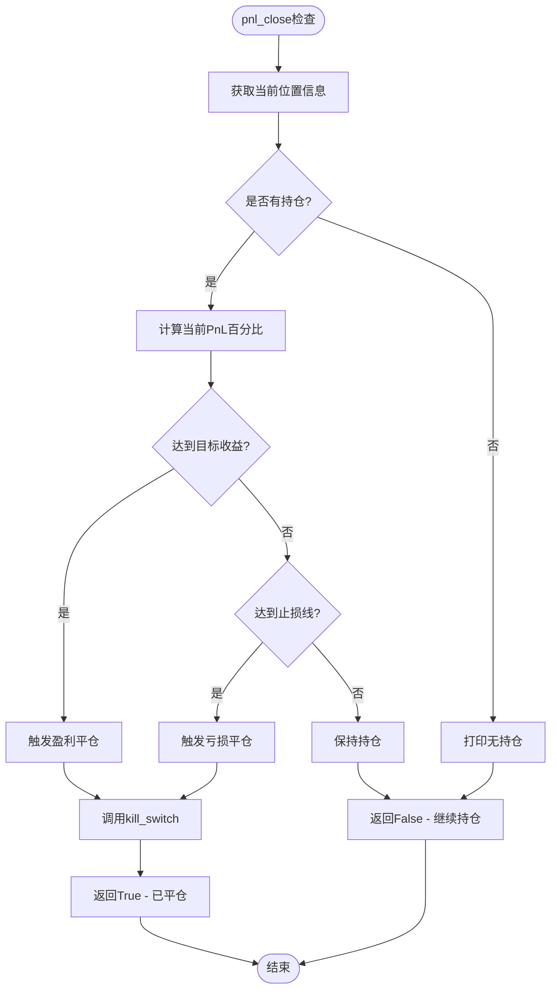
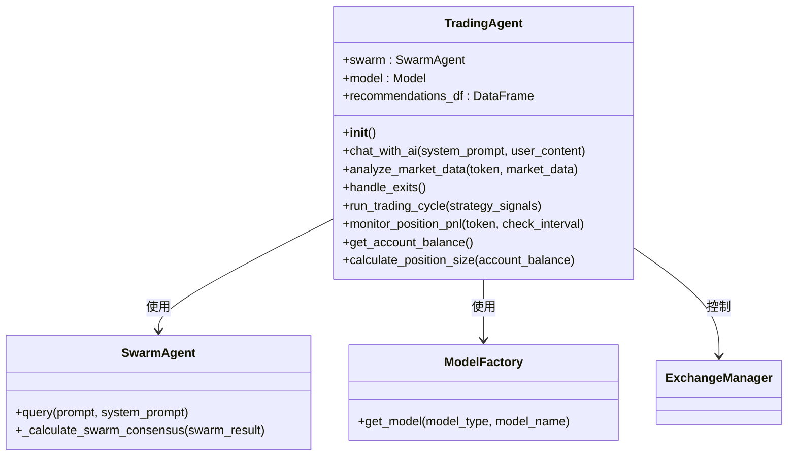
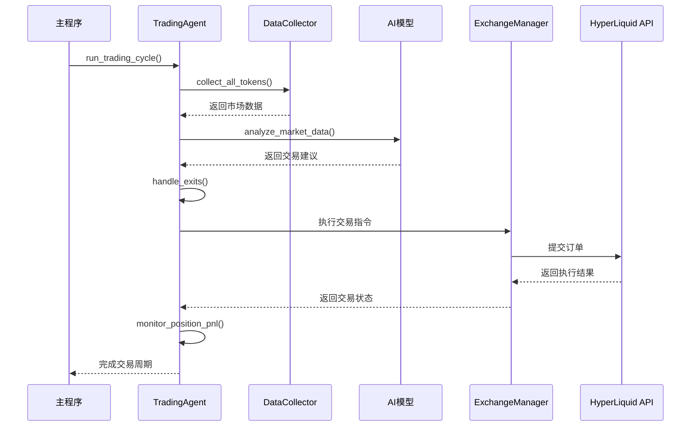
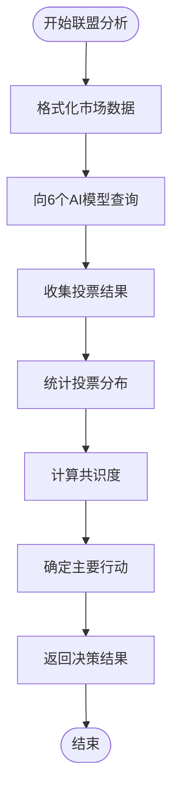
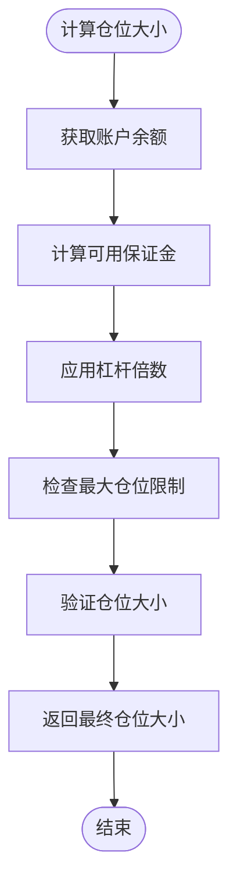
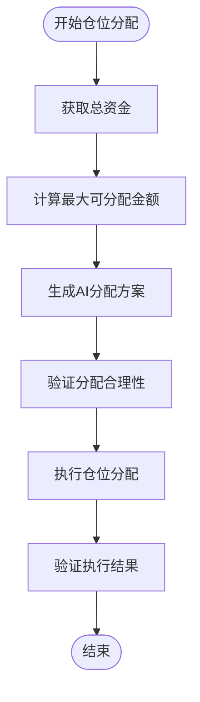

# 交易操作

<cite>
**本文档中引用的文件**
- [nice_funcs_hyperliquid.py](file://src/nice_funcs_hyperliquid.py)
- [trading_agent.py](file://src/agents/trading_agent.py)
- [exchange_manager.py](file://src/exchange_manager.py)
- [nice_funcs.py](file://src/nice_funcs.py)
- [nice_funcs_aster.py](file://src/nice_funcs_aster.py)
- [nice_funcs_extended.py](file://src/nice_funcs_extended.py)
</cite>

## 目录
1. [简介](#简介)
2. [项目结构概览](#项目结构概览)
3. [核心交易函数](#核心交易函数)
4. [TradingAgent类架构](#tradingagent类架构)
5. [交易执行流程](#交易执行流程)
6. [风险控制机制](#风险控制机制)
7. [AI驱动的交易决策](#ai驱动的交易决策)
8. [性能优化考虑](#性能优化考虑)
9. [故障排除指南](#故障排除指南)
10. [总结](#总结)

## 简介

本文档详细阐述了Moon Dev AI交易系统在HyperLiquid交易所上的交易执行流程。该系统采用AI驱动的决策模式，通过多个智能模块协同工作，实现自动化交易策略的执行。系统的核心特点包括：

- **AI驱动的交易决策**：基于6个AI模型的共识投票机制
- **多层级风险控制**：包含止损、止盈、仓位管理等多重保护
- **灵活的交易模式**：支持长仓、短仓和无头寸的多种状态
- **实时监控与调整**：持续监控持仓表现并自动执行退出策略

## 项目结构概览

**图表来源**
- [trading_agent.py](file://src/agents/trading_agent.py#L453-L530)
- [exchange_manager.py](file://src/exchange_manager.py#L63-L95)

**章节来源**
- [trading_agent.py](file://src/agents/trading_agent.py#L1-L100)
- [nice_funcs_hyperliquid.py](file://src/nice_funcs_hyperliquid.py#L1-L50)

## 核心交易函数

### limit_order()函数详解

`limit_order()`函数是系统中最基础的限价单执行函数，负责封装完整的订单提交流程。

**图表来源**
- [nice_funcs_hyperliquid.py](file://src/nice_funcs_hyperliquid.py#L209-L230)

#### 关键特性

1. **精度处理**：自动获取并应用正确的价格和数量小数位数
2. **订单验证**：提供详细的订单信息打印功能
3. **状态跟踪**：记录订单提交状态并反馈给用户
4. **API集成**：直接调用HyperLiquid Exchange API

**章节来源**
- [nice_funcs_hyperliquid.py](file://src/nice_funcs_hyperliquid.py#L209-L230)

### market_buy()和market_sell()函数

这两个函数实现了通过市价单模拟买卖操作的核心逻辑。

#### 市场买入流程

**图表来源**
- [nice_funcs_hyperliquid.py](file://src/nice_funcs_hyperliquid.py#L318-L356)

#### 市场卖出流程

两个函数都采用了类似的设计模式，但方向相反：
- **market_buy()**：在卖一价基础上加0.1%作为买入价格
- **market_sell()**：在买一价基础上减0.1%作为卖出价格

#### 最小订单金额校验

系统实现了严格的最小订单价值检查：

| 交易类型 | 最小订单价值 | 处理方式 |
|---------|-------------|----------|
| 市场买入 | $10 | 调整为$11确保合规 |
| 市场卖出 | $10 | 调整为$11确保合规 |
| 限价单 | 动态计算 | 基于价格和数量 |

**章节来源**
- [nice_funcs_hyperliquid.py](file://src/nice_funcs_hyperliquid.py#L318-L396)

### kill_switch()和pnl_close()函数

这两个函数构成了系统的紧急平仓和基于PnL的止盈止损机制。

#### kill_switch()紧急平仓

**图表来源**
- [nice_funcs_hyperliquid.py](file://src/nice_funcs_hyperliquid.py#L232-L275)

#### pnl_close()基于PnL的退出

该函数实现了智能的止盈止损逻辑：

**图表来源**
- [nice_funcs_hyperliquid.py](file://src/nice_funcs_hyperliquid.py#L277-L302)

**章节来源**
- [nice_funcs_hyperliquid.py](file://src/nice_funcs_hyperliquid.py#L232-L302)

## TradingAgent类架构

TradingAgent是整个交易系统的核心控制器，负责协调各个组件的工作。

### 类结构概览

**图表来源**
- [trading_agent.py](file://src/agents/trading_agent.py#L453-L530)

### 初始化配置

TradingAgent提供了丰富的配置选项：

| 配置项 | 默认值 | 描述 |
|-------|--------|------|
| EXCHANGE | "ASTER" | 交易交易所选择 |
| USE_SWARM_MODE | True | 是否启用联盟模式 |
| LONG_ONLY | True | 是否只做多头交易 |
| MAX_POSITION_PERCENTAGE | 90 | 单笔最大仓位比例 |
| LEVERAGE | 9 | 杠杆倍数 |
| STOP_LOSS_PERCENTAGE | 5.0 | 止损百分比 |
| TAKE_PROFIT_PERCENTAGE | 5.0 | 止盈百分比 |

**章节来源**
- [trading_agent.py](file://src/agents/trading_agent.py#L66-L120)

## 交易执行流程

### 完整交易周期

**图表来源**
- [trading_agent.py](file://src/agents/trading_agent.py#L1051-L1079)

### AI决策流程

系统采用双重AI决策机制：

1. **单模型模式**：使用单一AI模型进行快速决策
2. **联盟模式**：6个AI模型投票产生共识决策

#### 联盟投票机制

**图表来源**
- [trading_agent.py](file://src/agents/trading_agent.py#L750-L800)

**章节来源**
- [trading_agent.py](file://src/agents/trading_agent.py#L1051-L1196)

## 风险控制机制

### 多层级风险管理

系统实现了多层次的风险控制体系：

#### 1. 仓位管理

**图表来源**
- [trading_agent.py](file://src/agents/trading_agent.py#L600-L650)

#### 2. 止损止盈设置

| 参数 | 默认值 | 作用范围 |
|------|--------|----------|
| STOP_LOSS_PERCENTAGE | 5.0% | 单笔交易最大亏损 |
| TAKE_PROFIT_PERCENTAGE | 5.0% | 单笔交易最大盈利 |
| PNL_CHECK_INTERVAL | 5秒 | PnL监控频率 |

#### 3. 最小订单价值保护

系统确保所有订单都满足交易所的最小订单要求：

- **HyperLiquid**：最小订单价值$10
- **Solana**：最小订单价值$10
- **Aster**：最小订单价值$5

**章节来源**
- [trading_agent.py](file://src/agents/trading_agent.py#L600-L700)

## AI驱动的交易决策

### 决策信号生成

TradingAgent通过以下步骤生成交易决策：

1. **市场数据分析**：收集OHLCV数据和技术指标
2. **AI模型分析**：使用AI模型评估市场状况
3. **信号聚合**：整合多个模型的输出
4. **决策制定**：根据信号强度决定交易行动

### 交易信号类型

| 信号类型 | 含义 | 处理方式 |
|---------|------|----------|
| BUY | 强买入信号 | 开仓或维持多头头寸 |
| SELL | 强卖出信号 | 平仓或开空头寸 |
| NOTHING | 中性信号 | 保持当前持仓不变 |

### 仓位分配算法

当启用组合投资时，系统使用AI算法进行智能仓位分配：

**图表来源**
- [trading_agent.py](file://src/agents/trading_agent.py#L700-L750)

**章节来源**
- [trading_agent.py](file://src/agents/trading_agent.py#L750-L850)

## 性能优化考虑

### 并发处理

系统采用异步处理模式提高效率：

- **数据收集**：并行获取多个标的物的市场数据
- **AI分析**：在联盟模式下并行调用多个AI模型
- **订单执行**：分批处理大额订单以避免冲击成本

### 缓存机制

为了提高响应速度，系统实现了多级缓存：

1. **市场数据缓存**：缓存最近的OHLCV数据
2. **AI响应缓存**：缓存AI模型的分析结果
3. **位置信息缓存**：缓存账户持仓状态

### 错误恢复

系统具备完善的错误处理和恢复机制：

- **重试机制**：关键操作失败时自动重试
- **降级策略**：部分功能失效时的备用方案
- **状态同步**：定期与交易所API同步状态

## 故障排除指南

### 常见问题及解决方案

#### 1. 订单提交失败

**症状**：订单无法成功提交
**可能原因**：
- 网络连接问题
- API密钥配置错误
- 账户余额不足

**解决步骤**：
1. 检查网络连接状态
2. 验证.env文件中的API密钥
3. 确认账户有足够的保证金

#### 2. AI模型响应超时

**症状**：AI分析长时间无响应
**可能原因**：
- AI服务不可用
- 网络延迟过高
- 请求参数过大

**解决步骤**：
1. 检查AI服务状态
2. 调整请求超时时间
3. 简化分析输入数据

#### 3. 仓位监控异常

**症状**：无法正确监控持仓PnL
**可能原因**：
- API接口变更
- 数据格式不匹配
- 时间戳偏移

**解决步骤**：
1. 更新API接口版本
2. 验证数据格式兼容性
3. 校正时间戳偏移

**章节来源**
- [trading_agent.py](file://src/agents/trading_agent.py#L1100-L1196)

## 总结

Moon Dev的AI交易系统在HyperLiquid上的交易执行流程体现了现代量化交易系统的先进理念：

### 核心优势

1. **智能化决策**：基于6个AI模型的共识投票机制，提高了决策的准确性和稳定性
2. **严格的风险控制**：多层次的风险管理体系确保交易安全
3. **灵活的执行模式**：支持多种交易策略和仓位管理方式
4. **实时监控能力**：持续监控持仓表现并自动执行退出策略

### 技术特色

- **模块化设计**：清晰的职责分离便于维护和扩展
- **API集成**：深度集成HyperLiquid API实现高效交易
- **容错机制**：完善的错误处理和恢复策略
- **性能优化**：并发处理和缓存机制提升系统效率

### 应用价值

该系统为AI驱动的量化交易提供了完整的解决方案，特别适用于高频交易和算法交易场景。通过AI技术的应用，系统能够快速适应市场变化，实现最优的交易决策和风险管理。