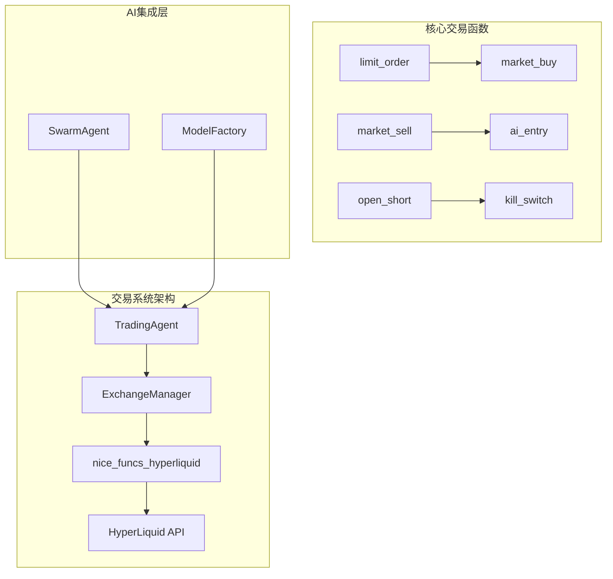
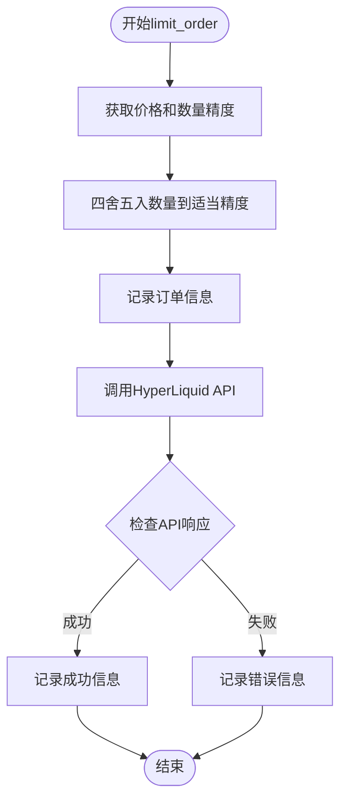
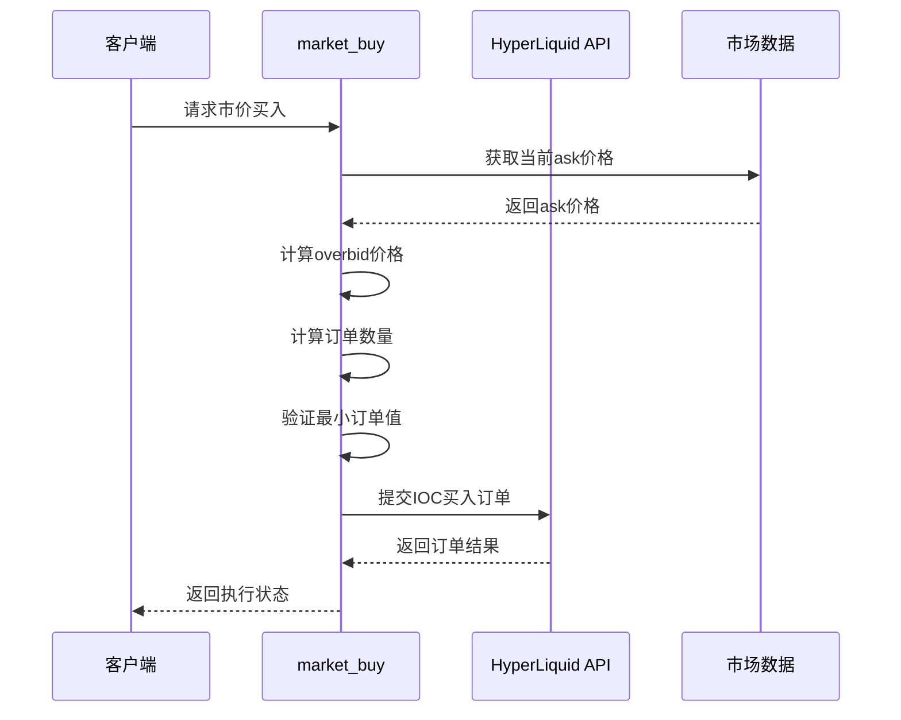
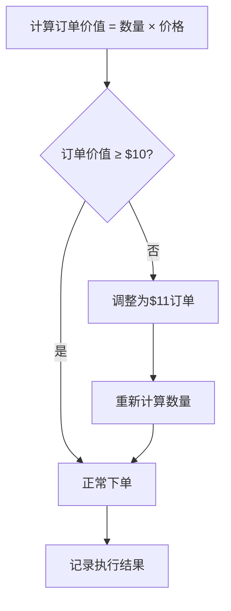
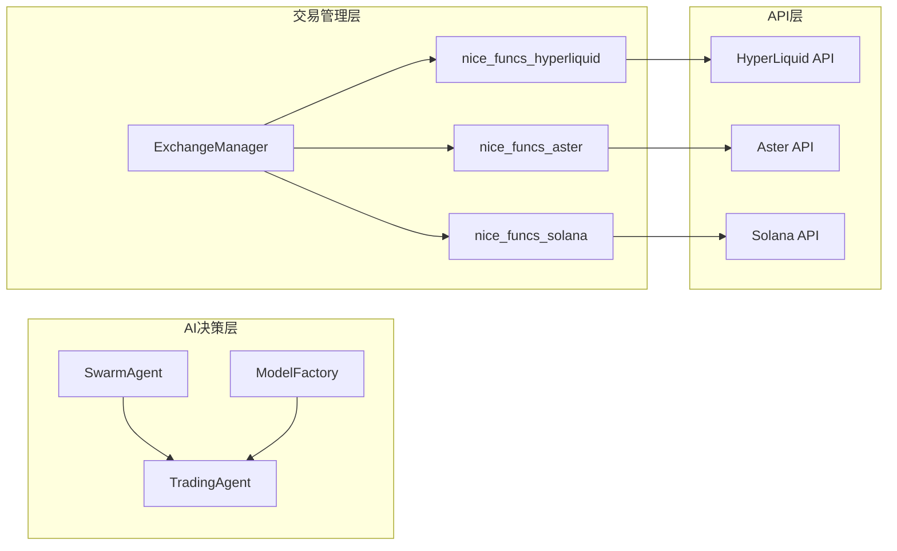
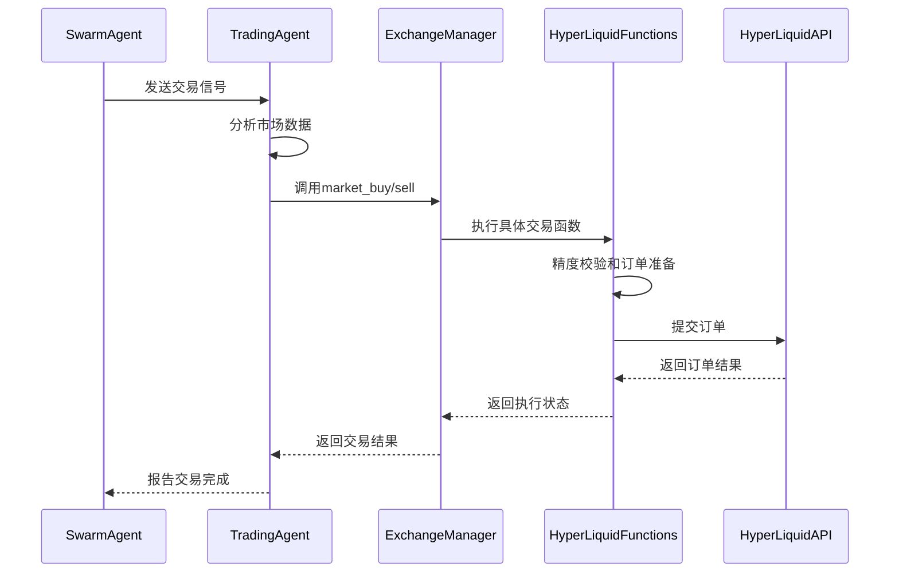
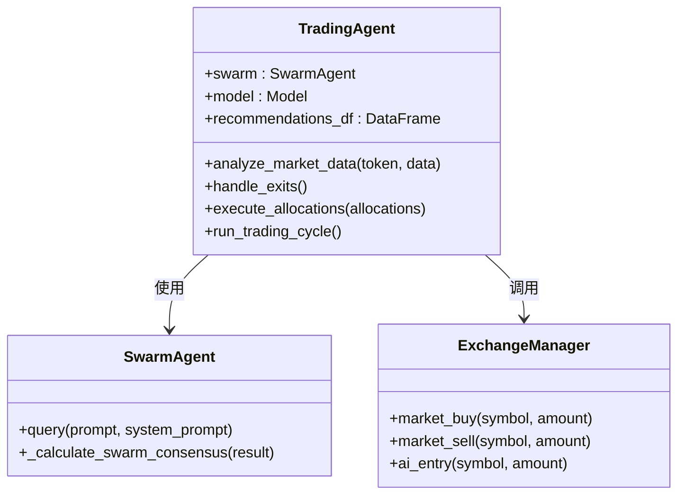
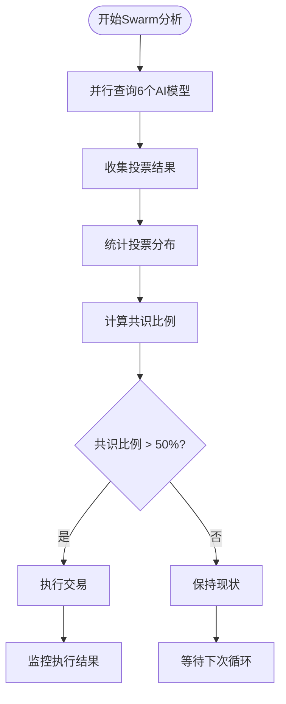

# 基础交易指令

<cite>
**本文档引用的文件**
- [nice_funcs_hyperliquid.py](file://src/nice_funcs_hyperliquid.py)
- [trading_agent.py](file://src/agents/trading_agent.py)
- [exchange_manager.py](file://src/exchange_manager.py)
- [test_hyperliquid_mm.py](file://src/scripts/test_hyperliquid_mm.py)
</cite>

## 目录
1. [简介](#简介)
2. [项目结构概览](#项目结构概览)
3. [核心交易指令](#核心交易指令)
4. [架构概述](#架构概述)
5. [详细组件分析](#详细组件分析)
6. [AI代理集成](#ai代理集成)
7. [性能考虑](#性能考虑)
8. [故障排除指南](#故障排除指南)
9. [结论](#结论)

## 简介

本文档详细解释了Moon Dev AI交易系统中HyperLiquid交易所的基础交易指令实现。该系统提供了完整的限价单和市价单交易功能，支持长仓和短仓操作，并通过AI代理进行智能交易决策。

系统的核心特性包括：
- 精确的价格和数量精度校验
- 模拟市价单执行的overbid/undersell机制
- 强制的最小订单金额（0.1美元）校验
- 完整的订单生命周期管理
- AI驱动的交易决策集成

## 项目结构概览

**图表来源**
- [trading_agent.py](file://src/agents/trading_agent.py#L1-L100)
- [nice_funcs_hyperliquid.py](file://src/nice_funcs_hyperliquid.py#L1-L50)

**章节来源**
- [trading_agent.py](file://src/agents/trading_agent.py#L1-L200)
- [nice_funcs_hyperliquid.py](file://src/nice_funcs_hyperliquid.py#L1-L100)

## 核心交易指令

### limit_order()函数详解

`limit_order()`函数是系统中最基础的交易指令，负责创建限价单并进行严格的精度校验。

#### 功能特性
- **价格精度校验**：根据交易对的精度要求自动调整价格小数位
- **数量精度校验**：确保订单数量符合交易所的最小单位要求
- **订单信息格式化**：提供详细的订单调试信息
- **API调用封装**：统一的HyperLiquid Exchange API接口

#### 实现流程

**图表来源**
- [nice_funcs_hyperliquid.py](file://src/nice_funcs_hyperliquid.py#L240-L280)

#### 关键参数处理
- **symbol**：交易对符号（如BTC、ETH）
- **is_buy**：布尔值，指示买入还是卖出
- **sz**：订单数量
- **limit_px**：限价价格
- **reduce_only**：是否为减仓订单

**章节来源**
- [nice_funcs_hyperliquid.py](file://src/nice_funcs_hyperliquid.py#L240-L280)

### market_buy()函数详解

`market_buy()`函数通过在当前市场买一价上方挂单（overbid）来模拟市价单执行。

#### overbid机制原理
- **价格计算**：当前ask价格 * 1.001（0.1%溢价）
- **精度处理**：根据交易对自动调整价格精度
- **最小订单值校验**：确保订单价值不低于0.1美元
- **IOC订单类型**：立即成交或取消的订单类型

#### 实现细节

**图表来源**
- [nice_funcs_hyperliquid.py](file://src/nice_funcs_hyperliquid.py#L310-L386)

#### 精度处理逻辑
- **BTC交易**：价格四舍五入到整数位
- **其他交易对**：价格四舍五入到小数点后1位
- **数量精度**：根据交易所配置的精度要求

**章节来源**
- [nice_funcs_hyperliquid.py](file://src/nice_funcs_hyperliquid.py#L310-L386)

### market_sell()函数详解

`market_sell()`函数通过在当前市场卖一价下方挂单（undersell）来模拟市价单执行。

#### undersell机制原理
- **价格计算**：当前bid价格 * 0.999（0.1%折价）
- **精度处理**：与market_buy相同的精度规则
- **最小订单值校验**：确保订单价值不低于0.1美元
- **IOC订单类型**：立即成交或取消

#### 最小订单金额强制校验

系统实现了严格的最小订单金额校验逻辑：

**图表来源**
- [nice_funcs_hyperliquid.py](file://src/nice_funcs_hyperliquid.py#L351-L386)

**章节来源**
- [nice_funcs_hyperliquid.py](file://src/nice_funcs_hyperliquid.py#L388-L450)

## 架构概述

### 整体系统架构

**图表来源**
- [trading_agent.py](file://src/agents/trading_agent.py#L200-L300)
- [exchange_manager.py](file://src/exchange_manager.py#L1-L100)

### 交易指令调用流程

**图表来源**
- [trading_agent.py](file://src/agents/trading_agent.py#L900-L1000)
- [exchange_manager.py](file://src/exchange_manager.py#L60-L120)

**章节来源**
- [trading_agent.py](file://src/agents/trading_agent.py#L800-L1200)
- [exchange_manager.py](file://src/exchange_manager.py#L1-L150)

## 详细组件分析

### TradingAgent类分析

TradingAgent类是整个交易系统的核心控制器，负责协调AI决策和实际交易执行。

#### 主要职责
- **市场数据分析**：收集和分析市场数据
- **AI决策处理**：接收并处理AI模型的交易建议
- **仓位管理**：监控和管理持仓
- **风险控制**：实施止损和止盈策略

#### 交易信号处理

**图表来源**
- [trading_agent.py](file://src/agents/trading_agent.py#L600-L700)

#### 仓位计算逻辑

系统根据不同的交易模式计算仓位大小：

| 交易模式 | 计算公式 | 特点 |
|---------|---------|------|
| Aster/HyperLiquid | `账户余额 × 最大仓位% ÷ 杠杆` | 支持杠杆交易 |
| Solana | `USDC余额 × 最大仓位%` | 不支持杠杆 |
| 短仓模式 | `目标仓位 × 杠杆` | 开仓时使用 |

**章节来源**
- [trading_agent.py](file://src/agents/trading_agent.py#L400-L500)

### open_short()函数分析

`open_short()`函数专门用于在支持短仓的交易所上开仓做空。

#### 开仓逻辑
- **价格计算**：使用当前bid价格作为开仓基准
- **数量计算**：基于目标USD金额和当前价格
- **精度处理**：确保数量和价格符合交易所要求
- **保证金计算**：根据杠杆计算所需保证金

#### 错误处理机制
- **异常捕获**：完整的try-except包装
- **日志记录**：详细的错误信息记录
- **回退机制**：失败时的安全处理

**章节来源**
- [nice_funcs_hyperliquid.py](file://src/nice_funcs_hyperliquid.py#L886-L925)

## AI代理集成

### Swarm共识机制

系统采用6模型Swarm共识机制来提高交易决策的可靠性：

**图表来源**
- [trading_agent.py](file://src/agents/trading_agent.py#L700-L800)

### 交易决策流程

AI代理通过以下步骤做出交易决策：

1. **数据收集**：收集OHLCV数据和技术指标
2. **信号分析**：分析技术信号和策略信号
3. **共识投票**：6个AI模型独立投票
4. **决策生成**：基于多数原则生成最终决策
5. **执行交易**：调用相应的交易函数

**章节来源**
- [trading_agent.py](file://src/agents/trading_agent.py#L500-L700)

## 性能考虑

### 并发处理优化

- **Swarm查询并发**：6个AI模型同时查询，减少总响应时间
- **API调用优化**：批量处理多个交易请求
- **缓存机制**：缓存市场数据和账户信息

### 内存管理

- **数据清理**：定期清理临时数据文件
- **对象回收**：及时释放不再需要的对象
- **资源监控**：监控内存使用情况

### 网络优化

- **超时设置**：合理的API调用超时配置
- **重试机制**：自动重试失败的网络请求
- **连接池**：复用HTTP连接减少开销

## 故障排除指南

### 常见问题及解决方案

#### 订单执行失败
- **检查网络连接**：确保API访问正常
- **验证账户权限**：确认账户有足够的余额
- **检查市场状态**：确认交易对处于活跃状态

#### 精度校验错误
- **验证输入参数**：检查价格和数量的格式
- **更新配置**：同步最新的交易所配置
- **日志分析**：查看详细的错误日志

#### AI决策不一致
- **检查模型响应**：验证各个AI模型的输出
- **调整阈值**：修改共识判断的阈值
- **重新训练**：必要时重新训练AI模型

**章节来源**
- [nice_funcs_hyperliquid.py](file://src/nice_funcs_hyperliquid.py#L100-L200)

## 结论

Moon Dev的HyperLiquid集成提供了完整而强大的基础交易指令实现。通过精确的精度校验、智能的overbid/undersell机制、严格的最小订单值校验，以及完善的AI代理集成，系统能够安全可靠地执行各种交易策略。

主要优势包括：
- **高精度交易**：严格的价格和数量精度控制
- **智能执行**：基于市场深度的overbid/undersell策略
- **风险控制**：多重校验和最小订单值保护
- **AI集成**：Swarm共识机制提高决策质量
- **可扩展性**：模块化设计便于功能扩展

该系统为AI驱动的量化交易提供了坚实的基础，支持从简单的买入卖出到复杂的套利策略等多种交易场景。