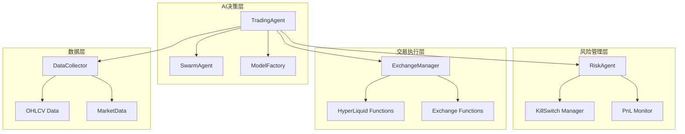
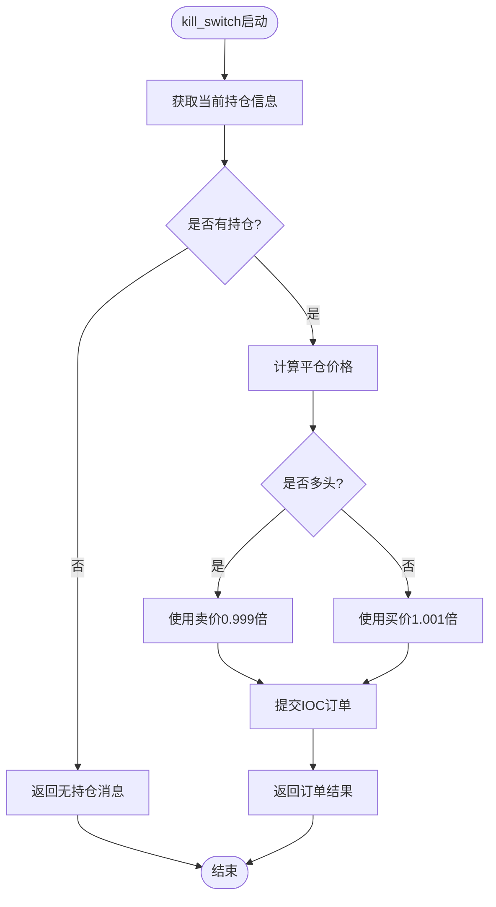
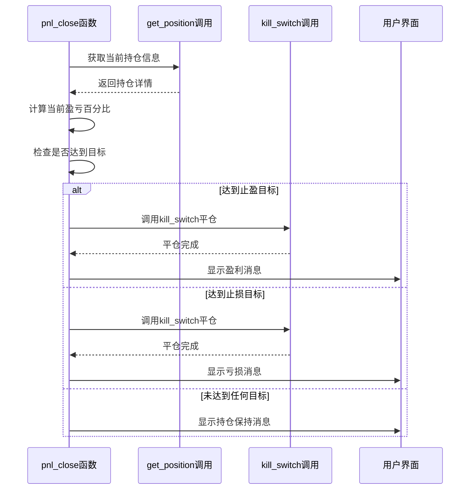
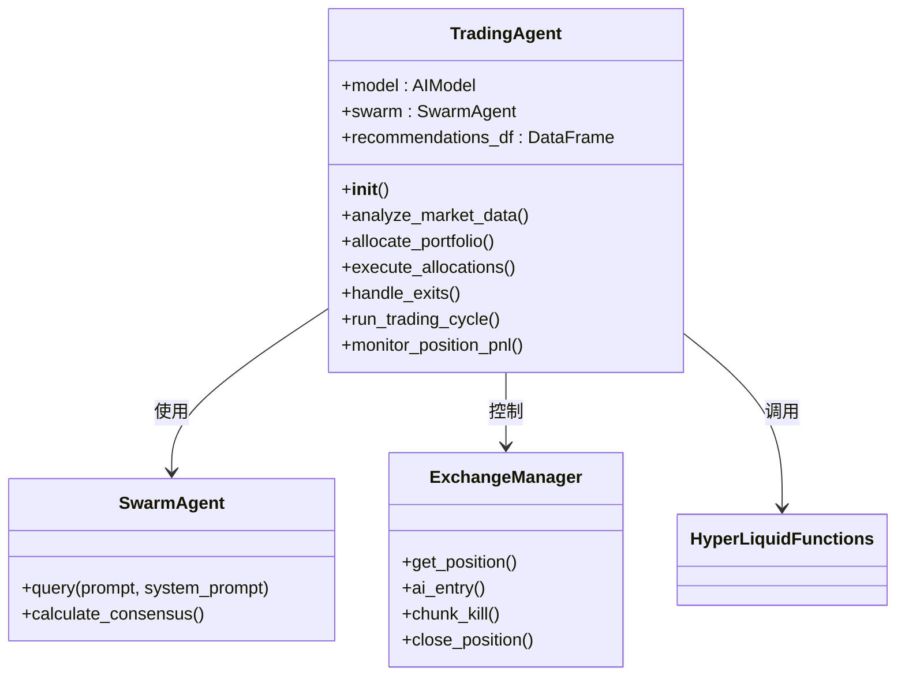
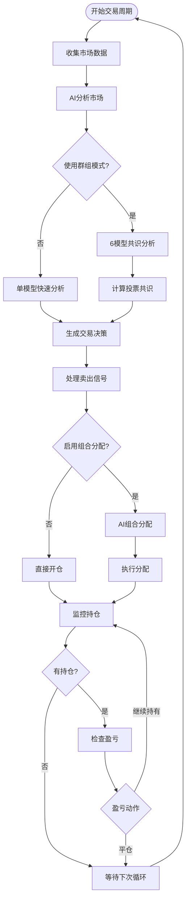
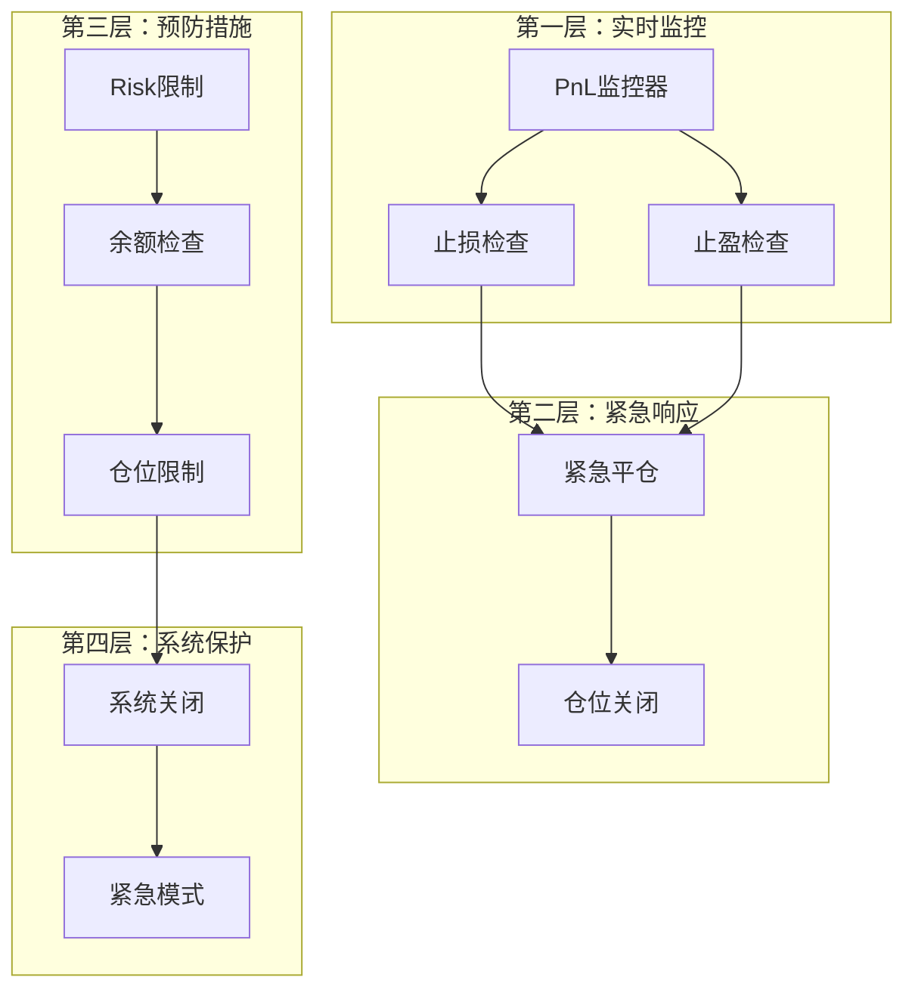
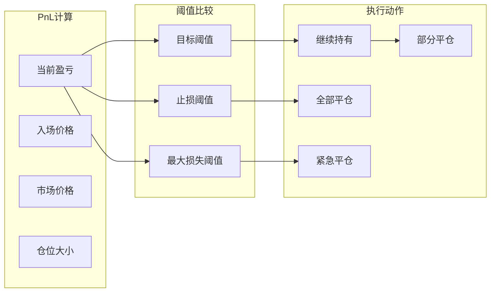

# 高级交易策略

<cite>
**本文档中引用的文件**
- [nice_funcs_hyperliquid.py](file://src/nice_funcs_hyperliquid.py)
- [trading_agent.py](file://src/agents/trading_agent.py)
- [config.py](file://src/config.py)
- [exchange_manager.py](file://src/exchange_manager.py)
- [risk_agent.py](file://src/agents/risk_agent.py)
</cite>

## 目录
1. [简介](#简介)
2. [项目结构概览](#项目结构概览)
3. [核心风险管理函数](#核心风险管理函数)
4. [AI驱动的自动化交易循环](#ai驱动的自动化交易循环)
5. [架构设计与组件关系](#架构设计与组件关系)
6. [风险控制机制详解](#风险控制机制详解)
7. [性能优化与最佳实践](#性能优化与最佳实践)
8. [故障排除指南](#故障排除指南)
9. [总结](#总结)

## 简介

Moon Dev的AI交易系统是一个基于大型语言模型（LLM）的高级交易策略平台，专门针对HyperLiquid加密货币衍生品交易所进行优化。该系统实现了复杂的风险管理功能，包括紧急平仓机制（kill_switch）、动态止盈止损（pnl_close）以及智能仓位管理，为用户提供了一个完整的AI驱动的自动化交易解决方案。

## 项目结构概览

系统采用模块化架构设计，主要包含以下核心组件：



**图表来源**
- [trading_agent.py](file://src/agents/trading_agent.py#L453-L1143)
- [exchange_manager.py](file://src/exchange_manager.py#L97-L231)

**章节来源**
- [trading_agent.py](file://src/agents/trading_agent.py#L1-L100)
- [nice_funcs_hyperliquid.py](file://src/nice_funcs_hyperliquid.py#L1-L50)

## 核心风险管理函数

### kill_switch()函数：紧急平仓机制

kill_switch()函数是系统中最关键的风险管理工具，能够在极端市场条件下立即关闭所有头寸，保护用户资金安全。

#### 函数架构分析



**图表来源**
- [nice_funcs_hyperliquid.py](file://src/nice_funcs_hyperliquid.py#L232-L275)

#### 关键实现细节

1. **持仓检测机制**：通过get_position()函数精确识别当前持仓状态
2. **智能定价策略**：
   - 多头平仓：卖价 * 0.999（超卖确保成交）
   - 空头平仓：买价 * 1.001（超买确保成交）
3. **精度处理**：根据交易对特性调整价格精度（BTC整数，其他小数点后1位）

#### 执行流程详解

kill_switch函数的执行遵循严格的风控原则：

1. **初始化阶段**：建立与HyperLiquid API的连接
2. **持仓验证**：确认存在可平仓头寸
3. **价格计算**：基于市场深度计算最优平仓价格
4. **订单提交**：使用IOC（即时或取消）订单类型确保快速成交
5. **结果确认**：验证订单执行状态

**章节来源**
- [nice_funcs_hyperliquid.py](file://src/nice_funcs_hyperliquid.py#L232-L275)

### pnl_close()函数：动态盈亏监控

pnl_close()函数实现了基于预设阈值的智能平仓逻辑，支持止盈和止损双重保护机制。

#### 功能架构图



**图表来源**
- [nice_funcs_hyperliquid.py](file://src/nice_funcs_hyperliquid.py#L277-L302)
- [nice_funcs_hyperliquid.py](file://src/nice_funcs_hyperliquid.py#L232-L275)

#### 阈值配置与监控

系统支持灵活的止盈止损配置：

| 参数 | 默认值 | 说明 |
|------|--------|------|
| target | 20% | 止盈目标阈值 |
| max_loss | -10% | 止损目标阈值 |
| check_interval | 5秒 | 盈亏检查频率 |

**章节来源**
- [nice_funcs_hyperliquid.py](file://src/nice_funcs_hyperliquid.py#L277-L302)

## AI驱动的自动化交易循环

### TradingAgent类架构

TradingAgent是整个系统的核心控制器，负责协调AI决策、风险管理执行和交易操作。

#### 主要职责模块



**图表来源**
- [trading_agent.py](file://src/agents/trading_agent.py#L453-L1143)

#### 自动化交易循环流程



**图表来源**
- [trading_agent.py](file://src/agents/trading_agent.py#L1070-L1196)

**章节来源**
- [trading_agent.py](file://src/agents/trading_agent.py#L453-L1143)

### Swarm模式与共识决策

系统支持两种运行模式，提供不同级别的决策质量与执行速度：

#### 单模型模式（Fast Execution）
- **响应时间**：约10秒/令牌
- **适用场景**：高频交易策略
- **优势**：快速决策，低延迟

#### 群组模式（Consensus Voting）
- **响应时间**：约45-60秒/令牌
- **模型数量**：6个AI模型同时分析
- **优势**：高置信度决策，降低错误率

**章节来源**
- [trading_agent.py](file://src/agents/trading_agent.py#L453-L550)

## 架构设计与组件关系

### 风险管理层次结构

系统采用分层风险管理架构，确保多层次的安全保护：



**图表来源**
- [trading_agent.py](file://src/agents/trading_agent.py#L320-L380)
- [risk_agent.py](file://src/agents/risk_agent.py#L416-L491)

### 组件间协作关系

各组件通过明确定义的接口进行协作，确保系统的稳定性和可维护性：

| 组件 | 职责 | 依赖关系 |
|------|------|----------|
| TradingAgent | AI决策与执行 | SwarmAgent, ExchangeManager |
| RiskAgent | 风险评估与控制 | kill_switch, pnl_close |
| ExchangeManager | 交易执行 | HyperLiquid Functions |
| DataCollector | 市场数据获取 | OHLCV Data, MarketData |

**章节来源**
- [exchange_manager.py](file://src/exchange_manager.py#L97-L231)

## 风险控制机制详解

### 多维度风险指标

系统实现了全面的风险控制框架，涵盖多个维度的风险指标：

#### 盈亏监控机制



**图表来源**
- [trading_agent.py](file://src/agents/trading_agent.py#L320-L380)

#### 风险参数配置表

| 配置项 | 默认值 | 说明 | 影响范围 |
|--------|--------|------|----------|
| STOP_LOSS_PERCENTAGE | 5.0% | 单笔交易最大亏损比例 | 仓位规模控制 |
| TAKE_PROFIT_PERCENTAGE | 5.0% | 单笔交易最大盈利比例 | 盈利保护 |
| MAX_POSITION_PERCENTAGE | 30% | 单个仓位最大占总资产比例 | 散户风险 |
| CASH_PERCENTAGE | 20% | 最低现金缓冲比例 | 流动性保障 |
| PNL_CHECK_INTERVAL | 5秒 | 盈亏检查频率 | 实时性 |

**章节来源**
- [config.py](file://src/config.py#L40-L60)
- [trading_agent.py](file://src/agents/trading_agent.py#L320-L380)

### 自适应仓位管理

系统实现了智能的仓位管理算法，根据账户状况动态调整仓位规模：

#### 仓位计算公式

对于杠杆交易平台（Aster/HyperLiquid）：
```
仓位规模 = 账户余额 × (最大仓位百分比/100) × 杠杆倍数
```

对于非杠杆平台（Solana）：
```
仓位规模 = 账户余额 × (最大仓位百分比/100)
```

**章节来源**
- [trading_agent.py](file://src/agents/trading_agent.py#L650-L700)

## 性能优化与最佳实践

### 执行效率优化

系统采用了多种优化策略提升执行效率：

#### 并发处理机制
- **批量数据处理**：一次性获取多个交易对的数据
- **异步订单提交**：避免阻塞式等待订单确认
- **缓存机制**：缓存频繁访问的市场数据

#### 内存管理优化
- **数据清理**：定期清理临时文件和历史数据
- **对象池**：重用AI模型实例减少初始化开销
- **垃圾回收**：及时释放不再使用的资源

### 安全性最佳实践

#### 访问控制
- **私钥保护**：环境变量存储，避免硬编码
- **API限流**：遵守交易所API调用频率限制
- **异常处理**：完善的错误捕获和恢复机制

#### 数据安全
- **加密传输**：所有API通信使用HTTPS
- **数据备份**：重要配置和历史记录定期备份
- **审计日志**：记录所有关键操作和系统事件

**章节来源**
- [trading_agent.py](file://src/agents/trading_agent.py#L1070-L1196)

## 故障排除指南

### 常见问题诊断

#### 仓位无法平仓
**症状**：kill_switch调用后仓位仍然存在
**可能原因**：
1. 市场流动性不足
2. 订单被交易所拒绝
3. API连接问题

**解决方案**：
1. 检查市场深度和流动性
2. 验证API密钥权限
3. 查看错误日志详细信息

#### AI决策不准确
**症状**：AI给出的交易建议与预期不符
**可能原因**：
1. 市场数据质量问题
2. 模型配置不当
3. 历史数据不足

**解决方案**：
1. 检查数据收集完整性
2. 调整AI模型参数
3. 增加训练数据量

#### 风险控制失效
**症状**：超出预设风险限额但未触发保护机制
**可能原因**：
1. 风险监控频率过低
2. 阈值设置不合理
3. 系统时钟同步问题

**解决方案**：
1. 降低监控间隔
2. 重新评估风险参数
3. 同步系统时间

**章节来源**
- [trading_agent.py](file://src/agents/trading_agent.py#L320-L380)
- [nice_funcs_hyperliquid.py](file://src/nice_funcs_hyperliquid.py#L232-L302)

## 总结

Moon Dev的HyperLiquid集成高级交易策略系统代表了AI驱动交易领域的前沿技术。通过kill_switch()和pnl_close()等核心风险管理功能，系统实现了全天候的智能风险控制，确保用户资金安全。结合TradingAgent类的AI决策能力和自动化交易循环，为用户提供了一个完整、可靠、高效的交易解决方案。

系统的主要优势包括：
- **多重风险保护**：从实时监控到紧急平仓的全方位风险控制
- **智能决策支持**：基于6模型共识的高质量交易决策
- **灵活配置选项**：支持多种交易策略和风险参数调整
- **高度自动化**：无需人工干预的完整交易生命周期管理

随着AI技术的不断发展和市场环境的变化，该系统将继续演进，为用户提供更加智能和安全的交易体验。