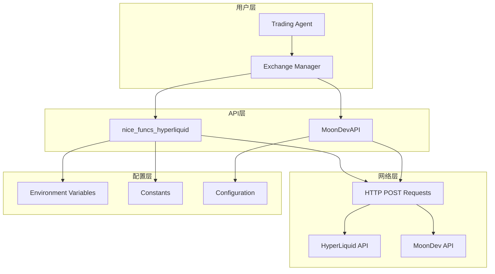
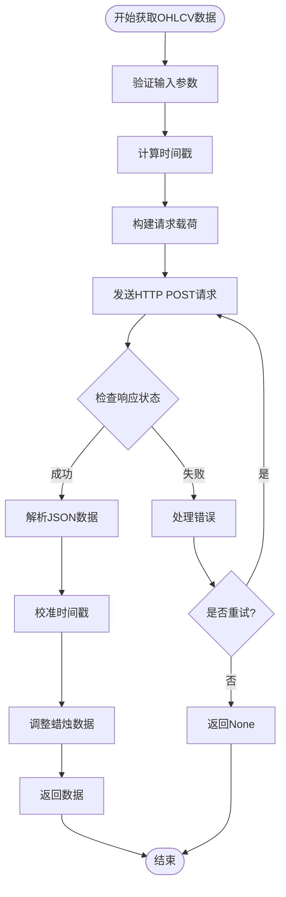
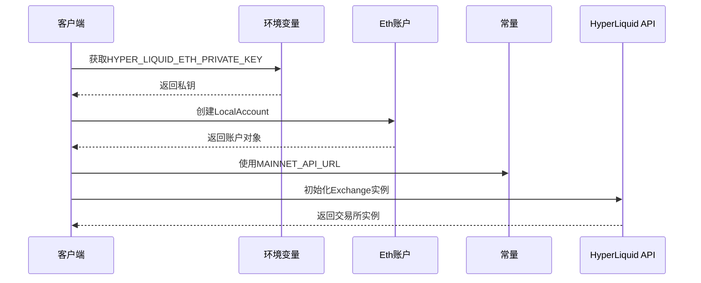
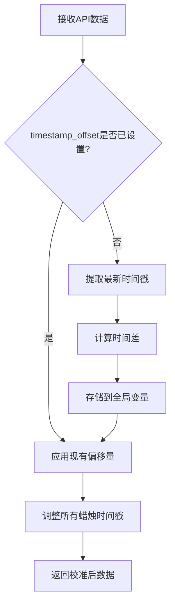
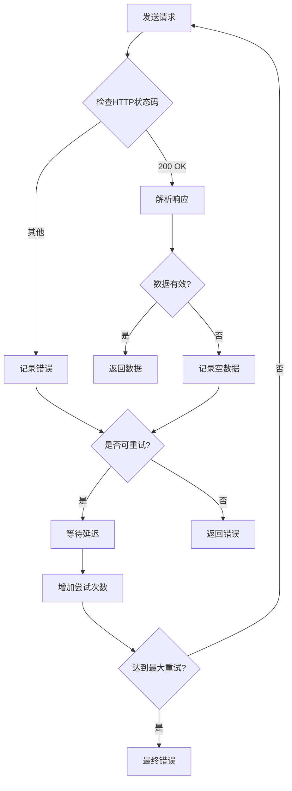
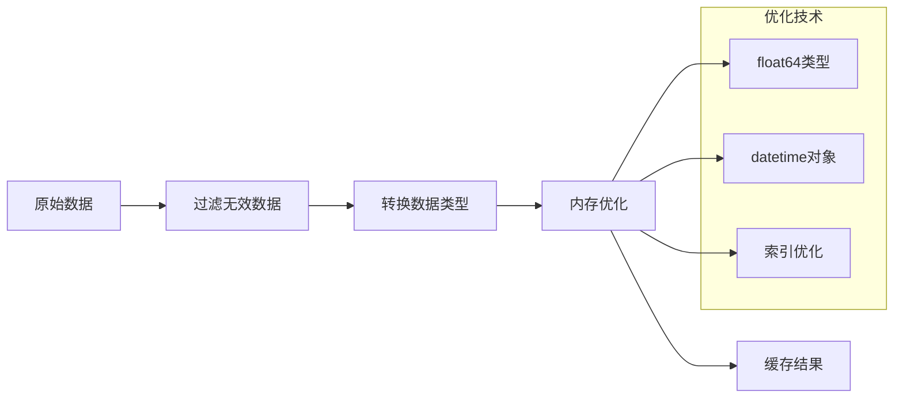
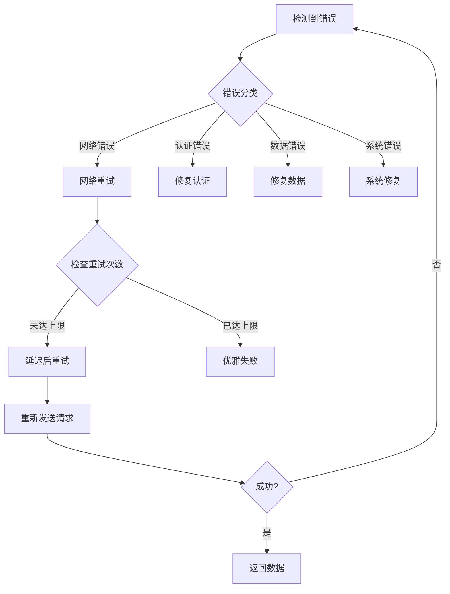

# HyperLiquid API交互机制详细文档

<cite>
**本文档引用的文件**
- [nice_funcs_hyperliquid.py](file://src/nice_funcs_hyperliquid.py)
- [api.py](file://src/agents/api.py)
- [exchange_manager.py](file://src/exchange_manager.py)
- [test_liquidations_api.py](file://src/scripts/test_liquidations_api.py)
- [test_hyperliquid_mm.py](file://src/scripts/test_hyperliquid_mm.py)
- [trading_agent.py](file://src/agents/trading_agent.py)
</cite>

## 目录
1. [简介](#简介)
2. [项目架构概览](#项目架构概览)
3. [_get_ohlcv()函数详解](#_get_ohlcv函数详解)
4. [API客户端初始化](#api客户端初始化)
5. [时间戳校准机制](#时间戳校准机制)
6. [请求重试与错误处理](#请求重试与错误处理)
7. [实际使用示例](#实际使用示例)
8. [性能优化策略](#性能优化策略)
9. [故障排除指南](#故障排除指南)
10. [总结](#总结)

## 简介

Moon Dev的HyperLiquid API交互机制是一个专为去中心化衍生品交易平台设计的综合交易框架。该系统提供了完整的OHLCV数据获取、订单执行、仓位管理和风险控制功能，支持实时市场数据获取和自动化交易策略执行。

核心特性包括：
- 基于candleSnapshot的高效OHLCV数据获取
- 智能的时间戳校准机制
- 完善的错误处理和重试策略
- 多种交易模式支持（单模型/共识模式）
- 统一的交易所接口管理

## 项目架构概览



**图表来源**
- [exchange_manager.py](file://src/exchange_manager.py#L1-L50)
- [nice_funcs_hyperliquid.py](file://src/nice_funcs_hyperliquid.py#L1-L100)

**章节来源**
- [exchange_manager.py](file://src/exchange_manager.py#L1-L100)
- [nice_funcs_hyperliquid.py](file://src/nice_funcs_hyperliquid.py#L1-L150)

## _get_ohlcv()函数详解

### 函数签名与参数

_get_ohlcv()函数是HyperLiquid API交互的核心组件，负责从交易所获取OHLCV（开盘价、最高价、最低价、收盘价、成交量）数据。



**图表来源**
- [nice_funcs_hyperliquid.py](file://src/nice_funcs_hyperliquid.py#L465-L554)

### 请求参数构造

函数接收以下关键参数：

| 参数名 | 类型 | 描述 | 默认值 |
|--------|------|------|--------|
| symbol | str | 交易对符号（如'BTC', 'ETH'） | 必需 |
| interval | str | 时间周期（如'15m', '1H', '1D'） | 必需 |
| start_time | datetime | 开始时间戳 | 必需 |
| end_time | datetime | 结束时间戳 | 必需 |
| batch_size | int | 批次大小限制 | BATCH_SIZE |

### candleSnapshot请求载荷

函数构建的标准请求载荷结构如下：

```json
{
    "type": "candleSnapshot",
    "req": {
        "coin": "BTC",
        "interval": "15m",
        "startTime": 1640995200000,
        "endTime": 1641081600000,
        "limit": 5000
    }
}
```

**章节来源**
- [nice_funcs_hyperliquid.py](file://src/nice_funcs_hyperliquid.py#L465-L500)

## API客户端初始化

### _get_exchange()函数

该函数负责创建HyperLiquid交易所实例，建立与API服务器的安全连接。



**图表来源**
- [nice_funcs_hyperliquid.py](file://src/nice_funcs_hyperliquid.py#L442-L448)

### _get_info()函数

用于获取市场信息和元数据的辅助函数。

**章节来源**
- [nice_funcs_hyperliquid.py](file://src/nice_funcs_hyperliquid.py#L442-L452)

## 时间戳校准机制

### timestamp_offset原理

系统实现了智能的时间戳校准机制，确保本地时间与API服务器时间的一致性。



**图表来源**
- [nice_funcs_hyperliquid.py](file://src/nice_funcs_hyperliquid.py#L502-L521)

### 校准过程详解

1. **首次校准时**：系统比较API返回的最新时间戳与当前系统时间
2. **偏移量计算**：`timestamp_offset = API时间戳 - 系统时间`
3. **后续应用**：对每个蜡烛数据的时间戳应用相同的偏移量
4. **精度保持**：使用毫秒级精度确保时间同步的准确性

**章节来源**
- [nice_funcs_hyperliquid.py](file://src/nice_funcs_hyperliquid.py#L502-L521)

## 请求重试与错误处理

### 重试策略

系统实现了完善的重试机制，包含指数退避算法和详细的错误分类。



**图表来源**
- [nice_funcs_hyperliquid.py](file://src/nice_funcs_hyperliquid.py#L490-L554)

### 错误处理层次

| 错误类型 | 处理策略 | 重试次数 | 延迟策略 |
|----------|----------|----------|----------|
| 网络超时 | 重试 | 3次 | 固定1秒 |
| HTTP错误 | 记录并重试 | 3次 | 固定1秒 |
| 解析错误 | 记录并继续 | 3次 | 固定1秒 |
| 资源不足 | 立即失败 | 0次 | 不适用 |

### 异常处理机制

系统捕获多种异常类型并提供相应的处理策略：

1. **requests.exceptions.RequestException**：网络连接问题
2. **ValueError**：无效的环境变量或参数
3. **Exception**：未知异常，记录完整堆栈跟踪

**章节来源**
- [nice_funcs_hyperliquid.py](file://src/nice_funcs_hyperliquid.py#L523-L554)

## 实际使用示例

### 基本OHLCV数据获取

以下是获取比特币15分钟K线数据的实际使用示例：

```python
# 示例：获取最近60天的BTC 15分钟K线数据
from datetime import datetime, timedelta
import nice_funcs_hyperliquid as hl

# 设置时间范围
end_time = datetime.utcnow()
start_time = end_time - timedelta(days=60)

# 获取数据
btc_data = hl._get_ohlcv(
    symbol='BTC',
    interval='15m',
    start_time=start_time,
    end_time=end_time,
    batch_size=5000
)

# 数据处理
if btc_data:
    df = hl._process_data_to_df(btc_data)
    df = hl.add_technical_indicators(df)
```

### 交易机器人集成

在Trading Agent中集成HyperLiquid API的典型用法：

```python
# 在交易代理中使用
from src.exchange_manager import ExchangeManager

# 初始化交易所管理器
em = ExchangeManager(exchange='HYPERLIQUID')

# 获取市场数据
data = em.get_data('BTC', days_back=3, timeframe='1H')

# 执行交易决策
if USE_SWARM_MODE:
    # 使用共识模式
    decision = agent.swarm_consensus(data)
else:
    # 使用单模型模式
    decision = agent.single_model_decision(data)
```

**章节来源**
- [trading_agent.py](file://src/agents/trading_agent.py#L1-L200)
- [test_hyperliquid_mm.py](file://src/scripts/test_hyperliquid_mm.py#L1-L100)

## 性能优化策略

### 批量数据处理

系统采用多种策略优化性能：

1. **批次大小优化**：默认5000条记录，符合API限制
2. **内存管理**：及时释放大型DataFrame
3. **并发处理**：支持多符号并行获取
4. **缓存机制**：重复数据请求的智能缓存

### 网络优化

- **连接复用**：使用requests.Session()保持连接
- **超时设置**：10秒请求超时，避免长时间阻塞
- **压缩传输**：支持gzip压缩减少带宽使用

### 内存优化



**图表来源**
- [nice_funcs_hyperliquid.py](file://src/nice_funcs_hyperliquid.py#L556-L600)

**章节来源**
- [nice_funcs_hyperliquid.py](file://src/nice_funcs_hyperliquid.py#L556-L650)

## 故障排除指南

### 常见问题及解决方案

| 问题描述 | 可能原因 | 解决方案 |
|----------|----------|----------|
| API密钥错误 | 环境变量未设置 | 检查HYPER_LIQUID_ETH_PRIVATE_KEY |
| 请求超时 | 网络连接问题 | 增加超时时间或检查网络 |
| 数据为空 | 时间范围过大 | 减小时间范围或增加批次大小 |
| 时间戳不匹配 | 系统时间不同步 | 等待自动校准或手动调整 |
| 权限错误 | API密钥权限不足 | 检查密钥权限设置 |

### 调试技巧

1. **启用详细日志**：观察请求和响应详情
2. **检查环境变量**：确认所有必需的环境变量已正确设置
3. **验证网络连接**：确保能够访问HyperLiquid API端点
4. **监控资源使用**：检查内存和CPU使用情况

### 错误恢复流程



**图表来源**
- [nice_funcs_hyperliquid.py](file://src/nice_funcs_hyperliquid.py#L523-L554)

**章节来源**
- [nice_funcs_hyperliquid.py](file://src/nice_funcs_hyperliquid.py#L523-L554)

## 总结

Moon Dev的HyperLiquid API交互机制提供了一个完整、可靠的去中心化衍生品交易平台集成方案。通过精心设计的架构和完善的错误处理机制，该系统能够：

- **高效获取市场数据**：通过candleSnapshot API实现快速OHLCV数据获取
- **智能时间同步**：自动校准系统时钟与API服务器时钟差异
- **健壮的错误处理**：多重重试机制和全面的异常捕获
- **灵活的配置选项**：支持多种交易模式和参数定制
- **优秀的性能表现**：优化的数据处理和网络通信

该系统特别适合需要实时市场数据和自动化交易策略的开发者和交易者，为构建高级量化交易系统提供了坚实的基础。