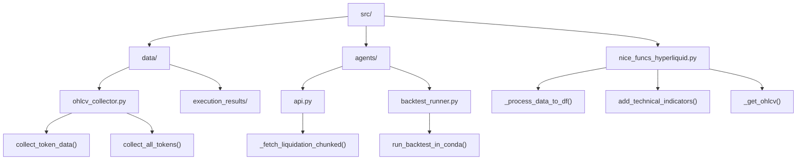
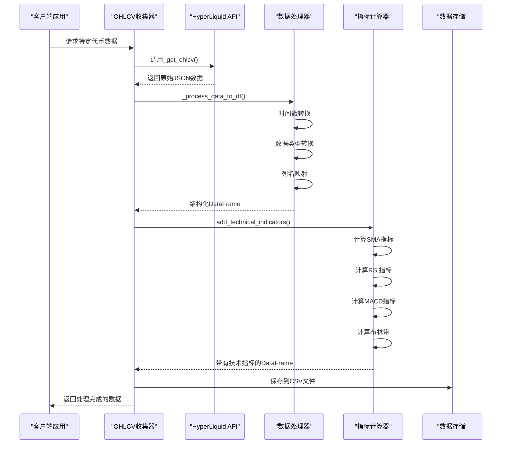
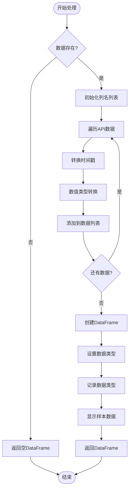
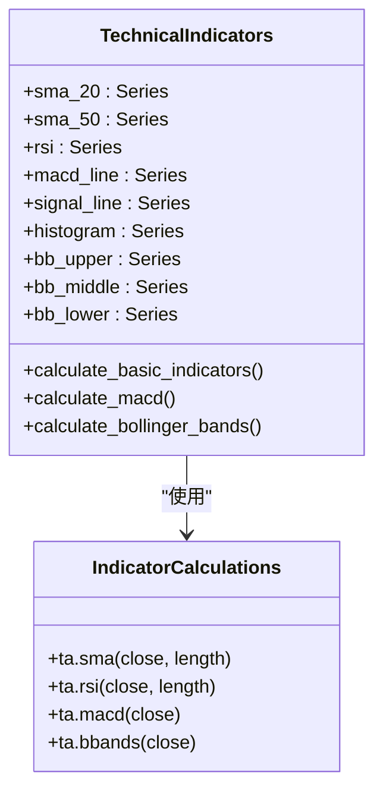
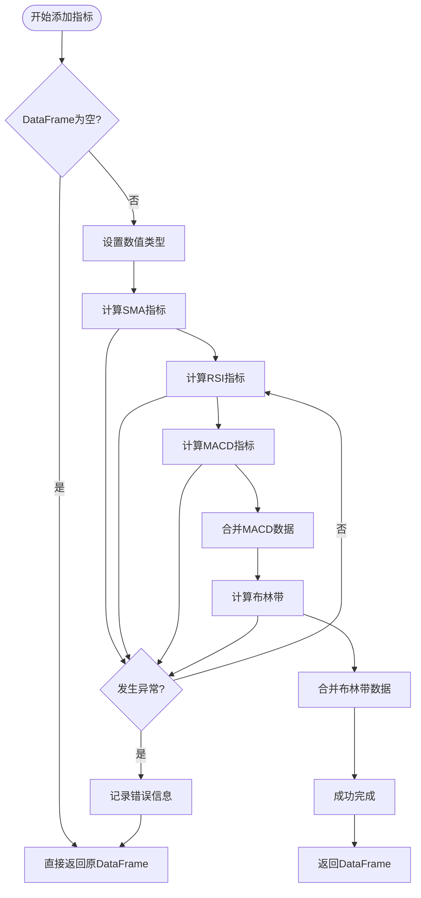
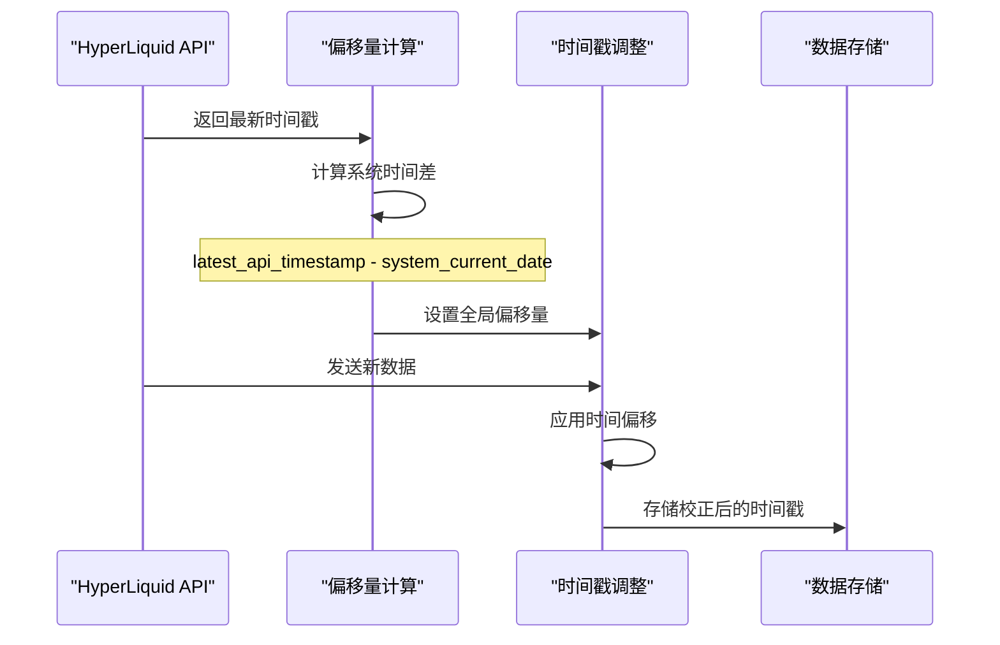
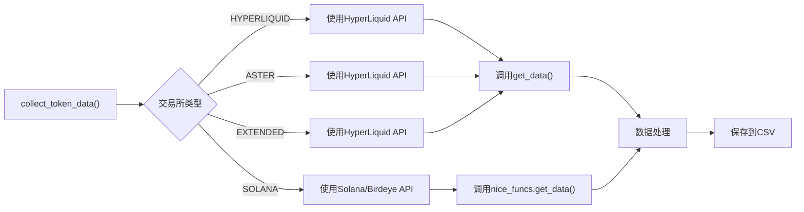
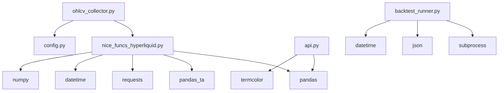

# 数据处理

<cite>
**本文档中引用的文件**
- [nice_funcs_hyperliquid.py](file://src/nice_funcs_hyperliquid.py)
- [ohlcv_collector.py](file://src/data/ohlcv_collector.py)
- [config.py](file://src/config.py)
- [backtest_runner.py](file://src/agents/backtest_runner.py)
- [api.py](file://src/agents/api.py)
</cite>

## 目录
1. [简介](#简介)
2. [项目结构](#项目结构)
3. [核心组件](#核心组件)
4. [架构概览](#架构概览)
5. [详细组件分析](#详细组件分析)
6. [依赖关系分析](#依赖关系分析)
7. [性能考虑](#性能考虑)
8. [故障排除指南](#故障排除指南)
9. [结论](#结论)

## 简介

Moon Dev AI交易系统采用了一套完整而精密的数据处理流水线，专门设计用于从HyperLiquid API获取原始市场数据，并将其转换为结构化、可分析的格式。该系统的核心优势在于其自动化程度高、处理效率优异以及具备强大的技术指标计算能力。

本文档深入探讨了从HyperLiquid API获取原始数据后的处理流程，重点关注两个关键函数：`_process_data_to_df()`和`add_technical_indicators()`，以及相关的数据预处理步骤。

## 项目结构

Moon Dev AI交易系统的数据处理模块主要分布在以下目录结构中：

**图表来源**
- [nice_funcs_hyperliquid.py](file://src/nice_funcs_hyperliquid.py#L1-L925)
- [ohlcv_collector.py](file://src/data/ohlcv_collector.py#L1-L129)

**章节来源**
- [nice_funcs_hyperliquid.py](file://src/nice_funcs_hyperliquid.py#L1-L50)
- [ohlcv_collector.py](file://src/data/ohlcv_collector.py#L1-L30)

## 核心组件

### 数据获取层
系统通过多个专用函数从HyperLiquid API获取原始数据，包括OHLCV蜡烛图数据、资金费率数据和市场信息。

### 数据转换层
核心的数据转换功能由两个主要函数组成：
- `_process_data_to_df()`：负责将API返回的JSON格式数据转换为结构化的Pandas DataFrame
- `add_technical_indicators()`：利用pandas-ta库添加多种技术指标

### 数据存储层
提供灵活的数据保存机制，支持临时缓存和永久存储两种模式。

**章节来源**
- [nice_funcs_hyperliquid.py](file://src/nice_funcs_hyperliquid.py#L461-L500)
- [nice_funcs_hyperliquid.py](file://src/nice_funcs_hyperliquid.py#L556-L618)

## 架构概览

整个数据处理系统采用分层架构设计，确保了模块化、可扩展性和维护性：

**图表来源**
- [ohlcv_collector.py](file://src/data/ohlcv_collector.py#L15-L80)
- [nice_funcs_hyperliquid.py](file://src/nice_funcs_hyperliquid.py#L556-L618)

## 详细组件分析

### _process_data_to_df() 函数分析

`_process_data_to_df()`函数是数据处理流水线的第一个关键环节，负责将API返回的原始JSON数据转换为结构化的Pandas DataFrame。

#### 功能特性
- **时间戳精确转换**：将API返回的毫秒级时间戳转换为Python datetime对象
- **数据类型标准化**：确保所有数值列为float64类型以保证精度
- **列名规范化**：使用标准的OHLCV命名约定
- **错误处理**：优雅处理空数据和格式错误

#### 数据流处理

**图表来源**
- [nice_funcs_hyperliquid.py](file://src/nice_funcs_hyperliquid.py#L556-L585)

#### 关键实现细节

该函数采用逐行处理的方式，确保内存效率和处理速度：

1. **时间戳处理**：使用`datetime.datetime.utcfromtimestamp()`进行精确的时间戳转换
2. **类型安全转换**：对每个数值字段都进行显式的float转换
3. **数据验证**：在创建DataFrame前确保数据完整性

**章节来源**
- [nice_funcs_hyperliquid.py](file://src/nice_funcs_hyperliquid.py#L556-L585)

### add_technical_indicators() 函数分析

`add_technical_indicators()`函数负责为市场数据添加多种技术分析指标，这些指标是量化交易策略的基础。

#### 技术指标体系

**图表来源**
- [nice_funcs_hyperliquid.py](file://src/nice_funcs_hyperliquid.py#L587-L618)

#### 指标计算详解

##### 简单移动平均线 (SMA)
- **20周期SMA**：短期趋势跟踪，用于识别短期趋势方向
- **50周期SMA**：中期趋势确认，常用于判断主要趋势

##### 相对强弱指数 (RSI)
- **14周期RSI**：超买超卖信号，通常阈值为30（超卖）和70（超买）

##### 指数移动平均线 (EMA) 和 MACD
- **MACD指标**：包含三条线：MACD线、信号线和柱状图
- **计算方法**：基于指数加权移动平均线的差值

##### 布林带 (Bollinger Bands)
- **上轨**：价格的标准差上界
- **中轨**：简单移动平均线
- **下轨**：价格的标准差下界
- **标准差倍数**：默认2倍标准差

#### 错误处理机制

**图表来源**
- [nice_funcs_hyperliquid.py](file://src/nice_funcs_hyperliquid.py#L587-L618)

**章节来源**
- [nice_funcs_hyperliquid.py](file://src/nice_funcs_hyperliquid.py#L587-L618)

### 数据预处理流程

#### 时间戳调整机制

系统实现了智能的时间戳调整功能，确保API数据与本地系统时间同步：

**图表来源**
- [nice_funcs_hyperliquid.py](file://src/nice_funcs_hyperliquid.py#L502-L521)

#### 数据完整性检查

系统在多个层面实施数据完整性检查：

1. **API响应验证**：检查HTTP状态码和响应内容
2. **数据类型验证**：确保数值字段正确转换
3. **时间序列完整性**：验证时间戳的连续性和顺序

**章节来源**
- [nice_funcs_hyperliquid.py](file://src/nice_funcs_hyperliquid.py#L502-L521)

### 数据收集器分析

#### 多交易所支持

`ohlcv_collector.py`提供了统一的接口来收集来自不同交易所的数据：

**图表来源**
- [ohlcv_collector.py](file://src/data/ohlcv_collector.py#L15-L80)

#### 批量数据收集

系统支持批量收集多个代币的数据，提高了效率并减少了API调用次数：

- **并发处理**：可以同时处理多个代币
- **错误恢复**：单个代币失败不影响其他代币的处理
- **进度跟踪**：提供详细的处理进度信息

**章节来源**
- [ohlcv_collector.py](file://src/data/ohlcv_collector.py#L82-L129)

## 依赖关系分析

### 核心依赖关系

**图表来源**
- [nice_funcs_hyperliquid.py](file://src/nice_funcs_hyperliquid.py#L1-L30)
- [ohlcv_collector.py](file://src/data/ohlcv_collector.py#L1-L15)

### 版本兼容性

系统对依赖库版本有明确要求：
- **pandas**: ≥1.0.0（支持现代DataFrame操作）
- **pandas_ta**: 最新稳定版（提供丰富的技术指标）
- **requests**: ≥2.25.0（支持现代HTTP功能）

**章节来源**
- [nice_funcs_hyperliquid.py](file://src/nice_funcs_hyperliquid.py#L1-L30)

## 性能考虑

### 内存优化策略

1. **流式处理**：对于大量数据，采用分批处理方式
2. **类型优化**：使用float64确保精度的同时保持内存效率
3. **及时释放**：处理完成后及时清理不需要的数据

### 并发处理能力

- **多代币并行**：支持同时处理多个代币的数据
- **异步API调用**：减少等待时间提高整体效率
- **缓存机制**：避免重复下载相同数据

### 可扩展性设计

系统设计考虑了未来的扩展需求：
- **插件化指标**：易于添加新的技术指标
- **配置驱动**：通过配置文件控制行为
- **模块化架构**：便于功能扩展和维护

## 故障排除指南

### 常见问题及解决方案

#### API连接问题
- **症状**：无法从HyperLiquid获取数据
- **原因**：网络连接或API限制
- **解决方案**：检查网络连接，增加重试次数

#### 数据类型错误
- **症状**：数值计算出现异常
- **原因**：数据类型未正确转换
- **解决方案**：检查`_process_data_to_df()`函数的类型转换逻辑

#### 技术指标计算失败
- **症状**：指标列缺失或包含NaN值
- **原因**：输入数据不足或格式不正确
- **解决方案**：验证输入数据的完整性和长度

**章节来源**
- [nice_funcs_hyperliquid.py](file://src/nice_funcs_hyperliquid.py#L587-L618)

### 调试技巧

1. **启用详细日志**：观察每一步的处理结果
2. **数据验证**：定期检查数据质量和完整性
3. **性能监控**：跟踪处理时间和内存使用情况

## 结论

Moon Dev AI交易系统的数据处理模块展现了高度的专业性和可靠性。通过精心设计的流水线，系统能够高效地处理来自HyperLiquid API的原始数据，并将其转换为适合量化交易分析的结构化格式。

### 主要优势

1. **自动化程度高**：从数据获取到指标计算完全自动化
2. **准确性保证**：多重验证机制确保数据质量
3. **扩展性强**：模块化设计支持未来功能扩展
4. **性能优异**：优化的算法和数据结构确保高效处理

### 应用价值

该数据处理系统为量化交易策略的开发和回测提供了坚实的基础，使得交易者能够基于高质量的数据进行科学的决策制定。通过集成多种技术指标和提供灵活的数据访问接口，系统大大提升了交易策略开发的效率和效果。