# 数据获取

<cite>
**本文档中引用的文件**
- [nice_funcs_hyperliquid.py](file://src/nice_funcs_hyperliquid.py)
- [ohlcv_collector.py](file://src/data/ohlcv_collector.py)
- [exchange_manager.py](file://src/exchange_manager.py)
- [config.py](file://src/config.py)
- [test_hyperliquid_mm.py](file://src/scripts/test_hyperliquid_mm.py)
</cite>

## 目录
1. [简介](#简介)
2. [项目结构](#项目结构)
3. [核心组件](#核心组件)
4. [架构概览](#架构概览)
5. [详细组件分析](#详细组件分析)
6. [依赖关系分析](#依赖关系分析)
7. [性能考虑](#性能考虑)
8. [故障排除指南](#故障排除指南)
9. [结论](#结论)

## 简介

Moon Dev的HyperLiquid API数据获取系统是一个全面的市场数据收集和处理框架，专门设计用于从HyperLiquid衍生品交易所获取OHLCV（开盘价、最高价、最低价、收盘价、成交量）数据。该系统提供了从底层API请求到高级数据分析的完整解决方案，支持技术指标计算、时间戳校准和重试机制。

## 项目结构

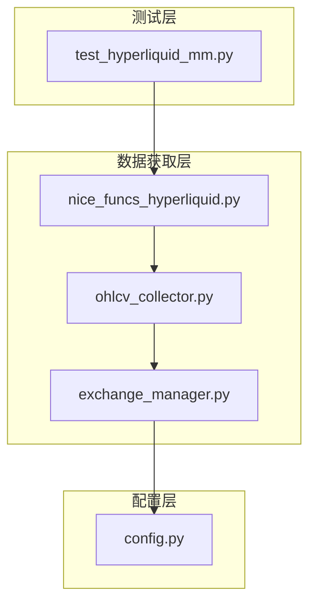

**图表来源**
- [nice_funcs_hyperliquid.py](file://src/nice_funcs_hyperliquid.py#L1-L50)
- [ohlcv_collector.py](file://src/data/ohlcv_collector.py#L1-L30)
- [exchange_manager.py](file://src/exchange_manager.py#L1-L40)

**章节来源**
- [nice_funcs_hyperliquid.py](file://src/nice_funcs_hyperliquid.py#L1-L100)
- [ohlcv_collector.py](file://src/data/ohlcv_collector.py#L1-L50)

## 核心组件

### 主要数据获取函数

系统的核心是三个主要的数据获取函数：

1. **_get_ohlcv()** - 内部API请求函数
2. **get_data()** - 高级接口函数  
3. **_get_info() 和 _get_exchange()** - 辅助初始化函数

### 常量配置

系统使用以下关键常量：
- `BATCH_SIZE = 5000` - 最大批量大小限制
- `MAX_RETRIES = 3` - 最大重试次数
- `BASE_URL = 'https://api.hyperliquid.xyz/info'` - API基础URL

**章节来源**
- [nice_funcs_hyperliquid.py](file://src/nice_funcs_hyperliquid.py#L31-L40)

## 架构概览

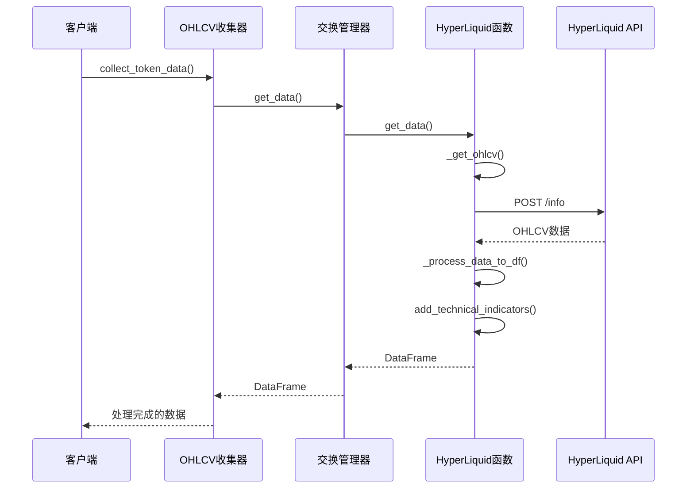

**图表来源**
- [ohlcv_collector.py](file://src/data/ohlcv_collector.py#L45-L65)
- [exchange_manager.py](file://src/exchange_manager.py#L319-L337)
- [nice_funcs_hyperliquid.py](file://src/nice_funcs_hyperliquid.py#L620-L670)

## 详细组件分析

### _get_ohlcv() 内部函数

_get_ohlcv()是系统的核心API请求函数，负责构建candleSnapshot请求并处理响应。

#### 请求构建流程

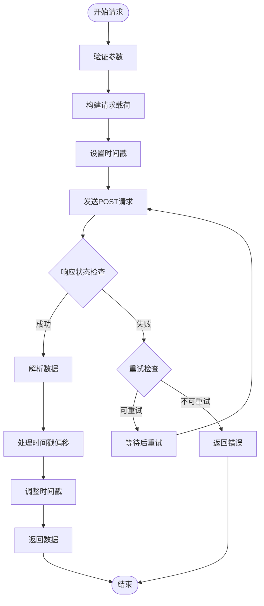

**图表来源**
- [nice_funcs_hyperliquid.py](file://src/nice_funcs_hyperliquid.py#L465-L554)

#### 时间戳偏移处理

系统实现了智能的时间戳校准机制：

1. **偏移计算**：首次运行时自动计算API服务器与系统时钟的差异
2. **动态调整**：后续请求使用计算的偏移值进行时间戳修正
3. **精度保证**：确保数据时间戳与系统时间同步

#### 重试机制

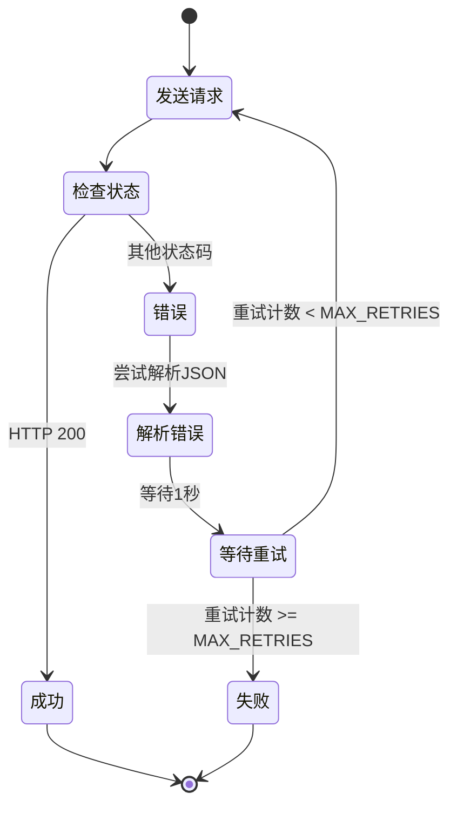

**图表来源**
- [nice_funcs_hyperliquid.py](file://src/nice_funcs_hyperliquid.py#L490-L554)

**章节来源**
- [nice_funcs_hyperliquid.py](file://src/nice_funcs_hyperliquid.py#L465-L554)

### get_data() 高层接口

get_data()函数作为用户友好的数据获取接口，协调整个数据获取流程。

#### 函数工作流程

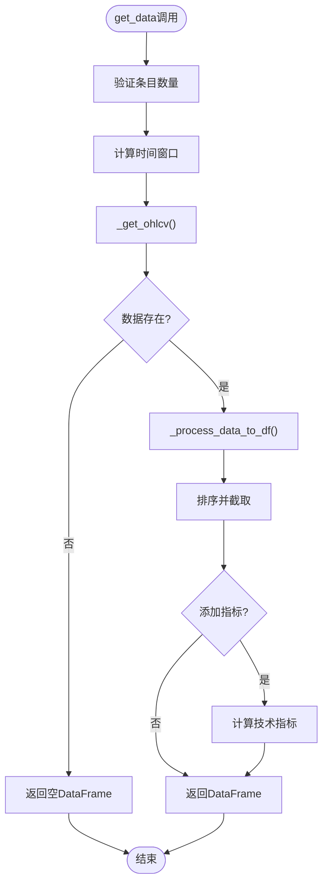

**图表来源**
- [nice_funcs_hyperliquid.py](file://src/nice_funcs_hyperliquid.py#L620-L670)

#### 技术指标集成

系统自动添加多种技术指标：

| 指标类型 | 参数配置 | 用途 |
|---------|---------|------|
| SMA | 20日, 50日 | 趋势分析 |
| RSI | 14日周期 | 超买超卖判断 |
| MACD | 标准参数 | 动量分析 |
| 布林带 | 20日周期, 2倍标准差 | 波动性分析 |

**章节来源**
- [nice_funcs_hyperliquid.py](file://src/nice_funcs_hyperliquid.py#L620-L670)

### 辅助函数分析

#### _get_info() 和 _get_exchange()

这两个辅助函数负责初始化API客户端：

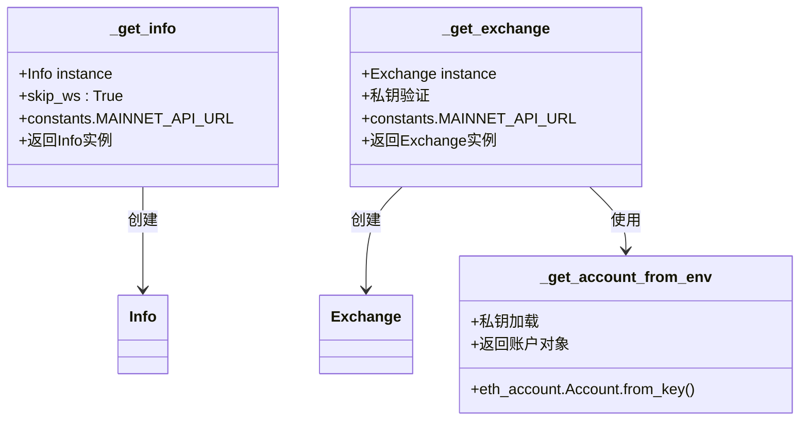

**图表来源**
- [nice_funcs_hyperliquid.py](file://src/nice_funcs_hyperliquid.py#L442-L450)
- [nice_funcs_hyperliquid.py](file://src/nice_funcs_hyperliquid.py#L450-L461)

**章节来源**
- [nice_funcs_hyperliquid.py](file://src/nice_funcs_hyperliquid.py#L442-L461)

### 数据处理管道

#### _process_data_to_df() 函数

该函数将原始API数据转换为Pandas DataFrame：

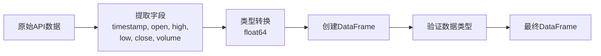

**图表来源**
- [nice_funcs_hyperliquid.py](file://src/nice_funcs_hyperliquid.py#L556-L580)

#### add_technical_indicators() 函数

技术指标计算流程：

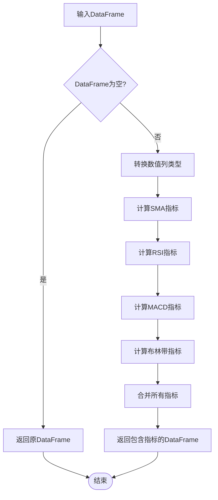

**图表来源**
- [nice_funcs_hyperliquid.py](file://src/nice_funcs_hyperliquid.py#L582-L618)

**章节来源**
- [nice_funcs_hyperliquid.py](file://src/nice_funcs_hyperliquid.py#L556-L618)

### OHLCV收集器

ohlcv_collector.py提供了批量数据收集功能：

#### 收集策略

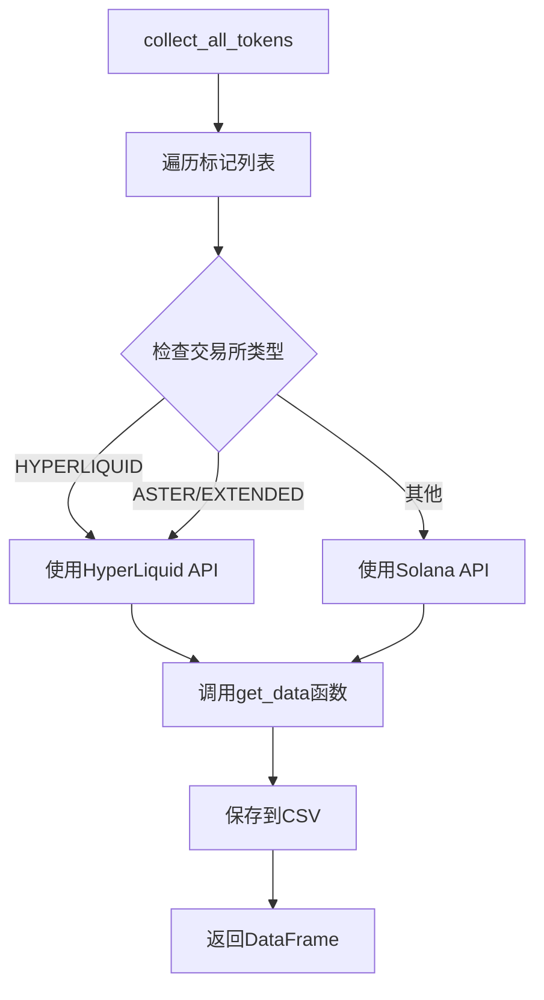

**图表来源**
- [ohlcv_collector.py](file://src/data/ohlcv_collector.py#L70-L128)

**章节来源**
- [ohlcv_collector.py](file://src/data/ohlcv_collector.py#L15-L128)

## 依赖关系分析

### 核心依赖关系

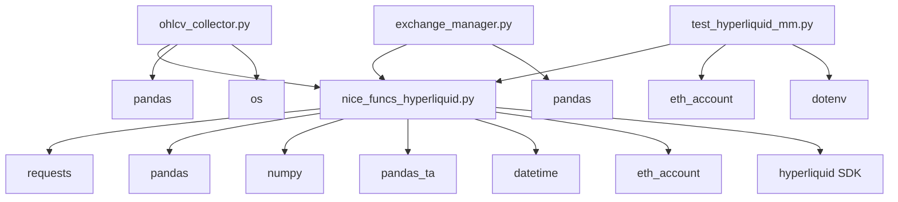

**图表来源**
- [nice_funcs_hyperliquid.py](file://src/nice_funcs_hyperliquid.py#L1-L30)
- [ohlcv_collector.py](file://src/data/ohlcv_collector.py#L1-L15)

### 配置依赖

系统配置通过config.py集中管理：

| 配置项 | 默认值 | 说明 |
|-------|--------|------|
| BATCH_SIZE | 5000 | API最大批量大小 |
| MAX_RETRIES | 3 | HTTP请求重试次数 |
| BASE_URL | 'https://api.hyperliquid.xyz/info' | API基础URL |
| DEFAULT_LEVERAGE | 5 | 默认杠杆倍数 |

**章节来源**
- [config.py](file://src/config.py#L31-L40)

## 性能考虑

### 批量处理优化

1. **最大批量大小**：限制为5000根K线，避免单次请求过大
2. **时间窗口计算**：智能计算所需的历史数据范围
3. **内存管理**：及时释放大型DataFrame占用的内存

### 网络优化

1. **连接超时**：设置10秒超时防止长时间等待
2. **重试机制**：最多3次重试，指数退避策略
3. **错误处理**：优雅处理网络异常和API限制

### 数据处理效率

1. **向量化操作**：使用pandas的向量化功能
2. **类型优化**：将数值列转换为float64类型
3. **延迟计算**：仅在需要时计算技术指标

## 故障排除指南

### 常见问题及解决方案

#### API请求失败

**症状**：`All retry attempts failed`
**原因**：网络连接问题或API限制
**解决方案**：
1. 检查网络连接
2. 验证API密钥有效性
3. 检查请求频率是否超过限制

#### 时间戳不匹配

**症状**：数据时间戳与预期不符
**原因**：系统时钟与API服务器时钟不同步
**解决方案**：
1. 系统会自动计算时间戳偏移
2. 重新运行数据获取函数
3. 检查系统时钟设置

#### 技术指标计算失败

**症状**：指标列显示NaN值
**原因**：数据不足或计算错误
**解决方案**：
1. 确保有足够的历史数据
2. 检查数据完整性
3. 验证pandas_ta库版本

**章节来源**
- [nice_funcs_hyperliquid.py](file://src/nice_funcs_hyperliquid.py#L523-L554)

### 测试和验证

系统提供了完整的测试套件：

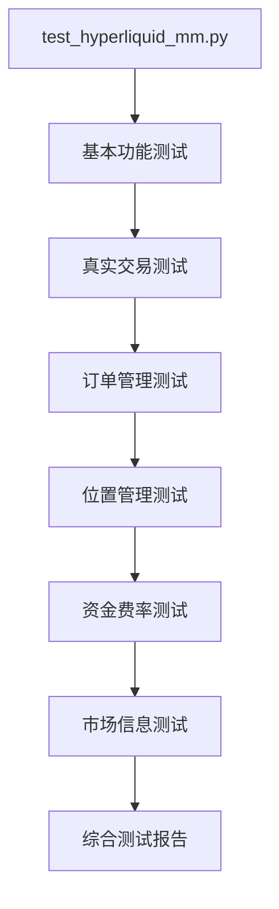

**图表来源**
- [test_hyperliquid_mm.py](file://src/scripts/test_hyperliquid_mm.py#L54-L287)

**章节来源**
- [test_hyperliquid_mm.py](file://src/scripts/test_hyperliquid_mm.py#L1-L287)

## 结论

Moon Dev的HyperLiquid API数据获取系统提供了一个完整、可靠且高效的市场数据解决方案。通过模块化设计、智能重试机制、时间戳校准和丰富的技术指标支持，该系统能够满足专业交易者和研究人员的需求。

### 主要优势

1. **可靠性**：完善的错误处理和重试机制
2. **准确性**：自动时间戳校准确保数据精确性
3. **易用性**：简洁的API接口和丰富的默认配置
4. **扩展性**：模块化设计便于功能扩展
5. **性能**：优化的数据处理和批量操作

### 应用场景

- 算法交易策略开发
- 技术分析研究
- 风险管理系统
- 市场监控工具
- 回测平台

该系统为基于HyperLiquid的交易策略提供了坚实的数据基础，支持高频交易和长期投资决策。