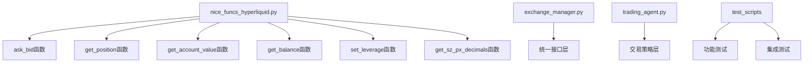
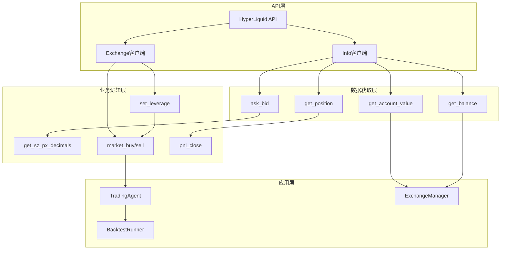
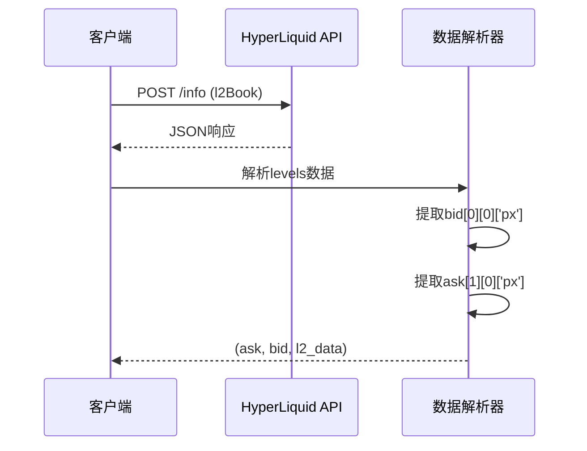
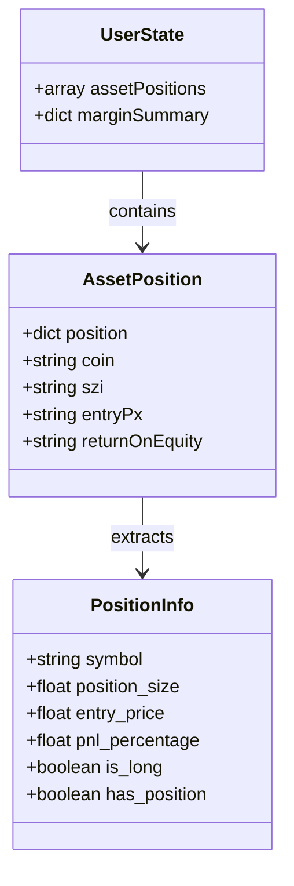
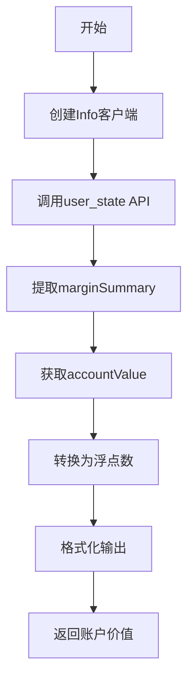
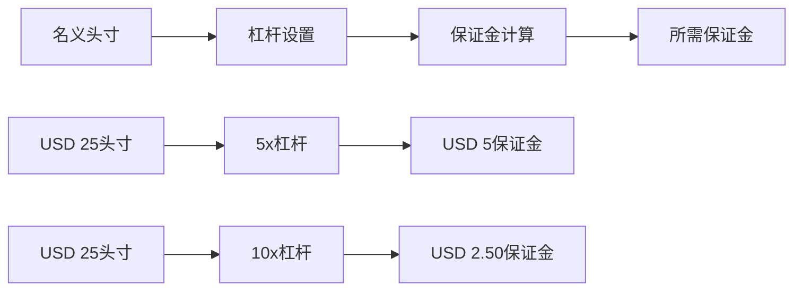
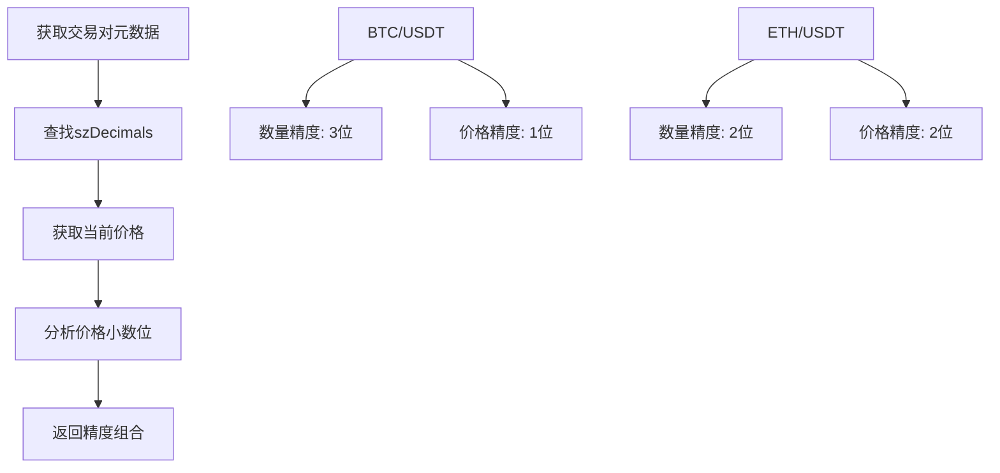
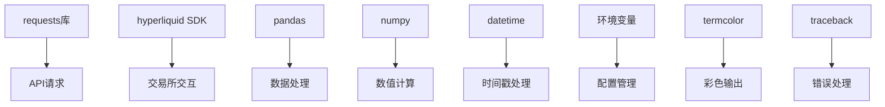

# 核心函数

<cite>
**本文档中引用的文件**
- [nice_funcs_hyperliquid.py](file://src/nice_funcs_hyperliquid.py)
- [exchange_manager.py](file://src/exchange_manager.py)
- [trading_agent.py](file://src/agents/trading_agent.py)
- [test_hyperliquid_mm.py](file://src/scripts/test_hyperliquid_mm.py)
- [test_exchange_manager.py](file://src/scripts/test_exchange_manager.py)
</cite>

## 目录
1. [简介](#简介)
2. [项目结构](#项目结构)
3. [核心组件](#核心组件)
4. [架构概览](#架构概览)
5. [详细组件分析](#详细组件分析)
6. [依赖关系分析](#依赖关系分析)
7. [性能考虑](#性能考虑)
8. [故障排除指南](#故障排除指南)
9. [结论](#结论)

## 简介

本文档深入解析了Moon Dev AI Agents项目中针对HyperLiquid交易所的核心函数实现。这些函数构成了交易系统的基础支撑层，为自动化交易策略提供了关键的市场数据获取、仓位管理和风险管理功能。

HyperLiquid是一个去中心化的衍生品交易平台，支持永续合约交易。该平台的特点包括高杠杆交易（最高50倍）、跨保证金模式、以及实时的市场深度数据。核心函数的设计充分考虑了这些特性，确保在高频交易场景下的稳定性和准确性。

## 项目结构

**图表来源**
- [nice_funcs_hyperliquid.py](file://src/nice_funcs_hyperliquid.py#L1-L925)
- [exchange_manager.py](file://src/exchange_manager.py#L1-L307)

**章节来源**
- [nice_funcs_hyperliquid.py](file://src/nice_funcs_hyperliquid.py#L1-L50)

## 核心组件

### 订单簿获取模块

订单簿获取模块负责从HyperLiquid API获取实时的买卖价格信息，这是所有交易决策的基础数据源。

### 仓位管理模块

仓位管理模块提供完整的持仓信息查询功能，包括当前持仓大小、开仓价格、盈亏百分比等关键指标。

### 账户管理模块

账户管理模块负责查询账户净值和可用余额，为资金管理提供准确的数据支持。

### 杠杆控制模块

杠杆控制模块实现了动态杠杆调整功能，支持根据交易策略需求灵活设置杠杆水平。

**章节来源**
- [nice_funcs_hyperliquid.py](file://src/nice_funcs_hyperliquid.py#L60-L120)

## 架构概览

**图表来源**
- [nice_funcs_hyperliquid.py](file://src/nice_funcs_hyperliquid.py#L31-L76)
- [exchange_manager.py](file://src/exchange_manager.py#L233-L307)

## 详细组件分析

### ask_bid() 函数 - 订单簿价格获取

`ask_bid()`函数是获取订单簿买卖价格的核心函数，它直接与HyperLiquid的L2订单簿API交互。

#### 实现原理

该函数通过发送POST请求到HyperLiquid的`l2Book`端点，获取指定交易对的完整订单簿数据。返回值包含三个元素：
- `ask`: 卖一价（最高买价）
- `bid`: 买一价（最低卖价）  
- `l2_data`: 完整的L2订单簿数据

#### 关键特性

**图表来源**
- [nice_funcs_hyperliquid.py](file://src/nice_funcs_hyperliquid.py#L60-L80)

#### 使用场景

该函数广泛应用于：
- 市场深度分析
- 价差套利策略
- 挂单价格计算
- 流动性评估

**章节来源**
- [nice_funcs_hyperliquid.py](file://src/nice_funcs_hyperliquid.py#L60-L80)

### get_position() 函数 - 当前持仓查询

`get_position()`函数提供完整的持仓信息查询功能，是风险管理的重要工具。

#### 数据结构

**图表来源**
- [nice_funcs_hyperliquid.py](file://src/nice_funcs_hyperliquid.py#L120-L150)

#### 查询逻辑

函数首先通过Info客户端获取用户状态，然后遍历资产持仓数组，筛选出指定交易对的持仓信息。对于非零持仓，提取关键字段并进行格式化处理。

#### 风险控制意义

该函数提供的持仓信息是执行kill_switch、pnl_close等风险管理操作的基础，确保交易系统能够及时识别和处理潜在风险。

**章节来源**
- [nice_funcs_hyperliquid.py](file://src/nice_funcs_hyperliquid.py#L120-L150)

### get_account_value() 函数 - 账户净值计算

`get_account_value()`函数计算用户的总账户价值，包括未实现盈亏和保证金余额。

#### 计算公式

账户净值 = 保证金摘要中的账户价值

#### 实现细节

**图表来源**
- [nice_funcs_hyperliquid.py](file://src/nice_funcs_hyperliquid.py#L310-L320)

#### 应用价值

该函数为以下场景提供关键数据：
- 资金管理决策
- 仓位规模计算
- 风险敞口监控
- 绩效评估

**章节来源**
- [nice_funcs_hyperliquid.py](file://src/nice_funcs_hyperliquid.py#L310-L320)

### get_balance() 函数 - 可用余额查询

`get_balance()`函数查询用户的可提现余额，即可用作新交易的资金量。

#### 数据来源

可用余额 = 用户状态中的withdrawable字段

#### 业务意义

该函数区分了：
- 总账户价值：包含未实现盈亏
- 可用余额：仅包含可立即使用的资金

这种区分对于防止过度杠杆化和确保流动性至关重要。

**章节来源**
- [nice_funcs_hyperliquid.py](file://src/nice_funcs_hyperliquid.py#L425-L435)

### set_leverage() 函数 - 杠杆设置机制

`set_leverage()`函数实现了动态杠杆调整功能，是HyperLiquid交易的核心配置工具。

#### 杠杆计算原理

**图表来源**
- [nice_funcs_hyperliquid.py](file://src/nice_funcs_hyperliquid.py#L150-L160)

#### 风险控制机制

默认杠杆设置为5x，这是一个平衡风险和回报的保守选择。更高的杠杆虽然能放大收益，但也会显著增加清算风险。

#### 配置参数

| 参数 | 默认值 | 范围 | 说明 |
|------|--------|------|------|
| DEFAULT_LEVERAGE | 5 | 1-50x | 全局杠杆设置 |
| 手续费率 | 0.02% | 固定 | 开仓和平仓手续费 |
| 清算阈值 | 100% | 动态 | 保证金不足时的清算线 |

**章节来源**
- [nice_funcs_hyperliquid.py](file://src/nice_funcs_hyperliquid.py#L35-L45)

### get_sz_px_decimals() 函数 - 精度控制

`get_sz_px_decimals()`函数确定交易对的数量和价格精度，确保订单符合交易所的格式要求。

#### 精度计算逻辑

**图表来源**
- [nice_funcs_hyperliquid.py](file://src/nice_funcs_hyperliquid.py#L82-L118)

#### 精度应用

不同交易对采用不同的精度标准：
- BTC/USDT：数量3位小数，价格1位小数
- ETH/USDT：数量2位小数，价格2位小数
- 其他交易对：遵循交易所标准

这种精确控制避免了因精度问题导致的订单失败。

**章节来源**
- [nice_funcs_hyperliquid.py](file://src/nice_funcs_hyperliquid.py#L82-L118)

## 依赖关系分析

**图表来源**
- [nice_funcs_hyperliquid.py](file://src/nice_funcs_hyperliquid.py#L1-L30)

### 外部依赖

| 依赖库 | 版本要求 | 用途 |
|--------|----------|------|
| requests | >= 2.25.0 | HTTP API调用 |
| hyperliquid | 最新版本 | 交易所SDK |
| pandas | >= 1.3.0 | 数据结构处理 |
| numpy | >= 1.20.0 | 数值运算 |
| eth_account | 最新版本 | 以太坊密钥管理 |

### 内部依赖

核心函数之间存在明确的依赖关系：
- `market_buy/market_sell`依赖`ask_bid`和`get_sz_px_decimals`
- `set_leverage`被多个交易函数调用
- `get_position`为风险管理函数提供数据

**章节来源**
- [nice_funcs_hyperliquid.py](file://src/nice_funcs_hyperliquid.py#L1-L30)

## 性能考虑

### API调用优化

1. **批量请求**：最大支持5000条OHLCV数据
2. **重试机制**：最多3次重试，指数退避
3. **超时控制**：10秒HTTP超时
4. **并发处理**：支持多符号并行查询

### 内存管理

1. **数据类型优化**：使用float64确保精度
2. **缓存策略**：关键数据本地缓存
3. **垃圾回收**：定期清理临时对象

### 网络优化

1. **连接池**：复用HTTP连接
2. **压缩传输**：启用gzip压缩
3. **CDN加速**：使用最优的API端点

## 故障排除指南

### 常见错误及解决方案

| 错误类型 | 症状 | 解决方案 |
|----------|------|----------|
| API限流 | 429错误 | 实施指数退避重试 |
| 网络超时 | 连接超时 | 增加超时时间 |
| 数据格式错误 | JSON解析失败 | 添加数据验证 |
| 权限错误 | 401/403 | 检查私钥配置 |

### 调试技巧

1. **日志记录**：启用详细日志追踪
2. **断点调试**：使用IDE调试器
3. **单元测试**：编写针对性测试用例
4. **监控告警**：设置关键指标监控

**章节来源**
- [nice_funcs_hyperliquid.py](file://src/nice_funcs_hyperliquid.py#L250-L300)

## 结论

Moon Dev的HyperLiquid核心函数实现展现了高质量的交易系统设计。这些函数不仅功能完善，而且具有良好的可扩展性和稳定性。

### 主要优势

1. **完整性**：覆盖了交易系统的各个关键环节
2. **可靠性**：完善的错误处理和重试机制
3. **效率**：优化的API调用和数据处理
4. **安全性**：严格的输入验证和权限控制

### 应用价值

这些核心函数为自动化交易策略提供了坚实的基础支撑，在高频交易、套利策略、风险管理等场景中发挥着重要作用。通过合理的配置和使用，可以显著提升交易系统的性能和稳定性。

未来的改进方向包括：
- 引入更智能的缓存策略
- 增强异常处理能力
- 优化网络通信效率
- 扩展更多交易功能