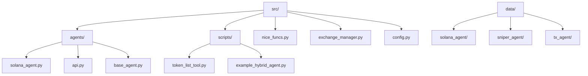
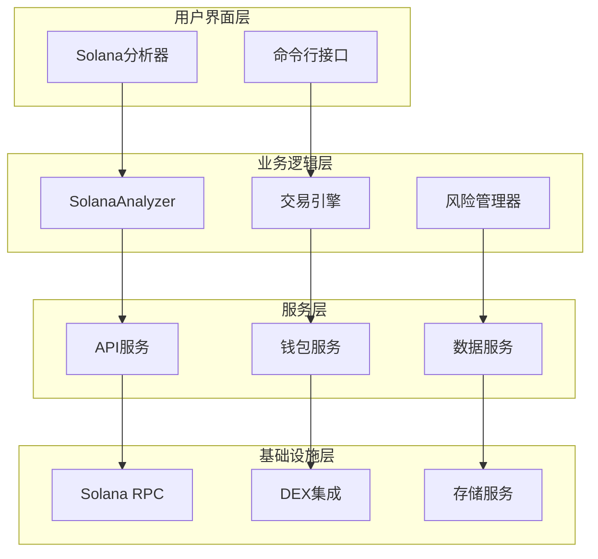
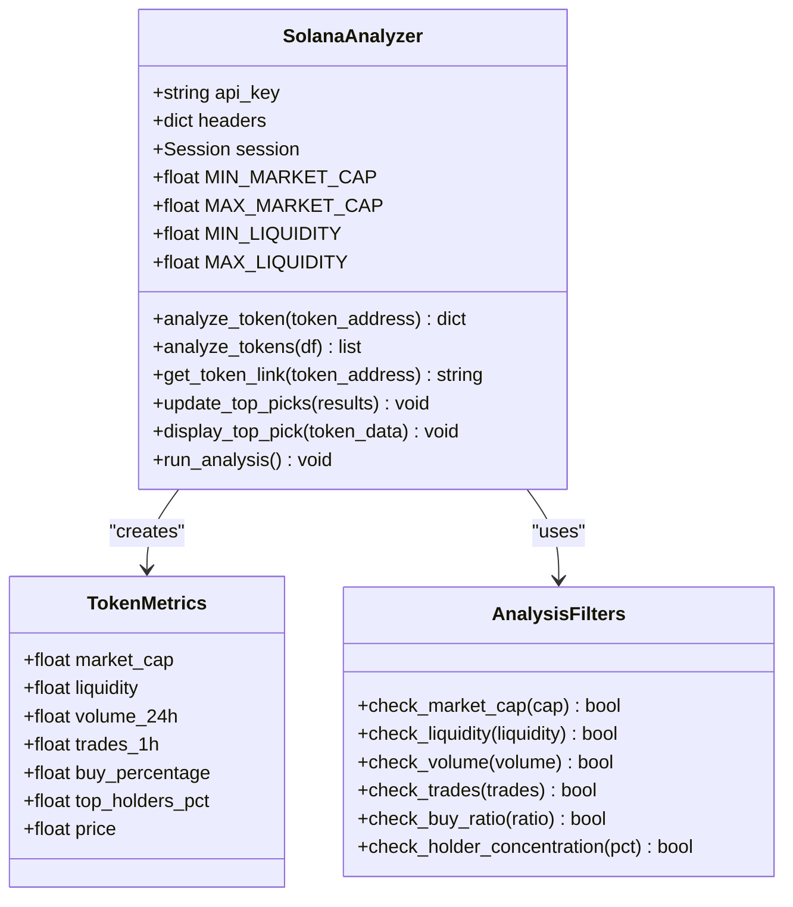
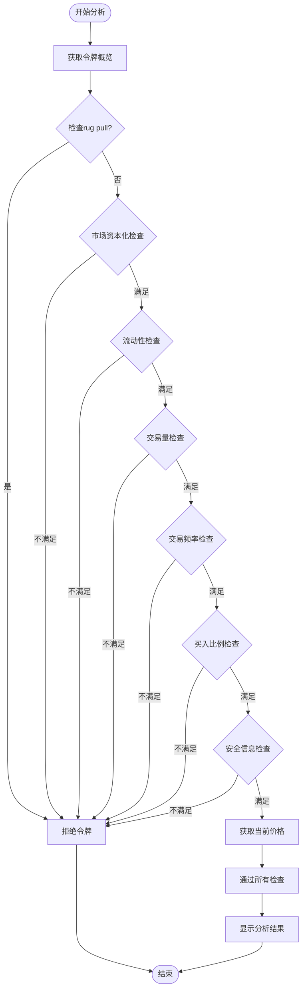
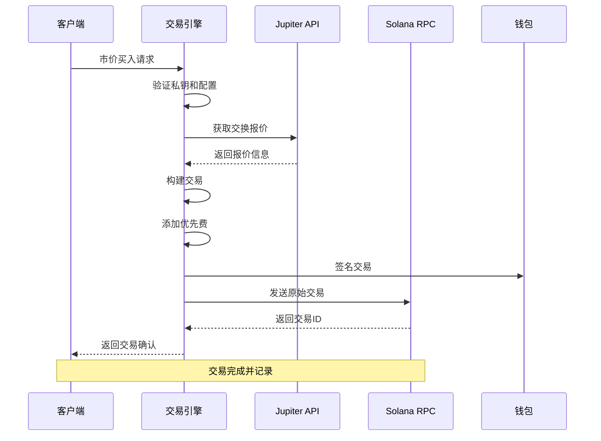
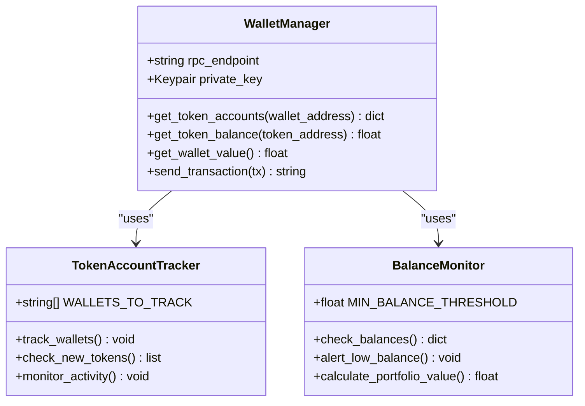
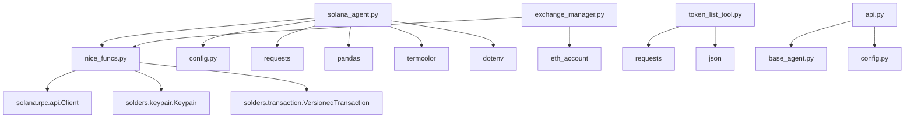

# Solana区块链集成

<cite>
**本文档中引用的文件**
- [solana_agent.py](file://src/agents/solana_agent.py)
- [nice_funcs.py](file://src/nice_funcs.py)
- [exchange_manager.py](file://src/exchange_manager.py)
- [config.py](file://src/config.py)
- [token_list_tool.py](file://src/scripts/token_list_tool.py)
- [api.py](file://src/agents/api.py)
- [base_agent.py](file://src/agents/base_agent.py)
- [example_unified_agent.py](file://src/agents/example_unified_agent.py)
</cite>

## 目录
1. [简介](#简介)
2. [项目结构](#项目结构)
3. [核心组件](#核心组件)
4. [架构概览](#架构概览)
5. [详细组件分析](#详细组件分析)
6. [依赖关系分析](#依赖关系分析)
7. [性能考虑](#性能考虑)
8. [故障排除指南](#故障排除指南)
9. [结论](#结论)

## 简介

Moon Dev的Solana区块链集成为去中心化金融（DeFi）生态系统提供了全面的解决方案。该系统通过智能代理实现了自动化的代币交易、流动性管理和风险管理功能。核心功能包括钱包管理、交易构建、签名验证、代币交换、流动性提供以及与Solana RPC API的深度集成。

该集成系统采用模块化设计，支持多种交易策略，包括MEV保护、滑点控制和交易优先级费用优化。系统具备强大的安全特性，包括私钥管理、交易验证和实时监控能力。

## 项目结构

Solana集成的核心文件分布在以下目录结构中：

**图表来源**
- [solana_agent.py](file://src/agents/solana_agent.py#L1-L50)
- [nice_funcs.py](file://src/nice_funcs.py#L1-L30)
- [exchange_manager.py](file://src/exchange_manager.py#L1-L40)

**章节来源**
- [solana_agent.py](file://src/agents/solana_agent.py#L1-L365)
- [nice_funcs.py](file://src/nice_funcs.py#L1-L100)

## 核心组件

### SolanaAnalyzer类

SolanaAnalyzer是系统的核心分析引擎，负责令牌分析、市场监控和交易决策制定。该类实现了完整的分析流水线，从数据收集到结果输出。

主要功能包括：
- **令牌分析**：基于市场资本化、流动性、交易量等指标进行综合评估
- **安全检查**：检测潜在的rug pull风险和异常交易模式
- **排名系统**：根据预定义标准对令牌进行排序和筛选
- **浏览器集成**：自动打开分析结果到DEX平台

### 交易执行引擎

交易执行引擎提供了完整的交易生命周期管理，包括订单创建、签名、提交和确认。

核心交易功能：
- **市价买卖**：支持USDC兑换任意代币的市价交易
- **限价订单**：支持精确价格的限价订单执行
- **批量交易**：支持大额订单的分批执行以优化滑点
- **优先费管理**：动态调整交易优先费以确保快速确认

### 钱包管理系统

钱包管理系统负责Solana钱包的完整生命周期管理，包括地址验证、余额查询和交易授权。

**章节来源**
- [solana_agent.py](file://src/agents/solana_agent.py#L60-L150)
- [nice_funcs.py](file://src/nice_funcs.py#L227-L300)

## 架构概览

Solana集成采用分层架构设计，确保系统的可扩展性和维护性：

**图表来源**
- [solana_agent.py](file://src/agents/solana_agent.py#L60-L100)
- [exchange_manager.py](file://src/exchange_manager.py#L20-L80)

## 详细组件分析

### Solana分析器详细分析

SolanaAnalyzer类是整个系统的核心，实现了复杂的令牌分析算法：

**图表来源**
- [solana_agent.py](file://src/agents/solana_agent.py#L60-L120)
- [solana_agent.py](file://src/agents/solana_agent.py#L120-L200)

#### 分析流程详解

令牌分析遵循严格的过滤流程：

**图表来源**
- [solana_agent.py](file://src/agents/solana_agent.py#L120-L200)

**章节来源**
- [solana_agent.py](file://src/agents/solana_agent.py#L120-L250)

### 交易执行系统分析

交易执行系统提供了完整的交易生命周期管理：

**图表来源**
- [nice_funcs.py](file://src/nice_funcs.py#L227-L289)
- [nice_funcs.py](file://src/nice_funcs.py#L291-L322)

#### 交易构建和签名流程

交易构建过程包含多个关键步骤：

1. **报价获取**：使用Jupiter Lite API获取最优交换报价
2. **交易构建**：将报价转换为Solana版本化交易
3. **优先费设置**：添加适当的优先费以确保快速确认
4. **签名验证**：使用私钥对交易进行数字签名
5. **交易提交**：通过Solana RPC提交交易

**章节来源**
- [nice_funcs.py](file://src/nice_funcs.py#L227-L322)

### 钱包管理功能

钱包管理系统提供了完整的Solana钱包操作功能：

**图表来源**
- [token_list_tool.py](file://src/scripts/token_list_tool.py#L15-L50)
- [nice_funcs.py](file://src/nice_funcs.py#L436-L478)

**章节来源**
- [token_list_tool.py](file://src/scripts/token_list_tool.py#L15-L51)
- [nice_funcs.py](file://src/nice_funcs.py#L436-L544)

## 依赖关系分析

Solana集成系统的依赖关系展现了清晰的模块化设计：

**图表来源**
- [solana_agent.py](file://src/agents/solana_agent.py#L1-L30)
- [nice_funcs.py](file://src/nice_funcs.py#L1-L30)
- [exchange_manager.py](file://src/exchange_manager.py#L1-L30)

### 外部依赖

系统依赖以下外部库和服务：

| 组件 | 版本要求 | 用途 |
|------|----------|------|
| requests | >=2.25.0 | HTTP请求处理 |
| pandas | >=1.3.0 | 数据分析和处理 |
| solders | >=0.10.0 | Solana交易构建 |
| termcolor | >=1.1.0 | 控制台彩色输出 |
| python-dotenv | >=0.19.0 | 环境变量管理 |

| 服务 | 端点 | 用途 |
|------|------|------|
| Birdeye API | public-api.birdeye.so | 令牌数据和市场信息 |
| Jupiter Lite API | lite-api.jup.ag | 交换报价和交易路由 |
| Solana RPC | api.mainnet-beta.solana.com | 区块链交互 |
| Helius RPC | api.helius.xyz | 高级RPC功能 |

**章节来源**
- [solana_agent.py](file://src/agents/solana_agent.py#L1-L30)
- [nice_funcs.py](file://src/nice_funcs.py#L1-L30)

## 性能考虑

### 交易优化策略

系统实现了多种性能优化策略：

1. **批量处理**：支持多个令牌的批量分析和交易
2. **缓存机制**：本地缓存频繁访问的数据
3. **异步处理**：非阻塞的API调用和数据处理
4. **连接池**：复用HTTP连接减少延迟

### 滑点控制机制

滑点控制通过以下方式实现：

- **动态报价**：实时获取最优交换报价
- **阈值设置**：可配置的最大滑点容忍度
- **分批执行**：大额订单分批处理以降低滑点影响
- **时间窗口**：在最佳时机执行交易

### MEV保护措施

系统内置多种MEV（最大可提取价值）保护机制：

- **隐私交易**：使用专用的MEV防护服务
- **随机化**：交易参数的随机化处理
- **确认延迟**：智能的交易确认时机选择
- **监控告警**：实时监控潜在的MEV攻击

## 故障排除指南

### 常见问题及解决方案

#### 连接问题

**问题**：无法连接到Solana RPC
**解决方案**：
1. 检查RPC_ENDPOINT环境变量
2. 验证网络连接状态
3. 尝试切换到备用RPC节点

**问题**：API密钥无效
**解决方案**：
1. 验证BIRDEYE_API_KEY配置
2. 检查API配额使用情况
3. 重新生成API密钥

#### 交易失败

**问题**：交易签名失败
**解决方案**：
1. 验证SOLANA_PRIVATE_KEY格式
2. 检查钱包余额是否充足
3. 确认网络状态正常

**问题**：交易确认超时
**解决方案**：
1. 增加优先费设置
2. 检查网络拥堵情况
3. 调整交易重试策略

#### 数据获取问题

**问题**：无法获取令牌数据
**解决方案**：
1. 检查令牌地址格式
2. 验证API访问权限
3. 确认令牌在支持的DEX上

**章节来源**
- [solana_agent.py](file://src/agents/solana_agent.py#L300-L365)
- [nice_funcs.py](file://src/nice_funcs.py#L227-L322)

## 结论

Moon Dev的Solana区块链集成为去中心化金融生态系统提供了强大而灵活的解决方案。通过模块化架构设计，系统实现了高度的可扩展性和可维护性。

### 主要优势

1. **全面的功能覆盖**：从令牌分析到自动交易的完整解决方案
2. **高性能设计**：优化的交易执行和数据处理流程
3. **安全可靠**：多重安全验证和风险控制机制
4. **易于集成**：标准化的API接口和配置管理

### 应用场景

- **去中心化交易所**：自动化的代币交易和流动性管理
- **量化交易**：基于算法的高频交易策略
- **风险管理**：实时的风险监控和头寸管理
- **数据分析**：深入的市场研究和趋势分析

### 未来发展方向

1. **智能合约集成**：支持更复杂的DeFi协议交互
2. **多链支持**：扩展到其他区块链平台
3. **机器学习增强**：利用AI技术优化交易策略
4. **社区治理**：支持DAO驱动的决策机制

该Solana集成系统为开发者和机构提供了一个强大、安全且高效的DeFi交易平台，具备应对复杂市场环境的能力和持续演进的潜力。