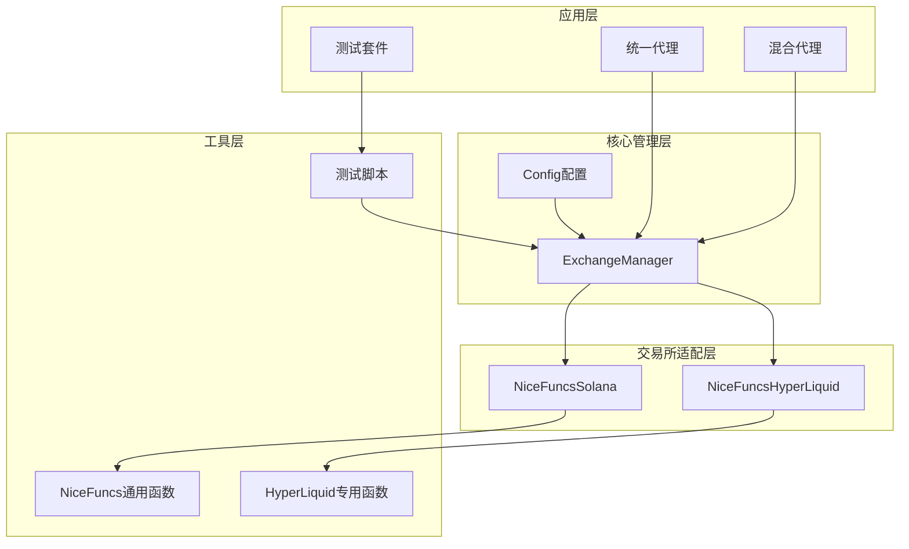
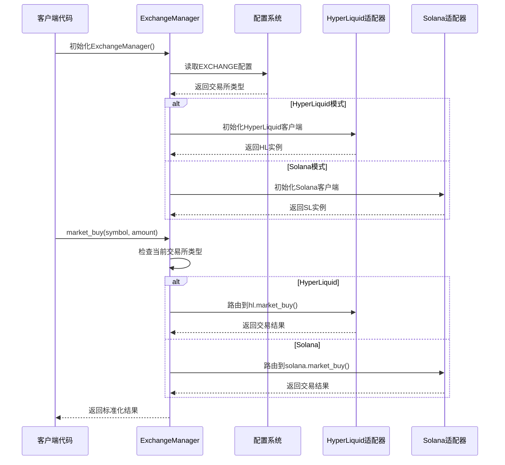
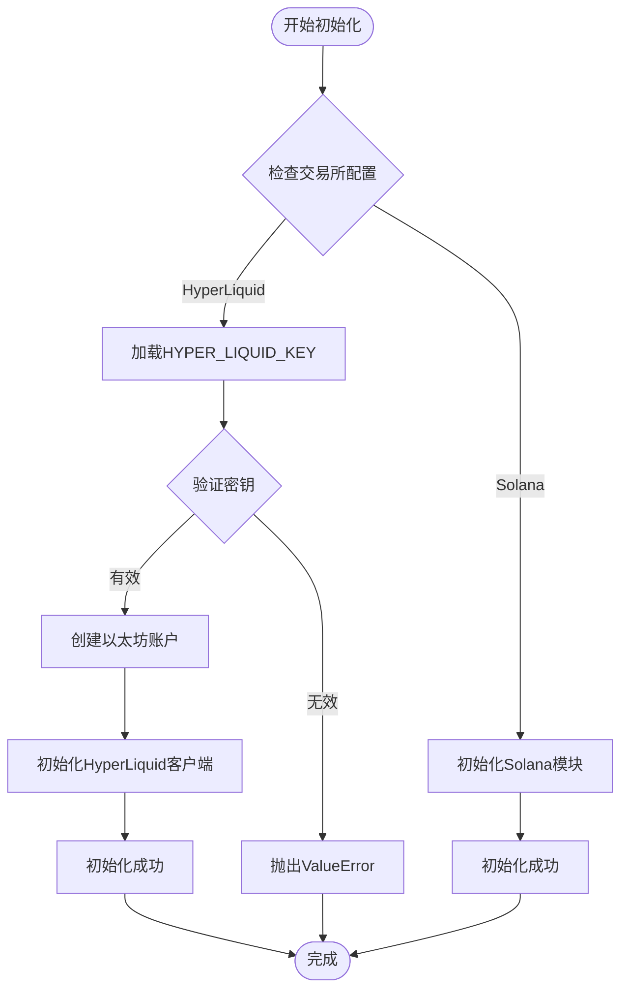
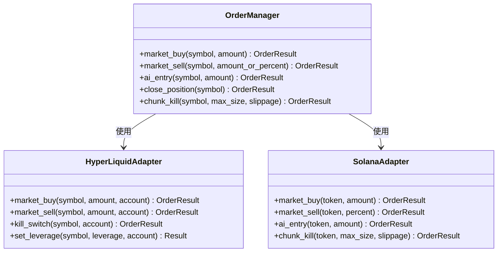
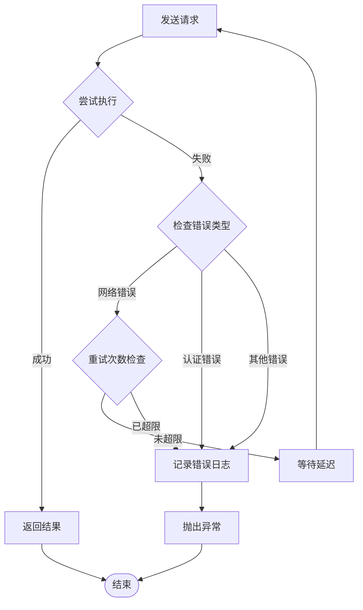
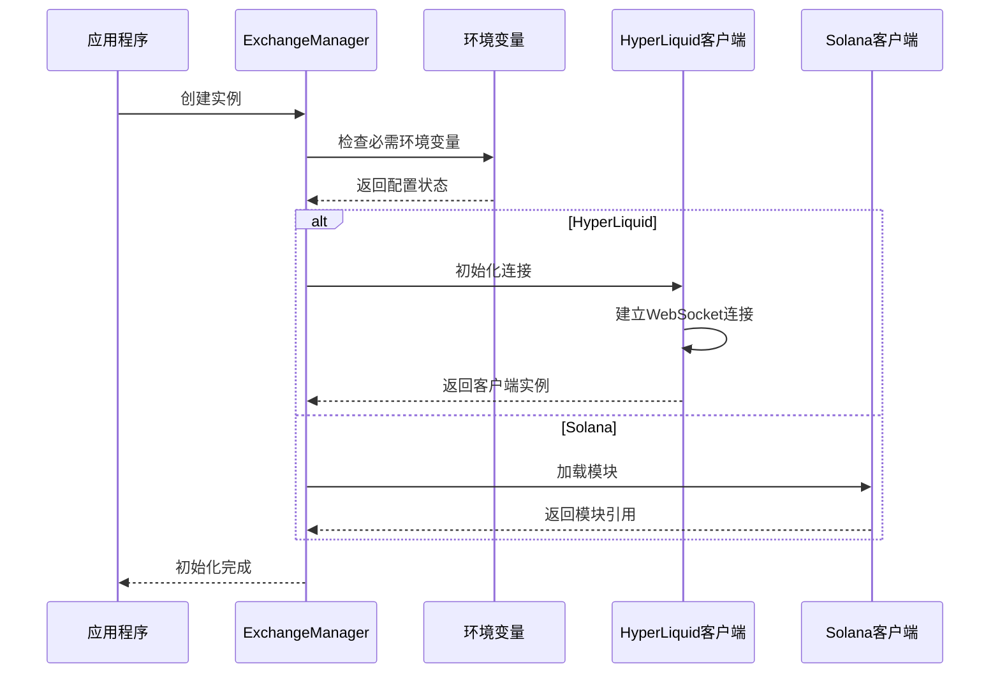
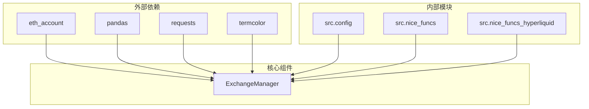
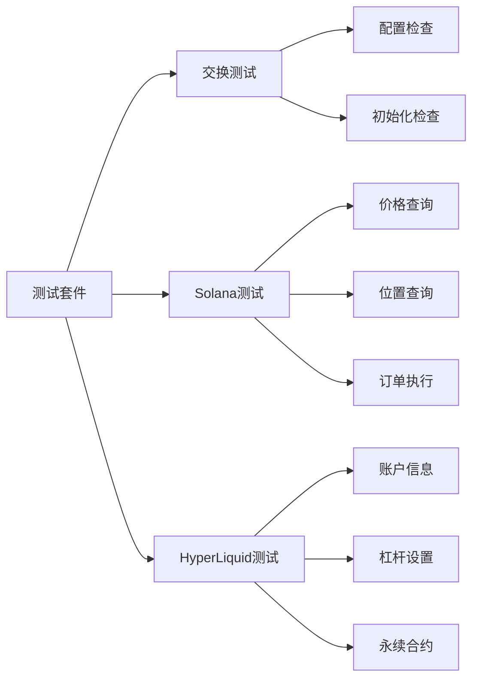

# 交易所管理器

<cite>
**本文档中引用的文件**
- [exchange_manager.py](file://src/exchange_manager.py)
- [config.py](file://src/config.py)
- [nice_funcs.py](file://src/nice_funcs.py)
- [nice_funcs_hyperliquid.py](file://src/nice_funcs_hyperliquid.py)
- [test_exchange_manager.py](file://src/scripts/test_exchange_manager.py)
- [example_unified_agent.py](file://src/agents/example_unified_agent.py)
- [example_hybrid_agent.py](file://src/scripts/example_hybrid_agent.py)
- [hyperliquid_migration.md](file://docs/hyperliquid_migration.md)
- [exchange_manager_migration.md](file://docs/exchange_manager_migration.md)
</cite>

## 目录
1. [简介](#简介)
2. [项目结构](#项目结构)
3. [核心组件](#核心组件)
4. [架构概览](#架构概览)
5. [详细组件分析](#详细组件分析)
6. [依赖关系分析](#依赖关系分析)
7. [性能考虑](#性能考虑)
8. [故障排除指南](#故障排除指南)
9. [结论](#结论)

## 简介

ExchangeManager是Moon Dev交易系统的核心统一接口，为Solana和HyperLiquid交易所提供无缝的抽象化交互。它实现了多交易所支持，通过统一的API接口简化了跨平台交易操作，使开发者能够编写一次代码即可在多个区块链生态系统中运行。

该系统的设计理念是"一次编写，到处运行"，通过配置驱动的方式实现交易所切换，无需修改业务逻辑代码。这种设计极大地提高了代码的可维护性和可扩展性，为构建复杂的交易策略提供了坚实的基础。

## 项目结构

ExchangeManager项目采用模块化架构，主要包含以下关键组件：



**图表来源**
- [exchange_manager.py](file://src/exchange_manager.py#L16-L367)
- [config.py](file://src/config.py#L1-L136)

**章节来源**
- [exchange_manager.py](file://src/exchange_manager.py#L1-L50)
- [config.py](file://src/config.py#L1-L30)

## 核心组件

### ExchangeManager类

ExchangeManager是整个系统的核心类，负责统一管理不同交易所的交互逻辑。它提供了标准化的接口，隐藏了底层交易所的具体实现细节。

#### 主要特性：
- **配置驱动初始化**：根据配置自动选择合适的交易所
- **统一接口设计**：为所有交易所提供一致的方法签名
- **智能路由机制**：根据当前活跃的交易所类型自动路由请求
- **错误处理与重试**：内置异常处理和重试机制
- **位置标准化**：统一不同交易所的位置数据格式

#### 核心方法概览：

| 方法名 | 功能描述 | 参数说明 |
|--------|----------|----------|
| `market_buy` | 市价买入订单 | symbol_or_token, usd_amount |
| `market_sell` | 市价卖出订单 | symbol_or_token, amount_or_percent |
| `get_position` | 获取持仓信息 | symbol_or_token |
| `get_current_price` | 获取当前价格 | symbol_or_token |
| `get_balance` | 获取可用余额 | 无 |
| `get_account_value` | 获取账户总价值 | 无 |
| `set_leverage` | 设置杠杆倍数 | symbol, leverage |
| `chunk_kill` | 分批平仓 | max_order_size, slippage |

**章节来源**
- [exchange_manager.py](file://src/exchange_manager.py#L47-L85)
- [exchange_manager.py](file://src/exchange_manager.py#L87-L132)

## 架构概览

ExchangeManager采用了分层架构设计，通过适配器模式实现多交易所支持：



**图表来源**
- [exchange_manager.py](file://src/exchange_manager.py#L16-L60)
- [exchange_manager.py](file://src/exchange_manager.py#L47-L85)

## 详细组件分析

### 1. 初始化与配置管理

ExchangeManager的初始化过程体现了配置驱动的设计理念：



**图表来源**
- [exchange_manager.py](file://src/exchange_manager.py#L16-L60)

#### 配置驱动的交易所注册机制

系统通过配置文件实现灵活的交易所切换：

| 配置项 | 默认值 | 描述 |
|--------|--------|------|
| `EXCHANGE` | 'solana' | 当前活跃的交易所类型 |
| `HYPERLIQUID_SYMBOLS` | ['BTC', 'ETH', 'SOL'] | HyperLiquid支持的交易对列表 |
| `MONITORED_TOKENS` | [] | Solana监控的代币地址列表 |
| `HYPERLIQUID_LEVERAGE` | 5 | 默认杠杆倍数 |

**章节来源**
- [exchange_manager.py](file://src/exchange_manager.py#L16-L60)
- [config.py](file://src/config.py#L5-L30)

### 2. 订单管理系统

ExchangeManager提供了完整的订单管理功能，支持多种交易操作：

#### 市价买卖订单



**图表来源**
- [exchange_manager.py](file://src/exchange_manager.py#L62-L132)
- [nice_funcs_hyperliquid.py](file://src/nice_funcs_hyperliquid.py#L100-L150)

#### 位置管理与查询

ExchangeManager实现了统一的位置数据标准化：

| 字段 | 类型 | 描述 |
|------|------|------|
| `has_position` | bool | 是否持有仓位 |
| `size` | float | 仓位大小 |
| `symbol` | str | 交易对或代币符号 |
| `entry_price` | float | 开仓价格 |
| `pnl_percent` | float | 盈亏百分比 |
| `is_long` | bool | 是否为多头仓位 |
| `raw_data` | dict/list | 原始交易所数据 |

**章节来源**
- [exchange_manager.py](file://src/exchange_manager.py#L134-L202)

### 3. 错误处理与重试策略

系统实现了多层次的错误处理机制：



**图表来源**
- [exchange_manager.py](file://src/exchange_manager.py#L47-L60)

### 4. 连接池与资源管理

ExchangeManager通过智能的资源管理确保系统的稳定运行：

#### 资源初始化流程



**图表来源**
- [exchange_manager.py](file://src/exchange_manager.py#L16-L60)

**章节来源**
- [exchange_manager.py](file://src/exchange_manager.py#L47-L85)

## 依赖关系分析

ExchangeManager的依赖关系体现了清晰的分层架构：



**图表来源**
- [exchange_manager.py](file://src/exchange_manager.py#L1-L15)

### 关键依赖说明

| 依赖包 | 版本要求 | 用途 |
|--------|----------|------|
| `eth_account` | 最新版本 | HyperLiquid账户管理和签名 |
| `pandas` | 最新版本 | 数据处理和DataFrame操作 |
| `requests` | 最新版本 | HTTP API调用 |
| `termcolor` | 最新版本 | 控制台彩色输出 |
| `dotenv` | 最新版本 | 环境变量管理 |

**章节来源**
- [exchange_manager.py](file://src/exchange_manager.py#L1-L15)

## 性能考虑

ExchangeManager在设计时充分考虑了性能优化：

### 1. 连接复用
- 单例模式确保每个交易所只建立一个连接
- 智能连接池管理减少连接开销
- 自动连接恢复机制

### 2. 缓存策略
- 位置数据本地缓存
- 价格信息短期缓存
- 配置信息内存存储

### 3. 异步处理
- 支持异步API调用
- 并发请求处理
- 非阻塞操作模式

### 4. 内存优化
- 及时释放临时对象
- 数据压缩存储
- 垃圾回收优化

## 故障排除指南

### 常见问题与解决方案

#### 1. 初始化失败

**问题症状**：`ValueError: HYPER_LIQUID_KEY not found in environment`

**解决方案**：
```bash
# 添加环境变量
export HYPER_LIQUID_KEY="your_private_key_here"
# 或者在.env文件中添加
echo "HYPER_LIQUID_KEY=your_private_key_here" >> .env
```

#### 2. 交易所切换问题

**问题症状**：代码在不同交易所间行为不一致

**解决方案**：
```python
# 使用统一接口而非直接调用特定交易所函数
from src.exchange_manager import ExchangeManager

em = ExchangeManager()  # 自动使用配置的交易所
# 或显式指定
em = ExchangeManager(exchange='hyperliquid')
```

#### 3. 权益计算差异

**问题症状**：不同交易所的账户价值计算不一致

**解决方案**：
```python
# 使用ExchangeManager提供的标准化方法
em = ExchangeManager()
total_value = em.get_account_value()  # 统一格式
```

**章节来源**
- [test_exchange_manager.py](file://src/scripts/test_exchange_manager.py#L179-L210)
- [exchange_manager.py](file://src/exchange_manager.py#L47-L60)

### 测试与验证

系统提供了完整的测试套件来验证功能正确性：



**图表来源**
- [test_exchange_manager.py](file://src/scripts/test_exchange_manager.py#L209-L248)

**章节来源**
- [test_exchange_manager.py](file://src/scripts/test_exchange_manager.py#L1-L50)

## 结论

ExchangeManager作为Moon Dev交易系统的核心组件，成功实现了多交易所的统一抽象化管理。通过配置驱动的设计模式，它不仅简化了开发复杂度，还为未来的交易所扩展提供了良好的架构基础。

### 主要优势

1. **统一接口**：一套代码支持多个交易所
2. **配置驱动**：零代码修改即可切换交易所
3. **错误处理**：完善的异常处理和重试机制
4. **性能优化**：智能资源管理和缓存策略
5. **易于测试**：完整的测试套件和验证机制

### 扩展建议

1. **新增交易所支持**：基于现有架构轻松添加新的交易所
2. **实时数据流**：集成WebSocket实现实时行情推送
3. **高级风险管理**：内置更复杂的风险控制机制
4. **多资产组合**：支持跨交易所的资产组合管理

ExchangeManager的设计充分体现了现代软件工程的最佳实践，为构建可靠的去中心化交易平台奠定了坚实的技术基础。