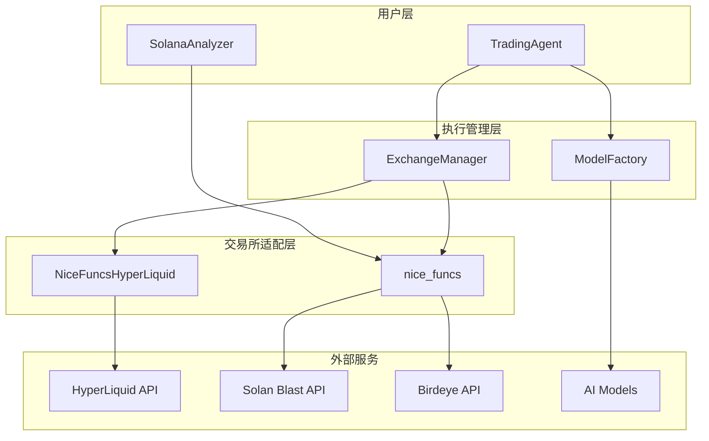
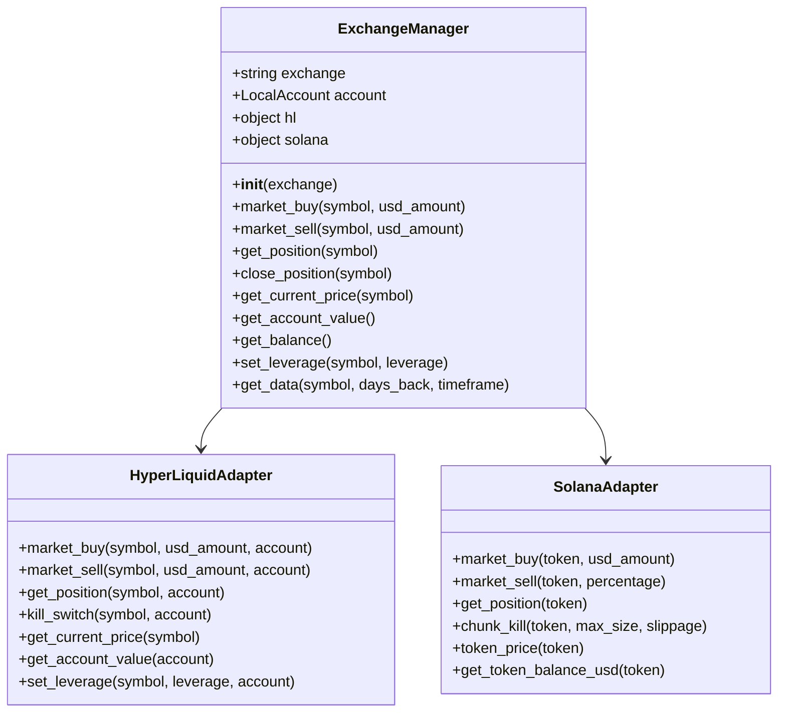
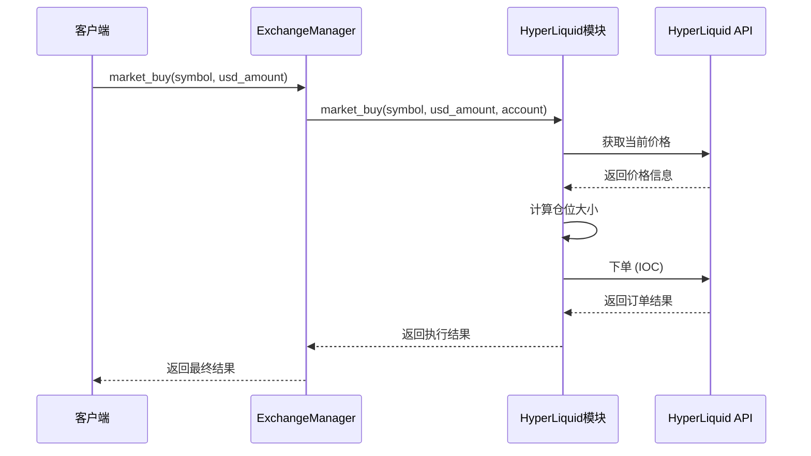
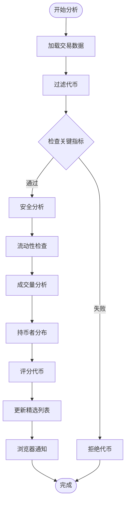
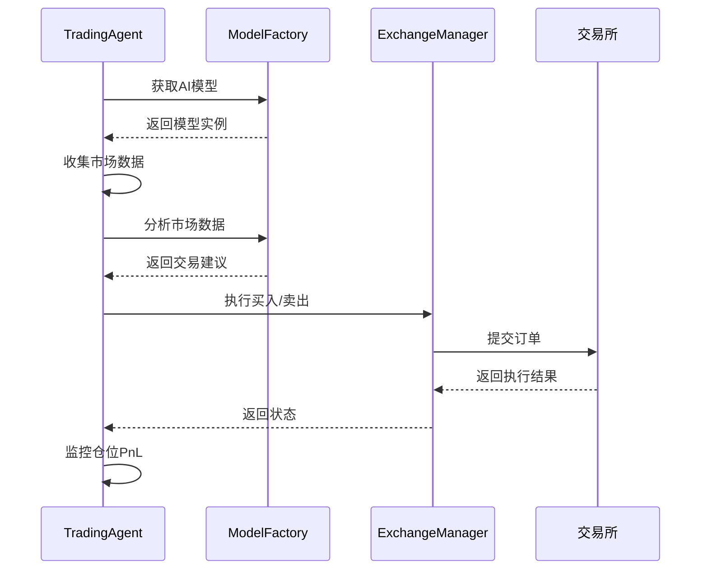
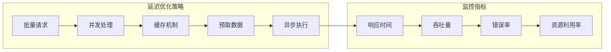
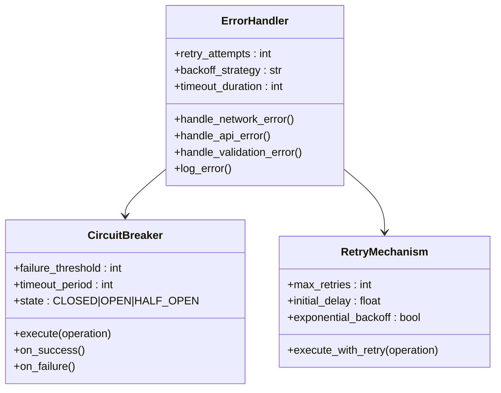
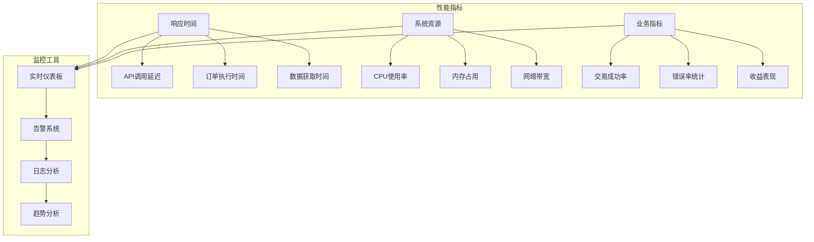

# 执行系统

<cite>
**本文档引用的文件**
- [exchange_manager.py](file://src/exchange_manager.py)
- [nice_funcs_hyperliquid.py](file://src/nice_funcs_hyperliquid.py)
- [solana_agent.py](file://src/agents/solana_agent.py)
- [trading_agent.py](file://src/agents/trading_agent.py)
- [config.py](file://src/config.py)
- [nice_funcs.py](file://src/nice_funcs.py)
- [model_factory.py](file://src/models/model_factory.py)
</cite>

## 目录
1. [简介](#简介)
2. [系统架构概览](#系统架构概览)
3. [ExchangeManager 统一接口](#exchangemanager-统一接口)
4. [HyperLiquid 特定功能](#hyperliquid-特定功能)
5. [Solana 区块链代理](#solana-区块链代理)
6. [交易执行流程](#交易执行流程)
7. [风险管理和执行延迟](#风险管理和执行延迟)
8. [错误处理和故障恢复](#错误处理和故障恢复)
9. [性能监控和日志记录](#性能监控和日志记录)
10. [最佳实践](#最佳实践)

## 简介

Moon Dev 的 AI 交易代理系统是一个高度集成的执行平台，支持多个加密货币交易所和区块链网络。该系统通过统一的接口设计，实现了对 HyperLiquid 永续合约、Solana 区块链以及 Aster DEX 的无缝切换，为用户提供了一站式的自动化交易解决方案。

系统的核心优势包括：
- **多交易所支持**：统一接口连接多个主流交易平台
- **智能风险管理**：内置多种风险控制机制
- **高性能执行**：优化的订单管理和市场数据获取
- **容错能力**：完善的错误处理和故障恢复机制
- **实时监控**：全面的性能监控和日志记录系统

## 系统架构概览

**图表来源**
- [exchange_manager.py](file://src/exchange_manager.py#L1-L50)
- [trading_agent.py](file://src/agents/trading_agent.py#L1-L100)
- [model_factory.py](file://src/models/model_factory.py#L1-L50)

## ExchangeManager 统一接口

ExchangeManager 是整个执行系统的核心组件，提供了统一的接口来管理不同交易所之间的操作。它支持 HyperLiquid 和 Solana 两种主要的交易环境。

### 核心功能特性

**图表来源**
- [exchange_manager.py](file://src/exchange_manager.py#L15-L100)
- [nice_funcs_hyperliquid.py](file://src/nice_funcs_hyperliquid.py#L1-L100)
- [nice_funcs.py](file://src/nice_funcs.py#L1-L100)

### 初始化和配置

ExchangeManager 支持动态初始化，可以根据配置自动选择合适的交易所适配器：

**章节来源**
- [exchange_manager.py](file://src/exchange_manager.py#L25-L50)
- [config.py](file://src/config.py#L8-L15)

### 订单管理功能

系统提供了完整的订单生命周期管理：

1. **市价单执行**：支持买入和卖出的市价单
2. **仓位管理**：仓位的开仓、平仓和调整
3. **杠杆设置**：仅在支持的交易所设置杠杆
4. **价格查询**：实时市场价格获取
5. **账户监控**：账户余额和价值跟踪

**章节来源**
- [exchange_manager.py](file://src/exchange_manager.py#L55-L150)

## HyperLiquid 特定功能

NiceFuncsHyperLiquid 模块专门针对 HyperLiquid 永续合约交易所进行了深度优化，提供了丰富的交易功能和风险管理工具。

### 核心交易功能

**图表来源**
- [nice_funcs_hyperliquid.py](file://src/nice_funcs_hyperliquid.py#L400-L500)
- [exchange_manager.py](file://src/exchange_manager.py#L55-L70)

### 高级风险管理功能

HyperLiquid 模块包含了多层次的风险管理机制：

1. **滑点控制**：通过 IOC 订单类型最小化滑点影响
2. **仓位限制**：基于账户余额和杠杆的仓位计算
3. **止损止盈**：实时 PnL 监控和自动平仓
4. **资金费率监控**：持续的资金费率追踪

**章节来源**
- [nice_funcs_hyperliquid.py](file://src/nice_funcs_hyperliquid.py#L600-L700)

### 市场数据获取

系统提供了强大的市场数据分析功能：

**章节来源**
- [nice_funcs_hyperliquid.py](file://src/nice_funcs_hyperliquid.py#L750-L850)

## Solana 区块链代理

SolanaAnalyzer 是专门为 Solana 生态系统设计的分析代理，专注于代币发现和交易机会识别。

### 分析引擎架构

**图表来源**
- [solana_agent.py](file://src/agents/solana_agent.py#L100-L200)

### 关键分析指标

SolanaAnalyzer 使用以下核心指标进行代币评估：

| 指标类别 | 具体指标 | 最小值 | 最大值 | 说明 |
|---------|---------|--------|--------|------|
| 基础指标 | 市值 | $1,000 | $100,000 | 市场资本化范围 |
| 流动性指标 | 流动性池 | $1,000 | $500,000 | 可用流动性规模 |
| 成交量指标 | 24小时成交量 | $5,000 | 无上限 | 过去24小时交易量 |
| 质量指标 | 买入比例 | 60% | 100% | 买入交易占比 |
| 风险指标 | 前10大持币者占比 | 0% | 60% | 集中度风险 |

**章节来源**
- [solana_agent.py](file://src/agents/solana_agent.py#L40-L80)

### 实时监控和通知

系统具备实时监控能力，能够及时发现新的交易机会：

**章节来源**
- [solana_agent.py](file://src/agents/solana_agent.py#L300-L365)

## 交易执行流程

交易执行流程是整个系统的核心，从信号生成到订单提交的完整路径经过精心设计。

### 单模型模式执行流程

**图表来源**
- [trading_agent.py](file://src/agents/trading_agent.py#L400-L500)
- [model_factory.py](file://src/models/model_factory.py#L100-L200)

### Swarm 模式共识流程

当启用 Swarm 模式时，系统会调用多个AI模型进行投票决策：

**章节来源**
- [trading_agent.py](file://src/agents/trading_agent.py#L600-L700)

### 仓位计算和风险管理

系统采用动态仓位计算策略：

**章节来源**
- [trading_agent.py](file://src/agents/trading_agent.py#L500-L600)

## 风险管理和执行延迟

### 滑点控制机制

系统在不同交易所采用了不同的滑点控制策略：

1. **HyperLiquid**：使用 IOC 订单类型，确保立即执行或取消
2. **Solana**：采用分批执行策略，减少单次交易量
3. **通用策略**：设置最大订单尺寸限制

### 执行延迟优化

**图表来源**
- [config.py](file://src/config.py#L50-L80)

### 止损和止盈机制

系统实现了多层次的风险控制：

**章节来源**
- [trading_agent.py](file://src/agents/trading_agent.py#L300-L400)

## 错误处理和故障恢复

### 多层错误处理架构

**图表来源**
- [model_factory.py](file://src/models/model_factory.py#L50-L150)

### 故障恢复策略

系统具备自动故障检测和恢复能力：

1. **网络异常处理**：自动重试和指数退避
2. **API限流应对**：智能队列管理和降频处理
3. **数据验证**：输入输出数据完整性检查
4. **状态同步**：定期与交易所状态同步

**章节来源**
- [model_factory.py](file://src/models/model_factory.py#L150-L260)

### 异常分类和处理

系统对不同类型的异常采用差异化处理策略：

| 异常类型 | 处理策略 | 重试次数 | 超时时间 |
|---------|---------|---------|---------|
| 网络超时 | 指数退避重试 | 3次 | 30秒 |
| API限流 | 等待恢复 | 5次 | 60秒 |
| 数据验证错误 | 直接返回 | 0次 | 10秒 |
| 权限错误 | 记录告警 | 1次 | 15秒 |

## 性能监控和日志记录

### 监控指标体系

系统建立了全面的性能监控体系：

### 日志记录规范

系统采用结构化日志记录，便于问题追踪和性能分析：

**章节来源**
- [config.py](file://src/config.py#L100-L135)

### 告警机制

系统实现了多层次的告警机制：

1. **即时告警**：关键错误和系统异常
2. **阈值告警**：性能指标超出正常范围
3. **趋势告警**：长期趋势异常变化
4. **聚合告警**：多个相关事件的组合告警

## 最佳实践

### 配置优化建议

1. **交易所选择**：
   - HyperLiquid：适合高频交易和杠杆策略
   - Solana：适合长期持有和DeFi策略
   - Aster：适合期货交易和套利策略

2. **仓位管理**：
   - 建议最大仓位不超过账户余额的30%
   - 不同交易所使用不同的杠杆倍数
   - 定期检查和调整仓位配置

3. **风险管理**：
   - 设置合理的止损和止盈水平
   - 监控资金费率和滑点影响
   - 定期备份和测试系统

### 开发和部署指南

1. **环境配置**：
   - 确保所有API密钥正确配置
   - 设置适当的超时和重试参数
   - 配置监控和日志系统

2. **测试策略**：
   - 在模拟环境中充分测试
   - 使用历史数据进行回测
   - 监控关键指标的变化趋势

3. **维护和升级**：
   - 定期更新依赖包和API版本
   - 监控系统性能和稳定性
   - 及时处理告警和异常

### 性能调优

1. **网络优化**：
   - 使用CDN加速API访问
   - 启用HTTP/2协议
   - 实施连接池管理

2. **内存管理**：
   - 及时清理临时数据
   - 使用对象池减少GC压力
   - 监控内存泄漏情况

3. **并发优化**：
   - 合理设置并发数量
   - 使用异步编程模式
   - 实施流量控制机制

通过遵循这些最佳实践，可以确保系统的稳定运行和最佳性能表现。系统的模块化设计使得扩展和维护变得更加容易，为未来的功能增强奠定了坚实的基础。