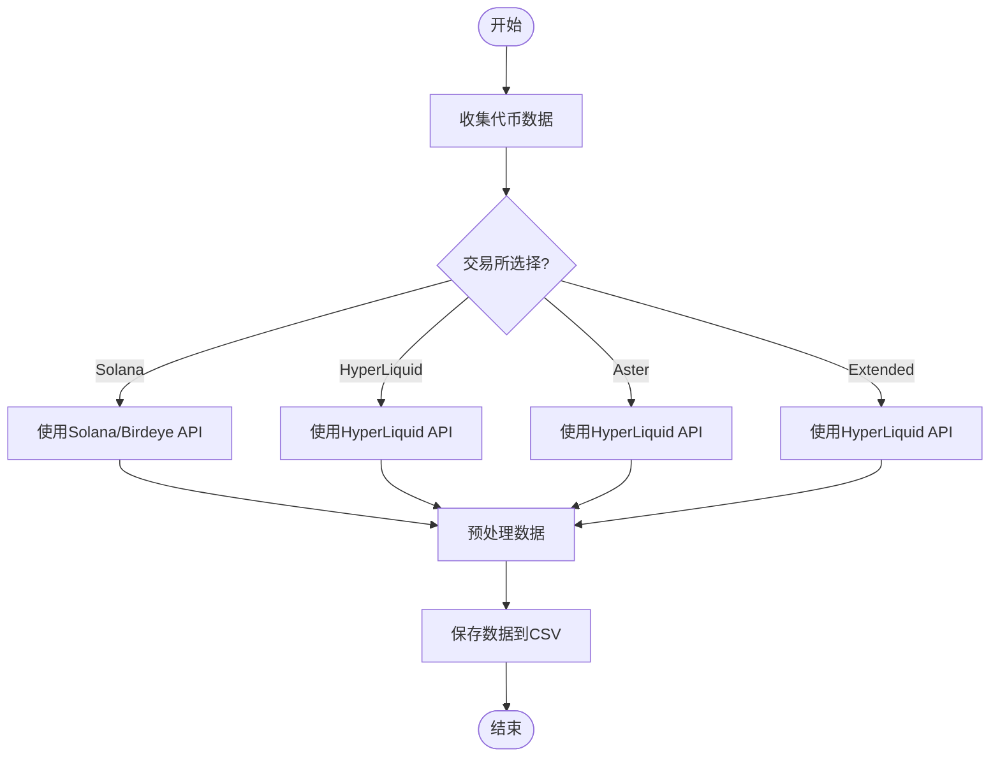
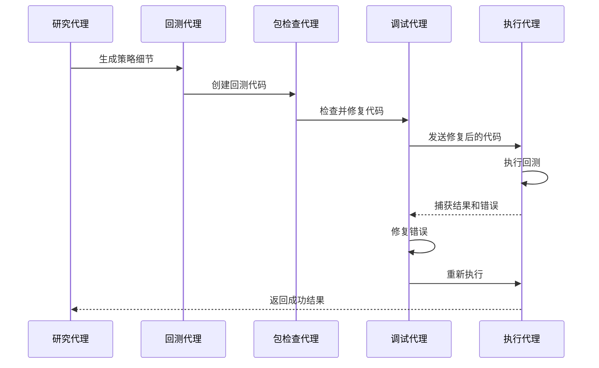
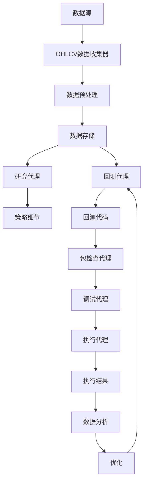
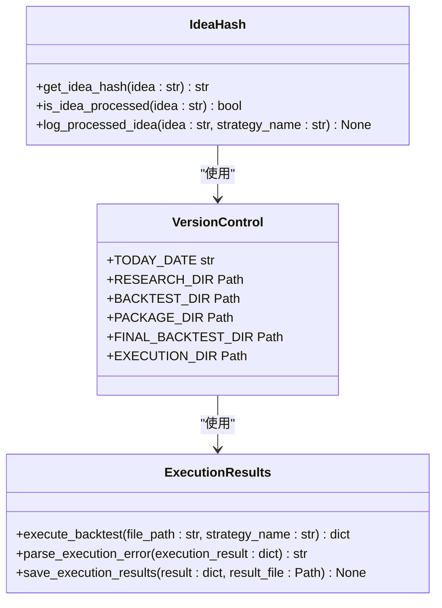

# 数据管理

<cite>
**本文档引用的文件**   
- [ohlcv_collector.py](file://src/data/ohlcv_collector.py)
- [rbi.md](file://src/agents/rbi.md)
- [rbi_agent.py](file://src/agents/rbi_agent.py)
- [rbi_agent_pp.py](file://src/agents/rbi_agent_pp.py)
- [rbi_agent_v2.py](file://src/agents/rbi_agent_v2.py)
- [rbi_agent_v3.py](file://src/agents/rbi_agent_v3.py)
- [guidelines.txt](file://src/data/ohlcv/guidelines.txt)
- [execution_results](file://src/data/execution_results)
- [nice_funcs.py](file://src/nice_funcs.py)
- [nice_funcs_hyperliquid.py](file://src/nice_funcs_hyperliquid.py)
</cite>

## 目录
1. [引言](#引言)
2. [OHLCV数据收集与预处理](#ohlcv数据收集与预处理)
3. [RBI流程演进分析](#rbi流程演进分析)
4. [研究-回测-实施流程](#研究-回测-实施流程)
5. [数据组织与管理](#数据组织与管理)
6. [数据流图](#数据流图)
7. [数据一致性与版本控制](#数据一致性与版本控制)
8. [大规模数据集性能优化](#大规模数据集性能优化)
9. [结论](#结论)

## 引言
本文档详细阐述了AI交易系统中的数据管理模块，重点分析了`ohlcv_collector.py`如何从多个数据源收集和预处理OHLCV市场数据，以及RBI（研究-回测-实施）流程在`rbi/`、`rbi_pp/`、`rbi_v2/`和`rbi_v3/`目录中的实现。文档深入探讨了不同版本间的演进和优化，解释了研究资料、回测结果和执行数据的组织结构和管理方法。通过数据流图展示了数据从采集到分析的完整路径，并讨论了数据一致性、版本控制和备份恢复策略。最后，提供了处理大规模数据集的性能优化建议。

**Section sources**
- [rbi.md](file://src/agents/rbi.md#L1-L264)

## OHLCV数据收集与预处理
`ohlcv_collector.py`是系统的核心数据收集模块，负责从多个数据源获取OHLCV（开盘价、最高价、最低价、收盘价、成交量）市场数据。该模块通过`collect_token_data`函数实现，支持多种交易所和数据源，包括Solana、Aster、HyperLiquid和Extended。

数据收集过程首先根据指定的时间框架和回溯天数计算所需的数据条数。然后，根据指定的交易所路由到相应的数据源。对于HyperLiquid、Aster和Extended，使用HyperLiquid API获取数据；对于Solana，则使用Solana/Birdeye API。收集到的数据经过预处理，包括清洗列名、删除未命名列、映射列名以匹配回测要求，并将日期时间列转换为适当的日期时间类型。

预处理后的数据可以保存到CSV文件中，以便后续分析和回测使用。该模块还提供了`collect_all_tokens`函数，用于批量收集多个代币的数据，提高了数据收集的效率。

**Diagram sources **
- [ohlcv_collector.py](file://src/data/ohlcv_collector.py#L1-L129)

**Section sources**
- [ohlcv_collector.py](file://src/data/ohlcv_collector.py#L1-L129)
- [nice_funcs.py](file://src/nice_funcs.py#L1-L1000)
- [nice_funcs_hyperliquid.py](file://src/nice_funcs_hyperliquid.py#L1-L1000)

## RBI流程演进分析
RBI（研究-回测-实施）流程在`rbi/`、`rbi_pp/`、`rbi_v2/`和`rbi_v3/`目录中经历了多个版本的演进，每个版本都引入了新的功能和优化。

- **rbi/**: 初始版本，实现了基本的研究、回测和调试流程。该版本通过`rbi_agent.py`文件中的`research_strategy`、`create_backtest`、`package_check`和`debug_backtest`函数，完成了从研究到回测的自动化流程。
- **rbi_pp/**: 并行处理版本，通过`rbi_agent_pp.py`文件中的`ThreadPoolExecutor`实现了多线程并行处理。该版本可以同时处理多个交易想法，显著提高了处理速度。
- **rbi_v2/**: 执行循环版本，通过`rbi_agent_v2.py`文件中的`execute_backtest`函数实现了自动执行回测和捕获结果的循环。该版本在回测失败时会自动发送到调试代理，直到成功执行。
- **rbi_v3/**: 优化循环版本，通过`rbi_agent_v3.py`文件中的`optimize_strategy`函数实现了持续优化策略的循环。该版本会不断优化策略，直到达到目标回报率。

这些版本的演进展示了系统从基本自动化到高级优化的逐步发展，每个版本都增加了新的功能，提高了系统的智能化和自动化水平。

**Section sources**
- [rbi_agent.py](file://src/agents/rbi_agent.py#L1-L1050)
- [rbi_agent_pp.py](file://src/agents/rbi_agent_pp.py#L1-L1314)
- [rbi_agent_v2.py](file://src/agents/rbi_agent_v2.py#L1-L874)
- [rbi_agent_v3.py](file://src/agents/rbi_agent_v3.py#L1-L1165)

## 研究-回测-实施流程
RBI（研究-回测-实施）流程是系统的核心工作流，通过多个代理协同工作，实现了从研究到实施的自动化。该流程包括研究代理、回测代理、包检查代理、调试代理和执行代理。

研究代理负责分析交易策略内容并生成详细指令。回测代理创建回测实现代码。包检查代理确保代码不使用任何`backtesting.lib`导入或函数。调试代理修复技术问题而不改变策略逻辑。执行代理在隔离环境中运行回测，捕获结果和错误。

该流程通过`rbi_agent.py`文件中的`process_trading_idea`函数实现，该函数依次调用各个代理，完成从研究到实施的完整流程。`rbi_v2.py`和`rbi_v3.py`文件中的`process_trading_idea_with_execution`函数进一步扩展了该流程，增加了执行和优化循环。

**Diagram sources **
- [rbi_agent.py](file://src/agents/rbi_agent.py#L1-L1050)
- [rbi_agent_v2.py](file://src/agents/rbi_agent_v2.py#L1-L874)
- [rbi_agent_v3.py](file://src/agents/rbi_agent_v3.py#L1-L1165)

**Section sources**
- [rbi_agent.py](file://src/agents/rbi_agent.py#L1-L1050)
- [rbi_agent_v2.py](file://src/agents/rbi_agent_v2.py#L1-L874)
- [rbi_agent_v3.py](file://src/agents/rbi_agent_v3.py#L1-L1165)

## 数据组织与管理
系统通过精心设计的目录结构和文件命名规则，实现了研究资料、回测结果和执行数据的有效组织和管理。每个版本的RBI流程都有独立的目录，如`rbi/`、`rbi_pp/`、`rbi_v2/`和`rbi_v3/`，每个目录下包含按日期组织的子目录。

每个日期目录下包含多个子目录，如`research/`、`backtests/`、`backtests_package/`、`backtests_final/`、`charts/`和`execution_results/`，分别存储研究输出、初始回测代码、包检查后的代码、调试后的代码、图表和执行结果。这种结构化的组织方式使得数据易于查找和管理。

文件命名规则也经过精心设计，使用策略名称和版本号来区分不同的回测代码和结果文件。例如，`AdaptiveBreakout_BT.py`表示初始回测代码，`AdaptiveBreakout_PKG.py`表示包检查后的代码，`AdaptiveBreakout_BTFinal.py`表示调试后的代码。

**Section sources**
- [rbi_agent.py](file://src/agents/rbi_agent.py#L1-L1050)
- [rbi_agent_pp.py](file://src/agents/rbi_agent_pp.py#L1-L1314)
- [rbi_agent_v2.py](file://src/agents/rbi_agent_v2.py#L1-L874)
- [rbi_agent_v3.py](file://src/agents/rbi_agent_v3.py#L1-L1165)

## 数据流图
数据流图展示了数据从采集到分析的完整路径。数据首先通过`ohlcv_collector.py`从多个数据源收集，然后经过预处理和格式化，存储到CSV文件中。这些数据被RBI流程中的各个代理使用，生成研究资料、回测代码和执行结果。

研究代理使用数据生成策略细节，回测代理使用数据创建回测代码，包检查代理和调试代理使用数据检查和修复代码，执行代理使用数据执行回测并捕获结果。最终，所有数据和结果被组织和管理在相应的目录中，供后续分析和优化使用。

**Diagram sources **
- [ohlcv_collector.py](file://src/data/ohlcv_collector.py#L1-L129)
- [rbi_agent.py](file://src/agents/rbi_agent.py#L1-L1050)
- [rbi_agent_v2.py](file://src/agents/rbi_agent_v2.py#L1-L874)
- [rbi_agent_v3.py](file://src/agents/rbi_agent_v3.py#L1-L1165)

**Section sources**
- [ohlcv_collector.py](file://src/data/ohlcv_collector.py#L1-L129)
- [rbi_agent.py](file://src/agents/rbi_agent.py#L1-L1050)
- [rbi_agent_v2.py](file://src/agents/rbi_agent_v2.py#L1-L874)
- [rbi_agent_v3.py](file://src/agents/rbi_agent_v3.py#L1-L1165)

## 数据一致性与版本控制
系统通过多种机制确保数据一致性和版本控制。首先，通过`get_idea_hash`函数生成每个想法的唯一哈希值，用于跟踪处理状态，避免重复处理。其次，通过`log_processed_idea`函数记录已处理的想法，包括时间戳和策略名称，确保处理历史的可追溯性。

版本控制通过文件命名规则和目录结构实现。每个版本的RBI流程都有独立的目录，每个目录下包含按日期组织的子目录。文件命名规则使用策略名称和版本号来区分不同的回测代码和结果文件。此外，系统还通过`execution_results`目录存储每次执行的结果，包括成功和失败的回测，确保所有执行历史的完整记录。

**Diagram sources **
- [rbi_agent.py](file://src/agents/rbi_agent.py#L1-L1050)
- [rbi_agent_pp.py](file://src/agents/rbi_agent_pp.py#L1-L1314)
- [rbi_agent_v2.py](file://src/agents/rbi_agent_v2.py#L1-L874)
- [rbi_agent_v3.py](file://src/agents/rbi_agent_v3.py#L1-L1165)

**Section sources**
- [rbi_agent.py](file://src/agents/rbi_agent.py#L1-L1050)
- [rbi_agent_pp.py](file://src/agents/rbi_agent_pp.py#L1-L1314)
- [rbi_agent_v2.py](file://src/agents/rbi_agent_v2.py#L1-L874)
- [rbi_agent_v3.py](file://src/agents/rbi_agent_v3.py#L1-L1165)

## 大规模数据集性能优化
处理大规模数据集时，系统通过多种策略进行性能优化。首先，通过并行处理提高数据收集和回测的效率。`rbi_agent_pp.py`文件中的`ThreadPoolExecutor`实现了多线程并行处理，可以同时处理多个交易想法。

其次，通过缓存机制减少重复数据收集。`ohlcv_collector.py`文件中的`collect_token_data`函数在收集数据后会将数据保存到CSV文件中，下次使用时可以直接从文件读取，避免重复API调用。

此外，系统还通过资源限制和超时保护确保执行安全。`rbi_agent_v2.py`和`rbi_agent_v3.py`文件中的`execute_backtest`函数设置了最大内存、CPU和执行时间限制，防止资源耗尽和无限循环。

**Section sources**
- [rbi_agent_pp.py](file://src/agents/rbi_agent_pp.py#L1-L1314)
- [ohlcv_collector.py](file://src/data/ohlcv_collector.py#L1-L129)
- [rbi_agent_v2.py](file://src/agents/rbi_agent_v2.py#L1-L874)
- [rbi_agent_v3.py](file://src/agents/rbi_agent_v3.py#L1-L1165)

## 结论
本文档详细分析了AI交易系统中的数据管理模块，重点阐述了`ohlcv_collector.py`如何从多个数据源收集和预处理OHLCV市场数据，以及RBI（研究-回测-实施）流程在`rbi/`、`rbi_pp/`、`rbi_v2/`和`rbi_v3/`目录中的实现。通过数据流图展示了数据从采集到分析的完整路径，并讨论了数据一致性、版本控制和备份恢复策略。最后，提供了处理大规模数据集的性能优化建议。这些分析和建议为系统的进一步优化和扩展提供了坚实的基础。