# 核心组件

<cite>
**本文档中引用的文件**
- [base_agent.py](file://src/agents/base_agent.py)
- [trading_agent.py](file://src/agents/trading_agent.py)
- [risk_agent.py](file://src/agents/risk_agent.py)
- [strategy_agent.py](file://src/agents/strategy_agent.py)
- [swarm_agent.py](file://src/agents/swarm_agent.py)
- [model_factory.py](file://src/models/model_factory.py)
- [exchange_manager.py](file://src/exchange_manager.py)
- [base_strategy.py](file://src/strategies/base_strategy.py)
- [main.py](file://src/main.py)
- [config.py](file://src/config.py)
</cite>

## 目录
1. [简介](#简介)
2. [项目结构概览](#项目结构概览)
3. [代理系统架构](#代理系统架构)
4. [模型工厂设计](#模型工厂设计)
5. [数据管理模块](#数据管理模块)
6. [策略引擎](#策略引擎)
7. [执行系统](#执行系统)
8. [组件间集成](#组件间集成)
9. [总结](#总结)

## 简介

Moon Dev AI代理系统是一个基于人工智能的自动化交易平台，采用模块化架构设计，集成了多个智能代理、统一的模型工厂、灵活的数据管理系统和强大的执行引擎。该系统通过协作式AI代理网络实现复杂的交易决策、风险管理和策略执行。

## 项目结构概览

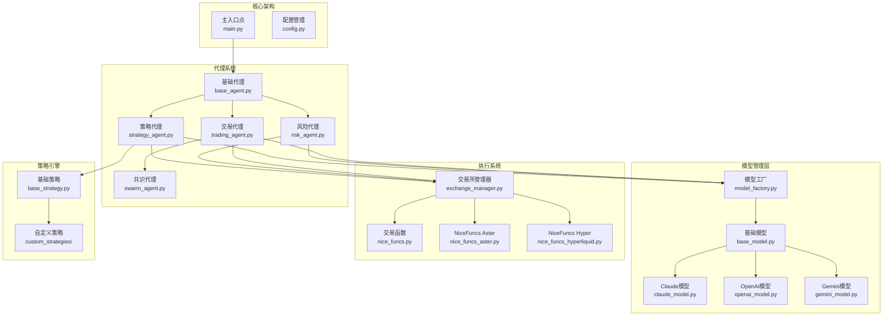

**图表来源**
- [main.py](file://src/main.py#L1-L104)
- [base_agent.py](file://src/agents/base_agent.py#L1-L58)
- [model_factory.py](file://src/models/model_factory.py#L1-L261)
- [exchange_manager.py](file://src/exchange_manager.py#L1-L382)

## 代理系统架构

### BaseAgent：所有代理的基类

BaseAgent是整个代理系统的核心基类，为所有具体代理提供统一的基础功能和接口。

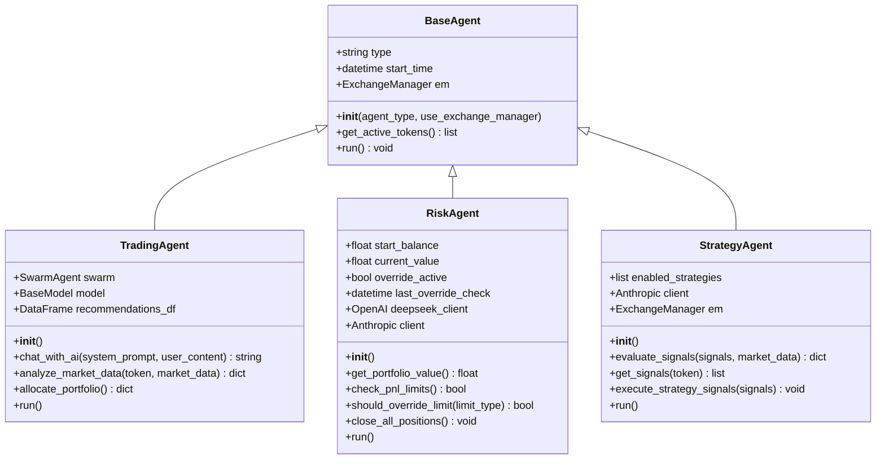

**图表来源**
- [base_agent.py](file://src/agents/base_agent.py#L12-L58)
- [trading_agent.py](file://src/agents/trading_agent.py#L442-L499)
- [risk_agent.py](file://src/agents/risk_agent.py#L50-L120)
- [strategy_agent.py](file://src/agents/strategy_agent.py#L40-L80)

### TradingAgent：智能交易决策代理

TradingAgent是系统的核心交易决策组件，支持单模型和多模型共识两种运行模式。

#### 主要特性：
- **双模式运行**：单模型快速决策（约10秒）和多模型共识决策（约45-60秒）
- **多交易所支持**：支持Solana、HyperLiquid和Aster DEX
- **智能仓位管理**：基于AI的仓位分配和风险管理
- **实时监控**：自动止损和止盈机制

#### 运行流程：

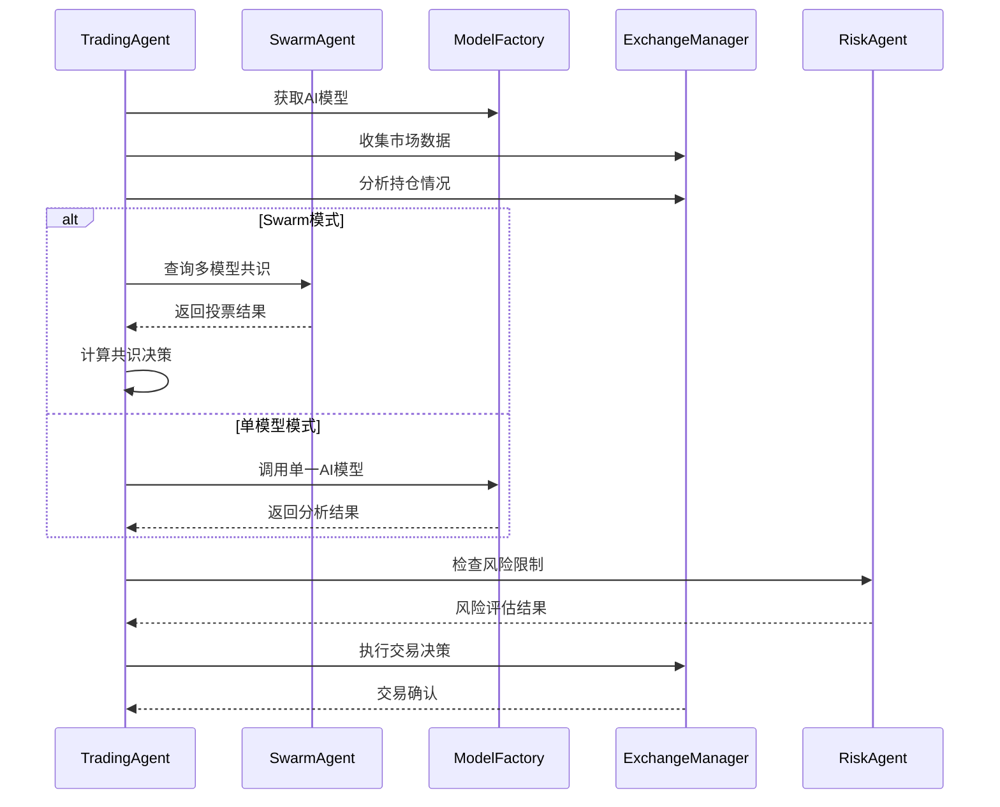

**图表来源**
- [trading_agent.py](file://src/agents/trading_agent.py#L442-L499)
- [swarm_agent.py](file://src/agents/swarm_agent.py#L116-L504)

**节来源**
- [trading_agent.py](file://src/agents/trading_agent.py#L1-L799)

### RiskAgent：风险管理系统

RiskAgent负责全面的风险控制和管理，确保交易活动在安全范围内进行。

#### 核心功能：
- **PnL限制监控**：跟踪每日损益百分比和绝对值限制
- **最小余额保护**：防止账户余额低于安全阈值
- **AI辅助决策**：使用AI分析市场状况决定是否突破限制
- **自动仓位关闭**：在达到风险限制时自动平仓

#### 风险检查流程：

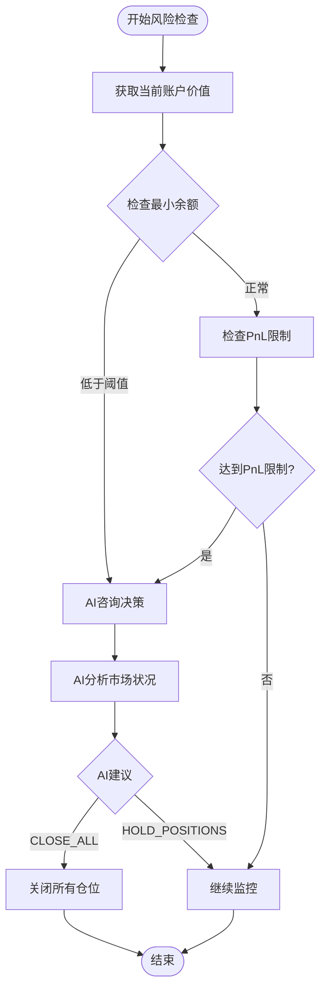

**图表来源**
- [risk_agent.py](file://src/agents/risk_agent.py#L500-L631)

**节来源**
- [risk_agent.py](file://src/agents/risk_agent.py#L1-L631)

### StrategyAgent：策略执行代理

StrategyAgent专注于基于技术指标和策略信号的交易决策，结合LLM评估提高决策质量。

#### 策略处理流程：

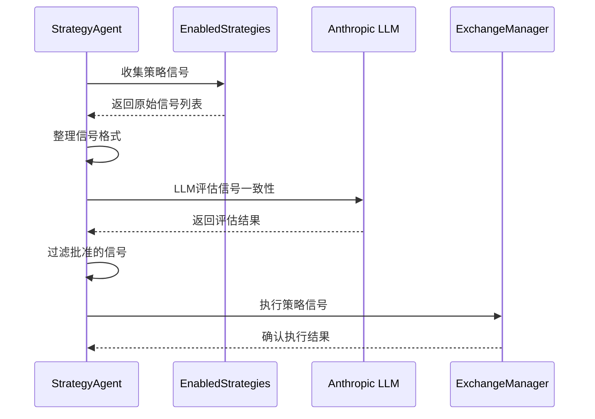

**图表来源**
- [strategy_agent.py](file://src/agents/strategy_agent.py#L100-L200)

**节来源**
- [strategy_agent.py](file://src/agents/strategy_agent.py#L1-L305)

### SwarmAgent：多模型共识系统

SwarmAgent实现了多AI模型的并行查询和共识生成机制，提供更可靠和多样化的决策支持。

#### 多模型并行查询：

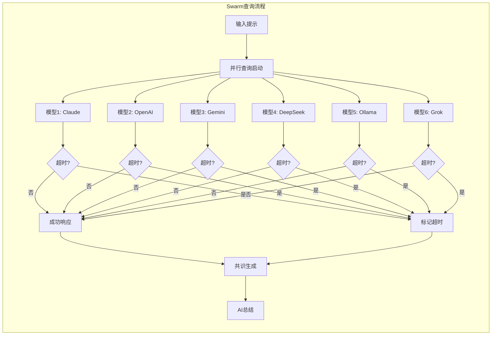

**图表来源**
- [swarm_agent.py](file://src/agents/swarm_agent.py#L200-L400)

**节来源**
- [swarm_agent.py](file://src/agents/swarm_agent.py#L1-L567)

## 模型工厂设计

ModelFactory采用了工厂模式和单例模式的组合设计，统一管理多种AI模型的初始化、配置和使用。

### 工厂模式实现

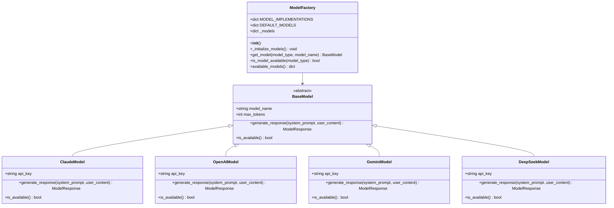

**图表来源**
- [model_factory.py](file://src/models/model_factory.py#L20-L100)

### 单例模式保证

ModelFactory通过全局变量`model_factory`确保在整个应用中只有一个实例存在，避免重复初始化和资源浪费。

#### 初始化流程：

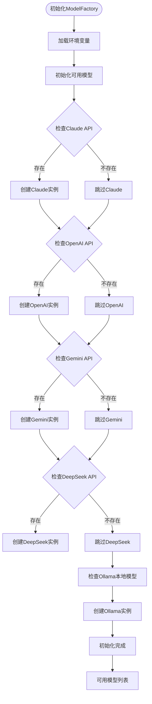

**图表来源**
- [model_factory.py](file://src/models/model_factory.py#L60-L150)

**节来源**
- [model_factory.py](file://src/models/model_factory.py#L1-L261)

## 数据管理模块

数据管理模块负责市场数据的收集、存储和处理，为各个代理提供高质量的数据支持。

### 市场数据收集

系统支持多种数据源和时间框架的数据收集：

| 数据类型 | 时间范围 | 时间框架 | 存储位置 |
|---------|---------|---------|---------|
| OHLCV数据 | 3天历史 | 1H, 15m, 5m等 | 内存/临时文件 |
| 交易信号 | 实时 | 自定义 | 内存 |
| 研究资料 | 持久化 | 自定义 | JSON文件 |
| 回测结果 | 历史 | 自定义 | 结果目录 |

### 数据流处理

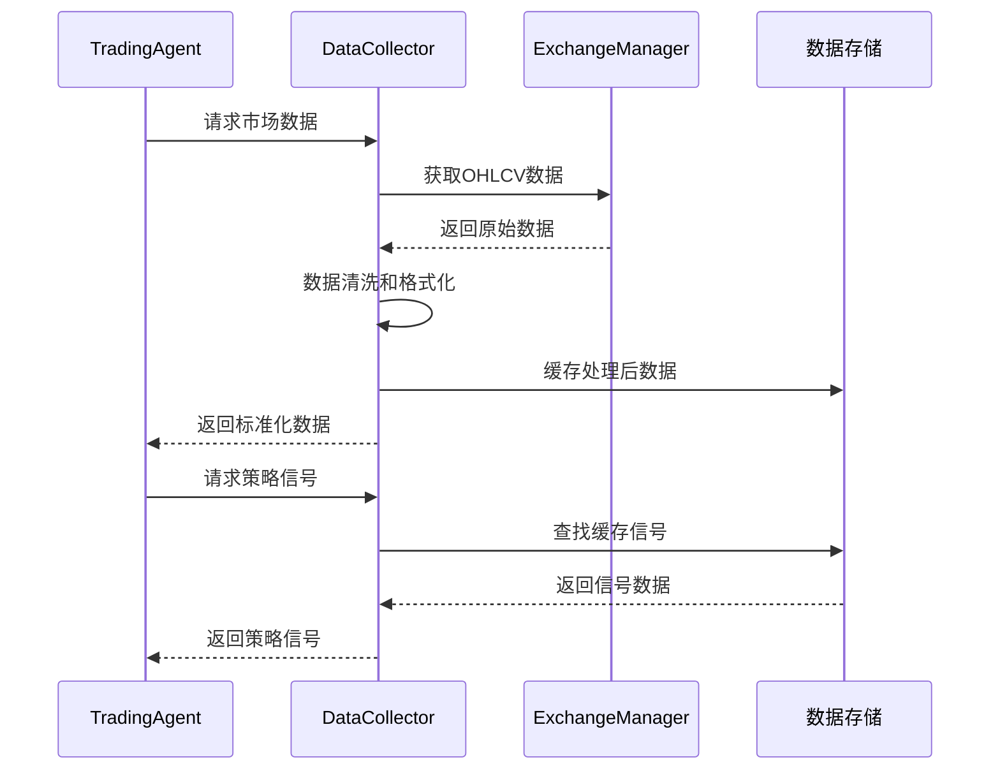

**图表来源**
- [trading_agent.py](file://src/agents/trading_agent.py#L574-L600)

## 策略引擎

策略引擎提供了灵活的策略开发和执行框架，支持多种技术分析方法和自定义策略。

### 策略架构

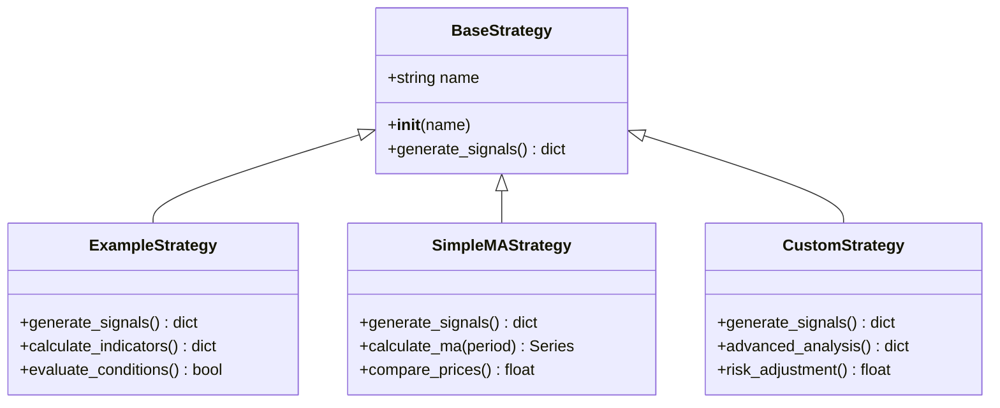

**图表来源**
- [base_strategy.py](file://src/strategies/base_strategy.py#L5-L21)

### 策略执行流程

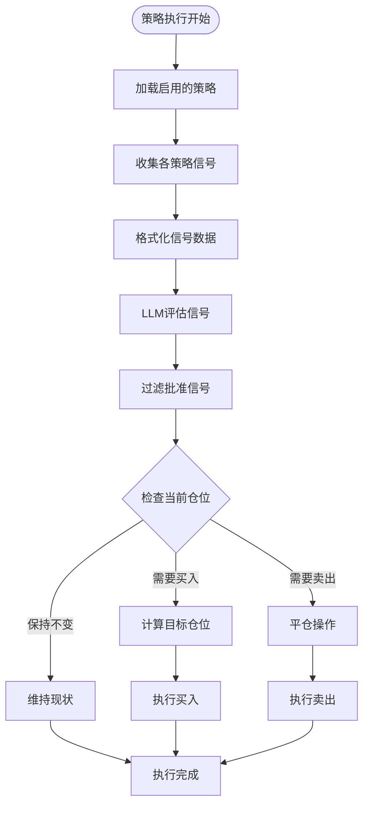

**图表来源**
- [strategy_agent.py](file://src/agents/strategy_agent.py#L100-L200)

**节来源**
- [base_strategy.py](file://src/strategies/base_strategy.py#L1-L21)

## 执行系统

执行系统负责与交易所的实际交互，执行交易订单并管理资金流动。

### ExchangeManager：统一交易所接口

ExchangeManager提供了统一的交易所抽象层，支持多个交易平台的一致性操作。

#### 支持的交易所：

| 交易所 | 交易类型 | 特殊功能 | 杠杆支持 |
|-------|---------|---------|---------|
| Solana | 现货交易 | 分块下单 | 不支持 |
| HyperLiquid | 永续合约 | 双向交易 | 支持1-50倍 |
| Aster DEX | 期货合约 | 双向交易 | 支持1-125倍 |

#### 交易执行流程：

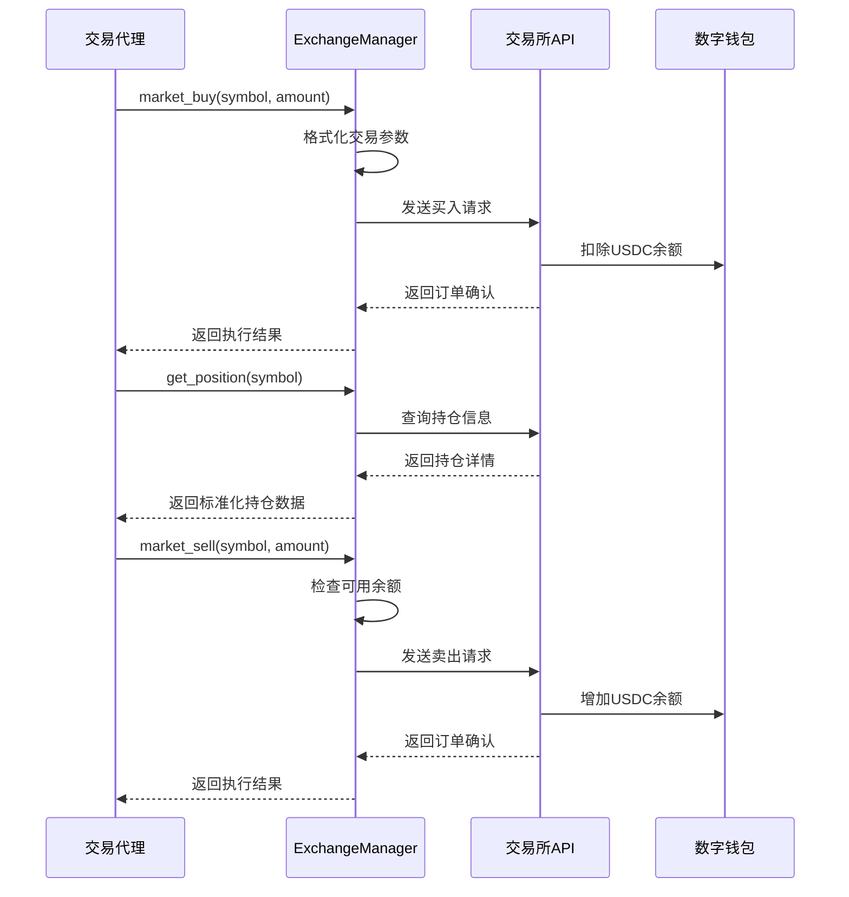

**图表来源**
- [exchange_manager.py](file://src/exchange_manager.py#L50-L150)

**节来源**
- [exchange_manager.py](file://src/exchange_manager.py#L1-L382)

## 组件间集成

### 主循环协调

系统通过主循环协调各个代理的工作，确保整体系统的有序运行。

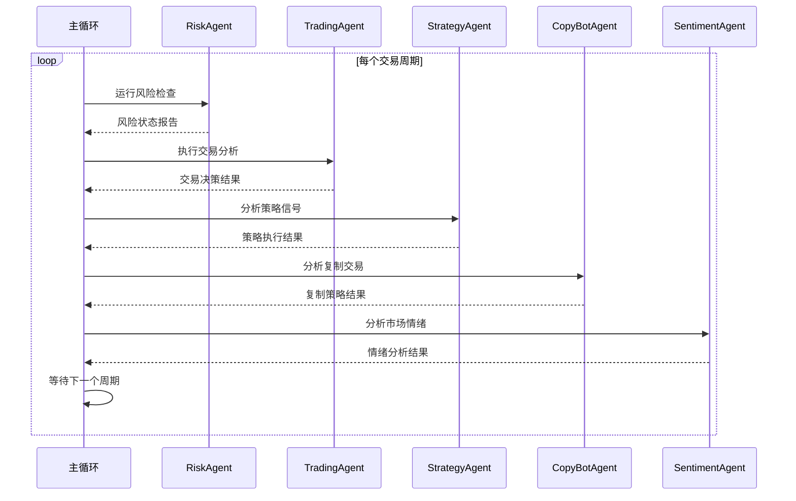

**图表来源**
- [main.py](file://src/main.py#L30-L80)

### 配置管理

系统通过集中式配置管理确保各个组件的一致性和可维护性。

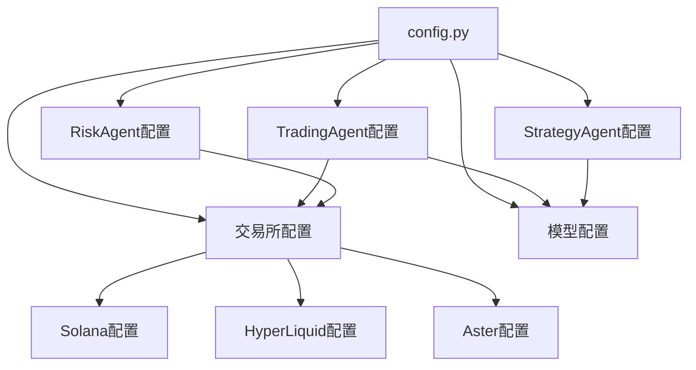

**图表来源**
- [config.py](file://src/config.py#L1-L136)

**节来源**
- [main.py](file://src/main.py#L1-L104)
- [config.py](file://src/config.py#L1-L136)

## 总结

Moon Dev AI代理系统通过模块化架构设计实现了高度集成和可扩展的自动化交易解决方案。核心组件包括：

1. **代理系统**：提供专门的功能代理，包括交易决策、风险管理和策略执行
2. **模型工厂**：统一管理多种AI模型，支持动态配置和故障恢复
3. **数据管理**：高效的数据收集、处理和存储机制
4. **策略引擎**：灵活的策略开发和执行框架
5. **执行系统**：统一的交易所接口和交易执行能力

这种设计使得系统具有以下优势：
- **高可靠性**：多模型共识和完善的错误处理机制
- **高灵活性**：模块化设计支持功能扩展和定制
- **高性能**：并行处理和优化的数据流
- **易维护性**：清晰的架构分层和配置管理

系统通过智能代理协作、AI模型集成和统一的执行框架，为用户提供了一个强大而可靠的自动化交易平台。