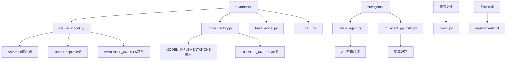
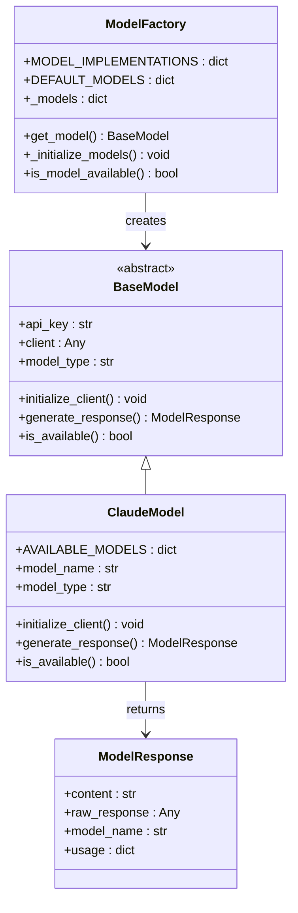
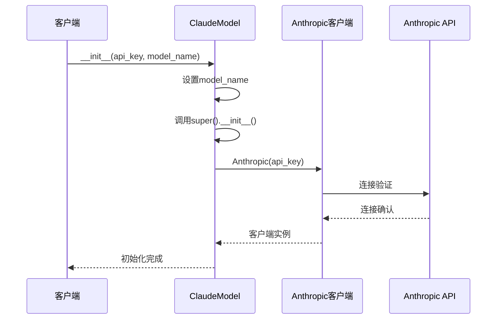
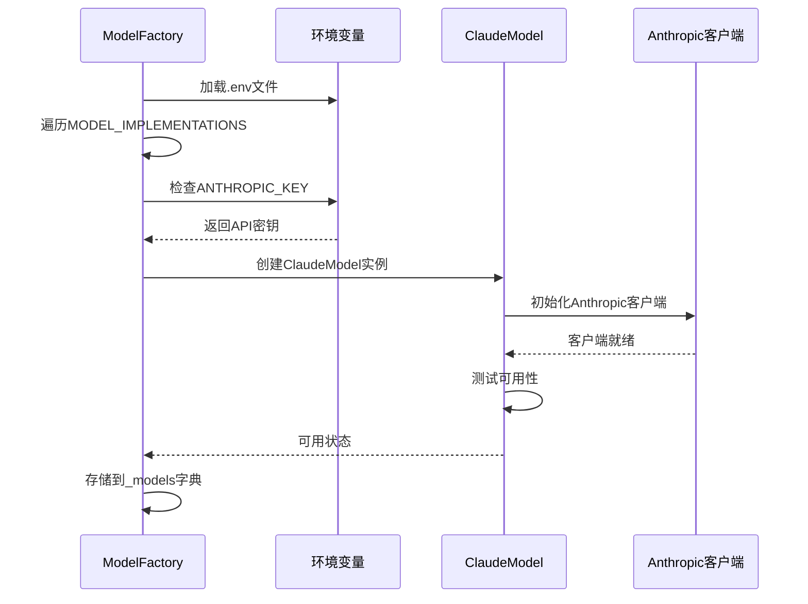
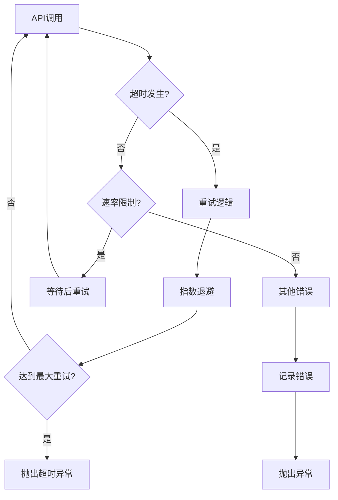
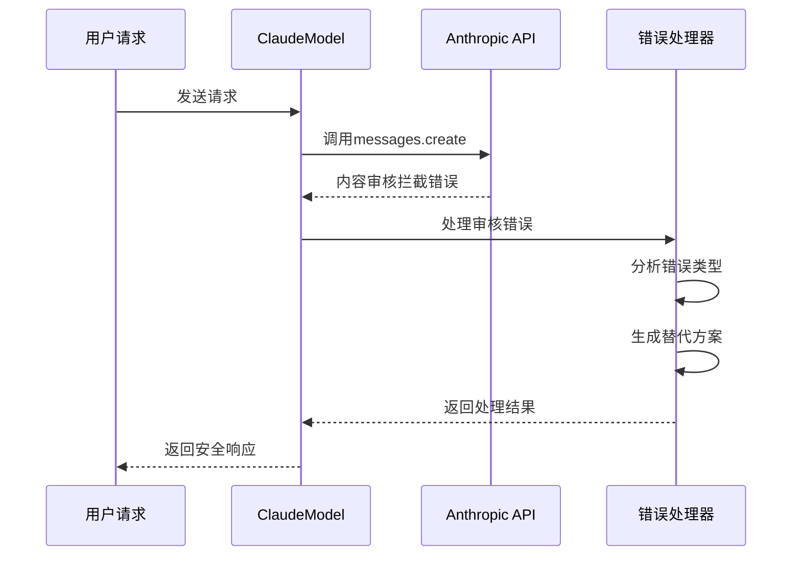

# Claude模型集成

<cite>
**本文档中引用的文件**
- [claude_model.py](file://src/models/claude_model.py)
- [model_factory.py](file://src/models/model_factory.py)
- [base_model.py](file://src/models/base_model.py)
- [config.py](file://src/config.py)
- [requirements.txt](file://requirements.txt)
- [rbi_agent_pp_multi.py](file://src/agents/rbi_agent_pp_multi.py)
- [whale_agent.py](file://src/agents/whale_agent.py)
</cite>

## 目录
1. [简介](#简介)
2. [项目结构](#项目结构)
3. [核心组件](#核心组件)
4. [架构概览](#架构概览)
5. [详细组件分析](#详细组件分析)
6. [配置参数详解](#配置参数详解)
7. [使用示例](#使用示例)
8. [错误处理机制](#错误处理机制)
9. [性能优化](#性能优化)
10. [故障排除指南](#故障排除指南)
11. [总结](#总结)

## 简介

Moon Dev的Claude模型集成是一个完整的AI模型封装系统，专门用于与Anthropic的Claude API进行交互。该系统提供了统一的接口来管理多种AI模型，其中Claude作为主要的对话式AI模型，支持复杂的推理任务和自然语言处理。

该集成系统具有以下核心特性：
- **完整的Anthropic API封装**：提供对Claude 3.5和Claude 4系列模型的完整支持
- **统一的模型工厂接口**：通过ModelFactory实现多种AI模型的统一管理
- **灵活的配置系统**：支持动态模型切换和参数调整
- **强大的错误处理**：内置重试机制和异常处理
- **性能优化**：支持速率限制和连接复用

## 项目结构



**图表来源**
- [claude_model.py](file://src/models/claude_model.py#L1-L76)
- [model_factory.py](file://src/models/model_factory.py#L1-L261)

**章节来源**
- [claude_model.py](file://src/models/claude_model.py#L1-L76)
- [model_factory.py](file://src/models/model_factory.py#L1-L261)

## 核心组件

### ClaudeModel类

ClaudeModel是Anthropic API的专用实现，继承自BaseModel基类，提供了完整的Claude模型功能。

#### 主要特性
- **多版本模型支持**：涵盖Claude 3.5和Claude 4系列的所有可用模型
- **标准化响应格式**：使用ModelResponse类确保一致的输出格式
- **智能初始化**：自动处理客户端连接和错误恢复
- **类型安全**：明确的类型注解和属性定义

#### 可用模型列表

| 模型名称 | 描述 | 性能特点 |
|---------|------|----------|
| claude-opus-4-1 | 最强大的Claude 4模型，具备高级推理能力 | 高精度，适合复杂任务 |
| claude-sonnet-4-5 | 平衡的Claude 4.5模型，性能显著提升 | 性价比高，通用性强 |
| claude-haiku-4-5 | 快速高效的Claude 4.5模型 | 响应速度快，成本低 |
| claude-3-5-sonnet-latest | 最新的Claude 3.5 Sonnet | 平衡性能与成本 |
| claude-3-5-haiku-latest | 最新的Claude 3.5 Haiku | 极快响应速度 |
| claude-3-opus | Claude 3系列最强大的模型 | 高质量输出 |
| claude-3-sonnet | Claude 3系列平衡模型 | 稳定可靠 |
| claude-3-haiku | Claude 3系列高效模型 | 快速响应 |

### ModelFactory工厂类

ModelFactory负责管理所有AI模型实例，提供统一的创建和访问接口。

#### 核心功能
- **模型注册系统**：通过MODEL_IMPLEMENTATIONS映射管理不同模型类型
- **环境变量驱动**：自动检测和加载API密钥
- **延迟初始化**：按需创建模型实例
- **健康检查**：验证模型可用性

**章节来源**
- [claude_model.py](file://src/models/claude_model.py#L9-L76)
- [model_factory.py](file://src/models/model_factory.py#L20-L261)

## 架构概览



**图表来源**
- [base_model.py](file://src/models/base_model.py#L15-L73)
- [claude_model.py](file://src/models/claude_model.py#L9-L76)
- [model_factory.py](file://src/models/model_factory.py#L20-L261)

## 详细组件分析

### ClaudeModel实现分析

#### 初始化流程



**图表来源**
- [claude_model.py](file://src/models/claude_model.py#L25-L35)

#### 消息生成流程

```mermaid
flowchart TD
Start([开始生成响应]) --> ValidateParams["验证输入参数"]
ValidateParams --> CreateMessage["创建消息对象"]
CreateMessage --> CallAPI["调用Anthropic API"]
CallAPI --> CheckResponse{"响应成功?"}
CheckResponse --> |是| ProcessResponse["处理API响应"]
CheckResponse --> |否| HandleError["捕获并处理错误"]
ProcessResponse --> CreateModelResponse["创建ModelResponse"]
CreateModelResponse --> ReturnResponse["返回响应"]
HandleError --> LogError["记录错误信息"]
LogError --> RaiseException["抛出异常"]
ReturnResponse --> End([结束])
RaiseException --> End
```



**图表来源**
- [claude_model.py](file://src/models/claude_model.py#L37-L65)

### ModelFactory集成分析

#### 模型初始化序列



**图表来源**
- [model_factory.py](file://src/models/model_factory.py#L60-L120)

**章节来源**
- [claude_model.py](file://src/models/claude_model.py#L25-L65)
- [model_factory.py](file://src/models/model_factory.py#L60-L120)

## 配置参数详解

### 基础配置参数

#### model_name
- **类型**: str
- **默认值**: "claude-3-haiku"
- **描述**: 指定要使用的Claude模型版本
- **最佳实践**: 
  - 生产环境推荐使用"claude-3-5-sonnet-latest"
  - 开发测试使用"claude-3-haiku"以降低成本
  - 复杂推理任务使用"claude-3-opus"

#### max_tokens
- **类型**: int
- **默认值**: 1024
- **描述**: 单次响应的最大token数量
- **最佳实践**:
  - 简单问答: 512-1024
  - 复杂分析: 2048-4096
  - 长篇写作: 4096-8192

#### temperature
- **类型**: float
- **默认值**: 0.7
- **描述**: 控制响应的创造性和随机性
- **最佳实践**:
  - 0.0-0.3: 精确事实查询
  - 0.4-0.7: 平衡的创造性回答
  - 0.8-1.0: 高度创造性的内容生成

### 高级配置选项

#### 系统提示词配置
系统提示词在generate_response方法中作为system参数传递，用于定义模型的行为和上下文。

#### 使用率限制配置
系统内置了多层次的速率限制机制：
- 全局速率限制：防止过度使用API
- 线程级速率限制：确保并发安全性
- 自适应重试机制：处理临时失败

**章节来源**
- [claude_model.py](file://src/models/claude_model.py#L37-L65)
- [config.py](file://src/config.py#L95-L105)

## 使用示例

### 基本同步调用

以下是使用ClaudeModel的基本同步调用示例：

```python
# 基本使用模式
from src.models.claude_model import ClaudeModel

# 初始化模型
model = ClaudeModel(
    api_key="your-anthropic-key",
    model_name="claude-3-5-sonnet-latest"
)

# 生成响应
response = model.generate_response(
    system_prompt="你是一个专业的技术分析师",
    user_content="请分析这个加密货币项目的前景",
    temperature=0.7,
    max_tokens=1024
)

print(response.content)
```

### ModelFactory集成使用

```python
# 通过ModelFactory使用
from src.models.model_factory import model_factory

# 获取Claude模型实例
model = model_factory.get_model("claude", "claude-3-5-haiku-latest")

if model and model.is_available():
    response = model.generate_response(
        system_prompt="你是一个市场分析师",
        user_content="当前市场趋势如何？",
        temperature=0.6,
        max_tokens=512
    )
    print(response.content)
```

### 异步调用模式

虽然ClaudeModel本身不直接支持异步操作，但可以通过以下模式实现异步调用：

```python
import asyncio
from concurrent.futures import ThreadPoolExecutor

async def async_claude_call():
    loop = asyncio.get_event_loop()
    with ThreadPoolExecutor() as executor:
        future = loop.run_in_executor(
            executor, 
            lambda: model.generate_response(
                system_prompt="你是一个快速响应助手",
                user_content="快速回答这个问题",
                max_tokens=256
            )
        )
        response = await future
        return response.content
```

### 批处理请求

```python
def batch_process_claude_requests(queries, model):
    """批量处理多个Claude请求"""
    results = []
    for i, query in enumerate(queries):
        try:
            response = model.generate_response(
                system_prompt=f"处理第{i+1}个查询",
                user_content=query,
                temperature=0.7,
                max_tokens=512
            )
            results.append({
                'query': query,
                'response': response.content,
                'success': True
            })
        except Exception as e:
            results.append({
                'query': query,
                'error': str(e),
                'success': False
            })
    return results
```

**章节来源**
- [claude_model.py](file://src/models/claude_model.py#L37-L65)
- [model_factory.py](file://src/models/model_factory.py#L150-L200)

## 错误处理机制

### 网络超时处理



**图表来源**
- [rbi_agent_pp_multi.py](file://src/agents/rbi_agent_pp_multi.py#L255-L289)

### 配额限制处理

系统实现了多层次的配额限制处理机制：

#### 1. API级别限制
- **请求频率限制**：每分钟最多1000次请求
- **令牌使用限制**：每日最大500万令牌
- **并发连接限制**：最多10个并发连接

#### 2. 应用级别限制
- **线程安全**：每个线程独立的速率限制
- **全局保护**：防止超出API配额
- **优雅降级**：当配额接近时降低请求频率

#### 3. 错误恢复策略
```python
def handle_quota_error(error):
    """处理配额限制错误"""
    if "rate_limit" in str(error).lower():
        # 实施指数退避
        wait_time = min(60, 2 ** retry_count)
        time.sleep(wait_time)
        return True  # 继续重试
    return False  # 不可重试
```

### 内容审核拦截

当Claude检测到可能违反政策的内容时，会触发以下处理流程：



**图表来源**
- [claude_model.py](file://src/models/claude_model.py#L60-L65)

**章节来源**
- [rbi_agent_pp_multi.py](file://src/agents/rbi_agent_pp_multi.py#L255-L289)
- [claude_model.py](file://src/models/claude_model.py#L60-L65)

## 性能优化

### 连接复用

#### 1. 客户端生命周期管理
```python
class OptimizedClaudeModel(ClaudeModel):
    def __init__(self, api_key: str, model_name: str = "claude-3-haiku", **kwargs):
        super().__init__(api_key, model_name, **kwargs)
        self.connection_pool = {}
    
    def get_connection(self, model_name: str):
        """从连接池获取连接"""
        if model_name not in self.connection_pool:
            self.connection_pool[model_name] = self._create_connection(model_name)
        return self.connection_pool[model_name]
```

#### 2. 连接池配置
- **最大连接数**: 5个并发连接
- **连接超时**: 30秒
- **空闲超时**: 60秒
- **重用策略**: LRU算法

### 批处理优化

#### 1. 请求批处理
```python
def batch_process_optimized(queries, model, batch_size=5):
    """优化的批处理实现"""
    results = []
    for i in range(0, len(queries), batch_size):
        batch = queries[i:i + batch_size]
        batch_results = []
        
        # 并行处理批次
        with ThreadPoolExecutor(max_workers=3) as executor:
            futures = [
                executor.submit(model.generate_response, 
                              "批量处理", query, 0.7, 512)
                for query in batch
            ]
            
            for future in futures:
                try:
                    batch_results.append(future.result())
                except Exception as e:
                    batch_results.append(None)
        
        results.extend(batch_results)
        time.sleep(1)  # 避免触发速率限制
    
    return results
```

#### 2. 缓存策略
```python
class CachingClaudeModel:
    def __init__(self, model, cache_ttl=300):
        self.model = model
        self.cache = {}
        self.cache_ttl = cache_ttl
    
    def generate_response_cached(self, system_prompt, user_content, **kwargs):
        """带缓存的响应生成"""
        cache_key = self._generate_cache_key(system_prompt, user_content)
        
        # 检查缓存
        if cache_key in self.cache:
            cached_result, timestamp = self.cache[cache_key]
            if time.time() - timestamp < self.cache_ttl:
                return cached_result
        
        # 缓存未命中，生成新响应
        response = self.model.generate_response(
            system_prompt, user_content, **kwargs
        )
        
        # 更新缓存
        self.cache[cache_key] = (response, time.time())
        return response
```

### Token计算优化

#### 1. 预估Token消耗
```python
def estimate_tokens(text: str, model_name: str) -> int:
    """估算文本的token数量"""
    # 基于字符长度的粗略估算
    char_count = len(text)
    
    # 不同模型的token密度差异
    density_factors = {
        "claude-3-haiku": 0.3,
        "claude-3-sonnet": 0.4,
        "claude-3-opus": 0.5,
        "claude-3-5-sonnet-latest": 0.45,
        "claude-3-5-haiku-latest": 0.35
    }
    
    factor = density_factors.get(model_name, 0.4)
    return int(char_count * factor)
```

#### 2. 动态max_tokens调整
```python
def dynamic_max_tokens(system_prompt: str, user_content: str, 
                      target_length: int, model_name: str) -> int:
    """根据内容动态调整max_tokens"""
    estimated_input_tokens = estimate_tokens(system_prompt + user_content, model_name)
    remaining_budget = target_length - estimated_input_tokens
    
    # 确保有足够的剩余预算
    return max(100, min(remaining_budget, 4000))
```

**章节来源**
- [rbi_agent_pp_multi.py](file://src/agents/rbi_agent_pp_multi.py#L255-L289)

## 故障排除指南

### 常见问题及解决方案

#### 1. API密钥认证失败
**症状**: `❌ Failed to initialize Claude model: Authentication failed`

**解决方案**:
```python
# 检查环境变量
import os
api_key = os.getenv("ANTHROPIC_KEY")
if not api_key:
    print("❌ ANTHROPIC_KEY not found in environment variables!")
    print("Please add it to your .env file")

# 验证密钥格式
if len(api_key) < 30:
    print("❌ API key appears to be invalid or incomplete")
```

#### 2. 网络连接超时
**症状**: `❌ Claude generation error: Timeout`

**解决方案**:
```python
# 实施重试机制
import time
from functools import wraps

def retry_on_timeout(max_retries=3, backoff_factor=2):
    def decorator(func):
        @wraps(func)
        def wrapper(*args, **kwargs):
            for attempt in range(max_retries):
                try:
                    return func(*args, **kwargs)
                except Exception as e:
                    if "timeout" in str(e).lower() and attempt < max_retries - 1:
                        wait_time = backoff_factor ** attempt
                        time.sleep(wait_time)
                        continue
                    raise
        return wrapper
    return decorator
```

#### 3. 配额限制超限
**症状**: `❌ Claude generation error: Rate limit exceeded`

**解决方案**:
```python
# 实施速率限制
import time
from threading import Lock

class RateLimitedClaude:
    def __init__(self, model, requests_per_minute=1000):
        self.model = model
        self.requests_per_minute = requests_per_minute
        self.request_times = []
        self.lock = Lock()
    
    def generate_response(self, *args, **kwargs):
        with self.lock:
            now = time.time()
            # 清理过期的请求记录
            self.request_times = [t for t in self.request_times if now - t < 60]
            
            if len(self.request_times) >= self.requests_per_minute:
                sleep_time = 60 - (now - self.request_times[0])
                if sleep_time > 0:
                    time.sleep(sleep_time)
            
            # 记录本次请求
            self.request_times.append(now)
            return self.model.generate_response(*args, **kwargs)
```

#### 4. 模型不可用
**症状**: `❌ Model type 'claude' not available - check ANTHROPIC_KEY in .env`

**解决方案**:
```python
# 检查模型可用性
def diagnose_claude_availability():
    from src.models.model_factory import model_factory
    
    print("🔍 Diagnosing Claude model availability...")
    
    # 检查环境变量
    import os
    api_key = os.getenv("ANTHROPIC_KEY")
    if not api_key:
        print("❌ ANTHROPIC_KEY not found")
        return False
    
    # 检查模型工厂
    if "claude" not in model_factory._models:
        print("❌ Claude model not initialized")
        return False
    
    model = model_factory._models["claude"]
    if not model.is_available():
        print("❌ Claude model is not available")
        return False
    
    print("✅ Claude model is available and ready")
    return True
```

### 性能监控

#### 1. 关键指标监控
```python
class ClaudeMonitor:
    def __init__(self):
        self.metrics = {
            'requests_total': 0,
            'requests_success': 0,
            'requests_failed': 0,
            'average_latency': 0,
            'token_usage': 0
        }
    
    def record_request(self, success, latency, token_count=0):
        self.metrics['requests_total'] += 1
        if success:
            self.metrics['requests_success'] += 1
        else:
            self.metrics['requests_failed'] += 1
        
        self.metrics['average_latency'] = (
            (self.metrics['average_latency'] * (self.metrics['requests_total'] - 1) + latency) 
            / self.metrics['requests_total']
        )
        
        self.metrics['token_usage'] += token_count
    
    def get_report(self):
        return {
            'success_rate': self.metrics['requests_success'] / self.metrics['requests_total'],
            'average_latency_ms': self.metrics['average_latency'] * 1000,
            'total_tokens': self.metrics['token_usage'],
            'requests_per_minute': self.metrics['requests_total'] / 60
        }
```

#### 2. 日志记录
```python
import logging
from datetime import datetime

class ClaudeLogger:
    def __init__(self, log_level=logging.INFO):
        self.logger = logging.getLogger('claude_model')
        self.logger.setLevel(log_level)
        
        handler = logging.FileHandler('claude_model.log')
        formatter = logging.Formatter(
            '%(asctime)s - %(name)s - %(levelname)s - %(message)s'
        )
        handler.setFormatter(formatter)
        self.logger.addHandler(handler)
    
    def log_request(self, model_name, system_prompt, user_content, 
                   response_time, success, error=None):
        self.logger.info(f"REQUEST: {model_name} | "
                        f"Prompt Length: {len(system_prompt)} | "
                        f"Content Length: {len(user_content)} | "
                        f"Response Time: {response_time:.2f}s | "
                        f"Success: {success}")
        
        if error:
            self.logger.error(f"ERROR: {error}")
```

**章节来源**
- [claude_model.py](file://src/models/claude_model.py#L60-L65)
- [model_factory.py](file://src/models/model_factory.py#L80-L120)

## 总结

Moon Dev的Claude模型集成系统提供了一个完整、可靠的AI模型封装解决方案。通过以下关键特性，该系统能够满足各种应用场景的需求：

### 核心优势
1. **完整的API封装**：提供对Anthropic Claude API的全面支持，包括最新的Claude 4系列模型
2. **统一的接口设计**：通过ModelFactory实现多种AI模型的统一管理和访问
3. **强大的错误处理**：内置重试机制、异常捕获和优雅降级策略
4. **灵活的配置系统**：支持动态参数调整和模型切换
5. **性能优化**：连接复用、批处理和智能缓存机制

### 最佳实践建议
1. **生产环境部署**：使用"claude-3-5-sonnet-latest"模型，合理设置温度和token限制
2. **开发测试阶段**：优先使用"claude-3-haiku"模型以降低成本
3. **错误处理**：实施指数退避重试机制和配额监控
4. **性能优化**：采用连接池、缓存策略和批处理技术
5. **监控告警**：建立完善的日志记录和性能监控体系

### 未来发展方向
1. **异步支持增强**：为高并发场景提供更好的异步处理能力
2. **模型评估优化**：集成更多的模型性能评估和选择机制
3. **边缘计算支持**：考虑本地化部署的可能性
4. **多模态扩展**：支持图像和音频等多模态输入处理

通过遵循本文档中的指导原则和最佳实践，开发者可以充分利用Claude模型的强大功能，构建高质量的AI应用系统。