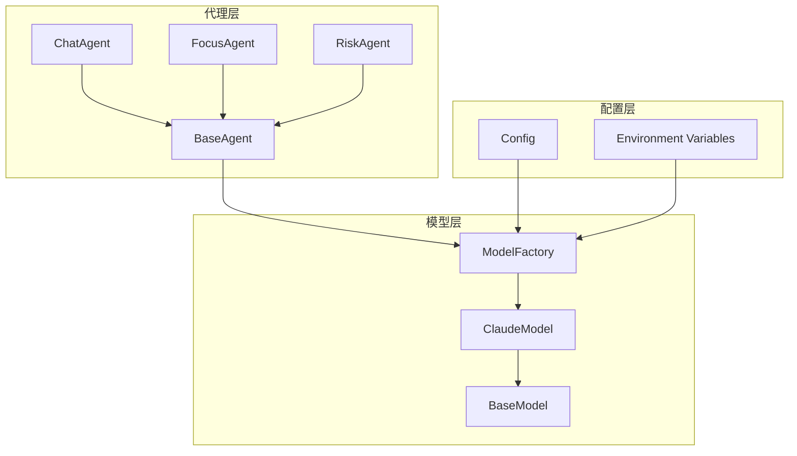
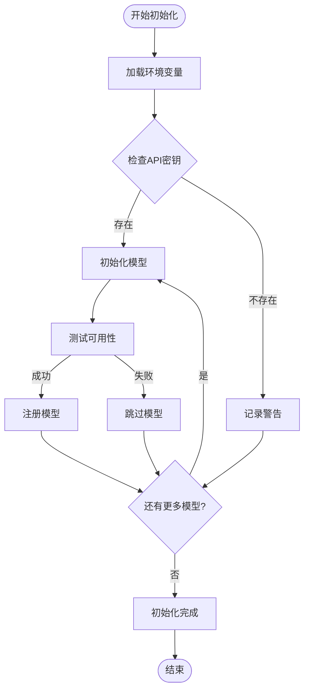

# 使用方法

<cite>
**本文档中引用的文件**
- [model_factory.py](file://src/models/model_factory.py)
- [claude_model.py](file://src/models/claude_model.py)
- [base_model.py](file://src/models/base_model.py)
- [base_agent.py](file://src/agents/base_agent.py)
- [chat_agent_ad.py](file://src/agents/chat_agent_ad.py)
- [rbi_agent.py](file://src/agents/rbi_agent.py)
- [focus_agent.py](file://src/agents/focus_agent.py)
- [risk_agent.py](file://src/agents/risk_agent.py)
- [chat_question_generator.py](file://src/agents/chat_question_generator.py)
- [polymarket_agent.py](file://src/agents/polymarket_agent.py)
- [config.py](file://src/config.py)
</cite>

## 目录
1. [简介](#简介)
2. [项目架构概览](#项目架构概览)
3. [ModelFactory基础](#modelfactory基础)
4. [Claude模型初始化](#claude模型初始化)
5. [消息格式与结构](#消息格式与结构)
6. [同步调用示例](#同步调用示例)
7. [异步调用与流式响应](#异步调用与流式响应)
8. [多轮对话与上下文管理](#多轮对话与上下文管理)
9. [长文本生成处理](#长文本生成处理)
10. [AI代理系统集成](#ai代理系统集成)
11. [最佳实践与优化建议](#最佳实践与优化建议)
12. [故障排除指南](#故障排除指南)

## 简介

本教程展示了如何在Moon Dev AI代理系统中使用Claude模型。该系统采用统一的ModelFactory模式管理多种AI模型，为开发者提供了简洁而强大的接口来集成Claude模型进行各种AI任务。

Claude模型作为Anthropic公司开发的先进语言模型，在代码生成、数据分析、实时聊天等场景中表现出色。通过本教程，您将学会如何：
- 通过ModelFactory获取Claude模型实例
- 实现同步和异步调用
- 处理多轮对话和上下文管理
- 优化长文本生成
- 在AI代理系统中集成Claude模型

## 项目架构概览

Moon Dev AI代理系统采用模块化设计，核心组件包括：



**图表来源**
- [model_factory.py](file://src/models/model_factory.py#L1-L50)
- [claude_model.py](file://src/models/claude_model.py#L1-L30)
- [base_agent.py](file://src/agents/base_agent.py#L1-L20)

**章节来源**
- [model_factory.py](file://src/models/model_factory.py#L1-L261)
- [base_model.py](file://src/models/base_model.py#L1-L73)

## ModelFactory基础

ModelFactory是整个系统的核心工厂类，负责管理和初始化所有可用的AI模型。它提供了统一的接口来获取特定类型的模型实例。

### 核心特性

ModelFactory具备以下关键特性：

| 特性 | 描述 | 默认值 |
|------|------|--------|
| 模型类型映射 | 将字符串标识符映射到具体实现类 | `{"claude": ClaudeModel}` |
| 默认模型配置 | 为每种模型类型提供默认配置 | `{"claude": "claude-3-5-haiku-latest"}` |
| 环境变量加载 | 自动从.env文件加载API密钥 | 支持多种模型提供商 |
| 可用性检测 | 自动检测模型是否可访问 | 健康检查机制 |

### 初始化流程



**图表来源**
- [model_factory.py](file://src/models/model_factory.py#L60-L120)

**章节来源**
- [model_factory.py](file://src/models/model_factory.py#L40-L150)

## Claude模型初始化

### 基础初始化

要使用Claude模型，首先需要通过ModelFactory获取模型实例：

```python
# 获取Claude模型实例
model = model_factory.get_model("claude", "claude-3-5-haiku-latest")
```

### 模型配置选项

Claude模型支持多种配置参数：

| 参数 | 类型 | 描述 | 默认值 |
|------|------|------|--------|
| `model_name` | str | 指定使用的Claude模型版本 | `"claude-3-5-haiku-latest"` |
| `temperature` | float | 控制输出的随机性和创造性 | `0.7` |
| `max_tokens` | int | 最大生成令牌数 | `1024` |
| `api_key` | str | Anthropic API密钥 | 必需 |

### 可用模型列表

Claude模型支持以下版本：

| 模型名称 | 性能特点 | 适用场景 |
|----------|----------|----------|
| `claude-3-5-haiku-latest` | 快速高效 | 日常对话、简单任务 |
| `claude-3-5-sonnet-latest` | 平衡性能 | 中等复杂度任务 |
| `claude-3-opus` | 强大推理能力 | 复杂分析、深度思考 |
| `claude-3-haiku` | 轻量快速 | 实时响应、轻量任务 |

**章节来源**
- [claude_model.py](file://src/models/claude_model.py#L10-L30)
- [model_factory.py](file://src/models/model_factory.py#L40-L50)

## 消息格式与结构

Claude模型的消息格式遵循标准的OpenAI格式，但具有特定的系统提示和角色定义。

### 基本消息结构

```python
messages = [
    {"role": "system", "content": "系统提示语"},
    {"role": "user", "content": "用户输入内容"}
]
```

### 消息格式规范

| 角色 | 内容类型 | 用途 | 示例 |
|------|----------|------|------|
| `system` | str | 定义模型行为和上下文 | `"你是一个专业的AI助手"` |
| `user` | str | 用户输入的问题或指令 | `"解释量子计算的基本原理"` |
| `assistant` | str | 模型的回复内容 | `"量子计算是一种..."` |

### 系统提示最佳实践

有效的系统提示应该包含：

1. **明确的角色定义**：指定模型的身份和专业领域
2. **清晰的任务描述**：说明期望的输出格式和质量
3. **约束条件**：限制输出范围和风格
4. **示例指导**：提供格式参考

**章节来源**
- [claude_model.py](file://src/models/claude_model.py#L35-L55)
- [chat_agent_ad.py](file://src/agents/chat_agent_ad.py#L80-L120)

## 同步调用示例

### 基础同步调用

最简单的Claude模型调用方式：

```python
# 创建模型实例
model = model_factory.get_model("claude", "claude-3-haiku-20240307")

# 执行同步调用
response = model.generate_response(
    system_prompt="你是一个专业的Python程序员",
    user_content="请解释什么是装饰器",
    temperature=0.7,
    max_tokens=500
)

# 获取结果
result = response.content
```

### 高级同步调用

对于复杂的AI代理任务：

```python
# 在ChatAgent中的使用示例
class ChatAgent:
    def __init__(self):
        self.model = model_factory.get_model("claude", "claude-3-haiku-20240307")
    
    def process_question(self, username, question):
        system_prompt = f"""你是一个直播聊天助手，帮助用户了解编程和交易内容。
        用户名: {username}
        回答应该友好、简洁，并包含适当的表情符号。"""
        
        response = self.model.generate_response(
            system_prompt=system_prompt,
            user_content=question,
            temperature=0.8,
            max_tokens=300
        )
        
        return response.content
```

### 错误处理机制

```python
try:
    response = model.generate_response(
        system_prompt="系统提示",
        user_content="用户问题",
        temperature=0.7,
        max_tokens=1024
    )
    
    if response.content:
        return response.content
    else:
        raise ValueError("模型返回空内容")
        
except Exception as e:
    print(f"Claude调用失败: {e}")
    # 实现重试逻辑或降级策略
```

**章节来源**
- [claude_model.py](file://src/models/claude_model.py#L35-L75)
- [chat_agent_ad.py](file://src/agents/chat_agent_ad.py#L150-L200)

## 异步调用与流式响应

### 流式响应处理

虽然当前的Claude模型实现主要支持同步调用，但系统架构支持未来扩展异步功能：

```python
# 异步调用模板（待实现）
async def async_claude_call(model, system_prompt, user_content):
    try:
        # 异步调用逻辑
        response = await model.async_generate_response(
            system_prompt=system_prompt,
            user_content=user_content,
            temperature=0.7,
            max_tokens=1024
        )
        
        return response.content
        
    except Exception as e:
        print(f"异步调用失败: {e}")
        return None
```

### 上下文流处理

对于长时间运行的任务，可以实现流式处理：

```python
def stream_claude_response(model, system_prompt, user_content):
    """模拟流式响应处理"""
    try:
        # 分块处理长文本
        chunks = []
        remaining_content = user_content
        
        while remaining_content:
            # 每次处理固定长度
            chunk_size = 1000
            chunk = remaining_content[:chunk_size]
            remaining_content = remaining_content[chunk_size:]
            
            # 处理单个块
            response = model.generate_response(
                system_prompt=system_prompt,
                user_content=chunk,
                temperature=0.7,
                max_tokens=512
            )
            
            chunks.append(response.content)
            
            # 模拟延迟
            time.sleep(0.1)
        
        return "".join(chunks)
        
    except Exception as e:
        print(f"流式处理失败: {e}")
        return None
```

**章节来源**
- [base_model.py](file://src/models/base_model.py#L30-L50)

## 多轮对话与上下文管理

### 对话历史管理

在AI代理系统中，有效管理对话上下文至关重要：

```python
class ConversationManager:
    def __init__(self, max_history=20):
        self.conversation_history = []
        self.max_history = max_history
    
    def add_message(self, role, content):
        """添加消息到对话历史"""
        self.conversation_history.append({"role": role, "content": content})
        
        # 保持历史记录在合理范围内
        if len(self.conversation_history) > self.max_history:
            self.conversation_history = self.conversation_history[-self.max_history:]
    
    def get_context(self):
        """获取完整的对话上下文"""
        return self.conversation_history.copy()
```

### 上下文压缩技术

对于长对话，实施上下文压缩：

```python
def compress_context(context, target_length=4000):
    """压缩对话上下文以控制令牌使用"""
    if len(str(context)) <= target_length:
        return context
    
    # 保留最近的重要消息
    compressed = []
    important_roles = ["system", "user", "assistant"]
    
    for msg in reversed(context):
        if len(str(compressed)) + len(str(msg)) <= target_length:
            compressed.insert(0, msg)
        else:
            break
    
    return compressed
```

### 多Agent协作

在复杂的AI系统中，多个Agent可以共享上下文：

```python
class MultiAgentCoordinator:
    def __init__(self):
        self.shared_context = []
        self.agents = {}
    
    def register_agent(self, agent_name, agent_instance):
        """注册新的AI代理"""
        self.agents[agent_name] = agent_instance
    
    def broadcast_message(self, message):
        """向所有代理广播消息"""
        for agent_name, agent in self.agents.items():
            agent.process_shared_context(message)
```

**章节来源**
- [chat_question_generator.py](file://src/agents/chat_question_generator.py#L90-L130)
- [polymarket_agent.py](file://src/agents/polymarket_agent.py#L730-L750)

## 长文本生成处理

### 文本分块策略

处理长文本生成时，采用智能分块策略：

```python
def generate_long_text(model, system_prompt, base_content, chunk_size=2000, max_chunks=5):
    """生成长文本内容"""
    generated_chunks = []
    
    for chunk_num in range(max_chunks):
        # 构建当前块的提示
        chunk_prompt = f"""{system_prompt}
        
        继续完成以下内容的第{chunk_num + 1}部分（总共有{max_chunks}部分）：
        
        {base_content}
        
        开始第{chunk_num + 1}部分："""
        
        try:
            response = model.generate_response(
                system_prompt=chunk_prompt,
                user_content="",
                temperature=0.7,
                max_tokens=chunk_size // 2
            )
            
            if response.content:
                generated_chunks.append(response.content)
                base_content += response.content
            else:
                break
                
        except Exception as e:
            print(f"生成第{chunk_num + 1}部分失败: {e}")
            break
    
    return "".join(generated_chunks)
```

### 内容质量控制

实施多层质量检查：

```python
def quality_control(text, min_length=100):
    """检查生成文本的质量"""
    if not text or len(text.strip()) < min_length:
        return False, "文本过短"
    
    # 检查重复内容
    if len(set(text.split())) / len(text.split()) < 0.3:
        return False, "可能存在重复内容"
    
    # 检查语法错误（简化版）
    if text.count(".") < 1 or text.count("?") + text.count("!") < 1:
        return False, "可能缺少标点符号"
    
    return True, "质量合格"
```

### 编辑与优化

对生成的长文本进行后处理：

```python
def post_process_text(text):
    """后处理生成的文本"""
    # 移除多余的空白字符
    text = re.sub(r'\s+', ' ', text).strip()
    
    # 格式化段落
    paragraphs = text.split('\n')
    formatted_paragraphs = []
    
    for para in paragraphs:
        if para.strip():
            formatted_paragraphs.append(para.strip())
    
    return '\n\n'.join(formatted_paragraphs)
```

**章节来源**
- [focus_agent.py](file://src/agents/focus_agent.py#L150-L200)
- [risk_agent.py](file://src/agents/risk_agent.py#L200-L250)

## AI代理系统集成

### 基础Agent架构

所有AI代理都继承自BaseAgent，提供统一的接口：

```python
class BaseAgent:
    def __init__(self, agent_type, use_exchange_manager=False):
        self.type = agent_type
        self.start_time = datetime.now()
        self.em = None
        
        if use_exchange_manager:
            try:
                from src.exchange_manager import ExchangeManager
                self.em = ExchangeManager()
            except Exception:
                # 回退到直接导入
                from src import nice_funcs as n
                self.n = n
```

### Claude在不同Agent中的应用

#### 聊天Agent集成

```python
class ChatAgent(BaseAgent):
    def __init__(self):
        super().__init__("chat", use_exchange_manager=True)
        
        # 配置Claude模型
        self.model = model_factory.get_model("claude", "claude-3-haiku-20240307")
        
        # 设置对话参数
        self.temperature = 0.8
        self.max_tokens = 300
        self.chat_memory_size = 30
    
    def process_question(self, username, question):
        """处理用户问题"""
        system_prompt = self._build_system_prompt(username)
        
        response = self.model.generate_response(
            system_prompt=system_prompt,
            user_content=question,
            temperature=self.temperature,
            max_tokens=self.max_tokens
        )
        
        return response.content
```

#### 风险管理Agent

```python
class RiskAgent(BaseAgent):
    def __init__(self):
        super().__init__("risk")
        
        # 初始化Claude客户端
        anthropic_key = os.getenv("ANTHROPIC_KEY")
        self.client = Anthropic(api_key=anthropic_key)
        
        # 配置AI分析参数
        self.ai_model = "claude-3-5-sonnet-latest"
        self.ai_temperature = 0.7
        self.ai_max_tokens = 1024
    
    def analyze_market_risk(self, market_data):
        """使用Claude分析市场风险"""
        prompt = f"""分析以下市场数据的风险状况：
        
        数据: {market_data}
        
        请评估:
        1. 主要风险因素
        2. 建议的应对策略
        3. 风险等级评分（1-10)"""
        
        message = self.client.messages.create(
            model=self.ai_model,
            max_tokens=self.ai_max_tokens,
            temperature=self.ai_temperature,
            system="你是一个专业的风险管理顾问",
            messages=[{"role": "user", "content": prompt}]
        )
        
        return message.content
```

#### 专注度分析Agent

```python
class FocusAgent(BaseAgent):
    def __init__(self):
        super().__init__("focus")
        
        # 使用Claude进行专注度分析
        self.model = model_factory.get_model("claude", "claude-3-haiku-20240307")
        
        self.focus_prompt = """你是一个专注度分析专家。
        请分析以下转录内容并给出专注度评分。
        
        返回格式:
        1. 数字评分/10
        2. 鼓励性评论"""
    
    def analyze_focus(self, transcript):
        """分析专注度"""
        response = self.model.generate_response(
            system_prompt=self.focus_prompt,
            user_content=f"转录内容: {transcript}",
            temperature=0.5,
            max_tokens=100
        )
        
        return response.content
```

**章节来源**
- [base_agent.py](file://src/agents/base_agent.py#L10-L58)
- [chat_agent_ad.py](file://src/agents/chat_agent_ad.py#L100-L150)
- [risk_agent.py](file://src/agents/risk_agent.py#L100-L150)
- [focus_agent.py](file://src/agents/focus_agent.py#L100-L200)

## 最佳实践与优化建议

### 性能优化策略

#### 模型选择指南

| 场景 | 推荐模型 | 温度设置 | 最大令牌数 |
|------|----------|----------|------------|
| 实时聊天 | `claude-3-5-haiku-latest` | 0.8 | 300 |
| 代码生成 | `claude-3-5-sonnet-latest` | 0.7 | 1024 |
| 深度分析 | `claude-3-opus` | 0.6 | 2048 |
| 简单问答 | `claude-3-haiku` | 0.5 | 200 |

#### 缓存策略

```python
class ClaudeCache:
    def __init__(self, ttl=300):  # 5分钟缓存时间
        self.cache = {}
        self.ttl = ttl
    
    def get_cached_response(self, prompt_hash):
        """获取缓存的响应"""
        if prompt_hash in self.cache:
            cached = self.cache[prompt_hash]
            if time.time() - cached['timestamp'] < self.ttl:
                return cached['response']
        return None
    
    def cache_response(self, prompt_hash, response):
        """缓存响应"""
        self.cache[prompt_hash] = {
            'response': response,
            'timestamp': time.time()
        }
```

### 错误处理与重试

```python
def robust_claude_call(model, system_prompt, user_content, max_retries=3):
    """带重试机制的Claude调用"""
    for attempt in range(max_retries):
        try:
            response = model.generate_response(
                system_prompt=system_prompt,
                user_content=user_content,
                temperature=0.7,
                max_tokens=1024
            )
            
            if response.content:
                return response.content
                
        except Exception as e:
            if attempt == max_retries - 1:
                print(f"最终尝试失败: {e}")
                return None
            
            wait_time = 2 ** attempt  # 指数退避
            time.sleep(wait_time)
    
    return None
```

### 安全与合规

#### 输入验证

```python
def validate_input(content, max_length=10000):
    """验证用户输入的安全性"""
    if not content or len(content.strip()) == 0:
        return False, "输入不能为空"
    
    if len(content) > max_length:
        return False, f"输入超过最大长度限制({max_length}字符)"
    
    # 检查潜在的恶意内容
    malicious_patterns = [
        r'<script.*?>.*?</script>',
        r'javascript:',
        r'data:text/',
        r'eval\('
    ]
    
    for pattern in malicious_patterns:
        if re.search(pattern, content, re.IGNORECASE):
            return False, "检测到潜在的安全威胁"
    
    return True, "验证通过"
```

#### 输出过滤

```python
def filter_output(content):
    """过滤敏感信息"""
    # 移除可能的API密钥
    content = re.sub(r'[A-Za-z0-9]{40,}', '[REDACTED]', content)
    
    # 移除个人身份信息
    personal_info_patterns = [
        r'\b\d{3}-\d{2}-\d{4}\b',  # SSN
        r'\b[A-Z0-9._%+-]+@[A-Z0-9.-]+\.[A-Z]{2,}\b',  # 邮箱
        r'\b\d{10,}\b'  # 长数字序列
    ]
    
    for pattern in personal_info_patterns:
        content = re.sub(pattern, '[PERSONAL_INFO]', content, flags=re.IGNORECASE)
    
    return content
```

**章节来源**
- [config.py](file://src/config.py#L90-L110)
- [rbi_agent.py](file://src/agents/rbi_agent.py#L400-L500)

## 故障排除指南

### 常见问题与解决方案

#### API密钥问题

```python
def diagnose_api_issues():
    """诊断API相关问题"""
    issues = []
    
    # 检查环境变量
    anthropic_key = os.getenv("ANTHROPIC_KEY")
    if not anthropic_key:
        issues.append("❌ ANTHROPIC_KEY未设置")
    elif len(anthropic_key) < 20:
        issues.append("❌ ANTHROPIC_KEY格式不正确")
    
    # 检查网络连接
    try:
        import requests
        response = requests.get("https://api.anthropic.com/v1/messages", timeout=5)
        if response.status_code != 401:
            issues.append(f"⚠️ API端点可达，但返回状态码: {response.status_code}")
    except requests.RequestException as e:
        issues.append(f"⚠️ 无法连接到API端点: {e}")
    
    return issues
```

#### 模型可用性检查

```python
def check_model_availability(model_type="claude"):
    """检查模型可用性"""
    model = model_factory.get_model(model_type)
    
    if not model:
        print(f"❌ 无法初始化{model_type}模型")
        return False
    
    if not model.is_available():
        print(f"⚠️ {model_type}模型不可用")
        return False
    
    print(f"✅ {model_type}模型可用: {model.model_name}")
    return True
```

#### 调试工具

```python
def debug_claude_request(system_prompt, user_content, model=None):
    """调试Claude请求"""
    if not model:
        model = model_factory.get_model("claude")
    
    print("🔍 请求详情:")
    print(f"系统提示长度: {len(system_prompt)}")
    print(f"用户内容长度: {len(user_content)}")
    print(f"温度设置: 0.7")
    print(f"最大令牌数: 1024")
    
    try:
        start_time = time.time()
        response = model.generate_response(
            system_prompt=system_prompt,
            user_content=user_content,
            temperature=0.7,
            max_tokens=1024
        )
        end_time = time.time()
        
        print(f"✅ 请求成功，耗时: {end_time - start_time:.2f}秒")
        print(f"生成令牌数: {len(response.content.split())}")
        print(f"响应内容: {response.content[:200]}...")
        
        return response.content
        
    except Exception as e:
        print(f"❌ 请求失败: {e}")
        import traceback
        traceback.print_exc()
        return None
```

### 性能监控

```python
class ClaudeMonitor:
    def __init__(self):
        self.metrics = {
            'requests_total': 0,
            'requests_success': 0,
            'requests_failed': 0,
            'average_latency': 0,
            'error_rates': {}
        }
    
    def record_request(self, success, latency=None, error_type=None):
        """记录请求指标"""
        self.metrics['requests_total'] += 1
        
        if success:
            self.metrics['requests_success'] += 1
            if latency:
                self.metrics['average_latency'] = (
                    (self.metrics['average_latency'] * (self.metrics['requests_success'] - 1) + latency)
                    / self.metrics['requests_success']
                )
        else:
            self.metrics['requests_failed'] += 1
            if error_type:
                self.metrics['error_rates'][error_type] = \
                    self.metrics['error_rates'].get(error_type, 0) + 1
    
    def get_report(self):
        """生成监控报告"""
        total = self.metrics['requests_total']
        success_rate = (self.metrics['requests_success'] / total * 100) if total > 0 else 0
        
        return {
            '总请求数': total,
            '成功率': f"{success_rate:.2f}%",
            '平均延迟': f"{self.metrics['average_latency']:.2f}秒",
            '错误分布': self.metrics['error_rates']
        }
```

**章节来源**
- [model_factory.py](file://src/models/model_factory.py#L150-L200)
- [claude_model.py](file://src/models/claude_model.py#L60-L75)

## 结论

通过本教程，您已经掌握了在Moon Dev AI代理系统中使用Claude模型的完整技能。从基础的ModelFactory初始化到高级的多轮对话管理，从同步调用到异步处理，从简单问答到复杂分析，Claude模型都能胜任各种AI任务。

关键要点总结：

1. **统一接口**：ModelFactory提供了简洁一致的模型获取方式
2. **灵活配置**：支持多种模型版本和参数调整
3. **上下文管理**：有效处理多轮对话和长文本生成
4. **系统集成**：无缝融入现有的AI代理生态系统
5. **最佳实践**：遵循性能优化、安全合规和故障排除原则

随着AI技术的不断发展，Claude模型将在更多场景中发挥重要作用。建议持续关注模型更新，优化您的应用场景，并积极参与社区交流，共同推动AI技术的发展。