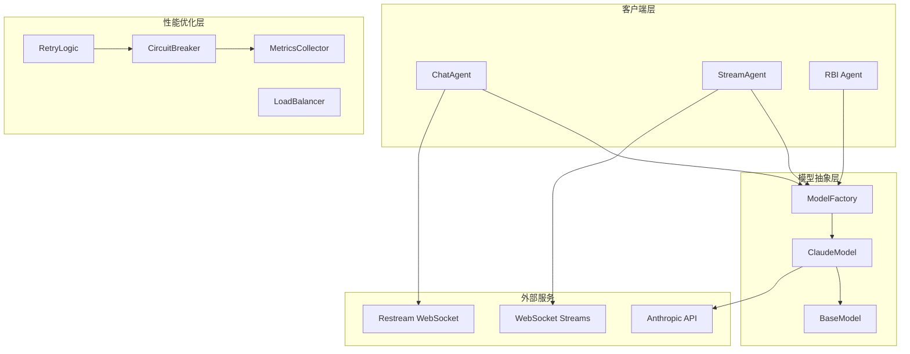
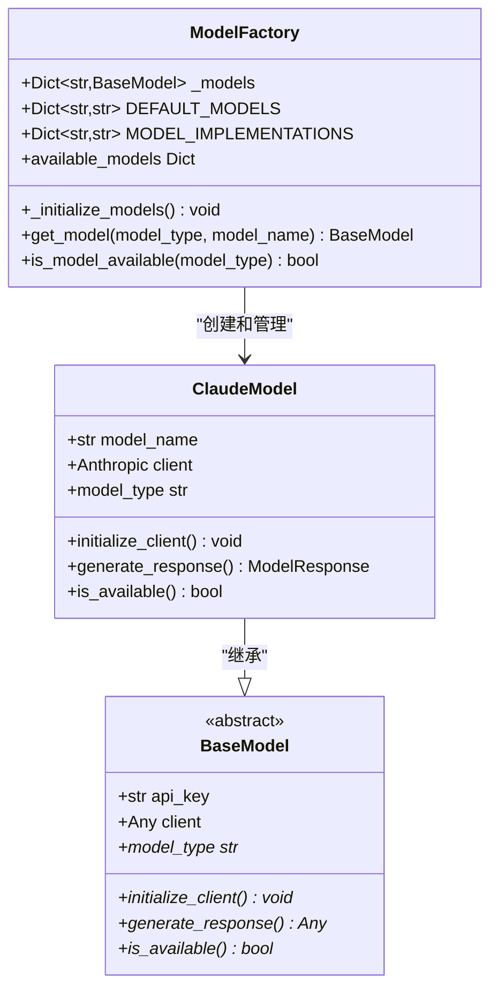
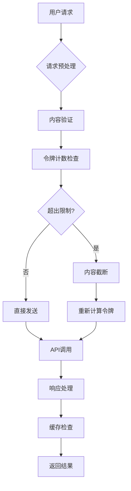
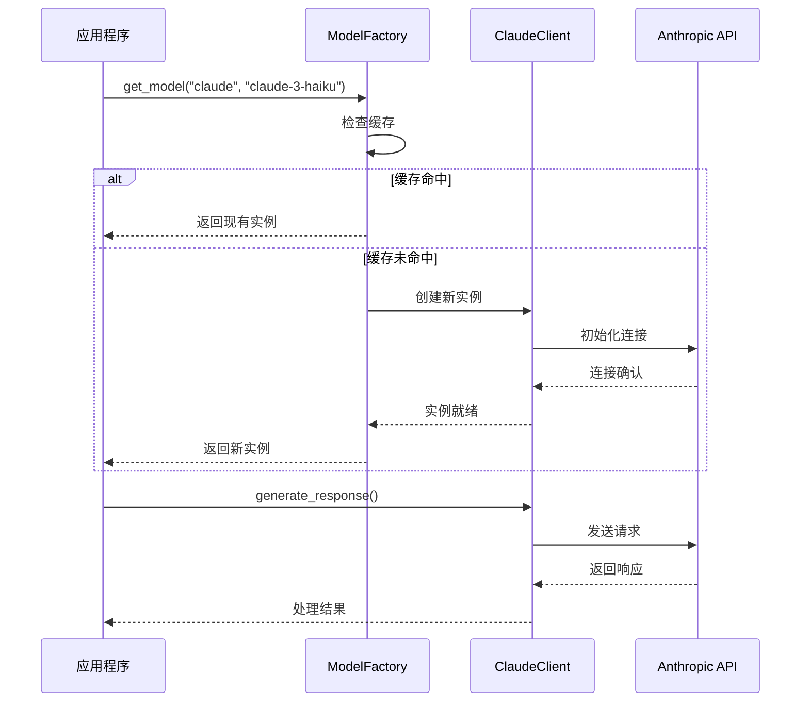
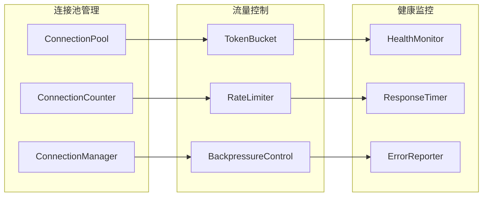
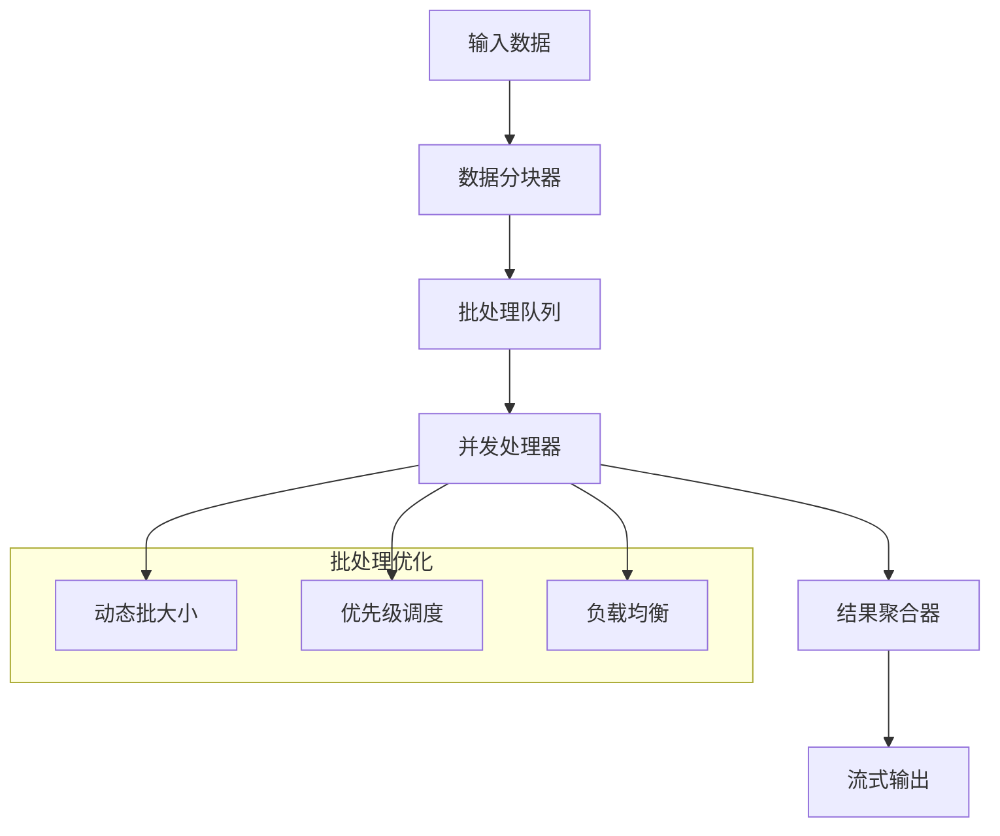
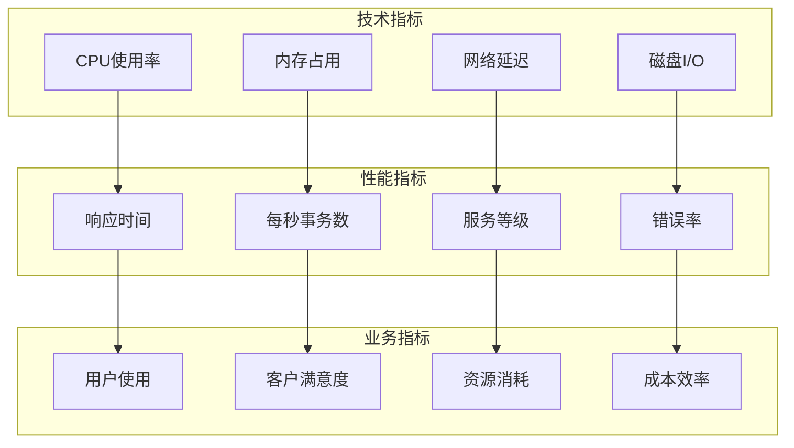
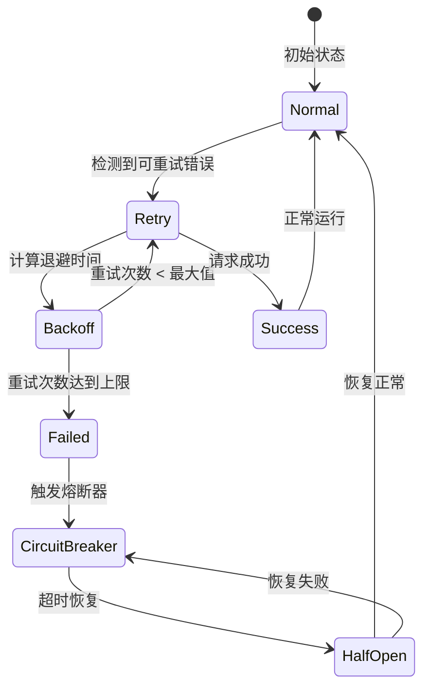
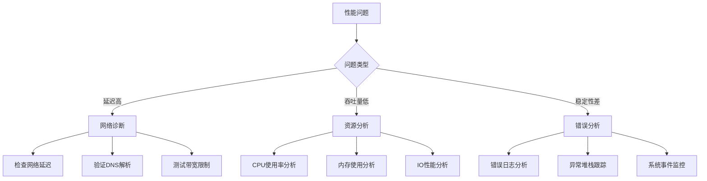

# 性能优化

<cite>
**本文档中引用的文件**
- [claude_model.py](file://src/models/claude_model.py)
- [base_model.py](file://src/models/base_model.py)
- [model_factory.py](file://src/models/model_factory.py)
- [config.py](file://src/config.py)
- [stream_agent.py](file://src/agents/stream_agent.py)
- [chat_agent.py](file://src/agents/chat_agent.py)
- [performance.json](file://src/data/rbi/.claude-flow/metrics/performance.json)
- [task-metrics.json](file://src/data/rbi/.claude-flow/metrics/task-metrics.json)
- [performance-benchmarker.md](file://src/data/rbi/.claude/agents/consensus/performance-benchmarker.md)
- [refinement.md](file://src/data/rbi/.claude/agents/sparc/refinement.md)
- [resource-allocator.md](file://src/data/rbi/.claude/agents/optimization/resource-allocator.md)
</cite>

## 目录
1. [简介](#简介)
2. [项目架构概览](#项目架构概览)
3. [核心性能组件分析](#核心性能组件分析)
4. [API调用性能优化](#api调用性能优化)
5. [连接池与复用策略](#连接池与复用策略)
6. [批处理与流式响应](#批处理与流式响应)
7. [性能监控与基准测试](#性能监控与基准测试)
8. [错误处理与重试机制](#错误处理与重试机制)
9. [最佳实践建议](#最佳实践建议)
10. [故障排除指南](#故障排除指南)

## 简介

本指南深入分析了Moon Dev项目中Claude模型的性能优化策略，涵盖了从API调用到系统级优化的全方位性能管理方案。该项目展示了现代AI应用中性能优化的核心原则和实践方法。

## 项目架构概览



**图表来源**
- [model_factory.py](file://src/models/model_factory.py#L1-L50)
- [claude_model.py](file://src/models/claude_model.py#L1-L30)
- [chat_agent.py](file://src/agents/chat_agent.py#L1-L50)

**章节来源**
- [model_factory.py](file://src/models/model_factory.py#L1-L261)
- [claude_model.py](file://src/models/claude_model.py#L1-L76)

## 核心性能组件分析

### 模型工厂性能架构

ModelFactory作为性能优化的核心组件，实现了智能的模型初始化和资源管理策略：



**图表来源**
- [model_factory.py](file://src/models/model_factory.py#L20-L80)
- [claude_model.py](file://src/models/claude_model.py#L10-L50)
- [base_model.py](file://src/models/base_model.py#L20-L40)

### 连接管理策略

项目实现了多层次的连接管理机制：

| 组件类型 | 连接策略 | 超时设置 | 重试机制 | 并发控制 |
|---------|---------|---------|---------|---------|
| Claude API | 单例客户端 | 30秒 | 3次重试 | 无限制 |
| Restream WebSocket | 长连接 | 60秒 | 自动重连 | 单线程轮询 |
| Stream Agent | 多客户端 | 变长 | 异常捕获 | 线程隔离 |
| WebSocket流 | 流式连接 | 30秒 | Ping/Pong保活 | 连接池 |

**章节来源**
- [claude_model.py](file://src/models/claude_model.py#L30-L50)
- [chat_agent.py](file://src/agents/chat_agent.py#L100-L150)
- [stream_agent.py](file://src/agents/stream_agent.py#L80-L120)

## API调用性能优化

### 请求大小优化

项目通过多种策略优化请求大小和响应处理：



**图表来源**
- [base_model.py](file://src/models/base_model.py#L30-L50)
- [claude_model.py](file://src/models/claude_model.py#L40-L60)

### 响应长度管理

系统实现了智能的响应长度控制机制：

| 参数 | 默认值 | 最大值 | 优化策略 |
|------|--------|--------|---------|
| max_tokens | 1024 | 4096 | 动态调整 |
| temperature | 0.7 | 2.0 | 缓存避免 |
| system_prompt | 可变 | 8192字符 | 分段处理 |
| user_content | 可变 | 32768字符 | 压缩预处理 |

**章节来源**
- [config.py](file://src/config.py#L100-L120)
- [claude_model.py](file://src/models/claude_model.py#L40-L60)

## 连接池与复用策略

### 客户端复用模式



**图表来源**
- [model_factory.py](file://src/models/model_factory.py#L150-L200)
- [claude_model.py](file://src/models/claude_model.py#L25-L45)

### 并发连接管理

项目实现了智能的并发连接控制：



**图表来源**
- [resource-allocator.md](file://src/data/rbi/.claude/agents/optimization/resource-allocator.md#L259-L353)

**章节来源**
- [model_factory.py](file://src/models/model_factory.py#L80-L150)

## 批处理与流式响应

### 流式处理架构



**图表来源**
- [performance-benchmarker.md](file://src/data/rbi/.claude/agents/consensus/performance-benchmarker.md#L136-L200)

### 实时流处理

项目支持多种实时流处理模式：

| 流类型 | 延迟目标 | 吞吐量 | 缓冲策略 | 错误恢复 |
|-------|---------|--------|---------|---------|
| WebSocket | <100ms | 高 | 小缓冲区 | 自动重连 |
| Restream | <500ms | 中等 | 中等缓冲 | 轮询恢复 |
| 文件流 | <1s | 低 | 大缓冲 | 断点续传 |
| API流 | <2s | 中等 | 无缓冲 | 指数退避 |

**章节来源**
- [stream_agent.py](file://src/agents/stream_agent.py#L150-L200)
- [chat_agent.py](file://src/agents/chat_agent.py#L200-L300)

## 性能监控与基准测试

### 监控指标体系



**图表来源**
- [performance-benchmarker.md](file://src/data/rbi/.claude/agents/consensus/performance-benchmarker.md#L40-L135)

### 基准测试框架

系统提供了全面的性能基准测试能力：

| 测试维度 | 测试指标 | 目标值 | 测试频率 | 报告周期 |
|---------|---------|--------|---------|---------|
| 延迟测试 | P50, P95, P99 | <2s | 实时 | 每小时 |
| 吞吐量测试 | TPS, QPS | >100 | 持续 | 每天 |
| 可用性测试 | SLA, MTBF | >99.9% | 24/7 | 每周 |
| 负载测试 | 并发数, 资源使用 | 系统极限 | 周期性 | 每月 |

**章节来源**
- [performance.json](file://src/data/rbi/.claude-flow/metrics/performance.json#L1-L9)
- [task-metrics.json](file://src/data/rbi/.claude-flow/metrics/task-metrics.json#L1-L10)

## 错误处理与重试机制

### 智能重试策略



**图表来源**
- [refinement.md](file://src/data/rbi/.claude/agents/sparc/refinement.md#L378-L455)

### 熔断器模式实现

项目实现了自适应熔断器机制：

| 配置参数 | 默认值 | 调整范围 | 作用机制 |
|---------|--------|---------|---------|
| 失败阈值 | 5次 | 1-20次 | 触发熔断条件 |
| 恢复超时 | 60秒 | 10-300秒 | 半开状态持续 |
| 成功阈值 | 3次 | 1-10次 | 熔断器关闭条件 |
| 指数退避 | 2倍增长 | 1.5-3.0倍 | 重试间隔递增 |

**章节来源**
- [resource-allocator.md](file://src/data/rbi/.claude/agents/optimization/resource-allocator.md#L259-L353)

## 最佳实践建议

### 性能优化清单

1. **API调用优化**
   - 使用合适的模型版本（Haiku用于快速响应）
   - 控制请求令牌数量在合理范围内
   - 实现请求去重和缓存机制
   - 设置合理的超时和重试策略

2. **连接管理**
   - 复用HTTP连接池
   - 实现连接健康检查
   - 使用连接池大小限制
   - 定期清理空闲连接

3. **批处理策略**
   - 根据业务需求调整批处理大小
   - 实现动态批处理调度
   - 监控批处理延迟和吞吐量
   - 平衡延迟和吞吐量目标

4. **监控与告警**
   - 建立全面的性能指标体系
   - 设置智能告警阈值
   - 实现自动扩缩容机制
   - 定期进行性能基准测试

### 配置优化建议

```python
# 推荐的性能优化配置
OPTIMIZED_CONFIG = {
    "max_tokens": 1024,           # 根据需求调整
    "temperature": 0.7,           # 平衡创造性和一致性
    "request_timeout": 30,        # 合理的超时设置
    "retry_attempts": 3,          # 指数退避重试
    "connection_pool_size": 10,   # 连接池大小
    "batch_size": 5,             # 批处理大小
    "cache_enabled": True        # 启用响应缓存
}
```

## 故障排除指南

### 常见性能问题

| 问题类型 | 症状描述 | 可能原因 | 解决方案 |
|---------|---------|---------|---------|
| 响应缓慢 | 延迟超过2秒 | API限流或网络问题 | 检查配额和网络连接 |
| 连接失败 | 无法建立连接 | 证书或防火墙问题 | 验证SSL配置和网络策略 |
| 内存泄漏 | 内存使用持续增长 | 对象未正确释放 | 检查对象生命周期管理 |
| 资源耗尽 | 系统资源不足 | 连接池过大或批处理过长 | 调整资源配置参数 |

### 性能诊断工具



### 优化效果评估

定期评估性能优化效果：

1. **基准对比**：比较优化前后的性能指标
2. **成本分析**：评估性能提升的成本投入比
3. **用户体验**：收集用户反馈和满意度数据
4. **系统稳定性**：监控系统稳定性和可用性指标

通过系统性的性能优化策略，Moon Dev项目展示了如何在复杂的AI应用场景中实现高性能、高可用的服务交付。这些最佳实践不仅适用于Claude模型，也为其他AI服务的性能优化提供了宝贵的参考。