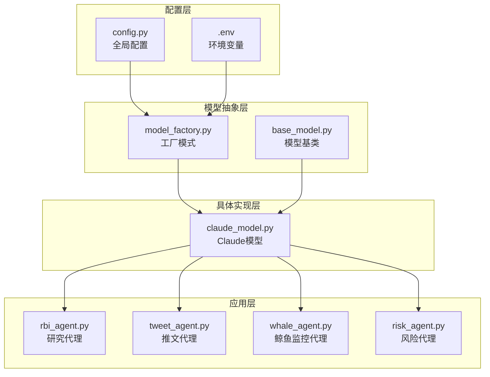
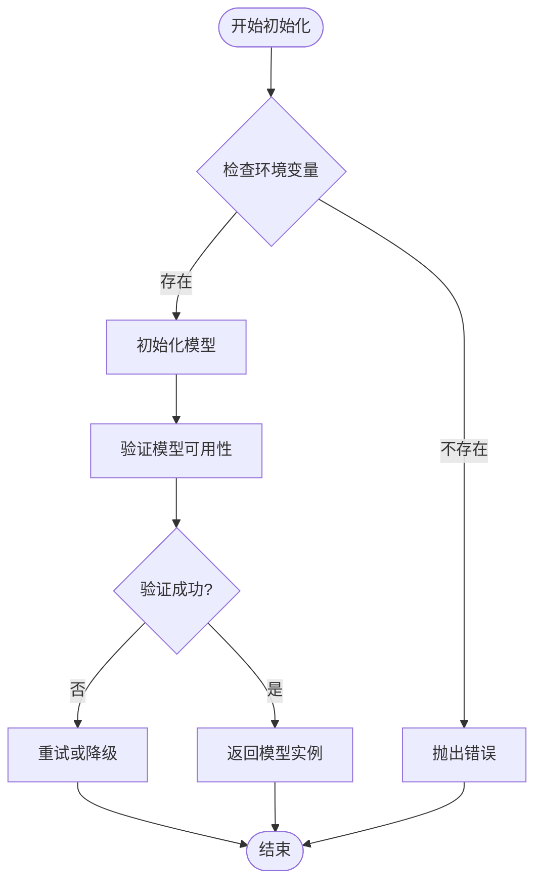
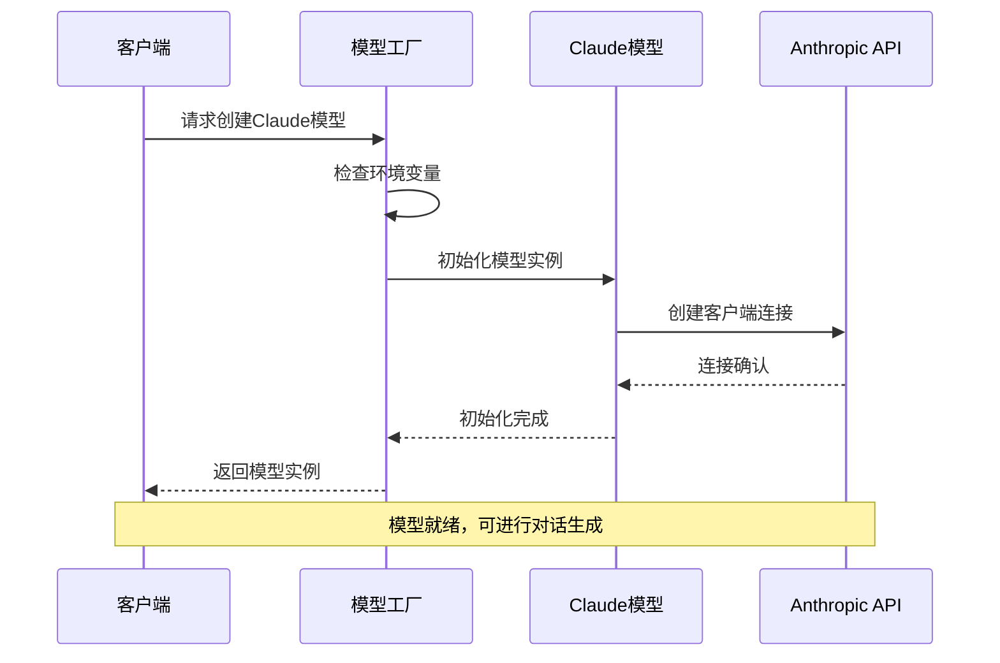
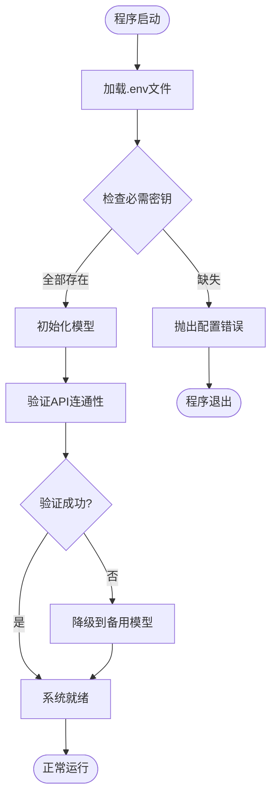
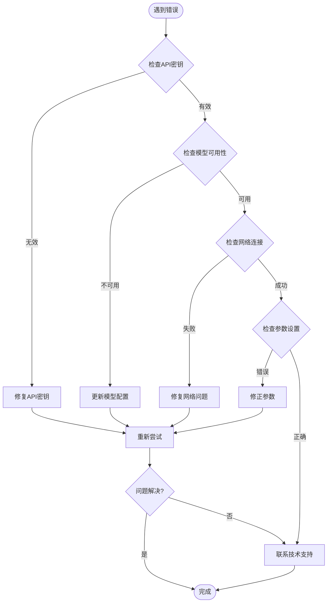

# Claude模型配置指南

<cite>
**本文档中引用的文件**
- [src/models/claude_model.py](file://src/models/claude_model.py)
- [src/config.py](file://src/config.py)
- [src/models/base_model.py](file://src/models/base_model.py)
- [src/models/model_factory.py](file://src/models/model_factory.py)
- [src/agents/rbi_agent.py](file://src/agents/rbi_agent.py)
- [src/agents/tweet_agent.py](file://src/agents/tweet_agent.py)
- [src/agents/whale_agent.py](file://src/agents/whale_agent.py)
- [src/agents/risk_agent.py](file://src/agents/risk_agent.py)
- [README.md](file://README.md)
</cite>

## 目录
1. [简介](#简介)
2. [项目结构概览](#项目结构概览)
3. [核心配置文件](#核心配置文件)
4. [Claude模型架构](#claude模型架构)
5. [详细配置参数说明](#详细配置参数说明)
6. [环境变量管理](#环境变量管理)
7. [使用场景与推荐配置](#使用场景与推荐配置)
8. [配置验证与故障排除](#配置验证与故障排除)
9. [最佳实践建议](#最佳实践建议)
10. [总结](#总结)

## 简介

本指南详细介绍了如何在Moon Dev AI代理系统中配置和使用Claude模型。该系统是一个功能强大的AI代理生态系统，支持多种AI模型提供商，其中Claude作为主要的Anthropic AI模型被广泛应用于各种交易和分析任务中。

## 项目结构概览

该项目采用模块化架构设计，主要组件包括：



**图表来源**
- [src/config.py](file://src/config.py#L1-L136)
- [src/models/model_factory.py](file://src/models/model_factory.py#L1-L220)
- [src/models/claude_model.py](file://src/models/claude_model.py#L1-L76)

## 核心配置文件

### 主配置文件 (config.py)

主配置文件包含了系统的核心设置，特别是AI模型相关的配置：

| 配置项 | 类型 | 默认值 | 描述 |
|--------|------|--------|------|
| `AI_MODEL` | str | "claude-3-haiku-20240307" | 默认使用的Claude模型名称 |
| `AI_MAX_TOKENS` | int | 1024 | 单次响应的最大令牌数 |
| `AI_TEMPERATURE` | float | 0.7 | 控制输出的创造性和随机性 |

**章节来源**
- [src/config.py](file://src/config.py#L85-L95)

### 模型工厂配置

模型工厂负责统一管理所有AI模型的初始化和配置：



**图表来源**
- [src/models/model_factory.py](file://src/models/model_factory.py#L191-L218)

## Claude模型架构

### 可用模型列表

Claude模型支持多个版本，从最新的Claude 4系列到稳定的Claude 3系列：

| 模型系列 | 模型名称 | 性能特点 | 推荐用途 |
|----------|----------|----------|----------|
| Claude 4系列 | claude-opus-4-1 | 最强大的推理能力 | 复杂分析和高级任务 |
| | claude-sonnet-4-5 | 平衡性能与能力 | 通用任务处理 |
| | claude-haiku-4-5 | 快速高效 | 实时响应任务 |
| Claude 3.5系列 | claude-3-5-sonnet-latest | 增强性能 | 生产环境使用 |
| | claude-3-5-haiku-latest | 极快响应 | 轻量级任务 |
| Claude 3系列 | claude-3-opus | 最强大模型 | 复杂推理任务 |
| | claude-3-sonnet | 平衡模型 | 通用任务 |
| | claude-3-haiku | 最快速模型 | 实时交互 |

**章节来源**
- [src/models/claude_model.py](file://src/models/claude_model.py#L12-L26)

### 模型初始化流程



**图表来源**
- [src/models/claude_model.py](file://src/models/claude_model.py#L28-L35)
- [src/models/model_factory.py](file://src/models/model_factory.py#L191-L218)

## 详细配置参数说明

### 核心参数详解

#### model_name (模型名称)
- **类型**: str
- **默认值**: "claude-3-haiku"
- **影响**: 决定使用哪个Claude模型变体
- **配置方法**: 在`config.py`中设置`AI_MODEL`或通过环境变量`ANTHROPIC_KEY`

#### max_tokens (最大令牌数)
- **类型**: int
- **默认值**: 1024
- **范围**: 1-4096 (根据具体模型而定)
- **影响**: 控制单次响应的长度和详细程度
- **使用场景**:
  - 短对话: 128-512
  - 中等分析: 512-2048
  - 深度分析: 2048-4096

#### temperature (温度参数)
- **类型**: float
- **默认值**: 0.7
- **范围**: 0.0-2.0
- **影响**: 控制输出的创造性和随机性
- **配置策略**:
  - 0.0-0.3: 保守、准确的回答
  - 0.4-0.7: 平衡的创造性回答
  - 0.8-1.2: 富有创意的回答
  - 1.3+: 高度创造性的回答

#### top_p (核采样参数)
- **类型**: float
- **默认值**: 0.9
- **范围**: 0.0-1.0
- **作用**: 控制词汇选择的多样性
- **使用建议**: 通常与temperature配合使用

#### stream (流式响应)
- **类型**: bool
- **默认值**: False
- **作用**: 是否启用流式响应模式
- **性能影响**: 启用时可获得更快的感知响应时间

**章节来源**
- [src/models/claude_model.py](file://src/models/claude_model.py#L37-L52)

### 参数组合策略

| 场景 | temperature | max_tokens | top_p | stream | 说明 |
|------|-------------|------------|-------|--------|------|
| 代码生成 | 0.2 | 2048 | 0.9 | 是 | 准确性和稳定性优先 |
| 创意写作 | 0.8 | 1500 | 0.95 | 否 | 高度创造性输出 |
| 数据分析 | 0.3 | 1024 | 0.8 | 是 | 结构化和准确性 |
| 实时聊天 | 0.5 | 512 | 0.9 | 是 | 平衡响应速度和质量 |
| 技术文档 | 0.1 | 2048 | 0.7 | 否 | 准确性和完整性 |

## 环境变量管理

### 必需的环境变量

系统通过环境变量安全地管理API密钥和其他敏感信息：

| 变量名 | 描述 | 获取方式 |
|--------|------|----------|
| `ANTHROPIC_KEY` | Claude API密钥 | https://console.anthropic.com/ |
| `OPENAI_KEY` | OpenAI API密钥 | https://platform.openai.com/api-keys |
| `DEEPSEEK_KEY` | DeepSeek API密钥 | https://platform.deepseek.com/ |
| `GROQ_API_KEY` | Groq API密钥 | https://console.groq.com/ |
| `GEMINI_KEY` | Google Gemini API密钥 | https://aistudio.google.com/app/apikey |

### 环境变量加载机制



**图表来源**
- [src/agents/rbi_agent.py](file://src/agents/rbi_agent.py#L377-L414)
- [src/agents/tweet_agent.py](file://src/agents/tweet_agent.py#L77-L109)

### 安全配置最佳实践

1. **避免硬编码**: 所有敏感信息必须通过环境变量传递
2. **.gitignore**: 确保`.env`文件被添加到`.gitignore`
3. **权限控制**: 设置适当的文件权限保护环境变量文件
4. **定期轮换**: 定期更新API密钥以提高安全性

**章节来源**
- [src/agents/rbi_agent.py](file://src/agents/rbi_agent.py#L377-L414)

## 使用场景与推荐配置

### 1. 创意生成场景

适用于内容创作、头脑风暴和创意写作任务：

```python
# 推荐配置
{
    "temperature": 0.8,
    "max_tokens": 1500,
    "top_p": 0.95,
    "model_name": "claude-3-sonnet"
}
```

**应用场景**:
- 社交媒体内容创作
- 故事和剧本编写
- 广告文案生成
- 创意策略制定

### 2. 代码生成场景

专注于准确性和代码质量：

```python
# 推荐配置
{
    "temperature": 0.2,
    "max_tokens": 2048,
    "top_p": 0.9,
    "model_name": "claude-3-opus"
}
```

**应用场景**:
- 自动化脚本生成
- 代码重构建议
- 测试用例编写
- 文档自动生成

### 3. 数据分析场景

平衡准确性和效率：

```python
# 推荐配置
{
    "temperature": 0.3,
    "max_tokens": 1024,
    "top_p": 0.8,
    "model_name": "claude-3-5-sonnet-latest"
}
```

**应用场景**:
- 市场趋势分析
- 风险评估报告
- 交易策略优化
- 性能指标解读

### 4. 实时交互场景

注重响应速度和用户体验：

```python
# 推荐配置
{
    "temperature": 0.5,
    "max_tokens": 512,
    "top_p": 0.9,
    "model_name": "claude-3-haiku",
    "stream": True
}
```

**应用场景**:
- 实时聊天机器人
- 语音助手
- 快速问答系统
- 辅助决策工具

**章节来源**
- [src/config.py](file://src/config.py#L85-L95)

## 配置验证与故障排除

### 配置验证清单

在部署前，请确保以下配置项正确无误：

| 验证项目 | 检查方法 | 预期结果 |
|----------|----------|----------|
| API密钥有效性 | 尝试初始化模型 | 成功连接 |
| 模型名称正确性 | 检查可用模型列表 | 模型存在且可用 |
| 网络连接性 | 发送测试请求 | 响应正常 |
| 权限配置 | 检查环境变量 | 变量已设置 |

### 常见错误及解决方案

#### 1. API密钥无效错误

**错误信息**: `❌ Failed to initialize Claude model: Invalid API key`

**解决方案**:
```bash
# 检查环境变量
echo $ANTHROPIC_KEY

# 验证API密钥格式
# 正确格式: sk-ant-api03-...

# 更新配置
export ANTHROPIC_KEY="your_valid_api_key_here"
```

#### 2. 模型不可用错误

**错误信息**: `❌ Claude generation error: Model not found`

**解决方案**:
```python
# 检查可用模型
available_models = ClaudeModel.AVAILABLE_MODELS
print("可用模型:", list(available_models.keys()))

# 使用有效模型名称
model = ClaudeModel(api_key="your_key", model_name="claude-3-haiku")
```

#### 3. 网络连接超时

**错误信息**: `❌ Claude generation error: Request timeout`

**解决方案**:
- 检查网络连接
- 验证防火墙设置
- 考虑增加超时时间

#### 4. 温度参数超出范围

**错误信息**: `❌ Claude generation error: temperature must be between 0 and 2`

**解决方案**:
```python
# 修正温度参数
temperature = max(0.0, min(2.0, temperature))
```

### 故障排除流程图



**图表来源**
- [src/models/claude_model.py](file://src/models/claude_model.py#L30-L35)
- [src/models/claude_model.py](file://src/models/claude_model.py#L54-L65)

**章节来源**
- [src/models/claude_model.py](file://src/models/claude_model.py#L30-L65)

## 最佳实践建议

### 1. 性能优化建议

- **合理设置max_tokens**: 根据任务复杂度调整令牌数量，避免不必要的资源浪费
- **选择合适的模型**: 对于实时任务使用Haiku系列，对于复杂分析使用Opus系列
- **启用流式响应**: 在需要快速响应的场景中启用stream参数

### 2. 成本控制策略

- **监控使用量**: 定期检查API调用次数和消耗的令牌数
- **缓存常用响应**: 对于重复性查询实现本地缓存机制
- **批量处理**: 将多个小请求合并为批量请求

### 3. 安全性考虑

- **定期轮换密钥**: 至少每90天更换一次API密钥
- **最小权限原则**: 仅授予必要的API访问权限
- **监控异常使用**: 设置使用量警报和异常检测

### 4. 开发调试技巧

- **使用日志记录**: 启用详细的日志记录以便问题诊断
- **分阶段测试**: 先测试基本功能，再逐步增加复杂性
- **单元测试**: 为关键功能编写自动化测试

### 5. 生产环境部署

- **健康检查**: 实现定期的模型可用性检查
- **降级策略**: 当主要模型不可用时自动切换到备用模型
- **监控告警**: 设置关键指标的监控和告警机制

## 总结

本指南详细介绍了在Moon Dev AI代理系统中配置和使用Claude模型的完整流程。通过合理的配置管理和最佳实践，可以充分发挥Claude模型在各种AI应用场景中的优势。

关键要点：
1. **正确的配置管理**: 使用环境变量安全存储API密钥
2. **参数优化**: 根据具体应用场景调整模型参数
3. **故障排除**: 建立完善的验证和故障排除机制
4. **持续监控**: 在生产环境中实施有效的监控和维护

遵循本指南的建议，您将能够有效地集成和使用Claude模型，构建高质量的AI代理应用程序。