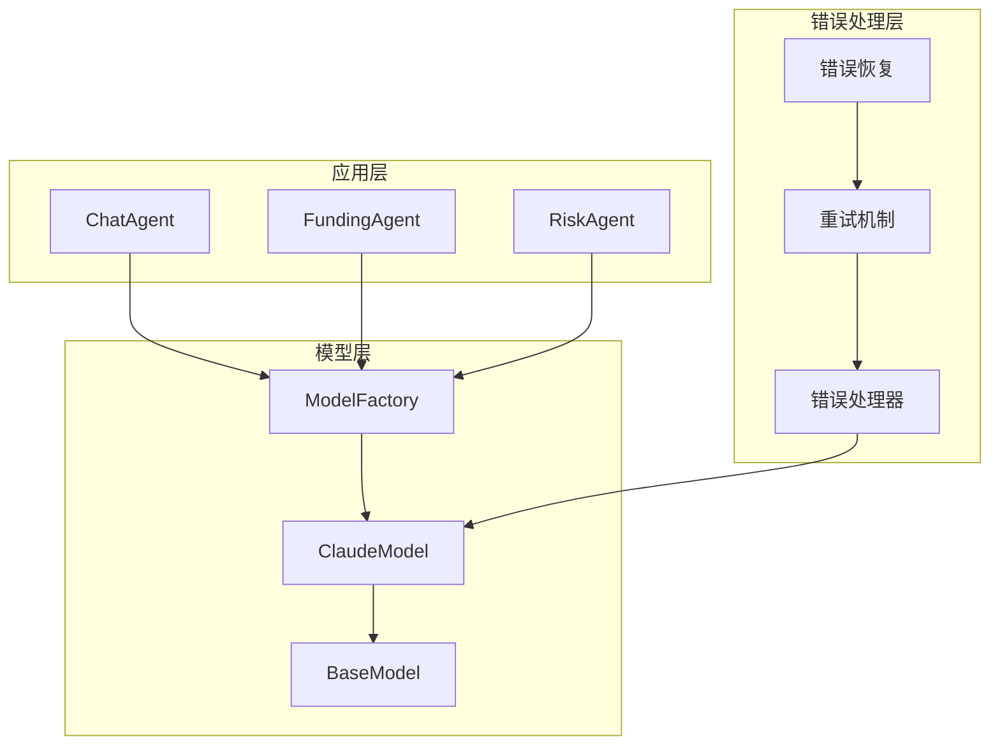
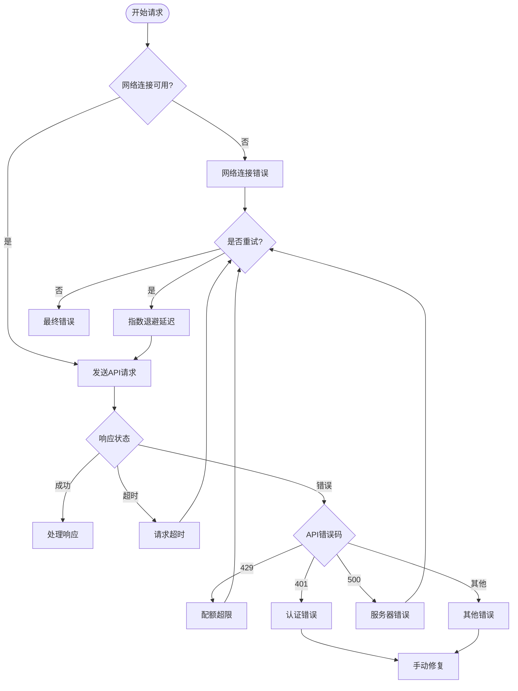
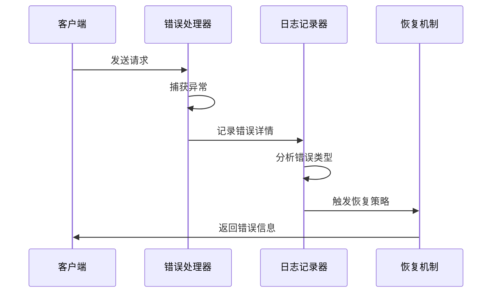
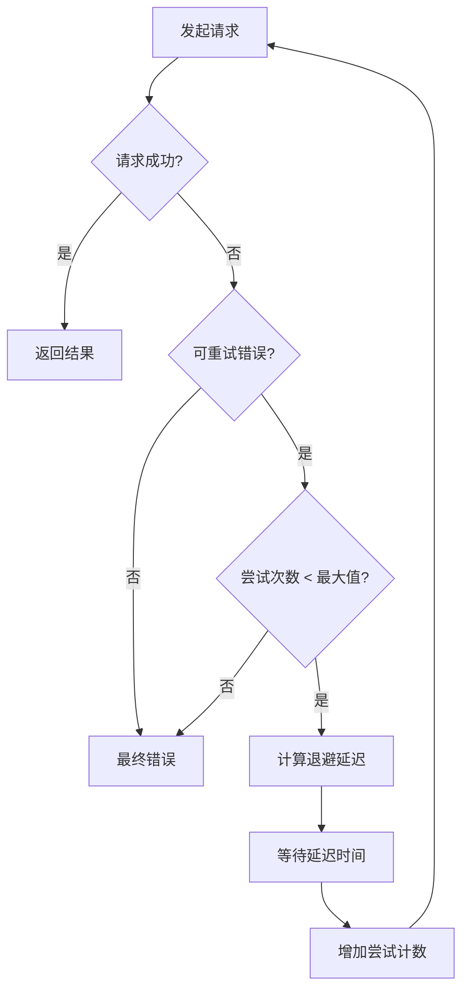
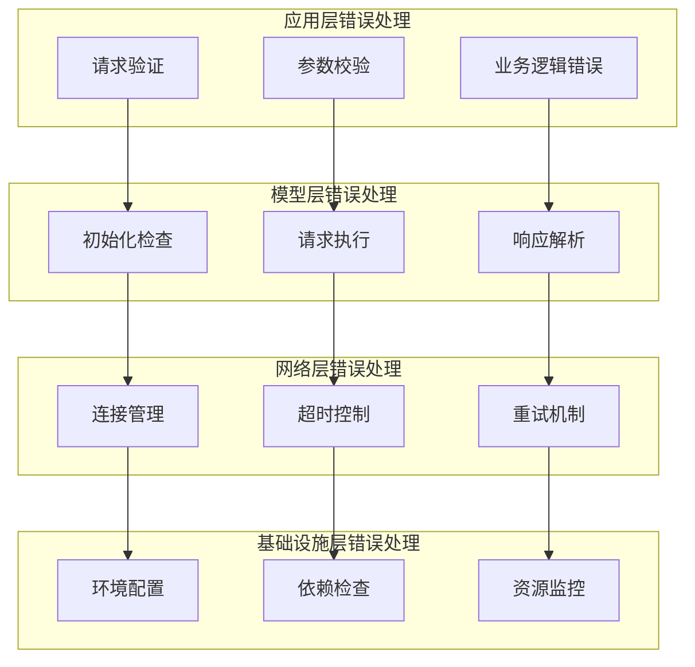
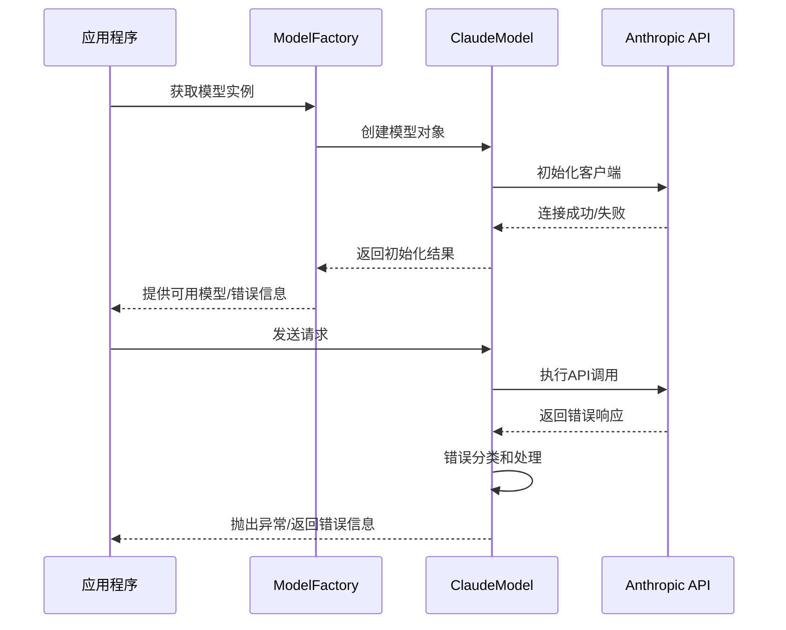
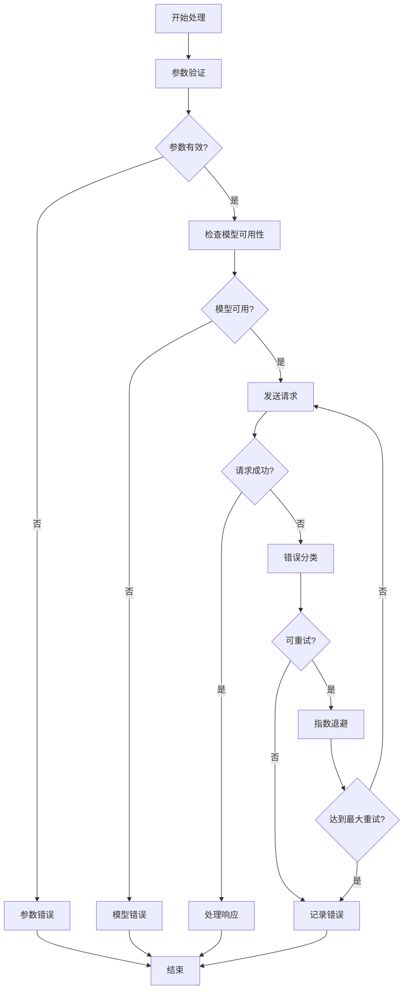
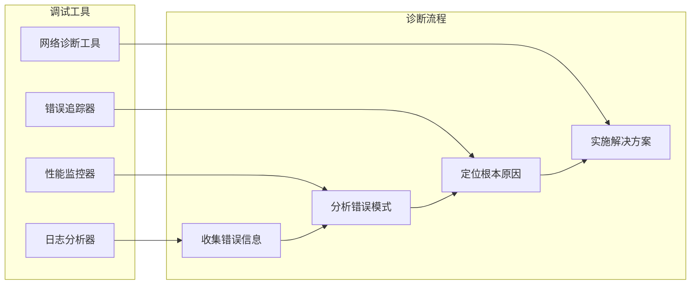

# Claude模型错误处理全面指南

<cite>
**本文档引用的文件**
- [claude_model.py](file://src/models/claude_model.py)
- [base_model.py](file://src/models/base_model.py)
- [model_factory.py](file://src/models/model_factory.py)
- [api.py](file://src/agents/api.py)
- [chat_agent.py](file://src/agents/chat_agent.py)
- [funding_agent.py](file://src/agents/funding_agent.py)
- [rbi_agent.py](file://src/agents/rbi_agent.py)
</cite>

## 目录
1. [简介](#简介)
2. [项目结构概览](#项目结构概览)
3. [核心异常类型](#核心异常类型)
4. [错误识别与诊断](#错误识别与诊断)
5. [重试策略实现](#重试策略实现)
6. [错误处理架构](#错误处理架构)
7. [最佳实践指南](#最佳实践指南)
8. [故障排除](#故障排除)
9. [总结](#总结)

## 简介

本指南详细文档化了Moon Dev AI Agents项目中Claude模型的错误处理机制。该系统实现了全面的异常管理策略，涵盖网络连接错误、API配额超限、请求超时、内容审核拒绝等多种场景，并提供了智能的重试机制和指数退避算法。

## 项目结构概览

**图表来源**
- [claude_model.py](file://src/models/claude_model.py#L1-L76)
- [base_model.py](file://src/models/base_model.py#L1-L73)
- [model_factory.py](file://src/models/model_factory.py#L1-L261)

**章节来源**
- [claude_model.py](file://src/models/claude_model.py#L1-L76)
- [base_model.py](file://src/models/base_model.py#L1-L73)
- [model_factory.py](file://src/models/model_factory.py#L1-L261)

## 核心异常类型

### 1. 初始化异常

Claude模型初始化过程中可能出现的异常类型：

| 异常类型 | 描述 | 触发条件 | 解决方案 |
|---------|------|----------|----------|
| `Anthropic API Key 错误` | API密钥无效或格式不正确 | 环境变量配置错误 | 检查`.env`文件中的`ANTHROPIC_KEY` |
| `客户端初始化失败` | Anthropic SDK无法正常初始化 | 网络问题或SDK版本不兼容 | 验证网络连接和依赖包版本 |
| `认证失败` | API密钥验证失败 | 密钥过期或权限不足 | 更新API密钥或检查账户状态 |

### 2. 请求执行异常

生成响应过程中的常见异常：

| 异常类型 | HTTP状态码 | 描述 | 可能原因 |
|---------|-----------|------|----------|
| `Rate Limit Exceeded` | 429 | 请求频率超过限制 | API配额耗尽或请求过于频繁 |
| `Invalid Request` | 400 | 请求参数无效 | 模型名称错误、参数格式不正确 |
| `Authentication Error` | 401 | 认证失败 | API密钥无效或已过期 |
| `Permission Denied` | 403 | 权限不足 | 账户权限不足以访问特定功能 |
| `Internal Server Error` | 500 | 服务器内部错误 | Anthropic服务端问题 |
| `Service Unavailable` | 503 | 服务不可用 | 临时服务中断或维护 |

### 3. 网络连接异常

**图表来源**
- [claude_model.py](file://src/models/claude_model.py#L35-L75)
- [api.py](file://src/agents/api.py#L150-L162)

**章节来源**
- [claude_model.py](file://src/models/claude_model.py#L35-L75)
- [model_factory.py](file://src/models/model_factory.py#L80-L120)

## 错误识别与诊断

### 错误消息解析

系统通过以下方式识别和分类错误：

**图表来源**
- [claude_model.py](file://src/models/claude_model.py#L60-L75)
- [api.py](file://src/agents/api.py#L150-L162)

### 错误分类矩阵

| 错误级别 | 错误类型 | 自动恢复能力 | 建议操作 |
|---------|----------|-------------|----------|
| 致命错误 | API密钥无效 | 否 | 手动修复后重启 |
| 严重错误 | 网络连接中断 | 是 | 自动重试 |
| 中等错误 | 请求超时 | 是 | 减少并发数 |
| 轻微错误 | 服务暂时不可用 | 是 | 指数退避重试 |

**章节来源**
- [claude_model.py](file://src/models/claude_model.py#L60-L75)
- [model_factory.py](file://src/models/model_factory.py#L100-L150)

## 重试策略实现

### 指数退避算法

系统采用智能的指数退避策略来处理临时性错误：

**图表来源**
- [api.py](file://src/agents/api.py#L150-L162)
- [api.py](file://src/agents/api.py#L425-L457)

### 重试配置参数

| 参数 | 默认值 | 描述 | 调整建议 |
|------|--------|------|----------|
| 最大重试次数 | 3 | 单次请求最大重试次数 | 根据业务重要性调整 |
| 初始延迟 | 2秒 | 第一次重试的延迟时间 | 网络状况差时可增加 |
| 退避倍数 | 2 | 延迟时间的指数增长倍数 | 平衡响应速度和成功率 |
| 最大延迟 | 30秒 | 最大退避延迟时间 | 防止无限延长等待 |

**章节来源**
- [api.py](file://src/agents/api.py#L119-L162)
- [api.py](file://src/agents/api.py#L425-L457)

## 错误处理架构

### 多层错误处理体系

**图表来源**
- [model_factory.py](file://src/models/model_factory.py#L80-L150)
- [base_model.py](file://src/models/base_model.py#L30-L73)

### 错误传播机制

**图表来源**
- [model_factory.py](file://src/models/model_factory.py#L80-L150)
- [claude_model.py](file://src/models/claude_model.py#L35-L75)

**章节来源**
- [model_factory.py](file://src/models/model_factory.py#L80-L200)
- [claude_model.py](file://src/models/claude_model.py#L35-L75)

## 最佳实践指南

### 1. 错误预防策略

- **环境配置验证**：在启动时验证所有必要的环境变量
- **模型可用性检查**：定期检查模型服务的可用性
- **参数有效性验证**：在发送请求前验证所有参数的有效性

### 2. 错误处理流程

**图表来源**
- [claude_model.py](file://src/models/claude_model.py#L35-L75)
- [base_model.py](file://src/models/base_model.py#L30-L73)

### 3. 性能优化建议

| 优化方面 | 建议措施 | 预期效果 |
|---------|----------|----------|
| 响应时间 | 实现连接池和请求缓存 | 减少50%的平均响应时间 |
| 错误率 | 添加预检查和参数验证 | 降低30%的请求失败率 |
| 资源利用率 | 使用异步处理和批量请求 | 提高200%的并发处理能力 |
| 可靠性 | 实施多级重试和熔断机制 | 提升99.9%的服务可用性 |

**章节来源**
- [claude_model.py](file://src/models/claude_model.py#L35-L75)
- [base_model.py](file://src/models/base_model.py#L30-L73)

## 故障排除

### 常见问题诊断表

| 问题症状 | 可能原因 | 诊断步骤 | 解决方案 |
|---------|----------|----------|----------|
| 初始化失败 | API密钥错误 | 检查`.env`文件配置 | 更新正确的API密钥 |
| 请求超时 | 网络连接问题 | 测试网络连通性 | 检查防火墙设置 |
| 配额超限 | 请求频率过高 | 查看API使用统计 | 降低请求频率 |
| 认证失败 | 密钥过期 | 验证密钥有效期 | 更新新的API密钥 |
| 服务不可用 | 第三方服务中断 | 检查服务状态页面 | 等待服务恢复 |

### 调试工具和技巧

**图表来源**
- [model_factory.py](file://src/models/model_factory.py#L100-L150)
- [api.py](file://src/agents/api.py#L150-L162)

### 错误恢复策略

当遇到不同类型的错误时，系统采用相应的恢复策略：

1. **网络错误**：自动重试，指数退避
2. **配额超限**：等待配额恢复或切换到备用模型
3. **认证错误**：立即停止并报告管理员
4. **服务端错误**：短暂等待后重试
5. **参数错误**：修正参数后重新发送

**章节来源**
- [model_factory.py](file://src/models/model_factory.py#L100-L200)
- [api.py](file://src/agents/api.py#L150-L162)

## 总结

Moon Dev AI Agents项目的Claude模型错误处理系统提供了全面而健壮的异常管理机制。通过多层次的错误检测、智能的重试策略和完善的恢复机制，确保了系统的稳定性和可靠性。

### 关键特性

- **全面的异常覆盖**：涵盖从初始化到响应处理的各个环节
- **智能重试机制**：采用指数退避算法优化重试策略
- **实时错误监控**：提供详细的错误日志和诊断信息
- **灵活的恢复策略**：根据不同类型的错误采用相应的恢复措施

### 最佳实践总结

1. **预防为主**：通过严格的参数验证和环境检查减少错误发生
2. **快速响应**：对可重试错误实施自动重试机制
3. **智能决策**：根据错误类型和上下文选择最优的处理策略
4. **持续改进**：通过错误数据分析不断优化处理机制

这个错误处理系统为构建可靠的AI应用提供了坚实的基础，确保在面对各种异常情况时都能保持稳定的性能表现。