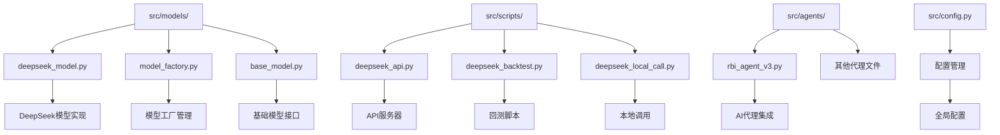
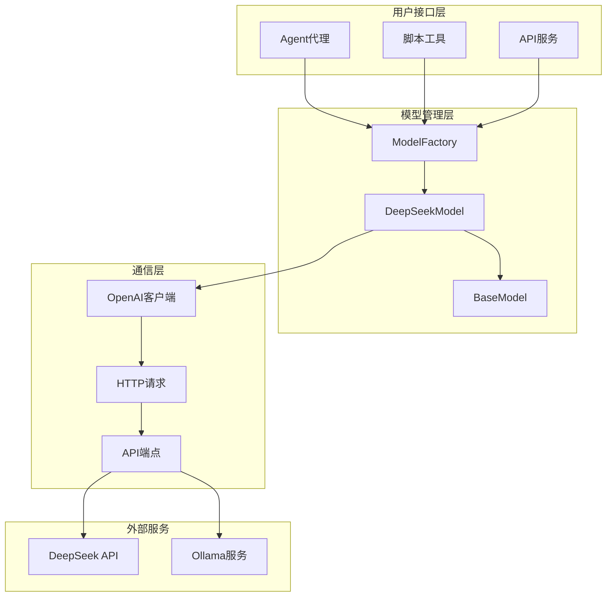
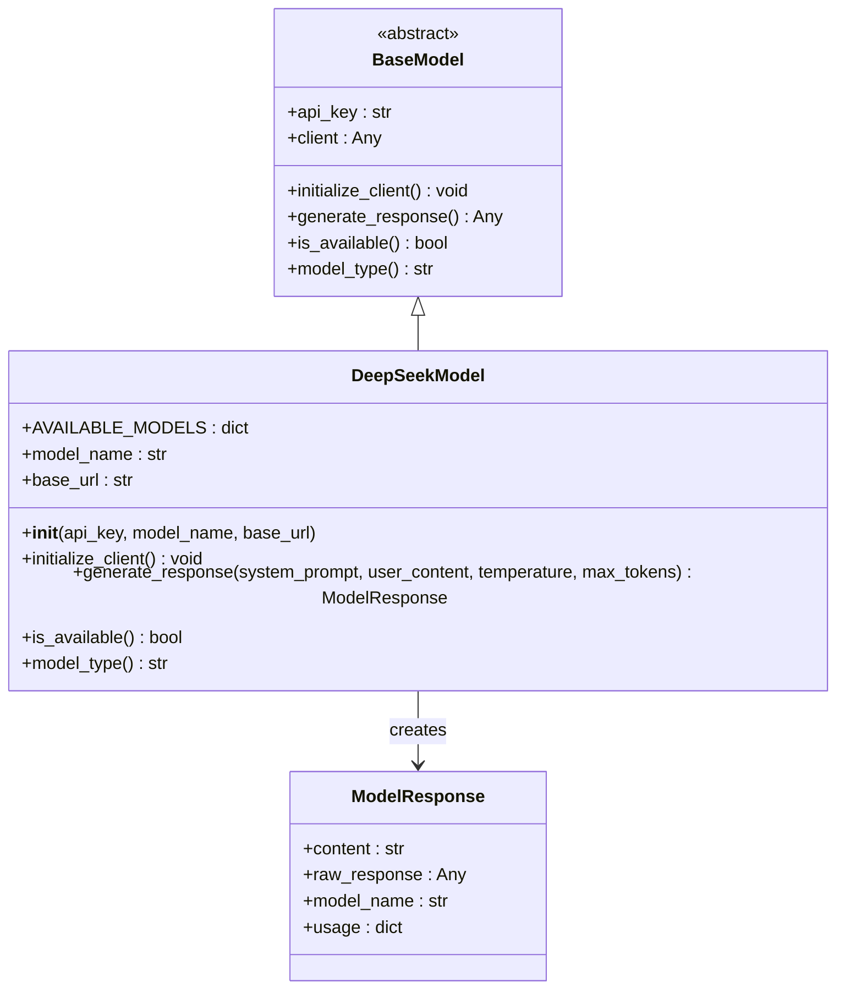
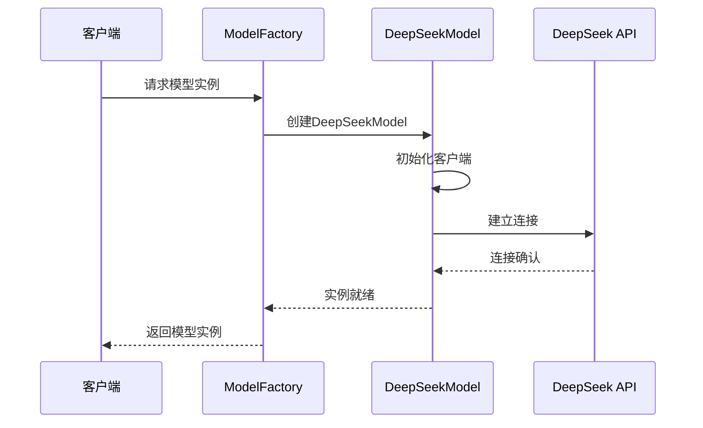
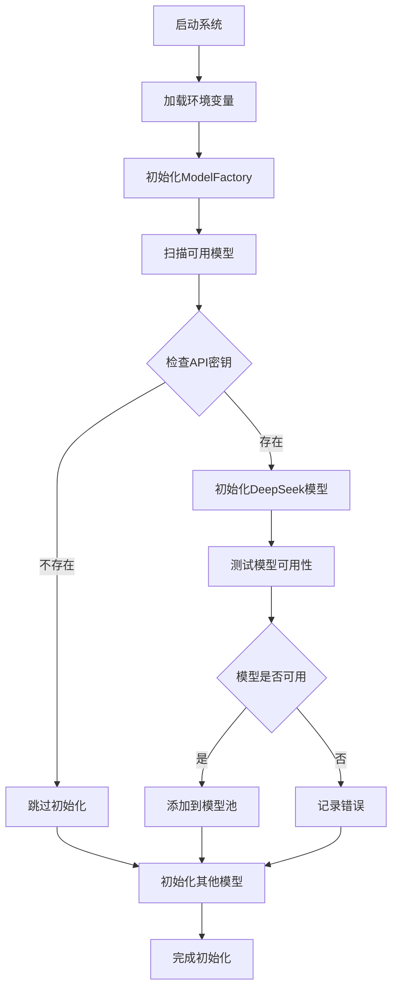
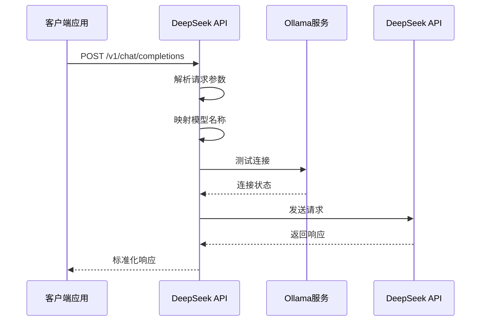
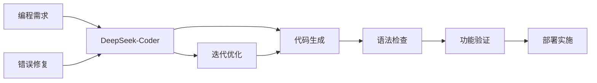
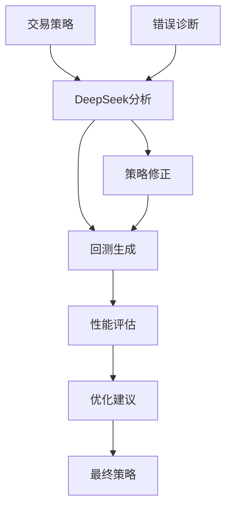

# DeepSeek模型集成

<cite>
**本文档中引用的文件**
- [deepseek_model.py](file://src/models/deepseek_model.py)
- [model_factory.py](file://src/models/model_factory.py)
- [base_model.py](file://src/models/base_model.py)
- [deepseek_api.py](file://src/scripts/deepseek_api.py)
- [deepseek_backtest.py](file://src/scripts/deepseek_backtest.py)
- [deepseek_local_call.py](file://src/scripts/deepseek_local_call.py)
- [rbi_agent_v3.py](file://src/agents/rbi_agent_v3.py)
- [config.py](file://src/config.py)
</cite>

## 目录
1. [简介](#简介)
2. [项目结构](#项目结构)
3. [核心组件](#核心组件)
4. [架构概览](#架构概览)
5. [详细组件分析](#详细组件分析)
6. [配置指南](#配置指南)
7. [应用场景](#应用场景)
8. [性能考虑](#性能考虑)
9. [故障排除指南](#故障排除指南)
10. [结论](#结论)

## 简介

Moon Dev的DeepSeek模型集成是一个全面的人工智能模型适配系统，专门为DeepSeek API设计。该系统支持多种DeepSeek模型，包括聊天模型、代码专用模型、推理增强模型和第一代推理模型，为开发者提供了强大的AI能力集成解决方案。

DeepSeek模型集成的核心优势在于其统一的接口设计、灵活的配置选项和强大的多模态能力。系统特别针对中文处理进行了优化，并提供了完整的错误处理和调试功能。

## 项目结构

DeepSeek模型集成在项目中的组织结构如下：



**图表来源**
- [deepseek_model.py](file://src/models/deepseek_model.py#L1-L74)
- [model_factory.py](file://src/models/model_factory.py#L1-L261)
- [base_model.py](file://src/models/base_model.py#L1-L73)

**章节来源**
- [deepseek_model.py](file://src/models/deepseek_model.py#L1-L74)
- [model_factory.py](file://src/models/model_factory.py#L1-L261)

## 核心组件

### DeepSeekModel类

DeepSeekModel是DeepSeek API的主要适配器，继承自BaseModel基类，提供了完整的模型功能实现。

主要特性：
- 支持四种DeepSeek模型：deepseek-chat、deepseek-coder、deepseek-reasoner、deepseek-r1
- 统一的初始化和客户端管理
- 标准化的响应格式
- 完整的错误处理机制

### 模型工厂系统

ModelFactory负责管理所有可用的AI模型，包括DeepSeek模型的动态加载和配置。

核心功能：
- 自动检测和初始化可用模型
- 提供统一的模型访问接口
- 支持模型热切换和重新配置
- 集成环境变量管理和验证

### 基础模型接口

BaseModel定义了所有AI模型必须遵循的标准接口，确保了系统的可扩展性和一致性。

**章节来源**
- [deepseek_model.py](file://src/models/deepseek_model.py#L10-L74)
- [model_factory.py](file://src/models/model_factory.py#L20-L100)
- [base_model.py](file://src/models/base_model.py#L15-L73)

## 架构概览

DeepSeek模型集成采用分层架构设计，确保了系统的模块化和可维护性：



**图表来源**
- [model_factory.py](file://src/models/model_factory.py#L20-L50)
- [deepseek_model.py](file://src/models/deepseek_model.py#L10-L30)
- [deepseek_api.py](file://src/scripts/deepseek_api.py#L1-L30)

## 详细组件分析

### DeepSeekModel实现分析

DeepSeekModel类是整个集成系统的核心，提供了对DeepSeek API的完整封装：



**图表来源**
- [deepseek_model.py](file://src/models/deepseek_model.py#L10-L74)
- [base_model.py](file://src/models/base_model.py#L15-L30)

#### 可用模型类型

DeepSeek模型支持以下四种主要模型：

| 模型名称 | 描述 | 适用场景 |
|---------|------|----------|
| deepseek-chat | 快速聊天模型 | 通用对话、问答、文本生成 |
| deepseek-coder | 代码专用模型 | 编程、代码生成、技术文档 |
| deepseek-reasoner | 增强推理模型 | 复杂推理、数学计算、逻辑分析 |
| deepseek-r1 | 第一代推理模型 | 思维过程显示、深度分析 |

#### 初始化流程



**图表来源**
- [deepseek_model.py](file://src/models/deepseek_model.py#L25-L35)
- [model_factory.py](file://src/models/model_factory.py#L80-L120)

**章节来源**
- [deepseek_model.py](file://src/models/deepseek_model.py#L10-L74)

### ModelFactory集成机制

ModelFactory提供了无缝的模型管理体验，支持动态加载和配置：



**图表来源**
- [model_factory.py](file://src/models/model_factory.py#L60-L150)

#### 动态加载过程

ModelFactory实现了智能的动态加载机制：

1. **环境检测**：自动扫描`.env`文件中的API密钥
2. **模型发现**：识别可用的模型类型和配置
3. **实例化**：创建模型实例并进行健康检查
4. **注册管理**：将可用模型注册到内部管理池

**章节来源**
- [model_factory.py](file://src/models/model_factory.py#L60-L200)

### API服务器集成

deepseek_api.py提供了完整的RESTful API服务，支持与外部系统的集成：



**图表来源**
- [deepseek_api.py](file://src/scripts/deepseek_api.py#L40-L100)

**章节来源**
- [deepseek_api.py](file://src/scripts/deepseek_api.py#L1-L134)

## 配置指南

### API密钥管理

DeepSeek模型需要有效的API密钥才能正常工作。配置步骤如下：

1. **获取API密钥**：从DeepSeek官网申请API密钥
2. **配置环境变量**：在项目根目录的`.env`文件中添加：
   ```
   DEEPSEEK_KEY="your_api_key_here"
   ```

3. **验证配置**：运行模型初始化检查

### 模型版本选择

根据不同的使用场景选择合适的模型版本：

| 使用场景 | 推荐模型 | 配置参数 |
|---------|----------|----------|
| 日常对话 | deepseek-chat | 默认配置 |
| 代码开发 | deepseek-coder | 温度: 0.3, 最大令牌: 2048 |
| 数学推理 | deepseek-reasoner | 温度: 0.1, 最大令牌: 4096 |
| 深度分析 | deepseek-r1 | 温度: 0.2, 最大令牌: 8192 |

### 请求参数设置

DeepSeek模型支持丰富的请求参数配置：

```python
# 示例配置参数
params = {
    "temperature": 0.7,           # 创造性 vs 精确性 (0-1)
    "max_tokens": 1024,          # 最大输出令牌数
    "system_prompt": "你是一个专业的助手",
    "user_content": "请帮我解决这个问题"
}
```

**章节来源**
- [deepseek_model.py](file://src/models/deepseek_model.py#L35-L50)
- [model_factory.py](file://src/models/model_factory.py#L30-L40)

## 应用场景

### 代码生成场景

DeepSeek-Coder模型专门针对编程任务进行了优化，能够生成高质量的代码：



**图表来源**
- [rbi_agent_v3.py](file://src/agents/rbi_agent_v3.py#L760-L820)

### 数学推理场景

DeepSeek-Reasoner模型在数学问题求解方面表现出色：

1. **复杂方程求解**：支持代数、几何、微积分等各类数学问题
2. **逻辑推理**：提供详细的推理步骤和思维过程
3. **数据分析**：进行统计分析和数据建模

### 回测分析场景

DeepSeek模型在金融回测分析中发挥重要作用：



**图表来源**
- [deepseek_backtest.py](file://src/scripts/deepseek_backtest.py#L1-L70)
- [rbi_agent_v3.py](file://src/agents/rbi_agent_v3.py#L900-L959)

**章节来源**
- [rbi_agent_v3.py](file://src/agents/rbi_agent_v3.py#L760-L959)
- [deepseek_backtest.py](file://src/scripts/deepseek_backtest.py#L1-L70)

## 性能考虑

### 成本效益分析

DeepSeek模型以其高性价比著称：

- **定价优势**：相比其他主流模型价格更低
- **性能表现**：在多个基准测试中表现优异
- **中文优化**：针对中文语言特点进行了特殊优化

### 响应时间优化

为了提高响应速度，系统实现了多项优化措施：

1. **连接复用**：保持持久连接减少握手开销
2. **缓存策略**：智能缓存常用响应避免重复请求
3. **并发控制**：合理控制并发请求数量

### 资源管理

系统提供了完善的资源管理机制：

- **内存管理**：及时释放不用的模型实例
- **网络优化**：压缩传输数据减少带宽消耗
- **错误恢复**：自动重试和降级处理

## 故障排除指南

### 常见问题及解决方案

#### API密钥问题

**问题**：模型初始化失败
**原因**：API密钥无效或缺失
**解决方案**：
1. 检查`.env`文件中的`DEEPSEEK_KEY`配置
2. 验证API密钥的有效性
3. 确保网络连接正常

#### 连接超时问题

**问题**：请求超时或连接失败
**原因**：网络不稳定或服务器负载过高
**解决方案**：
1. 检查网络连接状态
2. 增加超时时间设置
3. 启用自动重试机制

#### 模型不可用问题

**问题**：模型返回不可用状态
**原因**：模型服务暂时不可用
**解决方案**：
1. 检查模型服务状态
2. 尝试使用备用模型
3. 等待服务恢复后重试

### 调试技巧

1. **启用详细日志**：查看详细的错误信息和调试输出
2. **检查环境变量**：确保所有必需的配置都已正确设置
3. **测试基本功能**：先测试简单的请求以排除复杂问题

**章节来源**
- [deepseek_model.py](file://src/models/deepseek_model.py#L60-L74)
- [model_factory.py](file://src/models/model_factory.py#L150-L200)

## 结论

Moon Dev的DeepSeek模型集成为开发者提供了一个强大、灵活且易于使用的AI模型集成解决方案。通过统一的接口设计、完善的错误处理机制和丰富的应用场景支持，该系统能够满足各种AI应用开发需求。

### 主要优势

1. **统一接口**：提供一致的API调用方式
2. **灵活配置**：支持多种模型和参数配置
3. **中文优化**：针对中文语言特点进行了专门优化
4. **成本效益**：高性价比的AI模型选择
5. **易于集成**：与现有系统无缝集成

### 未来发展方向

1. **模型扩展**：支持更多DeepSeek模型变体
2. **功能增强**：增加更多的多模态处理能力
3. **性能优化**：进一步提升响应速度和处理效率
4. **生态建设**：构建更丰富的应用生态系统

通过持续的技术创新和功能完善，DeepSeek模型集成将继续为AI应用开发提供强有力的支持。