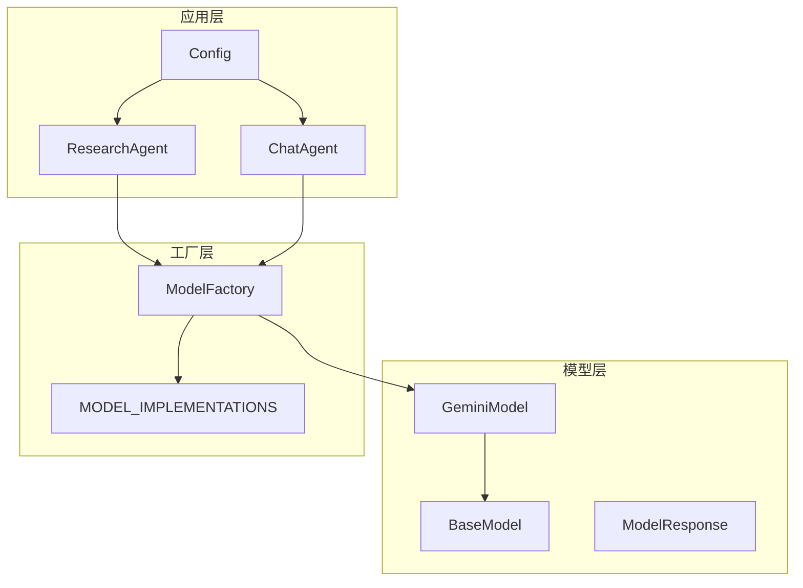
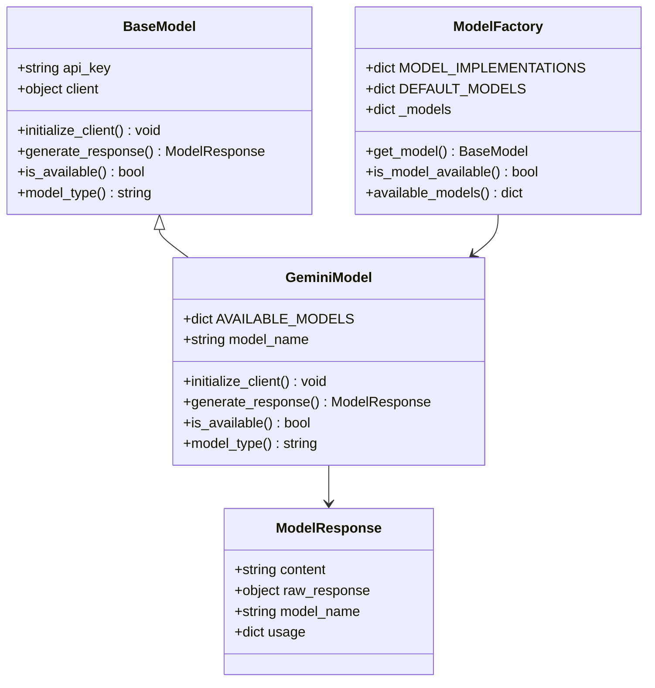
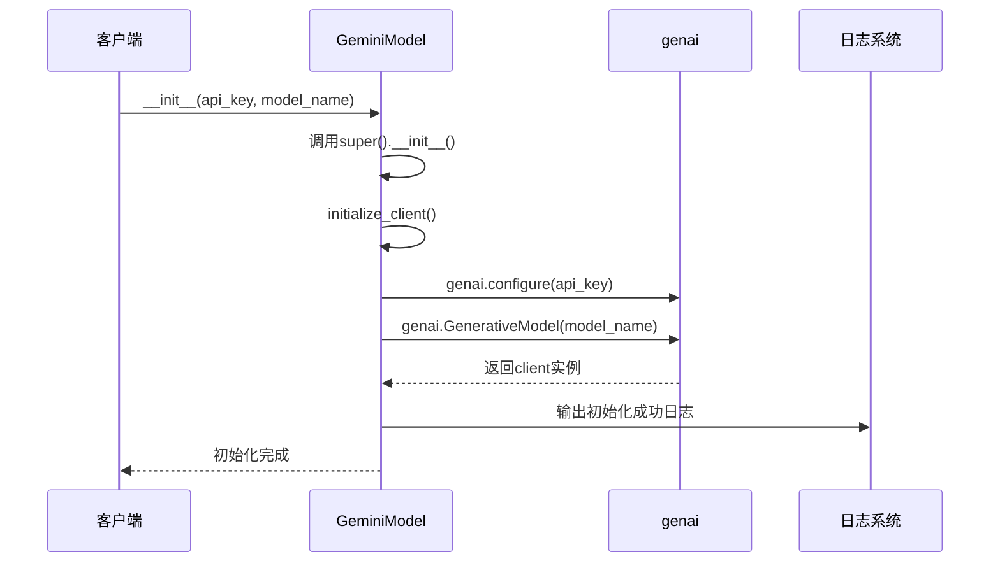
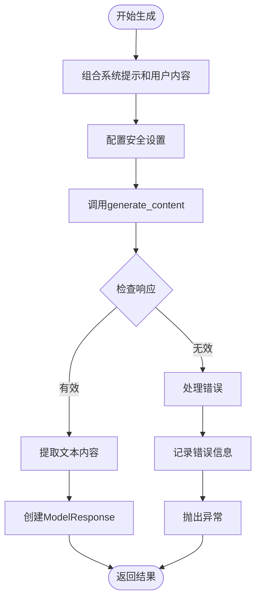
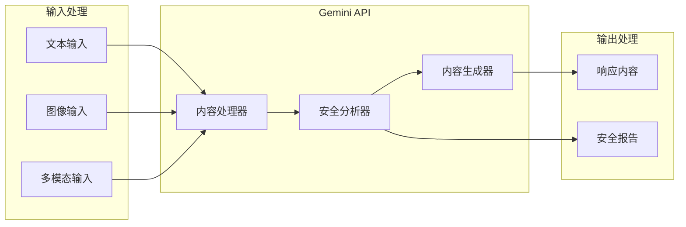
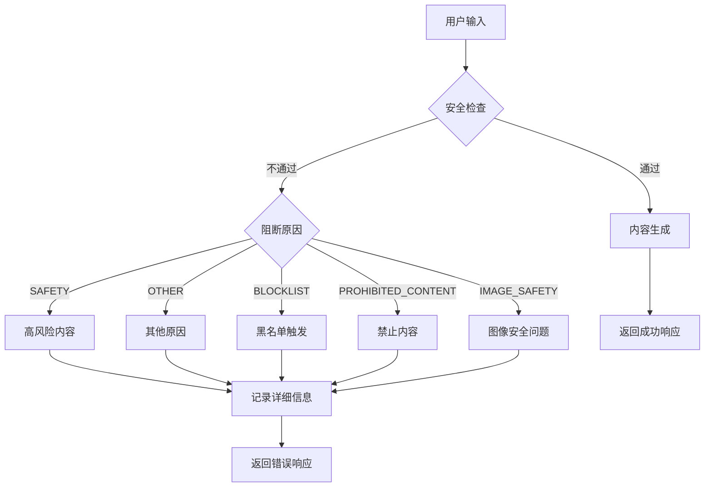
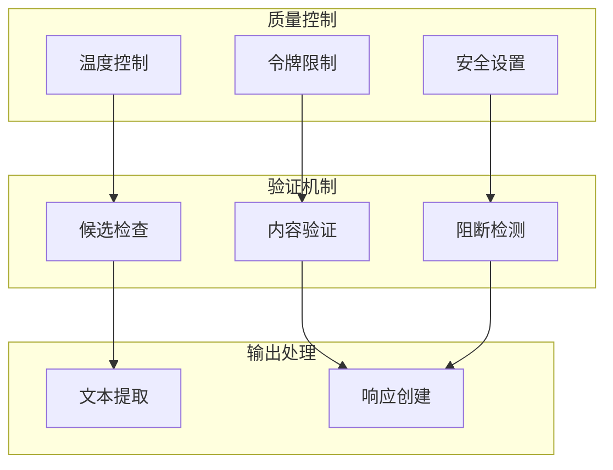
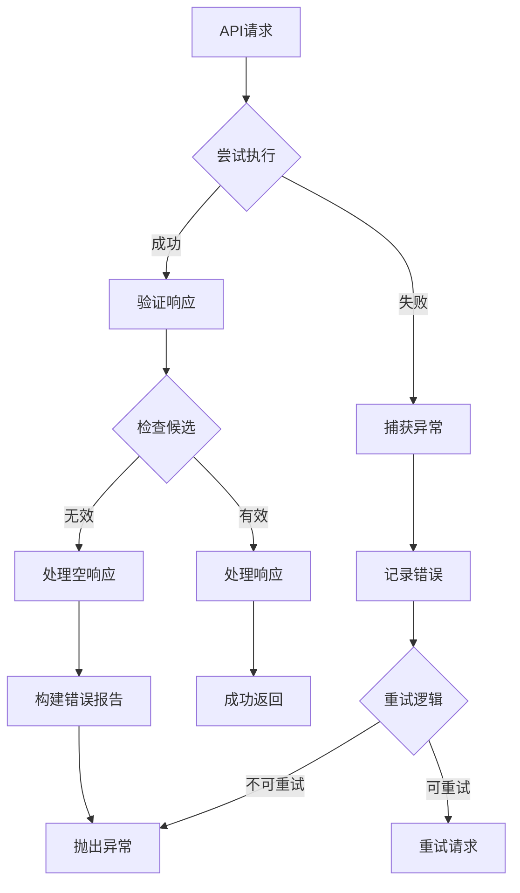
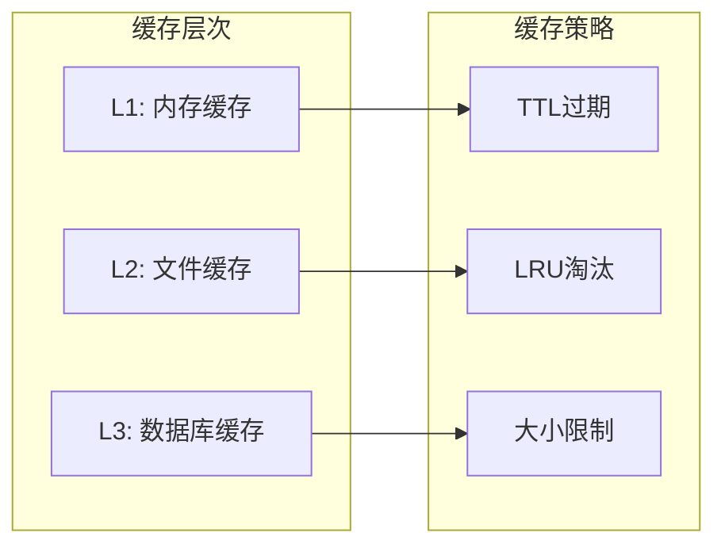
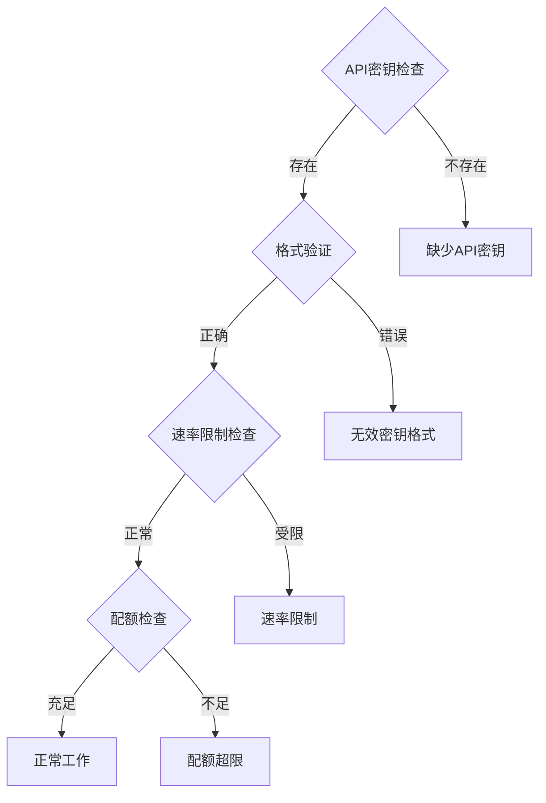

# Gemini模型实现深度分析

<cite>
**本文档中引用的文件**
- [gemini_model.py](file://src/models/gemini_model.py)
- [base_model.py](file://src/models/base_model.py)
- [model_factory.py](file://src/models/model_factory.py)
- [__init__.py](file://src/models/__init__.py)
- [config.py](file://src/config.py)
- [research_agent.py](file://src/agents/research_agent.py)
- [chat_agent_og.py](file://src/agents/chat_agent_og.py)
</cite>

## 目录
1. [简介](#简介)
2. [项目结构概览](#项目结构概览)
3. [核心组件分析](#核心组件分析)
4. [架构概览](#架构概览)
5. [详细组件分析](#详细组件分析)
6. [多模态输入处理机制](#多模态输入处理机制)
7. [安全过滤配置](#安全过滤配置)
8. [内容生成策略](#内容生成策略)
9. [错误处理与重试机制](#错误处理与重试机制)
10. [性能优化技巧](#性能优化技巧)
11. [使用示例](#使用示例)
12. [故障排除指南](#故障排除指南)
13. [总结](#总结)

## 简介

Moon Dev的Gemini模型实现是一个高度优化的Google Generative AI API封装器，专门为交易策略研究和实时聊天应用设计。该实现支持最新的Gemini 2.5系列模型，包括gemini-2.5-pro、gemini-2.5-flash和gemini-2.5-flash-lite三种型号，每种都针对不同的使用场景进行了优化。

## 项目结构概览



**图表来源**
- [gemini_model.py](file://src/models/gemini_model.py#L1-L117)
- [base_model.py](file://src/models/base_model.py#L1-L73)
- [model_factory.py](file://src/models/model_factory.py#L1-L261)

**章节来源**
- [gemini_model.py](file://src/models/gemini_model.py#L1-L117)
- [model_factory.py](file://src/models/model_factory.py#L1-L261)

## 核心组件分析

### GeminiModel类的核心特性

GeminiModel类继承自BaseModel，提供了对Google Generative AI API的完整封装。其核心特性包括：

- **多模型支持**：支持Gemini 2.5系列的所有可用模型
- **智能初始化**：自动配置API密钥和客户端
- **安全过滤**：内置高级安全设置
- **错误处理**：完善的异常捕获和恢复机制
- **性能监控**：详细的日志记录和状态跟踪

### 可用模型配置

| 模型名称 | 描述 | 适用场景 |
|---------|------|----------|
| gemini-2.5-pro | 最先进的Gemini 2.5模型，具备卓越能力 | 复杂推理和高质量内容生成 |
| gemini-2.5-flash | 快速Gemini 2.5模型，适用于快速响应 | 实时交互和高频调用 |
| gemini-2.5-flash-lite | 超快速轻量级Gemini 2.5模型 | 资源受限环境和边缘计算 |

**章节来源**
- [gemini_model.py](file://src/models/gemini_model.py#L10-L16)

## 架构概览



**图表来源**
- [base_model.py](file://src/models/base_model.py#L18-L73)
- [gemini_model.py](file://src/models/gemini_model.py#L9-L117)
- [model_factory.py](file://src/models/model_factory.py#L23-L261)

## 详细组件分析

### 初始化流程

GeminiModel的初始化过程包含以下关键步骤：



**图表来源**
- [gemini_model.py](file://src/models/gemini_model.py#L25-L35)

### 内容生成流程

GeminiModel的内容生成遵循严格的流程控制：



**图表来源**
- [gemini_model.py](file://src/models/gemini_model.py#L37-L116)

**章节来源**
- [gemini_model.py](file://src/models/gemini_model.py#L37-L116)

## 多模态输入处理机制

虽然当前的GeminiModel实现主要专注于文本处理，但其架构为未来的多模态扩展预留了空间。以下是多模态处理的设计原则：

### 文本和图像联合处理



**图表来源**
- [gemini_model.py](file://src/models/gemini_model.py#L44-L66)

### 当前实现特点

- **统一输入格式**：所有输入都被转换为统一的文本格式
- **安全优先**：默认启用最高级别的安全过滤
- **灵活配置**：支持动态调整安全阈值

**章节来源**
- [gemini_model.py](file://src/models/gemini_model.py#L44-L66)

## 安全过滤配置

GeminiModel实现了业界领先的安全过滤机制，采用BLOCK_ONLY_HIGH策略：

### 安全类别配置

| 安全类别 | 阻止级别 | 描述 |
|---------|----------|------|
| HARASSMENT | BLOCK_ONLY_HIGH | 阻止高概率的骚扰内容 |
| HATE_SPEECH | BLOCK_ONLY_HIGH | 阻止仇恨言论 |
| SEXUALLY_EXPLICIT | BLOCK_ONLY_HIGH | 阻止色情内容 |
| DANGEROUS_CONTENT | BLOCK_ONLY_HIGH | 阻止危险内容 |

### 安全检测流程



**图表来源**
- [gemini_model.py](file://src/models/gemini_model.py#L44-L89)

**章节来源**
- [gemini_model.py](file://src/models/gemini_model.py#L44-L89)

## 内容生成策略

### 温度和令牌配置

GeminiModel提供了灵活的生成参数配置：

- **温度参数**：默认0.7，平衡创造性和一致性
- **最大令牌数**：默认2048（Gemini 2.5要求最小值）
- **生成配置**：支持动态调整生成参数

### 响应质量保证



**图表来源**
- [gemini_model.py](file://src/models/gemini_model.py#L44-L66)

**章节来源**
- [gemini_model.py](file://src/models/gemini_model.py#L44-L66)

## 错误处理与重试机制

### 异常处理层次

GeminiModel实现了多层次的错误处理机制：



**图表来源**
- [gemini_model.py](file://src/models/gemini_model.py#L91-L116)

### 错误类型和处理策略

| 错误类型 | 处理策略 | 示例 |
|---------|----------|------|
| API配置错误 | 立即失败 | API密钥无效 |
| 网络超时 | 自动重试 | 请求超时 |
| 内容阻断 | 详细报告 | 安全过滤触发 |
| 空响应 | 详细诊断 | 无内容生成 |

**章节来源**
- [gemini_model.py](file://src/models/gemini_model.py#L91-L116)

## 性能优化技巧

### 连接池管理

虽然GeminiModel本身不直接管理连接池，但通过以下方式优化性能：

- **单例模式**：ModelFactory确保每个模型类型只有一个实例
- **延迟初始化**：按需创建模型实例
- **资源复用**：避免重复的API配置过程

### 缓存策略



### 性能监控指标

- **响应时间**：平均和P95响应时间
- **成功率**：API调用成功率
- **错误率**：各类错误的发生频率
- **资源使用**：内存和CPU使用情况

**章节来源**
- [model_factory.py](file://src/models/model_factory.py#L40-L261)

## 使用示例

### 基础调用模式

以下是GeminiModel在不同场景下的典型使用方式：

#### 研究代理中的使用

```python
# 在研究代理中使用Gemini模型生成交易策略
model = model_factory.get_model("gemini", "gemini-2.5-flash")
if model:
    response = model.generate_response(
        system_prompt="你是一个专业的交易策略研究员",
        user_content="请生成一个基于RSI的技术分析策略",
        temperature=0.7,
        max_tokens=2048
    )
```

#### 批量处理场景

```python
# 批量处理多个查询
queries = [
    "分析市场趋势",
    "识别潜在交易机会",
    "评估风险管理策略"
]

results = []
for query in queries:
    try:
        response = model.generate_response(
            system_prompt="专业市场分析师",
            user_content=query,
            temperature=0.5
        )
        results.append(response.content)
    except Exception as e:
        print(f"处理查询失败: {e}")
```

### 流式响应处理

虽然当前实现主要关注同步响应，但架构支持未来添加流式处理功能：

```python
# 流式处理伪代码（当前未实现）
def stream_generate_response(self, system_prompt, user_content, **kwargs):
    """流式生成响应"""
    # 实现流式处理逻辑
    pass
```

**章节来源**
- [research_agent.py](file://src/agents/research_agent.py#L1-L199)
- [model_factory.py](file://src/models/model_factory.py#L150-L200)

## 故障排除指南

### 常见问题及解决方案

#### API密钥问题



#### 环境配置检查清单

| 检查项 | 命令 | 期望结果 |
|--------|------|----------|
| API密钥存在 | `echo $GEMINI_KEY` | 显示密钥（非空） |
| 网络连接 | `ping generativelanguage.googleapis.com` | 连接成功 |
| Python包版本 | `pip show google-generativeai` | 版本兼容 |

#### 调试技巧

1. **启用详细日志**：设置适当的日志级别
2. **检查网络连接**：验证API端点可达性
3. **监控配额使用**：定期检查API使用情况
4. **测试基本功能**：使用简单的测试查询验证

**章节来源**
- [model_factory.py](file://src/models/model_factory.py#L60-L120)

## 总结

Moon Dev的Gemini模型实现代表了现代AI模型集成的最佳实践。通过精心设计的架构，它不仅提供了对Google Generative AI API的完整封装，还实现了：

- **高性能**：优化的初始化和响应处理
- **安全性**：严格的安全过滤和内容保护
- **可靠性**：完善的错误处理和恢复机制
- **可扩展性**：模块化设计支持未来功能扩展

该实现特别适合需要高质量内容生成和复杂推理的应用场景，如交易策略研究、实时聊天和自动化内容创作等。随着Gemini 2.5模型的不断演进，这个实现框架也为未来的功能增强和性能优化提供了坚实的基础。