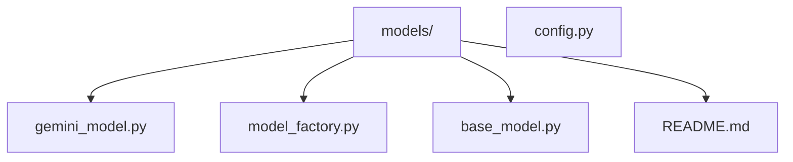
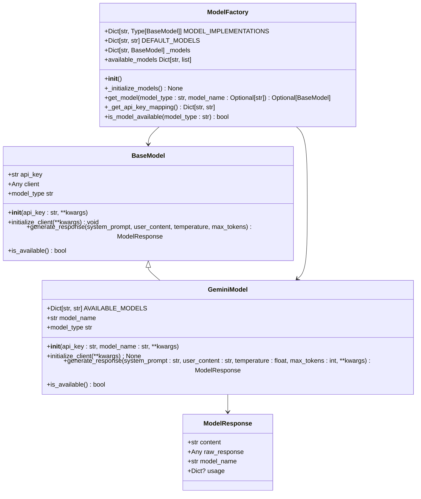
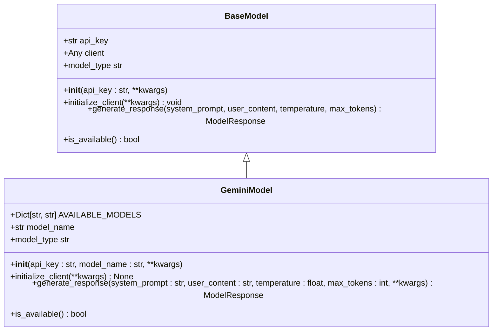
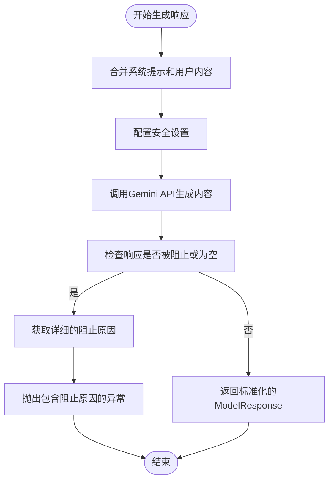
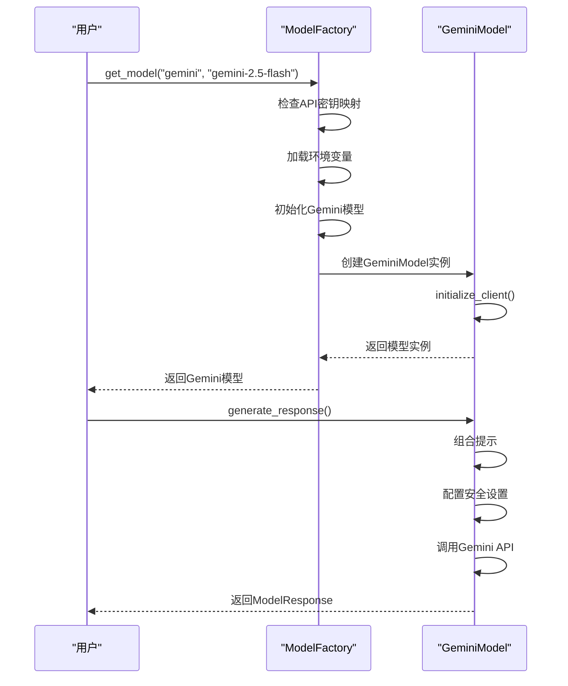
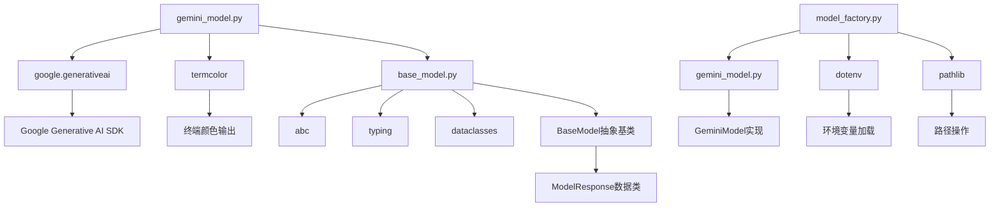

# Google Gemini模型集成

<cite>
**本文档引用的文件**
- [gemini_model.py](file://src/models/gemini_model.py)
- [model_factory.py](file://src/models/model_factory.py)
- [base_model.py](file://src/models/base_model.py)
- [config.py](file://src/config.py)
- [README.md](file://src/models/README.md)
</cite>

## 目录
1. [项目结构](#项目结构)
2. [核心组件](#核心组件)
3. [架构概述](#架构概述)
4. [详细组件分析](#详细组件分析)
5. [依赖分析](#依赖分析)
6. [性能考虑](#性能考虑)
7. [故障排除指南](#故障排除指南)
8. [结论](#结论)

## 项目结构

**Diagram sources**
- [gemini_model.py](file://src/models/gemini_model.py)
- [model_factory.py](file://src/models/model_factory.py)
- [base_model.py](file://src/models/base_model.py)
- [README.md](file://src/models/README.md)

**Section sources**
- [gemini_model.py](file://src/models/gemini_model.py)
- [model_factory.py](file://src/models/model_factory.py)

## 核心组件

Google Gemini模型集成通过`gemini_model.py`文件实现了对Gemini API的完整封装，提供了多模态输入处理、安全过滤和内容生成策略。该实现继承自`BaseModel`抽象基类，并通过`ModelFactory`进行统一管理。Gemini模型支持三种不同的模型变体：gemini-2.5-pro（最先进）、gemini-2.5-flash（快速响应）和gemini-2.5-flash-lite（超轻量级）。

**Section sources**
- [gemini_model.py](file://src/models/gemini_model.py#L1-L116)
- [base_model.py](file://src/models/base_model.py#L1-L72)

## 架构概述

**Diagram sources**
- [gemini_model.py](file://src/models/gemini_model.py#L1-L116)
- [base_model.py](file://src/models/base_model.py#L1-L72)
- [model_factory.py](file://src/models/model_factory.py#L1-L260)

## 详细组件分析

### GeminiModel分析

GeminiModel类实现了Google Gemini模型的完整功能，包括认证、请求生成和安全过滤。该类通过继承BaseModel抽象基类，确保了与其他AI模型的一致性接口。

**Diagram sources**
- [gemini_model.py](file://src/models/gemini_model.py#L1-L116)
- [base_model.py](file://src/models/base_model.py#L1-L72)

**Section sources**
- [gemini_model.py](file://src/models/gemini_model.py#L1-L116)

### 多模态输入处理与安全过滤

Gemini模型的实现包含了先进的安全过滤机制，使用BLOCK_ONLY_HIGH设置来阻止高风险内容，同时允许中等风险内容通过。这种平衡的安全策略确保了系统的可用性，同时保护了用户免受有害内容的影响。

**Diagram sources**
- [gemini_model.py](file://src/models/gemini_model.py#L44-L116)

**Section sources**
- [gemini_model.py](file://src/models/gemini_model.py#L44-L116)

### ModelFactory集成与动态模型切换

ModelFactory类提供了统一的接口来管理所有AI模型，包括Gemini模型。它负责初始化、API密钥管理和提供一致的响应生成接口。

**Diagram sources**
- [model_factory.py](file://src/models/model_factory.py#L1-L260)
- [gemini_model.py](file://src/models/gemini_model.py#L1-L116)

**Section sources**
- [model_factory.py](file://src/models/model_factory.py#L1-L260)

## 依赖分析

**Diagram sources**
- [gemini_model.py](file://src/models/gemini_model.py)
- [model_factory.py](file://src/models/model_factory.py)
- [base_model.py](file://src/models/base_model.py)

**Section sources**
- [gemini_model.py](file://src/models/gemini_model.py)
- [model_factory.py](file://src/models/model_factory.py)

## 性能考虑

Gemini模型的实现考虑了多个性能因素，包括最小令牌限制（2048+令牌）和响应时间优化。gemini-2.5-flash和gemini-2.5-flash-lite模型特别针对快速响应进行了优化，适合需要低延迟的应用场景。同时，系统通过nonce随机数防止缓存，确保每次请求都是唯一的。

[无具体文件分析，因此不提供来源]

## 故障排除指南

当Gemini模型集成出现问题时，应首先检查API密钥是否正确配置在.env文件中，环境变量名称为GEMINI_KEY。如果初始化失败，可能是由于网络连接问题或API密钥无效。对于响应被阻止的情况，系统会提供详细的阻止原因，包括安全类别和概率等级，帮助开发者理解内容过滤的原因。

**Section sources**
- [gemini_model.py](file://src/models/gemini_model.py#L91-L116)
- [model_factory.py](file://src/models/model_factory.py#L51-L81)

## 结论

Google Gemini模型集成提供了一个强大而灵活的接口，用于访问Google的先进AI模型。通过ModelFactory的统一管理，开发者可以轻松地在不同AI模型之间切换，同时享受一致的API体验。安全过滤机制确保了内容的安全性，而多模型支持则提供了性能和功能之间的平衡选择。

[无具体文件分析，因此不提供来源]