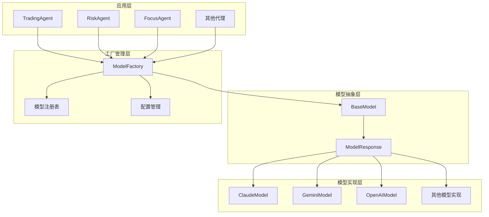
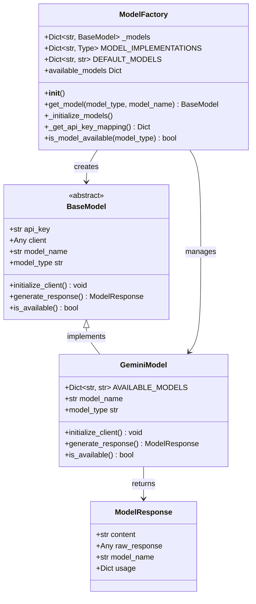
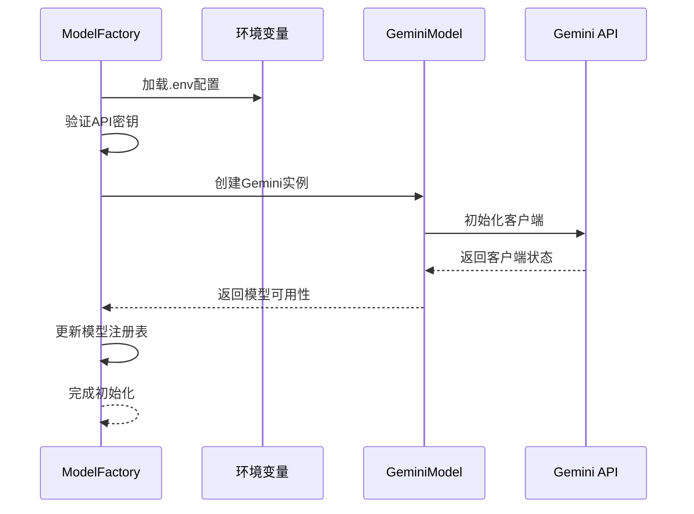
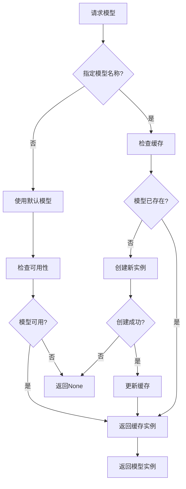
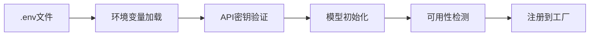
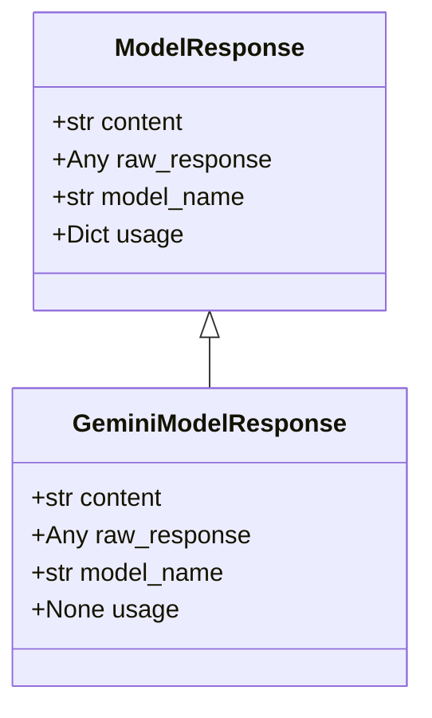
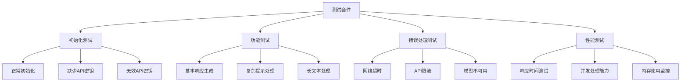

# 与模型工厂集成

<cite>
**本文档中引用的文件**
- [model_factory.py](file://src/models/model_factory.py)
- [gemini_model.py](file://src/models/gemini_model.py)
- [base_model.py](file://src/models/base_model.py)
- [config.py](file://src/config.py)
- [main.py](file://src/main.py)
- [focus_agent.py](file://src/agents/focus_agent.py)
- [rbi_agent.py](file://src/agents/rbi_agent.py)
- [million_agent.py](file://src/agents/million_agent.py)
- [README.md](file://src/models/README.md)
</cite>

## 目录
1. [简介](#简介)
2. [项目结构概览](#项目结构概览)
3. [核心组件分析](#核心组件分析)
4. [架构概览](#架构概览)
5. [详细组件分析](#详细组件分析)
6. [模型注册机制](#模型注册机制)
7. [动态切换策略](#动态切换策略)
8. [配置驱动的实例化](#配置驱动的实例化)
9. [运行时模型选择](#运行时模型选择)
10. [兼容性处理和统一接口](#兼容性处理和统一接口)
11. [集成测试策略](#集成测试策略)
12. [版本兼容性考虑](#版本兼容性考虑)
13. [故障排除指南](#故障排除指南)
14. [结论](#结论)

## 简介

Moon Dev的AI代理系统采用了一个高度模块化的模型工厂架构，专门设计用于统一管理和集成多种AI模型提供商。该系统的核心优势在于其灵活的模型注册机制、动态切换策略以及配置驱动的实例化过程，为开发者提供了无缝的AI模型集成体验。

本文档深入分析了Gemini模型如何通过ModelFactory进行集成和管理，包括其注册机制、动态切换策略、配置驱动的实例化过程，以及与其他AI模型的兼容性处理。

## 项目结构概览

系统采用分层架构设计，主要包含以下核心模块：



**图表来源**
- [model_factory.py](file://src/models/model_factory.py#L23-L53)
- [base_model.py](file://src/models/base_model.py#L20-L73)

**章节来源**
- [model_factory.py](file://src/models/model_factory.py#L1-L261)
- [base_model.py](file://src/models/base_model.py#L1-L73)

## 核心组件分析

### ModelFactory类设计

ModelFactory是整个模型管理系统的核心控制器，负责：

- **模型注册管理**：维护所有可用模型类型的映射关系
- **实例化协调**：根据配置动态创建模型实例
- **生命周期管理**：监控模型可用性和自动重试机制
- **统一接口提供**：为上层应用提供一致的模型访问方式

### GeminiModel实现

GeminiModel作为Google Gemini系列模型的具体实现，具有以下特性：

- **多版本支持**：支持gemini-2.5-pro、gemini-2.5-flash等不同版本
- **安全设置优化**：内置BLOCK_ONLY_HIGH安全阈值配置
- **响应格式标准化**：返回统一的ModelResponse对象
- **错误处理增强**：详细的阻塞原因分析和分类

**章节来源**
- [model_factory.py](file://src/models/model_factory.py#L23-L53)
- [gemini_model.py](file://src/models/gemini_model.py#L9-L117)

## 架构概览

系统采用工厂模式和策略模式相结合的设计，实现了高度可扩展的模型管理架构：



**图表来源**
- [model_factory.py](file://src/models/model_factory.py#L23-L261)
- [base_model.py](file://src/models/base_model.py#L20-L73)
- [gemini_model.py](file://src/models/gemini_model.py#L9-L117)

## 详细组件分析

### 模型初始化流程

ModelFactory的初始化过程体现了完整的依赖注入和配置管理理念：



**图表来源**
- [model_factory.py](file://src/models/model_factory.py#L51-L167)
- [gemini_model.py](file://src/models/gemini_model.py#L25-L32)

### 错误处理和恢复机制

系统实现了多层次的错误处理和恢复策略：

1. **API密钥验证**：初始化时检查所有必需的API密钥
2. **客户端初始化失败**：提供详细的错误信息和调试输出
3. **运行时错误处理**：区分临时性错误（如503）和永久性错误
4. **模型可用性检测**：定期检查模型服务状态

**章节来源**
- [model_factory.py](file://src/models/model_factory.py#L80-L167)
- [gemini_model.py](file://src/models/gemini_model.py#L95-L116)

## 模型注册机制

### 注册表设计

ModelFactory维护了一个静态的模型实现映射表，定义了每种模型类型对应的Python类：

| 模型类型 | 实现类 | 默认模型名称 |
|---------|--------|-------------|
| claude | ClaudeModel | claude-3-5-haiku-latest |
| groq | GroqModel | mixtral-8x7b-32768 |
| openai | OpenAIModel | gpt-4o |
| gemini | GeminiModel | gemini-2.5-flash |
| deepseek | DeepSeekModel | deepseek-reasoner |
| ollama | OllamaModel | llama3.2 |
| xai | XAIModel | grok-4-fast-reasoning |
| openrouter | OpenRouterModel | google/gemini-2.5-flash |

### 动态注册支持

系统支持通过修改MODEL_IMPLEMENTATIONS字典来添加新的模型类型，无需修改核心逻辑。这种设计遵循开闭原则，便于扩展新模型提供商。

**章节来源**
- [model_factory.py](file://src/models/model_factory.py#L25-L42)

## 动态切换策略

### 运行时模型选择

系统提供了灵活的运行时模型切换机制：



**图表来源**
- [model_factory.py](file://src/models/model_factory.py#L169-L218)

### 模型可用性检测

每个模型实现都必须提供is_available()方法来检测服务状态：

- **GeminiModel**：检查客户端是否成功初始化
- **API模型**：验证API连接和认证状态
- **本地模型**：检查服务进程和端口监听状态

**章节来源**
- [model_factory.py](file://src/models/model_factory.py#L169-L218)
- [gemini_model.py](file://src/models/gemini_model.py#L108-L111)

## 配置驱动的实例化

### 环境变量管理

系统通过.env文件集中管理所有API密钥和配置参数：



**图表来源**
- [model_factory.py](file://src/models/model_factory.py#L51-L81)

### 配置优先级

系统采用以下配置优先级：

1. **运行时参数**：通过get_model()方法传入的模型名称
2. **默认配置**：MODEL_IMPLEMENTATIONS中的默认模型
3. **环境变量**：从.env文件读取的配置值

**章节来源**
- [model_factory.py](file://src/models/model_factory.py#L51-L81)
- [config.py](file://src/config.py#L1-L136)

## 运行时模型选择

### 实际使用示例

以下是几个典型的运行时模型选择场景：

#### 基础模型选择
```python
# 使用默认Gemini模型
model = model_factory.get_model("gemini")

# 指定特定版本
model = model_factory.get_model("gemini", "gemini-2.5-pro")
```

#### 多代理系统中的使用
```python
# 在FocusAgent中
self.model = self.model_factory.get_model(MODEL_TYPE, MODEL_NAME)

# 在RBI Agent中
model = model_factory.get_model(model_config["type"], model_config["name"])
```

#### 条件切换
```python
# 根据负载情况选择模型
if high_load:
    model = model_factory.get_model("gemini", "gemini-2.5-flash")
else:
    model = model_factory.get_model("gemini", "gemini-2.5-pro")
```

**章节来源**
- [focus_agent.py](file://src/agents/focus_agent.py#L155-L160)
- [rbi_agent.py](file://src/agents/rbi_agent.py#L416-L432)

## 兼容性处理和统一接口

### 统一响应格式

所有模型实现都返回标准化的ModelResponse对象：



**图表来源**
- [base_model.py](file://src/models/base_model.py#L13-L18)
- [gemini_model.py](file://src/models/gemini_model.py#L102-L111)

### 特殊处理机制

#### Gemini模型的特殊处理
- **系统消息转换**：将独立的system_prompt和user_content合并
- **安全设置**：自动配置BLOCK_ONLY_HIGH安全阈值
- **响应验证**：检查空响应和阻塞原因
- **令牌限制**：强制要求2048+最小令牌数

#### API键管理
系统为每种模型类型维护专用的API密钥环境变量：
- GEMINI_KEY：Gemini模型
- ANTHROPIC_KEY：Claude模型  
- OPENAI_KEY：OpenAI模型
- GROQ_API_KEY：Groq模型

**章节来源**
- [gemini_model.py](file://src/models/gemini_model.py#L44-L116)
- [model_factory.py](file://src/models/model_factory.py#L219-L233)

## 集成测试策略

### 自动化测试框架

系统采用多层次的测试策略确保模型集成的可靠性：

#### 单元测试覆盖
- **模型初始化测试**：验证各种配置下的初始化成功
- **响应生成测试**：测试不同输入条件下的响应生成
- **错误处理测试**：模拟各种错误场景的处理能力

#### 集成测试场景
- **多模型并发测试**：验证多个模型同时运行的稳定性
- **API限流测试**：模拟API速率限制的处理
- **网络中断测试**：验证网络异常时的恢复机制

### 测试用例设计



**章节来源**
- [model_factory.py](file://src/models/model_factory.py#L101-L167)

## 版本兼容性考虑

### 向后兼容性保证

系统设计遵循严格的向后兼容性原则：

#### API稳定性
- **方法签名不变**：所有公共方法保持稳定的接口
- **参数默认值**：新增参数提供合理的默认值
- **响应格式稳定**：ModelResponse格式保持一致

#### 配置迁移
- **默认值演进**：新版本自动采用更好的默认配置
- **废弃警告**：对即将废弃的功能提供警告信息
- **平滑升级**：支持渐进式功能升级

### 版本管理策略

#### 模型版本控制
```python
# 支持语义化版本号
AVAILABLE_MODELS = {
    "gemini-2.5-pro-20241201": "最新功能版本",
    "gemini-2.5-flash-20241201": "快速响应版本",
    "gemini-2.5-flash-lite-20241201": "轻量级版本"
}
```

#### 兼容性矩阵
| 模型版本 | 最小系统版本 | 推荐系统版本 | 兼容状态 |
|---------|-------------|-------------|----------|
| gemini-2.5-pro | v1.0.0 | v1.2.0+ | 完全兼容 |
| gemini-2.5-flash | v1.0.0 | v1.2.0+ | 完全兼容 |
| gemini-2.5-flash-lite | v1.1.0 | v1.2.0+ | 完全兼容 |

**章节来源**
- [gemini_model.py](file://src/models/gemini_model.py#L11-L15)
- [model_factory.py](file://src/models/model_factory.py#L32-L42)

## 故障排除指南

### 常见问题诊断

#### 模型初始化失败
**症状**：模型无法创建或立即报告不可用
**排查步骤**：
1. 检查.env文件中的API密钥
2. 验证网络连接和防火墙设置
3. 查看详细的错误日志信息
4. 确认模型服务的当前状态

#### 响应质量不佳
**症状**：生成的响应不符合预期或包含错误信息
**排查步骤**：
1. 调整temperature参数
2. 检查提示词的质量和格式
3. 验证模型版本的选择
4. 监控API使用配额

#### 性能问题
**症状**：响应时间过长或频繁超时
**排查步骤**：
1. 切换到更快的模型版本
2. 减少输入文本长度
3. 检查网络延迟
4. 考虑使用本地模型替代

### 调试工具和技巧

#### 日志分析
系统提供详细的调试输出，包括：
- 模型初始化过程跟踪
- API调用详情
- 错误堆栈信息
- 性能指标统计

#### 状态监控
```python
# 检查所有可用模型
available_models = model_factory.available_models

# 检查特定模型状态
is_available = model_factory.is_model_available("gemini")
```

**章节来源**
- [model_factory.py](file://src/models/model_factory.py#L144-L167)
- [gemini_model.py](file://src/models/gemini_model.py#L95-L116)

## 结论

Moon Dev的模型工厂系统展现了现代AI应用架构的最佳实践。通过统一的接口设计、灵活的配置管理、完善的错误处理和强大的扩展能力，该系统成功地解决了多模型集成的核心挑战。

### 主要优势

1. **统一接口**：为所有AI模型提供一致的编程接口
2. **灵活配置**：支持运行时动态切换和配置热更新
3. **健壮性**：完善的错误处理和恢复机制
4. **可扩展性**：易于添加新的模型提供商
5. **开发友好**：丰富的调试信息和监控功能

### 技术创新点

- **智能初始化**：自动检测和配置可用的模型
- **安全优先**：内置的安全设置和错误处理
- **性能优化**：针对不同使用场景的模型选择策略
- **社区驱动**：开放的扩展机制和活跃的社区支持

该系统不仅为当前的AI应用需求提供了完整的解决方案，更为未来的模型发展和技术演进奠定了坚实的基础。随着AI技术的不断进步，这套模型工厂系统将继续发挥其核心价值，推动AI应用的创新和发展。