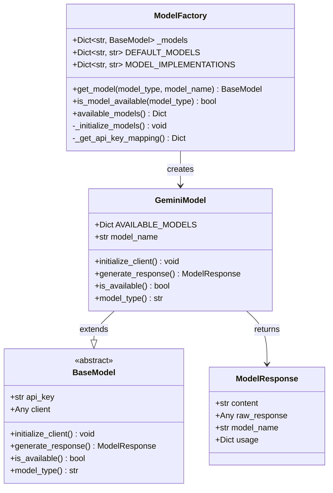
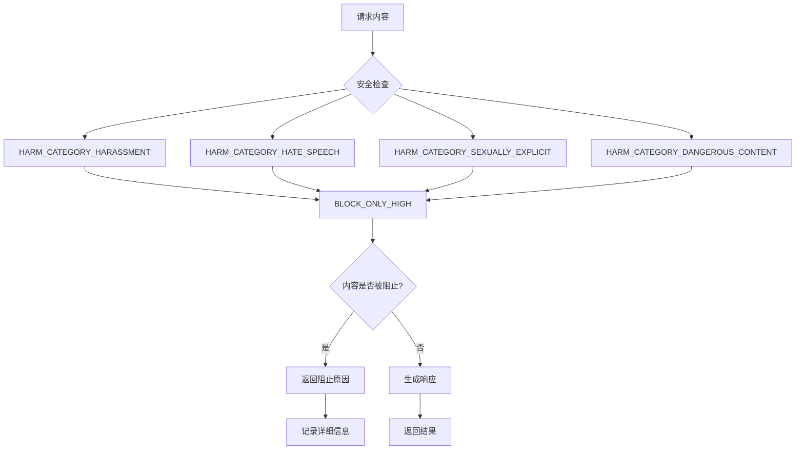
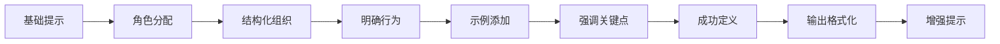
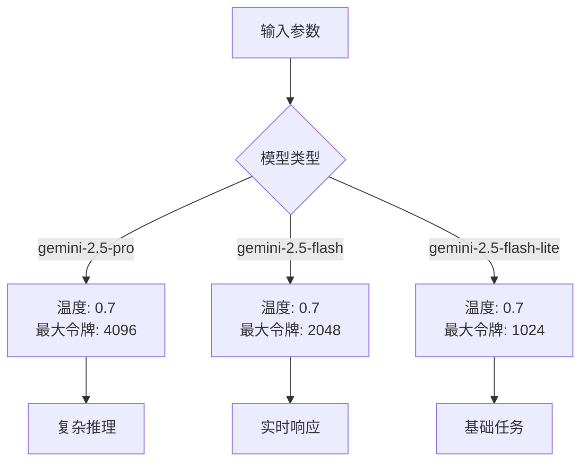
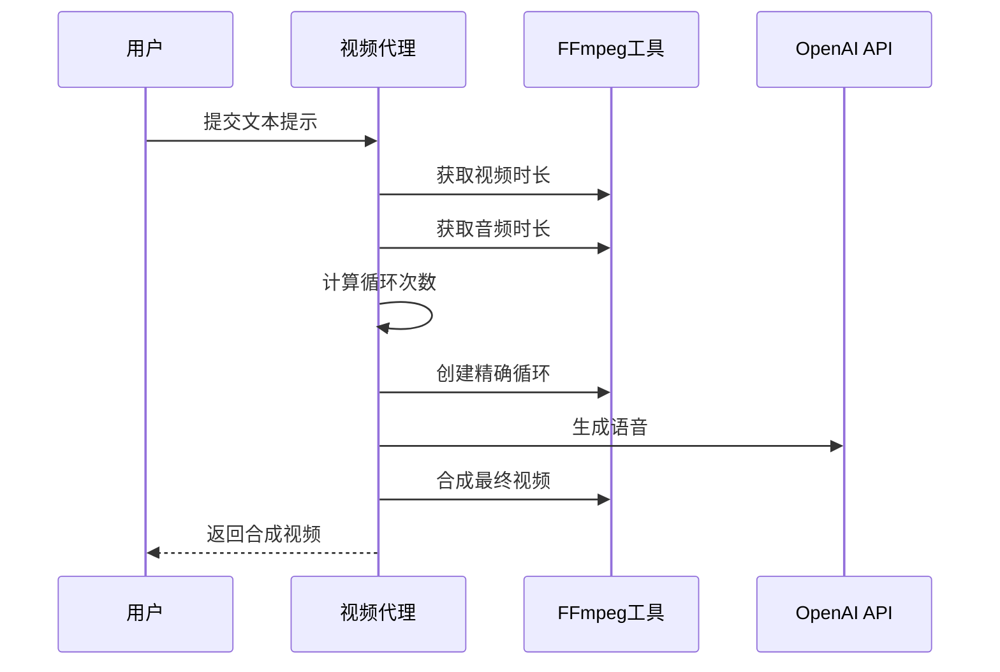
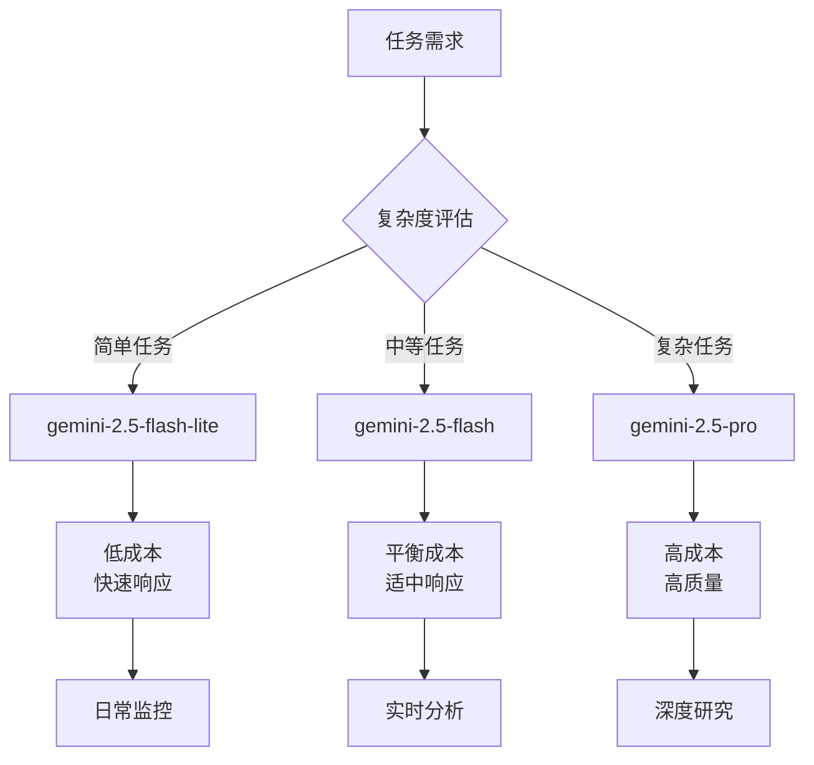
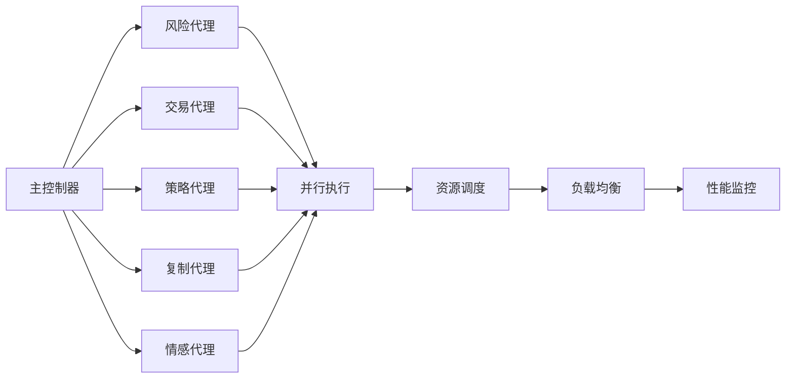
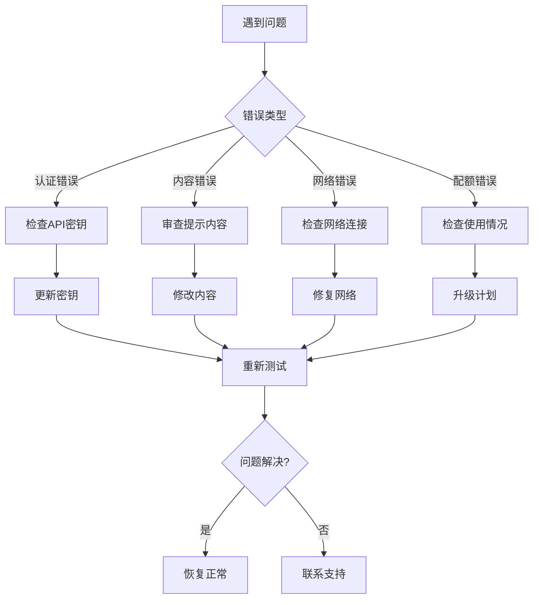
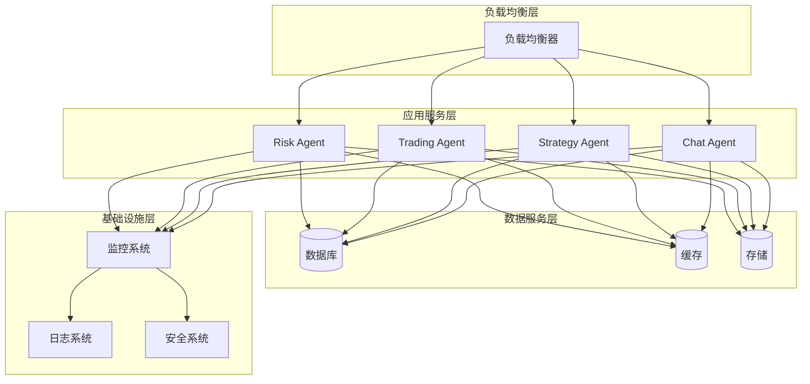
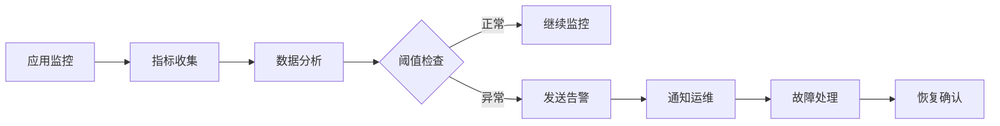

# 使用限制与最佳实践

<cite>
**本文档中引用的文件**
- [gemini_model.py](file://src/models/gemini_model.py)
- [base_model.py](file://src/models/base_model.py)
- [model_factory.py](file://src/models/model_factory.py)
- [config.py](file://src/config.py)
- [prompt_agent.py](file://src/agents/prompt_agent.py)
- [chat_agent.py](file://src/agents/chat_agent.py)
- [main.py](file://src/main.py)
- [README.md](file://README.md)
- [CLAUDE.md](file://CLAUDE.md)
</cite>

## 目录
1. [Gemini模型概述](#gemini模型概述)
2. [使用限制详解](#使用限制详解)
3. [提示工程最佳实践](#提示工程最佳实践)
4. [多模态应用场景优化](#多模态应用场景优化)
5. [成本控制策略](#成本控制策略)
6. [性能调优技巧](#性能调优技巧)
7. [常见问题解决方案](#常见问题解决方案)
8. [生产环境部署模式](#生产环境部署模式)
9. [总结与建议](#总结与建议)

## Gemini模型概述

Moon Dev的AI交易系统支持多种AI模型，其中Gemini 2.5系列是核心组件之一。系统通过统一的ModelFactory模式管理不同提供商的模型，为用户提供一致的接口体验。

**图表来源**
- [model_factory.py](file://src/models/model_factory.py#L15-L45)
- [gemini_model.py](file://src/models/gemini_model.py#L10-L25)
- [base_model.py](file://src/models/base_model.py#L15-L30)

**章节来源**
- [model_factory.py](file://src/models/model_factory.py#L15-L50)
- [gemini_model.py](file://src/models/gemini_model.py#L10-L30)

## 使用限制详解

### 模型规格与能力对比

Gemini 2.5系列提供了三个主要版本，每个都有特定的用途和限制：

| 模型名称 | 描述 | 最小令牌数 | 适用场景 |
|---------|------|-----------|----------|
| gemini-2.5-pro | 最先进的Gemini 2.5模型，具备卓越能力 | 2048+ | 复杂推理、深度分析 |
| gemini-2.5-flash | 快速Gemini 2.5模型，适用于快速响应 | 2048+ | 实时交互、简单任务 |
| gemini-2.5-flash-lite | 超快速轻量级Gemini 2.5模型 | 2048+ | 基础任务、边缘计算 |

### 安全设置与内容政策

Gemini模型在安全设置方面有严格的要求，特别是在2025年之后需要特殊权限才能使用`BLOCK_NONE`配置：

**图表来源**
- [gemini_model.py](file://src/models/gemini_model.py#L45-L65)

### 频率限制与配额管理

虽然具体的频率限制数据未在代码中明确显示，但系统实现了以下保护机制：

1. **客户端初始化验证**：确保API密钥有效且账户有配额
2. **响应完整性检查**：验证生成的响应不为空
3. **错误分类处理**：根据不同的阻止原因提供详细的错误信息

**章节来源**
- [gemini_model.py](file://src/models/gemini_model.py#L25-L70)

## 提示工程最佳实践

### 提示设计模式

Moon Dev的Prompt Agent展示了专业的提示工程实践，基于Parahelp和Cursor的最佳实践：

**图表来源**
- [prompt_agent.py](file://src/agents/prompt_agent.py#L80-L120)

### 上下文管理技巧

系统采用多种策略来优化上下文窗口使用：

1. **模块化设计**：将提示分解为可重用的组件
2. **结构化格式**：使用Markdown和XML标签进行清晰组织
3. **优先级排序**：前端放置最重要的信息
4. **去冗余处理**：移除不必要的内容以节省令牌

### 温度与令牌数配置

**图表来源**
- [gemini_model.py](file://src/models/gemini_model.py#L35-L45)
- [config.py](file://src/config.py#L100-L110)

**章节来源**
- [prompt_agent.py](file://src/agents/prompt_agent.py#L80-L150)
- [gemini_model.py](file://src/models/gemini_model.py#L35-L50)

## 多模态应用场景优化

### 视频内容处理

系统支持多种视频处理任务，展示了多模态应用的能力：

**图表来源**
- [shortvid_agent.py](file://src/agents/shortvid_agent.py#L127-L151)
- [video_agent.py](file://src/agents/video_agent.py#L211-L249)

### 图像与音频分析

虽然当前代码主要关注文本处理，但系统架构支持扩展到多模态应用：

1. **音频转录**：使用OpenAI Whisper API进行音频分析
2. **视频帧提取**：从视频中提取关键帧进行分析
3. **多模态融合**：结合文本、图像和音频信息做出决策

**章节来源**
- [shortvid_agent.py](file://src/agents/shortvid_agent.py#L185-L220)
- [video_agent.py](file://src/agents/video_agent.py#L248-L281)

## 成本控制策略

### 模型选择优化

系统提供了灵活的模型选择机制，允许根据任务需求选择合适的模型：

**图表来源**
- [model_factory.py](file://src/models/model_factory.py#L30-L40)

### 批处理与缓存策略

1. **批量处理**：将多个相似请求合并处理
2. **智能缓存**：避免重复计算相同内容
3. **资源池管理**：合理分配可用资源

### API调用优化

系统实现了以下优化策略：

- **随机数防缓存**：每次请求添加唯一标识符防止缓存
- **错误重试机制**：对临时失败进行指数退避重试
- **连接池管理**：复用HTTP连接减少开销

**章节来源**
- [base_model.py](file://src/models/base_model.py#L35-L55)
- [model_factory.py](file://src/models/model_factory.py#L100-L150)

## 性能调优技巧

### 并发处理优化

系统支持多种并发模式来提升性能：

**图表来源**
- [main.py](file://src/main.py#L30-L50)

### 内存管理优化

1. **对象池化**：重用频繁创建的对象
2. **垃圾回收**：及时释放不再使用的资源
3. **内存监控**：跟踪内存使用情况

### 网络优化

- **连接复用**：使用HTTP/2或连接池
- **压缩传输**：启用gzip压缩
- **超时设置**：合理设置请求超时时间

**章节来源**
- [main.py](file://src/main.py#L40-L80)

## 常见问题解决方案

### 错误代码解释

系统提供了详细的错误处理机制：

| 错误类型 | 可能原因 | 解决方案 |
|---------|----------|----------|
| Empty response | 内容被安全过滤器阻止 | 检查内容合规性，调整安全设置 |
| Block_reason=SAFETY | 违反内容政策 | 修改提示内容，避免敏感话题 |
| API key invalid | 密钥无效或过期 | 更新环境变量中的API密钥 |
| Rate limit exceeded | 请求频率过高 | 实现指数退避重试机制 |
| Connection timeout | 网络连接问题 | 检查网络连接，增加超时时间 |

### 故障排除流程

**图表来源**
- [gemini_model.py](file://src/models/gemini_model.py#L70-L90)

### 性能问题诊断

1. **响应时间过长**：
   - 检查模型选择是否合适
   - 优化提示内容长度
   - 实现本地缓存机制

2. **内存使用过高**：
   - 实施对象池化
   - 及时清理临时数据
   - 监控内存泄漏

3. **并发处理瓶颈**：
   - 调整线程池大小
   - 实现异步处理
   - 优化资源分配

**章节来源**
- [gemini_model.py](file://src/models/gemini_model.py#L70-L100)

## 生产环境部署模式

### 微服务架构

系统采用微服务架构，支持独立部署和扩展：

**图表来源**
- [main.py](file://src/main.py#L20-L40)

### 容器化部署

系统支持Docker容器化部署，便于在不同环境中运行：

1. **镜像构建**：基于官方Python镜像
2. **环境隔离**：使用`.env`文件管理配置
3. **健康检查**：实现应用健康状态监控
4. **自动重启**：配置进程监控和自动恢复

### 监控与告警

**图表来源**
- [main.py](file://src/main.py#L70-L90)

### 配置管理

系统提供了灵活的配置管理机制：

- **环境变量**：通过`.env`文件管理敏感配置
- **配置热更新**：支持运行时配置修改
- **配置验证**：启动时验证配置完整性

**章节来源**
- [config.py](file://src/config.py#L1-L50)
- [main.py](file://src/main.py#L1-L40)

## 总结与建议

### 关键要点回顾

1. **使用限制**：
   - Gemini 2.5模型需要2048+最小令牌数
   - 安全设置必须使用`BLOCK_ONLY_HIGH`而非`BLOCK_NONE`
   - 不同模型版本有不同的性能和成本特征

2. **最佳实践**：
   - 采用模块化的提示设计
   - 根据任务复杂度选择合适的模型
   - 实施有效的错误处理和重试机制

3. **性能优化**：
   - 利用并发处理提升效率
   - 实施智能缓存策略
   - 优化网络通信和资源管理

### 推荐实施步骤

1. **评估阶段**：
   - 分析具体业务需求
   - 评估不同模型的适用性
   - 制定成本预算和性能目标

2. **开发阶段**：
   - 实现标准化的模型接口
   - 建立完善的错误处理机制
   - 开发监控和调试工具

3. **部署阶段**：
   - 选择合适的部署架构
   - 实施监控和告警系统
   - 建立运维支持体系

4. **优化阶段**：
   - 持续监控性能指标
   - 根据使用情况调整配置
   - 实施定期的系统维护

### 未来发展方向

随着AI技术的发展，建议关注以下趋势：

- **模型能力提升**：持续跟进新版本模型的功能改进
- **多模态融合**：探索文本、图像、音频的综合应用
- **边缘计算**：考虑在边缘设备上部署轻量级模型
- **自动化优化**：利用AI技术自动优化提示和配置

通过遵循这些最佳实践和建议，可以充分发挥Gemini模型的优势，同时有效控制成本和风险，实现稳定可靠的AI应用。