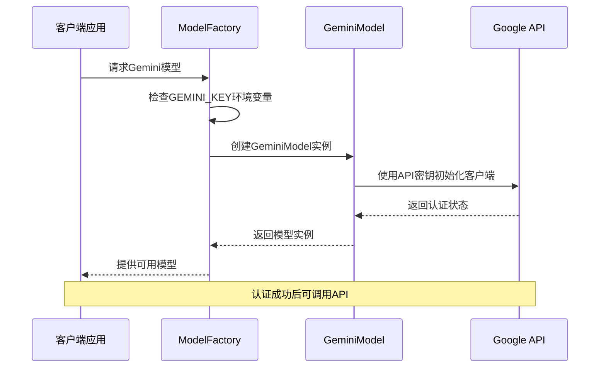
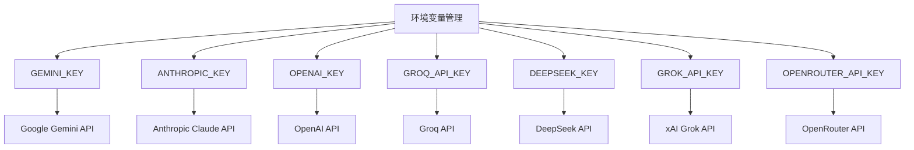
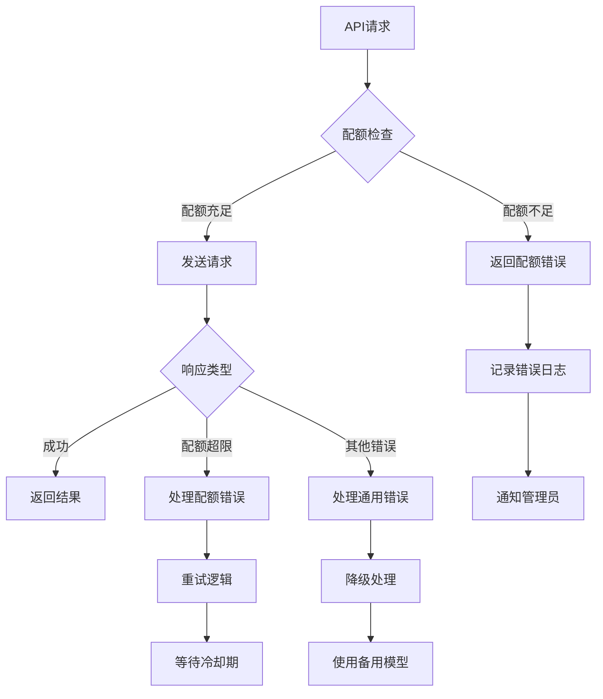
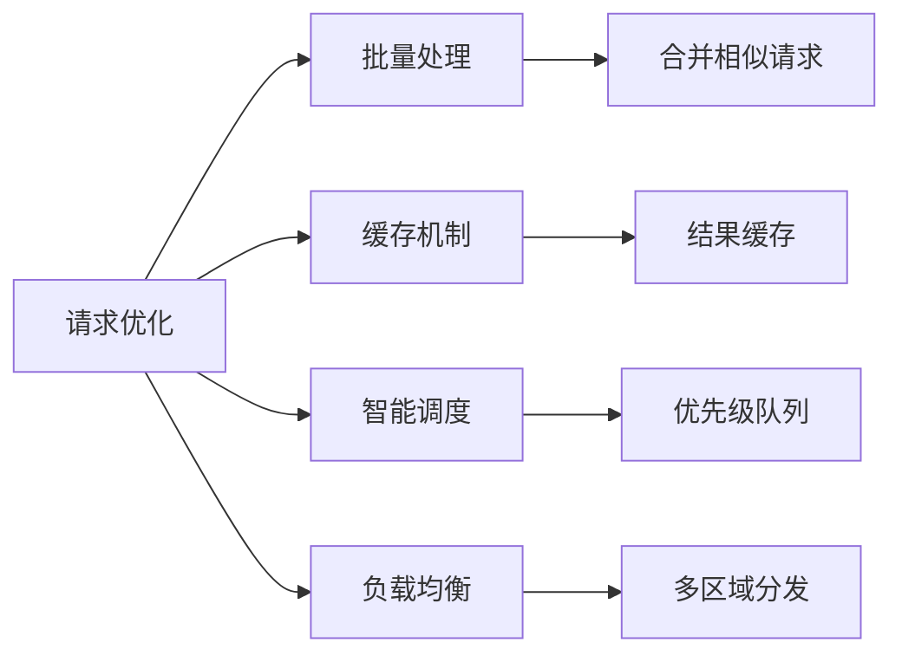
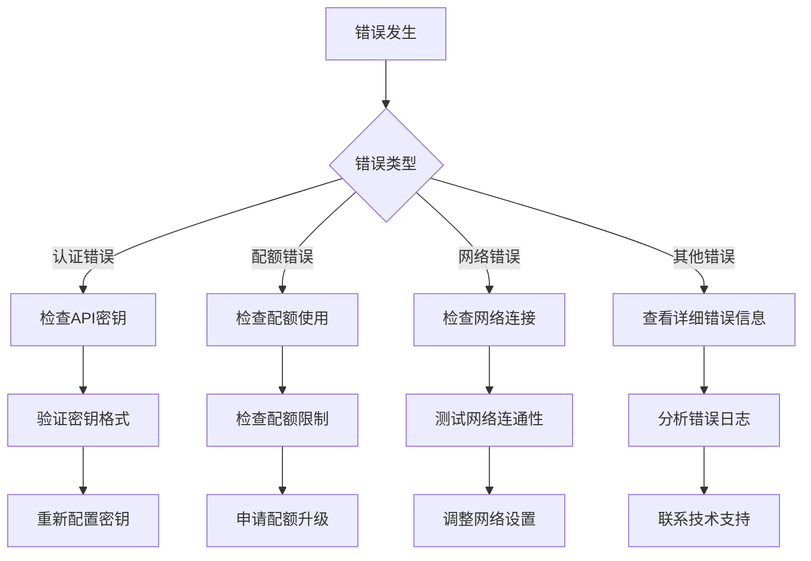

# 认证与配额管理

<cite>
**本文档引用的文件**
- [src/models/gemini_model.py](file://src/models/gemini_model.py)
- [src/models/model_factory.py](file://src/models/model_factory.py)
- [src/models/base_model.py](file://src/models/base_model.py)
- [src/config.py](file://src/config.py)
- [src/agents/focus_agent.py](file://src/agents/focus_agent.py)
- [src/agents/rbi_agent.py](file://src/agents/rbi_agent.py)
- [src/agents/whale_agent.py](file://src/agents/whale_agent.py)
- [src/agents/tweet_agent.py](file://src/agents/tweet_agent.py)
- [src/scripts/oaiagents.py](file://src/scripts/oaiagents.py)
</cite>

## 目录
1. [简介](#简介)
2. [Gemini模型认证机制](#gemini模型认证机制)
3. [服务账户密钥配置](#服务账户密钥配置)
4. [环境变量管理](#环境变量管理)
5. [API配额限制与监控](#api配额限制与监控)
6. [区域选择对性能的影响](#区域选择对性能的影响)
7. [配额优化策略](#配额优化策略)
8. [成本控制策略](#成本控制策略)
9. [故障排除指南](#故障排除指南)
10. [配置文件设置示例](#配置文件设置示例)

## 简介

Moon Dev AI Agents系统支持多种AI模型，其中Google Gemini模型是重要的组成部分。本指南详细说明了Gemini模型的认证机制、配额管理以及最佳实践，帮助开发者有效管理和优化AI资源使用。

## Gemini模型认证机制

### 基础认证架构

Gemini模型采用基于API密钥的认证机制，通过Google Cloud Platform进行身份验证和授权。



**图表来源**
- [src/models/model_factory.py](file://src/models/model_factory.py#L51-L81)
- [src/models/gemini_model.py](file://src/models/gemini_model.py#L25-L35)

### 认证流程详解

Gemini模型的认证过程包含以下关键步骤：

1. **API密钥验证**：检查环境变量中的GEMINI_KEY
2. **客户端初始化**：使用genai.configure()配置API密钥
3. **模型实例化**：创建GenerativeModel对象
4. **可用性检查**：验证模型是否正常工作

**章节来源**
- [src/models/gemini_model.py](file://src/models/gemini_model.py#L25-L35)

## 服务账户密钥配置

### Google Cloud API密钥获取

要使用Gemini模型，需要从Google Cloud Console获取有效的API密钥：

1. **访问Google Cloud Console**：登录到Google Cloud平台
2. **启用Gemini API**：确保Gemini API已启用
3. **创建API密钥**：在凭据页面创建新的API密钥
4. **设置配额限制**：根据需求配置每日配额

### 密钥格式要求

Gemini API密钥必须满足以下格式要求：
- 长度通常为39个字符
- 格式为`AIzaSy...`或`GAI...`
- 必须具有有效的项目关联

**章节来源**
- [src/models/model_factory.py](file://src/models/model_factory.py#L65-L75)

## 环境变量管理

### 标准环境变量配置

系统使用统一的环境变量命名规范来管理各种API密钥：



**图表来源**
- [src/models/model_factory.py](file://src/models/model_factory.py#L200-L210)

### 环境变量加载机制

系统通过ModelFactory自动加载和验证环境变量：

```python
# 环境变量加载示例（概念性）
project_root = Path(__file__).parent.parent.parent
env_path = project_root / '.env'
load_dotenv(dotenv_path=env_path)
```

### 验证检查清单

每次启动时，系统会执行以下验证检查：

| 环境变量 | 必需性 | 验证内容 |
|---------|--------|----------|
| `GEMINI_KEY` | 可选 | API密钥格式和有效性 |
| `GOOGLE_APPLICATION_CREDENTIALS` | 可选 | 服务账户JSON文件路径 |
| `ANTHROPIC_KEY` | 可选 | Claude API密钥 |
| `OPENAI_KEY` | 可选 | OpenAI API密钥 |

**章节来源**
- [src/models/model_factory.py](file://src/models/model_factory.py#L65-L85)

## API配额限制与监控

### Gemini配额类型

Gemini模型支持多种配额类型，每种都有特定的限制：

| 配额类型 | 描述 | 典型限制 |
|---------|------|----------|
| 每日请求次数 | 每天可发送的最大请求数 | 1,000-10,000次 |
| 每分钟请求频率 | 每分钟最大请求数 | 60-300次 |
| 输出令牌数 | 每天可生成的最大输出令牌 | 100,000-1,000,000个 |
| 输入令牌数 | 每天可处理的最大输入令牌 | 1,000,000-10,000,000个 |

### 错误处理机制

系统实现了完善的错误处理机制来应对配额超限：



**图表来源**
- [src/models/gemini_model.py](file://src/models/gemini_model.py#L75-L110)

### 监控策略

系统提供多层次的监控策略：

1. **实时监控**：跟踪每个请求的状态
2. **配额追踪**：监控每日配额使用情况
3. **性能指标**：记录响应时间和成功率
4. **错误分类**：按类型统计错误发生率

**章节来源**
- [src/models/gemini_model.py](file://src/models/gemini_model.py#L75-L110)

## 区域选择对性能的影响

### 地理位置优化

虽然Gemini API本身是全球性的，但地理位置选择仍会影响性能：

| 区域 | 延迟范围 | 推荐场景 |
|------|----------|----------|
| 美国东部 | 20-50ms | 生产环境首选 |
| 欧洲西部 | 30-80ms | 欧洲用户优化 |
| 亚洲东部 | 50-120ms | 亚太地区用户 |
| 南美洲 | 80-150ms | 特殊需求 |

### 性能影响因素

不同区域的选择会影响以下方面：

1. **网络延迟**：直接影响响应时间
2. **带宽限制**：大文件传输的效率
3. **合规要求**：数据本地化法规
4. **成本差异**：不同地区的定价

## 配额优化策略

### 请求优化技术

为了最大化配额使用效率，系统采用多种优化策略：



### 批量处理策略

对于大量相似请求，采用批量处理减少API调用次数：

- **请求合并**：将多个小请求合并为单个大请求
- **异步处理**：使用异步模式提高并发能力
- **队列管理**：实现智能请求队列

### 缓存优化

实施多层缓存策略减少重复请求：

1. **内存缓存**：短期高频访问数据
2. **磁盘缓存**：长期稳定数据
3. **分布式缓存**：跨服务共享缓存

**章节来源**
- [src/models/base_model.py](file://src/models/base_model.py#L30-L45)

## 成本控制策略

### 成本分析框架

系统提供全面的成本分析工具：

| 成本要素 | 影响因素 | 优化建议 |
|---------|----------|----------|
| 输入令牌 | 文本长度、复杂度 | 优化提示词设计 |
| 输出令牌 | 回复长度、详细程度 | 设置合理max_tokens |
| 并发请求 | 同时处理数量 | 实现请求限流 |
| API调用频率 | 调用间隔和频率 | 采用智能调度 |

### 成本监控仪表板

提供实时成本监控功能：

- **每日成本追踪**：实时显示当前消耗
- **趋势分析**：历史成本变化趋势
- **异常检测**：超出预期的成本波动
- **预算告警**：达到预算阈值时通知

### 成本优化建议

1. **模型选择**：根据任务复杂度选择合适模型
2. **参数调优**：合理设置温度和最大令牌数
3. **使用模式**：避免不必要的频繁调用
4. **批量处理**：合并相似操作减少调用次数

## 故障排除指南

### 常见认证问题

#### 1. API密钥无效

**症状**：`Failed to initialize Gemini model: Invalid API key`

**解决方案**：
- 验证GEMINI_KEY环境变量设置
- 检查API密钥格式是否正确
- 确认Google Cloud项目已启用Gemini API

#### 2. 配额超限

**症状**：`Rate limit exceeded` 或 `Quota exceeded`

**解决方案**：
- 检查当前配额使用情况
- 实施指数退避重试机制
- 考虑升级配额限制

#### 3. 网络连接问题

**症状**：`Connection timeout` 或 `Network unreachable`

**解决方案**：
- 检查网络连接状态
- 验证防火墙设置
- 确认代理配置正确

### 错误诊断流程



### 调试技巧

1. **启用详细日志**：设置DEBUG级别日志记录
2. **环境变量验证**：确认所有必需变量已设置
3. **API测试**：使用简单的测试请求验证连接
4. **错误码分析**：根据错误码查找具体原因

**章节来源**
- [src/models/gemini_model.py](file://src/models/gemini_model.py#L100-L116)

## 配置文件设置示例

### 基础配置模板

以下是Gemini模型的完整配置示例：

```bash
# .env 文件配置示例

# Gemini模型配置
GEMINI_KEY=your_google_gemini_api_key_here
GEMINI_MODEL=gemini-2.5-flash

# 模型参数配置
GEMINI_TEMPERATURE=0.7
GEMINI_MAX_TOKENS=2048
GEMINI_TOP_K=40
GEMINI_TOP_P=0.95

# 安全设置
GEMINI_SAFETY_BLOCK_HIGH=true
GEMINI_SAFETY_THRESHOLD=MEDIUM

# 性能优化
GEMINI_REQUEST_TIMEOUT=30
GEMINI_MAX_RETRIES=3
GEMINI_RETRY_DELAY=1
```

### 多环境配置

针对不同环境的配置管理：

```yaml
# 开发环境配置
development:
  gemini:
    api_key: ${GEMINI_DEV_KEY}
    model: gemini-2.5-flash
    max_tokens: 1024
    temperature: 0.7

# 生产环境配置
production:
  gemini:
    api_key: ${GEMINI_PROD_KEY}
    model: gemini-2.5-pro
    max_tokens: 2048
    temperature: 0.5
    safety_settings:
      block_harassment: HIGH
      block_hate_speech: HIGH
      block_sexually_explicit: HIGH
      block_dangerous_content: HIGH
```

### 最佳实践配置

推荐的生产环境配置：

```python
# 推荐的Gemini配置参数
GEMINI_CONFIG = {
    # 基础配置
    "model": "gemini-2.5-flash",
    "temperature": 0.7,
    "max_tokens": 2048,
    
    # 安全设置
    "safety_settings": {
        "harassment": "BLOCK_ONLY_HIGH",
        "hate_speech": "BLOCK_ONLY_HIGH", 
        "sexual_explicit": "BLOCK_ONLY_HIGH",
        "dangerous_content": "BLOCK_ONLY_HIGH"
    },
    
    # 性能配置
    "request_timeout": 30,
    "max_retries": 3,
    "retry_delay": 1,
    
    # 监控配置
    "enable_metrics": True,
    "metrics_interval": 60
}
```

**章节来源**
- [src/config.py](file://src/config.py#L75-L85)
- [src/models/gemini_model.py](file://src/models/gemini_model.py#L13-L17)

### 配置验证脚本

提供配置验证工具确保设置正确：

```python
def validate_gemini_config():
    """验证Gemini配置的有效性"""
    required_vars = ["GEMINI_KEY"]
    optional_vars = ["GEMINI_MODEL", "GEMINI_TEMPERATURE"]
    
    missing_vars = [var for var in required_vars if not os.getenv(var)]
    if missing_vars:
        raise ValueError(f"缺少必需的环境变量: {missing_vars}")
    
    # 验证API密钥格式
    api_key = os.getenv("GEMINI_KEY")
    if not api_key.startswith(("AIzaSy", "GAI")):
        raise ValueError("API密钥格式不正确")
    
    # 测试API连接
    try:
        from google.generativeai import configure
        configure(api_key=api_key)
        # 尝试初始化模型
        print("Gemini配置验证成功")
    except Exception as e:
        raise ValueError(f"Gemini API连接失败: {e}")
```

通过遵循这些配置指南和最佳实践，开发者可以有效地管理Gemini模型的认证和配额，确保系统的稳定运行和成本控制。