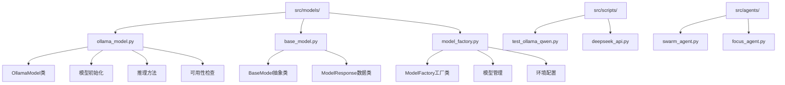
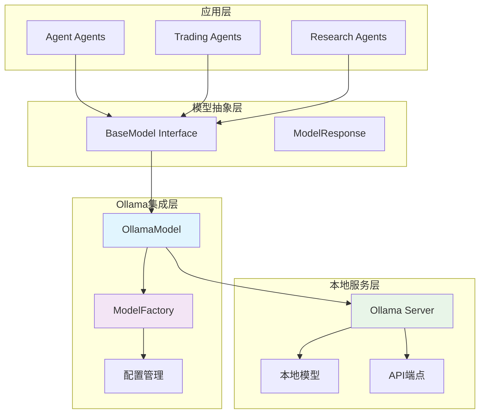
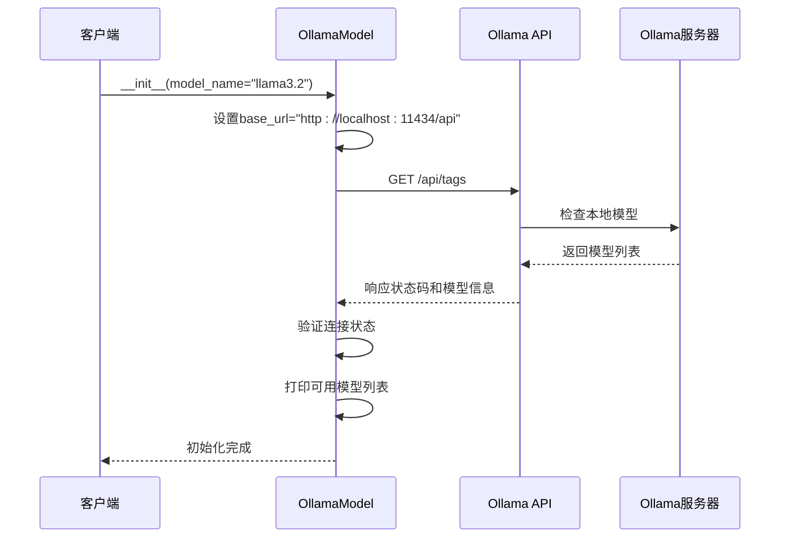
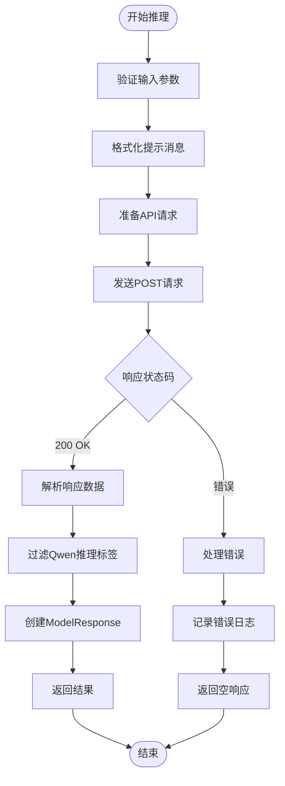
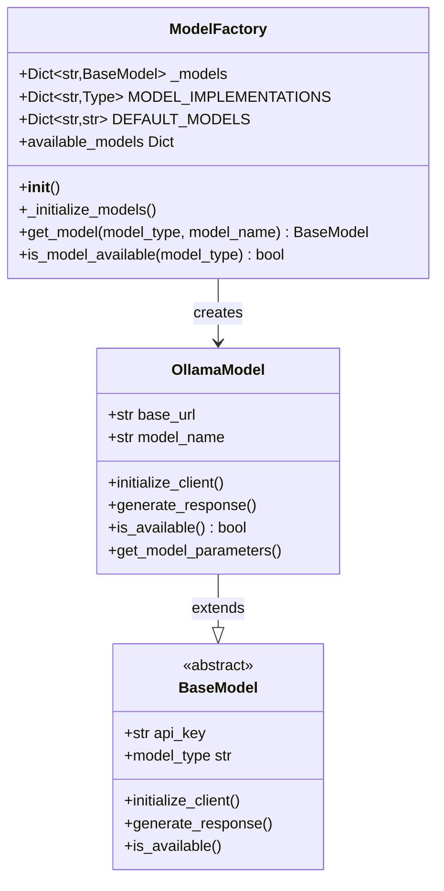
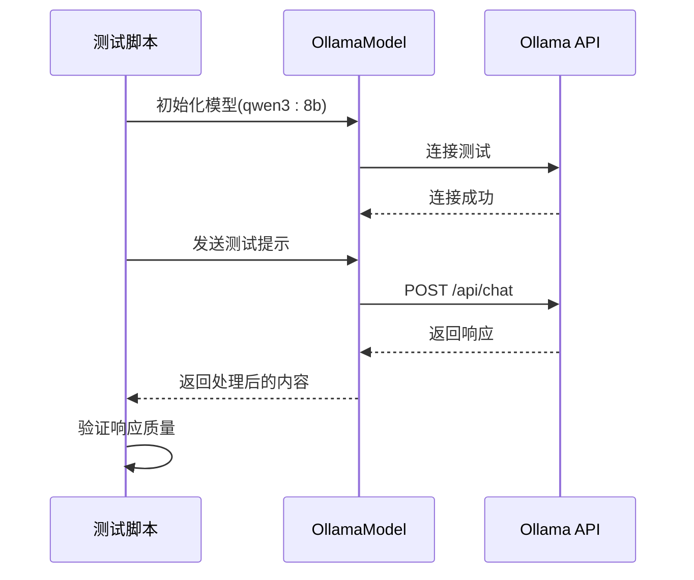
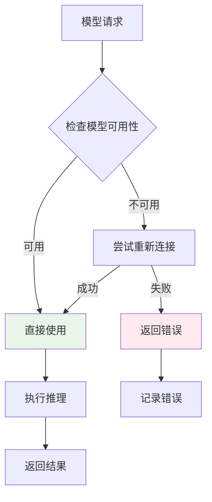
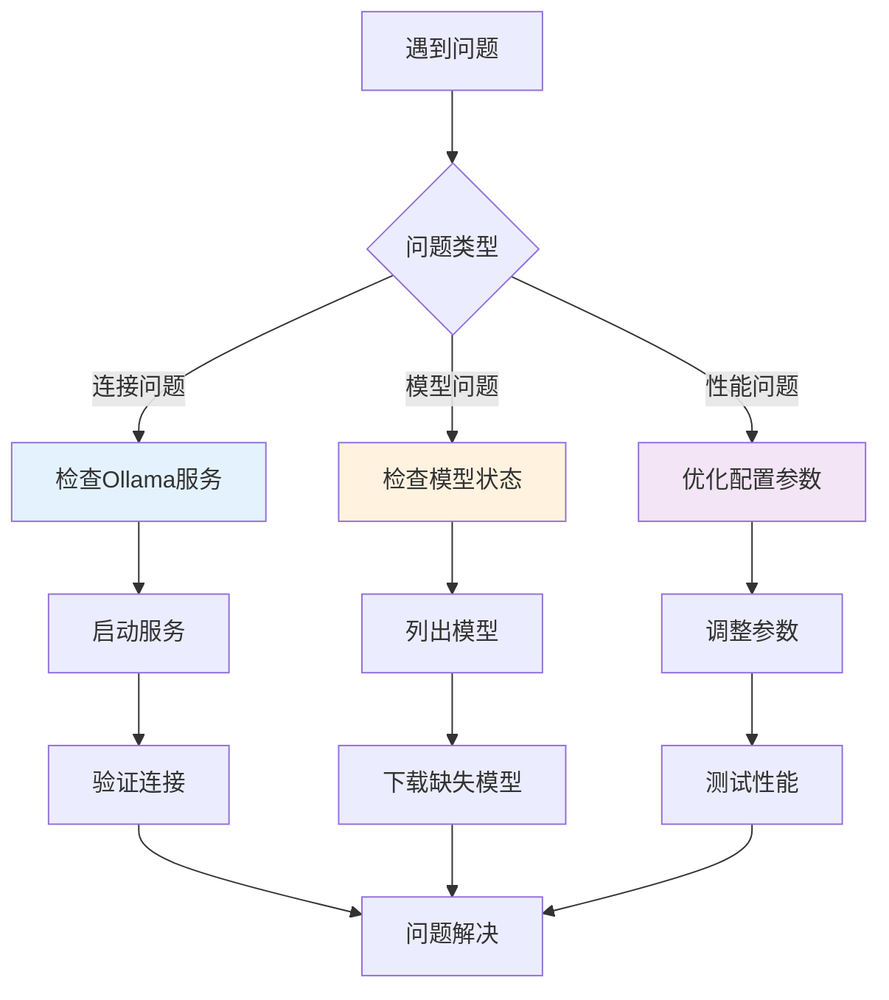

# Ollama本地模型集成

<cite>
**本文档中引用的文件**
- [ollama_model.py](file://src/models/ollama_model.py)
- [base_model.py](file://src/models/base_model.py)
- [model_factory.py](file://src/models/model_factory.py)
- [test_ollama_qwen.py](file://src/scripts/test_ollama_qwen.py)
- [deepseek_api.py](file://src/scripts/deepseek_api.py)
- [swarm_agent.py](file://src/agents/swarm_agent.py)
- [focus_agent.py](file://src/agents/focus_agent.py)
- [requirements.txt](file://requirements.txt)
</cite>

## 目录
1. [简介](#简介)
2. [项目结构](#项目结构)
3. [核心组件](#核心组件)
4. [架构概览](#架构概览)
5. [详细组件分析](#详细组件分析)
6. [配置参数详解](#配置参数详解)
7. [本地模型使用示例](#本地模型使用示例)
8. [资源管理策略](#资源管理策略)
9. [故障排除指南](#故障排除指南)
10. [性能考虑](#性能考虑)
11. [结论](#结论)

## 简介

Moon Dev的Ollama本地模型集成为用户提供了强大的本地AI推理能力。通过与本地运行的Ollama服务集成，该系统实现了完全私有的AI处理，无需依赖外部API费用，并提供了对模型的完全控制权。

Ollama是一个开源的本地AI模型服务，支持多种大型语言模型的本地部署和推理。Moon Dev的实现将其无缝集成到整个AI代理生态系统中，为用户提供了一个统一的接口来访问本地和云端模型。

## 项目结构

Ollama模型集成在项目中的组织结构如下：



**图表来源**
- [ollama_model.py](file://src/models/ollama_model.py#L1-L186)
- [base_model.py](file://src/models/base_model.py#L1-L73)
- [model_factory.py](file://src/models/model_factory.py#L1-L261)

**章节来源**
- [ollama_model.py](file://src/models/ollama_model.py#L1-L186)
- [model_factory.py](file://src/models/model_factory.py#L1-L261)

## 核心组件

### OllamaModel类

OllamaModel是本地Ollama模型集成的核心类，继承自BaseModel基类，提供了完整的本地模型交互功能。

主要特性：
- **模型发现**：自动检测本地安装的Ollama模型
- **推理能力**：支持聊天格式的文本生成
- **错误处理**：完善的异常捕获和用户友好的错误提示
- **参数管理**：支持温度等推理参数的动态调整

### Base Model接口

定义了所有AI模型的标准接口，确保不同模型提供商的一致性体验。

### Model Factory

负责模型实例的创建、管理和生命周期维护，提供了统一的模型访问入口。

**章节来源**
- [ollama_model.py](file://src/models/ollama_model.py#L13-L186)
- [base_model.py](file://src/models/base_model.py#L18-L73)
- [model_factory.py](file://src/models/model_factory.py#L20-L261)

## 架构概览

Ollama本地模型集成采用分层架构设计，确保了系统的可扩展性和维护性：



**图表来源**
- [ollama_model.py](file://src/models/ollama_model.py#L13-L186)
- [model_factory.py](file://src/models/model_factory.py#L20-L261)
- [base_model.py](file://src/models/base_model.py#L18-L73)

## 详细组件分析

### OllamaModel类详细分析

#### 初始化过程

OllamaModel的初始化过程包含了完整的连接验证和模型发现机制：



**图表来源**
- [ollama_model.py](file://src/models/ollama_model.py#L25-L64)

#### 推理流程

模型推理过程采用了标准化的聊天格式，支持系统提示和用户输入的组合：



**图表来源**
- [ollama_model.py](file://src/models/ollama_model.py#L75-L156)

#### 错误处理机制

系统实现了多层次的错误处理策略：

1. **连接错误处理**：检测Ollama服务器是否运行
2. **模型不存在处理**：提示用户拉取缺失的模型
3. **API错误处理**：优雅地处理API响应错误
4. **超时处理**：设置合理的请求超时时间

**章节来源**
- [ollama_model.py](file://src/models/ollama_model.py#L25-L186)

### Model Factory工厂模式分析

Model Factory采用了工厂模式来管理不同类型的AI模型，特别针对Ollama模型进行了专门处理：



**图表来源**
- [model_factory.py](file://src/models/model_factory.py#L20-L261)
- [ollama_model.py](file://src/models/ollama_model.py#L13-L186)
- [base_model.py](file://src/models/base_model.py#L18-L73)

**章节来源**
- [model_factory.py](file://src/models/model_factory.py#L20-L261)

## 配置参数详解

### 基础配置参数

Ollama模型的配置主要通过以下参数进行控制：

| 参数名称 | 类型 | 默认值 | 描述 |
|---------|------|--------|------|
| `base_url` | str | `"http://localhost:11434/api"` | Ollama API的基础URL |
| `model_name` | str | `"llama3.2"` | 要使用的本地模型名称 |
| `temperature` | float | `0.7` | 控制输出随机性的温度参数 |
| `timeout` | int | `90` | API请求的超时时间（秒） |

### 可用模型配置

系统预定义了多个常用的本地模型：

| 模型名称 | 参数量 | 特点 | 适用场景 |
|---------|--------|------|----------|
| `deepseek-r1` | 7B | 复杂推理，显示思考过程 | 需要深度分析的任务 |
| `qwen3:8b` | 8B | 快速推理，适合简单任务 | 高频率调用场景 |
| `gemma:2b` | 2B | 轻量级，快速响应 | 资源受限环境 |
| `llama3.2` | 70B | 平衡性能，指令跟随能力强 | 大多数通用任务 |

### 环境配置

虽然Ollama不需要API密钥，但仍需要正确配置本地环境：

1. **Ollama服务器启动**：确保`ollama serve`正在运行
2. **模型下载**：使用`ollama pull`命令下载所需模型
3. **端口配置**：默认使用11434端口，可通过环境变量修改

**章节来源**
- [ollama_model.py](file://src/models/ollama_model.py#L15-L25)
- [model_factory.py](file://src/models/model_factory.py#L35-L45)

## 本地模型使用示例

### 基础使用示例

以下是使用Ollama模型的基本示例：

```python
# 初始化Ollama模型
from src.models.ollama_model import OllamaModel

# 创建模型实例
model = OllamaModel(model_name="llama3.2")

# 生成响应
response = model.generate_response(
    system_prompt="你是一个有用的AI助手。",
    user_content="请分析当前的市场趋势。",
    temperature=0.7
)

print(response.content)
```

### 测试脚本示例

项目提供了专门的测试脚本来验证Ollama Qwen3:8b模型的功能：



**图表来源**
- [test_ollama_qwen.py](file://src/scripts/test_ollama_qwen.py#L15-L84)

### 在代理中的集成

Ollama模型可以无缝集成到各种AI代理中：

```python
# 在RBIAgent中的使用示例
if model_config["type"] == "ollama":
    response = model.generate_response(
        system_prompt=system_prompt,
        user_content=user_content,
        temperature=AI_TEMPERATURE
    )
    return response.content if hasattr(response, 'content') else str(response)
```

**章节来源**
- [test_ollama_qwen.py](file://src/scripts/test_ollama_qwen.py#L15-L84)
- [rbi_agent_v3.py](file://src/agents/rbi_agent_v3.py#L615-L637)

## 资源管理策略

### GPU内存优化

虽然Ollama模型运行在CPU上，但系统仍提供了多种资源优化策略：

1. **模型选择策略**：
   - 小参数模型（2B）用于高频率调用
   - 中等参数模型（7B-8B）用于平衡性能
   - 大参数模型（70B+）用于复杂推理任务

2. **并发控制**：
   - 设置合理的请求超时时间（90秒）
   - 实现重试机制处理临时错误
   - 避免同时发起过多并发请求

3. **内存管理**：
   - 自动检测可用内存
   - 合理设置上下文长度
   - 及时释放不再使用的模型实例

### 模型卸载机制

虽然Ollama本身不提供显式的模型卸载功能，但系统通过以下方式实现资源的有效利用：



**图表来源**
- [ollama_model.py](file://src/models/ollama_model.py#L68-L75)

### 性能监控

系统提供了内置的性能监控功能：

- **连接状态监控**：定期检查Ollama服务器状态
- **响应时间跟踪**：记录每次推理的耗时
- **错误率统计**：监控API调用的成功率

**章节来源**
- [ollama_model.py](file://src/models/ollama_model.py#L68-L75)
- [model_factory.py](file://src/models/model_factory.py#L120-L146)

## 故障排除指南

### 常见网络连接问题

#### 问题1：无法连接到Ollama API

**症状**：出现"Could not connect to Ollama API"错误

**解决方案**：
1. 检查Ollama服务器是否运行：`ollama serve`
2. 验证端口11434是否被占用：`lsof -i :11434`
3. 检查防火墙设置，确保允许本地连接
4. 重启Ollama服务：`ollama serve`

#### 问题2：模型未找到

**症状**：出现"Model not found"警告

**解决方案**：
1. 列出已安装的模型：`ollama list`
2. 下载缺失的模型：`ollama pull <model_name>`
3. 验证模型名称拼写正确
4. 检查磁盘空间是否充足

### 模型兼容性问题

#### 问题3：推理结果异常

**症状**：模型返回意外或无意义的结果

**解决方案**：
1. 调整温度参数：降低温度减少随机性
2. 检查提示词质量：确保系统提示清晰明确
3. 更新模型版本：`ollama pull --upgrade <model_name>`
4. 查看模型文档了解特定要求

#### 问题4：性能问题

**症状**：推理速度过慢或响应超时

**解决方案**：
1. 使用更小的模型：如gemma:2b替代llama3.2
2. 减少上下文长度
3. 增加系统内存
4. 关闭不必要的后台程序

### 错误诊断流程



**图表来源**
- [ollama_model.py](file://src/models/ollama_model.py#L48-L64)

### 日志和调试

系统提供了详细的日志输出，帮助诊断问题：

- **成功连接**：绿色显示"Successfully connected to Ollama API"
- **模型可用性**：列出可用的模型列表
- **错误信息**：红色显示具体的错误原因
- **建议操作**：黄色提示下一步操作

**章节来源**
- [ollama_model.py](file://src/models/ollama_model.py#L48-L64)
- [model_factory.py](file://src/models/model_factory.py#L120-L146)

## 性能考虑

### 推理性能优化

Ollama本地模型的性能受多种因素影响：

1. **硬件配置**：
   - CPU核心数和主频
   - 内存容量和速度
   - 存储设备的读写速度

2. **模型选择**：
   - 参数量越小，推理速度越快
   - 复杂模型提供更好的质量但速度较慢
   - 根据具体需求选择合适的模型

3. **配置优化**：
   - 合理设置温度参数
   - 控制上下文长度
   - 实现适当的缓存机制

### 扩展性考虑

虽然Ollama模型运行在单机上，但系统设计考虑了未来的扩展需求：

- **多模型支持**：可以轻松添加新的本地模型
- **负载均衡**：通过ModelFactory实现模型选择
- **故障转移**：当本地模型不可用时可以切换到云端模型

### 成本效益分析

本地部署的优势：
- **零API费用**：无需支付外部服务费用
- **数据隐私**：所有数据完全本地处理
- **稳定性能**：不受外部服务波动影响
- **可控性**：完全掌握模型的使用情况

## 结论

Moon Dev的Ollama本地模型集成为AI代理系统提供了强大而灵活的本地推理能力。通过精心设计的架构和完善的错误处理机制，该系统不仅保证了稳定性，还提供了优秀的用户体验。

### 主要优势

1. **完全本地化**：确保数据隐私和安全
2. **成本效益**：避免持续的API费用
3. **灵活性**：支持多种本地模型的选择
4. **易用性**：提供简洁的API接口
5. **可靠性**：完善的错误处理和恢复机制

### 最佳实践建议

1. **模型选择**：根据具体需求选择合适的模型参数量
2. **资源配置**：确保充足的系统资源
3. **监控维护**：定期检查模型状态和性能
4. **备份策略**：重要模型的定期备份
5. **更新维护**：及时更新模型版本

通过合理配置和使用Ollama本地模型集成，开发者可以构建既高效又私密的AI应用，充分发挥本地AI推理的优势。