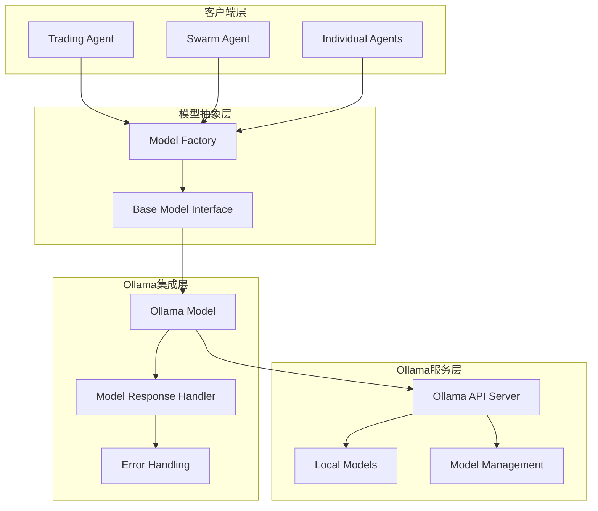
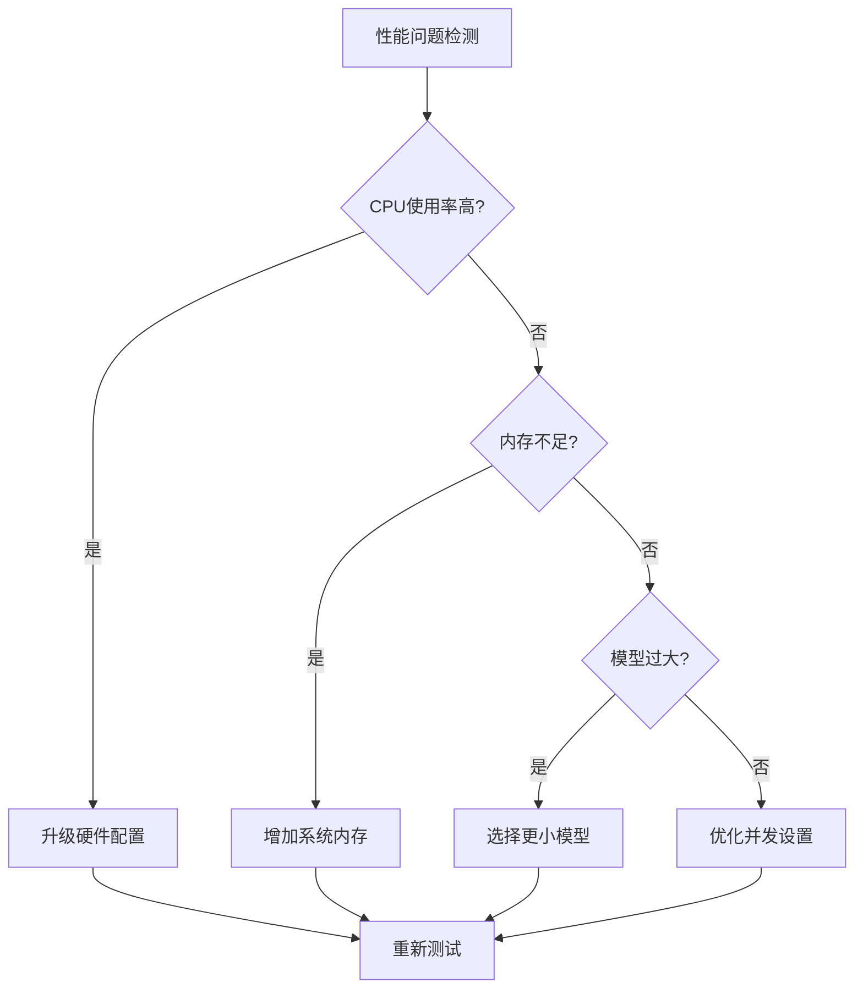
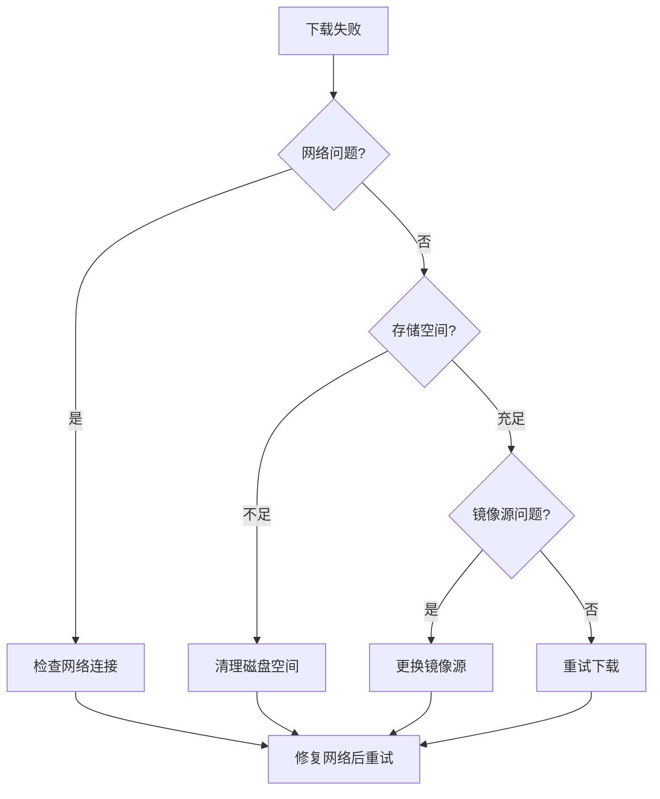
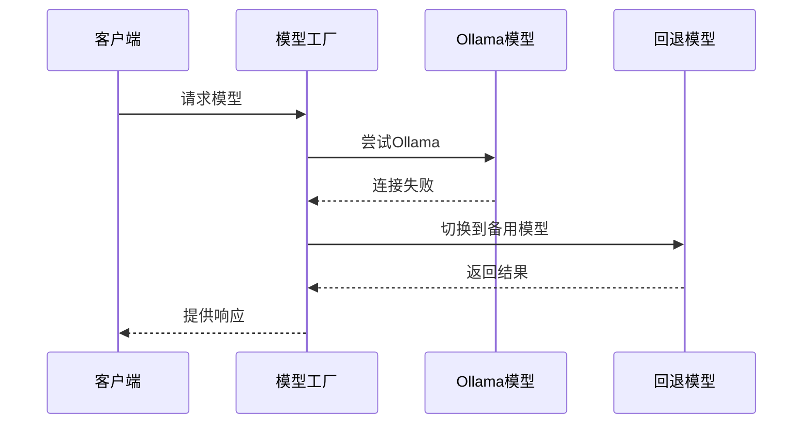

# 故障排除与常见问题

<cite>
**本文档引用的文件**
- [src/models/ollama_model.py](file://src/models/ollama_model.py)
- [src/models/base_model.py](file://src/models/base_model.py)
- [src/models/model_factory.py](file://src/models/model_factory.py)
- [src/config.py](file://src/config.py)
- [src/agents/swarm_agent.py](file://src/agents/swarm_agent.py)
- [src/scripts/test_ollama_qwen.py](file://src/scripts/test_ollama_qwen.py)
- [src/scripts/deepseek_api.py](file://src/scripts/deepseek_api.py)
- [requirements.txt](file://requirements.txt)
</cite>

## 目录
1. [简介](#简介)
2. [系统架构概览](#系统架构概览)
3. [常见网络连接问题](#常见网络连接问题)
4. [模型兼容性问题](#模型兼容性问题)
5. [性能瓶颈分析](#性能瓶颈分析)
6. [诊断步骤与工具](#诊断步骤与工具)
7. [典型问题解决方案](#典型问题解决方案)
8. [版本兼容性矩阵](#版本兼容性矩阵)
9. [回退策略](#回退策略)
10. [监控与日志分析](#监控与日志分析)
11. [最佳实践](#最佳实践)

## 简介

本指南提供了Moon Dev AI交易代理系统中Ollama本地模型集成的全面故障排除方法。该系统支持多种AI模型，其中Ollama作为本地推理引擎，为交易决策提供强大的语言模型能力。

Ollama集成的核心优势：
- **本地部署**：无需外部API调用，保护数据隐私
- **离线可用**：在网络不稳定环境下仍可运行
- **成本效益**：避免API费用支出
- **定制化**：支持自定义模型和参数配置

## 系统架构概览



**图表来源**
- [src/models/model_factory.py](file://src/models/model_factory.py#L1-L50)
- [src/models/ollama_model.py](file://src/models/ollama_model.py#L1-L30)

**章节来源**
- [src/models/model_factory.py](file://src/models/model_factory.py#L1-L261)
- [src/models/ollama_model.py](file://src/models/ollama_model.py#L1-L186)

## 常见网络连接问题

### 1. Ollama服务器未启动

**症状表现：**
- 连接被拒绝错误
- 请求超时异常
- 模型初始化失败

**诊断命令：**
```bash
# 检查Ollama服务状态
ollama ps

# 启动Ollama服务
ollama serve

# 查看服务日志
ollama logs
```

**解决方案：**
1. **验证服务状态**：确保Ollama服务正在运行
2. **检查端口占用**：默认使用11434端口
3. **重启服务**：尝试停止并重新启动Ollama服务

### 2. 网络防火墙阻断

**症状表现：**
- 本地连接正常但远程访问失败
- 防火墙警告信息
- 网络权限错误

**解决方案：**
```bash
# 允许本地端口
sudo ufw allow 11434

# 或者临时禁用防火墙（仅用于测试）
sudo ufw disable
```

### 3. DNS解析问题

**症状表现：**
- 主机名无法解析
- 域名访问超时
- 网络配置错误

**诊断方法：**
```bash
# 测试DNS解析
nslookup localhost
ping localhost

# 检查网络配置
ipconfig getpacket en0
```

**章节来源**
- [src/models/ollama_model.py](file://src/models/ollama_model.py#L42-L64)

## 模型兼容性问题

### 1. 模型不存在或未安装

**症状表现：**
- 模型名称不匹配错误
- 下载失败提示
- 可用模型列表为空

**诊断步骤：**
```python
# 检查可用模型
response = requests.get("http://localhost:11434/api/tags")
models = response.json().get("models", [])
print("可用模型:", [m["name"] for m in models])
```

**解决方案：**
```bash
# 安装所需模型
ollama pull llama3.2
ollama pull qwen3:8b
ollama pull deepseek-r1
ollama pull gemma:2b
```

### 2. 模型版本不兼容

**症状表现：**
- 推理结果异常
- 参数设置无效
- 性能下降明显

**版本检查：**
```bash
# 查看模型详情
ollama show llama3.2

# 更新到最新版本
ollama pull --upgrade llama3.2
```

### 3. 内存不足问题

**症状表现：**
- 推理过程中断
- 内存溢出错误
- 系统响应缓慢

**监控命令：**
```bash
# 监控内存使用
free -h
top -o %MEM

# 检查Ollama进程
ps aux | grep ollama
```

**章节来源**
- [src/models/ollama_model.py](file://src/models/ollama_model.py#L15-L25)

## 性能瓶颈分析

### 1. 推理速度慢

**性能指标：**
- 单次推理时间超过90秒
- 并发请求响应延迟
- CPU使用率过高

**优化策略：**


**图表来源**
- [src/agents/swarm_agent.py](file://src/agents/swarm_agent.py#L80-L90)

### 2. 内存泄漏

**监控指标：**
- 内存使用持续增长
- 系统可用内存减少
- 推理性能逐渐下降

**检测方法：**
```python
# 内存监控脚本
import psutil
import time

def monitor_memory():
    while True:
        memory = psutil.virtual_memory()
        print(f"内存使用率: {memory.percent}%")
        time.sleep(60)
```

### 3. 并发限制

**默认限制：**
- 单个模型最大并发数：无明确限制
- 超时时间：90秒
- 最大令牌数：2048

**调整建议：**
```python
# 在config.py中调整
MODEL_TIMEOUT = 120  # 增加超时时间
DEFAULT_MAX_TOKENS = 4096  # 增加令牌限制
```

**章节来源**
- [src/agents/swarm_agent.py](file://src/agents/swarm_agent.py#L80-L90)

## 诊断步骤与工具

### 1. 健康检查工具

**内置健康检查：**
```python
# 使用深度学习API进行健康检查
@app.get("/health")
async def health_check():
    try:
        response = requests.get(f"{OLLAMA_BASE_URL}/api/tags")
        if response.status_code == 200:
            return {"status": "healthy", "message": "✨ Ollama is healthy and responding!"}
        return {"status": "unhealthy", "message": "❌ Ollama is not responding correctly"}
    except Exception as e:
        return {"status": "error", "message": f"❌ Error connecting to Ollama: {str(e)}"}
```

### 2. 详细诊断脚本

**测试脚本功能：**
```python
# 测试Ollama Qwen3:8b模型
def test_ollama_qwen():
    """Test the Ollama Qwen3:8b model"""
    model = OllamaModel(model_name="qwen3:8b")
    response = model.generate_response(
        system_prompt="You are a helpful AI assistant.",
        user_content="Hello, how are you?",
        temperature=0.7
    )
    return response.content
```

### 3. 日志分析工具

**日志级别配置：**
```python
import logging
logging.basicConfig(level=logging.DEBUG)

# 启用详细日志
cprint("启用调试模式...", "yellow")
```

**章节来源**
- [src/scripts/deepseek_api.py](file://src/scripts/deepseek_api.py#L41-L53)
- [src/scripts/test_ollama_qwen.py](file://src/scripts/test_ollama_qwen.py#L1-L84)

## 典型问题解决方案

### 1. 模型下载失败

**问题类型：**
- 网络连接中断
- 存储空间不足
- 镜像源不可用

**解决流程：**



**图表来源**
- [src/models/ollama_model.py](file://src/models/ollama_model.py#L42-L64)

**具体解决方案：**
```bash
# 清理缓存
ollama rm --all

# 手动下载特定模型
curl -L https://ollama.ai/library/llama3.2 -o llama3.2.tar

# 检查磁盘空间
df -h
```

### 2. 推理超时

**症状：**
- 请求在90秒内无响应
- Swarm Agent超时错误
- 交易决策延迟

**解决方案：**
```python
# 增加超时时间
response = requests.post(
    f"{self.base_url}/chat",
    json=data,
    timeout=120  # 从90秒增加到120秒
)
```

**并发控制：**
```python
# 限制并发请求数
MAX_CONCURRENT_REQUESTS = 5
semaphore = asyncio.Semaphore(MAX_CONCURRENT_REQUESTS)
```

### 3. 内存溢出

**症状：**
- 系统内存使用率超过90%
- 应用程序崩溃
- 交换空间耗尽

**预防措施：**
```python
# 监控内存使用
def check_memory_threshold():
    memory = psutil.virtual_memory()
    if memory.percent > 85:
        # 触发清理机制
        cleanup_cache()
        return False
    return True
```

**章节来源**
- [src/models/ollama_model.py](file://src/models/ollama_model.py#L126-L156)

## 版本兼容性矩阵

### 当前支持的模型版本

| 模型名称 | 推荐版本 | 参数量 | 内存需求 | 性能等级 |
|---------|---------|--------|----------|----------|
| llama3.2 | latest | 70B | 14GB+ | 高 |
| qwen3:8b | latest | 8B | 16GB+ | 中 |
| deepseek-r1 | latest | 7B | 14GB+ | 中 |
| gemma:2b | latest | 2B | 8GB+ | 低 |

### 系统要求

| 组件 | 最低要求 | 推荐配置 | 备注 |
|------|---------|---------|------|
| CPU | 4核心 | 8核心+ | 支持AVX2指令集 |
| 内存 | 16GB | 32GB+ | 包含交换空间 |
| 存储 | 50GB | 100GB+ | SSD推荐 |
| 网络 | 10Mbps | 100Mbps+ | 稳定连接 |

### Python依赖版本

| 包名 | 当前版本 | 最低版本 | 兼容性说明 |
|------|---------|---------|-----------|
| requests | 2.31.0 | 2.25.0 | 网络请求库 |
| termcolor | 2.3.0 | 1.1.0 | 输出美化 |
| numpy | 1.26.2 | 1.20.0 | 数值计算 |

**章节来源**
- [requirements.txt](file://requirements.txt#L1-L50)

## 回退策略

### 1. 多模型回退机制



**图表来源**
- [src/models/model_factory.py](file://src/models/model_factory.py#L120-L146)

### 2. 自动切换逻辑

**配置示例：**
```python
# 在SWARM_MODELS中配置回退
SWARM_MODELS = {
    "ollama_qwen": (True, "ollama", "qwen3:8b"),  # 主要模型
    "ollama_llama": (True, "ollama", "llama3.2"), # 回退模型
    "openai": (True, "openai", "gpt-4"),          # 云端回退
}
```

### 3. 故障转移策略

**实现方式：**
```python
class FailoverModel:
    def __init__(self, primary, secondary):
        self.primary = primary
        self.secondary = secondary
        self.fallback_used = False
    
    def generate_response(self, *args, **kwargs):
        try:
            return self.primary.generate_response(*args, **kwargs)
        except (ConnectionError, TimeoutError):
            self.fallback_used = True
            return self.secondary.generate_response(*args, **kwargs)
```

**章节来源**
- [src/agents/swarm_agent.py](file://src/agents/swarm_agent.py#L270-L289)

## 监控与日志分析

### 1. 实时监控指标

**关键指标：**
- 模型响应时间
- 错误率统计
- 资源使用率
- 并发请求数

**监控实现：**
```python
class OllamaMonitor:
    def __init__(self):
        self.metrics = {
            'response_times': [],
            'error_rates': [],
            'memory_usage': [],
            'cpu_usage': []
        }
    
    def record_response(self, latency, success):
        self.metrics['response_times'].append(latency)
        if not success:
            self.metrics['error_rates'].append(1)
        else:
            self.metrics['error_rates'].append(0)
```

### 2. 日志分析工具

**日志格式：**
```json
{
    "timestamp": "2024-01-15T10:30:00Z",
    "level": "ERROR",
    "service": "ollama_model",
    "message": "Connection refused",
    "details": {
        "host": "localhost",
        "port": 11434,
        "attempt": 3
    }
}
```

**分析脚本：**
```python
import json
import re

def analyze_logs(log_file):
    errors = []
    timeouts = []
    
    with open(log_file) as f:
        for line in f:
            if "ERROR" in line:
                errors.append(line)
            elif "timeout" in line.lower():
                timeouts.append(line)
    
    return {
        "total_errors": len(errors),
        "timeout_count": len(timeouts),
        "error_rate": len(errors) / (len(errors) + len(timeouts))
    }
```

### 3. 性能基准测试

**测试框架：**
```python
class PerformanceBenchmark:
    def __init__(self):
        self.results = []
    
    def benchmark_model(self, model, test_cases):
        for case in test_cases:
            start_time = time.time()
            try:
                response = model.generate_response(**case)
                latency = time.time() - start_time
                self.results.append({
                    'case': case,
                    'latency': latency,
                    'success': True
                })
            except Exception as e:
                self.results.append({
                    'case': case,
                    'latency': time.time() - start_time,
                    'success': False,
                    'error': str(e)
                })
```

**章节来源**
- [src/models/ollama_model.py](file://src/models/ollama_model.py#L126-L156)

## 最佳实践

### 1. 部署配置

**生产环境配置：**
```yaml
# docker-compose.yml 示例
version: '3.8'
services:
  ollama:
    image: ollama/ollama:latest
    ports:
      - "11434:11434"
    volumes:
      - ollama_data:/root/.ollama
    environment:
      - OLLAMA_HOST=0.0.0.0
    restart: unless-stopped
    
volumes:
  ollama_data:
```

### 2. 安全配置

**网络安全：**
```bash
# 限制访问范围
ollama serve --host 127.0.0.1

# 设置认证（如果需要）
export OLLAMA_API_KEY="your-secret-key"
```

### 3. 性能优化

**系统级优化：**
```bash
# 优化I/O调度器
echo deadline > /sys/block/sda/queue/scheduler

# 调整虚拟内存
echo vm.swappiness=10 >> /etc/sysctl.conf
echo vm.vfs_cache_pressure=50 >> /etc/sysctl.conf
```

**应用级优化：**
```python
# 连接池配置
import requests
from requests.adapters import HTTPAdapter
from urllib3.util.retry import Retry

session = requests.Session()
retry_strategy = Retry(
    total=3,
    backoff_factor=1,
    status_forcelist=[429, 500, 502, 503, 504],
)
adapter = HTTPAdapter(max_retries=retry_strategy)
session.mount("http://", adapter)
session.mount("https://", adapter)
```

### 4. 维护计划

**定期维护任务：**
- 每周检查模型更新
- 每月清理缓存数据
- 每季度评估性能指标
- 每年升级硬件配置

**自动化脚本：**
```bash
#!/bin/bash
# ollama_maintenance.sh

echo "开始Ollama维护..."

# 检查磁盘空间
DISK_USAGE=$(df -h /root/.ollama | awk 'NR==2 {print $5}' | sed 's/%//')
if [ $DISK_USAGE -gt 80 ]; then
    echo "警告：磁盘使用率超过80%"
    # 清理旧模型
    ollama rm --older-than 7d
fi

# 检查内存使用
MEMORY_USAGE=$(free | awk 'NR==2{printf "%.2f", $3*100/$2}')
if (( $(echo "$MEMORY_USAGE > 85" | bc -l) )); then
    echo "警告：内存使用率超过85%"
    # 重启服务
    systemctl restart ollama
fi

echo "维护完成"
```

通过遵循这些故障排除指南和最佳实践，您可以确保Ollama集成在Moon Dev AI交易代理系统中的稳定运行，最大化系统的可靠性和性能。