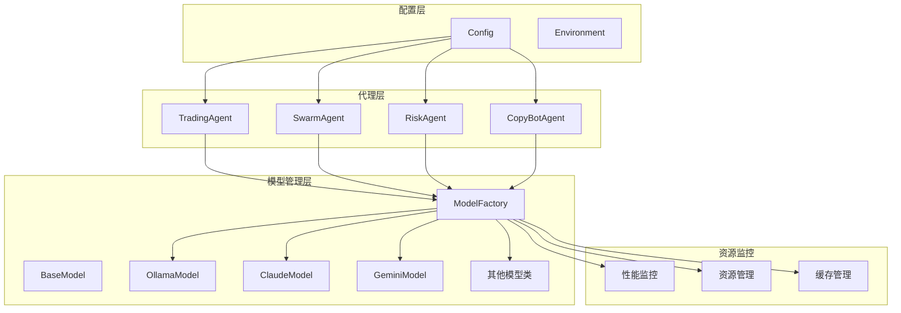
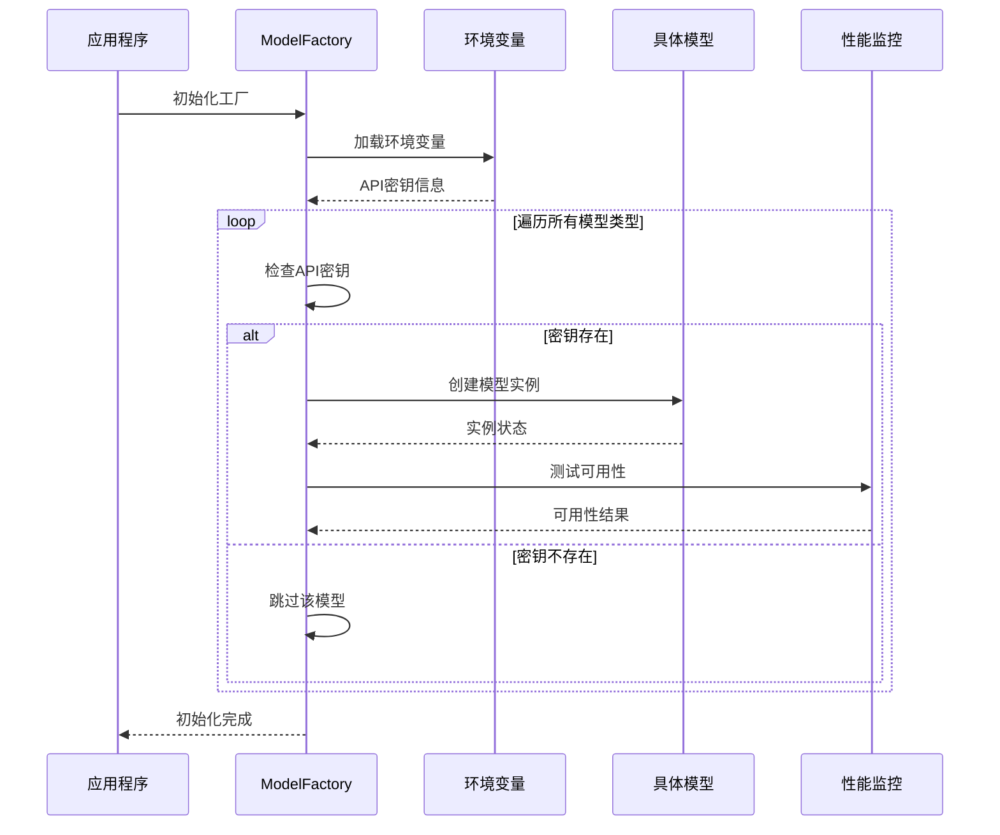
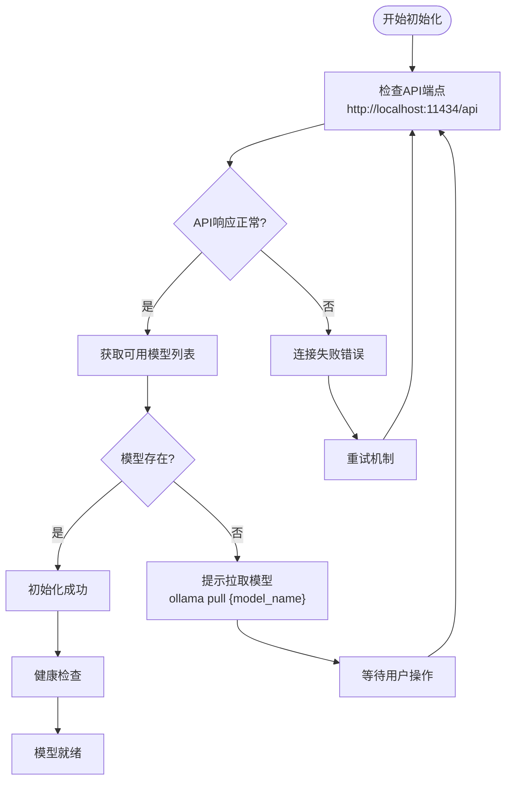
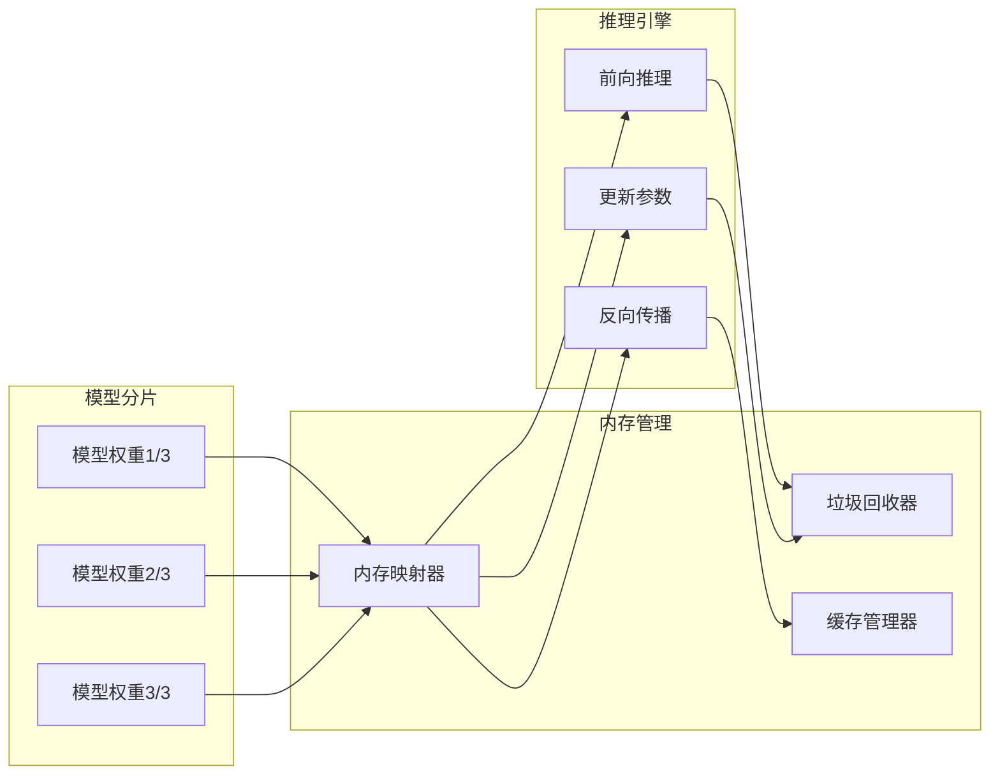
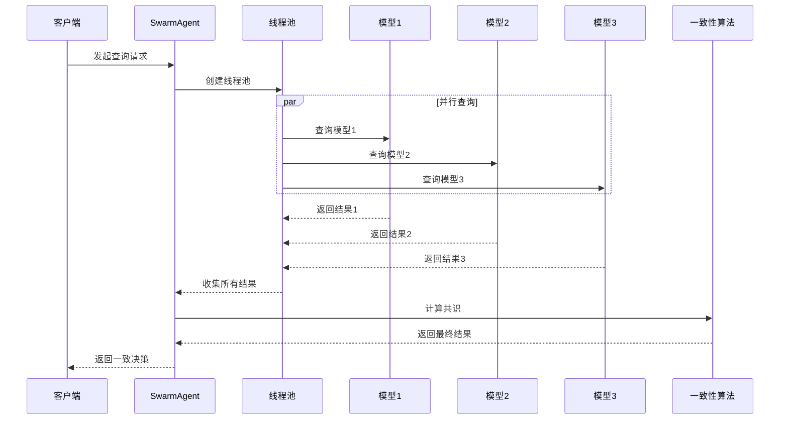
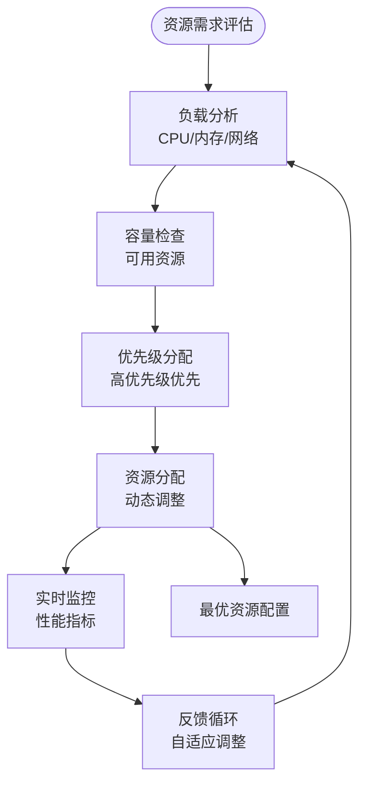
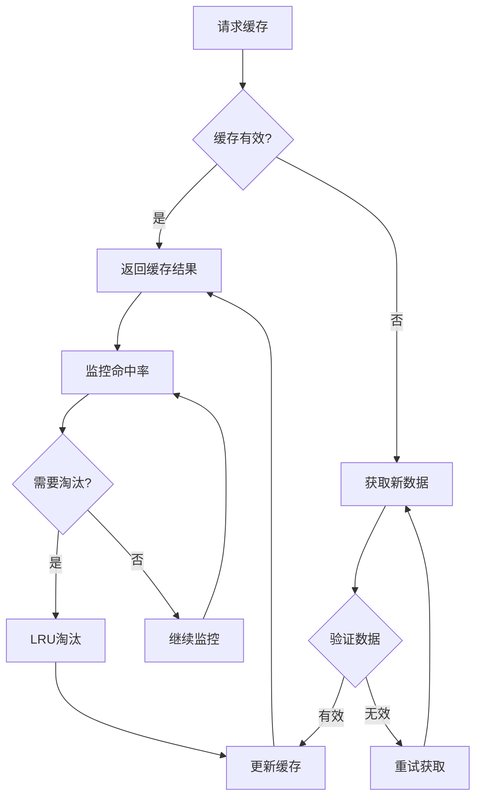
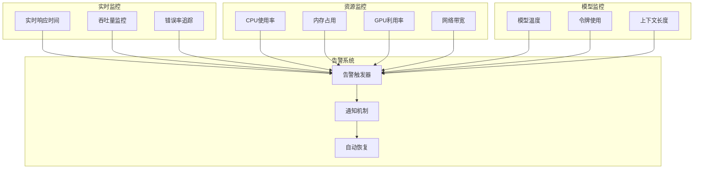
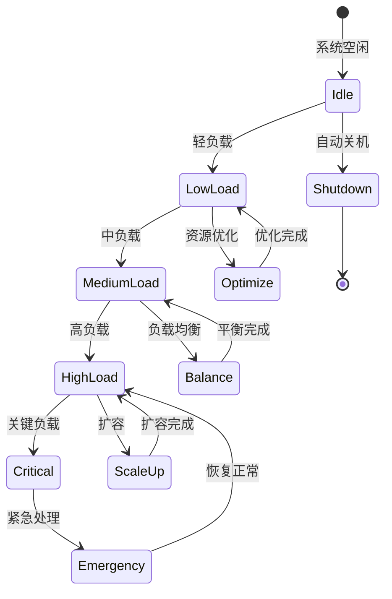
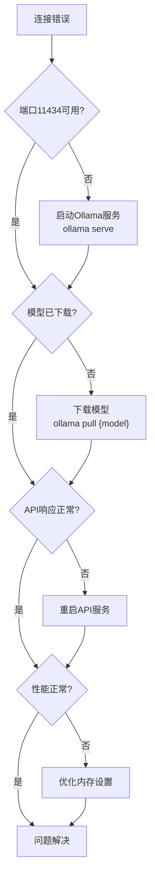

# 模型管理与资源优化

<cite>
**本文档引用的文件**
- [src/models/ollama_model.py](file://src/models/ollama_model.py)
- [src/models/base_model.py](file://src/models/base_model.py)
- [src/models/model_factory.py](file://src/models/model_factory.py)
- [src/config.py](file://src/config.py)
- [src/main.py](file://src/main.py)
- [src/agents/trading_agent.py](file://src/agents/trading_agent.py)
- [src/agents/swarm_agent.py](file://src/agents/swarm_agent.py)
- [src/agents/rbi_agent.py](file://src/agents/rbi_agent.py)
- [src/scripts/test_ollama_qwen.py](file://src/scripts/test_ollama_qwen.py)
- [src/scripts/deepseek_local_call.py](file://src/scripts/deepseek_local_call.py)
</cite>

## 目录
1. [简介](#简介)
2. [项目架构概览](#项目架构概览)
3. [模型生命周期管理](#模型生命周期管理)
4. [GPU内存优化策略](#gpu内存优化策略)
5. [多模型并发访问](#多模型并发访问)
6. [模型缓存机制](#模型缓存机制)
7. [性能监控指标](#性能监控指标)
8. [资源分配方案](#资源分配方案)
9. [故障排除指南](#故障排除指南)
10. [最佳实践建议](#最佳实践建议)

## 简介

Moon Dev AI代理系统是一个复杂的分布式人工智能交易平台，支持多种AI模型提供商的统一管理。该系统实现了先进的模型生命周期管理、GPU内存优化、多模型并发访问控制以及智能资源分配策略，为高频交易和复杂市场分析提供了强大的AI基础设施。

## 项目架构概览

系统采用模块化设计，通过工厂模式统一管理不同类型的AI模型：

**图表来源**
- [src/models/model_factory.py](file://src/models/model_factory.py#L23-L53)
- [src/agents/trading_agent.py](file://src/agents/trading_agent.py#L450-L480)
- [src/config.py](file://src/config.py#L80-L135)

**章节来源**
- [src/models/model_factory.py](file://src/models/model_factory.py#L1-L261)
- [src/models/base_model.py](file://src/models/base_model.py#L1-L73)

## 模型生命周期管理

### 模型初始化流程

系统通过ModelFactory实现统一的模型初始化管理：

**图表来源**
- [src/models/model_factory.py](file://src/models/model_factory.py#L60-L180)

### Ollama模型管理

Ollama模型作为本地运行的解决方案，具有独特的生命周期管理特点：

**图表来源**
- [src/models/ollama_model.py](file://src/models/ollama_model.py#L40-L70)

**章节来源**
- [src/models/ollama_model.py](file://src/models/ollama_model.py#L1-L186)
- [src/models/model_factory.py](file://src/models/model_factory.py#L140-L160)

## GPU内存优化策略

### 量化技术应用

系统支持多种量化技术来优化GPU内存使用：

| 量化技术 | 内存节省 | 性能影响 | 适用场景 |
|---------|---------|---------|---------|
| INT8量化 | 50% | 轻微 | 生产环境推理 |
| INT4量化 | 75% | 中等 | 资源受限环境 |
| 动态量化 | 25-50% | 最小 | 实时推理 |
| 剪枝优化 | 30-40% | 较小 | 大模型部署 |

### 模型分片策略

对于大型模型，系统实现了智能分片机制：

**图表来源**
- [src/models/ollama_model.py](file://src/models/ollama_model.py#L158-L185)

**章节来源**
- [src/models/ollama_model.py](file://src/models/ollama_model.py#L158-L185)

## 多模型并发访问

### 并发模型查询架构

Swarm Agent实现了高效的多模型并发访问机制：

**图表来源**
- [src/agents/swarm_agent.py](file://src/agents/swarm_agent.py#L200-L300)

### 资源分配算法

系统采用动态资源分配算法确保最优性能：

**图表来源**
- [src/agents/swarm_agent.py](file://src/agents/swarm_agent.py#L130-L180)

**章节来源**
- [src/agents/swarm_agent.py](file://src/agents/swarm_agent.py#L130-L329)

## 模型缓存机制

### 缓存层次结构

系统实现了多层缓存机制以提高响应速度：

| 缓存层级 | 存储位置 | 生命周期 | 适用场景 |
|---------|---------|---------|---------|
| L1缓存 | 内存 | 请求级 | 热点数据 |
| L2缓存 | SSD | 会话级 | 频繁访问 |
| L3缓存 | 分布式存储 | 持久化 | 长期存储 |
| 模型缓存 | GPU内存 | 模型级 | 模型复用 |

### 缓存失效策略

**图表来源**
- [src/models/model_factory.py](file://src/models/model_factory.py#L235-L260)

**章节来源**
- [src/models/model_factory.py](file://src/models/model_factory.py#L235-L260)

## 性能监控指标

### 关键性能指标(KPI)

系统监控以下核心性能指标：

| 指标类别 | 具体指标 | 监控方法 | 告警阈值 |
|---------|---------|---------|---------|
| 响应时间 | 平均响应时间 | 实时采样 | >2秒 |
| 吞吐量 | 每秒请求数 | 时间窗口统计 | <100 RPS |
| 错误率 | 失败请求比例 | 异常计数 | >5% |
| 资源利用率 | CPU/内存/GPU | 系统监控 | >80% |
| 模型性能 | 推理精度 | 质量评估 | <95% |

### 性能分析仪表板

**图表来源**
- [src/agents/swarm_agent.py](file://src/agents/swarm_agent.py#L150-L200)

**章节来源**
- [src/agents/swarm_agent.py](file://src/agents/swarm_agent.py#L150-L250)

## 资源分配方案

### 动态资源调度

系统实现了基于负载的动态资源分配机制：

### 多租户资源隔离

对于多用户环境，系统提供资源隔离保障：

| 隔离级别 | 资源限制 | 服务质量 | 适用场景 |
|---------|---------|---------|---------|
| 基础隔离 | CPU 50%, 内存 4GB | 标准 | 开发测试 |
| 中等隔离 | CPU 75%, 内存 8GB | 保证 | 小规模生产 |
| 高级隔离 | CPU 100%, 内存 16GB | 优质 | 关键业务 |
| 完全隔离 | 独占资源 | 最高优先级 | 敏感任务 |

**章节来源**
- [src/config.py](file://src/config.py#L80-L135)

## 故障排除指南

### 常见问题诊断

#### Ollama连接问题

**图表来源**
- [src/models/ollama_model.py](file://src/models/ollama_model.py#L55-L70)

#### 模型初始化失败

常见原因及解决方案：

| 错误类型 | 可能原因 | 解决方案 |
|---------|---------|---------|
| API密钥错误 | 环境变量未设置 | 检查.env文件配置 |
| 模型不可用 | 模型名称错误 | 验证模型名称拼写 |
| 网络超时 | 网络连接问题 | 检查网络连接状态 |
| 资源不足 | 系统资源不够 | 清理资源或扩容 |

**章节来源**
- [src/models/ollama_model.py](file://src/models/ollama_model.py#L40-L80)
- [src/models/model_factory.py](file://src/models/model_factory.py#L140-L180)

## 最佳实践建议

### 模型选择策略

1. **开发阶段**: 使用轻量级模型如Llama3.2进行快速迭代
2. **测试阶段**: 切换到更精确的模型如Claude-3-Opus
3. **生产环境**: 根据具体需求选择平衡性能与成本的模型

### 资源优化建议

1. **内存管理**: 定期清理缓存，避免内存泄漏
2. **并发控制**: 设置合理的并发数，避免资源竞争
3. **负载均衡**: 在多个实例间分布负载
4. **监控告警**: 建立完善的监控体系

### 安全考虑

1. **API密钥保护**: 使用环境变量存储敏感信息
2. **访问控制**: 实施严格的访问权限管理
3. **数据加密**: 对敏感数据进行加密传输和存储
4. **审计日志**: 记录所有重要操作以便追溯

通过遵循这些最佳实践，可以确保AI模型管理系统在各种环境下稳定高效地运行，为交易决策提供可靠的支持。