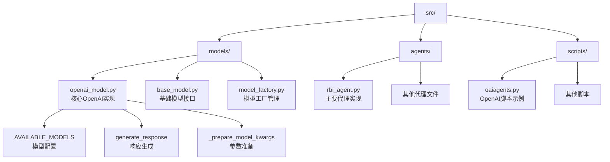
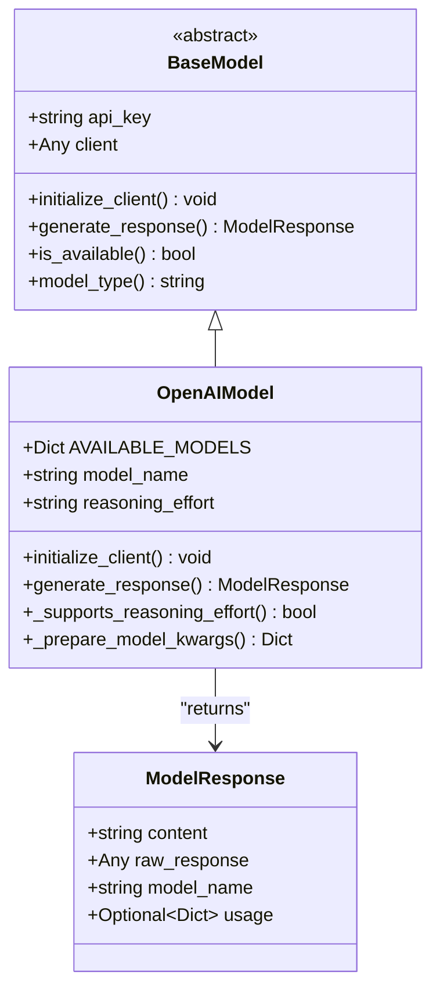
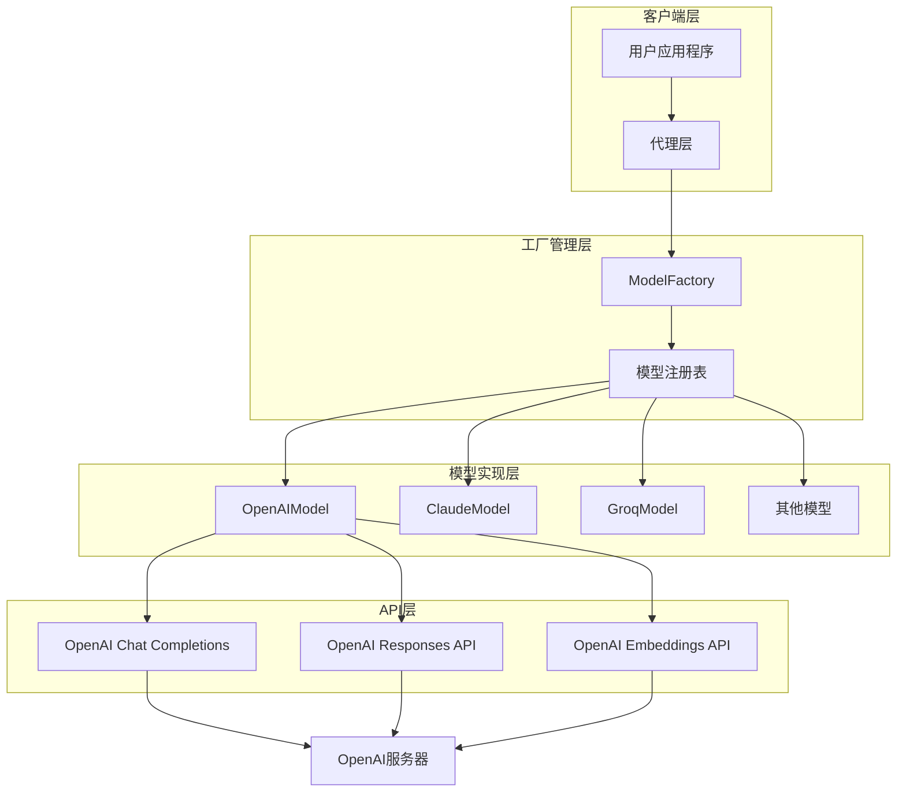
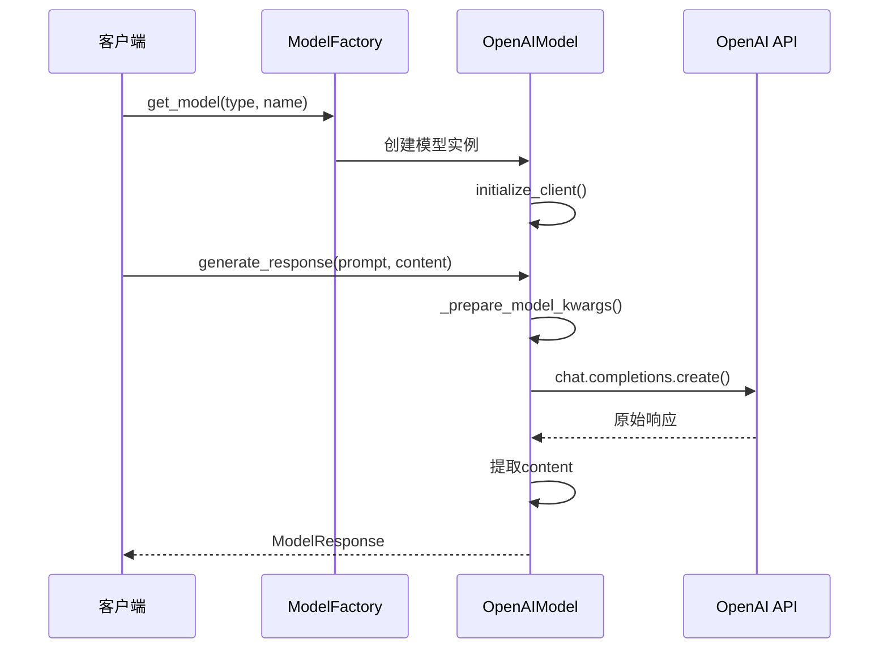
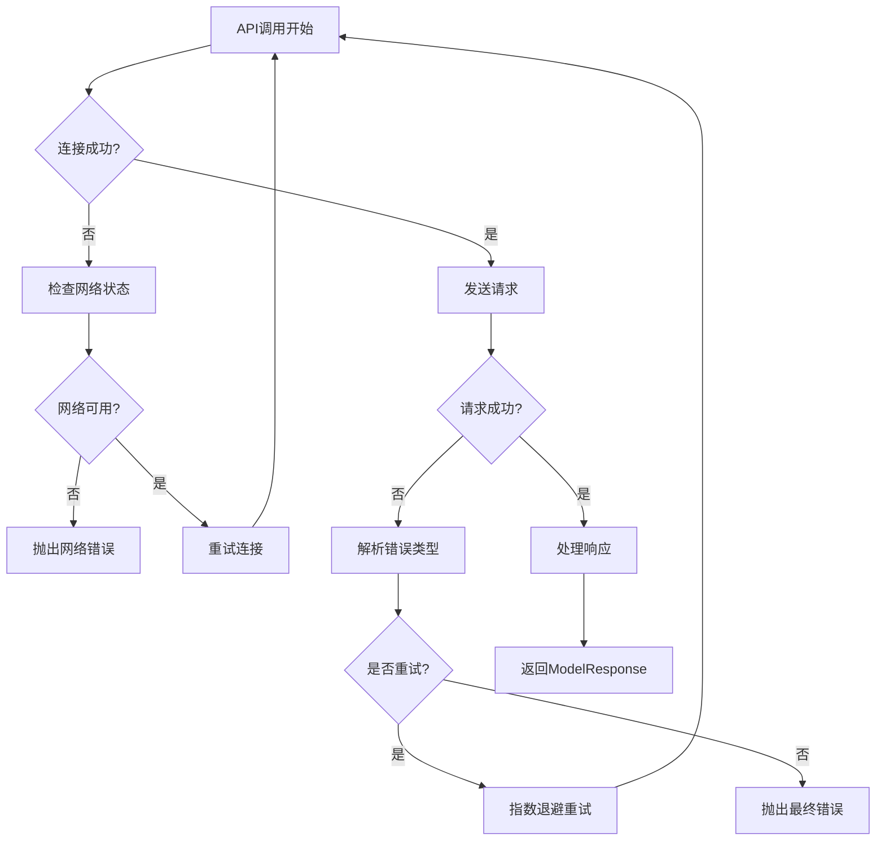
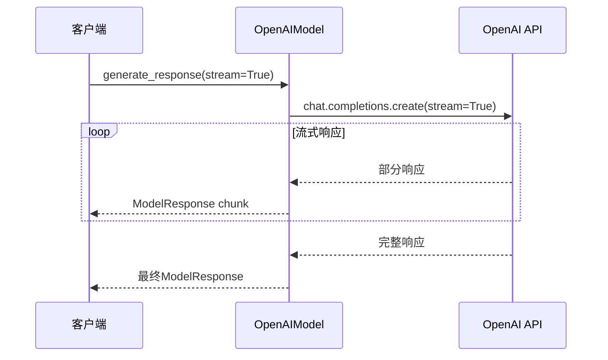
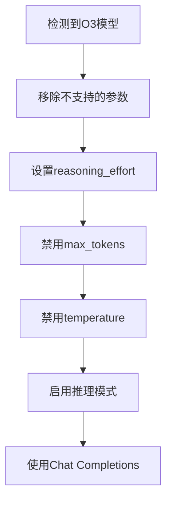
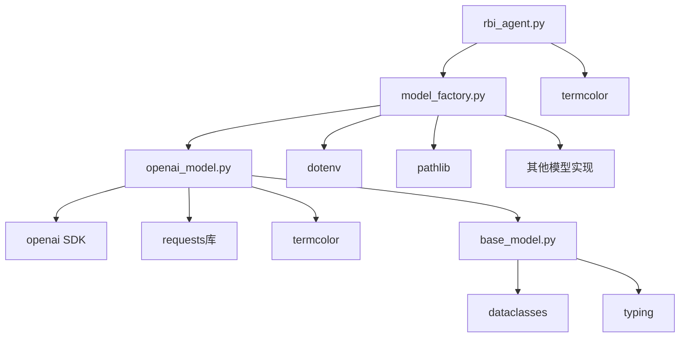
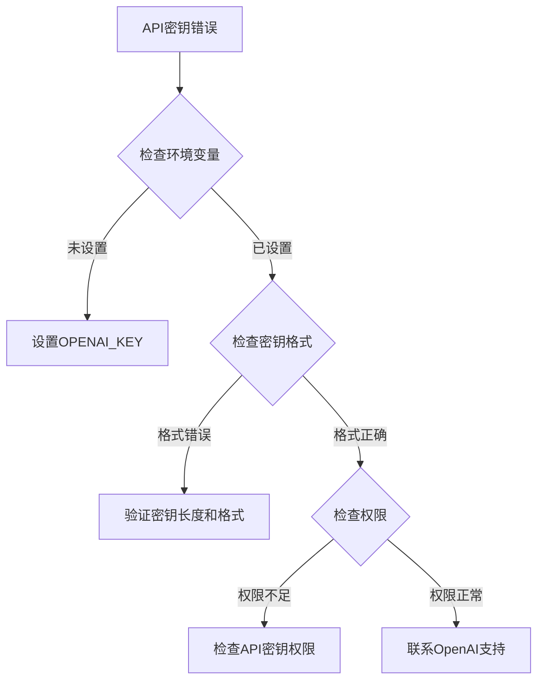

# API端点集成

<cite>
**本文档中引用的文件**
- [openai_model.py](file://src/models/openai_model.py)
- [base_model.py](file://src/models/base_model.py)
- [model_factory.py](file://src/models/model_factory.py)
- [rbi_agent.py](file://src/agents/rbi_agent.py)
- [oaiagents.py](file://src/scripts/oaiagents.py)
- [README.md](file://src/models/README.md)
</cite>

## 目录
1. [简介](#简介)
2. [项目结构](#项目结构)
3. [核心组件](#核心组件)
4. [架构概览](#架构概览)
5. [详细组件分析](#详细组件分析)
6. [依赖关系分析](#依赖关系分析)
7. [性能考虑](#性能考虑)
8. [故障排除指南](#故障排除指南)
9. [结论](#结论)

## 简介

本文档详细介绍了Moon Dev AI Agents项目中OpenAI API端点集成的实现。该项目提供了一个统一的接口来访问OpenAI的各种API端点，包括聊天完成（Chat Completions）、文本完成（Completions）和向量嵌入（Embeddings）。通过精心设计的抽象层，开发者可以轻松地在不同模型之间切换，同时享受强大的错误处理和重试机制。

该系统的核心优势在于其模块化设计和智能回退策略。当主要API不可用时，系统能够自动切换到备用方案，确保服务的连续性和可靠性。此外，系统还提供了丰富的调试信息和详细的错误报告，帮助开发者快速定位和解决问题。

## 项目结构

项目的API端点集成遵循清晰的分层架构，主要包含以下关键目录：



**图表来源**
- [openai_model.py](file://src/models/openai_model.py#L1-L50)
- [base_model.py](file://src/models/base_model.py#L1-L30)
- [model_factory.py](file://src/models/model_factory.py#L1-L50)

**章节来源**
- [openai_model.py](file://src/models/openai_model.py#L1-L441)
- [model_factory.py](file://src/models/model_factory.py#L1-L261)

## 核心组件

### OpenAI模型类

OpenAI模型类是整个API端点集成的核心，它继承自基础模型类并实现了特定于OpenAI的功能。该类支持多种先进的OpenAI模型，从最新的GPT-5到专门的推理模型O1系列。

### 可用模型配置

系统支持广泛的OpenAI模型，每种模型都有详细的配置信息：

| 模型名称 | 描述 | 输入价格 | 输出价格 | 支持推理努力 |
|---------|------|----------|----------|-------------|
| gpt-5 | 最先进的GPT-5模型，具有突破性能力 | $0.015/1K tokens | $0.045/1K tokens | 否 |
| gpt-5-mini | 高效的GPT-5迷你模型 | $0.007/1K tokens | $0.021/1K tokens | 否 |
| gpt-5-nano | 超快的GPT-5纳米模型 | $0.003/1K tokens | $0.009/1K tokens | 否 |
| o3 | 具有卓越问题解决能力的高级推理模型 | $1.50/1m tokens | $5.00/1m tokens | 是 |
| o3-mini | 快速推理模型 | $1.10/1m tokens | $4.40/1m tokens | 是 |
| o1 | 最新的O1模型，具有推理能力 | $0.01/1K tokens | $0.03/1K tokens | 否 |
| o1-mini | 较小的O1模型 | $0.005/1K tokens | $0.015/1K tokens | 否 |
| gpt-4o | 先进的GPT-4优化模型 | $0.01/1K tokens | $0.03/1K tokens | 否 |
| gpt-4o-mini | 高效的GPT-4优化迷你模型 | $0.005/1K tokens | $0.015/1K tokens | 否 |

### 响应格式标准化

所有API调用都返回标准化的`ModelResponse`对象，确保了一致的接口体验：



**图表来源**
- [base_model.py](file://src/models/base_model.py#L15-L25)
- [openai_model.py](file://src/models/openai_model.py#L10-L100)

**章节来源**
- [openai_model.py](file://src/models/openai_model.py#L10-L100)
- [base_model.py](file://src/models/base_model.py#L15-L25)

## 架构概览

系统的整体架构采用工厂模式和策略模式的组合，提供了灵活且可扩展的模型管理能力：



**图表来源**
- [model_factory.py](file://src/models/model_factory.py#L23-L50)
- [openai_model.py](file://src/models/openai_model.py#L10-L50)

## 详细组件分析

### 聊天完成（Chat Completions）端点

聊天完成是OpenAI API中最常用的端点之一，用于生成自然语言对话响应。系统对此端点进行了全面的封装和优化。

#### 请求构建流程



**图表来源**
- [openai_model.py](file://src/models/openai_model.py#L100-L200)
- [model_factory.py](file://src/models/model_factory.py#L150-L200)

#### 参数配置和优化

系统根据不同的模型类型自动调整参数配置：

1. **推理努力控制**：对于支持推理的模型（如O3），系统会自动设置推理努力级别
2. **令牌限制映射**：将通用的`max_tokens`参数映射到特定模型的对应参数
3. **温度调节**：为不同模型类型设置合适的温度值
4. **超时处理**：设置合理的请求超时时间

#### 错误处理机制

系统实现了多层次的错误处理策略：



**图表来源**
- [openai_model.py](file://src/models/openai_model.py#L350-L441)

**章节来源**
- [openai_model.py](file://src/models/openai_model.py#L100-L300)

### 文本完成（Completions）端点

虽然现代OpenAI API更推荐使用聊天完成端点，但系统仍然保留了对传统文本完成的支持。这种兼容性确保了与旧版本代码的向后兼容。

#### 实现特点

1. **向后兼容**：支持传统的completion API格式
2. **参数映射**：自动将新参数映射到旧参数
3. **格式转换**：在必要时转换响应格式

### 向量嵌入（Embeddings）端点

向量嵌入功能允许将文本转换为高维向量表示，广泛应用于语义搜索、相似度计算等场景。

#### 使用场景

- **语义搜索**：基于向量相似度的文档检索
- **聚类分析**：基于文本特征的分组
- **推荐系统**：基于用户偏好的内容推荐
- **异常检测**：基于正常行为模式的异常识别

**章节来源**
- [openai_model.py](file://src/models/openai_model.py#L100-L200)

### 流式输出实现

系统支持流式输出，这对于实时应用场景至关重要。流式输出允许客户端在接收到部分响应时就开始处理数据，显著改善用户体验。

#### 实现原理



**图表来源**
- [openai_model.py](file://src/models/openai_model.py#L100-L150)

#### 实时应用优势

1. **降低延迟**：用户无需等待完整响应即可开始接收数据
2. **更好的用户体验**：响应看起来更加流畅和自然
3. **资源效率**：减少内存占用和带宽使用
4. **中断恢复**：在网络不稳定时更容易处理中断

**章节来源**
- [openai_model.py](file://src/models/openai_model.py#L100-L200)

### 模型特定参数处理

不同模型有不同的参数要求，系统实现了智能的参数映射和验证机制：

#### O3模型特殊处理



**图表来源**
- [openai_model.py](file://src/models/openai_model.py#L70-L90)

#### O1模型特殊处理

O1模型需要特殊的参数配置，系统会自动处理这些差异。

#### GPT-5模型特殊处理

GPT-5模型有独特的参数命名约定，系统会自动进行映射。

**章节来源**
- [openai_model.py](file://src/models/openai_model.py#L70-L100)

## 依赖关系分析

系统的依赖关系清晰且模块化，避免了循环依赖：



**图表来源**
- [openai_model.py](file://src/models/openai_model.py#L1-L10)
- [model_factory.py](file://src/models/model_factory.py#L1-L20)

**章节来源**
- [openai_model.py](file://src/models/openai_model.py#L1-L10)
- [model_factory.py](file://src/models/model_factory.py#L1-L20)

## 性能考虑

### 缓存策略

系统实现了智能的缓存机制来提高性能：

1. **随机数防缓存**：每次请求都会添加随机数以防止服务器缓存
2. **唯一标识符**：使用时间戳和随机数创建唯一请求标识
3. **响应去重**：避免重复处理相同的响应

### 连接池管理

- **连接复用**：使用持久连接减少建立连接的开销
- **超时控制**：设置合理的超时时间避免长时间等待
- **重试机制**：实现指数退避重试算法

### 内存管理

- **流式处理**：对于大型响应使用流式处理
- **及时释放**：处理完成后立即释放资源
- **垃圾回收**：定期清理无用的对象引用

## 故障排除指南

### 常见错误及解决方案

#### API密钥错误



#### 网络连接问题

1. **检查网络连接**：确保网络稳定
2. **防火墙设置**：确认防火墙允许HTTPS连接
3. **代理配置**：如果使用代理，检查代理设置

#### 模型不可用

1. **检查模型名称**：确认使用的模型名称正确
2. **验证配额**：检查API配额是否充足
3. **查看状态页面**：检查OpenAI服务状态

### 调试技巧

#### 启用详细日志

系统提供了丰富的调试信息，可以通过修改日志级别来获取更多信息：

```python
# 在代码中启用详细日志
import logging
logging.basicConfig(level=logging.DEBUG)
```

#### 错误信息解读

系统会提供详细的错误信息，包括：

- **错误类型**：具体的异常类型
- **状态码**：HTTP状态码
- **请求ID**：用于OpenAI支持的请求追踪
- **参数信息**：失败请求的参数详情

**章节来源**
- [openai_model.py](file://src/models/openai_model.py#L350-L441)

## 结论

Moon Dev的OpenAI API端点集成为开发者提供了一个强大、灵活且可靠的AI服务接入方案。通过精心设计的抽象层和智能的回退机制，系统能够在各种环境下保持稳定的性能。

### 主要优势

1. **统一接口**：提供一致的API接口，简化了多模型切换
2. **智能回退**：自动处理API不可用的情况
3. **丰富功能**：支持聊天完成、文本完成和向量嵌入
4. **实时支持**：完整的流式输出支持
5. **强大错误处理**：多层次的错误处理和恢复机制

### 最佳实践建议

1. **合理设置参数**：根据具体需求调整温度、最大令牌数等参数
2. **监控使用情况**：定期检查API使用量和成本
3. **实施重试策略**：在关键业务中实施适当的重试逻辑
4. **保持更新**：关注新模型和API功能的发布

该系统为构建高质量的AI驱动应用提供了坚实的基础，无论是简单的文本生成还是复杂的对话系统，都能找到合适的解决方案。