# OpenAI模型集成

<cite>
**本文档中引用的文件**
- [openai_model.py](file://src/models/openai_model.py)
- [model_factory.py](file://src/models/model_factory.py)
- [base_model.py](file://src/models/base_model.py)
- [config.py](file://src/config.py)
- [rbi_agent.py](file://src/agents/rbi_agent.py)
- [rbi_agent_v2.py](file://src/agents/rbi_agent_v2.py)
- [rbi_agent_v3.py](file://src/agents/rbi_agent_v3.py)
</cite>

## 目录
1. [简介](#简介)
2. [项目结构](#项目结构)
3. [核心组件](#核心组件)
4. [架构概览](#架构概览)
5. [详细组件分析](#详细组件分析)
6. [依赖关系分析](#依赖关系分析)
7. [性能考虑](#性能考虑)
8. [故障排除指南](#故障排除指南)
9. [结论](#结论)

## 简介

Moon Dev AI代理系统是一个先进的AI驱动交易平台，其中OpenAI模型集成是核心功能之一。该系统通过精心设计的架构实现了对OpenAI API的深度适配，支持多种模型类型（GPT-5、O1、O3等），提供强大的聊天完成、文本生成和嵌入功能。

OpenAI模型集成不仅提供了标准化的接口，还包含了智能的错误处理、成本优化和多轮对话管理功能，确保在各种生产环境中的稳定性和可靠性。

## 项目结构

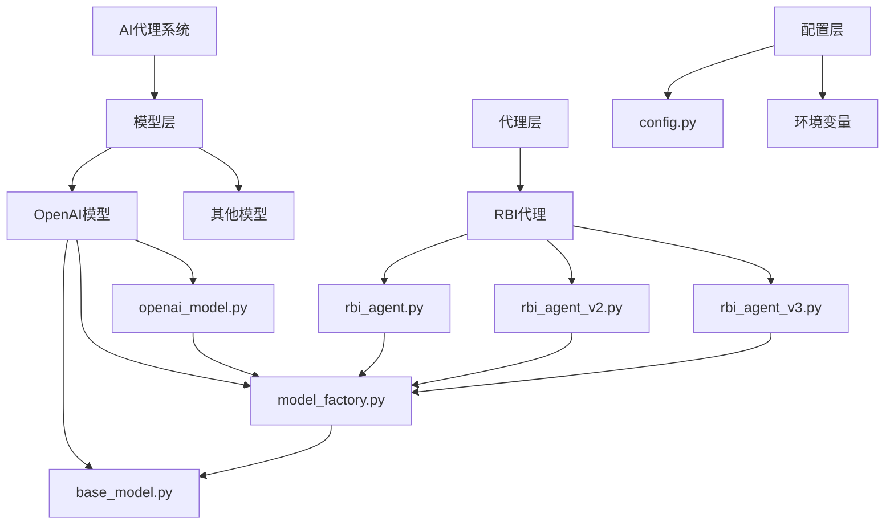

**图表来源**
- [openai_model.py](file://src/models/openai_model.py#L1-L441)
- [model_factory.py](file://src/models/model_factory.py#L1-L261)
- [base_model.py](file://src/models/base_model.py#L1-L73)

**章节来源**
- [openai_model.py](file://src/models/openai_model.py#L1-L50)
- [model_factory.py](file://src/models/model_factory.py#L1-L30)

## 核心组件

### OpenAIModel类

OpenAIModel类是整个OpenAI集成的核心实现，继承自BaseModel基类，提供了完整的OpenAI API适配功能。

#### 主要特性：
- **多模型支持**：支持GPT-5系列、O1系列、O3系列等多种先进模型
- **智能参数管理**：根据模型类型自动调整参数配置
- **响应式API**：支持新的Responses API和传统Chat Completions API
- **错误恢复机制**：多层次的错误处理和回退策略

#### 可用模型列表：

| 模型名称 | 描述 | 输入价格 | 输出价格 | 推理能力 |
|---------|------|----------|----------|----------|
| gpt-5 | 最先进的GPT-5模型 | $0.015/1K tokens | $0.045/1K tokens | 不支持 |
| gpt-5-mini | 高效的GPT-5迷你模型 | $0.007/1K tokens | $0.021/1K tokens | 不支持 |
| gpt-5-nano | 超快速的GPT-5纳米模型 | $0.003/1K tokens | $0.009/1K tokens | 不支持 |
| o3 | 先进推理模型 | $1.50/1m tokens | $5.00/1m tokens | 支持 |
| o3-mini | 快速推理模型 | $1.10/1m tokens | $4.40/1m tokens | 支持 |
| o1 | 最新O1模型 | $0.01/1K tokens | $0.03/1K tokens | 不支持 |
| o1-mini | 小型O1模型 | $0.005/1K tokens | $0.015/1K tokens | 不支持 |
| gpt-4o | 先进的GPT-4优化模型 | $0.01/1K tokens | $0.03/1K tokens | 不支持 |
| gpt-4o-mini | 高效的GPT-4优化迷你模型 | $0.005/1K tokens | $0.015/1K tokens | 不支持 |

**章节来源**
- [openai_model.py](file://src/models/openai_model.py#L10-L60)

### ModelFactory工厂类

ModelFactory负责统一管理所有AI模型实例，提供模型注册、初始化和获取的标准化接口。

#### 核心功能：
- **模型注册机制**：将模型类型映射到具体实现类
- **自动初始化**：根据环境变量自动检测和初始化可用模型
- **动态模型切换**：支持运行时更换模型实例
- **健康检查**：验证模型可用性

**章节来源**
- [model_factory.py](file://src/models/model_factory.py#L23-L53)

## 架构概览

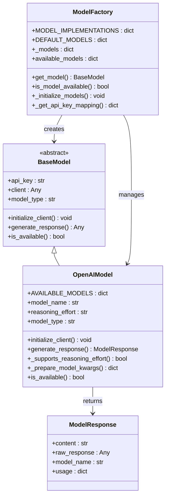

**图表来源**
- [base_model.py](file://src/models/base_model.py#L15-L30)
- [openai_model.py](file://src/models/openai_model.py#L10-L441)
- [model_factory.py](file://src/models/model_factory.py#L23-L261)

## 详细组件分析

### OpenAIModel实现详解

#### 初始化流程

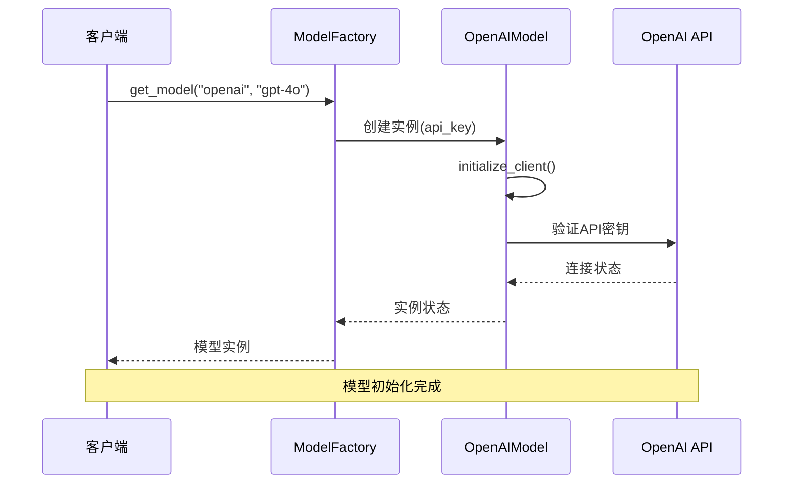

**图表来源**
- [model_factory.py](file://src/models/model_factory.py#L165-L218)
- [openai_model.py](file://src/models/openai_model.py#L65-L75)

#### 多模型参数适配

OpenAIModel实现了智能的参数适配机制，根据不同模型的特点自动调整参数：

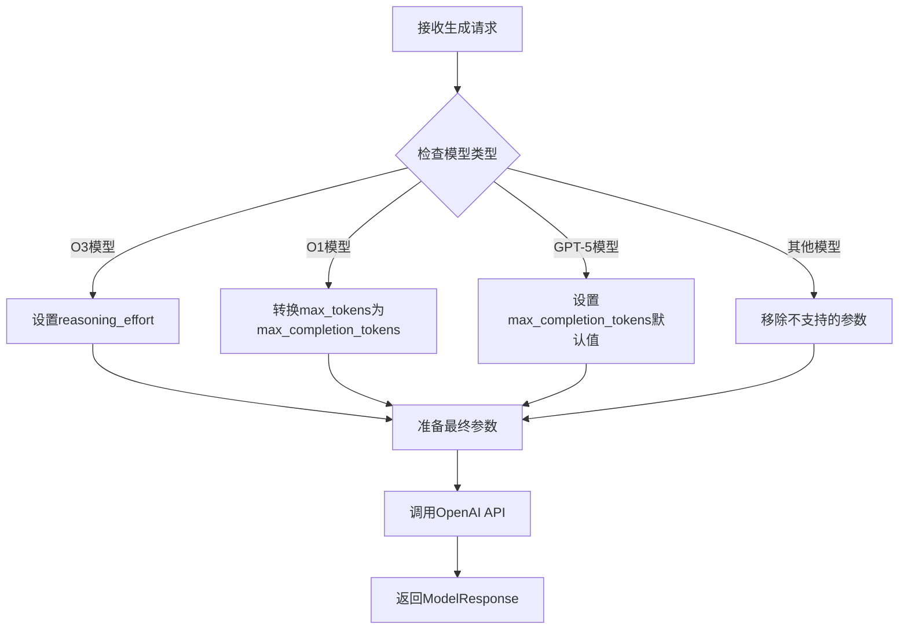

**图表来源**
- [openai_model.py](file://src/models/openai_model.py#L105-L140)

#### 错误处理策略

系统实现了多层次的错误处理和恢复机制：

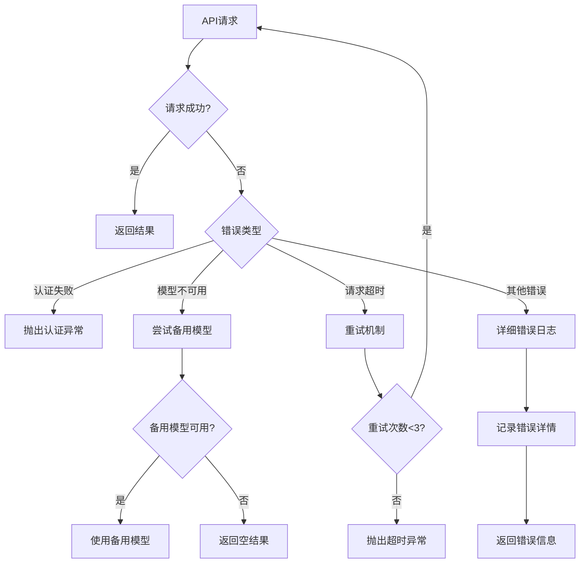

**图表来源**
- [openai_model.py](file://src/models/openai_model.py#L380-L441)

**章节来源**
- [openai_model.py](file://src/models/openai_model.py#L105-L180)
- [openai_model.py](file://src/models/openai_model.py#L380-L441)

### ModelFactory注册机制

#### 模型类型映射

ModelFactory维护了完整的模型类型到实现类的映射关系：

| 模型类型 | 实现类 | 默认模型 |
|---------|--------|----------|
| claude | ClaudeModel | claude-3-5-haiku-latest |
| groq | GroqModel | mixtral-8x7b-32768 |
| openai | OpenAIModel | gpt-4o |
| gemini | GeminiModel | gemini-2.5-flash |
| deepseek | DeepSeekModel | deepseek-reasoner |
| ollama | OllamaModel | llama3.2 |
| xai | XAIModel | grok-4-fast-reasoning |
| openrouter | OpenRouterModel | google/gemini-2.5-flash |

#### 自动初始化流程

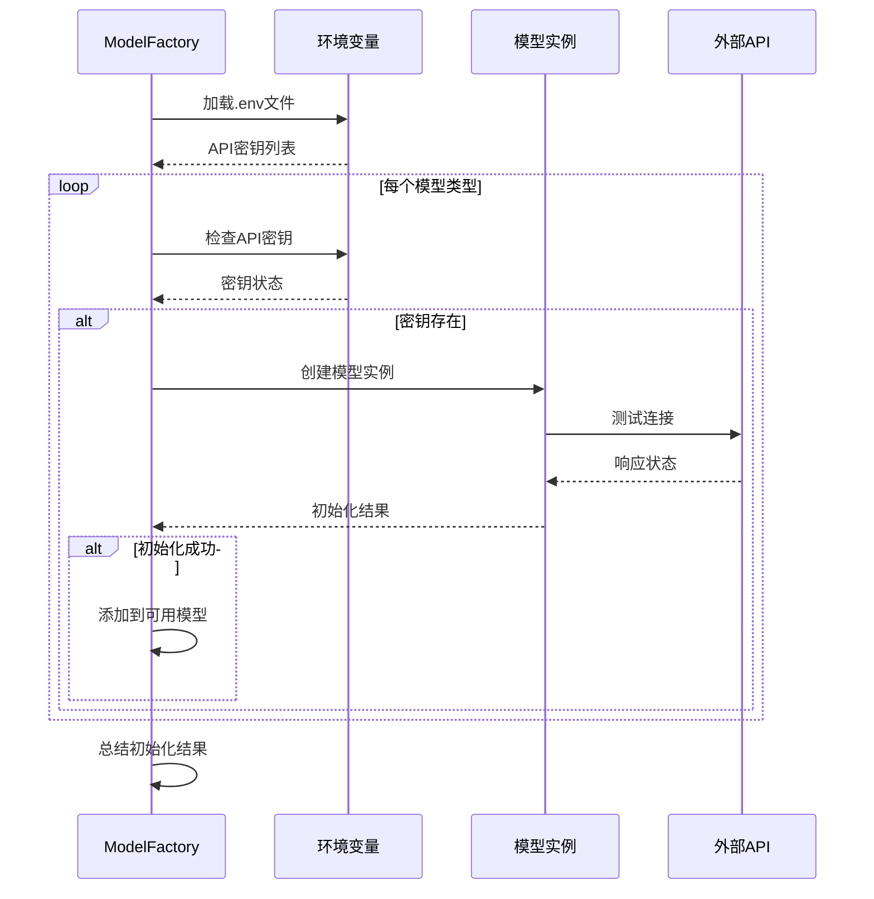

**图表来源**
- [model_factory.py](file://src/models/model_factory.py#L51-L144)

**章节来源**
- [model_factory.py](file://src/models/model_factory.py#L23-L80)
- [model_factory.py](file://src/models/model_factory.py#L144-L192)

### 多轮对话管理

#### 对话状态管理

系统通过内存机制支持多轮对话，保持上下文连续性：

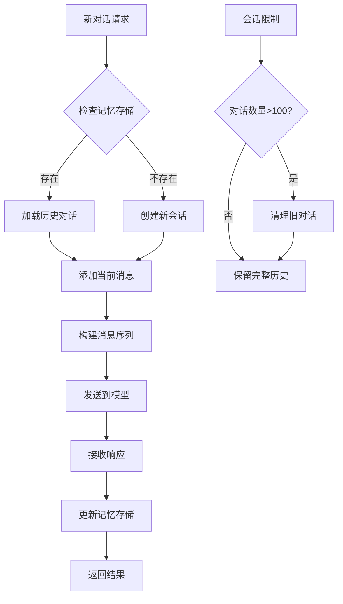

**图表来源**
- [rbi_agent.py](file://src/agents/rbi_agent.py#L350-L380)

#### 函数调用支持

系统支持复杂的函数调用模式，允许模型执行特定任务：

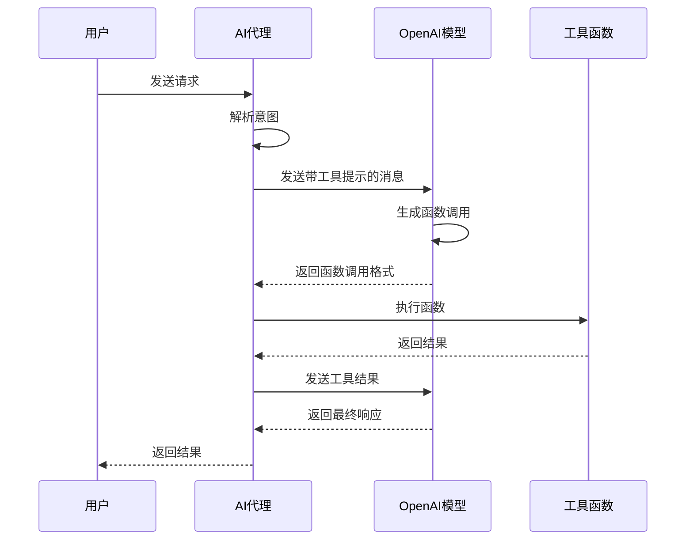

**图表来源**
- [rbi_agent.py](file://src/agents/rbi_agent.py#L416-L480)

**章节来源**
- [rbi_agent.py](file://src/agents/rbi_agent.py#L350-L400)
- [rbi_agent_v2.py](file://src/agents/rbi_agent_v2.py#L470-L500)

### 流式输出实现

#### 流式响应处理

系统支持OpenAI的流式输出功能，提供实时的响应体验：

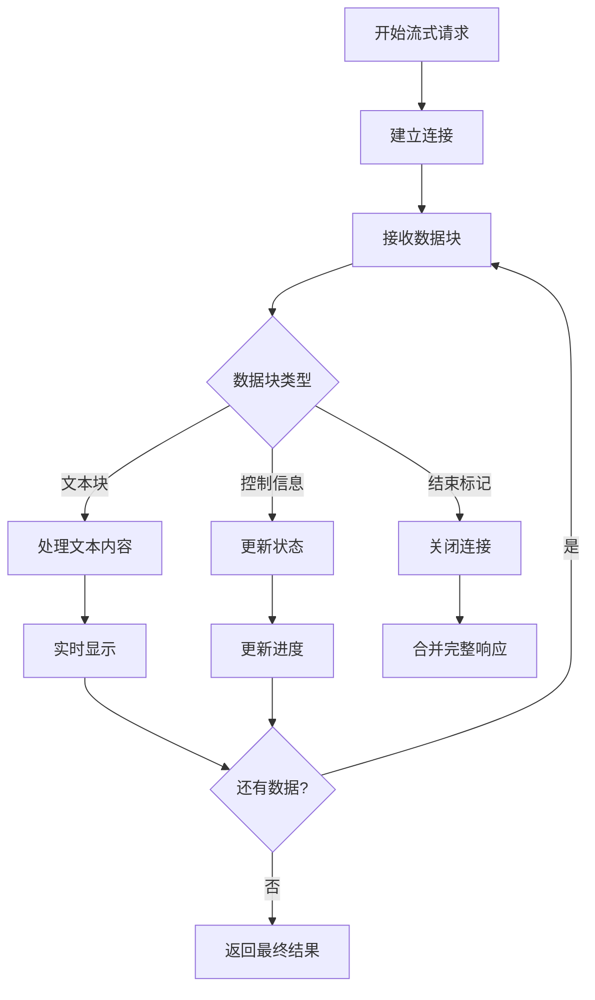

**图表来源**
- [openai_model.py](file://src/models/openai_model.py#L180-L220)

**章节来源**
- [openai_model.py](file://src/models/openai_model.py#L180-L250)

## 依赖关系分析

### 模块依赖图

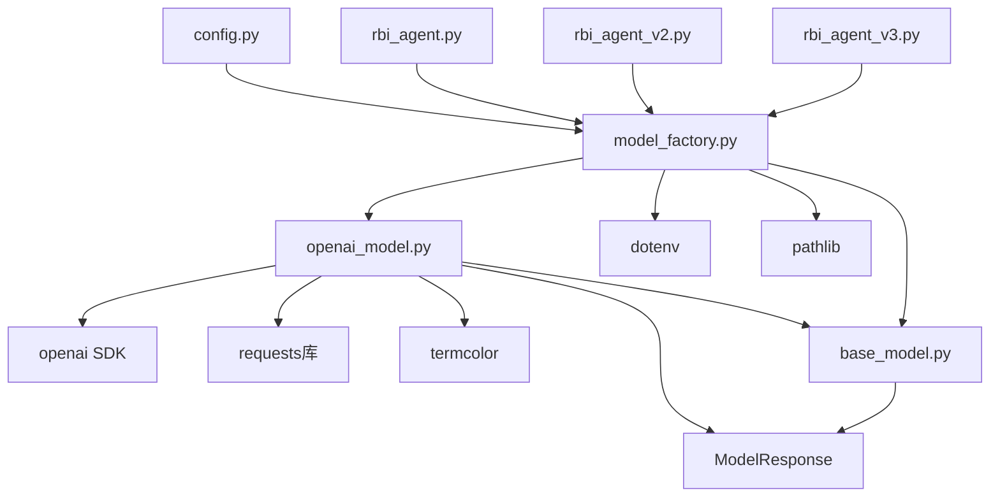

**图表来源**
- [openai_model.py](file://src/models/openai_model.py#L1-L10)
- [model_factory.py](file://src/models/model_factory.py#L1-L21)

### 配置选项详解

#### API配置

| 配置项 | 类型 | 默认值 | 描述 |
|--------|------|--------|------|
| OPENAI_KEY | str | None | OpenAI API密钥 |
| OPENAI_ORGANIZATION | str | None | 组织标识符 |
| OPENAI_BASE_URL | str | None | API基础URL |

#### 模型配置

| 配置项 | 类型 | 默认值 | 描述 |
|--------|------|--------|------|
| model_name | str | "o1-mini" | 使用的模型名称 |
| reasoning_effort | str | "medium" | 推理努力程度 |
| temperature | float | 0.7 | 创造性vs精确度 |
| max_tokens | int | None | 最大令牌数 |

**章节来源**
- [model_factory.py](file://src/models/model_factory.py#L51-L81)
- [openai_model.py](file://src/models/openai_model.py#L65-L75)

## 性能考虑

### 成本优化策略

#### 令牌使用监控

系统实现了详细的令牌使用监控机制：

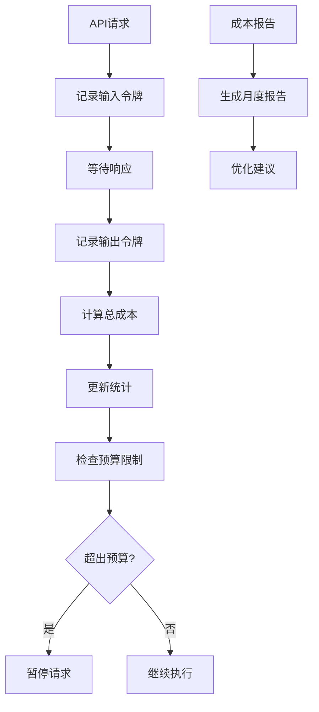

#### 缓存策略

系统采用多层缓存策略提高性能：

1. **内存缓存**：短期对话和频繁查询
2. **磁盘缓存**：长期数据和大型文档
3. **分布式缓存**：多实例共享缓存

### 性能优化技巧

#### 请求批处理

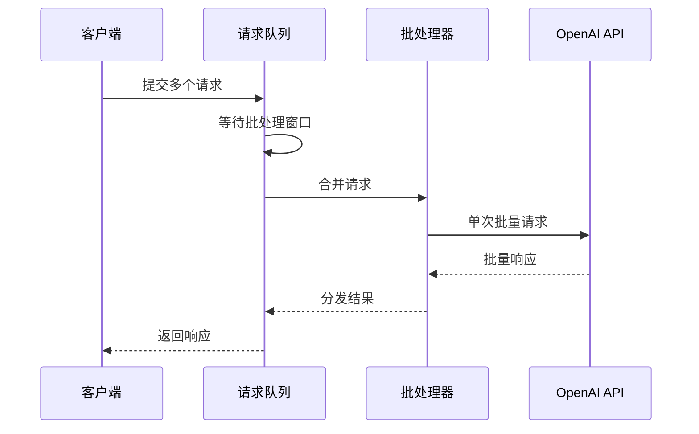

#### 连接池管理

系统使用连接池优化网络请求：

- **最大连接数**：限制并发连接
- **连接超时**：防止长时间等待
- **重试机制**：自动处理临时故障

## 故障排除指南

### 常见问题及解决方案

#### 认证失败

**症状**：API密钥无效或权限不足

**解决方案**：
1. 检查`.env`文件中的`OPENAI_KEY`
2. 验证API密钥的有效性
3. 确认账户余额充足

#### 模型不可用

**症状**：指定模型无法访问

**解决方案**：
1. 检查模型名称拼写
2. 验证账户是否订阅该模型
3. 尝试降级到备用模型

#### 请求超时

**症状**：API请求长时间无响应

**解决方案**：
1. 增加超时时间设置
2. 检查网络连接稳定性
3. 实施指数退避重试

#### 内容过滤

**症状**：请求被OpenAI内容政策阻止

**解决方案**：
1. 修改提示词避免敏感内容
2. 使用更温和的语言表达
3. 检查用户内容合规性

**章节来源**
- [openai_model.py](file://src/models/openai_model.py#L380-L441)
- [model_factory.py](file://src/models/model_factory.py#L100-L144)

### 调试和监控

#### 日志记录

系统提供了详细的日志记录功能：

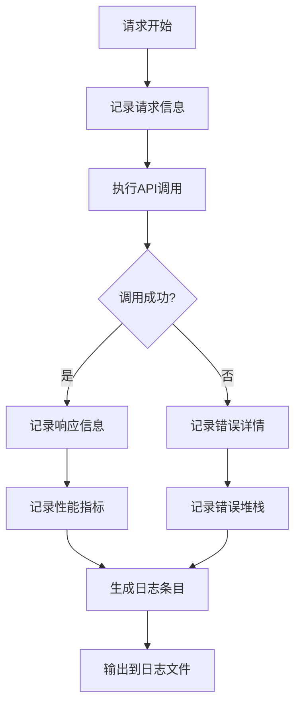

#### 监控指标

关键监控指标包括：

- **响应时间**：平均和95%分位数
- **错误率**：各类错误的发生频率
- **令牌使用量**：按模型和时间段统计
- **成本消耗**：实时成本跟踪

## 结论

Moon Dev的OpenAI模型集成为AI代理系统提供了强大而灵活的基础。通过精心设计的架构，系统实现了：

1. **统一的接口**：标准化的模型访问方式
2. **智能适配**：自动处理不同模型的参数差异
3. **健壮的错误处理**：多层次的错误恢复机制
4. **成本优化**：详细的使用监控和缓存策略
5. **高性能**：优化的请求处理和资源管理

该集成不仅满足了当前的业务需求，还为未来的扩展和优化奠定了坚实的基础。通过持续的监控和改进，系统能够适应不断变化的AI模型生态系统，为用户提供最佳的服务体验。