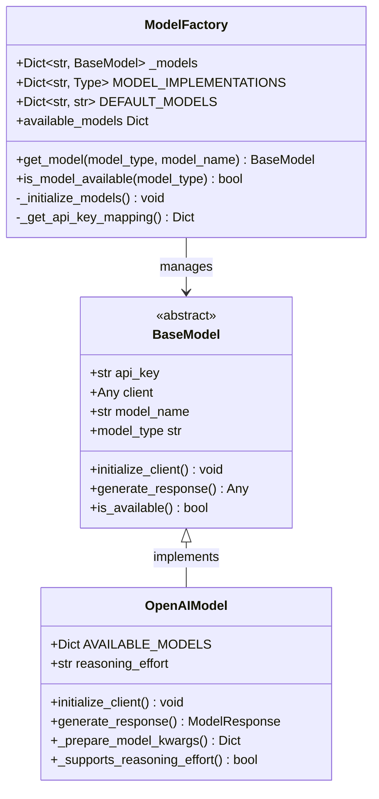
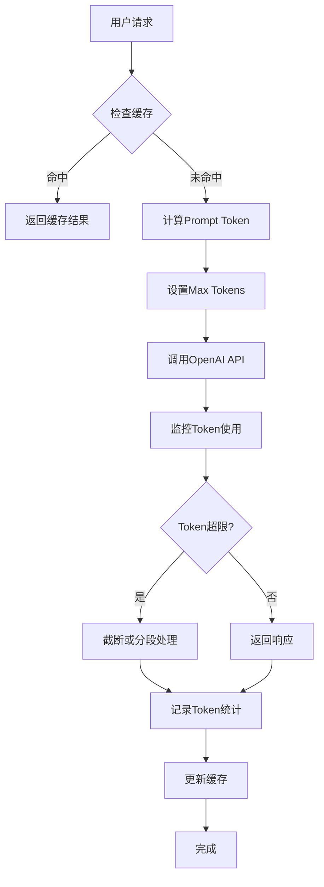
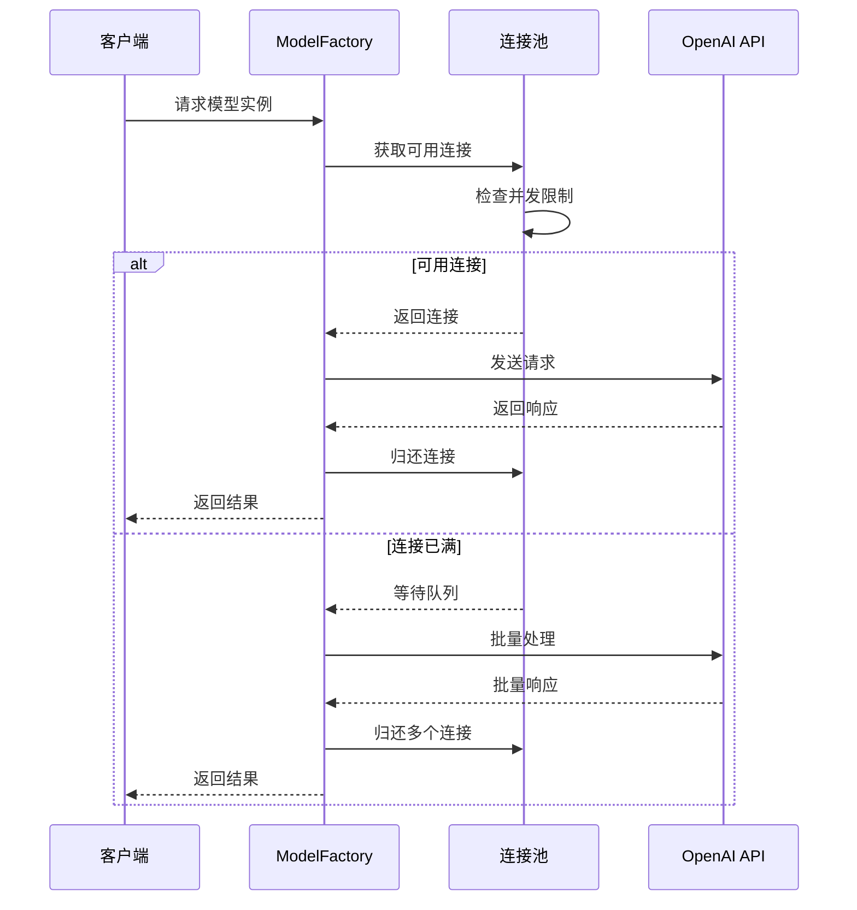
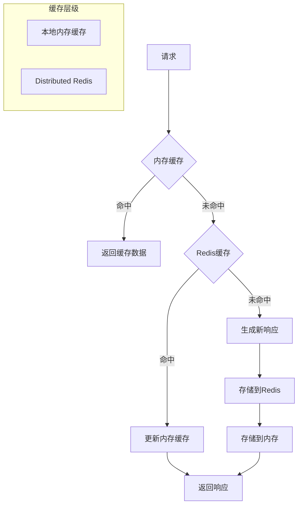
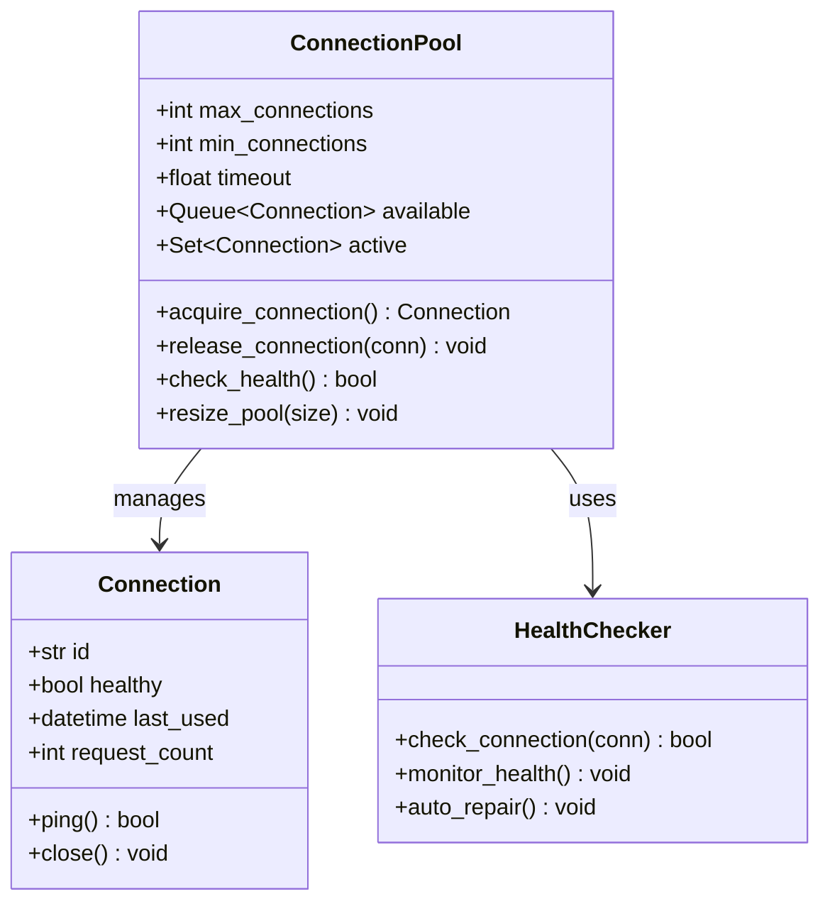
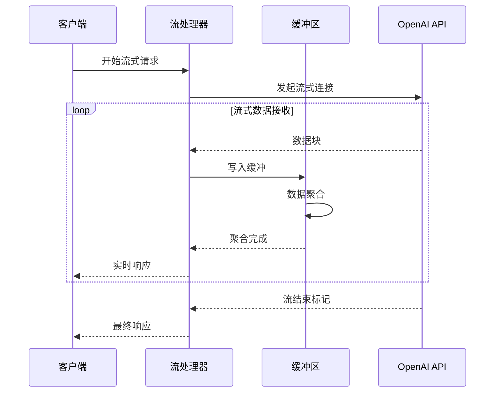
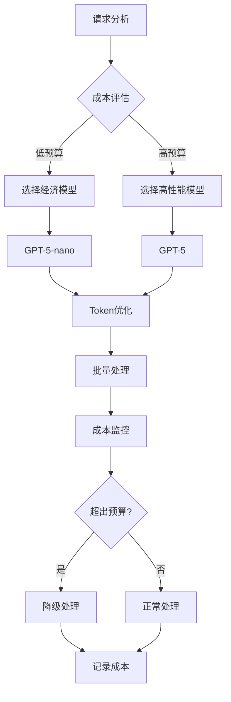
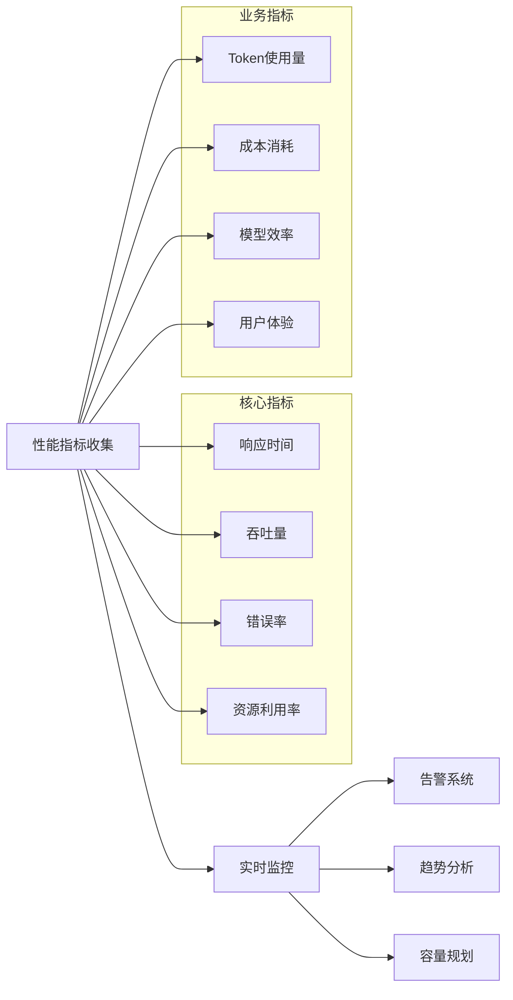
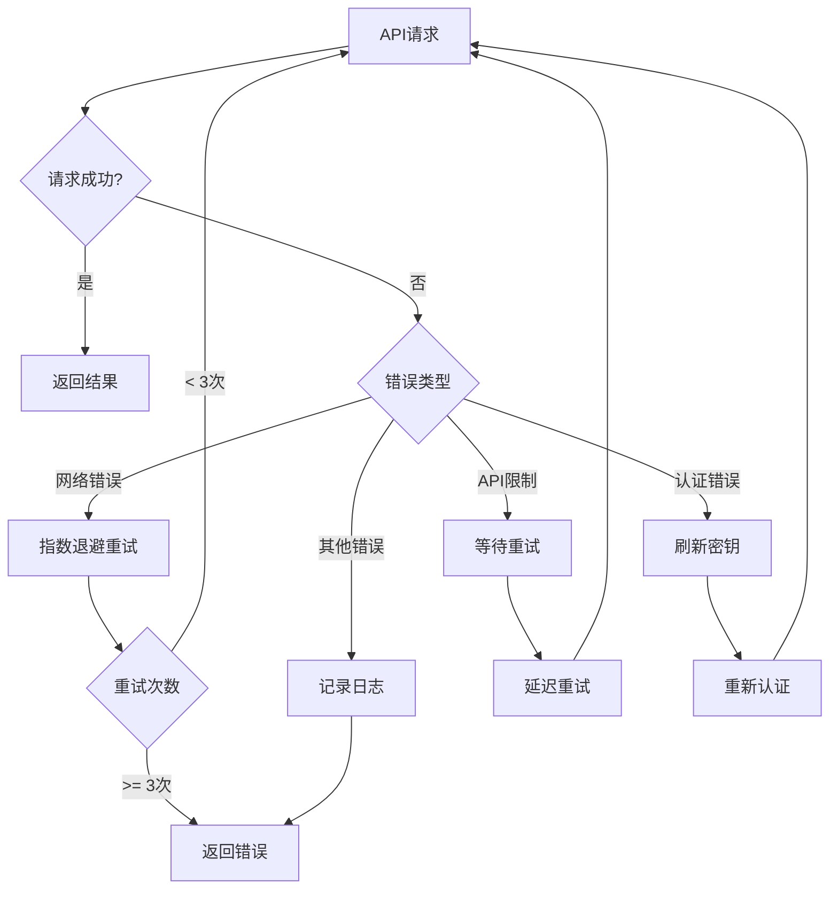

# 性能优化

<cite>
**本文档中引用的文件**
- [openai_model.py](file://src/models/openai_model.py)
- [base_model.py](file://src/models/base_model.py)
- [model_factory.py](file://src/models/model_factory.py)
- [config.py](file://src/config.py)
- [chat_agent.py](file://src/agents/chat_agent.py)
- [performance-monitor.md](file://src/data/rbi/.claude/agents/optimization/performance-monitor.md)
- [performance-benchmarker.md](file://src/data/rbi/.claude/agents/consensus/performance-benchmarker.md)
</cite>

## 目录
1. [简介](#简介)
2. [OpenAI模型集成性能优化](#openai模型集成性能优化)
3. [Token使用监控与优化](#token使用监控与优化)
4. [请求批处理与并发控制](#请求批处理与并发控制)
5. [响应缓存策略](#响应缓存策略)
6. [连接池管理](#连接池管理)
7. [流式传输优化](#流式传输优化)
8. [成本控制策略](#成本控制策略)
9. [性能监控与指标](#性能监控与指标)
10. [错误处理与重试机制](#错误处理与重试机制)
11. [最佳实践建议](#最佳实践建议)

## 简介

Moon Dev AI Agents系统采用多层次的性能优化策略，专门针对OpenAI模型集成进行了深度优化。该系统通过智能的token管理、高效的缓存策略、优化的连接池管理和先进的监控机制，确保在高负载环境下仍能保持卓越的性能表现。

## OpenAI模型集成性能优化

### 模型初始化与配置优化

系统实现了智能的模型工厂模式，支持多种AI模型的统一管理：

**图表来源**
- [model_factory.py](file://src/models/model_factory.py#L20-L50)
- [base_model.py](file://src/models/base_model.py#L25-L45)
- [openai_model.py](file://src/models/openai_model.py#L10-L80)

### 多模型支持与自动切换

系统支持多种OpenAI模型，包括最新的GPT-5、O1系列和O3推理模型：

| 模型类型 | 输入价格 | 输出价格 | 推理能力 | 适用场景 |
|---------|---------|---------|---------|----------|
| GPT-5 | $0.015/1K tokens | $0.045/1K tokens | 不支持 | 高精度任务 |
| GPT-5-mini | $0.007/1K tokens | $0.021/1K tokens | 不支持 | 快速任务 |
| GPT-5-nano | $0.003/1K tokens | $0.009/1K tokens | 不支持 | 实时任务 |
| O1 | $0.01/1K tokens | $0.03/1K tokens | 不支持 | 基础推理 |
| O1-mini | $0.005/1K tokens | $0.015/1K tokens | 不支持 | 快速推理 |
| O3 | $1.50/1m tokens | $5.00/1m tokens | 支持 | 复杂推理 |
| O3-mini | $1.10/1m tokens | $4.40/1m tokens | 支持 | 快速推理 |

**节来源**
- [openai_model.py](file://src/models/openai_model.py#L10-L80)

## Token使用监控与优化

### 智能Token管理

系统实现了多层次的token使用监控和优化机制：

**图表来源**
- [openai_model.py](file://src/models/openai_model.py#L150-L200)

### Prompt优化策略

系统采用多种策略优化prompt效率：

1. **动态max_tokens调整**：根据任务复杂度自动调整输出token限制
2. **Reasoning Effort优化**：为O3模型智能设置推理努力级别
3. **参数映射**：自动处理不同模型间的参数差异

**节来源**
- [openai_model.py](file://src/models/openai_model.py#L100-L150)

## 请求批处理与并发控制

### 并发请求管理

系统实现了智能的并发控制机制：

**图表来源**
- [model_factory.py](file://src/models/model_factory.py#L100-L150)

### 负载均衡与故障转移

系统具备自动负载均衡和故障转移能力：

- **多API密钥轮换**：避免单点故障
- **智能路由**：根据模型可用性选择最优路径
- **健康检查**：实时监控模型服务状态

**节来源**
- [model_factory.py](file://src/models/model_factory.py#L50-L100)

## 响应缓存策略

### 多层缓存架构

系统实现了智能的多层缓存策略：

**图表来源**
- [chat_agent.py](file://src/agents/chat_agent.py#L400-L450)

### 缓存失效策略

系统采用智能的缓存失效机制：

1. **时间基础失效**：基于TTL的自动过期
2. **内容基础失效**：基于内容哈希的变化检测
3. **容量基础失效**：基于LRU算法的容量管理

**节来源**
- [chat_agent.py](file://src/agents/chat_agent.py#L350-L400)

## 连接池管理

### 智能连接池设计

系统实现了高性能的连接池管理：

**图表来源**
- [performance-monitor.md](file://src/data/rbi/.claude/agents/optimization/performance-monitor.md#L11-L94)

### 连接生命周期管理

系统对连接进行全生命周期管理：

1. **连接建立**：智能预热和初始化
2. **连接监控**：实时健康状态检查
3. **连接维护**：自动清理和重建
4. **连接销毁**：优雅关闭和资源释放

**节来源**
- [performance-monitor.md](file://src/data/rbi/.claude/agents/optimization/performance-monitor.md#L170-L257)

## 流式传输优化

### 实时响应处理

系统支持高效的流式传输机制：

**图表来源**
- [openai_model.py](file://src/models/openai_model.py#L200-L250)

### 延迟优化技术

系统采用多种技术降低响应延迟：

1. **预取机制**：提前加载可能需要的数据
2. **压缩传输**：减少网络传输开销
3. **异步处理**：非阻塞的请求处理
4. **边缘计算**：就近处理减少网络延迟

**节来源**
- [openai_model.py](file://src/models/openai_model.py#L250-L300)

## 成本控制策略

### 智能定价优化

系统实现了全面的成本控制机制：

**图表来源**
- [config.py](file://src/config.py#L80-L120)

### 动态成本控制

系统提供多种成本控制策略：

1. **模型尺寸选择**：根据任务需求选择合适模型
2. **Token限制**：智能设置max_tokens上限
3. **请求频率控制**：避免不必要的重复请求
4. **缓存优化**：最大化缓存命中率

**节来源**
- [config.py](file://src/config.py#L80-L135)

## 性能监控与指标

### 全面监控体系

系统建立了完整的性能监控体系：

**图表来源**
- [performance-monitor.md](file://src/data/rbi/.claude/agents/optimization/performance-monitor.md#L11-L94)

### 关键性能指标

系统监控以下关键性能指标：

| 指标类别 | 具体指标 | 目标值 | 监控方式 |
|---------|---------|--------|----------|
| 响应性能 | 平均响应时间 | < 2秒 | 实时监控 |
| 响应性能 | P95响应时间 | < 5秒 | 分布监控 |
| 吞吐量 | 每秒请求数 | > 100 RPS | 持续监控 |
| 错误率 | API错误率 | < 0.1% | 实时告警 |
| 资源利用 | CPU使用率 | < 80% | 周期采样 |
| 资源利用 | 内存使用率 | < 85% | 实时监控 |
| 成本效率 | Token成本/请求 | 最小化 | 成本分析 |

**节来源**
- [performance-monitor.md](file://src/data/rbi/.claude/agents/optimization/performance-monitor.md#L170-L257)

## 错误处理与重试机制

### 智能错误处理

系统实现了多层次的错误处理机制：

**图表来源**
- [openai_model.py](file://src/models/openai_model.py#L350-L440)

### 故障恢复策略

系统具备完善的故障恢复能力：

1. **自动重试**：智能的指数退避重试机制
2. **熔断器模式**：防止级联故障
3. **降级服务**：在故障时提供基本功能
4. **快速失败**：及时识别和处理失败请求

**节来源**
- [openai_model.py](file://src/models/openai_model.py#L300-L350)

## 最佳实践建议

### 开发阶段优化

1. **模型选择**：根据具体需求选择最适合的模型
2. **参数调优**：合理设置temperature、max_tokens等参数
3. **Prompt工程**：优化prompt结构和内容
4. **测试验证**：充分测试各种边界情况

### 生产环境优化

1. **监控告警**：建立完善的监控和告警体系
2. **容量规划**：根据业务增长进行容量规划
3. **性能调优**：持续优化系统性能
4. **成本控制**：定期审查和优化成本结构

### 运维管理

1. **自动化运维**：实现自动化部署和运维
2. **故障演练**：定期进行故障演练
3. **知识沉淀**：积累和分享最佳实践经验
4. **持续改进**：基于监控数据持续优化系统

通过实施这些性能优化策略，Moon Dev AI Agents系统能够在保证高质量AI服务的同时，实现卓越的性能表现和成本效益。