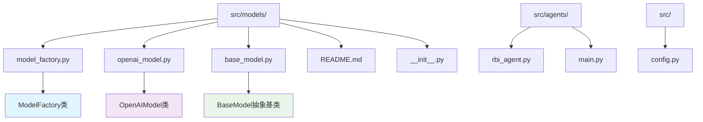
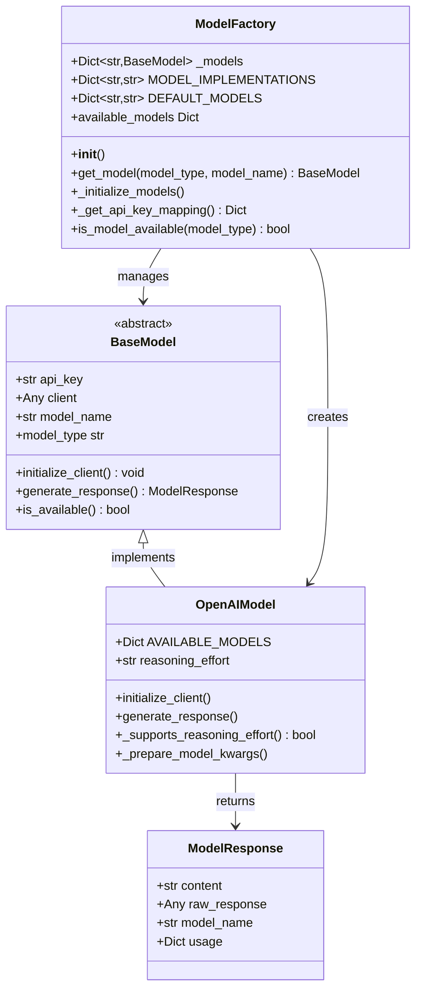
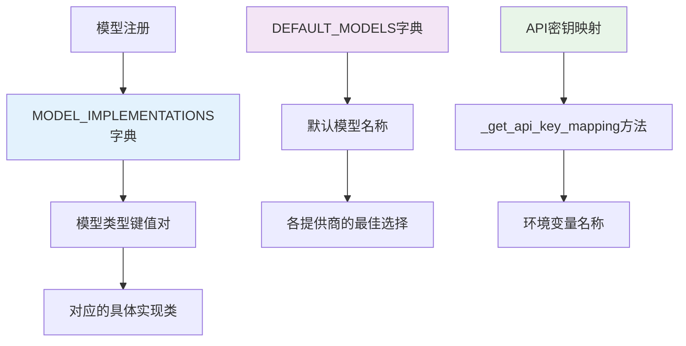
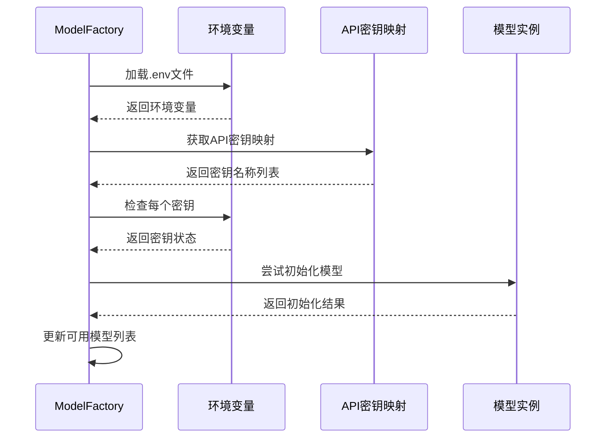
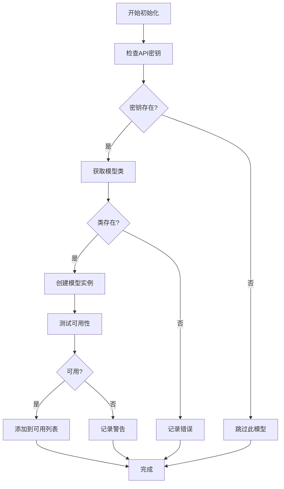
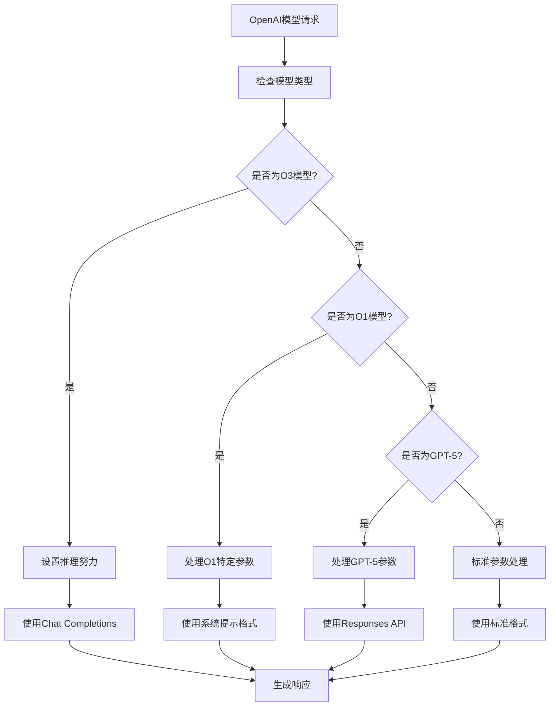
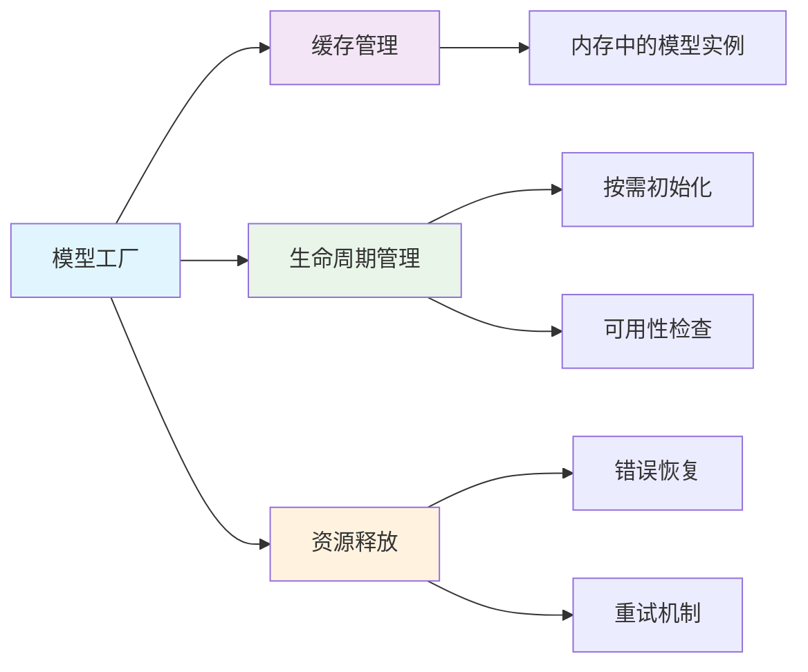
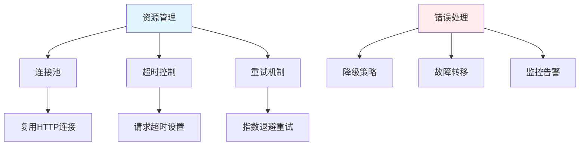
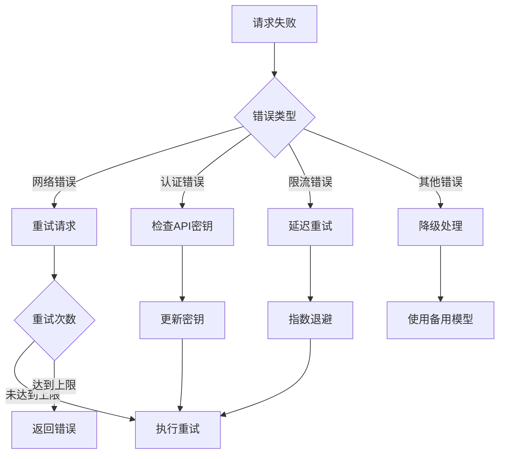

# 模型工厂集成

<cite>
**本文档引用的文件**
- [model_factory.py](file://src/models/model_factory.py)
- [openai_model.py](file://src/models/openai_model.py)
- [base_model.py](file://src/models/base_model.py)
- [config.py](file://src/config.py)
- [__init__.py](file://src/models/__init__.py)
- [README.md](file://src/models/README.md)
- [rbi_agent.py](file://src/agents/rbi_agent.py)
- [main.py](file://src/main.py)
</cite>

## 目录
1. [简介](#简介)
2. [项目结构](#项目结构)
3. [核心组件](#核心组件)
4. [架构概览](#架构概览)
5. [详细组件分析](#详细组件分析)
6. [配置管理](#配置管理)
7. [使用示例](#使用示例)
8. [性能考虑](#性能考虑)
9. [故障排除指南](#故障排除指南)
10. [结论](#结论)

## 简介

Moon Dev的模型工厂是一个统一的AI模型管理框架，为多种AI提供商（OpenAI、Claude、Groq、Gemini等）提供了标准化的接口。该系统通过工厂模式实现了模型的注册、初始化、管理和动态切换，支持配置文件驱动的环境变量管理，并提供了完整的错误处理和调试功能。

## 项目结构

模型工厂相关的核心文件组织如下：



**图表来源**
- [model_factory.py](file://src/models/model_factory.py#L1-L261)
- [openai_model.py](file://src/models/openai_model.py#L1-L441)
- [base_model.py](file://src/models/base_model.py#L1-L73)

**章节来源**
- [model_factory.py](file://src/models/model_factory.py#L1-L50)
- [README.md](file://src/models/README.md#L1-L30)

## 核心组件

### ModelFactory 类

ModelFactory是整个模型管理系统的核心，负责：
- 模型类型映射和默认配置
- 环境变量加载和验证
- 模型实例的初始化和管理
- 动态模型获取和切换

### OpenAIModel 实现

OpenAI模型的具体实现包含：
- 支持的模型列表和定价信息
- 特殊参数处理（推理努力、温度等）
- 多种API调用方式（Chat Completions、Responses API）
- 错误恢复和重试机制

### BaseModel 抽象基类

定义了所有AI模型的通用接口：
- 初始化客户端的方法
- 生成响应的标准流程
- 可用性检查机制
- 模型类型标识

**章节来源**
- [model_factory.py](file://src/models/model_factory.py#L23-L53)
- [openai_model.py](file://src/models/openai_model.py#L10-L50)
- [base_model.py](file://src/models/base_model.py#L20-L40)

## 架构概览

模型工厂采用工厂模式和单例模式相结合的设计：



**图表来源**
- [model_factory.py](file://src/models/model_factory.py#L23-L261)
- [base_model.py](file://src/models/base_model.py#L15-L73)
- [openai_model.py](file://src/models/openai_model.py#L10-L100)

## 详细组件分析

### 模型注册机制

模型工厂通过静态字典映射实现了模型类型的注册：



**图表来源**
- [model_factory.py](file://src/models/model_factory.py#L25-L45)

### 配置加载流程

环境变量的加载遵循严格的优先级顺序：



**图表来源**
- [model_factory.py](file://src/models/model_factory.py#L51-L120)

### 实例化过程

模型实例化包含多层验证和错误处理：



**图表来源**
- [model_factory.py](file://src/models/model_factory.py#L80-L120)

**章节来源**
- [model_factory.py](file://src/models/model_factory.py#L51-L144)

### OpenAI模型特殊处理

OpenAI模型实现了复杂的参数处理逻辑：



**图表来源**
- [openai_model.py](file://src/models/openai_model.py#L100-L200)

**章节来源**
- [openai_model.py](file://src/models/openai_model.py#L100-L300)

## 配置管理

### 环境变量配置

模型工厂通过`.env`文件管理API密钥：

| 环境变量 | 描述 | 示例值 |
|---------|------|--------|
| `ANTHROPIC_KEY` | Claude API密钥 | `sk-ant-xxx` |
| `GROQ_API_KEY` | Groq API密钥 | `gsk_xxx` |
| `OPENAI_KEY` | OpenAI API密钥 | `sk-xxx` |
| `GEMINI_KEY` | Gemini API密钥 | `AIzaSyxxx` |
| `DEEPSEEK_KEY` | DeepSeek API密钥 | `sk-xxx` |
| `GROK_API_KEY` | xAI Grok API密钥 | `gsk_xxx` |
| `OPENROUTER_API_KEY` | OpenRouter API密钥 | `sk-or-xxx` |

### 配置优先级

1. **环境变量**：最高优先级，从`.env`文件加载
2. **默认模型**：每个提供商的推荐模型
3. **运行时指定**：动态指定的模型名称

### 多模型管理策略



**图表来源**
- [model_factory.py](file://src/models/model_factory.py#L165-L218)

**章节来源**
- [model_factory.py](file://src/models/model_factory.py#L51-L144)
- [config.py](file://src/config.py#L1-L50)

## 使用示例

### 基本使用模式

```python
# 导入模型工厂
from src.models import model_factory

# 获取OpenAI模型实例
model = model_factory.get_model("openai", "gpt-4o")

# 生成响应
response = model.generate_response(
    system_prompt="你是一个有用的AI助手。",
    user_content="你好！",
    temperature=0.7,
    max_tokens=1024
)

print(response.content)
```

### 在代理中使用

```python
# 在RBI代理中使用模型
def chat_with_model(system_prompt, user_content, model_config):
    try:
        # 使用模型工厂获取模型
        model = model_factory.get_model(model_config["type"], model_config["name"])
        
        # 生成响应
        response = model.generate_response(
            system_prompt=system_prompt,
            user_content=user_content,
            temperature=AI_TEMPERATURE,
            max_tokens=AI_MAX_TOKENS
        )
        
        return response.content
    except Exception as e:
        print(f"模型调用失败: {e}")
        return None
```

### 动态模型切换

```python
# 运行时切换模型
def switch_model(provider, model_name):
    global current_model
    
    # 获取新模型
    new_model = model_factory.get_model(provider, model_name)
    if new_model:
        current_model = new_model
        print(f"已切换到 {provider} 的 {model_name}")
    else:
        print(f"无法初始化 {provider} 的 {model_name}")
```

**章节来源**
- [README.md](file://src/models/README.md#L100-L133)
- [rbi_agent.py](file://src/agents/rbi_agent.py#L416-L450)

## 性能考虑

### 缓存策略

模型工厂实现了智能缓存机制：
- **内存缓存**：已初始化的模型实例保留在内存中
- **懒加载**：仅在需要时初始化模型
- **可用性检查**：定期验证模型可用性

### 资源管理



### 并发处理

模型工厂支持并发访问：
- **线程安全**：使用适当的锁机制
- **异步支持**：可扩展为异步操作
- **资源限制**：防止资源耗尽

## 故障排除指南

### 常见问题及解决方案

| 问题 | 可能原因 | 解决方案 |
|------|----------|----------|
| 模型初始化失败 | API密钥无效 | 检查.env文件中的密钥 |
| 请求超时 | 网络连接问题 | 检查网络连接，增加超时时间 |
| 429错误 | 请求频率过高 | 实现请求限流机制 |
| 模型不可用 | 服务端维护 | 检查服务状态，等待恢复 |

### 调试技巧

```python
# 启用详细日志
import logging
logging.basicConfig(level=logging.DEBUG)

# 检查可用模型
print("可用模型:", model_factory.available_models)

# 测试模型可用性
if model_factory.is_model_available("openai"):
    print("OpenAI模型可用")
else:
    print("OpenAI模型不可用")
```

### 错误恢复机制



**章节来源**
- [model_factory.py](file://src/models/model_factory.py#L101-L121)
- [openai_model.py](file://src/models/openai_model.py#L400-L441)

## 结论

Moon Dev的模型工厂集成提供了一个强大而灵活的AI模型管理框架。通过统一的接口、智能的配置管理、完善的错误处理和优化的性能特性，该系统能够有效地支持多种AI提供商的集成需求。

主要优势包括：
- **统一接口**：所有模型提供者使用相同的调用方式
- **自动配置**：基于环境变量的自动化配置
- **智能缓存**：高效的模型实例管理
- **健壮性**：完善的错误处理和恢复机制
- **可扩展性**：易于添加新的模型提供商

该系统为构建复杂的AI驱动应用提供了坚实的基础，特别适合需要在多个AI服务之间灵活切换的应用场景。