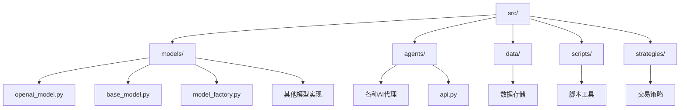
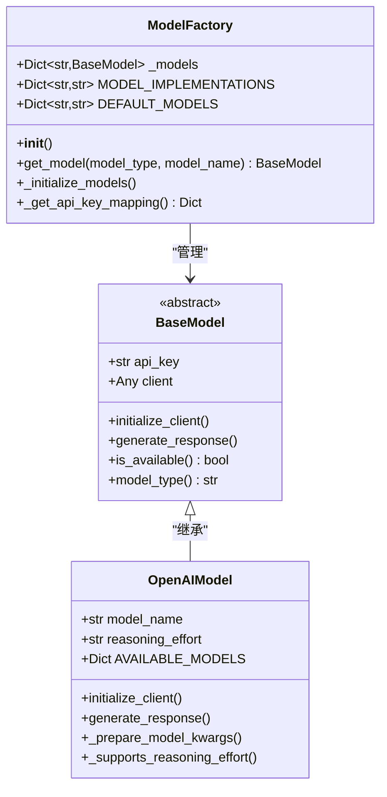
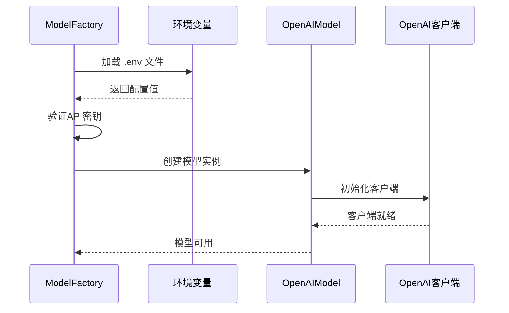
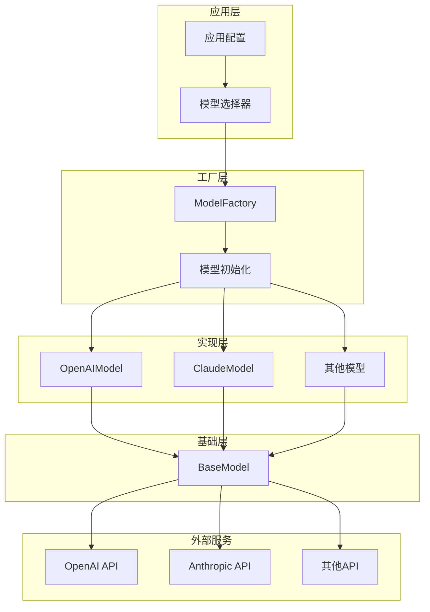
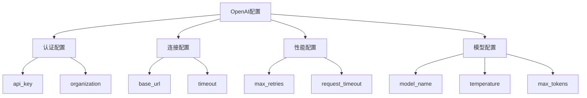
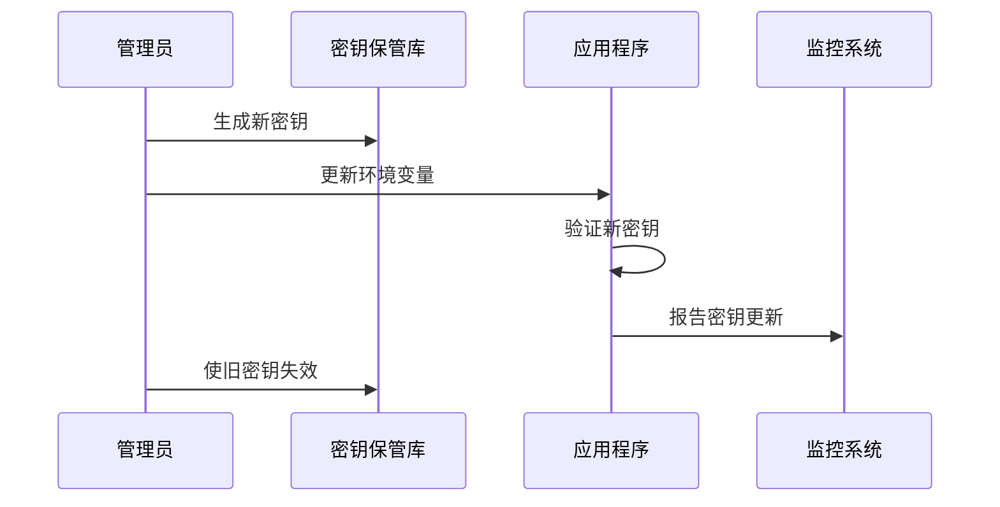
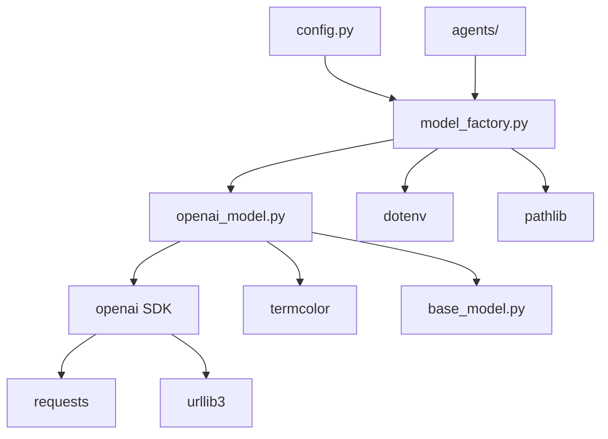
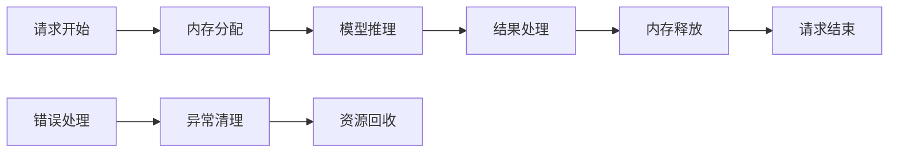

# 配置选项

<cite>
**本文档中引用的文件**
- [openai_model.py](file://src/models/openai_model.py)
- [base_model.py](file://src/models/base_model.py)
- [model_factory.py](file://src/models/model_factory.py)
- [config.py](file://src/config.py)
- [api.py](file://src/agents/api.py)
- [requirements.txt](file://requirements.txt)
</cite>

## 目录
1. [简介](#简介)
2. [项目结构概览](#项目结构概览)
3. [核心配置组件](#核心配置组件)
4. [架构概览](#架构概览)
5. [详细配置分析](#详细配置分析)
6. [依赖关系分析](#依赖关系分析)
7. [性能考虑](#性能考虑)
8. [故障排除指南](#故障排除指南)
9. [结论](#结论)

## 简介

本文档全面介绍了Moon Dev AI Agents项目中OpenAI模型的所有配置选项。该项目是一个复杂的AI代理系统，支持多种AI模型提供商，包括OpenAI、Claude、Groq等。本文档重点分析OpenAI模型的配置参数，涵盖认证、连接、性能优化等关键方面，并提供实际应用场景中的配置示例和安全最佳实践。

## 项目结构概览

Moon Dev AI Agents项目采用模块化架构，主要包含以下核心目录：



**图表来源**
- [openai_model.py](file://src/models/openai_model.py#L1-L50)
- [base_model.py](file://src/models/base_model.py#L1-L30)
- [model_factory.py](file://src/models/model_factory.py#L1-L40)

**章节来源**
- [openai_model.py](file://src/models/openai_model.py#L1-L441)
- [base_model.py](file://src/models/base_model.py#L1-L73)
- [model_factory.py](file://src/models/model_factory.py#L1-L261)

## 核心配置组件

### 模型工厂架构

项目采用工厂模式管理所有AI模型，提供统一的配置接口：



**图表来源**
- [model_factory.py](file://src/models/model_factory.py#L20-L60)
- [base_model.py](file://src/models/base_model.py#L20-L40)
- [openai_model.py](file://src/models/openai_model.py#L10-L50)

### 环境变量管理系统

项目通过环境变量管理系统API密钥和配置参数：



**图表来源**
- [model_factory.py](file://src/models/model_factory.py#L50-L80)
- [openai_model.py](file://src/models/openai_model.py#L60-L80)

**章节来源**
- [model_factory.py](file://src/models/model_factory.py#L50-L120)
- [openai_model.py](file://src/models/openai_model.py#L60-L90)

## 架构概览

### 配置层次结构

项目采用分层配置架构，从底层到顶层依次为：

1. **基础模型层**：定义通用接口和行为
2. **模型实现层**：特定于各个AI提供商的实现
3. **工厂管理层**：统一管理和初始化所有模型
4. **应用配置层**：应用程序级别的配置设置



**图表来源**
- [model_factory.py](file://src/models/model_factory.py#L20-L40)
- [base_model.py](file://src/models/base_model.py#L20-L30)
- [openai_model.py](file://src/models/openai_model.py#L10-L30)

## 详细配置分析

### OpenAI模型配置参数

#### 基础配置参数

OpenAI模型的核心配置参数包括：

| 参数名称 | 类型 | 默认值 | 描述 | 必需 |
|---------|------|--------|------|------|
| `api_key` | str | - | OpenAI API密钥 | 是 |
| `model_name` | str | "o1-mini" | 使用的模型名称 | 否 |
| `reasoning_effort` | str | "medium" | 推理努力级别（仅适用于O3模型） | 否 |

#### 高级配置参数



**图表来源**
- [openai_model.py](file://src/models/openai_model.py#L50-L100)
- [model_factory.py](file://src/models/model_factory.py#L200-L230)

#### 认证相关配置

**api_key**：这是最重要的认证参数，用于验证API请求的身份。项目通过环境变量加载API密钥：

- **获取方式**：从OpenAI平台获取
- **格式要求**：以"sk-"开头的有效密钥
- **安全性**：建议使用环境变量而非硬编码

**organization**：可选的组织标识符，用于多租户部署：

- **用途**：区分不同组织的资源使用
- **权限**：需要相应的组织访问权限
- **配置**：可通过环境变量或直接传入

#### 连接相关配置

**base_url**：自定义API端点URL：

- **默认值**：`https://api.openai.com/v1`
- **用途**：支持代理服务器或自定义端点
- **配置方法**：通过环境变量或直接传入

**timeout**：请求超时设置：

- **类型**：整数或浮点数
- **单位**：秒
- **默认值**：通常为60秒
- **影响**：影响请求的响应时间

#### 性能相关配置

**max_retries**：最大重试次数：

- **默认值**：3次
- **用途**：处理临时性网络错误
- **策略**：指数退避算法

**request_timeout**：请求超时时间：

- **默认值**：60秒
- **配置范围**：可根据网络条件调整
- **影响**：影响用户体验和系统稳定性

**章节来源**
- [openai_model.py](file://src/models/openai_model.py#L50-L150)
- [model_factory.py](file://src/models/model_factory.py#L100-L150)

### 不同场景下的配置示例

#### 使用代理服务器配置

```python
# 代理服务器配置示例
proxy_config = {
    "base_url": "https://api.openai.com/v1",
    "timeout": 30,
    "max_retries": 5,
    "proxies": {
        "http": "http://proxy.example.com:8080",
        "https": "https://proxy.example.com:8080"
    }
}
```

#### 自定义API端点配置

```python
# 自定义端点配置
custom_endpoint_config = {
    "base_url": "https://custom-endpoint.company.com/v1",
    "api_key": os.getenv("CUSTOM_OPENAI_KEY"),
    "timeout": 45,
    "max_retries": 3
}
```

#### 多租户部署配置

```python
# 多租户配置示例
tenant_configs = {
    "tenant_a": {
        "api_key": os.getenv("TENANT_A_OPENAI_KEY"),
        "organization": "org_tenant_a",
        "base_url": "https://api.openai.com/v1"
    },
    "tenant_b": {
        "api_key": os.getenv("TENANT_B_OPENAI_KEY"),
        "organization": "org_tenant_b",
        "base_url": "https://api.openai.com/v1"
    }
}
```

### 安全最佳实践

#### 环境变量管理

项目推荐使用环境变量来管理敏感信息：

```python
# 推荐的环境变量配置
import os
from dotenv import load_dotenv

# 加载环境变量
load_dotenv()

# 获取API密钥
openai_api_key = os.getenv("OPENAI_API_KEY")
organization_id = os.getenv("OPENAI_ORGANIZATION_ID")
```

#### 密钥轮换策略



**图表来源**
- [model_factory.py](file://src/models/model_factory.py#L60-L90)

#### 访问控制配置

```python
# 访问控制示例
access_control = {
    "allowed_ips": ["192.168.1.0/24", "10.0.0.0/8"],
    "rate_limits": {
        "requests_per_minute": 100,
        "burst_limit": 10
    },
    "model_access": {
        "gpt-4": ["admin", "premium_user"],
        "gpt-3.5-turbo": ["standard_user"]
    }
}
```

**章节来源**
- [model_factory.py](file://src/models/model_factory.py#L50-L100)
- [openai_model.py](file://src/models/openai_model.py#L100-L150)

## 依赖关系分析

### 核心依赖关系



**图表来源**
- [openai_model.py](file://src/models/openai_model.py#L1-L10)
- [model_factory.py](file://src/models/model_factory.py#L1-L20)

### 第三方依赖分析

项目的主要第三方依赖包括：

| 依赖包 | 版本 | 用途 | 关键功能 |
|--------|------|------|----------|
| openai | 2.6.1 | OpenAI API客户端 | 模型调用和管理 |
| python-dotenv | 1.0.0 | 环境变量管理 | 配置加载 |
| termcolor | 2.3.0 | 控制台颜色输出 | 调试和日志 |
| requests | 2.31.0 | HTTP请求 | API通信 |

**章节来源**
- [requirements.txt](file://requirements.txt#L1-L50)
- [openai_model.py](file://src/models/openai_model.py#L1-L15)

## 性能考虑

### 模型性能优化

项目实现了多种性能优化策略：

1. **连接池管理**：复用HTTP连接减少开销
2. **请求缓存**：避免重复请求相同内容
3. **异步处理**：支持并发请求处理
4. **智能重试**：指数退避算法减少服务器压力

### 内存管理



**图表来源**
- [openai_model.py](file://src/models/openai_model.py#L200-L250)

### 并发处理配置

项目支持多种并发处理模式：

- **同步模式**：单线程处理，适合简单任务
- **异步模式**：多协程处理，适合高并发场景
- **批处理模式**：批量处理多个请求，提高吞吐量

## 故障排除指南

### 常见配置问题

#### API密钥问题

```python
# 错误示例
try:
    model = OpenAIModel(api_key="invalid_key")
except Exception as e:
    print(f"API密钥错误: {e}")

# 正确示例
api_key = os.getenv("OPENAI_API_KEY")
if not api_key:
    raise ValueError("OPENAI_API_KEY未设置")
model = OpenAIModel(api_key=api_key)
```

#### 连接超时问题

```python
# 超时配置示例
connection_config = {
    "timeout": 30,  # 30秒超时
    "max_retries": 3,
    "request_timeout": 60  # 请求超时60秒
}
```

#### 模型不可用问题

```python
# 可用性检查
def check_model_availability(model):
    if not model.is_available():
        print(f"模型 {model.model_name} 不可用")
        return False
    return True
```

**章节来源**
- [openai_model.py](file://src/models/openai_model.py#L300-L400)
- [model_factory.py](file://src/models/model_factory.py#L150-L200)

### 调试和监控

项目提供了丰富的调试功能：

```python
# 调试配置示例
debug_config = {
    "log_level": "DEBUG",
    "enable_tracebacks": True,
    "metrics_collection": True
}
```

## 结论

Moon Dev AI Agents项目的OpenAI模型配置系统提供了完整而灵活的配置管理方案。通过模块化的架构设计，项目成功地抽象了不同AI提供商的差异，同时保持了配置的一致性和易用性。

### 主要优势

1. **统一接口**：所有模型都遵循相同的接口规范
2. **灵活配置**：支持多种配置方式和场景
3. **安全可靠**：内置安全机制和错误处理
4. **易于扩展**：模块化设计便于添加新的模型提供商

### 最佳实践建议

1. **环境变量管理**：始终使用环境变量存储敏感信息
2. **配置验证**：在启动时验证所有配置参数
3. **错误处理**：实现完善的错误处理和恢复机制
4. **监控告警**：建立配置变更的监控和告警机制

通过遵循本文档提供的配置指南和最佳实践，开发者可以充分利用OpenAI模型的强大功能，同时确保系统的稳定性和安全性。