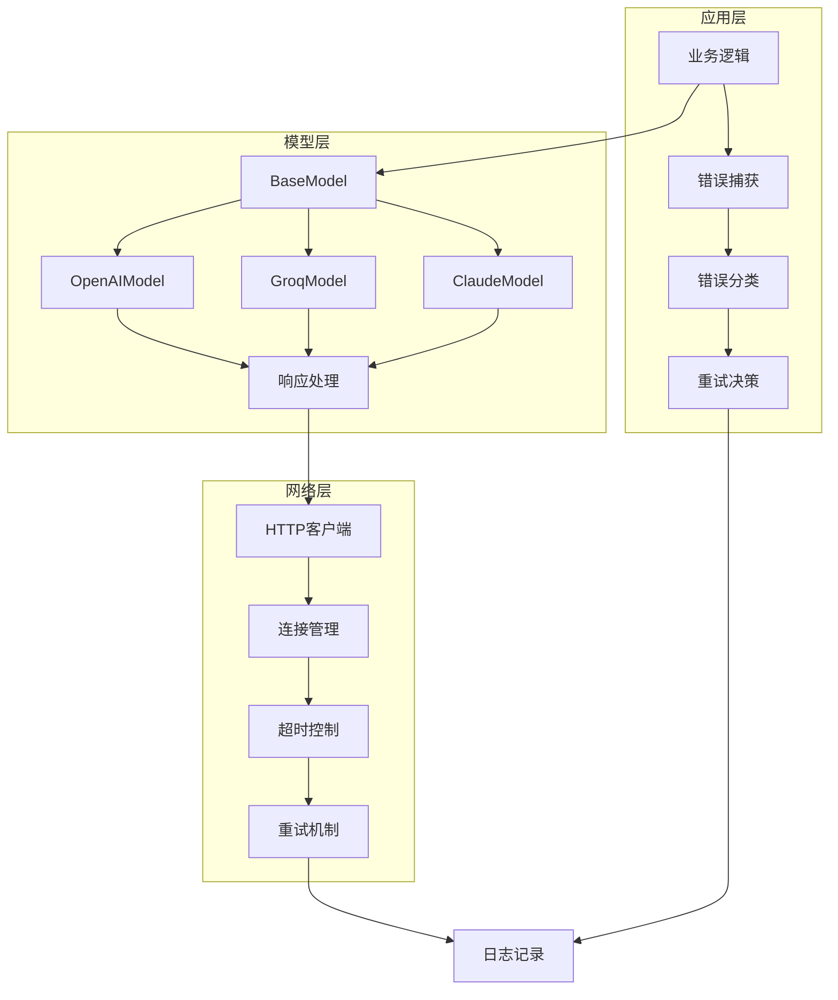
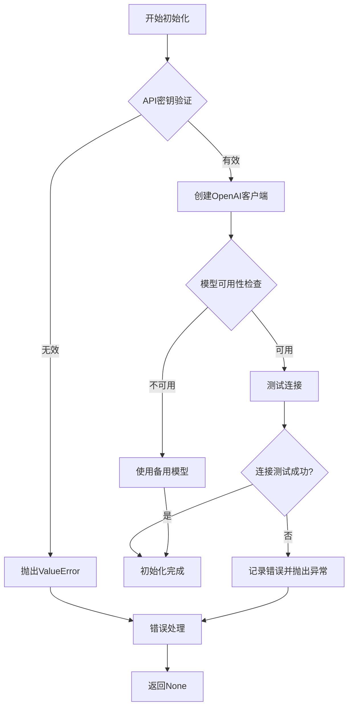
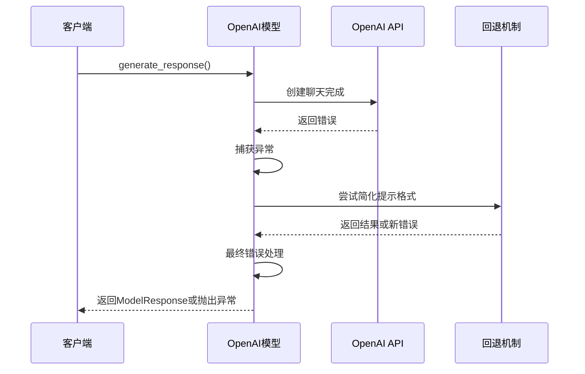
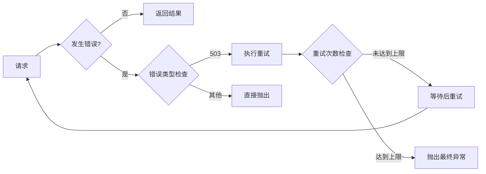
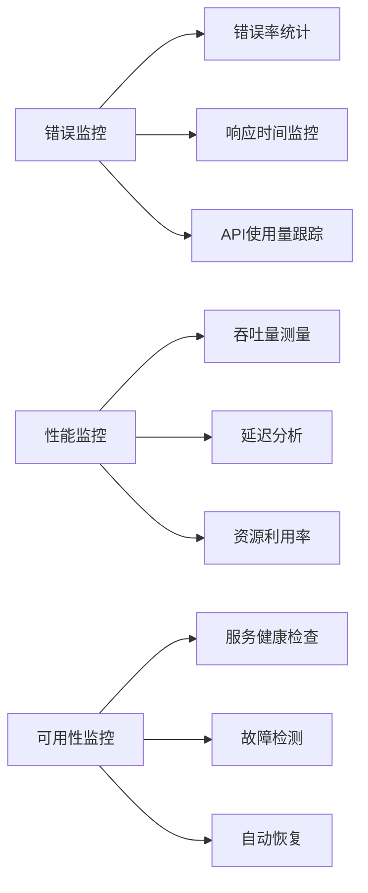
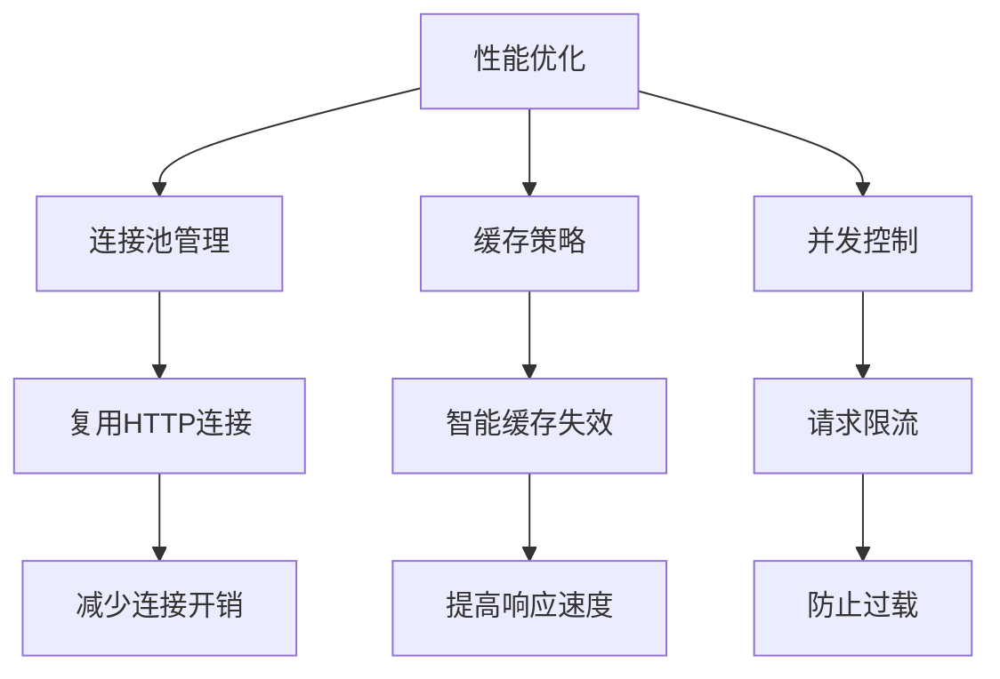
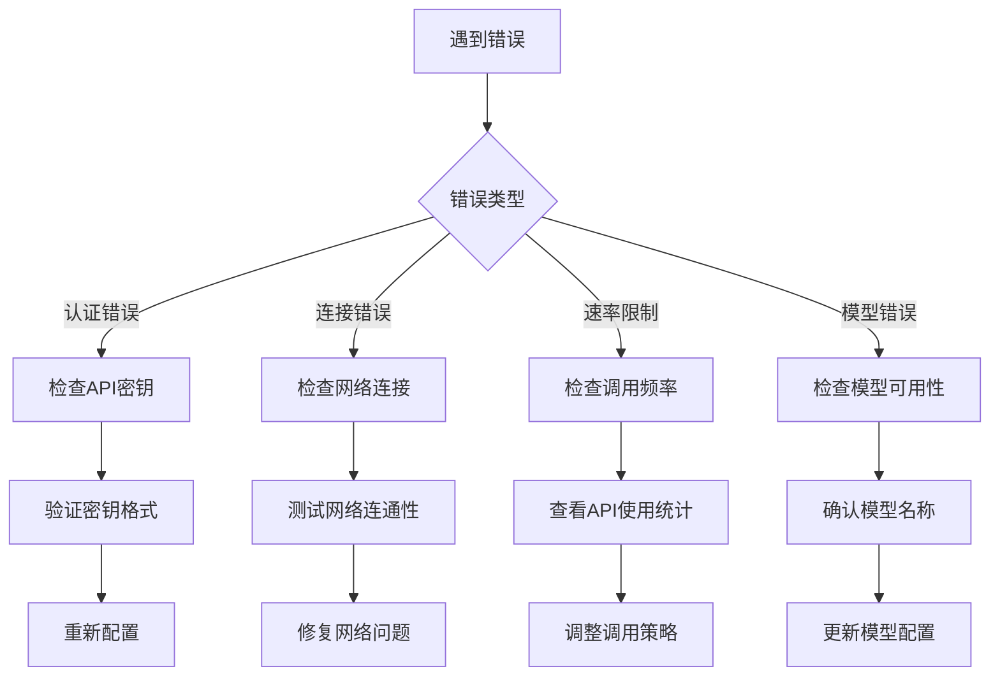

# 错误处理机制详细文档

<cite>
**本文档引用的文件**
- [openai_model.py](file://src/models/openai_model.py)
- [base_model.py](file://src/models/base_model.py)
- [groq_model.py](file://src/models/groq_model.py)
- [claude_model.py](file://src/models/claude_model.py)
- [model_factory.py](file://src/models/model_factory.py)
- [config.py](file://src/config.py)
- [api.py](file://src/agents/api.py)
- [coingecko_agent.py](file://src/agents/coingecko_agent.py)
</cite>

## 目录
1. [概述](#概述)
2. [错误处理架构](#错误处理架构)
3. [OpenAI模型错误处理](#openai模型错误处理)
4. [重试机制与指数退避](#重试机制与指数退避)
5. [常见异常类型](#常见异常类型)
6. [监控与日志记录](#监控与日志记录)
7. [最佳实践指南](#最佳实践指南)
8. [故障排除](#故障排除)

## 概述

Moon Dev AI Agents系统实现了多层次的错误处理机制，确保在面对各种网络问题、API限制和系统故障时能够优雅地恢复和继续运行。该系统特别针对AI模型服务的特性进行了优化，包括认证失败、连接超时、配额耗尽和模型不可用等情况。

## 错误处理架构

系统采用分层错误处理架构，从底层的网络连接到顶层的应用逻辑都有相应的错误处理策略。



**图表来源**
- [base_model.py](file://src/models/base_model.py#L20-L73)
- [openai_model.py](file://src/models/openai_model.py#L1-L441)

**章节来源**
- [base_model.py](file://src/models/base_model.py#L1-L73)
- [openai_model.py](file://src/models/openai_model.py#L1-L441)

## OpenAI模型错误处理

OpenAI模型实现是最复杂的错误处理示例，包含了多种故障场景的处理策略。

### 初始化阶段错误处理

初始化过程中的错误处理包括API密钥验证、模型可用性检查和客户端配置验证。



**图表来源**
- [openai_model.py](file://src/models/openai_model.py#L75-L95)

### 响应生成错误处理

响应生成过程中的错误处理采用了多层回退机制。



**图表来源**
- [openai_model.py](file://src/models/openai_model.py#L150-L350)

**章节来源**
- [openai_model.py](file://src/models/openai_model.py#L75-L441)

## 重试机制与指数退避

系统实现了智能的重试机制，结合指数退避算法来处理临时性故障。

### 基础模型重试策略

基础模型类提供了基本的重试机制，主要针对503服务不可用错误。



**图表来源**
- [base_model.py](file://src/models/base_model.py#L35-L55)

### Groq模型重试配置

Groq模型实现了更精细的重试策略，包括详细的错误分类和用户友好的错误消息。

| 错误类型 | 处理策略 | 重试次数 | 等待时间 |
|---------|---------|---------|---------|
| API密钥错误 | 提示用户检查密钥 | 0次 | 不重试 |
| 模型名称错误 | 显示可用模型列表 | 0次 | 不重试 |
| 连接超时 | 自动重试 | 3次 | 指数退避 |
| 服务不可用 | 自动重试 | 3次 | 指数退避 |
| 其他错误 | 记录详细信息 | 3次 | 指数退避 |

**章节来源**
- [groq_model.py](file://src/models/groq_model.py#L150-L200)

## 常见异常类型

系统识别并处理以下主要异常类型：

### 认证错误 (AuthenticationError)

```python
# 示例：API密钥验证失败
try:
    client = OpenAI(api_key=invalid_key)
except Exception as e:
    if "401" in str(e) or "authentication" in str(e).lower():
        # 处理认证错误
        print("API密钥无效，请检查您的配置")
```

### 连接错误 (APIConnectionError)

```python
# 示例：网络连接问题
try:
    response = requests.post(url, timeout=30)
except requests.exceptions.ConnectionError:
    # 处理连接错误
    print("无法连接到API服务器，请检查网络连接")
```

### 速率限制错误 (RateLimitError)

```python
# 示例：API调用频率过高
try:
    response = client.chat.completions.create(...)
except Exception as e:
    if "429" in str(e) or "rate_limit" in str(e).lower():
        # 处理速率限制
        print("超出API调用限制，正在等待重试...")
        time.sleep(60)  # 等待1分钟
```

### 配额耗尽错误

```python
# 示例：账户配额不足
try:
    response = client.chat.completions.create(...)
except Exception as e:
    if "insufficient" in str(e).lower() or "quota" in str(e).lower():
        # 处理配额问题
        print("账户配额已耗尽，请充值或升级账户")
```

**章节来源**
- [openai_model.py](file://src/models/openai_model.py#L350-L441)
- [groq_model.py](file://src/models/groq_model.py#L150-L200)

## 监控与日志记录

系统实现了全面的监控和日志记录机制，帮助开发者快速诊断问题。

### 日志级别和颜色编码

| 错误级别 | 颜色 | 用途 |
|---------|------|------|
| 成功 | 绿色 | 正常操作确认 |
| 警告 | 黄色 | 可恢复的问题 |
| 严重错误 | 红色 | 需要立即关注的问题 |
| 调试信息 | 青色 | 开发调试信息 |

### 关键监控指标



### 错误报告模板

系统使用结构化的错误报告格式：

```
❌ OpenAI generation error (Moon Dev full dump) 🚨: {error_repr}
🔎 type={error_type}
🔎 status_code={status_code}
🔎 request_id={request_id}
🔎 code={error_code}
🔎 param={error_param}
```

**章节来源**
- [openai_model.py](file://src/models/openai_model.py#L350-L441)
- [groq_model.py](file://src/models/groq_model.py#L150-L200)

## 最佳实践指南

### 错误处理最佳实践

1. **渐进式降级策略**
   - 优先尝试高级功能
   - 降级到基础功能
   - 最终使用默认响应

2. **智能重试机制**
   - 区分可重试和不可重试错误
   - 使用指数退避算法
   - 设置合理的最大重试次数

3. **用户友好的错误消息**
   - 避免技术术语
   - 提供具体的解决建议
   - 显示相关配置信息

### 性能优化建议



### 安全考虑

1. **API密钥保护**
   - 不在日志中记录完整密钥
   - 使用环境变量存储敏感信息
   - 实现密钥轮换机制

2. **输入验证**
   - 验证所有外部输入
   - 防止注入攻击
   - 限制输入大小

**章节来源**
- [model_factory.py](file://src/models/model_factory.py#L50-L100)
- [config.py](file://src/config.py#L1-L136)

## 故障排除

### 常见问题诊断流程



### 调试工具和技巧

1. **启用详细日志**
   ```python
   import logging
   logging.basicConfig(level=logging.DEBUG)
   ```

2. **使用环境变量**
   ```bash
   export DEBUG_ERRORS=true
   ```

3. **监控API使用情况**
   - 定期检查API调用统计
   - 监控错误率变化
   - 分析错误模式

### 故障恢复步骤

1. **立即响应**
   - 停止受影响的操作
   - 记录错误详情
   - 通知相关人员

2. **问题分析**
   - 查看错误日志
   - 分析错误模式
   - 确定根本原因

3. **解决方案实施**
   - 应用临时修复
   - 实施长期解决方案
   - 验证修复效果

**章节来源**
- [coingecko_agent.py](file://src/agents/coingecko_agent.py#L416-L446)
- [api.py](file://src/agents/api.py#L92-L127)

## 结论

Moon Dev AI Agents系统的错误处理机制设计精良，涵盖了从底层网络连接到高层业务逻辑的各个层面。通过多层次的错误处理策略、智能的重试机制和完善的监控体系，系统能够在面对各种故障时保持稳定运行，并为开发者提供清晰的诊断信息。

关键优势包括：
- 渐进式降级策略确保服务连续性
- 智能重试机制避免临时性故障影响
- 详细的日志记录便于问题诊断
- 用户友好的错误消息提升用户体验

这套错误处理机制为构建可靠的AI代理系统提供了坚实的基础，值得在类似项目中借鉴和应用。