# 基础模型接口

<cite>
**本文档中引用的文件**
- [base_model.py](file://src/models/base_model.py)
- [__init__.py](file://src/models/__init__.py)
- [model_factory.py](file://src/models/model_factory.py)
- [openai_model.py](file://src/models/openai_model.py)
- [claude_model.py](file://src/models/claude_model.py)
- [deepseek_model.py](file://src/models/deepseek_model.py)
- [gemini_model.py](file://src/models/gemini_model.py)
- [ollama_model.py](file://src/models/ollama_model.py)
- [README.md](file://src/models/README.md)
</cite>

## 目录
1. [简介](#简介)
2. [项目结构概览](#项目结构概览)
3. [BaseModel抽象基类详解](#basemodel抽象基类详解)
4. [核心接口方法分析](#核心接口方法分析)
5. [ModelResponse数据结构](#modelresponse数据结构)
6. [具体模型实现示例](#具体模型实现示例)
7. [接口设计原则与考量](#接口设计原则与考量)
8. [错误处理与恢复机制](#错误处理与恢复机制)
9. [扩展性与版本管理](#扩展性与版本管理)
10. [最佳实践指南](#最佳实践指南)

## 简介

Moon Dev的AI代理系统采用统一的基础模型接口设计，为多种AI服务提供商（OpenAI、Claude、Gemini、DeepSeek等）提供了标准化的访问方式。该接口系统通过抽象基类BaseModel确保了不同模型实现之间的一致性和互操作性，同时保持了灵活性以适应各种模型特性和需求。

## 项目结构概览

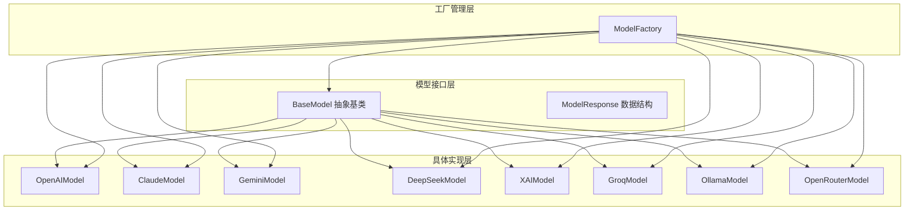

**图表来源**
- [base_model.py](file://src/models/base_model.py#L23-L73)
- [model_factory.py](file://src/models/model_factory.py#L25-L40)

**章节来源**
- [base_model.py](file://src/models/base_model.py#L1-L73)
- [__init__.py](file://src/models/__init__.py#L1-L23)

## BaseModel抽象基类详解

BaseModel是整个模型接口系统的核心抽象基类，定义了所有AI模型实现必须遵循的标准接口契约。

### 类结构设计

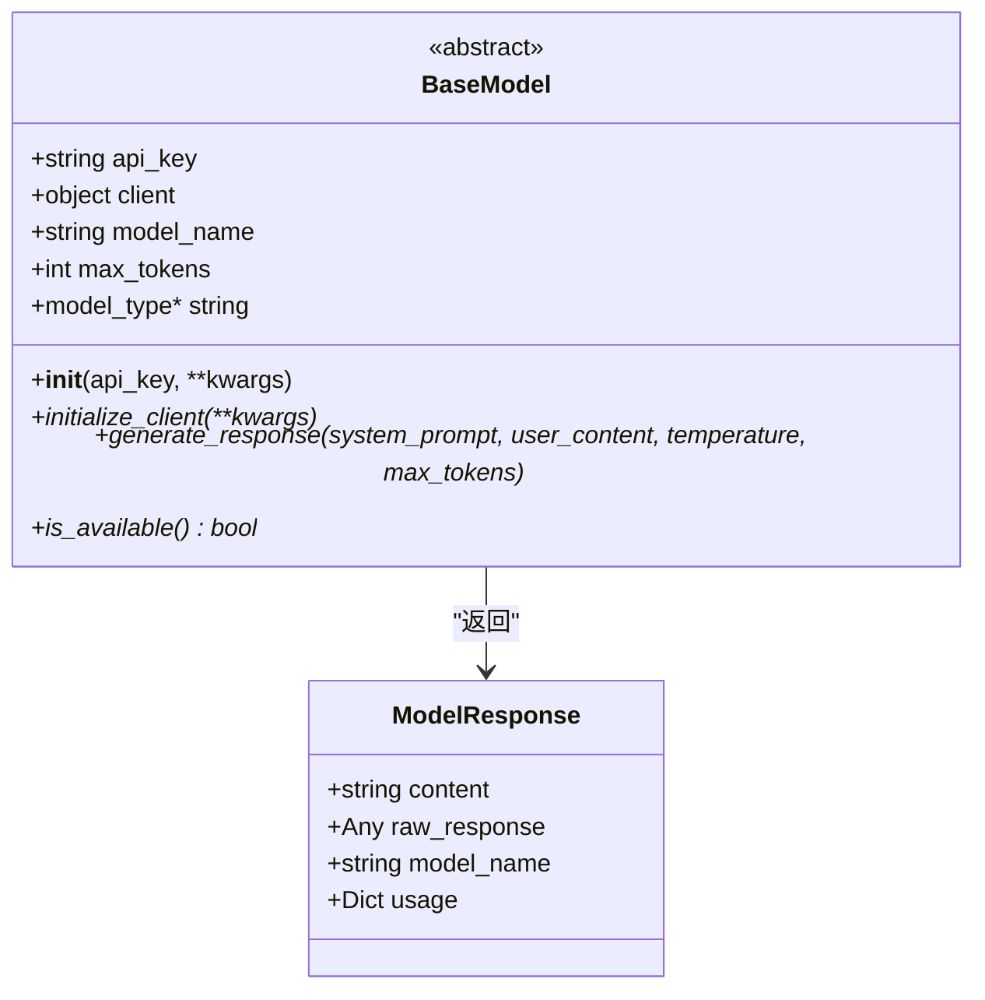

**图表来源**
- [base_model.py](file://src/models/base_model.py#L23-L73)

### 核心属性与初始化

BaseModel的初始化过程包含了以下关键步骤：

1. **API密钥验证**：确保传入的有效性
2. **客户端初始化**：调用抽象方法进行具体实现
3. **模型配置**：设置默认参数和限制

**章节来源**
- [base_model.py](file://src/models/base_model.py#L25-L32)

## 核心接口方法分析

### generate_response方法

generate_response是模型接口的核心方法，负责生成AI响应并处理缓存问题。

#### 方法签名与契约

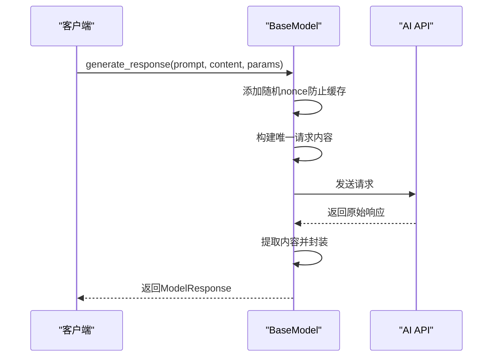

**图表来源**
- [base_model.py](file://src/models/base_model.py#L34-L51)

#### 缓存防护机制

系统实现了智能的缓存防护机制，通过添加随机nonce和时间戳确保每次请求都是唯一的：

- **随机nonce**：在用户内容末尾添加随机数
- **时间戳**：使用当前Unix时间戳
- **系统提示增强**：为系统提示也添加时间戳

**章节来源**
- [base_model.py](file://src/models/base_model.py#L34-L51)

### is_available方法

每个模型实现都必须提供可用性检查功能：

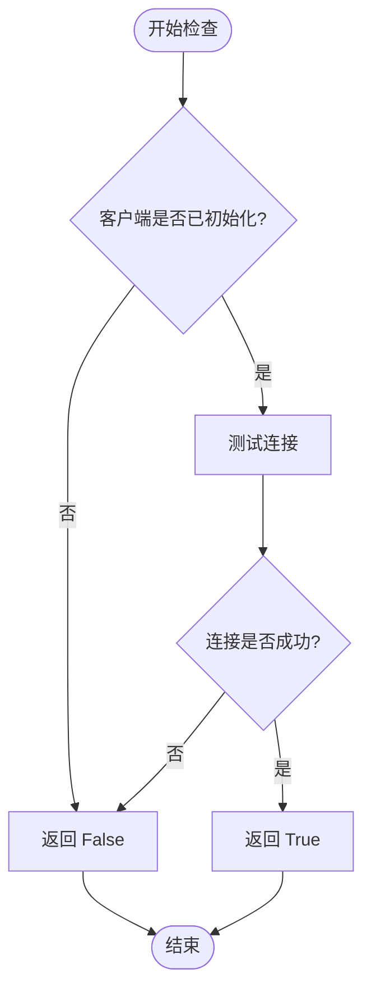

**图表来源**
- [base_model.py](file://src/models/base_model.py#L53-L55)

### model_type属性

model_type属性提供模型类型的标准化标识符，用于工厂模式中的模型选择和管理。

**章节来源**
- [base_model.py](file://src/models/base_model.py#L57-L59)

## ModelResponse数据结构

ModelResponse是标准化的响应数据结构，确保所有模型返回的数据格式一致。

### 数据结构定义

| 字段名 | 类型 | 描述 | 必需性 |
|--------|------|------|--------|
| content | string | 模型生成的文本内容 | 必需 |
| raw_response | Any | 原始API响应对象 | 必需 |
| model_name | string | 使用的模型名称 | 必需 |
| usage | Dict | 使用统计信息 | 可选 |

### 设计考量

1. **内容提取**：从复杂的API响应中提取纯文本内容
2. **元数据保留**：保存原始响应以便调试和高级使用
3. **模型标识**：记录使用的具体模型便于追踪
4. **使用统计**：提供token使用情况等统计信息

**章节来源**
- [base_model.py](file://src/models/base_model.py#L15-L21)

## 具体模型实现示例

### OpenAI模型实现

OpenAI模型实现展示了如何处理复杂模型特性和API差异：

#### 特色功能处理

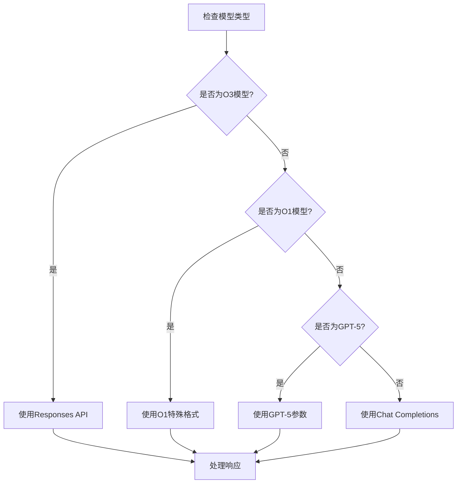

**图表来源**
- [openai_model.py](file://src/models/openai_model.py#L120-L200)

#### 错误处理策略

OpenAI实现采用了多层次的错误处理策略：

1. **API级错误**：捕获HTTP状态码和错误消息
2. **内容验证**：确保返回内容不为空
3. **降级机制**：在主要API失败时尝试备用方案
4. **重试逻辑**：对临时性错误实施指数退避重试

**章节来源**
- [openai_model.py](file://src/models/openai_model.py#L380-L440)

### Claude模型实现

Claude模型实现体现了简洁而有效的接口设计：

#### 标准化流程

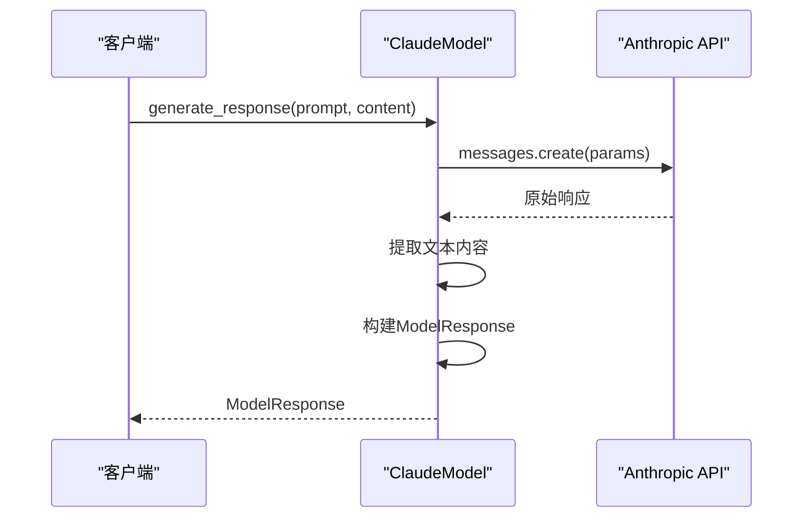

**图表来源**
- [claude_model.py](file://src/models/claude_model.py#L35-L55)

**章节来源**
- [claude_model.py](file://src/models/claude_model.py#L35-L55)

### DeepSeek模型实现

DeepSeek实现展示了如何处理第三方API的兼容性：

#### 参数映射与转换

DeepSeek模型需要将标准参数映射到其特定的API格式，确保与其他模型的接口一致性。

**章节来源**
- [deepseek_model.py](file://src/models/deepseek_model.py#L35-L55)

### Ollama本地模型实现

Ollama实现展示了如何集成本地运行的模型：

#### 本地连接管理

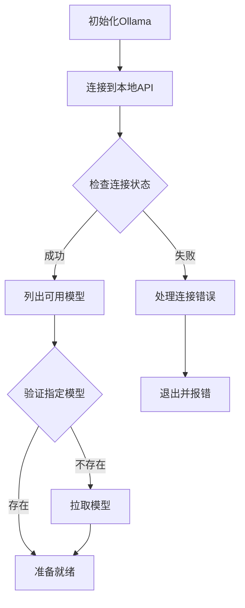

**图表来源**
- [ollama_model.py](file://src/models/ollama_model.py#L35-L65)

**章节来源**
- [ollama_model.py](file://src/models/ollama_model.py#L35-L65)

## 接口设计原则与考量

### 统一性原则

基础模型接口遵循以下统一性设计原则：

1. **方法签名一致性**：所有模型实现都使用相同的参数列表
2. **返回值标准化**：统一使用ModelResponse格式
3. **错误处理模式**：采用相似的错误处理和恢复策略
4. **配置管理**：通过构造函数和环境变量进行配置

### 异步支持考量

虽然当前接口主要是同步的，但设计考虑了未来异步支持的可能性：

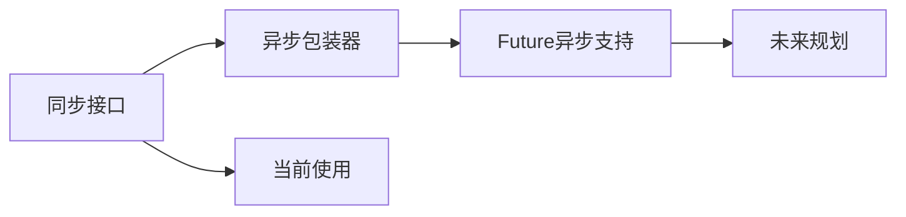

### 流式响应处理

接口设计预留了流式响应处理的空间，虽然目前主要处理完整响应：

1. **流式检测**：识别支持流式响应的模型
2. **增量处理**：逐步构建最终响应内容
3. **实时反馈**：为用户提供进度指示

### 元数据传递机制

系统通过多个层次传递元数据：

1. **ModelResponse.usage**：token使用统计
2. **原始响应对象**：完整的API响应信息
3. **日志输出**：详细的执行过程记录

**章节来源**
- [base_model.py](file://src/models/base_model.py#L15-L21)

## 错误处理与恢复机制

### 分层错误处理

系统实现了分层的错误处理架构：

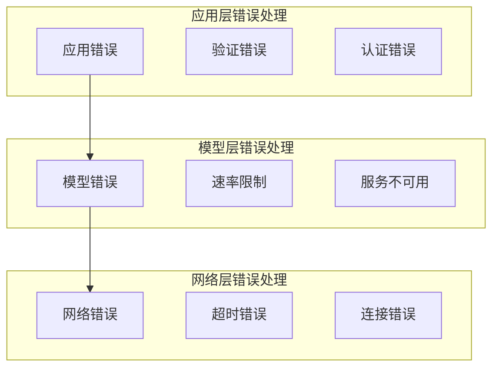

### 重试策略

系统实现了智能的重试机制：

1. **指数退避**：使用指数退避算法减少服务器压力
2. **条件重试**：仅对可重试的错误进行重试
3. **最大重试次数**：防止无限重试导致资源浪费
4. **错误分类**：根据错误类型决定是否重试

### 故障转移机制

当主模型不可用时，系统能够自动切换到备用模型：

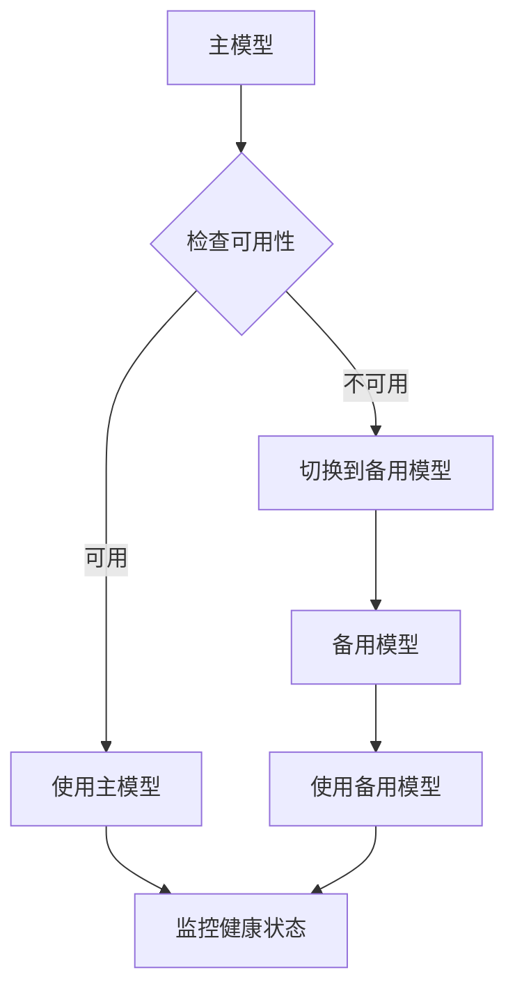

**章节来源**
- [openai_model.py](file://src/models/openai_model.py#L239-L280)

## 扩展性与版本管理

### 向后兼容性保证

系统设计确保了良好的向后兼容性：

1. **接口稳定性**：核心方法签名保持稳定
2. **默认参数**：新版本提供合理的默认值
3. **渐进式升级**：允许新旧功能共存
4. **废弃通知**：提前通知即将废弃的功能

### 版本控制策略

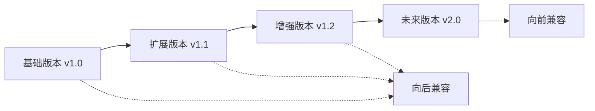

### 新模型集成流程

添加新模型的标准化流程：

1. **继承BaseModel**：实现必需的抽象方法
2. **定义AVAILABLE_MODELS**：列出支持的模型变体
3. **注册到工厂**：在MODEL_IMPLEMENTATIONS中添加映射
4. **测试验证**：确保符合接口规范
5. **文档更新**：更新相关文档和示例

**章节来源**
- [model_factory.py](file://src/models/model_factory.py#L25-L40)

## 最佳实践指南

### 模型选择建议

根据不同的使用场景选择合适的模型：

| 场景 | 推荐模型 | 理由 |
|------|----------|------|
| 快速响应 | Claude Haiku, Groq Mixtral | 低延迟，高吞吐量 |
| 复杂推理 | GPT-5, DeepSeek Reasoner | 强大的推理能力 |
| 代码生成 | DeepSeek Coder | 专门优化的代码模型 |
| 本地部署 | Ollama Llama3.2 | 隐私保护，成本效益 |
| 多模态任务 | Gemini 2.5 Pro | 支持图像、音频、视频 |

### 性能优化技巧

1. **合理设置max_tokens**：避免不必要的token消耗
2. **温度调节**：根据任务类型调整随机性
3. **并发控制**：使用适当的并发数量
4. **缓存策略**：利用非缓存特性避免重复计算

### 安全与隐私考虑

1. **API密钥管理**：使用环境变量存储敏感信息
2. **输入验证**：过滤可能有害的输入内容
3. **输出审查**：对生成内容进行适当审查
4. **审计日志**：记录关键操作以便追溯

### 调试与监控

1. **详细日志**：启用详细的调试输出
2. **性能监控**：跟踪响应时间和成功率
3. **错误追踪**：收集和分析错误模式
4. **使用统计**：监控token使用和成本

**章节来源**
- [README.md](file://src/models/README.md#L131-L148)

## 结论

Moon Dev的基础模型接口系统通过精心设计的抽象层，成功地统一了多种AI服务提供商的访问方式。该系统不仅提供了强大的功能和灵活性，还确保了良好的可维护性和扩展性。通过遵循本文档中的指导原则和最佳实践，开发者可以有效地利用这一接口系统构建高质量的AI驱动应用程序。

接口设计的核心优势在于：
- **统一的编程模型**：简化了多模型应用的开发
- **强大的错误处理**：提高了系统的可靠性和容错能力
- **灵活的扩展机制**：支持新模型的快速集成
- **完善的监控体系**：便于运维和性能优化

随着AI技术的不断发展，这一接口系统将继续演进，为开发者提供更加强大和便捷的工具来构建下一代AI应用。