# 模型工厂

<cite>
**本文档中引用的文件**
- [model_factory.py](file://src/models/model_factory.py)
- [base_model.py](file://src/models/base_model.py)
- [__init__.py](file://src/models/__init__.py)
- [claude_model.py](file://src/models/claude_model.py)
- [openai_model.py](file://src/models/openai_model.py)
- [groq_model.py](file://src/models/groq_model.py)
- [deepseek_model.py](file://src/models/deepseek_model.py)
- [gemini_model.py](file://src/models/gemini_model.py)
- [ollama_model.py](file://src/models/ollama_model.py)
- [xai_model.py](file://src/models/xai_model.py)
- [config.py](file://src/config.py)
- [README.md](file://src/models/README.md)
</cite>

## 目录
1. [简介](#简介)
2. [项目结构](#项目结构)
3. [核心组件](#核心组件)
4. [架构概览](#架构概览)
5. [详细组件分析](#详细组件分析)
6. [依赖关系分析](#依赖关系分析)
7. [性能考虑](#性能考虑)
8. [故障排除指南](#故障排除指南)
9. [结论](#结论)

## 简介

Moon Dev的模型工厂是一个高度集成的AI模型管理解决方案，提供了统一的接口来管理多个AI提供商的模型。该系统采用工厂模式设计，支持动态加载和切换不同的AI模型，包括Claude、OpenAI、Groq、DeepSeek、Ollama、Google Gemini、xAI等。通过单例模式确保全局唯一实例，并提供完整的错误处理和监控功能。

## 项目结构

模型工厂模块位于`src/models/`目录下，包含以下关键文件：

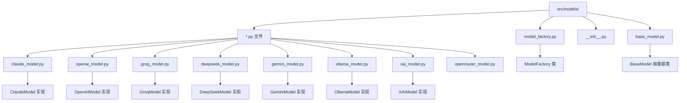

**图表来源**
- [model_factory.py](file://src/models/model_factory.py#L1-L261)
- [base_model.py](file://src/models/base_model.py#L1-L73)
- [__init__.py](file://src/models/__init__.py#L1-L23)

**章节来源**
- [model_factory.py](file://src/models/model_factory.py#L1-L50)
- [base_model.py](file://src/models/base_model.py#L1-L30)

## 核心组件

### ModelFactory 类

ModelFactory是整个模型工厂的核心，实现了工厂模式和单例模式：

- **工厂模式**：负责创建和管理不同类型的AI模型实例
- **单例模式**：确保全局只有一个ModelFactory实例
- **自动初始化**：根据环境变量自动初始化可用的模型
- **动态加载**：支持运行时切换和重新初始化模型

### BaseModel 抽象基类

为所有AI模型提供统一的接口规范：

- **标准化响应格式**：使用ModelResponse数据类
- **抽象方法**：定义必须实现的方法（initialize_client, generate_response, is_available）
- **通用功能**：提供基础的响应生成逻辑

### 具体模型实现

每个AI提供商都有专门的实现类，继承自BaseModel并实现特定的功能：

- **ClaudeModel**：Anthropic的Claude系列模型
- **OpenAIModel**：OpenAI的各种模型（GPT-4、O1、O3等）
- **GroqModel**：Groq的高性能推理模型
- **DeepSeekModel**：DeepSeek的推理和代码模型
- **GeminiModel**：Google Gemini模型
- **OllamaModel**：本地运行的Ollama模型
- **XAIModel**：xAI的Grok模型

**章节来源**
- [model_factory.py](file://src/models/model_factory.py#L25-L80)
- [base_model.py](file://src/models/base_model.py#L15-L73)

## 架构概览

模型工厂采用分层架构设计，确保了良好的可扩展性和维护性：

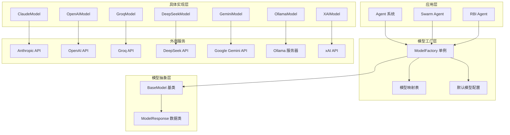

**图表来源**
- [model_factory.py](file://src/models/model_factory.py#L25-L50)
- [base_model.py](file://src/models/base_model.py#L15-L30)

## 详细组件分析

### ModelFactory 设计模式实现

#### 工厂模式实现

ModelFactory通过以下机制实现工厂模式：

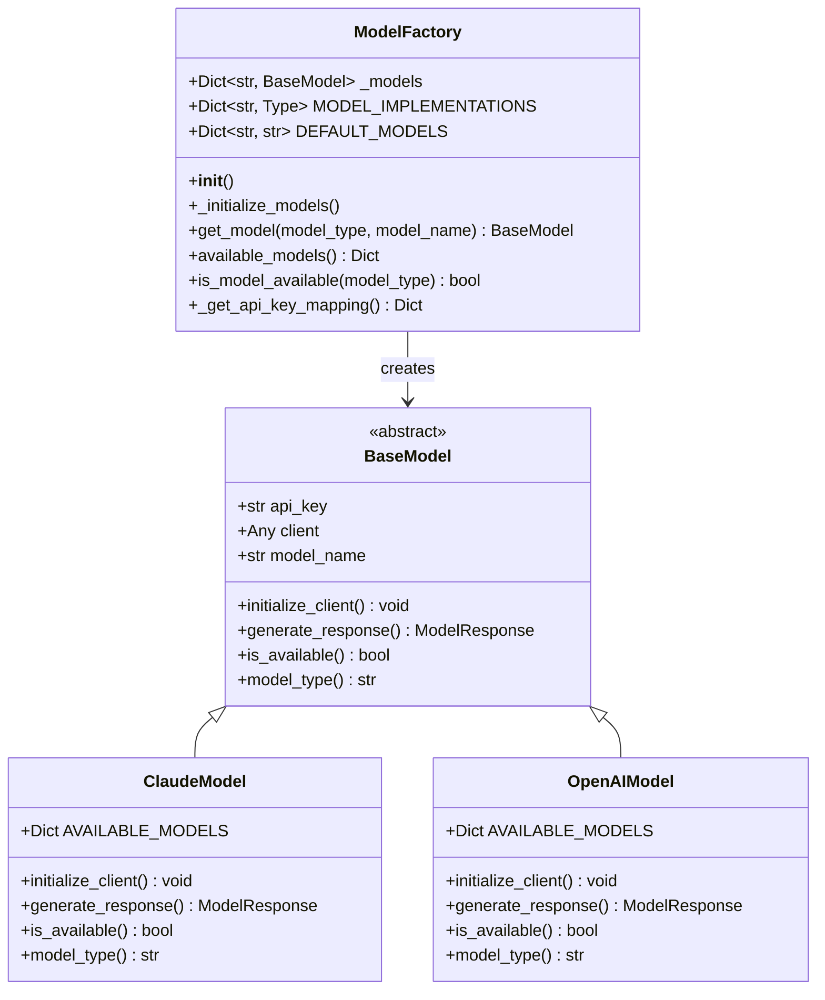

**图表来源**
- [model_factory.py](file://src/models/model_factory.py#L25-L80)
- [base_model.py](file://src/models/base_model.py#L15-L73)
- [claude_model.py](file://src/models/claude_model.py#L10-L76)
- [openai_model.py](file://src/models/openai_model.py#L10-L441)

#### 单例模式实现

通过在模块级别创建单例实例来确保全局唯一性：

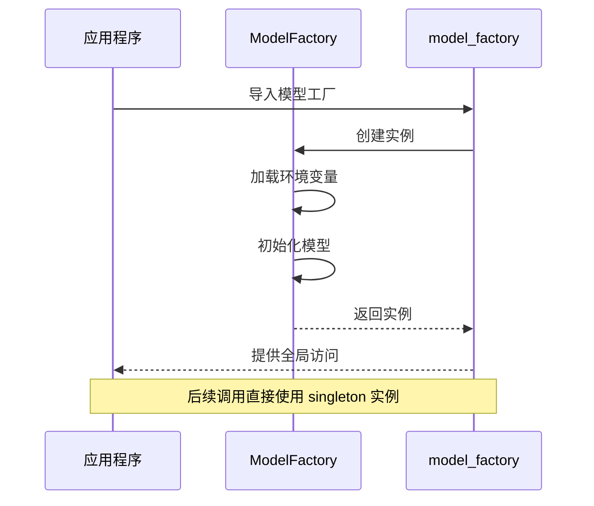

**图表来源**
- [model_factory.py](file://src/models/model_factory.py#L250-L261)

#### 自动初始化机制

ModelFactory具有智能的自动初始化能力：

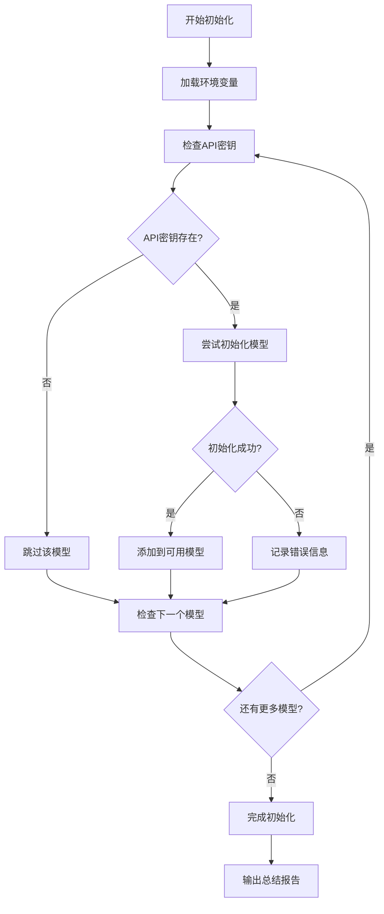

**图表来源**
- [model_factory.py](file://src/models/model_factory.py#L55-L170)

**章节来源**
- [model_factory.py](file://src/models/model_factory.py#L55-L170)

### BaseModel 统一接口规范

BaseModel定义了所有AI模型必须遵循的标准接口：

#### 标准化响应格式

ModelResponse数据类提供了统一的响应格式：

| 字段 | 类型 | 描述 |
|------|------|------|
| content | str | 模型生成的文本内容 |
| raw_response | Any | 原始响应对象，用于调试和高级功能 |
| model_name | str | 使用的模型名称 |
| usage | Dict | 使用统计信息（可选） |

#### 抽象方法定义

每个模型实现都必须提供以下抽象方法：

| 方法 | 参数 | 返回值 | 描述 |
|------|------|--------|------|
| initialize_client | **kwargs | None | 初始化客户端连接 |
| generate_response | system_prompt, user_content, temperature, max_tokens | ModelResponse | 生成AI响应 |
| is_available | 无 | bool | 检查模型是否可用 |
| model_type | 无 | str | 返回模型类型标识符 |

**章节来源**
- [base_model.py](file://src/models/base_model.py#L15-L73)

### 具体模型实现分析

#### ClaudeModel 实现

ClaudeModel专门处理Anthropic的Claude系列模型：

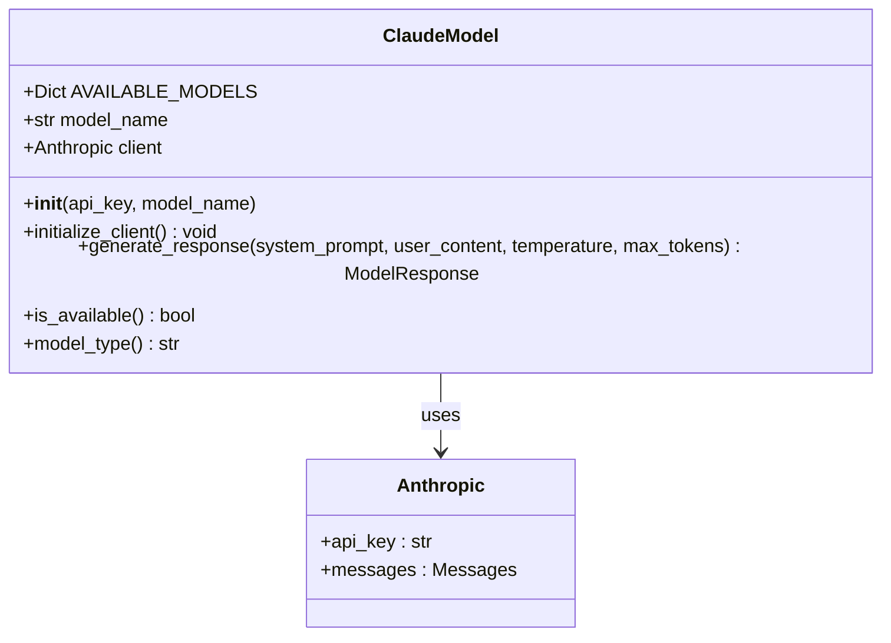

**图表来源**
- [claude_model.py](file://src/models/claude_model.py#L10-L76)

#### OpenAIModel 高级实现

OpenAIModel是最复杂的实现之一，支持多种GPT模型变体：

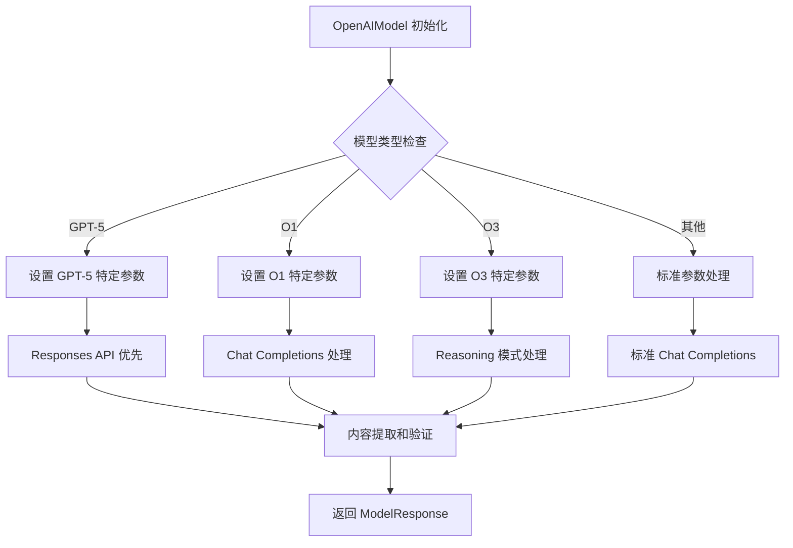

**图表来源**
- [openai_model.py](file://src/models/openai_model.py#L100-L441)

#### OllamaModel 本地实现

OllamaModel处理本地运行的大型语言模型：

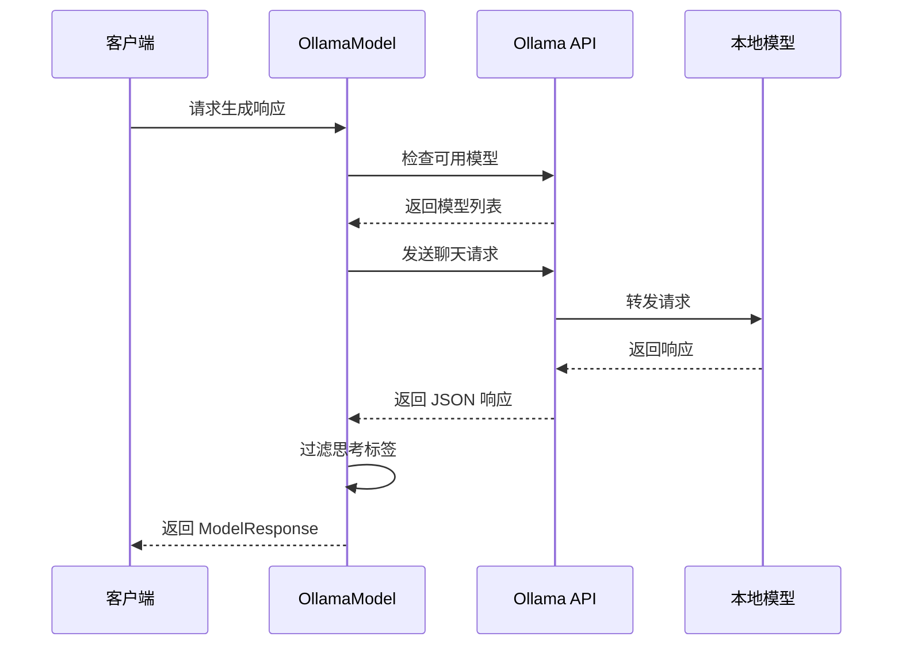

**图表来源**
- [ollama_model.py](file://src/models/ollama_model.py#L80-L185)

**章节来源**
- [claude_model.py](file://src/models/claude_model.py#L10-L76)
- [openai_model.py](file://src/models/openai_model.py#L100-L441)
- [ollama_model.py](file://src/models/ollama_model.py#L80-L185)

### 模型选择策略

#### 默认模型配置

ModelFactory为每种模型类型提供了经过优化的默认配置：

| 模型类型 | 默认模型 | 推荐场景 | 性能特点 |
|----------|----------|----------|----------|
| claude | claude-3-5-haiku-latest | 快速响应任务 | 最快推理速度 |
| groq | mixtral-8x7b-32768 | 高吞吐量处理 | 最高性价比 |
| openai | gpt-4o | 复杂推理任务 | 平衡性能与质量 |
| gemini | gemini-2.5-flash | 多模态任务 | 最新技术 |
| deepseek | deepseek-reasoner | 复杂推理 | 强大推理能力 |
| ollama | llama3.2 | 本地部署 | 隐私保护 |
| xai | grok-4-fast-reasoning | 快速推理 | 高效推理 |

#### 动态模型切换

系统支持运行时动态切换模型：

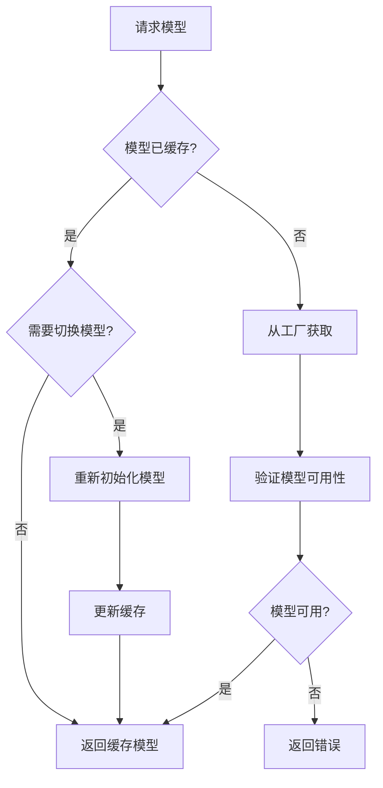

**图表来源**
- [model_factory.py](file://src/models/model_factory.py#L170-L220)

**章节来源**
- [model_factory.py](file://src/models/model_factory.py#L35-L50)
- [model_factory.py](file://src/models/model_factory.py#L170-L220)

## 依赖关系分析

### 模块依赖图

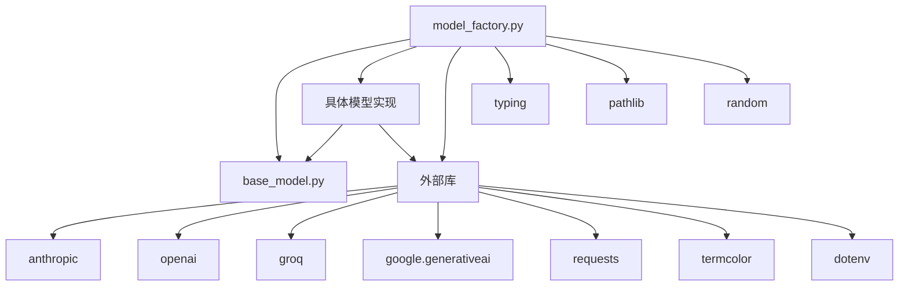

**图表来源**
- [model_factory.py](file://src/models/model_factory.py#L1-L25)
- [base_model.py](file://src/models/base_model.py#L1-L15)

### 循环依赖处理

系统通过以下方式避免循环依赖：

1. **接口分离**：BaseModel作为抽象接口
2. **导入顺序**：按依赖关系正确导入模块
3. **延迟初始化**：使用字符串类型注解避免循环导入

**章节来源**
- [model_factory.py](file://src/models/model_factory.py#L1-L25)
- [base_model.py](file://src/models/base_model.py#L1-L15)

## 性能考虑

### 连接池管理

虽然当前实现没有显式的连接池，但通过以下机制优化性能：

- **单例模式**：避免重复创建工厂实例
- **模型缓存**：缓存已初始化的模型实例
- **懒加载**：按需初始化模型
- **连接复用**：每个模型实例复用其客户端连接

### 超时设置

不同模型实现设置了适当的超时参数：

| 模型类型 | 超时设置 | 用途 |
|----------|----------|------|
| OpenAI | 60秒 | 处理复杂推理任务 |
| Groq | 30秒 | 高速推理 |
| Ollama | 90秒 | 本地模型处理 |
| Claude | 30秒 | 标准API调用 |

### 缓存策略

系统实现了多层缓存机制：

1. **模型实例缓存**：避免重复初始化
2. **响应去重**：通过随机nonce防止缓存
3. **配置缓存**：缓存模型可用性状态

## 故障排除指南

### 常见问题及解决方案

#### API密钥问题

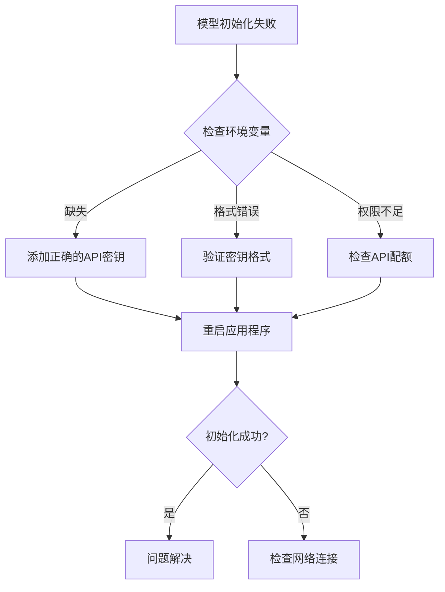

#### 模型不可用

常见的模型不可用原因：

1. **API限制**：检查配额和速率限制
2. **网络问题**：验证网络连接
3. **模型不存在**：确认模型名称正确
4. **服务器问题**：检查提供商服务状态

#### Ollama 服务器问题

Ollama特有的问题排查：

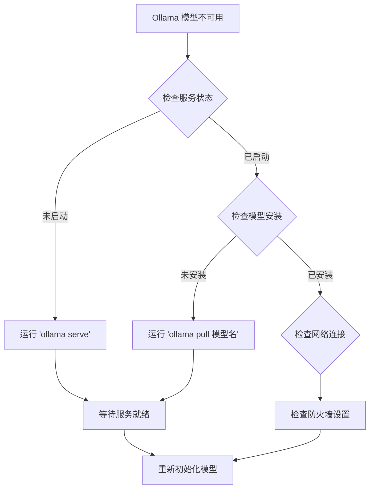

**章节来源**
- [model_factory.py](file://src/models/model_factory.py#L100-L170)
- [ollama_model.py](file://src/models/ollama_model.py#L30-L80)

## 结论

Moon Dev的模型工厂是一个设计精良、功能完备的AI模型管理解决方案。它成功地解决了多AI提供商集成的复杂性，提供了统一的接口和一致的用户体验。通过工厂模式和单例模式的结合使用，系统既保持了灵活性又确保了稳定性。

### 主要优势

1. **统一接口**：所有模型提供一致的API
2. **自动管理**：智能初始化和错误处理
3. **高性能**：优化的连接管理和缓存策略
4. **可扩展性**：易于添加新的AI提供商
5. **可靠性**：完善的错误恢复机制

### 最佳实践建议

1. **合理配置API密钥**：确保所有必需的API密钥都正确设置
2. **监控模型可用性**：定期检查模型的可用状态
3. **优化模型选择**：根据任务需求选择合适的模型
4. **设置适当的超时**：根据网络条件调整超时参数
5. **启用调试日志**：在开发阶段启用详细日志

这个模型工厂为AI驱动的应用程序提供了一个强大而灵活的基础架构，能够适应不断变化的AI生态系统需求。